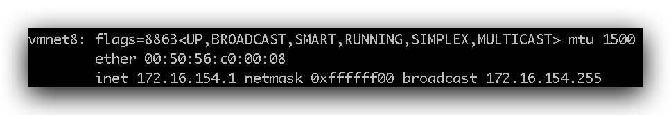

# 0 入门

## 概述

Linux 是一种自由和开放源码的类 UNIX 操作系统，使用 Linux 内核。目前存在着许多不同的 Linux 发行版，可安装在各种各样的电脑硬件设备，从手机、平板电脑、路由器和影音游戏控制台，到桌上型电脑，大型电脑和超级电脑。 Linux 是一个领先的操作系统，世界上运算最快的 10 台超级电脑运行的都是 Linux 操作系统。

Linux 操作系统也是自由软件和开放源代码发展中最著名的例子。只要遵循 GNU 通用公共许可证,任何人和机构都可以自由地使用 Linux 的所有底层源代码，也可以自由地修改和再发布。严格来讲，Linux 这个词本身只表示 Linux 内核，但在实际上人们已经习惯了用 Linux 来形容整个基于 Linux 内核，并且使用 GNU 工程各种工具和数据库的操作系统 (也被称为 GNU/ Linux)。通常情况下，Linux 被打包成供桌上型电脑和服务器使用的 Linux 发行版本。一些流行的主流 Linux 发行版本，包括 Debian (及其衍生版本 Ubuntu)，Fedora 和 OpenSUSE 等。Kernel + Softwares + Tools 就是 Linux Distribution

Linux的版本分为两种：

* **内核版本**：是指在Linus领导下的内核小组开发维护的系统内核的版本号

* **发行版本**：是一些组织和公司根据自己发行版的不同而自定的

目前市面上较知名的发行版有：`Ubuntu`、RedHat、`CentOS`、Debian、Fedora、SuSE、OpenSUSE、TurboLinux、BluePoint、RedFlag、Xterm、SlackWare等。

### Linux 与 Windows 比较

| 比较     | Windows                                                      | Linux                                                        |
| :------- | :----------------------------------------------------------- | :----------------------------------------------------------- |
| 界面     | 界面统一，外壳程序固定所有 Windows 程序菜单几乎一致，快捷键也几乎相同 | 图形界面风格依发布版不同而不同，可能互不兼容。GNU/Linux 的终端机是从 UNIX 传承下来，基本命令和操作方法也几乎一致。 |
| 驱动程序 | 驱动程序丰富，版本更新频繁。默认安装程序里面一般包含有该版本发布时流行的硬件驱动程序，之后所出的新硬件驱动依赖于硬件厂商提供。对于一些老硬件，如果没有了原配的驱动有时很难支持。另外，有时硬件厂商未提供所需版本的 Windows 下的驱动，也会比较头痛。 | 由志愿者开发，由Linux核心开发小组发布，很多硬件厂商基于版权考虑并未提供驱动程序，尽管多数无需手动安装，但是涉及安装则相对复杂，使得新用户面对驱动程序问题（是否存在和安装方法）会一筹莫展。但是在开源开发模式下，许多老硬件尽管在 Windows 下很难支持的也容易找到驱动。HP、Intel、AMD 等硬件厂商逐步不同程度支持开源驱动，问题正在得到缓解。 |
| 使用     | 使用比较简单，容易入门。图形化界面对没有计算机背景知识的用户使用十分有利。 | 图形界面使用简单，容易入门。文字界面，需要学习才能掌握。     |
| 学习     | 系统构造复杂、变化频繁，且知识、技能淘汰快，深入学习困难。   | 系统构造简单、稳定，且知识、技能传承性好，深入学习相对容易。 |
| 软件     | 每一种特定功能可能都需要商业软件的支持，需要购买相应的授权。 | 大部分软件都可以自由获取，同样功能的软件选择较少。           |


### 安装

此处使用 Ubuntu 18.04

*   选择Use An Entire Disk And Set Up LVM，以便后续扩容
*   将磁盘可用空间使用完，即调整 lv 分区（逻辑卷）大小
*   勾选 Install OpenSSH server
*   修改 mirror，参考阿里云镜像站https://opsx.alibaba.com/mirror


### 配置

#### hostname

-   修改 `/etc/cloud/cloud.cfg` 防止重启后主机名还原

    ```cfg
    vim /etc/cloud/cloud.cfg
    
    # 该配置默认为 false，修改为 true 即可
    preserve_hostname: true
    ```

-   修改主机名

    ```sh
    # 查看主机名
    root@ubuntu:/home/conanan# hostnamectl
       Static hostname: ubuntu
             Icon name: computer-vm
               Chassis: vm
            Machine ID: 7401befbdbaf4b3c9bfd8356535bd75f
               Boot ID: 4acdda6f0f4540f2b906d8a2cd4a58fe
        Virtualization: vmware
      Operating System: Ubuntu 18.04.3 LTS
                Kernel: Linux 4.15.0-70-generic
          Architecture: x86-64
    
    # 修改主机名
    hostnamectl set-hostname deployment
    
    # 配置 hosts，和本机 IP 一致
    cat >> /etc/hosts << EOF
    172.16.154.11 deployment
    EOF
    ```

    

#### IP

需要配置固定 IP，步骤如下（暂时测试是 OK 的）：

1.  在 iTerm2 中输入`ifconfig`查看`vmnet8`即 NAT 模式的 IP 段，如下图

    

2.  在 Linux 中配置固定 IP

    Ubuntu 从17.10开始，已放弃在 /etc/network/interfaces 里固定 IP 的配置，即使配置也不会生效，而是改成 netplan 方式 ，配置写在 /etc/netplan/01-netcfg.yaml 或者类似名称的 yaml 文件里。修改该文件：

    ```yaml
    network: # 网络
      ethernets: # 网卡
        ens33:   # 网卡名称，根据 Linux 发行版不同也会随之改变，可以使用 ifconfig 来确定
          dhcp4: true # DHCP 协议，动态分配 IP，需改为 true，否则 ping 不通外网
          dhcp6: true # DHCP 协议，动态分配 IP
          addresses: [172.16.154.10/24]   # 本机IP/子网掩码（确定局域网内主机 IP 范围）
          
          # 如下配置后会 ping 不通外网，暂时不知道原因
          gateway4: 172.16.154.1   # 网关（通过网关再通过路由器连接网络）
          nameservers:
              addresses: [172.16.154.1]   # DNS，可不配置
      version: 2 # 可不配置
    ```

3.  应用配置

    ```bash
    netplan apply
    ```

4.  有可能需要关闭防火墙，具体命令查看后续章节


#### DNS

```sh
# 取消 DNS 行注释，并增加 DNS 配置如：114.114.114.114，修改后重启下计算机
vim /etc/systemd/resolved.conf
```


 

### 目录结构


| 目录                          | 说明                                                         |
| :---------------------------- | :----------------------------------------------------------- |
| **bin**(binaries)             | 存放二进制可执行文件(`ls`, `cat`, `mkdir` 等)                |
| sbin                          | 存放二进制可执行文件，只有 root 才能访问                     |
| boot                          | 存放用于系统引导时使用的各种文件                             |
| dev(devices)                  | 用于存放设备文件，驱动程序                                   |
| **etc**(etcetera)             | 存放系统配置文件                                             |
| home                          | 存放所有用户文件的根目录                                     |
| root                          | 超级用户目录                                                 |
| lib(library)                  | 存放跟文件系统中的程序运行所需要的共享库及内核模块           |
| mnt(mount)                    | 系统管理员安装临时文件系统的安装点                           |
| opt                           | 额外安装的可选应用程序包所放置的位置                         |
| proc                          | 虚拟文件系统，存放当前内存的映射                             |
| tmp(temporary)                | 用于存放各种临时文件                                         |
| **usr**(unix shared resource) | 用于存放共享的系统资源，如应用程序，比较重要的目录 `/usr/local` 本地管理员软件安装目录 |
| **var**(variable)             | 用于存放运行时需要改变数据的文件，变量                       |
| ...                           |                                                              |

>   Linux中，前缀带`.`的都是隐藏目录或文件
>
>   经常使用 `man command` 或 `command --help`
>
>   大多数命令的参数可以只写`-`和`首字母`


### 远程控制管理 SSH

传统的网络服务程序，FTP、POP、Telnet 本质上都是不安全的，因为它们在网络上通过明文传送口令和数据，这些数据非常容易被截获。SSH 叫做 `Secure Shell`。通过 SSH，可以把传输数据进行加密，预防攻击，传输的数据进行了压缩，可以加快传输速度。

#### OpenSSH

SSH 是芬兰一家公司开发。但是受到版权和加密算法限制，现在很多人都使用 OpenSSH。OpenSSH 是 SSH 的替代软件，免费。OpenSSH 由客户端和服务端组成。

-   **基于口令的安全验证：** 知道服务器的帐号密码即可远程登录，口令和数据在传输过程中都会被加密。
-   **基于密钥的安全验证：** 此时需要在创建一对密钥，把公有密钥放到远程服务器上自己的宿主目录中，而私有密钥则由自己保存。

一般安装 Ubuntu 时会勾选自动安装 OpenSSH，若没有可按如下步骤完成安装：

```bash
# 检查软件是否安装
sudo apt-cache policy openssh-client openssh-server
# 安装服务端
sudo apt install openssh-server
# 安装客户端
sudo apt install openssh-client
```

OpenSSH 服务器的主要配置文件为 `/etc/ssh/sshd\_config`，几乎所有的配置信息都在此文件中。

Windows 下的 SSH 软件有：XShell、FinalShell，itrem

macOS 下的可以使用iTerm，自己配置


#### SSH 连接

*   `ssh conanan@123.11.11.11`
*   `ssh -l conanan -p 22 123.11.11.11`
*   传输文件：`scp D:\zookeeper.tar.gz conanan@123.11.11.11:/root/也可以指定文件名称扩展名`

    可反过来

*   SecureCRT软件：按`Alt+P`可打开sftp来传输文件，如`put d:\zookeeper-3.4.6.tar.gz`


## 文件管理

>   Linux 中所有东西都是**文件**。如下笔记中文件如非特指，都代表文件和目录

### 创建目录

*   `mkdir dirName`
    *   `-p  --parents` ：创建级联路径

### 删除目录

*   `rmdir dirName`
    *   `-p  --parents` ：删除级联路径

### 当前目录

*   `pwd`

### 切换目录

*   `cd`：`~`(进入用户主目录)；`/`(进入根目录)；`..`(上一层)；`-`(上一个目录)；


### 树状图`tree`

*   `tree`用于以树状图列出目录的所有内容（需安装，用处不大）


### 查找文件

*   `find name`：若是目录名，则列出其下所有文件和目录。文件名需带后缀

### 新增文件

*   `touch fileName`  生成一个空文件

*   **重定向输出**
    *   `echo 666 > 1.txt`：重新生成一个带内容文件，覆盖原有内容
    *   `echo 666 >> 1.txt`：给文件追加内容
    
*   `tee`：可直接复制

    ```bash
    tee /etc/docker/daemon.json <<-'EOF'
    {
      "registry-mirrors": ["https://1c0pd0qz.mirror.aliyuncs.com"]
    }
    EOF
    ```

    

### 查看文件

*   `ls [fileName]`查看当前目录下文件和目录列表

    *   `-a` 列出当前目录所有文件，包含隐藏文件
    *   `-l` 列出文件的详细信息（如类型、权限等），可简写为`ll`，参数同`ls`
    *   `-h`友好显示文件大小，带有单位

*   `stat`：显示**指定文件**的相关信息,比 ls 命令显示内容更多

    ```
    ubuntu@VM-0-3-ubuntu:~/Documents/test$ stat a.txt
      File: a.txt
      Size: 20        	Blocks: 8          IO Block: 4096   regular file
    Device: fc01h/64513d	Inode: 271180      Links: 3
    Access: (0664/-rw-rw-r--)  Uid: (  500/  ubuntu)   Gid: (  500/  ubuntu)
    Access: 2019-11-24 17:38:06.531174819 +0800
    Modify: 2019-11-24 19:18:12.014184685 +0800
    Change: 2019-11-24 19:18:12.018184679 +0800
     Birth: -
    ```

*   ~~`dir`查看当前目录下文件和目录列表，但是无高亮~~

*   `cat fileName` 查看文件全部内容（不能查看目录）

*   `more fileName`分页查看文件，回车下一行，空格下一页（不能查看目录）

*   `less`分页查看文件，回车下一行，空格下一页，支持pgup、pgdn（不能查看目录）

*   `head fileName`，从头部开始查看文件（不能查看目录）

    *   `-nx` 显示**前x行**
    *   `-f` 动态查看，跟踪输出（阻塞），`tail` 更有用

*   `tail fileName`，从尾部开始查看文件（不能查看目录）

    *   `-nx` 显示**后x行**
    *   `-f` 动态查看，跟踪输出（阻塞）

### 删除文件

*   `rm`
    *   `-r`  同时删除该目录下的所有文件，递归删除
    *   `-f`  强制删除文件或目录，不带询问

### 复制文件

*   `cp`：**复制**，需要指定源文件名与目标文件名（若是**目录名**则只复制源文件）
    *   `-r`  同时复制该目录下的所有文件，递归复制
    *   `-f`  强制复制文件或目录，不带询问

### 移动文件

*   `mv`：**移动**或者**重命名**
    *   `-r`  同时移动该目录下的所有文件，递归移动
    *   `-f`  强制移动文件或目录，不带询问


### 查找字符串`grep`

*   `grep`在指定的**文本**文件中查找指定的**字符串**，一般同管道一起使用

    语法`grep [选项]... PATTERN [FILE]...`

    ```bash
    grep doc yarn.lock # 在文件中查找 doc 字符串
    ```

    ```bash
    cat yarn.lock | grep doc
    ```

    *   `–color`高亮显示（暂时不会使用，有问题）
    *   `-A5`当前行和后5行，`-b5`当前行和前5行

    *   ...


### 打包解包—`tar`

>   归档

*   `tar [-cxzjvf] 压缩打包文档的名称 欲打包目录或文件`

    *   `-z`  是否需要用 gzip 压缩、解压，后缀微`.gz`
    *   `-j`  是否需要用 bzip2 压缩、解压，后缀为
    *   `-x`：解包tar文件（归档文件）
    *   `-c`：打包成一个新tar文件（归档文件）
    *   `-v`：显示运行过程的信息
    *   `-f`：指定文件名（归档文件名）

    *   `-t`：查看压缩文件的内容

* 例子

    *   **打包**：`tar –cvf xxx.tar ./*`
    *   **打包并且压缩**：`tar –zcvf xxx.tar.gz ./*`
    *   **解压缩**：`tar –xvf xxx.tar`、`tar -zxvf xxx.tar.gz -C /usr/aaa`(`-C`指定路径)


*   gzip

    | 命令 | 语法                               | 参数 | 参数说明                                                     |
    | :--- | :--------------------------------- | :--- | :----------------------------------------------------------- |
    | gzip | gzip [选项] 压缩（解压缩）的文件名 |      | 该命令压缩文件后缀为 gz                                      |
    |      |                                    | -d   | 解压缩                                                       |
    |      |                                    | -l   | 对每个压缩文件，显示压缩文件的大小，未压缩文件的大小，压缩比，未压缩文件的名字 |
    |      |                                    | -v   | 对每一个压缩和解压的文件，显示文件名和压缩比                 |
    |      |                                    | -num | 用指定的数字num调整压缩的速度，-1或--fast表示最快压缩方法（低压缩比），-9或--best表示最慢压缩方法（高压缩比）。系统缺省值为6 |

*   bzip2

    | 命令  | 语法         | 参数 | 参数说明                                                     |
    | :---- | :----------- | :--- | :----------------------------------------------------------- |
    | bzip2 | bzip2 [-cdz] |      | 该命令压缩文件后缀为 bz2                                     |
    |       |              | -d   | 解压缩                                                       |
    |       |              | -z   | 压缩参数                                                     |
    |       |              | -num | 用指定的数字num调整压缩的速度，-1或--fast表示最快压缩方法（低压缩比），-9或--best表示最慢压缩方法（高压缩比）。系统缺省值为6 |

*   unzip（需安装）

    用于解压 zip 包


## 权限管理

### 概述


| 属主(user) |      |      | 属组(group) |      |      | 其他用户 |      |      |
| :--------: | :--: | :--: | :---------: | :--: | :--: | :------: | :--: | :--: |
|     r      |  w   |  x   |      r      |  w   |  x   |    r     |  w   |  x   |
|     4      |  2   |  1   |      4      |  2   |  1   |    4     |  2   |  1   |

`ls -al`或`ll -a`或`ll fileName`可以显示文件或者目录的详细信息。

```b
-rw-rw-r-- 3 ubuntu ubuntu   14 Nov 24 17:38 a.txt
```

显示信息包括：文件类型，文件权限，文件的用户，文件的所属组，文件的大小，文件的创建时间，文件的名称


### 文件类型及标识

Linux三种文件类型

* 普通文件： 包括文本文件、数据文件、可执行的二进制程序文件等
* 目录文件： Linux系统把目录看成是一种特殊的文件，利用它构成文件系统的树型结构
* 设备文件： Linux系统把每一个设备都看成是一个文件

**文件类型标识**

* **普通文件**`-`
* **目录**`d`
* **软链接**`l`：进入etc可以查看，相当于快捷方式
* 串行端口字符设备文件`c` 
* 块设备文件`b` 
* 套接字`s`
* 命名管道`p`


### 权限

#### chmod

变更文件或目录的访问权限

**数字设定法**

-   0 表示没有任何权限

-   1 表示有可执行权限 = `x`

-   2 表示有可写权限 = `w`

-   4 表示有可读权限 = `r`

    例如：`chmod 755 a.txt`


**普通设定法**

 `chmod [who] [+ | - | =] [mode] 文件名`

-   who：表示操作对象可以是以下字母的一个或者组合

    -   `u`：用户 user
    -   `g`：用户组 group
    -   `o`：表示其他用户
    -   `a`：表示所有用户，系统默认的（可以不指定 a）

-   操作符号

    -   `+`：表示添加某个权限
    -   `-`：表示取消某个权限
    -   `=`：赋予给定的权限，取消文档以前的所有权限

-   mode：表示可执行的权限，可以是 `r`、`w`、`x`

-   文件名：可以是空格分开的文件列表

    例如：`chmod u=rwx,g=rx,o=rx a.txt`或 `chmod x a.txt`给用户组其他用户都添加 x 权限


#### chown

是 change owner 的意思，主要作用就是改变文件或者目录所有者，所有者包含用户和用户组

-   `chown [-R] 用户名称 文件或者目录`

-   `chown [-R] 用户名称 用户组名称 文件或目录`
    -   `-R`：进行递归式的权限更改，将目录下的所有文件、子目录更新为指定用户组权限

    例子

    -   `chown conanan:conanan a.txt`：变更当前的目录或文件的所属用户和组
    -   `chown -R conanan:conanan dir`：变更目录中的所有的子目录及文件的所属用户和组


### 连接数

指有多少个文件指向同一个索引节点


### 文件所属用户和所属组

就是文档属于哪个用户和用户组。文件所属用户和组是可以更改的


### 文件大小

默认是 bytes，可以用`-h`来友好显示


### 文件上次修改时间时间


### 文件名


## 其他命令

### 管道 `|`

将一个命令的输出用作另一个命令的输入

*   `ls --help | more`：分页查询帮助信息


### 命令执行控制 `&&`

命令之间使用 && 连接，实现逻辑与的功能。

*   `mkdir test && cd test`


### 软链接—`ln`

*   `ln`建立软链接，类似快捷方式（建立的是引用，修改一处另一处也改变）：`ln a.txt t.txt`


## 用户和组管理

Linux 操作系统是一个多用户操作系统，它允许多用户同时登录到系统上并使用资源。系统会根据账户来区分每个用户的文件，进程，任务和工作环境，使得每个用户工作都不受干扰。


### 用户账户说明

-   **普通用户：** 普通用户在系统上的任务是进行普通操作
-   **超级管理员：** 管理员在系统上的任务是对普通用户和整个系统进行管理。对系统具有绝对的控制权，能够对系统进行一切操作。用 root 表示，root 用户在系统中拥有最高权限，默认下 Ubuntu 用户的 root 用户是不能登录的。
-   **安装时创建的系统用户：** 此用户创建时被添加到 admin 组中，在 Ubuntu 中，admin 组中的用户默认是可以使用 `sudo` 命令来执行只有管理员才能执行的命令的。如果不使用 `sudo` 就是一个普通用户。

>   标识符如\$前带`~`为用户主目录：`conanan@Conanan:~$`；带`/`为根目录


### 组账户说明

-   **私有组：** 当创建一个用户时没有指定属于哪个组，Linux 就会建立一个**与用户同名的私有组**，此私有组只含有该用户。
-   **标准组：** 当创建一个用户时可以选定一个标准组，如果一个用户同时属于多个组时，登录后所属的组为主组，其他的为附加组。


### 账户管理常用命令

#### 使用 Root 用户

在实际生产操作中，我们基本上都是使用超级管理员账户操作 Linux 系统，也就是 Root 用户，Linux 系统默认是关闭 Root 账户的，我们需要为 Root 用户设置一个初始密码以方便我们使用。

*   设置 Root 账户密码

    ```bash
    sudo passwd root
    ```

*   切换到 Root

    ```bash
    su
    ```

*   切换到其他用户

    ```bash
    su conanan
    ```

*   设置允许远程登录 Root

    ```bash
    vi /etc/ssh/sshd_config
    
    # Authentication:
    #PermitRootLogin without-password     # 注释此行
    PermitRootLogin yes   # 加入此行
    
    # 重启服务
    service ssh restart
    ```


#### 增加用户

`useradd username`：添加sername 用户

*   `-u`：UID号
*   `-p`：口令
*   `-g`：分组
*   `-s`：SHELL
*   `-d`：用户目录

​	如：`useradd conanan` 增加用户名为 conanan 的账户

​			`useradd test -d /home/test -g public`  指定用户home目录、指定组

>   创建一个新用户时，若没有指定他所属于的组，就建立一个和该用户同名的私有组


#### 修改用户

`usermod username` 

*   `-u`：UID号

*   `-p`：新口令

*   `-g`：分组

*   `-s`：SHELL

*   `-d`：用户目录

*   `-l`：新登录名

*   `-L`：锁定用户账号密码

*   `-U`：解锁用户账号

    如：`usermod -u 1024 -g group2 -G root conanan`

    将 conanan 用户 uid 修改为 1024，默认组改为系统中已经存在的 group2，并且加入到系统管理员组


#### 删除用户

`userdel username`

*   `-r`：删除账号时同时删除目录，不添加此参数时只将只删除用户

    如：`userdel -r conanan`

    删除用户名为 conanan 的账户并同时删除 conanan 的用户目录


#### 口令维护

`passwd username`：设置用户口令

*   `-l username`：锁定用户账户
*   `-u username`：解锁用户账户
*   `-d username`：删除账户口令
*   `-d username groupname`：将用户从指定组中删除
*   `-a username groupname`：将指定用户添加到指定组
*   `-A username groupname`：将用户指定为组的管理员


#### 组账户维护

`groupadd groupname`：创建新组

*   `-g`：指定组GID

`groupmod groupname`：修改组

*   `-g`：更改组的GID
*   `-n`：更改组账户名

`groupdel groupname`：删除指定组账户，如果该组有用户成员，必须先删除用户才能删除组


#### 用户和组状态

*   `su username`：切换用户账户

    `su - username`：切换用户账户，并且将环境也切换到username用户的环境（推荐使用）

*   `id username`：显示用户的UID，GID

*   `whoami`：显示当前用户名称

*   `groups`：显示用户所属组


### 账户系统文件说明

#### /etc/passwd

用户文件。每一行代表一个账号，众多账号是系统正常运行所必须的，例如 bin，nobody 每行定义一个用户账户，此文件对所有用户可读。每行账户包含如下信息：

`root:x:0:0:root:/root:/bin/bash`

-   **用户名：** 就是账号，用来对应 UID，root UID 是 0。
-   **口令：** 密码，早期 UNIX 系统密码存在此字段，由于此文件所有用户都可以读取，密码容易泄露，后来这个字段数据就存放到 /etc/shadow 中，这里只能看到 X。
-   **用户标示号（UID）：** 系统内唯一，root 用户的 UID 为 0，普通用户从 1000 开始，1-999 是系统的标准账户，500-65536 是可登陆账号。
-   **组标示号（GID）：** 与 /etc/group 相关用来规定组名和 GID 相对应。
-   **注释：** 注释账号
-   **宿主目录（主文件夹）：** 用户登录系统后所进入的目录 root 在 /root/itcast
-   **命令解释器（shell）：** 指定该用户使用的 shell ，默认的是 /bin/bash


#### /etc/shadow

密码文件。为了增加系统的安全性，用户口令通常用 shadow passwords 保护。只有 root 可读。每行包含如下信息：

`root:$6$Reu571.V$Ci/kd.OTzaSGU.TagZ5KjYx2MLzQv2IkZ24E1.yeTT3Pp4o/yniTjus/rRaJ92Z18MVy6suf1W5uxxurqssel.:17465:0:99999:7:::`

-   **账号名称：** 需要和 /etc/passwd 一致。
-   密码：经过加密，虽然加密，但不表示不会被破解，该文件默认权限如下：
    -   -rw------- 1 root root 1560 Oct 26 17:20 passwd-
    -   只有root能都读写
-   **最近修改密码日期：** 从1970-1-1起，到用户最后一次更改口令的天数
-   **密码最小时间间隔：** 从1970-1-1起，到用户可以更改口令的天数
-   **密码最大时间间隔：** 从1970-1-1起，必须更改的口令天数
-   **密码到期警告时间：** 在口令过期之前几天通知
-   **密码到期后账号宽限时间**
-   **密码到期禁用账户时间：** 在用户口令过期后到禁用账户的天数
-   **保留**


#### /etc/group

用户组的配置文件

`root:x:0:`

-   **用户组名称**
-   **用户组密码：** 给用户组管理员使用，通常不用
-   **GID：** 用户组的ID
-   **此用户支持的账号名称：** 一个账号可以加入多个用户组，例如想要 itcast 加入 root 这个用户组，将该账号填入该字段即可 `root:x:0:root`, icast 将用户进行分组是 Linux 对用户进行管理及控制访问权限的一种手段。一个中可以有多个用户，一个用户可以同时属于多个组。该文件对所有用户可读。


#### /etc/gshadow

该文件用户定义用户组口令，组管理员等信息只有root用户可读。

`root:\*::`

-   **用户组名**
-   **密码列**
-   **用户组管理员的账号**
-   **用户组所属账号**


## 系统管理

### 网络

*   `ifconfig`：显示网络接口信息

    *   `ifconfig eth0 up` 启用eth0网卡
    *   `ifconfig eth0 down`停用eth0网卡

*   `ping`：测试网络的连通性，IPV6可使用`ping6`

*   `netstat`：显示网络状态信息

    `netstat -an | grep 3306` 查询3306端口占用情况


### 防火墙

*   查看端口开启状态 `sudo ufw status`
*   开启某个端口 `sudo ufw allow 8381`
*   禁止某个端口 `sudo ufw delete allow 80`
*   关闭防火墙 `sudo ufw disable`
*   开启防火墙 `sudo ufw enable`
*   重启防火墙 `sudo ufw reload`

### 进程

*   `top`：动态显示当前系统中耗费资源最多的进程、负载等信息，之后会阻塞显示

    ```
    top - 23:15:59 up 18 days, 23:21,  3 users,  load average: 0.04, 0.06, 0.01
    Tasks: 100 total,   1 running,  63 sleeping,   0 stopped,   0 zombie
    %Cpu(s):  0.3 us,  0.7 sy,  0.0 ni, 99.0 id,  0.0 wa,  0.0 hi,  0.0 si,  0.0 st
    KiB Mem :  1877364 total,   162584 free,   236224 used,  1478556 buff/cache
    KiB Swap:        0 total,        0 free,        0 used.  1447932 avail Mem
    
      PID USER      PR  NI    VIRT    RES    SHR S %CPU %MEM     TIME+ COMMAND
     5736 root      20   0       0      0      0 I  0.3  0.0   0:00.10 kworker/u2:1
     8363 ubuntu    20   0   41100   3748   3176 R  0.3  0.2   0:00.01 top
    ```

*   `htop`：推荐使用替换`top`，Ubuntu18自带？

*   `ps`：显示瞬间的进程状态

    *   `-ef`：查看所有进程
    *   `–ef | grep ssh`：查找某一进程，如`ssh`

    ```
      PID TTY          TIME CMD
     6890 pts/3    00:00:00 bash
     7250 pts/3    00:00:00 bash
     7351 pts/3    00:00:00 bash
     8477 pts/3    00:00:00 ps
    ```

*   `kill`：杀死一个进程
    
    *   `-9`：强制杀死进程

### 磁盘

*   `du`：显示指定的文件（目录）已使用的磁盘空间的总量

    *   `-h`：友好显示文件大小信息

    ```
    ubuntu@VM-0-3-ubuntu:~/Documents/test$ du a.txt
    4	a.txt
    ```

*   `df`：显示文件系统磁盘空间的使用情况

    *   `-h`：友好显示磁盘大小信息

    ```
    ubuntu@VM-0-3-ubuntu:~/Documents/test$ df
    Filesystem     1K-blocks    Used Available Use% Mounted on
    udev              906224       4    906220   1% /dev
    tmpfs             187740    5944    181796   4% /run
    /dev/vda1       51539404 5516348  43825860  12% /
    tmpfs             938680      48    938632   1% /dev/shm
    tmpfs               5120       0      5120   0% /run/lock
    tmpfs             938680       0    938680   0% /sys/fs/cgroup
    tmpfs             187736       0    187736   0% /run/user/500
    ```

*   `free`显示当前内存和交换空间的使用情况

    *   `-m`：以MB单位显示内存状态

    ```
    ubuntu@VM-0-3-ubuntu:~/Documents/test$ free
                  total        used        free      shared  buff/cache   available
    Mem:        1877364      235392      163184        5996     1478788     1448764
    Swap:             0           0           0
    ```

### 主机用户

*   `who`：显示目前登入系统的用户信息

    ```
    ubuntu   pts/2        2019-11-09 15:51 (tmux(5166).%0)
    ubuntu   pts/5        2019-11-09 17:29 (tmux(5166).%1)
    ubuntu   pts/3        2019-11-24 19:15 (111.19.45.215)
    ```

*   `hostname`：显示主机名称，如VM-0-3-ubuntu

*   `uname`：显示系统信息，如 Linux

    *   `-a`：显示本机详细信息。内核名称(类别)，主机名，内核版本号，内核版本，内核编译日期，硬件名，处理器类型，硬件平台类型，操作系统名称

    ```
    Linux VM-0-3-ubuntu 4.15.0-54-generic #58-Ubuntu SMP Mon Jun 24 10:55:24 UTC 2019 x86_64 x86_64 x86_64 GNU/Linux
    ```

*   `date`：显示当前系统时间

    `date -s "2014-01-01 10:10:10"`设置系统时间

    ```
    ubuntu@VM-0-3-ubuntu:~/Documents/test$ date
    Sun Nov 24 23:36:25 CST 2019
    ```

*   `clear`：清屏


### 开关机

*   **重启**

    -   `sudo reboot`
    -   `sudo shutdown -r now`

    **关机**

    -   `shutdown -h now`

        `shutdown` 命令可以用来进行关机程序，并且在关机以前传送讯息给所有使用者正在执行的程序，也可以用来重启。

        | 命令     | 语法                                            | 参数       | 参数说明                                                     |
        | :------- | :---------------------------------------------- | :--------- | :----------------------------------------------------------- |
        | shutdown | shutdown [-t seconds] [-rkhncfF] time [message] |            |                                                              |
        |          |                                                 | -t seconds | 设定在几秒钟之后进行关机程序                                 |
        |          |                                                 | -k         | 并不会真的关机，只是将警告讯息传送给所有只用者               |
        |          |                                                 | -r         | 关机后重新开机（重启）                                       |
        |          |                                                 | -h         | 关机后停机                                                   |
        |          |                                                 | -n         | 不采用正常程序来关机，用强迫的方式杀掉所有执行中的程序后自行关机 |
        |          |                                                 | -c         | 取消目前已经进行中的关机动作                                 |
        |          |                                                 | -f         | 关机时，不做 fcsk 动作(检查 Linux 档系统)                    |
        |          |                                                 | -F         | 关机时，强迫进行 fsck 动作                                   |
        |          |                                                 | time       | 设定关机的时间                                               |
        |          |                                                 | message    | 传送给所有使用者的警告讯息                                   |


## 软件包管理—APT

APT(Advanced Packaging Tool) 是 Debian/Ubuntu 类 Linux 系统中的软件包管理程序, 使用它可以找到想要的软件包, 而且安装、卸载、更新都很简便；也可以用来对 Ubuntu 进行升级; APT 的源文件为 `/etc/apt/` 目录下的 `sources.list` 文件。

### 修改数据源

由于国内的网络环境问题，我们需要将 Ubuntu 的数据源修改为国内数据源，直接参考https://opsx.alibaba.com/mirror。

1.  查看系统版本

    ```bash
    lsb_release -a
    
    # 显示如下
    No LSB modules are available.
    Distributor ID:	Ubuntu
    Description:	Ubuntu 18.04.1 LTS
    Release:	18.04
    Codename:	bionic
    ```

    **注意：** Codename 为 `bionic`，该名称为我们 Ubuntu 18 系统的名称，修改数据源需要用到该名称

2.  编辑数据源

    ```bash
    vi /etc/apt/sources.list
    ```

    删除全部内容并修改为阿里源中地址

3.  更新数据源

    ```bash
    apt-get update
    ```


### 常用 APT 命令

-   升级有可用更新的系统(**慎用**)：`apt upgrade`
-   **更新软件包列表**：`apt update`
-   **安装软件包**：`apt install `
-   **删除软件包**：`apt remove `
-   搜索：`apt-cache search `
-   获取包信息：`apt-cache show `
-   删除包及配置文件：`apt remove  --purge`
-   了解使用依赖：`apt-cache depends `
-   查看被哪些包依赖：`apt-cache rdepends `
-   安装相关的编译环境：`apt build-dep `
-   下载源代码：`apt source `
-   清理无用的包：`apt clean && apt-get autoclean`
-   检查是否有损坏的依赖：`apt check`


## SDKMAN

推荐使用此来管理包


## 部署应用

### 安装 Java

#### 解压缩

-   解压缩：`tar -zxvf jdk-8u152-linux-x64.tar.gz`
-   创建目录：`mkdir -p /usr/local/java`
-   移动安装包：`mv jdk1.8.0_152/ /usr/local/java/`
-   设置所有者：`chown -R root:root /usr/local/java/`

#### 配置环境变量

*   配置系统环境变量：`vi /etc/environment`

*   修改系统环境变量

    ```
    PATH="/usr/local/sbin:/usr/local/bin:/usr/sbin:/usr/bin:/sbin:/bin:/usr/games:/usr/local/games"
    export JAVA_HOME=/usr/local/java/jdk1.8.0_152
    export JRE_HOME=/usr/local/java/jdk1.8.0_152/jre
    export CLASSPATH=$CLASSPATH:$JAVA_HOME/lib:$JAVA_HOME/jre/lib
    ```

*   配置用户环境变量：`vi /etc/profile`

*   修改用户环境变量

    ```
    if [ "$PS1" ]; then
      if [ "$BASH" ] && [ "$BASH" != "/bin/sh" ]; then
        # The file bash.bashrc already sets the default PS1.
        # PS1='\h:\w\$ '
        if [ -f /etc/bash.bashrc ]; then
          . /etc/bash.bashrc
        fi
      else
        if [ "`id -u`" -eq 0 ]; then
          PS1='# '
        else
          PS1='$ '
        fi
      fi
    fi
    export JAVA_HOME=/usr/local/java/jdk1.8.0_152
    export JRE_HOME=/usr/local/java/jdk1.8.0_152/jre
    export CLASSPATH=$CLASSPATH:$JAVA_HOME/lib:$JAVA_HOME/jre/lib
    export PATH=$JAVA_HOME/bin:$JAVA_HOME/jre/bin:$PATH:$HOME/bin
    if [ -d /etc/profile.d ]; then
      for i in /etc/profile.d/*.sh; do
        if [ -r $i ]; then
          . $i
        fi
      done
      unset i
    fi
    ```

*   使用户环境变量生效：`source /etc/profile`

#### 验证安装是否成功

```
java -version
```


### SDKMAN 安装Java

查看文档


### 安装 Tomcat

#### 解压缩

-   解压缩：`tar -zxvf apache-tomcat-8.5.23.tar.gz`
-   变更目录：`mv apache-tomcat-8.5.23 tomcat`
-   移动目录：`mv tomcat/ /usr/local/`

#### 验证安装是否成功

-   启动：
    -   `/usr/local/tomcat/bin/startup.sh`
    -   `./startup.sh`
-   停止：
    -   `/usr/local/tomcat/bin/shutdown.sh`
    -   `./shutdown.sh`


### 安装 MySQL

#### 安装

*   更新数据源：`apt-get update`

*   安装数据库：`apt-get install mysql-server`

    >   **注意：** 系统将提示您在安装过程中创建 root 密码。选择一个安全的密码，并确保你记住它，因为你以后需要它。接下来，我们将完成 MySQL 的配置。

#### 配置

```
mysql_secure_installation
```

>   这将提示您输入您在之前步骤中创建的 root 密码。您可以按 Y，然后 ENTER 接受所有后续问题的默认值，但是要询问您是否要更改 root 密码。您只需在之前步骤中进行设置即可，因此无需现在更改。
>
>   **注意：** 因为是全新安装，您需要运行附带的安全脚本。这会更改一些不太安全的默认选项，例如远程 root 登录和示例用户。在旧版本的 MySQL 上，您需要手动初始化数据目录，但最新的 MySQL 已经自动完成了。

#### 验证安装是否成功

```bash
systemctl status mysql

# 输出如下
● mysql.service - MySQL Community Server
   Loaded: loaded (/lib/systemd/system/mysql.service; enabled; vendor preset: enabled)
   Active: active (running) since Tue 2017-11-21 13:04:34 CST; 3min 24s ago
 Main PID: 2169 (mysqld)
   CGroup: /system.slice/mysql.service
           └─2169 /usr/sbin/mysqld
Nov 21 13:04:33 ubuntu systemd[1]: Starting MySQL Community Server...
Nov 21 13:04:34 ubuntu systemd[1]: Started MySQL Community Server.
```

#### 常用命令

*   查看版本：`mysqladmin -p -u root version`
*   启动：`service mysql start`
*   停止：`service mysql stop`
*   重启：`service mysql restart`
*   登录：`mysql -u root -p`
*   授权：`grant all privileges on *.* to 'root'@'%' identified by 'Your Password';`

#### 扩展阅读

*   配置使用密码方式登录

    在安装过程中可能没有提示密码设置的环节此时默认使用的是 **auth_socket** 方式登录（5.7后使用 SSH 连接），我们可以修改为 **mysql_native_password** 方式，操作步骤如下

    *   本地登录 MySQL，此时无需输入密码

        ```
        mysql -u root -p
        ```

    *   切换数据库到 mysql

        ```
        use mysql;
        ```

    *   修改 root 账号密码

        ```
        update user set authentication_string=password('123456') where user='root';
        ```

    *   设置登录模式

        ```
        update user set plugin="mysql_native_password";
        ```

    *   刷新配置

        ```
        flush privileges;
        ```

    *   退出 MySQL

        ```
        exit;
        ```

    *   重新启动 MySQL

        ```
        systemctl restart mysql
        ```

*   配置远程访问

    *   修改配置文件

        ```
        vi /etc/mysql/mysql.conf.d/mysqld.cnf
        ```

    *   注释掉(语句前面加上 `#` 即可)：

        ```
        # bind-address = 127.0.0.1
        ```

    -   重启 MySQL

        ```
        service mysql restart
        ```

    -   登录 MySQL

        ```
        mysql -u root -p
        ```

    -   授权 root 用户允许所有人连接

        ```
        grant all privileges on *.* to 'root'@'%' identified by 'Your Password';
        ```

*   因弱口令无法成功授权解决步骤

    *   查看和设置密码安全级别

        ```
        select @@validate_password_policy;set global validate_password_policy=0;
        ```

    -   查看和设置密码长度限制

        ```
        select @@validate_password_length;set global validate_password_length=1;
        ```

*   其它配置

    修改配置文件：`vi /etc/mysql/mysql.conf.d/mysqld.cnf`

    ```
    [client]
    default-character-set=utf8
    [mysqld]
    default-storage-engine=INNODB
    character-set-server=utf8
    collation-server=utf8_general_ci
    lower-case-table-names=1
    ```

    >   **注意：** 配置内容追加到对应节点的底部即可


## LVM 磁盘扩容

### LVM 的基本概念

-   **物理卷 Physical Volume (PV)：** 可以在上面建立卷组的媒介，可以是硬盘分区，也可以是硬盘本身或者回环文件（loopback file）。物理卷包括一个特殊的 header，其余部分被切割为一块块物理区域（physical extents）
-   **卷组 Volume group (VG)：** 将一组物理卷收集为一个管理单元
-   **逻辑卷 Logical volume (LV)：** 虚拟分区，由物理区域（physical extents）组成
-   **物理区域 Physical extent (PE)：** 硬盘可供指派给逻辑卷的最小单位（通常为 4MB）


### 磁盘操作相关命令

*   查看挂载点

    ```bash
    df -h
    # 输出如下
    Filesystem                         Size  Used Avail Use% Mounted on
    udev                               955M     0  955M   0% /dev
    tmpfs                              198M  1.8M  196M   1% /run
    ## 此处为我们磁盘的挂载点
    /dev/mapper/ubuntu--vg-ubuntu--lv   19G  6.0G   12G  35% /
    tmpfs                              986M     0  986M   0% /dev/shm
    tmpfs                              5.0M     0  5.0M   0% /run/lock
    tmpfs                              986M     0  986M   0% /sys/fs/cgroup
    /dev/loop1                          91M   91M     0 100% /snap/core/6350
    /dev/loop0                          89M   89M     0 100% /snap/core/6964
    /dev/sda2                          976M  143M  767M  16% /boot
    ```

*   显示当前的 logical volume：`lvdisplay`

    ```bash
    lvdisplay
    # 输出如下
    --- Logical volume ---
    LV Path                /dev/ubuntu-vg/ubuntu-lv
    LV Name                ubuntu-lv
    VG Name                ubuntu-vg
    LV UUID                e2fKkR-oZeH-WV2A-ltCi-P76v-N9yv-aUtIg1
    LV Write Access        read/write
    LV Creation host, time ubuntu-server, 2019-05-14 03:13:57 +0800
    LV Status              available
    # open                 1
    LV Size                <19.00 GiB
    Current LE             4863
    Segments               1
    Allocation             inherit
    Read ahead sectors     auto
    - currently set to     256
    Block device           253:0
    ```

*   显示当前的 volume group

    ```bash
    vgdisplay
    # 输出如下
    --- Volume group ---
    VG Name               ubuntu-vg
    System ID             
    Format                lvm2
    Metadata Areas        1
    Metadata Sequence No  2
    VG Access             read/write
    VG Status             resizable
    MAX LV                0
    Cur LV                1
    Open LV               1
    Max PV                0
    Cur PV                1
    Act PV                1
    ## 这里应该是你当前的可用空间大小，待扩容完毕，这里显示的应该是最终的大小
    VG Size               <19.00 GiB
    PE Size               4.00 MiB
    Total PE              4863
    Alloc PE / Size       4863 / <19.00 GiB
    Free  PE / Size       0 / 0   
    VG UUID               dhI9ns-7lOI-pXf8-IOWL-F96N-JIYG-ZF6u82
    ```

*   显示当前的 physical volume

    ```bash
    pvdisplay
    # 输出如下
    --- Physical volume ---
    PV Name               /dev/sda3
    VG Name               ubuntu-vg
    PV Size               <19.00 GiB / not usable 0   
    Allocatable           yes (but full)
    PE Size               4.00 MiB
    Total PE              4863
    Free PE               0
    Allocated PE          4863
    PV UUID               TDFe2b-xsce-R8So-ldxR-ohcp-fx5J-n2JNOa
    ```


### —开始 LVM 扩容—

### 查看 fdisk

```bash
fdisk -l
# 输出如下
Disk /dev/loop0: 88.4 MiB, 92733440 bytes, 181120 sectors
Units: sectors of 1 * 512 = 512 bytes
Sector size (logical/physical): 512 bytes / 512 bytes
I/O size (minimum/optimal): 512 bytes / 512 bytes
Disk /dev/loop1: 91 MiB, 95408128 bytes, 186344 sectors
Units: sectors of 1 * 512 = 512 bytes
Sector size (logical/physical): 512 bytes / 512 bytes
I/O size (minimum/optimal): 512 bytes / 512 bytes
Disk /dev/sda: 20 GiB, 21474836480 bytes, 41943040 sectors
Units: sectors of 1 * 512 = 512 bytes
Sector size (logical/physical): 512 bytes / 512 bytes
I/O size (minimum/optimal): 512 bytes / 512 bytes
Disklabel type: gpt
Disk identifier: F96F20D7-1F28-4B03-87CF-4FA3E81FDE29
Device       Start      End  Sectors Size Type
/dev/sda1     2048     4095     2048   1M BIOS boot
/dev/sda2     4096  2101247  2097152   1G Linux filesystem
/dev/sda3  2101248 41940991 39839744  19G Linux filesystem
Disk /dev/mapper/ubuntu--vg-ubuntu--lv: 19 GiB, 20396900352 bytes, 39837696 sectors
Units: sectors of 1 * 512 = 512 bytes
Sector size (logical/physical): 512 bytes / 512 bytes
I/O size (minimum/optimal): 512 bytes / 512 bytes
```

### 查看所有储存设备

```bash
fdisk -l |grep '/dev'
# 输出如下
Disk /dev/loop0: 88.4 MiB, 92733440 bytes, 181120 sectors
Disk /dev/loop1: 91 MiB, 95408128 bytes, 186344 sectors
## 目前只有一块磁盘 sda
Disk /dev/sda: 20 GiB, 21474836480 bytes, 41943040 sectors
/dev/sda1     2048     4095     2048   1M BIOS boot
/dev/sda2     4096  2101247  2097152   1G Linux filesystem
/dev/sda3  2101248 41940991 39839744  19G Linux filesystem
Disk /dev/mapper/ubuntu--vg-ubuntu--lv: 19 GiB, 20396900352 bytes, 39837696 sectors
```

```bash
# 在虚拟机中挂载多一块磁盘，再操作
fdisk -l |grep '/dev'
# 输出如下
Disk /dev/loop0: 88.4 MiB, 92733440 bytes, 181120 sectors
Disk /dev/loop1: 91 MiB, 95408128 bytes, 186344 sectors
## 挂载的第一块磁盘 sda
Disk /dev/sda: 20 GiB, 21474836480 bytes, 41943040 sectors
/dev/sda1     2048     4095     2048   1M BIOS boot
/dev/sda2     4096  2101247  2097152   1G Linux filesystem
/dev/sda3  2101248 41940991 39839744  19G Linux filesystem
## 挂载的第二块磁盘 sdb
Disk /dev/sdb: 20 GiB, 21474836480 bytes, 41943040 sectors
Disk /dev/mapper/ubuntu--vg-ubuntu--lv: 19 GiB, 20396900352 bytes, 39837696 sectors
```

### 创建 sdb 分区

```bash
fdisk /dev/sdb
# 输出如下
Welcome to fdisk (util-linux 2.31.1).
Changes will remain in memory only, until you decide to write them.
Be careful before using the write command.
Device does not contain a recognized partition table.
Created a new DOS disklabel with disk identifier 0x0de15f1d.
## 在此处输入命令
## n：新建分区
## l: 选择逻辑分区，如果没有，则首先创建主分区（p），然后再添加逻辑分区（硬盘最多四个分区 P-P-P-P 或 P-P-P-E）
Command (m for help): n
Partition type
   p   primary (0 primary, 0 extended, 4 free)
   e   extended (container for logical partitions)
Select (default p):
Using default response p.
Partition number (1-4, default 1): 
First sector (2048-41943039, default 2048): 
Last sector, +sectors or +size{K,M,G,T,P} (2048-41943039, default 41943039): 
Created a new partition 1 of type 'Linux' and of size 20 GiB.
## 在此处输入命令
## w：写入磁盘
Command (m for help): w
The partition table has been altered.
Calling ioctl() to re-read partition table.
Syncing disks.
```

### 格式化磁盘

*   查看分区

    ```bash
    fdisk -l |grep '/dev'
    # 输出如下
    Disk /dev/loop0: 88.4 MiB, 92733440 bytes, 181120 sectors
    Disk /dev/loop1: 91 MiB, 95408128 bytes, 186344 sectors
    Disk /dev/sda: 20 GiB, 21474836480 bytes, 41943040 sectors
    /dev/sda1     2048     4095     2048   1M BIOS boot
    /dev/sda2     4096  2101247  2097152   1G Linux filesystem
    /dev/sda3  2101248 41940991 39839744  19G Linux filesystem
    Disk /dev/sdb: 20 GiB, 21474836480 bytes, 41943040 sectors
    ## 此时可以看见新创建的分区 /dev/sdb1
    /dev/sdb1        2048 41943039 41940992  20G 83 Linux
    Disk /dev/mapper/ubuntu--vg-ubuntu--lv: 19 GiB, 20396900352 bytes, 39837696 sectors
    ```

*   格式化

    ```bash
    mkfs -t ext4 /dev/sdb1
    # 输出如下
    mke2fs 1.44.1 (24-Mar-2018)
    Creating filesystem with 5242624 4k blocks and 1310720 inodes
    Filesystem UUID: 6f11063f-c118-4099-90fc-2b083c181b23
    Superblock backups stored on blocks: 
            32768, 98304, 163840, 229376, 294912, 819200, 884736, 1605632, 2654208, 
            4096000
    Allocating group tables: done                            
    Writing inode tables: done                            
    Creating journal (32768 blocks): done
    Writing superblocks and filesystem accounting information: done
    ```

### 创建 PV

```bash
pvcreate /dev/sdb1
# 输出如下
WARNING: ext4 signature detected on /dev/sdb1 at offset 1080. Wipe it? [y/n]: y
  Wiping ext4 signature on /dev/sdb1.
  Physical volume "/dev/sdb1" successfully created.
```

### 查看卷组

```bash
pvscan
# 输出如下
PV /dev/sda3   VG ubuntu-vg       lvm2 [<19.00 GiB / 0    free]
PV /dev/sdb1                      lvm2 [<20.00 GiB]
Total: 2 [<39.00 GiB] / in use: 1 [<19.00 GiB] / in no VG: 1 [<20.00 GiB]
```

### 扩容 VG

*   查看 VG

    ```bash
    vgdisplay
    # 输出如下
    --- Volume group ---
    ## 我们需要用到 VG Name
    VG Name               ubuntu-vg
    System ID             
    Format                lvm2
    Metadata Areas        1
    Metadata Sequence No  2
    VG Access             read/write
    VG Status             resizable
    MAX LV                0
    Cur LV                1
    Open LV               1
    Max PV                0
    Cur PV                1
    Act PV                1
    VG Size               <19.00 GiB
    PE Size               4.00 MiB
    Total PE              4863
    Alloc PE / Size       4863 / <19.00 GiB
    Free  PE / Size       0 / 0   
    VG UUID               dhI9ns-7lOI-pXf8-IOWL-F96N-JIYG-ZF6u82
    ```

*   扩容 VG

    ```bash
    vgextend ubuntu-vg /dev/sdb1
    # 输出如下
    Volume group "ubuntu-vg" successfully extended
    ```

### 扩容 LV

*   查看 VG

    ```bash
    vgdisplay
    # 输出如下
    --- Volume group ---
    VG Name               ubuntu-vg
    System ID             
    Format                lvm2
    Metadata Areas        2
    Metadata Sequence No  3
    VG Access             read/write
    VG Status             resizable
    MAX LV                0
    Cur LV                1
    Open LV               1
    Max PV                0
    Cur PV                2
    Act PV                2
    VG Size               38.99 GiB
    PE Size               4.00 MiB
    Total PE              9982
    Alloc PE / Size       4863 / <19.00 GiB
    ## 这里是可以扩容的大小
    Free  PE / Size       5119 / <20.00 GiB
    VG UUID               dhI9ns-7lOI-pXf8-IOWL-F96N-JIYG-ZF6u82
    ```

*   查看 LV

    ```bash
    lvdisplay
    # 输出如下
    --- Logical volume ---
    ## 我们需要用到 LV Path
    LV Path                /dev/ubuntu-vg/ubuntu-lv
    LV Name                ubuntu-lv
    VG Name                ubuntu-vg
    LV UUID                e2fKkR-oZeH-WV2A-ltCi-P76v-N9yv-aUtIg1
    LV Write Access        read/write
    LV Creation host, time ubuntu-server, 2019-05-14 03:13:57 +0800
    LV Status              available
    # open                 1
    LV Size                <19.00 GiB
    Current LE             4863
    Segments               1
    Allocation             inherit
    Read ahead sectors     auto
    - currently set to     256
    Block device           253:0
    ```

*   扩容 LV

    ```bash
    # 按固定大小追加
    lvextend -L +10G /dev/ubuntu-vg/ubuntu-lv
    # 按百分比追加
    lvextend -l +100%FREE /dev/ubuntu-vg/ubuntu-lv
    # 输出如下
    Size of logical volume ubuntu-vg/ubuntu-lv changed from <19.00 GiB (4863 extents) to 38.99 GiB (9982 extents).
    Logical volume ubuntu-vg/ubuntu-lv successfully resized.
    ```

*   刷新分区

    ```bash
    resize2fs /dev/ubuntu-vg/ubuntu-lv
    # 输出如下
    Filesystem at /dev/ubuntu-vg/ubuntu-lv is mounted on /; on-line resizing required
    old_desc_blocks = 3, new_desc_blocks = 5
    The filesystem on /dev/ubuntu-vg/ubuntu-lv is now 10221568 (4k) blocks long.
    ```

*   验证是否成功

    ```bash
    lvdisplay
    --- Logical volume ---
    LV Path                /dev/ubuntu-vg/ubuntu-lv
    LV Name                ubuntu-lv
    VG Name                ubuntu-vg
    LV UUID                e2fKkR-oZeH-WV2A-ltCi-P76v-N9yv-aUtIg1
    LV Write Access        read/write
    LV Creation host, time ubuntu-server, 2019-05-14 03:13:57 +0800
    LV Status              available
    # open                 1
    ## 可以看到磁盘扩容成功了
    LV Size                38.99 GiB
    Current LE             9982
    Segments               2
    Allocation             inherit
    Read ahead sectors     auto
    - currently set to     256
    Block device           253:0
    ```

    >   **注意：** 不要卸载扩容的磁盘，可能出现丢失数据或是系统无法启动


### 动态扩容提示空间不足

动态扩容时可能会提示 `/etc/lvm/archive/.lvm_xxxxxx: write error failed: No space left on device` 的错误，这是由于磁盘空间使用量已经 100% 了，我们可以使用 `lvresize` 的方式扩容

```bash
lvresize -A n -L +10G /dev/ubuntu-vg/ubuntu-lv
resize2fs -p /dev/ubuntu-vg/ubuntu-lv
```

