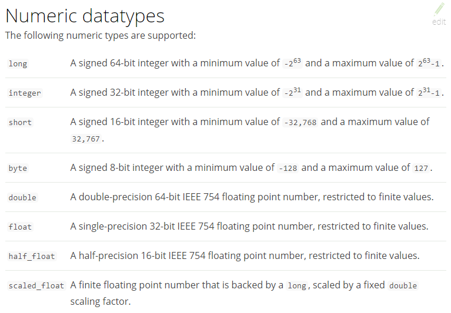

# 概述

::: tip

Elastic：[ɪ'læstɪk]。adj.橡皮圈（或带）的；有弹性的；有弹力的；灵活的

:::

## 学习目标 & 内容

### 目标

*   开发
    *   产品基本功能
    *   低层原理
    *   数据建模最佳实践
*   运维
    *   容量规划
    *   性能优化
    *   问题诊断，异常检测
    *   滚动升级
*   方案
    *   搜索如何解决搜索的相关性问题
    *   大数据分析实践与项目实战，理论知识的实际运用


### 内容与结构

*   ES 入门与深入
    *   环境搭建 / 搜索与聚合 / 架构原理 / 数据建模
*   ELK 进行大数据分析
    *   可视化分析 / 时序型数据 / 异常检测
*   ES 集群管理
    *   水平扩展及性能优化 / 最佳实践
*   项目实战


## ELK Stack 简介

### ElasticSearch

[ElasticSearch](https://www.elastic.co/cn/products/elasticsearch)是一个**基于Lucene的搜索服务器**。它提供了一个**分布式多用户能力**的全文搜索引擎，基于**RESTful web接口**。Elasticsearch是用**Java开发**的，并作为Apache许可条款下的**开放源码**发布，是当前流行的企业级搜索引擎。设计用于云计算中，能够达到**实时搜索**，稳定，可靠，快速，安装**使用方便**。Github、Stack Overflow等都在使用。

突出优点：

* **速度快**：通过有限状态转换器实现了用于全文检索的**倒排索引**，实现了用于存储数值数据和地理位置数据的 BKD 树，以及用于分析的列存储
* **可扩展性**：可以在笔记本电脑上运行。 也可以在**承载了 PB 级数据的成百上千台服务器上运行**。
* **弹性**：Elasticsearch 运行在一个分布式环境中，检测硬件故障、网络分割故障并确保您的**集群（和数据）的安全性和可用性**

分布式、RESTful 风格的搜索和数据分析引擎，可以集中存储数据

*   主要功能
    *   分布式搜索引擎
    *   大数据近实时分析引擎
*   产品特性
    *   高性能，和 T+1 说不
    *   容易使用 / 扩展


### Logstash 和 Beats

*   Logstash

    动态数据收集管道，拥有可扩展的插件生态系统

*   Beats

    面向轻量型采集器的平台，这些采集器可从边缘机器发送数据。


### Kibana

可视化数据


## 5 映射

如何在索引和搜索时去使用ik分词器呢？如何指定其它类型的field，比如日期类型、数值类型等。

### 5.1 映射维护方法

* **查询**所有索引的映射：`GET http://localhost:9200/_mapping`

* **创建/添加**映射：`post http://localhost:9200/xc_course/doc/_mapping`

    ```json
    {
        "properties": {
            "name": {
                "type": "text"
            },
            "description": {
                "type": "text"
            },
            "studymodel": {
                "type": "keyword"
            },
            "pic":{
                "type":"text"
            }
        }
    }
    ```

* ~~更新映射~~：映射创建成功可以添加新字段，**已有字段不允许更新**。

* ~~删除映射~~：通过删除索引库来删除映射

    总之就是**不能改变已有映射字段**！！！

### 5.2 常用映射类型

> 字符串包括text和keyword两种类型

#### 5.2.1 text 文本字段

* **index**

    通过index属性指定**是否索引**，**默认为index=true**，即要进行索引，只有进行索引才可以从索引库搜索到。

    但是也有一些内容不需要索引，比如：商品图片地址只被用来展示图片，不进行搜索图片，此时可以将index设置为false

* **analyzer**

    通过analyzer属性指定分词器。下边指定name的字段类型为text，使用ik分词器的ik_max_word分词模式。

    ```json
    "name": {
        "type": "text",
        "analyzer":"ik_max_word"
    }
    ```

* **search_analyzer**

    上边指定了analyzer是指在索引和搜索都使用ik_max_word，如果**单独**想定义**搜索时使用的分词器**则可以通过该属性

    对于ik分词器建议是**索引**时使用**`ik_max_word`**将搜索内容进行细粒度分词，**搜索**时使用**`ik_smart`**提高搜索精确性

    ```json
    "name": {
        "type": "text",
        "analyzer":"ik_max_word",
        "search_analyzer":"ik_smart"
    }
    ```

* **store**

    是否在source之外存储，默认为false。每个文档索引后会在 ES中保存一份原始文档，存放在"`_source`"中，一般情况下不需要设置store为true，因为在_source中已经有一份原始文档了。

测试

* 手动删除xc_course/doc下的映射，即删除索引库，创建索引库

* 创建新映射：`Post http://localhost:9200/xc_course/doc/_mapping`

    ```json
    {
        "properties": {
            "name": {
                "type": "text",
                "analyzer":"ik_max_word",
                "search_analyzer":"ik_smart"
            },
            "description": {
                "type": "text",
                "analyzer":"ik_max_word",
                "search_analyzer":"ik_smart"
            },
            "pic":{
                "type":"text",
                "index":false
            },
            "studymodel":{
                "type":"text"
            }
        }
    }
    ```

* 插入文档：`post http://localhost:9200/xc_course/doc/4028e58161bcf7f40161bcf8b77c0000`

    ```json
    {
        "name":"Bootstrap开发框架",
        "description":"Bootstrap是由Twitter推出的一个前台页面开发框架，在行业之中使用较为广泛。此开发框架包含了大量的CSS、JS程序代码，可以帮助开发者（尤其是不擅长页面开发的程序人员）轻松的实现一个不受浏览器限制的精美界面效果。",
        "pic":"group1/M00/00/01/wKhlQFqO4MmAOP53AAAcwDwm6SU490.jpg",
        "studymodel":"201002"
    }
    ```

* 查询测试：

    * `Get http://localhost:9200/xc_course/_search?q=name:java开发`。也能搜到，会先搜索分词
    * `Get http://localhost:9200/xc_course/_search?q=description:开发`
    * `Get http://localhost:9200/xc_course/_search?
        q=pic:group1/M00/00/01/wKhlQFqO4MmAOP53AAAcwDwm6SU490.jpg`
    * `Get http://localhost:9200/xc_course/_search?q=studymodel:201002`

    【结论】name、description和studymodel都支持全文检索，pic不可作为查询条件

#### 5.2.2 keyword 关键字字段

上边介绍的text文本字段在映射时要设置分词器，keyword字段为关键字字段，通常搜索keyword按照**整体搜索精确匹配**，所以创建keyword字段的索引时是**不进行分词**的，比如：邮政编码、手机号码、身份证等。keyword字段通常用于**过虑、排序、聚合**等

测试：

* 手动删除xc_course/doc下的映射，即删除索引库，创建索引库

* 创建新映射：`Post http://localhost:9200/xc_course/doc/_mapping`

    ```json
    {
        "properties": {
            "name": {
                "type": "keyword"
            },
            "description": {
                "type": "text",
                "analyzer":"ik_max_word",
                "search_analyzer":"ik_smart"
            },
            "pic":{
                "type":"text",
                "index":false
            },
            "studymodel":{
                "type":"keyword"
            }
        }
    }
    ```

* 插入文档：`post http://localhost:9200/xc_course/doc/4028e58161bcf7f40161bcf8b77c0000`

    ```json
    {
        "name": "java编程基础",
        "description": "java语言是世界第一编程语言，在软件开发领域使用人数最多。",
        "pic":"group1/M00/00/01/wKhlQFqO4MmAOP53AAAcwDwm6SU490.jpg",
        "studymodel": "201001"
    }
    ```

* 根据studymodel查询文档：`get http://localhost:9200/xc_course/_search?q=name:java`

    name是keyword类型，所以查询方式是精确查询，全部匹配！！！


#### 5.2.3 date 日期类型

日期类型不用设置分词器。通常用于**排序**。

* format：设置日期格式

测试

* 下边的设置允许date字段存储年月日时分秒、年月日及毫秒三种格式：

    ```json
    {
        "properties": {
            "timestamp": {
                "type": "date",
                "format": "yyyy‐MM‐dd HH:mm:ss||yyyy‐MM‐dd"
            }
        }
    }
    ```

* 插入文档：`Post http://localhost:9200/xc_course/doc/3`

    ```json
    {
        "name": "spring开发基础",
        "description": "spring 在java领域非常流行，java程序员都在用。",
        "studymodel": "201001",
        "pic":"group1/M00/00/01/wKhlQFqO4MmAOP53AAAcwDwm6SU490.jpg",
        "timestamp":"2018‐07‐04 18:28:58"
    }
    ```


#### 5.2.4 数值类型

下边是ES支持的数值类型



* 尽量选择**范围小**的类型，提高搜索效率（比如long类型别乱选）

* 对于**浮点数**尽量用**比例因子**，比如一个价格字段，单位为元，我们将比例因子设置为100这在ES中会按分存储，映射如下：

    ```json
    "price": {
        "type": "scaled_float",
        "scaling_factor": 100
    },
    ```

    由于比例因子为100，如果我们输入的价格是23.45则ES中会将23.45乘以100存储在ES中

    如果输入的价格是23.456，ES会将23.456乘以100再取一个接近原始值的数，得出2346

    使用比例因子的好处是**整型比浮点型更易压缩**，**节省磁盘空间**

    如果比例因子不适合，则从下表选择范围小的去用：

    


#### 5.2.5 综合例子

创建如下映射：`post http://localhost:9200/xc_course/doc/_mapping`

```json
{
    "properties": {
        "description": {
            "type": "text",
            "analyzer": "ik_max_word",
            "search_analyzer": "ik_smart"
        },
        "name": {
            "type": "text",
            "analyzer": "ik_max_word",
            "search_analyzer": "ik_smart"
        },
        "pic":{
            "type":"text",
            "index":false
        },
        "price": {
            "type": "float"
        },
        "studymodel": {
            "type": "keyword"
        },
        "timestamp": {
            "type": "date",
            "format": "yyyy‐MM‐dd HH:mm:ss||yyyy‐MM‐dd||epoch_millis"
        }
    }
}
```


## 6 索引管理—RestClient

### 6.1 搭建工程

ES提供多种不同的客户端：

* ~~TransportClient：ES提供的传统客户端，官方计划8.0版本删除此客户端。~~
* RestClient：官方推荐使用的，它包括两种 Java Low Level REST Client和 Java High Level REST Client ES在6.0之后提供 Java High Level REST Client 还处于完善中，有些功能还没有。

Maven依赖

```xml
<dependency>
    <groupId>org.elasticsearch.client</groupId>
    <artifactId>elasticsearch-rest-high-level-client</artifactId>
    <version>6.2.1</version>
</dependency>
<dependency>
    <groupId>org.elasticsearch</groupId>
    <artifactId>elasticsearch</artifactId>
    <version>6.2.1</version>
</dependency>
```

------

创建搜索工程（maven工程，直接导入）：xc-service-search，添加RestHighLevelClient依赖及junit依赖。

application.yml

```yaml
server:
  port: ${port:40100}
spring:
  application:
    name: xc-search-service
xuecheng:
  elasticsearch:
    hostlist: ${eshostlist:127.0.0.1:9200} #多个结点中间用逗号分隔
```

配置类`com.xuecheng.search.config.ElasticsearchConfig`

```java
@Configuration
public class ElasticsearchConfig {

    @Value("${xuecheng.elasticsearch.hostlist}")
    private String hostlist;

    @Bean
    public RestHighLevelClient restHighLevelClient(){
        //解析hostlist配置信息
        String[] split = hostlist.split(",");
        //创建HttpHost数组，其中存放es主机和端口的配置信息
        HttpHost[] httpHostArray = new HttpHost[split.length];
        for(int i=0;i<split.length;i++){
            String item = split[i];
            httpHostArray[i] = new HttpHost(item.split(":")[0], Integer.parseInt(item.split(":")[1]), "http");
        }
        //创建RestHighLevelClient客户端
        return new RestHighLevelClient(RestClient.builder(httpHostArray));
    }

    //项目主要使用RestHighLevelClient，对于低级的客户端暂时不用
    @Bean
    public RestClient restClient(){
        //解析hostlist配置信息
        String[] split = hostlist.split(",");
        //创建HttpHost数组，其中存放es主机和端口的配置信息
        HttpHost[] httpHostArray = new HttpHost[split.length];
        for(int i=0;i<split.length;i++){
            String item = split[i];
            httpHostArray[i] = new HttpHost(item.split(":")[0], Integer.parseInt(item.split(":")[1]), "http");
        }
        return RestClient.builder(httpHostArray).build();
    }

}
```

启动类

```java
@SpringBootApplication
@EntityScan("com.xuecheng.framework.domain.search")//扫描实体类
@ComponentScan(basePackages={"com.xuecheng.api"})//扫描接口
@ComponentScan(basePackages={"com.xuecheng.search"})//扫描本项目下的所有类
@ComponentScan(basePackages={"com.xuecheng.framework"})//扫描common下的所有类
public class SearchApplication {

    public static void main(String[] args) throws Exception {
        SpringApplication.run(SearchApplication.class, args);
    }

}
```


### 6.2 API+RestClient

#### 6.2.1 创建索引/映射

创建索引（库）：`put http://localhost:9200/索引名称`

```json
{
    "settings":{
        "index":{
            "number_of_shards":1,
            "number_of_replicas":0
        }
    }
}
```

创建映射：`put http://localhost:9200/xc_course/doc/_mapping`

```json
{
    "properties": {
        "name": {
            "type": "text",
            "analyzer":"ik_max_word",
            "search_analyzer":"ik_smart"
        },
        "description": {
            "type": "text",
            "analyzer":"ik_max_word",
            "search_analyzer":"ik_smart"
        },
        "studymodel": {
            "type": "keyword"
        },
        "price": {
            "type": "float"
        },
        "timestamp": {
            "type": "date",
            "format": "yyyy‐MM‐dd HH:mm:ss||yyyy‐MM‐dd||epoch_millis"
        }
    }
}
```

#### 6.2.2 添加文档

`POST/PUT http://localhost:9200/{index}/{type}/{id} { "field": "value", ... }`，不指定id会自动生成

```json
{
    "name":"spring cloud实战",
    "description":"本课程主要从四个章节进行讲解： 1.微服务架构入门 2.spring cloud 基础入门 3.实战SpringBoot 4.注册中心eureka。",
    "studymodel":"201001",
    "price":5.6
}
```

#### 6.2.3 根据ID查询文档

`POST/GET /{index}/{type}/{id}`

#### 6.2.4 更新文档

ES更新文档的顺序是：先检索到文档、将原来的文档标记为删除、创建新文档、删除旧文档，创建新文档就会重建索引。

通过请求Url有两种方法：

* 完全替换`POST http://localhost:9200/xc_test/doc/3`

    ```json
    {
        "name":"spring cloud实战",
        "description":"本课程主要从四个章节进行讲解： 1.微服务架构入门 2.spring cloud 基础入门 3.实战SpringBoot 4.注册中心eureka。",
        "studymodel":"201001"
        "price":5.6
    }
    ```

* 局部更新`POST http://localhost:9200/xc_test/doc/3/_update`

    ```json
    {
        "doc":{"price":66.6}
    }
    ```

    

#### 6.2.5 删除文档

根据id删除`DELETE /{index}/{type}/{id}`

搜索匹配删除，将搜索出来的记录删除`POST /{index}/{type}/_delete_by_query`

```json
{
    "query":{
        "term":{
            "studymodel":"201001"
        }
    }
}
```

上边例子的搜索匹配删除会将studymodel为201001的记录全部删除

> 搜索匹配删除还没有具体的api，可以采用先搜索出文档id，根据文档id删除。


#### 6.2.6 删除索引库

手动


#### 6.2.7 Java Client

```java
@SpringBootTest
@RunWith(SpringRunner.class)
public class TestIndex {

    @Autowired
    private RestHighLevelClient client;

    @Autowired
    private RestClient restClient;

    //创建索引库
    @Test
    public void testCreateIndex() throws IOException {
        //创建索引对象
        CreateIndexRequest createIndexRequest = new CreateIndexRequest("xc_course");
        //设置参数
        createIndexRequest.settings(Settings.builder().put("number_of_shards", "1").put("number_of_replicas", "0"));
        //指定映射
        createIndexRequest.mapping("doc", " {\n" +
                " \t\"properties\": {\n" +
                "            \"studymodel\":{\n" +
                "             \"type\":\"keyword\"\n" +
                "           },\n" +
                "            \"name\":{\n" +
                "             \"type\":\"keyword\"\n" +
                "           },\n" +
                "           \"description\": {\n" +
                "              \"type\": \"text\",\n" +
                "              \"analyzer\":\"ik_max_word\",\n" +
                "              \"search_analyzer\":\"ik_smart\"\n" +
                "           },\n" +
                "           \"pic\":{\n" +
                "             \"type\":\"text\",\n" +
                "             \"index\":false\n" +
                "           }\n" +
                " \t}\n" +
                "}", XContentType.JSON);
        //操作索引的客户端
        IndicesClient indices = client.indices();
        //执行创建索引库
        CreateIndexResponse createIndexResponse = indices.create(createIndexRequest);
        //得到响应
        boolean acknowledged = createIndexResponse.isAcknowledged();
        System.out.println(acknowledged);

    }

    //删除索引库
    @Test
    public void testDeleteIndex() throws IOException {
        //删除索引对象
        DeleteIndexRequest deleteIndexRequest = new DeleteIndexRequest("xc_course");
        //操作索引的客户端
        IndicesClient indices = client.indices();
        //执行删除索引
        DeleteIndexResponse delete = indices.delete(deleteIndexRequest);
        //得到响应
        boolean acknowledged = delete.isAcknowledged();
        System.out.println(acknowledged);
    }

    //添加文档
    @Test
    public void testAddDoc() throws IOException {
        //文档内容
        //准备json数据
        Map<String, Object> jsonMap = new HashMap<>();
        jsonMap.put("name", "spring cloud实战");
        jsonMap.put("description", "本课程主要从四个章节进行讲解： 1.微服务架构入门 2.spring cloud 基础入门 3.实战Spring Boot 4.注册中心eureka。");
        jsonMap.put("studymodel", "201001");
        SimpleDateFormat dateFormat = new SimpleDateFormat("yyyy-MM-dd HH:mm:ss");
        jsonMap.put("timestamp", dateFormat.format(new Date()));
        jsonMap.put("price", 5.6f);

        //创建索引创建对象
        IndexRequest indexRequest = new IndexRequest("xc_course", "doc");
        //文档内容
        indexRequest.source(jsonMap);
        //通过client进行http的请求
        IndexResponse indexResponse = client.index(indexRequest);
        DocWriteResponse.Result result = indexResponse.getResult();
        System.out.println(result);
    }

    //根据ID查询文档
    @Test
    public void testGetDoc() throws IOException {
        //查询请求对象
        GetRequest getRequest = new GetRequest("xc_course", "doc", "ZEqZP2kBDP-dgPpQBZbx");
        GetResponse getResponse = client.get(getRequest);
        //得到文档的内容
        Map<String, Object> sourceAsMap = getResponse.getSourceAsMap();
        System.out.println(sourceAsMap);
    }

    //更新文档—局部更新
    @Test
    public void updateDoc() throws IOException {
        UpdateRequest updateRequest = new UpdateRequest("xc_course", "doc","ZEqZP2kBDP-dgPpQBZbx");
        Map<String, String> map = new HashMap<>();
        map.put("name", "spring cloud实战2");
        updateRequest.doc(map);
        UpdateResponse update = client.update(updateRequest);
        RestStatus status = update.status();
        System.out.println(status);
    }

    //根据id删除文档
    @Test
    public void testDelDoc() throws IOException {
        //删除索引请求对象
        DeleteRequest deleteRequest = new DeleteRequest("xc_course","doc","ZEqZP2kBDP-dgPpQBZbx");
        //响应对象
        DeleteResponse deleteResponse = client.delete(deleteRequest);
        //获取响应结果
        DocWriteResponse.Result result = deleteResponse.getResult();
        System.out.println(result);
    }
    //搜索匹配删除还没有具体的api，可以采用先搜索出文档id，根据文档id删除。
}
```


## 7 搜索管理—DSL搜索

DSL(Domain Specific Language)是ES提出的基于json的搜索方式，在搜索时传入特定的json数据来完成不同的搜索需求。

DSL比URI搜索方式功能强大，在项目中建议使用DSL方式来完成搜索。

### 7.1 准备环境

环境准备

1. 创建xc_course**索引（库）**：`put http://localhost:9200/xc_course`

2. 创建如下**映射**：`post http://localhost:9200/xc_course/doc/_mapping`

    ```json
    {
        "properties": {
            "description": {
                "type": "text",
                "analyzer": "ik_max_word",
                "search_analyzer": "ik_smart"
            },
            "name": {
                "type": "text",
                "analyzer": "ik_max_word",
                "search_analyzer": "ik_smart"
            },
            "pic":{
                "type":"text",
                "index":false
            },
            "price": {
                "type": "float"
            },
            "studymodel": {
                "type": "keyword"
            },
            "timestamp": {
                "type": "date",
                "format": "yyyy‐MM‐dd HH:mm:ss||yyyy‐MM‐dd||epoch_millis"
            }
        }
    }
    ```

3. 向xc_course/doc中插入以下数据，如

    `POST http://localhost:9200/xc_course/doc/1`，指定id分别为1、2、3

    ```json
    {
        "name": "Bootstrap开发",
        "description": "Bootstrap是由Twitter推出的一个前台页面开发框架，是一个非常流行的开发框架，此框架集成了多种页面效果。此开发框架包含了大量的CSS、JS程序代码，可以帮助开发者（尤其是不擅长页面开发的程序人员）轻松的实现一个不受浏览器限制的精美界面效果。",
        "studymodel": "201002",
        "price":38.6,
        "timestamp":"2018‐04‐25 19:11:35",
        "pic":"group1/M00/00/00/wKhlQFs6RCeAY0pHAAJx5ZjNDEM428.jpg"
    }
    ```

    ```json
    {
        "name": "spring开发基础",
        "description": "spring 在java领域非常流行，java程序员都在用。",
        "studymodel": "201001",
        "price":88.6,
        "timestamp":"2018‐02‐24 19:11:35",
        "pic":"group1/M00/00/00/wKhlQFs6RCeAY0pHAAJx5ZjNDEM428.jpg"
    }
    ```

    ```json
    {
        "name": "spring开发基础",
        "description": "spring 在java领域非常流行，java程序员都在用。",
        "studymodel": "201001",
        "price":88.6,
        "timestamp":"2018‐02‐24 19:11:35",
        "pic":"group1/M00/00/00/wKhlQFs6RCeAY0pHAAJx5ZjNDEM428.jpg"
    }
    ```

    

4. 简单搜索：通过url进行查询，以get方式请求ES

    `GET ../_search?q=.....`

    如`http://localhost:9200/xc_course/doc/_search?q=name:java`，搜索name中包括java的文档


### 7.2 查询所有文档（search**中）

* 查询所有索引（库）的文档：`POST http://localhost:9200/_search`

* 查询指定索引库指定类型下的文档（通过使用此方法）：`POST http://localhost:9200/xc_course/doc/_search`

    ```json
    {
        "query": {
            "match_all": {}
        },
        "_source" : ["name","studymodel"]
    }
    ```

    `_source`：source源**过滤**设置，指定结果中所**包括的字段**有哪些。

    查询结果分析：

    ```json
    {
        "took": 13,
        "timed_out": false,
        "_shards": {
            "total": 1,
            "successful": 1,
            "skipped": 0,
            "failed": 0
        },
        "hits": {
            "total": 3,
            "max_score": 1,
            "hits": [
                {
                    "_index": "xc_course",
                    "_type": "doc",
                    "_id": "1",
                    "_score": 1,
                    "_source": {
                        "studymodel": "201002",
                        "name": "Bootstrap开发"
                    }
                },
            ]
        }
    }
    ```

    took：本次操作花费的时间，单位为毫秒

    timed_out：请求是否超时

    _shards：说明本次操作共搜索了哪些分片

    hits：搜索命中的记录

    hits.total ： 符合条件的文档总数 hits.hits ：匹配度较高的前N个文档

    hits.max_score：文档匹配得分，这里为最高分

    _score：每个文档都有一个匹配度得分，按照降序排列

    _source：显示了文档的原始内容

    

    

### 7.3 分页查询（search**中）

`POST http://localhost:9200/xc_course/doc/_search`

```json
{
    "from" : 0, "size" : 1,
    "query": {
        "match_all": {}
    },
    "_source" : ["name","studymodel"]
}
```

* form：表示起始文档的下标，从0开始。

* size：查询的文档数量（记录数）。

【注意】命中的总记录数就是全部的，但是在遍历记录时只会遍历到符合分页条件的


### 7.4 精确查询 term/ id（search**中）

在搜索时会**整体匹配关键字**，**不**再将搜索关键字**分词**

`POST http://localhost:9200/xc_course/doc/_search`

```json
{
    "query": {
        "term" : {
            "name": "spring"
        }
    },
    "_source" : ["name","studymodel"]
}
```

ES提供根据多个id值匹配的方法：

`POST http://127.0.0.1:9200/xc_course/doc/_search`

```json
{
    "query": {
        "ids" : {
            "type" : "doc",
            "values" : ["2", "3", "100"]
        }
    }
}
```

【注意】termQuery 和 termsQuery 区别


### 7.5 match（search**中）

match query与Term query区别是match query在**搜索前先将搜索关键字分词**，再拿各各词语去索引中搜索。

`POST http://localhost:9200/xc_course/doc/_search`

```json
{
    "query": {
        "match" : {
            "description" : {
                "query" : "spring开发框架",
                "operator" : "or",
                "minimum_should_match": "80%"
            }
        }
    }
}
```

* `query`：搜索的关键字，对于英文关键字如果有多个单词则中间要用半角逗号分隔，而对于中文关键字中间可以用逗号分隔也可以不用。

* `operator`

    * `or` 表示只要有一个词在文档中出现则就符合条件
    * `and`表示每个词都在文档中出现则才符合条件。

* `minimum_should_match`指定文档匹配词的占比。“spring开发框架”会被分为三个词：spring、开发、框架

    `"80%"`表示，三个词在文档的匹配占比为80%，即3*0.8=2.4，向下取整得2，表示至少有两个词在文档中要匹配成功。


### 7.6 ==multi match==（search**中）

上边学习的termQuery和matchQuery一次只能匹配一个Field，本节学习multiQuery，一次可以匹配多个字段。

`POST http://localhost:9200/xc_course/doc/_search`

```json
{
    "query": {
        "multi_match" : {
            "query" : "spring css",
            "minimum_should_match": "50%",
            "fields": [ "name^10", "description" ]
        }
    }
}
```

**提升boost**，通常关键字匹配上name的权重要比匹配上description的权重高，这里可以对name的权重提升。

“`name^10`” 表示**权重提升10倍**


### 7.7 ==布尔查询==（search**中，组合其他）

布尔查询对应于Lucene的BooleanQuery查询，实现**将多个查询组合起来**。三个参数：

* **must**：文档必须匹配must所包括的查询条件，相当于 “**AND**” 
* **should**：文档应该匹配should所包括的查询条件其中的一个或多个，相当于 "**OR**" 
* **must_not**：文档不能匹配must_not所包括的该查询条件，相当于“**NOT**”

`POST http://localhost:9200/xc_course/doc/_search`

```json
{
    "_source" : [ "name", "studymodel", "description"],
    "from" : 0, "size" : 1,
    "query": {
        "bool" : {
            "must":[
                {
                    "multi_match" : {
                        "query" : "spring框架",
                        "minimum_should_match": "50%",
                        "fields": [ "name^10", "description" ]
                    }
                },
                {
                    "term":{
                        "studymodel" : "201001"
                    }
                }
            ]
        }
    }
}
```


### 7.8 ==过滤器==（布尔中）

过虑是针对搜索的**结果进行过虑**，过虑器主要判断的是文档是否匹配，**不去计算和判断文档的匹配度得分**，所以过虑器性能比查询要高，且方便缓存，**推荐**尽量使用过虑器去实现查询或者过虑器和查询共同使用。**过虑器在布尔查询中使用**

```json
{
    "_source" : [ "name", "studymodel", "description","price"],
    "query": {
        "bool" : {
            "must":[
                {
                    "multi_match" : {
                        "query" : "spring框架",
                        "minimum_should_match": "50%",
                        "fields": [ "name^10", "description" ]
                    }
                }
            ],
            "filter": [
                { "term": { "studymodel": "201001" }},
                { "range": { "price": { "gte": 60 ,"lte" : 100}}}
            ]
        }
    }
}
```

* `term`：项匹配过虑，保留studymodel等于"201001"的记录。
* `range`：范围过虑，保留大于等于60 并且小于等于100的记录。

【注意】：range和term一次只能对一个Field设置范围过虑。


### 7.9 ==排序==（search**中）

可以在字段上添加一个或多个排序，**支持在keyword、date、float等类型上添加**，**text类型的字段上不允许**添加排序。

过虑0--10元价格范围的文档，并且对结果进行排序，先按studymodel降序，再按价格升序：

`POST http://localhost:9200/xc_course/doc/_search`

```json
{
    "_source": ["name","studymodel","description","price"],
    "query": {
        "bool": {
            "filter": [
                { "range": { "price": {"gte": 0,"lte": 100}} }
            ]
        }
    },
    "sort": [
        { "studymodel": "desc" },
        { "price": "asc" }
    ]
}
```


### 7.10 ==高亮==（只在search**中）

高亮显示可以将搜索结果一个或多个字突出显示，以便向用户展示匹配关键字的位置。

`POST http://127.0.0.1:9200/xc_course/doc/_search`

```json
{
    "_source" : [ "name", "studymodel", "description","price"],
    "query": {
        "bool" : {
            "must":[
                {
                    "multi_match" : {
                        "query" : "开发框架",
                        "minimum_should_match": "50%",
                        "fields": [ "name^10", "description" ],
                        "type":"best_fields"
                    }
                }
            ],
            "filter": [
                { "range": { "price": { "gte": 0 ,"lte" : 100}}}
            ]
        }
    },
    "sort" : [
        {
            "price" : "asc"
        }
    ],
    "highlight": {
        "pre_tags": ["<tag>"],
        "post_tags": ["</tag>"],
        "fields": {
            "name": {},
            "description":{}
        }
    }
}
```


### 7.11 RestClient

```java
@SpringBootTest
@RunWith(SpringRunner.class)
public class TestSearch {

    @Autowired
    RestHighLevelClient client;
    @Autowired
    RestClient restClient;

    private SearchRequest searchRequest = null;////搜索请求对象，传入索引（可变参数）、类型
    private SearchSourceBuilder searchSourceBuilder = null;//搜索源构建对象

    private SearchHit[] searchHits = null;//匹配度高的文档数组

    @Before
    public void init() {
        //搜索请求对象，传入索引（可变参数）
        searchRequest = new SearchRequest("xc_course");
        searchRequest.types("doc");
        //搜索源构建对象
        searchSourceBuilder = new SearchSourceBuilder();
    }

    //搜索全部记录
    @Test
    public void testSearchAll() {
        //搜索方式
        //matchAllQuery搜索全部
        searchSourceBuilder.query(QueryBuilders.matchAllQuery());
    }

    //分页查询
    @Test
    public void testSearchPage() {
        searchSourceBuilder.from(0);//(当前页-1)*每页显示记录数
        searchSourceBuilder.size(2);
        //搜索方式
        //matchAllQuery搜索全部
        searchSourceBuilder.query(QueryBuilders.matchAllQuery());
    }

    //TermQuery，注意termQuery
    @Test
    public void testTermQuery() {
        searchSourceBuilder.query(QueryBuilders.termQuery("name", "spring"));
    }

    //根据id查询，注意termsQuery
    @Test
    public void testTermQueryByIds() {
        searchSourceBuilder.query(QueryBuilders.termsQuery("_id", "1", "2", "100"));

    }

    //MatchQuery。以下三个任选其一
    @Test
    public void testMatchQuery() {
        searchSourceBuilder.query(QueryBuilders.matchQuery("description", "spring开发框架").operator(Operator.OR));
        searchSourceBuilder.query(QueryBuilders.matchQuery("description", "spring开发框架").operator(Operator.AND));
        searchSourceBuilder.query(QueryBuilders.matchQuery("description", "spring开发框架").minimumShouldMatch("8%"));
    }

    //MultiMatchQuery
    @Test
    public void testMultiMatchQuery() {
        searchSourceBuilder.query(QueryBuilders.multiMatchQuery("spring css", "name", "description").field("name", 10));
    }

    //BoolQuery
    @Test
    public void testBoolQuery() {
        BoolQueryBuilder boolQueryBuilder = QueryBuilders.boolQuery()
            .must(QueryBuilders.multiMatchQuery("spring框架", "name", "description").field("name", 10))
            .must(QueryBuilders.termQuery("studymodel", "201001"));

        searchSourceBuilder.query(boolQueryBuilder);
    }

    //filter，在BoolQuery中使用
    @Test
    public void testFilter() {
        //定义一个boolQuery，并用must和filter过滤
        BoolQueryBuilder boolQueryBuilder = QueryBuilders.boolQuery()
            .must(QueryBuilders.multiMatchQuery("spring框架", "name", "description").field("name", 10))
            .filter(QueryBuilders.termQuery("studymodel", "201001"))
            .filter(QueryBuilders.rangeQuery("price").gte(90).lte(100));

        QueryBuilders
            searchSourceBuilder.query(boolQueryBuilder);
    }

    //Sort，在searchSourceBuilder中使用
    @Test
    public void testSort() {
        //定义一个boolQuery，用filter过滤
        BoolQueryBuilder boolQueryBuilder = QueryBuilders.boolQuery()
            .filter(QueryBuilders.rangeQuery("price").gte("0").lte("100"));

        searchSourceBuilder.query(boolQueryBuilder)
            .sort("studymodel", SortOrder.DESC)
            .sort("price", SortOrder.ASC);
    }

    //Highlight
    @Test
    public void testHighlight() {
        BoolQueryBuilder boolQueryBuilder = QueryBuilders.boolQuery()
            .must(QueryBuilders.multiMatchQuery("开发框架", "name", "description").field("name", 10))
            .filter(QueryBuilders.rangeQuery("price").gte(0).lte(100));
        searchSourceBuilder
            .query(boolQueryBuilder)
            .highlighter(new HighlightBuilder().preTags("<tag>").postTags("</tag>").field("name").field("description"));

    }

    //字段过滤等
    @After
    public void loopShow() throws IOException, ParseException {
        //设置源字段过虑,第一个参数结果集包括哪些字段，第二个参数表示结果集不包括哪些字段
        searchSourceBuilder.fetchSource(new String[]{"name", "studymodel", "price", "timestamp"}, new String[]{});
        //向搜索请求对象中设置搜索源
        searchRequest.source(searchSourceBuilder);

        
        //执行搜索,向ES发起http请求
        SearchResponse searchResponse = client.search(searchRequest);
        //搜索结果
        SearchHits hits = searchResponse.getHits();
        //匹配到的总记录数（此时总记录数是1，是真正匹配的数目）
        long totalHits = hits.getTotalHits();
        //得到匹配度高的文档
        searchHits = hits.getHits();//SearchHit[]

        for (SearchHit hit : searchHits) {
            String index = hit.getIndex();//索引（库）名称
            String id = hit.getId();//文档的主键
            //源文档内容
            Map<String, Object> sourceAsMap = hit.getSourceAsMap();
            //由于前边设置了源文档字段过虑，这时description是取不到的，为null
            String description = (String) sourceAsMap.get("description");
            //学习模式
            String studymodel = (String) sourceAsMap.get("studymodel");
            //价格
            Double price = (Double) sourceAsMap.get("price");
            //日期（有可能因为传入的字符串格式不是UTF-8，编码问题，会解析时报错）
            SimpleDateFormat dateFormat = new SimpleDateFormat("yyyy-MM-dd HH:mm:ss");

            Date timestamp = dateFormat.parse((String) sourceAsMap.get("timestamp"));


            //源文档的name字段内容（由于description过滤了，所以不考虑）
            String name = (String) sourceAsMap.get("name");
            //取出高亮字段
            Map<String, HighlightField> highlightFields = hit.getHighlightFields();
            if (Objects.nonNull(highlightFields)) {
                //取出name高亮字段
                HighlightField nameHighlightField = highlightFields.get("name");
                if (Objects.nonNull(nameHighlightField)) {
                    //组合name高亮片段
                    Text[] fragments = nameHighlightField.getFragments();
                    StringBuilder buffer = new StringBuilder();
                    for (Text text : fragments) {
                        buffer.append(text);
                    }
                    name = buffer.toString();
                }
            }
        }
    }
}
```


## 8 集群管理

### 8.1 集群结构

ES通常以集群方式工作，这样做不仅能够提高 ES的**搜索能力**还可以**处理大数据搜索的能力**，同时也增加了系统的**容错**能力及**高可用**，ES可以实现PB级数据的搜索。


* 结点

    ES集群由多个服务器组成，**每个服务器即为一个Node结点**(该服务**只部署了一个**ES进程)。

* 分片

    当我们的**文档量很大**时，由于内存和硬盘的限制，同时也为了提高ES的处理能力、容错能力及高可用能力，我们将
    **索引分成若干分片**，每个分片可以放在**不同的服务器**，这样就实现了多个服务器共同对外提供索引及搜索服务。
    一个搜索请求过来，会分别从各个分片去查询，最后将查询到的数据**合并**返回给用户。

* 副本

    为了提高ES的**高可用**同时也为了**提高搜索的吞吐量**，我们**将分片复制一份或多份存储在其它的服务器**，这样即使当
    前的服务器挂掉了，拥有副本的服务器照常可以提供服务。

* 主结点

    一个集群中会有一个或多个主结点，**主结点的作用是集群管理**，比如增加节点，移除节点等，主结点挂掉后ES会**重**
    **新选**一个主结点。

* 结点转发

    **每个结点都知道其它结点的信息**，我们可以对任意一个结点发起请求，接收请求的结点会转发给其它结点查询数据。


### 8.2 搭建集群


#### 8.2.4 创建索引库

1. 使用head连上其中一个结点，下图表示两个结点已经创建成功。

    

2. 创建索引（库），共2个分片，每个分片1个副本。

    

    创建成功，刷新head。下图可以看到共有4个分片，其中两个分片是副本。

    


#### 8.2.5 集群的健康

通过访问 `GET /_cluster/health` 来查看Elasticsearch 的集群健康情况。

green：所有的主分片和副本分片都正常运行。 

yellow：所有的主分片都正常运行，但有些副本分片运行不正常。

red：存在主分片运行不正常。


### 8.3 测试

1. 连接其中任意一台结点，创建映射写入文档。

    `POST http://localhost:9200/xc_course/doc/1`

    ```json
    {
        "name": "spring开发基础",
        "description": "spring 在java领域非常流行，java软件开发人员都在用。",
        "studymodel": "201001",
        "price":66.6
    }
    ```

    响应结果：提示可看出，两个分片都保存成功。

    ```json
    {
        "_index": "xc_course",
        "_type": "doc",
        "_id": "1",
        "_version": 1,
        "result": "created",
        "_shards": {
            "total": 2,
            "successful": 2,
            "failed": 0
        },
        "_seq_no": 0,
        "_primary_term": 1
    }
    ```

2. 搜索：向其它一个结点发起搜索请求，查询全部数据。

3. 关闭一个结点，ES会**重新选中一个主结点**（前提在配置结点时**允许**它可以为主结点）

    此时向活的结点发起搜索请求，仍然正常。

4. 添加一个结点3

    结点名：xc_node_3，http端口是：9202，集群管理端口是9302，配置：`node.master: false node.data: true`

    启动结点3，刷新head，下图显示ES将分片分在了3个结点

    

    向结点3发起搜索请求：全部数据可被正常搜索到。

    

## 9 Spring Data Elasticsearch


