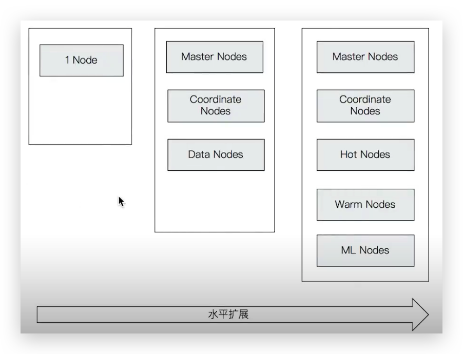
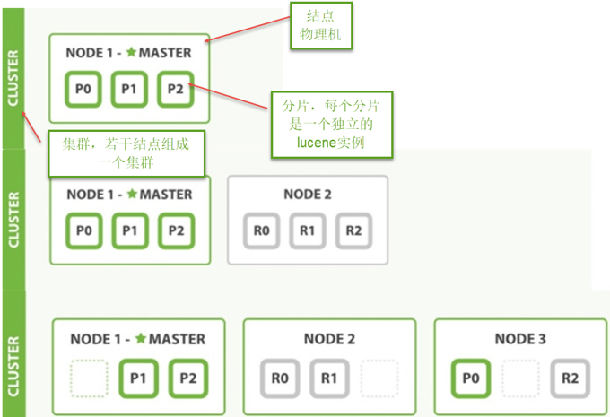

# 部署

由于 Elasticsearch 是用 Java 编写的，所以需要 JDK 环境，但是从 7.0 开，Elasticsearch 就内置的 JDK 环境，无需单独按照。 在官网找到 [Elasticsearch 的下载页面](https://www.elastic.co/cn/downloads/elasticsearch)，有使用各个平台的安装包安装，包管理器安装，以及 Docker 安装等。



## ES 单节点部署（了解）

### Docker

查看[文档](https://www.elastic.co/guide/en/elasticsearch/reference/current/docker.html)，注意使用 Docker 时可以指定`-d`以守护进程运行，可以指定`--name single-es`等，其他不再赘述。若是 Windowz 或 Mac，推荐使用压缩包方式。可以修改目录名称，方便集群时管理。

*   拉取镜像。可以使用阿里云的容器镜像服务，在拉取镜像时无需指定镜像hostname

    ```bash
    docker pull elasticsearch:7.6.2
    ```

*   要启动单节点Elasticsearch群集进行开发或测试，请指定发现类型为单节点以绕过引导检查：

    ```bash
    docker run -d --name=es-single-node -p 9200:9200 -p 9300:9300 -e "discovery.type=single-node" elasticsearch:7.6.2
    ```


### mac OS

```bash
./bin/elasticsearch -d -Ecluster.name=my_cluster -Enode.name=node_1
```


### Windows

查看[文档](https://www.elastic.co/guide/en/elasticsearch/reference/current/docker.html)，解压安装包（可以重命名，方便集群部署），在该目录执行如下命令即可

```bash
.\bin\elasticsearch.bat
```

可以使用 `Ctrl`+`C`停止


## ES 集群结构

### 简介

ES通常以集群方式工作，这样做不仅能够提高 ES的**搜索能力**还可以**处理大数据搜索的能力**，同时也增加了系统的**容错**能力及**高可用**，ES可以实现PB级数据的搜索。



* 结点

    ES集群由多个服务器组成，**每个服务器即为一个Node结点**(该服务**只部署了一个**ES进程)。

* 分片

    当我们的**文档量很大**时，由于内存和硬盘的限制，同时也为了提高ES的处理能力、容错能力及高可用能力，我们将
    **索引分成若干分片**，每个分片可以放在**不同的服务器**，这样就实现了多个服务器共同对外提供索引及搜索服务。
    一个搜索请求过来，会分别从各个分片去查询，最后将查询到的数据**合并**返回给用户。

* 副本

    为了提高ES的**高可用**同时也为了**提高搜索的吞吐量**，我们**将分片复制一份或多份存储在其它的服务器**，这样即使当
    前的服务器挂掉了，拥有副本的服务器照常可以提供服务。

* 主结点

    一个集群中会有一个或多个主结点，**主结点的作用是集群管理**，比如增加节点，移除节点等，主结点挂掉后ES会**重**
    **新选**一个主结点。

* 结点转发

    **每个结点都知道其它结点的信息**，我们可以对任意一个结点发起请求，接收请求的结点会转发给其它结点查询数据。


### 结点的三个角色

**主结点**：master节点主要用于**集群的管理及索引**比如新增结点、分片分配、索引的新增和删除等。 

**数据结点**：data 节点上保存了数据分片，它负责**索引和搜索**操作。 

**客户端结点**：client 节点**仅作为请求客户端存在**，client的作用也作为**负载均衡器**，client 节点**不存数据**，只是将请求均衡转发到其它结点。

通过下边参数来配置结点的功能：

* `node.master`：是否允许为主结点
* `node.data`：允许存储数据作为数据结点
* `node.ingest`：是否允许成为协调节点

四种组合方式：

* master=true，data=true：即是主结点又是数据结点
* master=false，data=true：仅是数据结点
* master=true，data=false：仅是主结点，不存储数据
* master=false，data=false：即不是主结点也不是数据结点，此时可设置ingest为true表示它是一个客户端


## 部署 ES 集群

### mac OS

分别在不同窗口执行即可

```bash
bin/elasticsearch -Ecluster.name=my_cluster -Enode.name=node0 -Epath.data=node0_data
bin/elasticsearch -Ecluster.name=my_cluster -Enode.name=node1 -Epath.data=node1_data
bin/elasticsearch -Ecluster.name=my_cluster -Enode.name=node2 -Epath.data=node2_data
```

执行完毕访问http://localhost:9200、http://localhost:9201、http://localhost:9202访问即可测试

```json
{
  "name": "node0",
  "cluster_name": "my_cluster",
  "cluster_uuid": "-IeOKCucRvGCXXd2brSO4w",
  "version": {
    "number": "7.6.2",
    "build_flavor": "default",
    "build_type": "tar",
    "build_hash": "ef48eb35cf30adf4db14086e8aabd07ef6fb113f",
    "build_date": "2020-03-26T06:34:37.794943Z",
    "build_snapshot": false,
    "lucene_version": "8.4.0",
    "minimum_wire_compatibility_version": "6.8.0",
    "minimum_index_compatibility_version": "6.0.0-beta1"
  },
  "tagline": "You Know, for Search"
}
```


### Windows

下边的例子实现创建一个2结点的集群，并且索引的分片我们设置2片，每片一个副本。

#### 创建结点1

解压elasticsearch.zip，结点1名称：xc_node_1，对外服务的http端口是：9200，集群管理端口是9300，elasticsearch.yml：

```yaml
cluster.name: xuecheng
node.name: xc_node_1
network.host: 0.0.0.0
http.port: 9200
transport.tcp.port: 9300
node.master: true
node.data: true
discovery.zen.ping.unicast.hosts: ["0.0.0.0:9300", "0.0.0.0:9301"]
discovery.zen.minimum_master_nodes: 1
node.ingest: true
bootstrap.memory_lock: false
node.max_local_storage_nodes: 2

path.data: C:\Develop\Elasticsearch\elasticsearch-1\data #路径要设置正确 
path.logs: C:\Develop\Elasticsearch\elasticsearch-1\logs #路径要设置正确

http.cors.enabled: true
http.cors.allow-origin: /.*/
```

启动结点1


#### 创建结点2

同上，结点2名：xc_node_2，对外服务的http端口是：9201，集群管理端口是9302，elasticsearch.yml：

```yaml
cluster.name: xuecheng
node.name: xc_node_2
network.host: 0.0.0.0
http.port: 9201
transport.tcp.port: 9301
node.master: true
node.data: true
discovery.zen.ping.unicast.hosts: ["0.0.0.0:9300", "0.0.0.0:9301"]
discovery.zen.minimum_master_nodes: 1
node.ingest: true
bootstrap.memory_lock: false
node.max_local_storage_nodes: 2

path.data: C:\Develop\Elasticsearch\elasticsearch-2\data #路径要设置正确 
path.logs: C:\Develop\Elasticsearch\elasticsearch-2\logs #路径要设置正确

http.cors.enabled: true
http.cors.allow-origin: /.*/
```

启动结点2


#### 7.0 后方式

node-1 如下，node-2 同理

```yml
# 默认为 elasticsearch。需修改为能描述集群用途的名称
cluster.name: htdms
# 默认为 ES 启动时的主机名
node.name: htdms-node-1
# 默认为环回地址：127.0.0.1 和 [::1]
network.host: 192.168.1.99
http.port: 9200
transport.tcp.port: 9300
# es7.x 之后新增的配置，写入候选主节点的设备地址（是节点间 TCP 通信的端口），在开启服务后可以被选为主节点
discovery.seed_hosts: ["192.168.1.99:9300", "192.168.1.99:9301"]
# es7.x 之后新增的配置，初始化一个新的集群时需要此配置来选举master
cluster.initial_master_nodes: ["htdms-node-1", "htdms-node-2"]

path.data: D:\log\elasticsearch\htdms-node-1\data #路径要设置正确
path.logs: D:\log\elasticsearch\htdms-node-1\logs #路径要设置正确

# 使用 Windows 部署后，或连接 Kibana 会出现如下问题
# Failure running machine learning native code. This could be due to running on an unsupported OS or distribution, missing OS libraries, or a problem with the temp directory
xpack.ml.enabled: false
```


### Docker Compose

#### 创建 docker-compose 文件

参考[文档](https://www.elastic.co/guide/en/elasticsearch/reference/current/docker.html)，在`/usr/local/docker/elasticsearch`创建`docker-compose.yml` 文件。

Github 上这个[仓库](https://github.com/deviantony/docker-elk)也可以参考

```yaml
version: '2.2'
services:
  es01:
    image: elasticsearch:7.6.2
    container_name: es01
    environment:
      - node.name=es01
      - cluster.name=es-docker-cluster
      - discovery.seed_hosts=es02,es03
      - cluster.initial_master_nodes=es01,es02,es03
      - bootstrap.memory_lock=true
      - "ES_JAVA_OPTS=-Xms512m -Xmx512m"
    ulimits:
      memlock:
        soft: -1
        hard: -1
    volumes:
      - data01:/usr/local/docker/elasticsearch/data
    ports:
      - 9200:9200
    networks:
      - elastic
  es02:
    image: elasticsearch:7.6.2
    container_name: es02
    environment:
      - node.name=es02
      - cluster.name=es-docker-cluster
      - discovery.seed_hosts=es01,es03
      - cluster.initial_master_nodes=es01,es02,es03
      - bootstrap.memory_lock=true
      - "ES_JAVA_OPTS=-Xms512m -Xmx512m"
    ulimits:
      memlock:
        soft: -1
        hard: -1
    volumes:
      - data02:/usr/local/docker/elasticsearch/data
    networks:
      - elastic
  es03:
    image: elasticsearch:7.6.2
    container_name: es03
    environment:
      - node.name=es03
      - cluster.name=es-docker-cluster
      - discovery.seed_hosts=es01,es02
      - cluster.initial_master_nodes=es01,es02,es03
      - bootstrap.memory_lock=true
      - "ES_JAVA_OPTS=-Xms512m -Xmx512m"
    ulimits:
      memlock:
        soft: -1
        hard: -1
    volumes:
      - data03:/usr/local/docker/elasticsearch/data
    networks:
      - elastic

volumes:
  data01:
    driver: local
  data02:
    driver: local
  data03:
    driver: local

networks:
  elastic:
    driver: bridge
```

此示例 Docker Compose 文件将打开一个三节点 Elasticsearch 集群。节点 es01 在本地主机上侦听 localhost:9200 ，es02 和es03 通过 Docker 网络与 es01 对话。

请注意，此配置在所有网络接口上公开端口9200，并且考虑到 Docker 如何在 Linux 上操作iptables，这意味着该 Elasticsearch群集是可公开访问的，可能会忽略任何防火墙设置。如果不想公开端口9200，而是使用反向代理，可以将 docker-compose.yml 文件中的9200:9200替换为127.0.0.1:9200:9200，则 Elasticsearch 将只能从主机本身访问。

名为volumes data01、data02 和 data03 的Docker存储节点数据目录，以便数据在重新启动时保持不变。如果它们还不存在，docker compose会在您启动集群时创建它们。

::: tip

注意 Docker Engine 内存必须至少为 4GB

:::

查阅[文档](https://www.elastic.co/guide/en/elastic-stack-get-started/current/get-started-docker.html#_product_specific_instructions_for_docker)后，也可以使用 ES + Kibana + cerebro 的 docker-compose.yaml，推荐！

```yaml
version: '2.2'
services:
  es01:
    image: elasticsearch:7.6.2
    container_name: es01
    environment:
      - cluster.name=es-docker-cluster
      - node.name=es01
      - discovery.seed_hosts=es02,es03
      - cluster.initial_master_nodes=es01,es02,es03
      - bootstrap.memory_lock=true
      - "ES_JAVA_OPTS=-Xms512m -Xmx512m"
      - network.publish_host=es01
    ulimits:
      memlock:
        soft: -1
        hard: -1
    volumes:
      - data01:/usr/local/docker/elasticsearch/data
    ports:
      - 9200:9200
    networks:
      - elastic

  es02:
    image: elasticsearch:7.6.2
    container_name: es02
    environment:
      - cluster.name=es-docker-cluster 
      - node.name=es02
      - discovery.seed_hosts=es01,es03
      - cluster.initial_master_nodes=es01,es02,es03
      - bootstrap.memory_lock=true
      - "ES_JAVA_OPTS=-Xms512m -Xmx512m"
    ulimits:
      memlock:
        soft: -1
        hard: -1
    volumes:
      - data02:/usr/local/docker/e/data
    ports:
      - 9201:9201
    networks:
      - elastic

  es03:
    image: elasticsearch:7.6.2
    container_name: es03
    environment:
      - cluster.name=es-docker-cluster
      - node.name=es03
      - discovery.seed_hosts=es01,es02
      - cluster.initial_master_nodes=es01,es02,es03
      - bootstrap.memory_lock=true
      - "ES_JAVA_OPTS=-Xms512m -Xmx512m"
    ulimits:
      memlock:
        soft: -1
        hard: -1
    volumes:
      - data03:/usr/local/docker/elk/data
    ports:
      - 9202:9202
    networks:
      - elastic

  kib01:
    image: kibana:7.6.2
    container_name: kib01
    ports:
      - 5601:5601
    environment:
      ELASTICSEARCH_URL: http://es01:9200
      ELASTICSEARCH_HOSTS: http://es01:9200 
    networks:
      - elastic
      
  cerebro:
    image: lmenezes/cerebro:0.8.3
    container_name: cerebro
    ports:
      - "9000:9000"
    command:
      - -Dhosts.0.host=http://es01:9200 # 此处的 es01 是通过 network.publish_host=es01 publish 的，不是 container_name
    networks:
      - elastic

volumes:
  data01:
    driver: local
  data02:
    driver: local
  data03:
    driver: local

networks:
  elastic:
    driver: bridge
```


#### 运行 docker-compose

```bash
docker-compose up -d
```


#### 停止 docker-compose

```bash
docker-compose down
```


### 常用命令

#### 查看节点情况

```bash
curl -X GET "localhost:9200/_cat/nodes?v&pretty"
```


### 相关阅读

-   安装指南 https://www.elastic.co/guide/en/elasticsearch/reference/7.1/install-elasticsearch.html
-   Elastic Support Matrix(OS / JDK ) https://www.elastic.co/cn/support/matrix
-   Elasticsearch 一些重要配置 https://www.elastic.co/guide/en/elasticsearch/reference/current/important-settings.html
-   https://www.elastic.co/guide/en/elasticsearch/reference/current/settings.html
-   https://www.elastic.co/guide/en/elasticsearch/reference/current/important-settings.html
-   Elasticsearch on Kuvernetes https://www.elastic.co/cn/blog/introducing-elastic-cloud-on-kubernetes-the-elasticsearch-operator-and-beyond
-   CAT Plugins API https://www.elastic.co/guide/en/elasticsearch/reference/7.1/cat-plugins.html


## 部署 Kibana

### mac OS

下载 zip 包，解压并执行，其他查看文档

```bash
bin/kibana
```

执行完毕访问http://localhost:5601即可测试


### Windows

下载 zip 包，解压并执行，其他查看文档

```bash
bin/kibana
```


### Docker Compose

下载查看[文档](https://www.elastic.co/downloads/kibana)，可以采用 Docker 直接拉取镜像，也可以使用 Docker Compose。

在`/usr/local/docker/kibana`创建`docker-compose.yml` 文件（没试过，推荐使用 ES + Kibana 整合的）

```yml
version: '2'
services:
  kibana:
    image: kibana:7.6.2
    container_name: kib01
    ports:
      - 5601:5601
    environment:
      ELASTICSEARCH_URL: http://127.0.0.1:9200
      ELASTICSEARCH_HOSTS: http://127.0.0.1:9200
```

环境变量默认值如下：

| 环境变量名称                                          | 默认值                      |
| ----------------------------------------------------- | --------------------------- |
| `server.name`                                         | `kibana`                    |
| `server.host`                                         | `"0"`                       |
| `elasticsearch.hosts`                                 | `http://elasticsearch:9200` |
| `xpack.monitoring.ui.container.elasticsearch.enabled` | `true`                      |


### Dev Tools

后续会经常使用该工具，可以熟悉下 Help 中快捷键


### 中文配置

可以在 x-pack 目录的 /usr/lo/d/elk-/kibana-7.6.2-darwin-x86_64/x-pack/p/translations/translations 中找到中文包

修改 config/kibana.yml 中

```yaml
i18n.locale: "zh-CN"
```

重启 Kibana 即可


### 相关阅读

-   https://www.elastic.co/guide/en/kibana/current/setup.html
-   Kibana 相关插件 https://www.elastic.co/guide/en/kibana/current/known-plugins.html


## 部署 Logstash

查看[文档](https://www.elastic.co/downloads/logstash)。使用 [grouplens](https://grouplens.org/) 的 Movielens 的 recommended for education and development 测试数据集

### mac OS

安装查看[文档](https://www.elastic.co/downloads/logstash)。完善 config 目录下的如下两个配置文件


#### logstash.yml

示例中不用配置

```yaml
# 0.0.0.0：允许任何IP访问
http.host: "0.0.0.0"
# 配置elasticsearch集群地址，注意若是 ES 在容器中，默认为 http://localhost:920
xpack.monitoring.elasticsearch.hosts: ["http://localhost:9200"]
# 允许监控
xpack.monitoring.enabled: true
# 启动时读取配置文件指定，指定的该文件可以配置Logstash读取一些文件导入ES。可以在命令行中指定
# path.config: /usr/share/logstash/config/logstash.conf
```


#### logstash.conf 配置

需要指定 movies.csv 文件

```conf
input {
  file {
    path => "/usr/local/docker/elk-zip/logstash-7.6.2/my-file/movies.csv"
    start_position => "beginning"
    sincedb_path => "/dev/null"
  }
}
filter {
  csv {
    separator => ","
    columns => ["id","content","genre"]
  }

  mutate {
    split => { "genre" => "|" }
    remove_field => ["path", "host","@timestamp","message"]
  }

  mutate {

    split => ["content", "("]
    add_field => { "title" => "%{[content][0]}"}
    add_field => { "year" => "%{[content][1]}"}
  }

  mutate {
    convert => {
      "year" => "integer"
    }
    strip => ["title"]
    remove_field => ["path", "host","@timestamp","message","content"]
  }

}
output {
   elasticsearch {
     hosts => "http://localhost:9200"
     index => "movies"
     document_id => "%{id}"
   }
  stdout {}
}
```


#### 执行

```bash
sudo ./bin/logstash -f ./config/logstash.conf
```

执行完会显示导入的数据


### ~~Docker~~

```yaml
docker run -d \
-v /usr/local/docker/elk/logstash/logstash.conf:/usr/share/logstash/pipeline/logstash.conf \
-v /usr/local/docker/elk/logstash/logstash.conf:/usr/share/logstash/pipeline/logstash.conf \
logstash:7.6.2
```

Docker 需要映射很多东西，目前没找到便捷方式，暂搁置


### Docker Compose

查看该 [Github](https://github.com/deviantony/docker-elk)。自己不知道怎么整合


### 相关阅读

-   下载最MovieLens最小测试数据集：https://grouplens.org/datasets/movielens/
-   Logstash下载：https://www.elastic.co/cn/downloads/logstash
-   Logstash参考文档：https://www.elastic.co/guide/en/logstash/current/index.html


## 部署 cerebro

[Github](https://github.com/lmenezes/cerebro)，方便分析集群环境

### Docker 

```bash
docker pull lmenezes/cerebro
```

docker 方式在连接时可能需要指定的 IP 为宿主机的 IP，或者需要类似 Docker Compose publish IP


### Docker Compose

也可以使用整合了 ES + Kibana + cerebro 的 Docker Compose，详见 Docker Compose 部署 ES 集群


### mac OS

解压并执行

```bash
./bin/cerebro
```

打开本地`9000`端口并连接 ES 即可使用


### Windows


## 部署 head

[head](https://github.com/mobz/elasticsearch-head)插件是ES的一个可视化管理插件，用来监视ES的状态，并通过head客户端和ES服务进行交互，比如创建映射、创建索引等

基本上只会使用 概览、索引、数据浏览三个 Tab，其他的会使用 Kibana 操作。

### Chrome 插件

可以使用 Chrome 插件安装，更方便，还不用设置跨域！推荐！


### Node 服务

从ES6.0开始，head插件支持使用Node.js运行

1. 安装Node.js，略
2. 下载head并运行

```bash
git clone git://github.com/mobz/elasticsearch-head.git
cd elasticsearch-head
npm install
npm run start
```

3.  浏览器打开http://localhost:9100/并连接http://localhost:9200/

::: tip 注意

打开浏览器调试工具发现报错：Origin null is not allowed by Access-Control-Allow-Origin

原因是：head插件作为客户端要连接ES服务（localhost:9200），此时存在跨域问题，elasticsearch默认不允许跨域访问。

设置Elasticsearch允许跨域访问。在config/elasticsearch.yml 后面增加2个参数，详细参靠配置章节

```yaml
#开启cors跨域访问支持，默认为false
http.cors.enabled: true
#跨域访问允许的域名地址，(允许所有域名)以下使用正则
http.cors.allow-origin: /.*/
```

:::

