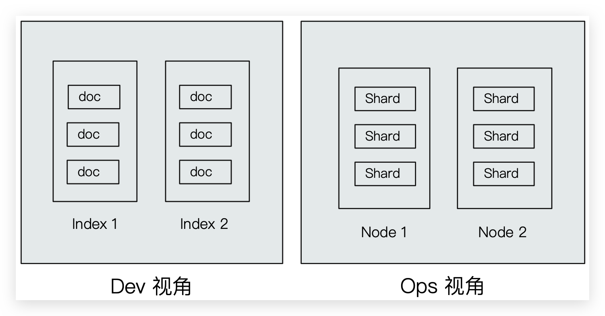
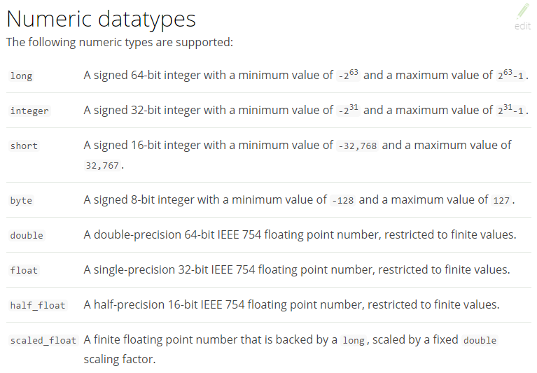

# Index & Document

ES 作为一个索引及搜索服务，对外提供丰富的 RESTful 接口。如下示例使用 Kibana 操作，PostMan 同理。

## Dev 和 Ops 视角



*   Index 索引
    *   ~~Type 类型~~
    *   Document 文档

*   Node 节点
    *   Shard 分片


## Index

*   Index 是 **Document 的容器**，是**同一类（7.0 之后只允许为`_doc`） Document 的集合**。
*   Index 体现了**逻辑**空间的概念，与 Node 体现物理空间不同
*   Index 就相当于 RDBMS 中的**表**，或相当于 Mongodb 中的**集合**
*   Index 包括了**分词列表**及**文档列表**
*   每个 Index 都有自己的 **mapping** 定义，用于定义包含的 **Document 的 Field 名称 和 Field 类型**。不定义 mapping 直接插入 Document 时 ES 会自动判断 Field 类型并生成。setting 同理也会自动生成。

::: tip 思考

创建索引库相当于关系数据库中的数据库还是表？

- 如果相当于**数据库**就表示一个索引库可以创建很多不同类型的文档，这在ES中也是允许的（但是 7.0 之后不允许！）

- 如果相当于**表**就表示一个索引库只能存储相同类型的文档，ES官方**建议**在一个索引库中只存**储相同类型的文档**

    | RDBMS  |      ES       |
    | :----: | :-----------: |
    | Table  | Index（Type） |
    |  Row   |   Document    |
    | Column |     Field     |
    | Schema |    Mapping    |
    |  SQL   |      DSL      |

:::

::: tip Index 的不同语义

Indexing （动词）Document 到 ES 的 Index（名词）中

*   名词：一个 ES 集群中，可以创建很多个不同的 Index
*   动词：保存一个 Document 到 ES 的过程也称作 Indexing（ES 创建一个倒排 Index 的过程）
*   名词：一个 B 树 Index，一个倒排 Index

:::


### 查询

```bash
# 查询 index 的信息，包括 setting 和 mapping
GET /<index>
```


### 创建

综合 setting 和 mapping

```bash
PUT /<index>
{
    "settings":{
        "index":{
            "number_of_shards":1,
            "number_of_replicas":0
        }
    },
    "properties": {
        "description": {
            "type": "text",
            "analyzer": "ik_max_word",
            "search_analyzer": "ik_smart"
        },
        "name": {
            "type": "text",
            "analyzer": "ik_max_word",
            "search_analyzer": "ik_smart"
        },
        "pic":{
            "type":"text",
            "index":false
        },
        "price": {
            "type": "float"
        },
        "studymodel": {
            "type": "keyword"
        },
        "timestamp": {
            "type": "date",
            "format": "yyyy‐MM‐dd HH:mm:ss||yyyy‐MM‐dd||epoch_millis"
        }
    }
}
```


### 只可删除 index

```bash
DELETE /<index>
```

删除 Index 的同时会删除该 Index 下的所有 setting、mapping 和 Document 


### 无法修改，只能迁移数据

映射创建成功可以**添加新字段**，**已有字段不允许更新 type**


## setting

setting 定义了不同的数据分布（索引的分片，副本）


### 查询

```bash
GET /<index>/_settings

# 查询所有 index 的 setting
GET /_settings
```


### 创建

::: tip 注意

使用 PUT 是由于**幂等**；不能使用 POST 是由于**非幂等**且 POST **默认会添加 Document**，同时设置 setting 和 mapping

:::

```bash
PUT /<index>
{
    "settings":{
        "index":{
            "number_of_shards":1,
            "number_of_replicas":0
        }
    }
}
```

* `number_of_shards`：设置**分片的数量**，在集群中通常设置多个分片，表示一个索引库将拆分成多片分别存储不同的结点，提高了ES的处理能力和高可用性，入门程序使用单机环境，这里设置为1。

* `number_of_replicas`：设置**副本**的数量，设置副本是为了提高 ES 的高可靠性，单机环境设置为0。

::: tip 注意

ES6.0 之前的版本有 Type（类型）概念，相当于关系数据库的表，ES 官方将在 ES9.0 版本中彻底删除 Type

:::


### 只可删除 index

```bash
DELETE /<index>
```

删除 Index 的同时会删除该 Index 下的所有 setting、mapping 和 Document 


### 无法修改，只能迁移数据


## mapping

在 Index 中每个 Document 都包括了一个或多个 Field，创建 mapping 就是向**Index（索引库）**中**创建 Field** 并指定 **Field 类型**的过程。虽然 ES 会根据 Document 自动设置类型，但是有些 Field 需要自己手动设置！


### 查询

```bash
GET /<index>/_mapping

# 查询所有 index 的 mapping
GET /_mapping
```


### 创建

```bash
# 创建 Index 的 mapping
PUT /<index>
{
  "mappings": {
        "properties": {
            "name": {
                "type": "text"
            },
            "age": {
                "type": "integer"
            },
            "mail": {
                "type": "keyword"
            },
            "hobby": {
                "type": "text",
                "analyzer": "ik_max_word"
            }
        }
    }
}
```


### 无法修改，可添加 Field

映射创建成功可以**添加新字段**，**已有字段不允许更新 type**


### 只可删除 index

```bash
DELETE /<index>
```

删除 Index 的同时会删除该 Index 下的所有 setting、mapping 和 Document 


## 常用映射类型

### 字符串—text

* **index**

    通过index属性指定**是否索引**，**默认为index=true**，即要进行索引，只有进行索引才可以从索引库搜索到。

    但是也有一些内容不需要索引，比如：商品图片地址只被用来展示图片，不进行搜索图片，此时可以将index设置为false

* **analyzer**

    通过analyzer属性指定分词器。下边指定name的字段类型为text，使用ik分词器的ik_max_word分词模式。

    ```json
    "name": {
        "type": "text",
        "analyzer":"ik_max_word"
    }
    ```

* **search_analyzer**

    上边指定了analyzer是指在索引和搜索都使用ik_max_word，如果**单独**想定义**搜索时使用的分词器**则可以通过该属性

    对于ik分词器建议是**索引**时使用**`ik_max_word`**将搜索内容进行细粒度分词，**搜索**时使用**`ik_smart`**提高搜索精确性

    ```json
    "name": {
        "type": "text",
        "analyzer":"ik_max_word",
        "search_analyzer":"ik_smart"
    }
    ```

* **store**

    是否在source之外存储，默认为false。每个文档索引后会在 ES中保存一份原始文档，存放在"`_source`"中，一般情况下不需要设置store为true，因为在_source中已经有一份原始文档了。

测试

* 手动删除xc_course/doc下的映射，即删除索引库，创建索引库

* 创建新映射：`Post http://localhost:9200/xc_course/doc/_mapping`

    ```json
    {
        "properties": {
            "name": {
                "type": "text",
                "analyzer":"ik_max_word",
                "search_analyzer":"ik_smart"
            },
            "description": {
                "type": "text",
                "analyzer":"ik_max_word",
                "search_analyzer":"ik_smart"
            },
            "pic":{
                "type":"text",
                "index":false
            },
            "studymodel":{
                "type":"text"
            }
        }
    }
    ```

* 插入文档：`post http://localhost:9200/xc_course/doc/4028e58161bcf7f40161bcf8b77c0000`

    ```json
    {
        "name":"Bootstrap开发框架",
        "description":"Bootstrap是由Twitter推出的一个前台页面开发框架，在行业之中使用较为广泛。此开发框架包含了大量的CSS、JS程序代码，可以帮助开发者（尤其是不擅长页面开发的程序人员）轻松的实现一个不受浏览器限制的精美界面效果。",
        "pic":"group1/M00/00/01/wKhlQFqO4MmAOP53AAAcwDwm6SU490.jpg",
        "studymodel":"201002"
    }
    ```

* 查询测试：

    * `Get http://localhost:9200/xc_course/_search?q=name:java开发`。也能搜到，会先搜索分词
    * `Get http://localhost:9200/xc_course/_search?q=description:开发`
    * `Get http://localhost:9200/xc_course/_search?
        q=pic:group1/M00/00/01/wKhlQFqO4MmAOP53AAAcwDwm6SU490.jpg`
    * `Get http://localhost:9200/xc_course/_search?q=studymodel:201002`

    【结论】name、description和studymodel都支持全文检索，pic不可作为查询条件


### 字符串—keyword

上边介绍的text文本字段在映射时要设置分词器，keyword字段为关键字字段，通常搜索keyword按照**整体搜索精确匹配**，所以创建keyword字段的索引时是**不进行分词**的，比如：邮政编码、手机号码、身份证等。keyword字段通常用于**过虑、排序、聚合**等

测试：

* 手动删除xc_course/doc下的映射，即删除索引库，创建索引库

* 创建新映射：`Post http://localhost:9200/xc_course/doc/_mapping`

    ```json
    {
        "properties": {
            "name": {
                "type": "keyword"
            },
            "description": {
                "type": "text",
                "analyzer":"ik_max_word",
                "search_analyzer":"ik_smart"
            },
            "pic":{
                "type":"text",
                "index":false
            },
            "studymodel":{
                "type":"keyword"
            }
        }
    }
    ```

* 插入文档：`post http://localhost:9200/xc_course/doc/4028e58161bcf7f40161bcf8b77c0000`

    ```json
    {
        "name": "java编程基础",
        "description": "java语言是世界第一编程语言，在软件开发领域使用人数最多。",
        "pic":"group1/M00/00/01/wKhlQFqO4MmAOP53AAAcwDwm6SU490.jpg",
        "studymodel": "201001"
    }
    ```

* 根据studymodel查询文档：`get http://localhost:9200/xc_course/_search?q=name:java`

    name是keyword类型，所以查询方式是精确查询，全部匹配！！！


### 数值类型

下边是ES支持的数值类型



* 尽量选择**范围小**的类型，提高搜索效率（比如long类型别乱选）

* 对于**浮点数**尽量用**比例因子**，比如一个价格字段，单位为元，我们将比例因子设置为100这在ES中会按分存储，映射如下：

    ```json
    "price": {
        "type": "scaled_float",
        "scaling_factor": 100
    },
    ```

    由于比例因子为100，如果我们输入的价格是23.45则ES中会将23.45乘以100存储在ES中

    如果输入的价格是23.456，ES会将23.456乘以100再取一个接近原始值的数，得出2346

    使用比例因子的好处是**整型比浮点型更易压缩**，**节省磁盘空间**

    如果比例因子不适合，则从下表选择范围小的去用：

    


### te 布尔值

*   boolean


### date

日期类型不用设置分词器。通常用于**排序**。

* format：设置日期格式

测试

* 下边的设置允许date字段存储年月日时分秒、年月日及毫秒三种格式：

    ```json
    {
        "properties": {
            "timestamp": {
                "type": "date",
                "format": "yyyy‐MM‐dd HH:mm:ss||yyyy‐MM‐dd"
            }
        }
    }
    ```

* 插入文档：`Post http://localhost:9200/xc_course/doc/3`

    ```json
    {
        "name": "spring开发基础",
        "description": "spring 在java领域非常流行，java程序员都在用。",
        "studymodel": "201001",
        "pic":"group1/M00/00/01/wKhlQFqO4MmAOP53AAAcwDwm6SU490.jpg",
        "timestamp":"2018‐07‐04 18:28:58"
    }
    ```


### 二进制

*   binary


### 综合例子

```bash
PUT /<index>/_doc/_mapping
{
    "properties": {
        "description": {
            "type": "text",
            "analyzer": "ik_max_word",
            "search_analyzer": "ik_smart"
        },
        "name": {
            "type": "text",
            "analyzer": "ik_max_word",
            "search_analyzer": "ik_smart"
        },
        "pic":{
            "type":"text",
            "index":false
        },
        "price": {
            "type": "float"
        },
        "studymodel": {
            "type": "keyword"
        },
        "timestamp": {
            "type": "date",
            "format": "yyyy‐MM‐dd HH:mm:ss||yyyy‐MM‐dd||epoch_millis"
        }
    }
}
```


## ~~Type~~

*   在 7.0 之前，一个 Index 可以设置多个 Types
*   6.0 开始，Type 已经被 Deprecated。7.0 开始一个 Index 只能创建一个 Type：`_doc`


## Document

*   ES 是**面向 Document 的**，Document 是所有**可搜索数据的最小单位**
    *   日志文件中的日志项
    *   一本电影的具体信息；一张唱片的详细信息
    *   MP3 播放器里的一首歌；一篇 PDF 文档中的具体内容
*   一篇 Documemt 包含了一系列的 Field，类似数据库中表的一条记录
*   **Document 会被序列化成 JSON，保存**在 ES 中
    *   **JSON 对象由 Field 组成**
    *   每个 Field 都有对应的类型（字符串、数值、布尔、日期、二进制、范围类型）
*   **每个 Document 都有一个 Unique ID**
    *   可以自己指定 ID
    *   可以通过 ES 自动生成，32 位长度字符串


### 元数据

每一篇 Document 都有元数据，用于标注 Document 的相关信息

```json
{
  "_index": "movies",
  "_type": "_doc",
  "_id": "2665",
  "_version": 1,
  "_score": 1,
  "_source": {
    "@version": "1",
    "title": "Earth vs. the Flying Saucers",
    "genre": [
      "Sci-Fi"
    ],
    "year": 1956,
    "id": "2665"
  }
}
```

*   _index：Document 所属的 Index 名
*   _type：Document 所属的 Type 名
*   _id：文档的唯一 ID
*   _version：Document 的版本信息，每次修改都会加一
*   _score：相关性打分
*   _source：文档的原始 JSON 数据
*   ~~_all：整合所有 Field 内容到该字段。已被废除~~


### 创建

ES 中的文档相当于 RDBMS 中的一条**记录**

```bash
# 创建，如果不指定 id 值 ES 会自动生成ID（不推荐，影响 RESTful 语义）
POST /<index>/_doc
POST /<index>/_doc/<_id>
POST /<index>/_create/<_id>
{
  "name": "zhangsan11111",
  "age": 13,
  "mail": "11111@qq.com"
}
```

*   若不指定 ID 值 ES 会自动生成 ID
*   **若 ID 已存在，则修改**，且根据提供的数据修改，没有的 Field 则删除掉。不推荐，影响 RESTful 语义


### 修改（覆盖）

```bash
# 修改（全修改），若 ID 所在 Document 不存在，则创建
PUT /<index>/_doc/<_id>
{
  "name": "zhangsan11111",
  "age": 13,
  "mail": "11111@qq.com"
}
```

*   若指定的 ID 值所在 Document 不存在，则创建
*   删除并重新添加，指定同一 ID，Field 数量可能改变


### 修改（局部修改）🔥

```bash
POST /<index>/_update/<_id>
{
  "doc": {
    "name": "3232322",
    "age": 13,
    "mail": "11111@qq.com"
  }
}
```

*   当检测到 **Document没有改变时，则 version 不会加一**


### 删除

```bash
DELETE /<index>/_doc/<_id>
```


## _cat 查询

```bash
# 查询所有 Index
GET /_cat/indices

#==================================================================================================
green open movies                       ILYU9p8_TF-zQ0Dhv6g2lg 1 1 9743 0  2.7mb    1.3mb
green open kibana_sample_data_ecommerce e7UYtIrwTCueNbynAYtzKw 1 1 4675 0  9.6mb    4.8mb
green open .kibana_task_manager_1       GKq_Aw38S_2Ds3A69S-OGQ 1 1    2 1 17.9kb   10.8kb
green open my_index                     yIAGPwWLSbi24XluT-hQ5w 1 0    0 0   283b     283b
green open itcast                       YmdieZ30TNOiScO83pRF2g 1 1    2 2 18.5kb    7.3kb
green open .apm-agent-configuration     2wojrVAESi6IBQC1ljromQ 1 1    0 0   566b     283b
green open .kibana_1                    wzLuski5Q7CFPUnSNhia2A 1 1   74 8  1.9mb 1003.4kb
```

```bash
# 根据 Index name 查询
GET /_cat/indices/<index>

#==================================================================================================
green open my_index yIAGPwWLSbi24XluT-hQ5w 1 0 0 0 283b 283b
```

