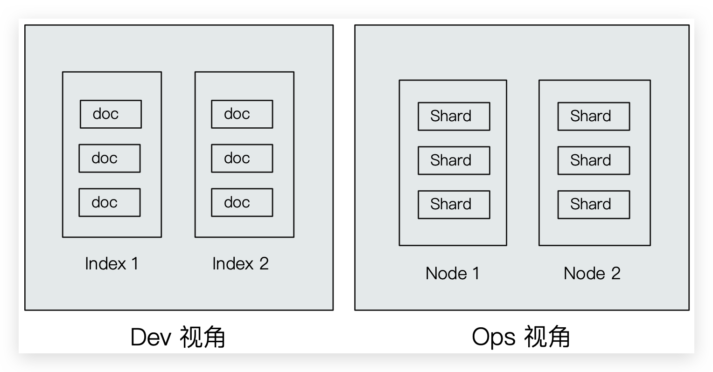

# 概念及 RESTful API

ES 作为一个索引及搜索服务，对外提供丰富的 RESTful 接口。如下示例使用 Kibana 操作，PostMan 同理。

## Dev 和 Ops 视角



*   Index 索引
    *   ~~Type 类型~~
    *   Document 文档

*   Node 节点
    *   Shard 分片


## Index

*   Index 是 **Document 的容器**，是**同一类（7.0 之后只允许为`_doc`） Document 的集合**。
*   Index 体现了**逻辑**空间的概念，与 Node 体现物理空间不同
*   Index 就相当于 RDBMS 中的**表**，或相当于 Mongodb 中的**集合**
*   Index 包括了**分词列表**及**文档列表**
*   每个 Index 都有自己的 **mapping** 定义，用于定义包含的 **Document 的 Field 名称 和 Field 类型**。不定义 mapping 直接插入 Document 时 ES 会自动判断 Field 类型并生成。setting 同理也会自动生成。

::: tip 思考

创建索引库相当于关系数据库中的数据库还是表？

- 如果相当于**数据库**就表示一个索引库可以创建很多不同类型的文档，这在ES中也是允许的（但是 7.0 之后不允许！）

- 如果相当于**表**就表示一个索引库只能存储相同类型的文档，ES官方**建议**在一个索引库中只存**储相同类型的文档**

    | RDBMS  |      ES       |
    | :----: | :-----------: |
    | Table  | Index（Type） |
    |  Row   |   Document    |
    | Column |     Field     |
    | Schema |    Mapping    |
    |  SQL   |      DSL      |

:::

::: tip Index 的不同语义

Indexing （动词）Document 到 ES 的 Index（名词）中

*   名词：一个 ES 集群中，可以创建很多个不同的 Index
*   动词：保存一个 Document 到 ES 的过程也称作 Indexing（ES 创建一个倒排 Index 的过程）
*   名词：一个 B 树 Index，一个倒排 Index

:::


### setting

setting 定义了不同的数据分布（索引的分片，副本）

#### _cat 查询

```bash
# 查询所有 Index
GET /_cat/indices

#==================================================================================================
green open movies                       ILYU9p8_TF-zQ0Dhv6g2lg 1 1 9743 0  2.7mb    1.3mb
green open kibana_sample_data_ecommerce e7UYtIrwTCueNbynAYtzKw 1 1 4675 0  9.6mb    4.8mb
green open .kibana_task_manager_1       GKq_Aw38S_2Ds3A69S-OGQ 1 1    2 1 17.9kb   10.8kb
green open my_index                     yIAGPwWLSbi24XluT-hQ5w 1 0    0 0   283b     283b
green open itcast                       YmdieZ30TNOiScO83pRF2g 1 1    2 2 18.5kb    7.3kb
green open .apm-agent-configuration     2wojrVAESi6IBQC1ljromQ 1 1    0 0   566b     283b
green open .kibana_1                    wzLuski5Q7CFPUnSNhia2A 1 1   74 8  1.9mb 1003.4kb
```

```bash
# 根据 Index name 查询
GET /_cat/indices/<index>

#==================================================================================================
green open my_index yIAGPwWLSbi24XluT-hQ5w 1 0 0 0 283b 283b
```


#### 创建

::: tip 注意

使用 PUT 是由于**幂等**；不能使用 POST 是由于**非幂等**且 POST **默认会添加 Document**，同时设置 setting 和 mapping

:::

```bash
PUT /<index>
{
    "settings":{
        "index":{
            "number_of_shards":1,
            "number_of_replicas":0
        }
    }
}
```

* `number_of_shards`：设置**分片的数量**，在集群中通常设置多个分片，表示一个索引库将拆分成多片分别存储不同的结点，提高了ES的处理能力和高可用性，入门程序使用单机环境，这里设置为1。

* `number_of_replicas`：设置**副本**的数量，设置副本是为了提高 ES 的高可靠性，单机环境设置为0。

::: tip 注意

ES6.0 之前的版本有 Type（类型）概念，相当于关系数据库的表，ES 官方将在 ES9.0 版本中彻底删除 Type

:::


#### 删除

```bash
DELETE /<index>
```

删除 Index 的同时会删除该 Index 下的所有 setting、mapping 和 Document 


#### 无法修改—只能迁移数据


### mapping

在 Index 中每个 Document 都包括了一个或多个 Field，创建 mapping 就是向**Index（索引库）**中**创建 Field** 并指定 **Field 类型**的过程。虽然 ES 会根据 Document 自动设置类型，但是有些 Field 需要自己手动设置！

#### 创建

```bash
# 创建 Index 的 mapping
PUT /<index>
{
  "mappings": {
        "properties": {
            "name": {
                "type": "text"
            },
            "age": {
                "type": "integer"
            },
            "mail": {
                "type": "keyword"
            },
            "hobby": {
                "type": "text",
                "analyzer": "ik_max_word"
            }
        }
    }
}
```


#### 删除

```bash
DELETE /<index>
```

删除 Index 的同时会删除该 Index 下的所有 setting、mapping 和 Document 


#### 无法修改—只能迁移数据


### 综合设置


## ~~Type~~

*   在 7.0 之前，一个 Index 可以设置多个 Types
*   6.0 开始，Type 已经被 Deprecated。7.0 开始一个 Index 只能创建一个 Type：`_doc`


## Document

*   ES 是**面向 Document 的**，Document 是所有**可搜索数据的最小单位**
    *   日志文件中的日志项
    *   一本电影的具体信息；一张唱片的详细信息
    *   MP3 播放器里的一首歌；一篇 PDF 文档中的具体内容
*   一篇 Documemt 包含了一系列的 Field，类似数据库中表的一条记录
*   **Document 会被序列化成 JSON，保存**在 ES 中
    *   **JSON 对象由 Field 组成**
    *   每个 Field 都有对应的类型（字符串、数值、布尔、日期、二进制、范围类型）
*   **每个 Document 都有一个 Unique ID**
    *   可以自己指定 ID
    *   可以通过 ES 自动生成，32 位长度字符串


### 元数据

每一篇 Document 都有元数据，用于标注 Document 的相关信息

```json
{
  "_index": "movies",
  "_type": "_doc",
  "_id": "2665",
  "_version": 1,
  "_score": 1,
  "_source": {
    "@version": "1",
    "title": "Earth vs. the Flying Saucers",
    "genre": [
      "Sci-Fi"
    ],
    "year": 1956,
    "id": "2665"
  }
}
```

*   _index：Document 所属的 Index 名
*   _type：Document 所属的 Type 名
*   _id：文档的唯一 ID
*   _version：Document 的版本信息，每次修改都会加一
*   _score：相关性打分
*   _source：文档的原始 JSON 数据
*   ~~_all：整合所有 Field 内容到该字段。已被废除~~


### 创建

ES 中的文档相当于 RDBMS 中的一条**记录**

```bash
# 创建，如果不指定 id 值 ES 会自动生成ID（不推荐，影响 RESTful 语义）
POST /<index>/_doc
POST /<index>/_doc/<_id>
{
  "name": "zhangsan11111",
  "age": 13,
  "mail": "11111@qq.com"
}
```

*   若不指定 ID 值 ES 会自动生成 ID
*   **若 ID 已存在，则修改**，且根据提供的数据修改，没有的 Field 则删除掉。不推荐，影响 RESTful 语义


### 修改（覆盖）

```bash
# 修改（全修改），若 ID 所在 Document 不存在，则创建
PUT /<index>/_doc/<_id>
{
  "name": "zhangsan11111",
  "age": 13,
  "mail": "11111@qq.com"
}
```

*   若指定的 ID 值所在 Document 不存在，则创建
*   删除并重新添加，指定同一 ID，Field 数量可能改变


### 修改（局部修改）🔥

```bash
POST /<index>/_update/<_id>
{
  "doc": {
    "name": "3232322",
    "age": 13,
    "mail": "11111@qq.com"
  }
}
```

*   当检测到 **Document没有改变时，则 version 不会加一**


### 删除

```bash
DELETE /<index>/_doc/<_id>
```


