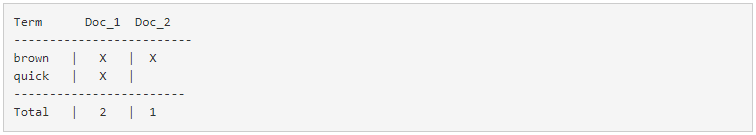

# 原理

## 倒排索引

下图是ElasticSearch的索引结构，下边黑色部分是物理结构，上边黄色部分是逻辑结构，逻辑结构也是为了更好的去描述ElasticSearch的工作原理及去使用物理结构中的索引文件。

逻辑结构部分是一个**倒排索引表**：

1、将要搜索的**文档内容分词**，所有不重复的词组成**分词列表Term**。

2、将搜索的**文档最终以Document方式存**储起来。

3、每个词**Term和Docment都有关联**。

如下：

如果我们想搜索`quick brown` ，我们只需要查找包含每个词条的文档：

两个文档都匹配，但是第一个文档比第二个匹配度更高。如果我们使用仅计算匹配词条数量的简单相似性算法 ，那么我们可以说，对于我们查询的相关性来讲，第一个文档比第二个文档更佳。

