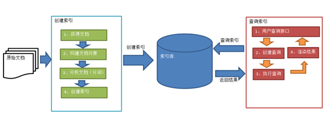
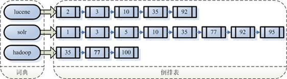

# Primer

## 什么是全文检索

### 数据分类

- **结构化数据**：指具有固定格式或有限长度的数据，如数据库，元数据等
- **非结构化数据**：指不定长或无固定格式的数据，如邮件，word文档等磁盘上的文件


### 结构化数据搜索

​	常见的**结构化数据**也就是**数据库中**的数据。在数据库中搜索很容易实现，通常都是使用sql语句进行查询，而且能很快的得到查询结果（数据库中的数据存储是有规律的，有行有列而且数据格式、数据长度都是固定的）。


### 非结构化数据查询方法

- **顺序扫描法**(Serial Scanning)：如对于每一个文档，从头看到尾......

- **全文检索**(Full-text Search)：

    将非结构化数据中的一部分信息提取出来，重新组织，使其变得有一定结构，然后对此有一定结构的数据进行搜索，从而达到搜索相对较快的目的。这部分**从非结构化数据中提取出的然后重新组织的信息**，我们称之**索引**。

    例如：字典。字典的拼音表和部首检字表就相当于字典的索引，对每一个字的解释是非结构化的，如果字典没有音节表和部首检字表，在茫茫辞海中找一个字只能顺序扫描。然而字的某些信息可以提取出来进行结构化处理，比如读音，就比较结构化，分声母和韵母，分别只有几种可以一一列举，于是将读音拿出来按一定的顺序排列，每一项读音都指向此字的详细解释的页数。我们搜索时按结构化的拼音搜到读音，然后按其指向的页数，便可找到我们的非结构化数据——也即对字的解释。

    **这种先建立索引，再对索引进行搜索的过程就叫全文检索(Full-text Search)。**虽然创建索引的过程也是非常耗时的，但是**索引**一旦创建就可以**多次使用**，全文检索主要处理的是查询，所以耗时间创建索引是值得的。


### 如何实现全文检索

可以使用Lucene实现全文检索。Lucene是apache下的一个开放源代码的全文检索引擎工具包。提供了完整的查询引擎和索引引擎，部分文本分析引擎。Lucene的目的是为软件开发人员提供一个简单易用的工具包，以方便的在目标系统中实现全文检索的功能。


### 全文检索的应用场景

​	对于**数据量大**、**数据结构不固定的数据**可采用全文检索方式搜索，比如百度、Google等**搜索引擎**、**论坛站内搜索**、**电商网站站内搜索**等。


## Lucene实现全文检索的流程



- 绿色表示索引过程，对要搜索的原始内容进行索引构建一个索引库，索引过程包括：

    确定原始内容即要搜索的内容（原始文档）—>采集文档—>创建文档—>分析文档—>索引文档

- 红色表示搜索过程，从索引库中搜索内容，搜索过程包括：

    用户通过搜索界面—>创建查询—>执行搜索，从索引库搜索—>渲染搜索结果


### 创建索引

> 将用户要搜索的文档内容创建索引，索引存储在索引库（index）中

1. **获得原始文档**

    原始文档是指**要索引和搜索的内容**。原始内容包括互联网上的网页（爬虫）、数据库中的数据、磁盘上的文件等

2. **创建文档对象**

    获取原始内容的目的是为了索引，在索引前需要将原始内容创建成文档（**Document**），文档中包括**一个一个的域（Field，如文件名/文件内容/大小等）**，域中存储内容（key-value类型）

    注意：每个Document可以有多个Field，不同的Document可以有不同的Field，同一个Document可以有相同的Field（域名和域值都相同）。**每个文档都有一个唯一的编号，就是文档ID**。

3. **分析文档**

    将原始内容创建为包含域（Field）的文档（Document），需要再对域中的内容进行分析，分析的过程是经过对原始文档**提取单词**、将**字母转为小写**、**去除标点符号**、**去除停用词等**过程生成最终的语汇单元，可以将语汇单元理解为一个一个的单词。

    **每个单词叫做一个Term**，不同的域中拆分出来的相同的单词是不同的Term。**Term中**包含两部分一部分是**文档的域名**，另一部分是**单词的内容**。

4. **创建索引**

    对所有文档分析得出的语汇单元进行索引，索引的目的是为了搜索，最终要实现**只搜索被索引的语汇单元**从而**找到Document（文档）**

    注意：创建索引是对语汇单元索引，==**通过词语（内容）找文档**==，这种索引的结构叫==**倒排索引结构**==。

    传统方法是根据**文件找到该文件的内容**，在文件内容中匹配搜索关键字，这种方法是顺序扫描方法，数据量大、搜索慢。

    **倒排索引结构也叫反向索引结构，包括索引和文档两部分，索引即词汇表，它的规模较小，而文档集合较大。**



### 查询索引

> 查询索引也是搜索的过程。搜索就是用户输入关键字，从索引（index）中进行搜索的过程。根据关键字搜索索引，根据索引找到对应的文档，从而找到要搜索的内容（此处案例指磁盘上的文件）

1. **用户查询接口**

    全文检索系统提供用户搜索的界面供用户提交**搜索的关键字**，搜索完成展示搜索结果。

    > Lucene不提供制作用户搜索界面的功能，需要根据自己的需求开发搜索界面

2. **创建查询**

    用户输入查询关键字执行搜索之前需要先**构建一个查询对象**，查询对象中可以指定查询要搜索的**Field**文档域、**查询关键字**等，查询对象会生成具体的查询语法，例如：语法 “fileName:lucene”表示要搜索Field域的文件名为“lucene”的文档

3. **执行查询**

    搜索索引过程：根据查询语法**在倒排索引词典表中分别找出对应搜索词的索引**，从而找到索引所链接的**文档链表**。

    比如搜索语法为“fileName:lucene”表示搜索出fileName域中包含Lucene的文档。搜索过程就是**在索引上查找域为fileName，并且关键字为Lucene的Term，并根据Term找到文档id列表**。

4. **渲染结果**

    以一个友好的界面将查询结果展示给用户，用户根据搜索结果找自己想要的信息，为了帮助用户很快找到自己的结果，提供了很多展示的效果，比如搜索结果中将关键字高亮显示，百度提供的快照等。


## Hello World

> 实现一个文件的搜索功能，通过关键字搜索文件，凡是文件名或文件内容包括关键字的文件都需要找出来。还可以根据中文词语进行查询，并且需要支持多个条件查询。

1. Lucene是开发全文检索功能的工具包，从[官方网站](http://lucene.apache.org/)下载如`lucene-7.4.0`（要求JDK1.8以上），并解压

    其中core为核心包；analysis为分析包；queryparse为查询分析器

    需要使用的有：`lucene-core-7.4.0.jar` `lucene-analyzers-common-7.4.0.jar`，还需要`common-io`来操作文件

2. **创建索引**

    1. 创建一个java工程，并导入jar包
    2. 创建`Directory`对象，指定索引库的存放位置
    3. 创建一个`IndexWriterConfig`对象
    4. 创建一个`IndexWriter`对象。
    5. 创建`Document`对象
    6. 创建`Field`对象，将field**添加**到Document对象中
    7. 使用`IndexWriter`对象将`Document`对象写入索引库，此过程进行索引创建。并将索引和`Document`对象写入索引库。
    8. 关闭`IndexWriter`对象。

    ```java
    @Test
    public void createIndex() throws IOException {
        //1.指定索引库存放的路径，存入磁盘
        Directory directory = FSDirectory.open(new File("C:\\Develop\\lucene-7.4.0\\index").toPath());
        //索引库还可以存放到内存中
        //Directory directory = new RAMDirectory();
    
        //2.创建IndexWriterConfig对象，若不指定参数则为使用标准分析器
        IndexWriterConfig config = new IndexWriterConfig(new IKAnalyzer());
        //3.创建IndexWriter对象
        IndexWriter indexWriter = new IndexWriter(directory,config);
        //原始文档的路径
        File dir = new File("F:\\00000\\0000000博学谷JavaEE\\5-流行框架\\1 lucene\\02.参考资料\\searchsource");
        File[] files = dir.listFiles();
        for (File file : files) {
            //文件名
            String fileName = file.getName();
            //文件内容
            String fileContent = FileUtils.readFileToString(file,"UTF-8");
            //文件路径
            String filePath = file.getPath();
            //文件的大小
            long fileSize  = FileUtils.sizeOf(file);
            //4.创建文件名域
            //第一个参数：域的名称；第二个参数：域的内容；第三个参数：是否存储
            Field fileNameField = new TextField("filename", fileName, Field.Store.YES);
            //文件内容域
            Field fileContentField = new TextField("content", fileContent, Field.Store.YES);
            //文件路径域（不分析、不索引、只存储）
            Field filePathField = new TextField("path", filePath, Field.Store.YES);
            //文件大小域
            Field fileSizeField = new TextField("size", fileSize + "", Field.Store.YES);
    
            //5.创建document对象
            Document document = new Document();
            document.add(fileNameField);
            document.add(fileContentField);
            document.add(filePathField);
            document.add(fileSizeField);
            //6.创建索引，并写入索引库
            indexWriter.addDocument(document);
        }
        //7.关闭Indexwriter对象
        indexWriter.close();
    }
    ```

3. 可以使用luke-7.4.0（利用JavaFx开发的应用，版本和lucene对应）查看index目录中索引库的信息，软件要求JDK9.0以上

4. **查询索引库**

    1. 创建一个`Directory`对象，也就是索引库存放的位置。
    2. 创建一个`IndexReader`对象，需要指定`Directory`对象。
    3. 创建一个`Indexsearcher`对象，需要指定`IndexReader`对象
    4. 创建一个`Query`对象`TermQuery`，指定查询的**域**和查询的**关键词**。
    5. 执行查询，得到`TopDocs`对象
    6. 返回查询结果。遍历查询结果并输出。
    7. 关闭`IndexReader`对象。

    ```java
    @Test
    public void searchIndex() throws Exception {
        //1.指定索引库存放的路径
        Directory directory = FSDirectory.open(new File("C:\\Develop\\lucene-7.4.0\\index").toPath());
        //2.创建IndexReader对象
        IndexReader indexReader = DirectoryReader.open(directory);
        //3.创建IndexSearcher对象
        IndexSearcher indexSearcher = new IndexSearcher(indexReader);
        //4.创建查询，指定查询的域和查询的关键词
        Query query = new TermQuery(new Term("content", "spring"));
        //执行查询
        //第一个参数是查询对象，第二个参数是查询结果返回的最大值
        TopDocs topDocs = indexSearcher.search(query, 10);
        //查询结果的总条数
        System.out.println("查询结果的总条数："+ topDocs.totalHits);
        //遍历查询结果
        //topDocs.scoreDocs存储了document对象的id
        for (ScoreDoc scoreDoc : topDocs.scoreDocs) {
            //scoreDoc.doc属性就是document对象的id
            //根据document的id找到document对象
            Document document = indexSearcher.doc(scoreDoc.doc);
            System.out.println(document.get("filename"));
            //System.out.println(document.get("content"));
            System.out.println(document.get("path"));
            System.out.println(document.get("size"));
            System.out.println("-------------------------");
        }
        //关闭Indexreader对象
        indexReader.close();
    }
    ```


## 分析器

查看分析器的分词效果

1. 创建一个标准分析器对象`Analyzer`

2. 获得`TokenStream`对象

3. 添加一个引用，可以获得每个关键词

4. 将指针调整到列表的头部

5. 遍历关键词列表，通过`incrementToken`方法判断列表是否结束

6. 关闭`TokenStream`

    ```java
    @Test
    public void testTokenStream() throws Exception {
        //创建一个标准分析器对象，对中文分词只能按字分
        //Analyzer analyzer = new StandardAnalyzer();
        
        //创建一个IKAnalyzer分析器对象
        Analyzer analyzer = new IKAnalyzer();
        //获得tokenStream对象
        //第一个参数：Field，可以随便给一个（这里只是测试）；第二个参数：要分析的文本内容
        TokenStream tokenStream = analyzer.tokenStream("test", "The Spring Framework provides a comprehensive programming and configuration model.");
        //添加一个引用，可以获得每个关键词
        CharTermAttribute charTermAttribute = tokenStream.addAttribute(CharTermAttribute.class);
        //添加一个偏移量的引用，记录了关键词的开始位置以及结束位置
        OffsetAttribute offsetAttribute = tokenStream.addAttribute(OffsetAttribute.class);
        //将指针调整到列表的头部
        tokenStream.reset();
        //遍历关键词列表，通过incrementToken方法判断列表是否结束
        while(tokenStream.incrementToken()) {
            //关键词的起始位置
            System.out.println("start->" + offsetAttribute.startOffset());
            //取关键词，直接打印调用toString()方法
            System.out.println(charTermAttribute);
            //结束位置
            System.out.println("end->" + offsetAttribute.endOffset());
        }
        tokenStream.close();
    }
    ```


### 中文分析器

- Lucene自带中文分词器

    - StandardAnalyzer：单字分词
    - SmartChineseAnalyzer：对中文支持较好，但扩展性差，扩展词库，禁用词库和同义词库等不好处理

- **IKAnalyzer**

    1. 把`IK-Analyzer-1.0-SNAPSHOT.jar`包添加到工程中

    2. 把配置文件和扩展词典和停用词词典添加到classpath下

        注意：hotword.dic和ext_stopword.dic文件的格式为UTF-8，注意是无BOM 的UTF-8 编码

    3. 使用自定义分析器`IndexWriterConfig config = new IndexWriterConfig(new IKAnalyzer());`


## 索引库的维护（Field及增删改）

### Field域的属性

- **是否分析**：是否对域的内容进行**分词**处理。前提是我们要对域的内容进行查询。

- **是否索引**：将Field分析后的词或整个Field值进行索引，只有索引方可搜索到。

    比如：商品名称、商品简介分析后进行索引，订单号、身份证号不用分析但也要索引，这些将来都要作为**查询条件**。

- **是否存储**：将Field值存储在文档中，存储在文档中的Field才可以从Document中获取。

    比如：商品名称、订单号，凡是将来要从Document中获取的Field都要存储。**是否要将内容展示给用户**。

|                           Field类                            |        数据类型        | Analyzed是否分析 | Indexed是否索引 | Stored是否存储 |                             说明                             |
| :----------------------------------------------------------: | :--------------------: | :--------------: | :-------------: | :------------: | :----------------------------------------------------------: |
|              StoredField(FieldName, FieldValue)              | 重载方法，支持多种类型 |        N         |        N        |       Y        | 这个Field用来构建不同类型Field   不分析，不索引，但要Field存储在文档中 |
|            LongPoint(String name, long... point)             |         Long型         |        Y         |        Y        |       N        | 可以使用LongPoint、IntPoint等类型存储数值类型的数据。让数值类型可以进行索引。但是不能存储数据，如果想存储数据还需要使用StoredField。 |
|       StringField(FieldName,   FieldValue,Store.YES))        |         字符串         |        N         |        Y        |      Y或N      | 这个Field用来构建一个字符串Field，但是不会进行分析，会将整个串存储在索引中，比如(订单号,姓名等)   是否存储在文档中用Store.YES或Store.NO决定 |
| TextField(FieldName, FieldValue, Store.NO)或   TextField(FieldName, reader) |    字符串   或   流    |        Y         |        Y        |      Y或N      | 如果是一个Reader, lucene猜测内容比较多,会采用Unstored的策略. |

修改之前的创建索引中方法

```java
//不同的document可以有不同的域，同一个document可以有相同的域。
document.add(new TextField("filename", "新添加的文档", Field.Store.YES));
document.add(new TextField("content", "新添加的文档的内容", Field.Store.NO));
//LongPoint创建索引
document.add(new LongPoint("size", 1000l));
//StoreField存储数据
document.add(new StoredField("size", 1000l));
//不需要创建索引的就使用StoreField存储
document.add(new StoredField("path", "d:/temp/1.txt"));
```


### 索引库增删改

```java
public class IndexManager {

    private IndexWriter indexWriter;

    @Before
    public void init() throws Exception {
        //创建一个IndexWriter对象，需要使用IKAnalyzer作为分析器
        indexWriter =
                new IndexWriter(FSDirectory.open(new File("C:\\temp\\index").toPath()),
                        new IndexWriterConfig(new IKAnalyzer()));
    }

    @Test
    public void addDocument() throws Exception {
        //创建一个IndexWriter对象，需要使用IKAnalyzer作为分析器
        IndexWriter indexWriter =
                new IndexWriter(FSDirectory.open(new File("C:\\temp\\index").toPath()),
                new IndexWriterConfig(new IKAnalyzer()));
        //创建一个Document对象
        Document document = new Document();
        //向document对象中添加域
        document.add(new TextField("name", "新添加的文件", Field.Store.YES));
        document.add(new TextField("content", "新添加的文件内容", Field.Store.NO));
        document.add(new StoredField("path", "c:/temp/helo"));
        // 把文档写入索引库
        indexWriter.addDocument(document);
        //关闭索引库
        indexWriter.close();
    }

    //将索引目录的索引信息全部删除，直接彻底删除，无法恢复！！！！！
    @Test
    public void deleteAllDocument() throws Exception {
        //删除全部文档
        indexWriter.deleteAll();
        //关闭索引库
        indexWriter.close();
    }

    @Test
    public void deleteDocumentByQuery() throws Exception {
        indexWriter.deleteDocuments(new Term("name", "apache"));//参数为Query也可以，好像只是再封装了一层
        indexWriter.close();
    }

    //原理是先删除！！！后添加！！！
    @Test
    public void updateDocument() throws Exception {
        //创建一个新的文档对象
        Document document = new Document();
        //向文档对象中添加域
        document.add(new TextField("name", "更新之后的文档", Field.Store.YES));
        document.add(new TextField("name1", "更新之后的文档2", Field.Store.YES));
        document.add(new TextField("name2", "更新之后的文档3", Field.Store.YES));
        //更新操作
        indexWriter.updateDocument(new Term("name", "spring"), document);
        //关闭索引库
        indexWriter.close();
    }
}
```


### 索引库查询

对要搜索的信息创建Query查询对象，Lucene会根据Query查询对象生成最终的查询语法，类似关系数据库Sql语法一样Lucene也有自己的查询语法，比如：“name:lucene”表示查询Field的name为“lucene”的文档信息。可通过两种方法创建查询对象：

- 使用Lucene提供Query子类

    - **TermQuery**，根据**域**和**关键词**进行查询，**TermQuery不使用分析器所以建议匹配不分词的Field域查询**，比如订单号
    - LongPoint.**newRangeQuery**，**数值范围查询**

- 使用**QueryParse**解析查询表达式（**先分词**，再查询，需要指定**默认查找Field**和**分析器**）

    - 通过QueryParser也可以创建Query，QueryParser提供一个Parse方法，此方法可以直接根据查询语法来查询。Query对象执行的查询语法可通过`System.out.println(query);`查询。

        需要使用到分析器。建议创建索引时使用的分析器和查询索引时使用的分析器要一致。

        需要加入queryParser依赖的`lucene-queryparser-7.4.0.jar`包

```java
public class SearchIndex {
    private IndexReader indexReader;
    private IndexSearcher indexSearcher;
    @Before
    public void init() throws Exception {
        indexReader = DirectoryReader.open(FSDirectory.open(new File("C:\\temp\\index").toPath()));
        indexSearcher = new IndexSearcher(indexReader);
    }

    @Test
    public void testTermQuery() throws Exception {
        //创建一个Query对象
        Query query = new TermQuery(new Term("content", "lucene"));
        printResult(query);
    }
    
    
    //数值范围查询
    @Test
    public void testRangeQuery() throws Exception {
        //创建一个Query对象
        Query query = LongPoint.newRangeQuery("size", 0L, 100L);
        printResult(query);
    }

    @Test
    public void testQueryParser() throws Exception {
        //创建一个QueryPaser对象，两个参数
        //参数1：默认搜索域，参数2：分析器对象
        QueryParser queryParser = new QueryParser("name", new IKAnalyzer());
        //使用QueryPaser对象创建一个Query对象
        Query query = queryParser.parse("lucene是一个Java开发的全文检索工具包");
        //执行查询
        printResult(query);
    }


//========================================================================================
    private void printResult(Query query) throws Exception {
        //执行查询
        TopDocs topDocs = indexSearcher.search(query, 10);
        System.out.println("总记录数：" + topDocs.totalHits);
        ScoreDoc[] scoreDocs = topDocs.scoreDocs;
        for (ScoreDoc doc:scoreDocs){
            //取文档id
            int docId = doc.doc;
            //根据id取文档对象
            Document document = indexSearcher.doc(docId);
            System.out.println(document.get("name"));
            System.out.println(document.get("path"));
            System.out.println(document.get("size"));
            //System.out.println(document.get("content"));
            System.out.println("-----------------寂寞的分割线");
        }
        indexReader.close();
    }
}
```

