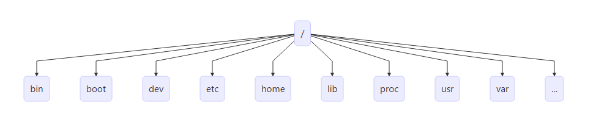

# 0 Basic

## 概述

Linux 是一种自由和开放源码的类 UNIX 操作系统，使用 Linux 内核。目前存在着许多不同的 Linux 发行版，可安装在各种各样的电脑硬件设备，从手机、平板电脑、路由器和影音游戏控制台，到桌上型电脑，大型电脑和超级电脑。 Linux 是一个领先的操作系统，世界上运算最快的 10 台超级电脑运行的都是 Linux 操作系统。

Linux 操作系统也是自由软件和开放源代码发展中最著名的例子。只要遵循 GNU 通用公共许可证,任何人和机构都可以自由地使用 Linux 的所有底层源代码，也可以自由地修改和再发布。严格来讲，Linux 这个词本身只表示 Linux 内核，但在实际上人们已经习惯了用 Linux 来形容整个基于 Linux 内核，并且使用 GNU 工程各种工具和数据库的操作系统 (也被称为 GNU/ Linux)。通常情况下，Linux 被打包成供桌上型电脑和服务器使用的 Linux 发行版本。一些流行的主流 Linux 发行版本，包括 Debian (及其衍生版本 Ubuntu)，Fedora 和 OpenSUSE 等。Kernel + Softwares + Tools 就是 Linux Distribution

目前市面上较知名的发行版有：`Ubuntu`、RedHat、`CentOS`、Debian、Fedora、SuSE、OpenSUSE、TurboLinux、BluePoint、RedFlag、Xterm、SlackWare等。

## Linux 与 Windows 比较

| 比较     | Windows                                                      | Linux                                                        |
| :------- | :----------------------------------------------------------- | :----------------------------------------------------------- |
| 界面     | 界面统一，外壳程序固定所有 Windows 程序菜单几乎一致，快捷键也几乎相同 | 图形界面风格依发布版不同而不同，可能互不兼容。GNU/Linux 的终端机是从 UNIX 传承下来，基本命令和操作方法也几乎一致。 |
| 驱动程序 | 驱动程序丰富，版本更新频繁。默认安装程序里面一般包含有该版本发布时流行的硬件驱动程序，之后所出的新硬件驱动依赖于硬件厂商提供。对于一些老硬件，如果没有了原配的驱动有时很难支持。另外，有时硬件厂商未提供所需版本的 Windows 下的驱动，也会比较头痛。 | 由志愿者开发，由Linux核心开发小组发布，很多硬件厂商基于版权考虑并未提供驱动程序，尽管多数无需手动安装，但是涉及安装则相对复杂，使得新用户面对驱动程序问题（是否存在和安装方法）会一筹莫展。但是在开源开发模式下，许多老硬件尽管在 Windows 下很难支持的也容易找到驱动。HP、Intel、AMD 等硬件厂商逐步不同程度支持开源驱动，问题正在得到缓解。 |
| 使用     | 使用比较简单，容易入门。图形化界面对没有计算机背景知识的用户使用十分有利。 | 图形界面使用简单，容易入门。文字界面，需要学习才能掌握。     |
| 学习     | 系统构造复杂、变化频繁，且知识、技能淘汰快，深入学习困难。   | 系统构造简单、稳定，且知识、技能传承性好，深入学习相对容易。 |
| 软件     | 每一种特定功能可能都需要商业软件的支持，需要购买相应的授权。 | 大部分软件都可以自由获取，同样功能的软件选择较少。           |


## 安装 Ubuntu

*   选择Use An Entire Disk And Set Up LVM，以便后续扩容
*   将磁盘可用空间使用完，即调整 lv 分区（逻辑卷）大小
*   勾选 Install OpenSSH server
*   修改 mirror


## 远程控制管理 SSH

传统的网络服务程序，FTP、POP、Telnet 本质上都是不安全的，因为它们在网络上通过明文传送口令和数据，这些数据非常容易被截获。SSH 叫做 `Secure Shell`。通过 SSH，可以把传输数据进行加密，预防攻击，传输的数据进行了压缩，可以加快传输速度。

### OpenSSH

SSH 是芬兰一家公司开发。但是受到版权和加密算法限制，现在很多人都使用 OpenSSH。OpenSSH 是 SSH 的替代软件，免费。OpenSSH 由客户端和服务端组成。

-   **基于口令的安全验证：** 知道服务器的帐号密码即可远程登录，口令和数据在传输过程中都会被加密。
-   **基于密钥的安全验证：** 此时需要在创建一对密钥，把公有密钥放到远程服务器上自己的宿主目录中，而私有密钥则由自己保存。

一般安装 Ubuntu 时会勾选自动安装 OpenSSH，若没有可按如下步骤完成安装：

```bash
# 检查软件是否安装
sudo apt-cache policy openssh-client openssh-server
# 安装服务端
sudo apt install openssh-server
# 安装客户端
sudo apt install openssh-client
```

OpenSSH 服务器的主要配置文件为 `/etc/ssh/sshd\_config`，几乎所有的配置信息都在此文件中。

Windows 下的 SSH 软件有：XShell、FinalShell，itrem

macOS 下的可以使用iTerm，自己配置


## 目录

### 目录结构



| 目录    | 说明                                                         |
| :------ | :----------------------------------------------------------- |
| **bin** | 存放二进制可执行文件(`ls`, `cat`, `mkdir` 等)                |
| boot    | 存放用于系统引导时使用的各种文件                             |
| dev     | 用于存放设备文件                                             |
| **etc** | 存放系统配置文件                                             |
| home    | 存放所有用户文件的根目录                                     |
| lib     | 存放跟文件系统中的程序运行所需要的共享库及内核模块           |
| mnt     | 系统管理员安装临时文件系统的安装点                           |
| opt     | 额外安装的可选应用程序包所放置的位置                         |
| proc    | 虚拟文件系统，存放当前内存的映射                             |
| root    | 超级用户目录                                                 |
| sbin    | 存放二进制可执行文件，只有 root 才能访问                     |
| tmp     | 用于存放各种临时文件                                         |
| **usr** | 用于存放系统应用程序，比较重要的目录 `/usr/local` 本地管理员软件安装目录 |
| **var** | 用于存放运行时需要改变数据的文件                             |


### 操作文件目录

| 命令  | 说明                                   | 语法                                            | 参数  | 参数说明                           |
| :---- | :------------------------------------- | :---------------------------------------------- | :---- | :--------------------------------- |
| ls    | 显示文件和目录列表                     | ls [-alrtAFR] [name...]                         |       |                                    |
|       |                                        |                                                 | -l    | 列出文件的详细信息                 |
|       |                                        |                                                 | -a    | 列出当前目录所有文件，包含隐藏文件 |
| mkdir | 创建目录                               | mkdir [-p] dirName                              |       |                                    |
|       |                                        |                                                 | -p    | 父目录不存在情况下先生成父目录     |
| cd    | 切换目录                               | cd [dirName]                                    |       |                                    |
| touch | 生成一个空文件                         |                                                 |       |                                    |
| echo  | 生成一个带内容文件                     | echo abcd > 1.txt，echo 1234 >> 1.txt           |       |                                    |
| cat   | 显示文本文件内容                       | cat [-AbeEnstTuv] [--help] [--version] fileName |       |                                    |
| cp    | 复制文件或目录                         | cp [options] source dest                        |       |                                    |
| rm    | 删除文件                               | rm [options] name...                            |       |                                    |
|       |                                        |                                                 | -f    | 强制删除文件或目录                 |
|       |                                        |                                                 | -r    | 同时删除该目录下的所有文件         |
| mv    | 移动文件或目录                         | mv [options] source dest                        |       |                                    |
| find  | 在文件系统中查找指定的文件             |                                                 |       |                                    |
|       |                                        |                                                 | -name | 文件名                             |
| grep  | 在指定的文本文件中查找指定的字符串     |                                                 |       |                                    |
| tree  | 用于以树状图列出目录的内容             |                                                 |       |                                    |
| pwd   | 显示当前工作目录                       |                                                 |       |                                    |
| ln    | 建立软链接，类似快捷方式，建立的是引用 |                                                 |       |                                    |
| more  | 分页显示文本文件内容                   |                                                 |       |                                    |
| head  | 显示文件开头内容                       |                                                 |       |                                    |
| tail  | 显示文件结尾内容                       |                                                 |       |                                    |
|       |                                        |                                                 | -f    | 跟踪输出                           |

### 压缩解压缩

#### tar

| 命令 | 语法                                        | 参数 | 参数说明                        |
| :--- | :------------------------------------------ | :--- | :------------------------------ |
| tar  | tar [-cxzjvf] 压缩打包文档的名称 欲打包目录 |      | 该命令压缩文件后缀为 gz         |
|      |                                             | -c   | 建立一个归档文件的参数指令      |
|      |                                             | -x   | 解开一个归档文件的参数指令      |
|      |                                             | -z   | 是否需要用 gzip 压缩            |
|      |                                             | -j   | 是否需要用 bzip2 压缩           |
|      |                                             | -v   | 压缩的过程中显示文件            |
|      |                                             | -f   | 使用档名，在 f 之后要立即接档名 |
|      |                                             | -tf  | 查看归档文件里面的文件          |

**例子：**

-   压缩文件夹：`tar -zcvf test.tar.gz test\`
-   解压文件夹：`tar -zxvf test.tar.gz`


#### gzip

| 命令 | 语法                               | 参数 | 参数说明                                                     |
| :--- | :--------------------------------- | :--- | :----------------------------------------------------------- |
| gzip | gzip [选项] 压缩（解压缩）的文件名 |      | 该命令压缩文件后缀为 gz                                      |
|      |                                    | -d   | 解压缩                                                       |
|      |                                    | -l   | 对每个压缩文件，显示压缩文件的大小，未压缩文件的大小，压缩比，未压缩文件的名字 |
|      |                                    | -v   | 对每一个压缩和解压的文件，显示文件名和压缩比                 |
|      |                                    | -num | 用指定的数字num调整压缩的速度，-1或--fast表示最快压缩方法（低压缩比），-9或--best表示最慢压缩方法（高压缩比）。系统缺省值为6 |

#### bzip2

| 命令  | 语法         | 参数 | 参数说明                                                     |
| :---- | :----------- | :--- | :----------------------------------------------------------- |
| bzip2 | bzip2 [-cdz] |      | 该命令压缩文件后缀为 bz2                                     |
|       |              | -d   | 解压缩                                                       |
|       |              | -z   | 压缩参数                                                     |
|       |              | -num | 用指定的数字num调整压缩的速度，-1或--fast表示最快压缩方法（低压缩比），-9或--best表示最慢压缩方法（高压缩比）。系统缺省值为6 |


