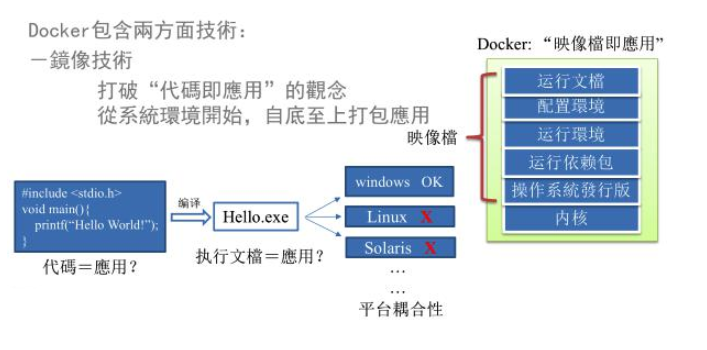
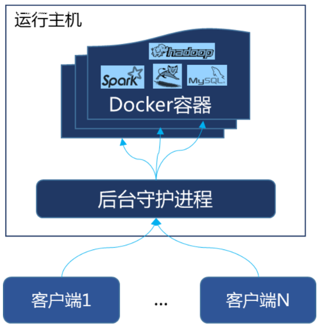
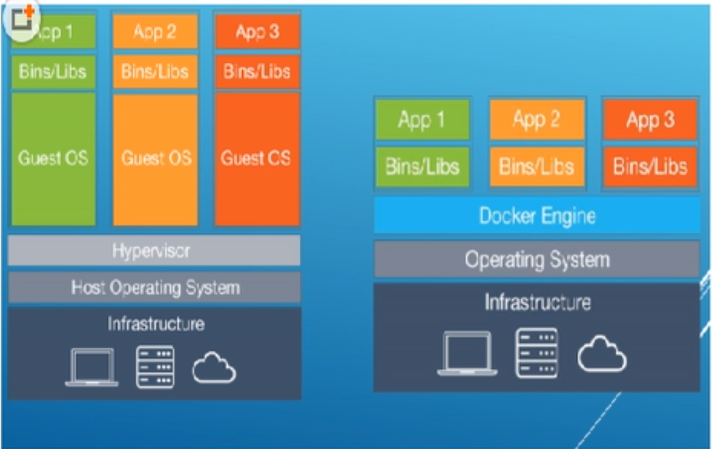

# Docker

## Docker 简介

### Docker 是什么

Docker 使用 Google 公司推出的 **Go** 语言进行开发实现，基于 Linux 内核的 `cgroup`，`namespace`，以及 `AUFS` 类的 `Union FS` 等技术，对**进程进行封装隔离**，属于操作系统层面的**虚拟化技术**。由于**隔离的进程独立于宿主和其它的隔离的进程**，因此也称其为 **容器** 。最初实现是基于 LXC，从 0.7 版本以后开始去除 LXC，转而使用自行开发的 libcontainer，从 1.11 开始，则进一步演进为使用 runC 和 containerd。Docker 在容器的基础上，进行了进一步的封装，从文件系统、网络互联到进程隔离等等，极大的简化了容器的创建和维护。使得 Docker 技术比虚拟机技术更为轻便、快捷。

下面的图片比较了 Docker 和传统虚拟化方式的不同之处。传统虚拟机技术是虚拟出一套硬件后，在其上运行一个完整操作系统，在该系统上再运行所需应用进程；而容器内的应用进程直接运行于宿主的内核，容器内没有自己的内核，而且也没有进行硬件虚拟。因此容器要比传统虚拟机更为轻便。


### Docker 能干什么

传统上认为，软件编码开发/测试结束后，所产出的成果即是程序或是能够编译执行的二进制字节码等(java为例)。而为了让这些程序可以顺利执行，开发团队也得准备完整的部署文件，让维运团队得以部署应用程式，开发需要清楚的告诉运维部署团队，用的全部配置文件+所有软件环境。不过，即便如此，仍然常常发生部署失败的状况。

Docker镜像的设计，使得Docker得以**打破过去「程序即应用」的观念**。**透过镜像(images)将作业系统核心除外，运作应用程式所需要的系统环境，由下而上打包，达到应用程式跨平台间的无缝接轨运作**。其主要目标是“**Build，Ship and Run Any App,Anywhere**”，也就是通过对应用组件的封装、分发、部署、运行等生命周期的管理，使用户的APP（可以是一个WEB应用或数据库应用等等）及其运行环境能够做到“一次封装，到处运行”。Linux 容器技术的出现就解决了这样一个问题，而 Docker 就是在它的基础上发展过来的。将应用运行在 Docker 容器上面，而 Docker 容器在任何操作系统上都是一致的，这就实现了跨平台、跨服务器。只需要一次配置好环境，换到别的机子上就可以一键部署好，大大简化了操作。**解决了运行环境和配置问题的软件容器，方便做持续集成并有助于整体发布的容器虚拟化技术。**软件可以带环境安装？也就是说，安装的时候，把原始环境一模一样地复制过来。开发人员利用 Docker 可以消除协作编码时“在我的机器上可正常工作”的问题。

**开发/运维（DevOps）**：一次构建、随处运行

- **一致的运行环境**

  应用容器化运行后，生产环境运行的应用可与开发、测试环境的应用高度一致，容器会将应用程序相关的环境和状态完全封装起来，不会因为底层基础架构和操作系统的不一致性给应用带来影响，产生新的BUG。当出现程序异常时，也可以通过测试环境的相同容器进行快速定位和修复。

- **更快速的启动时间**

    传统的虚拟机技术启动应用服务往往需要数分钟，而 Docker 容器应用，由于直接运行于宿主内核，无需启动完整的操作系统，因此可以做到秒级、甚至毫秒级的启动时间。大大的节约了开发、测试、部署的时间。

- **持续交付和部署**

    使用 Docker 可以通过定制应用镜像来实现持续集成、持续交付、部署。开发人员可以通过 Dockerfile 来进行镜像构建，并结合**持续集成**(Continuous Integration) 系统进行集成测试，而运维人员则可以直接在生产环境中快速部署该镜像，甚至结合**持续部署**(Continuous Delivery/Deployment) 系统进行自动部署。而且使用 Dockerfile 使镜像构建透明化，不仅仅开发团队可以理解应用运行环境，也方便运维团队理解应用运行所需条件，帮助更好的生产环境中部署该镜像。

- **更轻松的迁移**

    由于 Docker 确保了执行环境的一致性，使得应用的迁移更加容易。Docker 可以在很多平台上运行，无论是物理机、虚拟机、公有云、私有云（可使用 OpenStack 搭建），甚至是笔记本，其运行结果是一致的。因此用户可以很轻易的将在一个平台上运行的应用，迁移到另一个平台上，而不用担心运行环境的变化导致应用无法正常运行的情况。

- **更高效的计算资源利用**

  Docker是内核级虚拟化，其不像传统的虚拟化技术一样需要额外的Hypervisor支持，不需要进行硬件虚拟以及运行完整操作系统等额外开销，所以在一台物理机上可以运行很多个容器实例，可大大提升物理服务器的CPU和内存的利用率。

- **更便捷的升级和扩缩容**

  随着微服务架构和Docker的发展，大量的应用会通过微服务方式架构，应用的开发构建将变成搭乐高积木一样，每个Docker容器将变成一块“积木”，应用的升级将变得非常容易。当现有的容器不足以支撑业务处理时，可通过镜像运行新的容器进行快速扩容，使应用系统的扩容从原先的天级变成分钟级甚至秒级。

对比传统虚拟机总结

| 特性       | 容器               | 虚拟机      |
| :--------- | :----------------- | :---------- |
| 启动       | 秒级               | 分钟级      |
| 硬盘使用   | 一般为 `MB`        | 一般为 `GB` |
| 性能       | 接近原生           | 弱于        |
| 系统支持量 | 单机支持上千个容器 | 一般几十个  |




### Docker 安装

1. 查看[官网文档](https://docs.docker.com/install/)，有各种系统的安装介绍。
2. 配置镜像加速，在[阿里云的容器镜像服务](https://cr.console.aliyun.com/cn-hangzhou/instances/repositories)中镜像加速器按步骤配置即可。


### Docker 基本组成

Docker 的架构图如下：


Docker 本身是一个容器运行载体或称之为管理引擎。我们把应用程序和配置依赖打包好形成一个可交付的运行环境，这个打包好的运行环境就就是 image 镜像文件。只有通过这个镜像文件才能生成 Docker 容器。image 文件可以看作是容器的模板。Docker 根据 image 文件生成容器的实例。同一个 image 文件，可以生成多个同时运行的容器实例。

- **镜像**：Docker 镜像（Image）就是一个**只读的模板**。镜像可以**用来创建 Docker 容器**，一个镜像可以创建很多容器。
- **容器**：Docker 利用容器（Container）独立运行的一个或一组应用。**容器是用镜像创建的运行实例**。它可以被启动、开始、停止、删除。每个容器都是相互隔离的、保证安全的平台。**可以把容器看做是一个简易版的 Linux 环境**（包括root用户权限、进程空间、用户空间和网络空间等）和运行在其中的应用程序。容器的定义和镜像几乎一模一样，也是一堆层的统一视角，唯一区别在于容器的最上面那一层是可读可写的。
- **仓库**：仓库（Repository）是**集中存放镜像文件的场所**。仓库（Repository）和仓库注册服务器（Registry）是有区别的。仓库注册服务器上往往存放着多个仓库，每个仓库中又包含了多个镜像，每个镜像有不同的标签（tag）。仓库分为公开仓库（Public）和私有仓库（Private）两种形式。最大的公开仓库是 Docker Hub(https://hub.docker.com/)，存放了数量庞大的镜像供用户下载。国内的公开仓库包括阿里云 、网易云等

### Docker 的底层原理

- Docker如何工作？

Docker是一个Client-Server 结构的系统，Docker守护进程运行在主机上， 然后通过Socket连接从客户端访问，守护进程从客户端接受命令并管理运行在主机上的容器。容器是一个运行时环境，就是我们前面说到的集装箱。 



- 为什么Docker比较比VM快？

虚拟机（virtual machine）就是带环境安装的一种解决方案。它可以在一种操作系统里面运行另一种操作系统，比如在Windows 系统里面运行Linux 系统。应用程序对此毫无感知，因为虚拟机看上去跟真实系统一模一样，而对于底层系统来说，虚拟机就是一个普通文件，不需要了就删掉，对其他部分毫无影响。这类虚拟机完美的运行了另一套系统，能够使**应用程序，操作系统和硬件**三者之间的逻辑不变。虚拟机的缺点：资源占用多、冗余步骤多、启动慢。

由于前面虚拟机存在这些缺点，Linux 发展出了另一种虚拟化技术：Linux 容器（Linux Containers，缩写为 LXC）。Linux 容器不是模拟一个完整的操作系统，而是对进程进行隔离。有了容器，就可以将软件运行所需的所有资源打包到一个隔离的容器中。容器与虚拟机不同，不需要捆绑一整套操作系统，只需要软件工作所需的库资源和设置。系统因此而变得高效轻量并保证部署在任何环境中的软件都能始终如一地运行。



比较 **Docker 和传统虚拟化方式的不同之处**：

- 传统虚拟机技术是**虚拟出一套硬件**后，在其上运行一个完整操作系统，在该系统上再运行所需应用进程；Docker有着比虚拟机更少的抽象层。由于**Docker不需要Hypervisor实现硬件资源虚拟化**，运行在Docker容器上的程序直接使用的都是实际物理机的硬件资源。因此在CPU、内存利用率上Docker将会在效率上有明显优势。
- Docker**利用的是宿主机的内核**，而不需要Guest OS。因此当新建一个容器时，Docker不需要和虚拟机一样重新加载一个操作系统内核。进而避免引寻、加载操作系统内核等比较费时费资源的过程。然而当新建一个虚拟机时，虚拟机软件需要加载Guest OS，返个新建过程是分钟级别的。而Docker由于直接利用宿主机的操作系统，则省略了返个过程，因此新建一个Docker容器只需要几秒钟。
- 每个容器之间**互相隔离**，每个容器有自己的文件系统 ，容器之间进程不会相互影响，能区分计算资源。


## Docker 常用命令

### 帮助命令

- `docker version`：docker的版本等信息
- `docker info`：docker详细信息
- `docker --help`：**帮助**

### 镜像命令

- `docker images [options]`：列出**本地主机**上的镜像

  - `-a`：**列出本地所有的镜像（含中间映像层）**
  - `-q`：**静默**模式，**只显示镜像ID**。
  - `--digests`：显示镜像的摘要信息
  - `--no-trunc`：显示完整的镜像信息

  REPOSITORY：表示镜像的仓库源；TAG：镜像的标签；IMAGE ID：镜像ID；CREATED：镜像创建时间；SIZE：镜像大小

- `docker search [OPTIONS] 镜像名字`：从https://hub.docker.com来查找镜像的！

  - `--no-trunc` : 显示完整的镜像描述
  - `-s` : **列出收藏数不小于指定值的镜像**，star缩写
  - `--automated` : 只列出 automated build类型的镜像；

- `docker pull 镜像名字[:TAG]`：**下载镜像**

- `docker rmi 某个XXX镜像名字ID`：**删除镜像**，`-f`为强制删除

  - `docker rmi -f 镜像ID`：删除单个，不写tag默认为latest
  - `docker rmi -f 镜像名1:TAG 镜像名2:TAG `：删除多个
  - `docker rmi -f $(docker images -qa)`：删除全部

### 容器命令

**有镜像才能创建容器，这是根本前提(下载一个CentOS镜像演示)：`docker pull centos`**

- **新建并启动容器**：`docker run [OPTIONS] IMAGE [COMMAND] [ARG...]`

  - `--name=指定容器名称`: 为容器指定一个**名称**；
  - `-d`: 后台运行容器，并返回容器ID，也即**启动守护式容器**；
  - `-i`：以**交互模式运行容器**，通常与 -t 同时使用；在容器内执行/bin/bash命令。
  - `-t`：为容器重新**分配一个伪输入终端**，通常与 -i 同时使用；
  - `-P`: 随机端口映射；
  - `-p`: **指定端口映射**，有以下四种格式
    - ip:hostPort:containerPort
    - ip::containerPort
    - **hostPort:containerPort**
    - containerPort

- **启动守护式容器**：`docker run -d 容器名`

  问题：然后docker ps -a 进行查看, 会发现容器已经退出。因为Docker容器后台运行,就必须有一个前台进程，容器运行的命令如果不是那些一直挂起的命令（比如运行top，tail），就是会自动退出的。例如启动Ngixn，需要使用交互模式。Tomcat可以使用守护式启动。

- **列出当前所有正在运行的容器**：`docker ps [OPTIONS]`

  - `-a` :列出当前**所有正在运行的容器+历史上运行过的**
  - `-l` :显示最近创建的容器。
  - `-n`：显示最近n个创建的容器。
  - `-q` :**静默**模式，**只显示容器编号**。
  - `--no-trunc` :不截断输出。

- **退出容器**（两种退出方式）：

  - `exit`：容器停止退出
  - `Ctrl+P+Q`：容器不停止退出

- **启动容器**：`docker start 容器ID或者容器名`

- **重启容器**：`docker restart 容器ID或者容器名`

- 停止容器（会有延迟）：`docker stop 容器ID或者容器名`

- 强制立即停止容器：`docker kill 容器ID或者容器名`

- **删除已停止的容器**：`docker rm 容器ID`，`-f`为强制删除

  - 删除多个容器：`docker rm -f $(docker ps -a -q)`或`docker ps -a -q | xargs docker rm`

- 查看容器**日志**：`docker logs -f -t --tail 容器ID`

  - `-t` 是加入时间戳
  - `-f` 跟随最新的日志打印
  - `--tail` 数字 显示最后多少条

- 查看**容器内运行的进程**：`docker top 容器ID`

- 查看容器内部细节：`docker inspect 容器ID`。以JSON格式来查看细节

- **进入正在运行的容器并以命令行交互**

  - `docker exec -it 容器ID [命令]`：在容器中打开新的终端，并且可以启动新的进程（利用命令）
  - `docker attach 容器ID`：直接重新进入容器启动命令的终端，不会启动新的进程

- **从容器内拷贝文件到主机上（可反过来）**：`docker cp 容器ID:容器内路径 目的主机路径`


### 常用命令


```bash
attach    Attach to a running container                 # 当前 shell 下 attach 连接指定运行镜像
build     Build an image from a Dockerfile              # 通过 Dockerfile 定制镜像
commit    Create a new image from a container changes   # 提交当前容器为新的镜像
cp        Copy files/folders from the containers filesystem to the host path   #从容器中拷贝指定文件或者目录到宿主机中
create    Create a new container                        # 创建一个新的容器，同 run，但不启动容器
diff      Inspect changes on a container's filesystem   # 查看 docker 容器变化
events    Get real time events from the server          # 从 docker 服务获取容器实时事件
exec      Run a command in an existing container        # 在已存在的容器上运行命令
export    Stream the contents of a container as a tar archive   # 导出容器的内容流作为一个 tar 归档文件[对应 import ]
history   Show the history of an image                  # 展示一个镜像形成历史
images    List images                                   # 列出系统当前镜像
import    Create a new filesystem image from the contents of a tarball # 从tar包中的内容创建一个新的文件系统映像[对应export]
info      Display system-wide information               # 显示系统相关信息
inspect   Return low-level information on a container   # 查看容器详细信息
kill      Kill a running container                      # kill 指定 docker 容器
load      Load an image from a tar archive              # 从一个 tar 包中加载一个镜像[对应 save]
login     Register or Login to the docker registry server    # 注册或者登陆一个 docker 源服务器
logout    Log out from a Docker registry server          # 从当前 Docker registry 退出
logs      Fetch the logs of a container                 # 输出当前容器日志信息
port      Lookup the public-facing port which is NAT-ed to PRIVATE_PORT    # 查看映射端口对应的容器内部源端口
pause     Pause all processes within a container        # 暂停容器
ps        List containers                               # 列出容器列表
pull      Pull an image or a repository from the docker registry server   # 从docker镜像源服务器拉取指定镜像或者库镜像
push      Push an image or a repository to the docker registry server    # 推送指定镜像或者库镜像至docker源服务器
restart   Restart a running container                   # 重启运行的容器
rm        Remove one or more containers                 # 移除一个或者多个容器
rmi       Remove one or more images      # 移除一个或多个镜像[无容器使用该镜像才可删除，否则需删除相关容器才可继续或 -f 强制删除]
run       Run a command in a new container              # 创建一个新的容器并运行一个命令
save      Save an image to a tar archive                # 保存一个镜像为一个 tar 包[对应 load]
search    Search for an image on the Docker Hub         # 在 docker hub 中搜索镜像
start     Start a stopped containers                    # 启动容器
stop      Stop a running containers                     # 停止容器
tag       Tag an image into a repository                # 给源中镜像打标签
top       Lookup the running processes of a container   # 查看容器中运行的进程信息
unpause   Unpause a paused container                    # 取消暂停容器
version   Show the docker version information           # 查看 docker 版本号
wait      Block until a container stops, then print its exit code   # 截取容器停止时的退出状态值
```


### 常用镜像/容器

- MySQL

  `docker run -d --name=tensquare_mysql -p 3306:3306 -e MYSQL_ROOT_PASSWORD=root [mysqlname/id]`

  会设置ROOT用户的密码为root

## Docker 镜像

### UnionFS

UnionFS（联合文件系统）：Union文件系统（UnionFS）是一种分层、轻量级并且高性能的文件系统，它支持**对文件系统的修改作为一次提交来一层层的叠加**，同时可以将不同目录挂载到同一个虚拟文件系统下(unite several directories into a single virtual filesystem)。UnionFS 是 Docker 镜像的基础。镜像可以通过分层来进行继承，基于基础镜像（没有父镜像），可以制作各种具体的应用镜像。以我们的pull为例，在下载的过程中我们可以看到docker的镜像好像是在一层一层的在下载。

特性：一次同时加载多个文件系统，但从外面看起来，只能看到一个文件系统，联合加载会把各层文件系统叠加起来，这样最终的文件系统会包含所有底层的文件和目录。

### Docker分层镜像&镜像加载原理

- Docker的镜像实际上由一层一层的文件系统组成，这种层级的文件系统UnionFS。

- **bootfs**(boot file system)主要包含**bootloader和kernel**, bootloader主要是引导加载kernel, Linux刚启动时会加载bootfs文件系统，在Docker镜像的最底层是bootfs。这一层与我们典型的Linux/Unix系统是一样的，包含boot加载器和内核。当boot加载完成之后整个内核就都在内存中了，此时内存的使用权已由bootfs转交给内核，此时系统也会卸载bootfs。

- **rootfs** (root file system) ，在bootfs之上rootfs (root file system) ，在bootfs之上。包含的就是典型 Linux 系统中的 /dev, /proc, /bin, /etc 等标准目录和文件。rootfs就是各种不同的操作系统发行版，比如Ubuntu，Centos等等。

- 为什么 Docker 镜像要采用这种**分层结构**呢——**共享资源**

  比如：有多个镜像都从相同的 base 镜像构建而来，那么宿主机只需在磁盘上保存一份base镜像，同时内存中也只需加载一份 base 镜像，就可以为所有容器服务了。而且镜像的每一层都可以被共享。


> 平时我们安装进虚拟机的CentOS都是好几个G，为什么docker这里才200M？？
>
> 对于一个精简的OS，rootfs可以很小，只需要包括最基本的命令、工具和程序库就可以了，因为底层直接用Host的kernel，自己只需要提供 rootfs 就行了。由此可见对于不同的linux发行版, bootfs基本是一致的, rootfs会有差别, 因此不同的发行版可以公用bootfs。
>
> 平时我们安装进虚拟机的Tomcat都是几十M，为什么Docker这里几百M？？
>
> 分层结构，可能包括了Linux kernel / Ubuntu / JDK / Tomcat。

### Docker镜像的特点

Docker镜像都是**只读**的。当容器启动时，**一个新的可写层被加载到镜像的顶部**。这一层通常被称作“**容器层**”，“容器层”之下的都叫“镜像层”。


### Docker镜像Commit

- `docker commit -m "提交的描述信息” -a “作者” 容器ID 要创建的目标镜像名:[标签名]`

  提交容器副本使之成为一个新的镜像

- 案例演示

  1. 从Hub上下载tomcat镜像到本地并成功运行`docker run -it -p 8080:8080 tomcat`
  2. 故意删除上一步镜像生产tomcat容器的文档docs（需要启动后进入）
  3. 也即当前的tomcat运行实例是一个没有文档内容的容器，以它为模板commit一个没有doc的tomcat新镜像
  4. 启动我们的新镜像并和原来的对比
