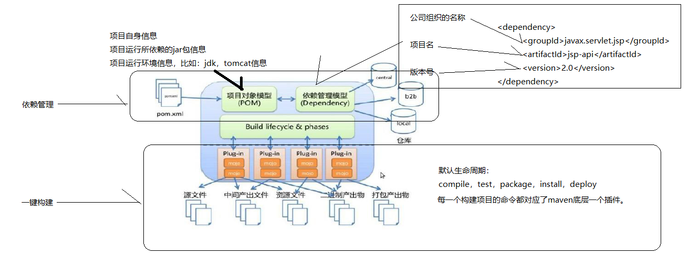
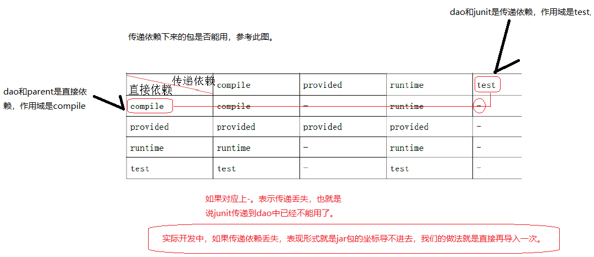

# Maven

## 安装与简介

Maven是apache下的一个开源项目，是纯java开发，用于对java项目进行**构建**、**依赖管理**

下载二进制文件解压，**配置环境变量**即可使用。下面是macOS的例子：

1. 在[官网](https://maven.apache.org/download.cgi)下载 Binary tar.gz archive ，也可以下载 Source tar.gz archive 自己编译。

2. 将其解压到`/usr/local/Maven`下

   ```bash
   tar -zxvf apache-maven-3.6.1-bin.tar.gz -C /usr/local/Maven
   ```

3. 配置当前用户环境变量并刷新

   ```bash
   # zsh
   vim ~/.zshrc
   # bash
   vim ~/.bash_profile
   
   # 配置Maven环境变量
   export MAVEN_HOME="/usr/local/Maven/apache-maven-3.6.1"
   export PATH=$MAVEN_HOME/bin:$PATH
   
   # zsh
   source ~/.zshrc
   # bash
   source ~/.bash_profile
   ```
   
4. Maven文件夹目录

   ```
   |——bin：mvn.bat（run方式运行项目）、mvnDebug.bat（debug方式运行项目）
   |——boot：Maven运行所需要的类加载器
   |——conf：settings.xml（整个Maven工具核心配置文件。配置本地仓库等）
   |——lib：Maven运行依赖的jar包
   ```

5. Maven项目目录结构

   ```
   |—src
   	|—main
   		|—java					存放项目的java文件
   		|—resources			存放项目的资源文件，如spring、mybatis等配置文件
   		|—webapp				web工程主目录
   			|—WEB-INF			springboot中没有
   				|—web.xml
   	|—test
   		|—java					存放所有测试.java文件，如JUnit测试类
   		|—resources			测试资源文件，一般不放东西，调用的main中的资源文件
   |—target						目标文件输出位置，如.class、.jar、.war文件
   |—pom.xml						Maven项目核心配置文件
   ```

   

## 配置

### 配置阿里源

[仓库地址](https://maven.aliyun.com/mvn/view)，有很多Repository，可以根据需要配置。

1. 打开 `${maven_home}/conf/settings.xml`

2. 在`<mirrors>`上面配置

   ```xml
   <mirror>
       <id>aliyun-public</id>
       <mirrorOf>*</mirrorOf>
       <name>aliyun public</name>
       <url>https://maven.aliyun.com/repository/public</url>
   </mirror>
   
   <mirror>
       <id>aliyun-central</id>
       <mirrorOf>*</mirrorOf>
       <name>aliyun central</name>
       <url>https://maven.aliyun.com/repository/central</url>
   </mirror>
   
   <mirror>
       <id>aliyun-spring</id>
       <mirrorOf>*</mirrorOf>
       <name>aliyun spring</name>
       <url>https://maven.aliyun.com/repository/spring</url>
   </mirror>
   
   <mirror>
       <id>aliyun-spring-plugin</id>
       <mirrorOf>*</mirrorOf>
       <name>aliyun spring-plugin</name>
       <url>https://maven.aliyun.com/repository/spring-plugin</url>
   </mirror>
   
   <mirror>
       <id>aliyun-apache-snapshots</id>
       <mirrorOf>*</mirrorOf>
       <name>aliyun apache-snapshots</name>
       <url>https://maven.aliyun.com/repository/apache-snapshots</url>
   </mirror>
   
   <mirror>
       <id>aliyun-google</id>
       <mirrorOf>*</mirrorOf>
       <name>aliyun google</name>
       <url>https://maven.aliyun.com/repository/google</url>
   </mirror>
   
   <mirror>
       <id>aliyun-gradle-plugin</id>
       <mirrorOf>*</mirrorOf>
       <name>aliyun gradle-plugin</name>
       <url>https://maven.aliyun.com/repository/gradle-plugin</url>
   </mirror>
   
   <mirror>
       <id>aliyun-jcenter</id>
       <mirrorOf>*</mirrorOf>
       <name>aliyun jcenter</name>
       <url>https://maven.aliyun.com/repository/jcenter</url>
   </mirror>
   
   <mirror>
       <id>aliyun-releases</id>
       <mirrorOf>*</mirrorOf>
       <name>aliyun releases</name>
       <url>https://maven.aliyun.com/repository/releases</url>
   </mirror>
   
   <mirror>
       <id>aliyun-snapshots</id>
       <mirrorOf>*</mirrorOf>
       <name>aliyun snapshots</name>
       <url>https://maven.aliyun.com/repository/snapshots</url>
   </mirror>  
   
   <mirror>
       <id>aliyun-grails-core</id>
       <mirrorOf>*</mirrorOf>
       <name>aliyun grails-core</name>
       <url>https://maven.aliyun.com/repository/grails-core</url>
   </mirror>
   
   <mirror>
       <id>aliyun-mapr-public</id>
       <mirrorOf>*</mirrorOf>
       <name>aliyun mapr-public</name>
       <url>https://maven.aliyun.com/repository/mapr-public</url>
   </mirror>
   ```


### repository

```xml
<localRepository>/Users/conanan/.m2/repository</localRepository>
```


## 一键构建

**项目的一键构建**：一个项目从编写源代码到编译、测试、打包、安装、部署的过程。Maven项目构建过程：

- **clean**——>**compile**——>test——>**package**——>install——>deploy

Maven的生命周期

- **Clean生命周期**：clean
- **Default生命周期**：
  - compile——>test——>package——>install——>deploy
- Site生命周期：mvn site生成项目的站点文档

命令和生命周期的阶段的关系：不同的生命周期的命令可以同时执行（如mvn clean package）

Maven 包含了一个项目对象模型 (Project Object Model)，一组标准集合，一个项目生命周期(Project Lifecycle)，一个依赖管理系统(Dependency Management System)，和用来运行定义在生命周期阶段 (phase)中插件(plugin)目标(goal)的逻辑。 

------

**常用的Maven命令**

- **`mvn clean`**：**删除target及其内容**。接手他人项目一般先执行此命令
- **`mvn compile`**：只**编译main**目录的文件，存放至target目录
- **`mvn test`**：**编译test**和mian目录的代码并运行
- **`mvn package`**：编译test和mian目录的代码，并根据项目类型**打包**（jar、war）
- **`mvn install`**：执行**以上操作**，并把项目**发布到本地仓库**
- **`mvn deploy`**：执行**以上操作**，并把项目**发布到私服**
- **`mvn tomcat:run`**：由于Maven集成了Tomcat插件。在**当前项目的路径**中执行，运行Maven工程项目
- mvn **spring-boot:run**：运行SpringBoot项目
- 可以组合使用，如：**`mvn clean package -Dmaven.test.skip`**，其他类似

------


## 依赖管理

**依赖管理**：Maven工程队Java项目所依赖jar包的规范化管理

- Maven项目的jar包只需在**`pom.xml`**添加jar包的**坐标**，自动从**Maven仓库**下载jar包、运行



Maven仓库分三类：本地仓库、远程仓库（私服）、中央仓库。可以配置本地仓库的路径

仓库之间的关系：当我们**启动一个maven工程**的时候，maven工程会**通过pom文件中jar包的坐标**去本地仓库找对应jar包。默认情况下，如果本地仓库没有对应jar包，maven工程会自动去中央仓库下载jar包到本地仓库。在公司中，如果本地没有对应jar包，会先从私服下载jar包。如果私服没有jar包，可以从中央仓库下载，也可以从本地上传。

> Maven乱码问题：修改Runner中VM Options：`-Dfile.encoding=gb2312`


### 解决依赖冲突

- **第一声明者优先原则**（先声明的包及依赖包优先进入项目）
- **路径近者优先原则**，**直接依赖优先于传递依赖**（A依赖B依赖spring-bean2，A依赖spring-bean1，则应该用1）
  - 直接依赖：项目中直接导入的jar包，就是该项目的直接依赖包。
  - 传递依赖：项目中没有直接导入的jar包，可以通过项目直接依赖jar包传递到项目中去。
- **排除依赖**：要排除某个jar包下依赖包，在配置`exclusions`标签的时候，内部可以不写版本号。和默认和本jar包一样。

- **锁定版本**：`dependencyManagement`方法在企业开发中常用。还可以提取版本号，使用`<properties>`标签设置成变量

maven工程是可以分父子依赖关系的。凡是依赖别的项目后，拿到的别的项目的依赖包，都属于传递依赖。比如：当前A项目，被B项目依赖。那么我们A项目中所有jar包都会传递到B项目中。B项目开发者，如果再在B项目中导入一套ssm框架的jar包，对于B项目是直接依赖。那么直接依赖的jar包就会把我们A项目传递过去的jar包覆盖掉。

为了防止以上情况的出现。我们利用`dependencyManagement`可以**把A项目中主要jar包的坐标锁住**（仅仅是锁住，还需要在`dependencies`中导入坐标，但**不用写版本号**），那么其他依赖该项目的项目中，即便是有同名jar包直接依赖，也无法覆盖。

### 依赖范围

- **依赖范围**（A依赖B，需要在A的pom.xml文件中添加B的坐标，同时指定依赖范围）

  - Compile：编译范围，指A在编译时依赖B，为**默认**依赖范围。在编译、测试、运行、打包时需要
    - 如：struts2-core
  - **Provided**：依赖只有在当JDK或者一个容器已经提供该依赖后才使用，在编译、测试时需要
    - 如：jsp-api.jar   servlet-api.jar
  - Runtime：在测试、运行、打包时需要
    - 如：数据库驱动包
  - Test：只测试时需要
    - 如：JUnit.jar

  传递的依赖是否可以使用，参考下图：

  


## 拆分与聚合

拆分：项目开发通常是分组分模块开发，通过一个模块引用另一个模块来实现代码的重用，体现了Maven的根本思想。

聚合：每个模块开发完成要运行整个工程需要将每个模块聚合在一起运行。

继承：继承是为了消除重复，如果将 dao、service、web 分开创建独立的工程则每个工程的 pom.xml
文件中的内容存在重复。可以将这些重复的配置提取出来在父工程的 pom.xml 中定义。  

------

工程和模块的区别：

- 工程不等于完整的项目，模块也不等于整的项目，一个完整的项目看的是代码，代码完整，就可以说这是一个完整的项目，和此项目是工程和模块没有关系。
- 工程天生只能使用自己内部资源，工程天生是独立的。后天可以和其他工程或模块建立关联关系。
- 模块天生不是独立的，模块天生是属于父工程的，模块一旦创建，所有父工程的资源都可以使用。

父子工程之间，子模块天生继承父工程，可以使用父工程所有资源。子模块之间天生是没有任何关系的。

父子工程之间不用建立关系，继承关系是先天的，不需要手动建立。

**平级**直接的引用叫**依赖**，依赖不是先天的，依赖是需要后天建立的。如Service依赖Dao：

```xml
<dependency>
    <groupId>com.itheima</groupId>
    <artifactId>maven_dao</artifactId>
    <version>1.0-SNAPSHOT</version>
</dependency>
```


## 私服

需求：正式开发，不同的项目组开发不同的工程。 ssm_dao工程开发完毕，发布到私服。 ssm_service 从私服下载 ssm_dao。

公司在自己的局域网内搭建自己的远程仓库服务器，称为私服，私服服务器即是公司内部的 maven 远程仓库，每个员工的电脑上安装 maven 软件并且连接私服服务器，员工将自己开发的项目打成 jar 并发布到私服服务器，其它项目组从私服服务器下载所依赖的构件（jar）。私服还充当一个代理服务器，当私服上没有 jar 包会从互联网中央仓库自动下载

------

搭建私服环境（了解）

1. [下载 nexus repository oss](https://www.sonatype.com/products-overview)

   Nexus是 Maven仓库管理器，通过 nexus可以搭建maven仓库，同时nexus还提供强大的仓库管理功能，构件搜索功能等

2. 安装：解压压缩包，用powershell管理员模式进入bin目录，执行 `nexus.bat install`。成功后可看到nexus服务

3. 卸载：同上，执行`nexus.bat uninstall `

4. 启动：同上，执行`nexus.bat start`。或在服务中直接启动。打开`conf/nexus.properties`根据配置访问[仓库](http://localhost:8081/nexus/ )，使用内置账户密码admin/admin123登陆

nexus仓库类型（默认在 sonatype-work 目录中）

- hosted：宿主仓库，部署自己的jar到这个仓库，有releases (公司内部发布版本仓库) 和 snapshot(公司内部测试版本仓库)
- proxy：代理仓库，用于代理远程的公共仓库，如maven中央仓库，用户连接私服，私服自动去中央仓库下载 jar 包或者插件
- group：仓库组，用来合并多个 hosted/proxy 仓库，通常我们配置自己的 maven 连接仓库组
- virtual(虚拟)：兼容 Maven1 版本的 jar 或者插件


### 将项目发布到私服

1. 修改本地Maven的`settings.xml`，配置连接私服的用户和密码（此用户名和密码用于私服校验）

   ```xml
   <server> 
       <id>releases</id>  <!--连接发布版本项目仓库 -->
       <username>admin</username> 
       <password>admin123</password> 
   </server> 
   <server> 
       <id>snapshots</id>  <!--连接测试版本项目仓库 -->
       <username>admin</username> 
       <password>admin123</password> 
   </server> 
   ```

2. 配置项目 `pom.xml `

   ```xml
   <!--根据工程的版本号，决定上传到哪个宿主仓库-->
   <!--配置私服仓库的地址，本公司的自己的 jar 包会上传到私服的宿主仓库-->
   <distributionManagement>    
       <repository>         
           <id>releases</id>         
           <url>http://localhost:8081/nexus/content/repositories/releases/</url>  
       </repository>     
       <snapshotRepository>         
           <id>snapshots</id>         
           <url>http://localhost:8081/nexus/content/repositories/snapshots/</url>     
       </snapshotRepository> 
   </distributionManagement> 
   ```

   注意：`pom.xml` 这里`<id>` 和 `settings.xml` 配置 `<id>` 对应！ 

3. 对要发布到私服的项目执行`deploy`命令。根据本项目`pom.xml`中`version`定义决定发布到哪个仓库


### 从私服下载jar包

1. 修改本地Maven的`settings.xml`，配置私服的仓库

   ```xml
   <profile>    
       <id>dev</id>   <!--profile 的 id-->  
       <repositories>    
           <repository>   
               <id>nexus</id>  <!--仓库 id，repositories 可以配置多个仓库，保证 id 不重复-->  
               <url>http://localhost:8081/nexus/content/groups/public/</url> <!--仓库地址，即 nexus 仓库组的地址--> 
               <releases>    <!--是否下载 releases 构件-->
                   <enabled>true</enabled>    
               </releases>    
               <snapshots>   <!--是否下载 snapshots 构件--> 
                   <enabled>true</enabled>    
               </snapshots>    
           </repository>    
       </repositories>   
       <pluginRepositories>   
           <pluginRepository>  <!-- 插件仓库，maven 的运行依赖插件，也需要从私服下载插件 --> 
               <id>public</id>   <!-- 插件仓库的 id 不允许重复，如果重复后边配置会覆盖前边 --> 
               <name>Public Repositories</name>   
               <url>http://localhost:8081/nexus/content/groups/public/</url>   
           </pluginRepository>   
       </pluginRepositories>   
   </profile>
   ```

   ```xml
   <!--使用 profile 定义仓库需要激活才可生效-->
   <activeProfiles> 
       <activeProfile>dev</activeProfile> 
   </activeProfiles> 
   ```

2. 测试时只删除dao的jar包，运行web项目即可


### 安装第三方jar包到本地仓库

【注意】powershell失败，但是cmd执行成功。后续oracle的maven坐标添加需要使用这个方法。Zip包安装失败！（why？）

- cmd进入jar包所在目录并运行

  ```
  mvn install:install-file -DgroupId=com.alibaba -DartifactId=fastjson -Dversion=1.1.37 -Dfile=fastjson-1.1.37.jar -Dpackaging=jar
  ```

- 打开cmd直接运行

  ```
  mvn install:install-file -DgroupId=com.alibaba -DartifactId=fastjson -Dversion=1.1.37 -Dpackaging=jar -Dfile=C:/my_java/mavenjar/fastjson-1.1.37.jar
  ```

### 安装第三方jar包到私服

- 修改本地Maven的`settings.xml`，配置第三方仓库的 server 信息 

  ```xml
  <server>    
      <id>thirdparty</id>    
      <username>admin</username> 
      <password>admin123</password>    
  </server>
  ```

- cmd进入jar包所在目录并运行

  ```
  mvn deploy:deploy-file -DgroupId=com.alibaba -DartifactId=fastjson -Dversion=1.1.37 -Dpackaging=jar -Dfile=fastjson-1.1.37.jar -Durl=http://localhost:8081/nexus/content/repositories/thirdparty/ -DrepositoryId=thirdparty
  ```

- 打开cmd直接运行

  ```
  mvn deploy:deploy-file -DgroupId=com.alibaba -DartifactId=fastjson -Dversion=1.1.37 -Dpackaging=jar -Dfile=C:/my_java/mavenjar/fastjson-1.1.37.jar -Durl=http://localhost:8081/nexus/content/repositories/thirdparty/ -DrepositoryId=thirdparty
  ```


## IDEA中的Maven项目

### IDEA创建Maven工程

* Java工程
  * 使用骨架（archetype）创建Java工程。需要补齐IDEA没有自动创建的目录，并设置其属性。如resources（**Resources Root**）

  

  * 不使用骨架（archetype）创建Java项目：resources自动创建并设置，仅仅少了test下resources目录。建议使用！


* Web工程
  * 使用骨架（archetype）创建Java Web工程。需要补齐main目录下java（**Sources Root**）、resources（**Resources Root**）

    

  

资源包修改：Project Structure—>Modules即可设置，但是一般不会修改。

Maven中project标签下初始配置可以如下，稍加修改

```xml
<modelVersion>4.0.0</modelVersion>

<groupId>com.itheima</groupId>
<artifactId>maven-01</artifactId>
<version>1.0-SNAPSHOT</version>
<packaging>jar</packaging>
```


### Maven项目的运行

- 方法一：

  - 在maven_web子模块的 pom.xml 中配置 tomcat 插件运行（需install）

    运行 ssm_web 工程它会**从本地仓库下载依赖的 jar 包**（需要将maven_web所依赖的所有模块发布至本地仓库，直接install父工程也行），所以当 ssm_web 依赖的 jar 包内容修改了必须及时发布到本地仓库，比如：ssm_web 依赖的 ssm_service 修改了，需要及时将ssm_service 发布到本地仓库。 

  方法二：

  - **在maven_parent父工程的 pom.xml 中配置 tomcat插件运行**，自动聚合并执行（**推荐**）（需install）

    如果子工程都在本地，采用方法2则不需要子工程修改就立即发布到本地仓库，父工程会自动聚合并使用最新代码执行。 

    注意：如果子工程和父工程中都配置了tomcat 插件，运行的端口和路径以子工程为准。 

  方法三：

  - 使用本地Tomcat部署（需install）

    


## 解决 Maven 项目中 Java 版本警告

在 POM.xml 中添加如下配置（Spring Boot 就是这样配置的）。可查看 [Maven 文档](http://maven.apache.org/plugins/maven-compiler-plugin/examples/set-compiler-source-and-target.html)配置

```xml
<properties>
  <java.version>1.8</java.version>
  <maven.compiler.source>${java.version}</maven.compiler.source>
  <maven.compiler.target>${java.version}</maven.compiler.target>
  <project.reporting.outputEncoding>UTF-8</project.reporting.outputEncoding>
  <project.build.sourceEncoding>UTF-8</project.build.sourceEncoding>
  <resource.delimiter>@</resource.delimiter>
</properties>
```

