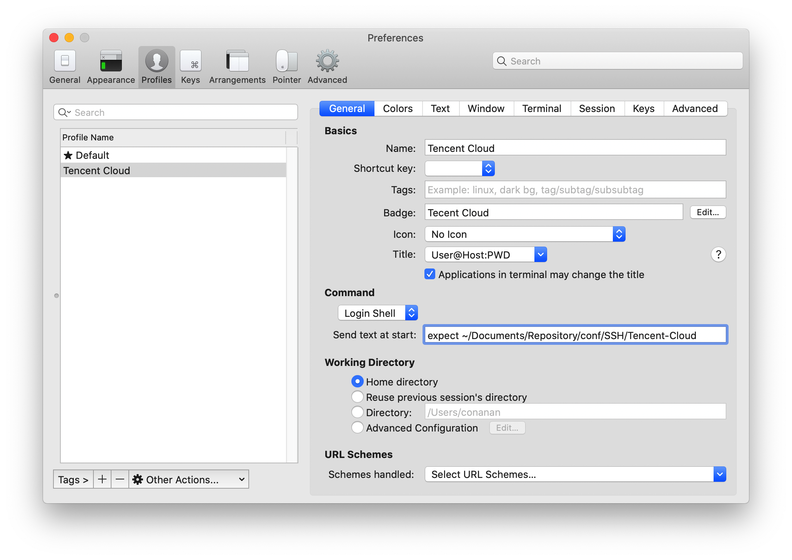

# macOS

## Homebrew

> [官方文档](https://brew.sh/index_zh-cn)，可能会很慢，你懂得

开源软件使用`brew install` 安装，安装目录在`/usr/local/Cellar`，且会`ln`到`/usr/local/bin`下

非开源软件使用`brew cask install`安装，安装目录在`/usr/local/Caskroom`

查找时都是使用`brew search *`

### 配置国内源

国内源有：

- [中科大源](http://mirrors.ustc.edu.cn/)
- [清华源](https://mirrors.tuna.tsinghua.edu.cn/)

此处以中科大源为示例，需要配置的有 Homebrew、Homebrew Bottles、Homebrew Core、Homebrew Cask

## iTerm2

> [官方文档](https://www.iterm2.com/)，非开源软件。

### 使用 Homebrew 安装

安装前可先搜索下

```bash
~ ❯ brew search iterm2
==> Casks
iterm2 ✔                                 homebrew/cask-versions/iterm2-legacy
homebrew/cask-versions/iterm2-beta       homebrew/cask-versions/iterm2-nightly
```

返回结果显示已经安装了，若没有安装可执行如下命令

```shell
~ ❯ brew cask install iterm2
```

### 配色

[iTerm2-Color-Schemes](https://github.com/mbadolato/iTerm2-Color-Schemes)仓库里有 iTerm2、Windows Terminal 甚至其他编辑器的配色方案，`schemes`下的是 iTerm2 的。下载并在设置中导入即可。

- 推荐 **Solarized Dark Higher Contrast** 和 **manta**

- Set "Tab bar height (points) for minimal theme" to 22, under "Preference - Advanced".

### 字体

目前选择的是 MesloLGS NF，可以完整显示

### Profiles

配置文件如下：

```
#!/usr/bin/expect -f
  set user conanan
  set host 111.111.111.111
  set password 'caicaiwoshishui'
  set timeout -1

  spawn ssh $user@$host
  expect "*assword:*"
  send "$password\r"
  interact
  expect eof
```

配置如下：



## Oh My ZSH

> [官方文档](https://github.com/ohmyzsh/ohmyzsh/wiki)，需要先安装 ZSH（macOS Catalina 默认），文档里有详细步骤，包括主题配置、插件配置等等。

### plugin-git

自带，简写 git 命令

```
git add --all ===> gaa
git commit -m ===> gcmsg
```

查看所有 `git` 命令缩写

```
cat ~/.oh-my-zsh/plugins/git/git.plugin.zsh
```

### plugin-autojump

[plugin-autojump](https://github.com/wting/autojump)。目录间快速跳转

- brew 安装

  ```bash
  brew install autojump
  ```

- 在 `~/.zshrc` 中配置

  ```
  plugins=(其他的插件 autojump)
  ```

- 使配置生效

  ```bash
  source ~/.zshrc
  ```

使用方法：

- `cd` 命令进入 `/usr/local/docker` 目录

- 下次若还想进入该目录输入`j docker`回车即可，甚至可以只输入`cd`后的任意部分，但是要唯一。

  可多个参数空格分开，`j l d`

- 删除无效路径，`j --purge 无效路径`

-

### plugin-zsh-syntax-highlighting

[zsh-syntax-highlighting](https://github.com/zsh-users/zsh-syntax-highlighting)。输入正确命令会绿色高亮显示，输入错误会显示其他的颜色。

- 克隆项目

  ```bash
  git clone https://github.com/zsh-users/zsh-syntax-highlighting.git ${ZSH_CUSTOM:-~/.oh-my-zsh/custom}/plugins/zsh-syntax-highlighting
  ```

- 在 `~/.zshrc` 中配置

  ```
  plugins=(其他的插件 zsh-syntax-highlighting)
  ```

- 使配置生效

  ```bash
  source ~/.zshrc
  ```

### plugin-zsh-autosuggestions

[plugin-zsh-autosuggestions](https://github.com/zsh-users/zsh-autosuggestions)。输入命令时，会给出建议的命令（灰色部分）按键盘 → 补全。如果感觉 → 补全不方便，还可以自定义补全的快捷键，在 `.zshrc` 文件添加这句话即可，`,`可替换为其他按键

```
bindkey ',' autosuggest-accept
```

- 克隆项目

  ```bash
  git clone git://github.com/zsh-users/zsh-autosuggestions $ZSH_CUSTOM/plugins/zsh-autosuggestions
  ```

- 在 `~/.zshrc` 中配置

  ```
  plugins=(其他的插件 zsh-autosuggestions)
  ```

- 使配置生效

  ```bash
  source ~/.zshrc
  ```

## Git

> [官网](https://git-scm.com/)

macOS 自带的 Git 版本比较低

```shell
~ ❯ git --version
git version 2.21.0 (Apple Git-122.2)
```

替换方式如下：

### 使用 Homebrew 安装

安装命令

```shell
~ ❯ brew install git
```

修改环境变量

```shell
~ ❯ vim .zshrc

# custom environment variable
export GIT=/usr/local/Cellar/git/2.24.1
export PATH=$GIT/bin:$PATH
# 使用如下命令可以让Git命令保持英文（不知道什么时候改成中文了，根据系统设置吗）
alias git='LANG=en_GB git'

~ ❯ source .zshrc

~ ❯ git --version
git version 2.24.1
```

## SSH

> [Github 配置文档](https://help.github.com/en/github/authenticating-to-github/connecting-to-github-with-ssh)

### 查看密钥

```shell
~ ❯ ll -a ~/.ssh
```

### 生成密钥

```shell
~ ❯ ssh-keygen -t rsa -b 4096 -C "54whn54@gmail.com"

~ ❯ ll -a ~/.ssh
-rw-------   1 conanan  staff   3.3K 12 17 13:17 id_rsa
-rw-r--r--   1 conanan  staff   743B 12 17 13:17 id_rsa.pub
```

### 生成新 SSH 密钥并添加到 ssh-agent

检查现有 SSH 密钥后，您可以生成新 SSH 密钥以用于身份验证，然后将其添加到 ssh-agent。将 SSH 密钥添加到该代理时，应使用默认的 macOS `ssh-add` 命令，而不是使用通过 [macports](https://www.macports.org/), [homebrew](http://brew.sh/) 或某些其他外部来源安装的应用程序。

在后台启动 ssh 代理

```shell
~ ❯ eval "$(ssh-agent -s)"
Agent pid 10387
```

如果您使用的是 macOS Sierra 10.12.2 或更高版本，则需要修改 `~/.ssh/config` 文件以自动将密钥加载到 ssh-agent 中并在密钥链中存储密码。

```
Host *
  AddKeysToAgent yes
  UseKeychain yes
  IdentityFile ~/.ssh/id_rsa
```

将 SSH 私钥添加到 ssh-agent 并将密码存储在密钥链中。 If you created your key with a different name, or if you are adding an existing key that has a different name, replace _id_rsa_ in the command with the name of your private key file.

```shell
~ ❯ ssh-add -K ~/.ssh/id_rsa
Identity added: /Users/conanan/.ssh/id_rsa (54whn54@gmail.com)
```

**注：**`-K` 选项位于 Apple 的 `ssh-add` 标准版本中，当您将 ssh 密钥添加到 ssh-agent 时，它会将密码存储在您的密钥链中。

如果您没有安装 Apple 的标准版本，可能会收到错误消息。 有关解决此错误的详细信息，请参阅“[错误：ssh-add：非法选项 -- K](https://help.github.com/cn/articles/error-ssh-add-illegal-option-k)”。

### 新增 SSH 密钥到 GitHub 帐户

```shell
~ ❯ pbcopy < ~/.ssh/id_rsa.pub
```

如果 `pbcopy` 不可用，可找到隐藏的 `.ssh` 文件夹，在常用的文本编辑器中打开该文件，并将其复制到剪贴板。

## SDKMAN

> [官网](https://sdkman.io/)，可能需要科学上网

### 安装 SDKMAN

打开终端输入如下命令安装

```shell
~ ❯ curl -s "https://get.sdkman.io" | bash
```

打开新终端窗口输入如下命令

```shell
~ ❯ source "$HOME/.sdkman/bin/sdkman-init.sh"
```

查看是否安装成功

```shell
~ ❯ sdk version
==== BROADCAST =================================================================
* 2019-12-16: Micronaut 1.2.8 released on SDKMAN! #micronautfw
* 2019-12-13: sbt 1.3.5 released on SDKMAN! #scala
* 2019-12-10: Vertx 3.8.4 released on SDKMAN! #vertx
================================================================================

SDKMAN 5.7.4+362
```

安装后会在`~/.zshrc`添加如下环境变量

```
#THIS MUST BE AT THE END OF THE FILE FOR SDKMAN TO WORK!!!
export SDKMAN_DIR="/Users/conanan/.sdkman"
[[ -s "/Users/conanan/.sdkman/bin/sdkman-init.sh" ]] && source "/Users/conanan/.sdkman/bin/sdkman-init.sh"
```

### 自定义安装目录 🔥

> ⚠️ 需要直接执行该命令而不是先执行安装命令
>
> For this to work it is vital that your user has full access rights to this folder.It is also important that the folder does not exist as SDKMAN! will attempt to create it.
>
> 苹果从 OS X El Capitan 10.11 系统开始使用了 Rootless 机制，系统默认将会锁定 /system、/sbin、/usr 这三个目录。用户要获取这三个目录的写权限，需要关闭 Rootless。
>
> - 重启 Mac
>
> - 开机时后按下 Command+R，进入恢复模式。
>
> - 在上面的菜单实用工具中找到并打开 Terminal
>
> - 输入如下命令：
>
>   ```bash
>   csrutil disable
>   ```
>
> - 重启 MAC，正常进入系统，此时已经可以给/system、/sbin、/usr 者几个目录进行权限更改
>
>   ```bash
>   sudo chown -R $(whoami) /usr/local
>   ```
>
> 作者：蜂子阁先生
> 链接：https://www.jianshu.com/p/a32224a38195
> 来源：简书
> 著作权归作者所有。商业转载请联系作者获得授权，非商业转载请注明出处。

```bash
export SDKMAN_DIR="/usr/local/sdkman" && curl -s "https://get.sdkman.io" | bash
```

Please open a new terminal, or run the following in the existing one:

```bash
source "/usr/local/sdkman/bin/sdkman-init.sh"
```

### 查看可以安装的 SDK

```shell
~ ❯ sdk ls # list。查看所有可以安装的 SDK ，查看详细介绍
```

```shell
~ ❯ sdk ls <Candidate> # list 查看指定候选 SDK 的版本，安装状态及使用状态等
~ ❯ sdk ls java # list 查看 Java 的版本，安装状态及使用状态等
```

### 安装 SDK

```shell
~ ❯ sdk i <Candidate> <Identifier> # install
~ ❯ sdk i java 11.0.5.j9-adpt  # install
```

默认安装目录为`$HOME/.sdkman`

- archives 为压缩包目录
- candidates 为具体安装目录，如`candidates/java/11.0.5.hs-adpt`
- src 为 SDKMAN 命令存放目录

### 卸载 SDK

```shell
~ ❯ sdk rm <><> # uninstall
```

### 查看当前使用的 SDK

```shell
~ ❯ sdk c # current

Using:

java: 11.0.5.j9-adpt
```

### 切换当前 SDK 版本

```bash
sdk u <Candidate> <Identifier> # use
sdk u java 11.0.5.hs-adpt # use

Using java version 11.0.5.hs-adpt in this shell.
```

```bash
sdk d <Candidate> <Identifier> # default
sdk d java 8.0.232.hs-adpt # default

Default java version set to 8.0.232.hs-adpt
```

### 升级指定 SDK

```shell
sdk ug [Candidate]# upgrade
```

### 更新 SDKMAN

```shell
sdk update
```

### 安装示例

#### Java

输入如下命令查看可以安装的 SDK

```shell
sdk ls java # 查看可以安装的Java
```

搜索出来的 Java 版本很多，比如`AdoptOpenJDK` 的`j9`版本和`hs`版本（需要科学上网），`Amazon`版本，`Azul Zulu`版本，`GraalVM`等等。

安装一个 OpenJ9 版本的

```shell
sdk install java 11.0.5.j9-adpt
```

再安装一个 HotSpot 版本

```shell
sdk install java 11.0.5.hs-adpt
```

#### Maven

```
sdk ls maven [version]
```

## Node

### 使用 Homebrew 安装

不推荐，推荐使用 NVM 安装

```shell
brew install node # 会安装最新版，不一定是稳定版哦
```

## 常用操作

### Finder 中选择系统目录

Finder 中选择系统目录如：`/usr/local`，可以按下 `Command + Shift + G` 即可输入。
