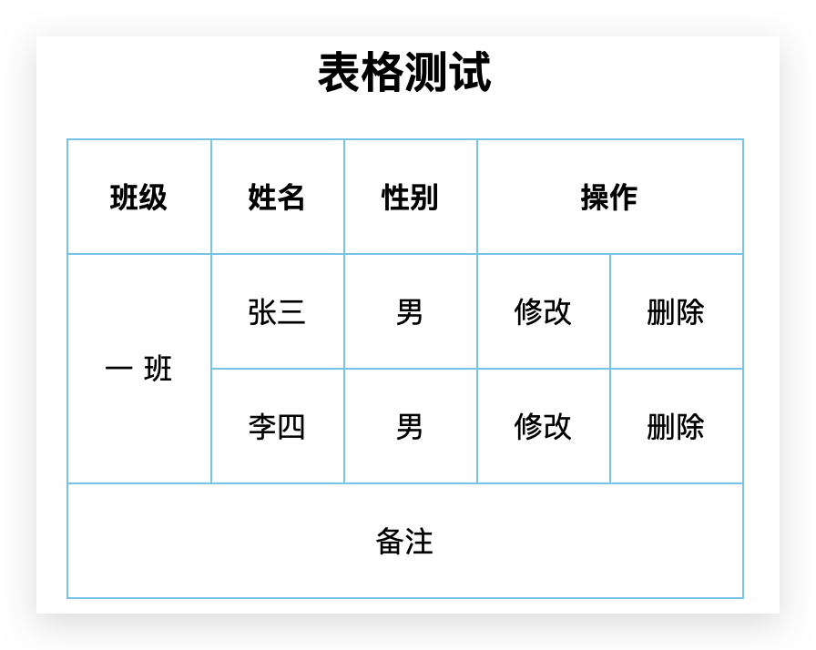

# HTML

## 引言

### Rendering Engine

内核包括：渲染引擎 + JS 引擎（如V8）

Rendering Engine：排版引擎、解释引擎、渲染引擎，现在流行称为浏览器内核。负责读取网页内容，整理讯息，计算网页的显示方式并显示页面。

| 浏览器  |        内核        | 备注                                                         |
| :------ | :----------------: | :----------------------------------------------------------- |
| IE      | Trident（三叉戟）  | IE、猎豹安全、360浏览器、百度浏览器、UC                      |
| firefox |   Gecko（壁虎）    | 可惜这几年已经没落了，打开速度慢、升级频繁、猪一样的队友flash、神一样的对手chrome。 |
| Safari  |     **webkit**     | 现在很多人错误地把 webkit 叫做 chrome内核（即使 chrome内核已经是 blink 了）。 |
| Chrome  | **Chromium/Blink** | 在 Chromium 项目中研发 Blink 渲染引擎（即浏览器核心），内置于 Chrome 浏览器之中。Blink 其实是 WebKit 的分支。大部分国产浏览器最新版都采用Blink内核，二次开发 |
| Opera   |       blink        | 现在跟随chrome用blink内核。                                  |

> 移动端的浏览器内核主要说的是系统内置浏览器的内核。Android 手机而言，使用率最高的就是 Webkit 内核，大部分国产浏览器宣称的自己的内核，基本上也是属于webkit二次开发。iOS以及WP7平台上，由于系统原因，系统大部分自带浏览器内核，一般是Safari或者IE内核Trident的
>

### Web 标准

**构成：** 主要包括结构（Structure）、表现（Presentation）和行为（Behavior）三个方面


## HTML 结构

> HyperText Markup Language：超文本标记语言

在 VSCode 中按下 `html:5`或`!`即可出现如下代码：

```html
<!DOCTYPE html>
<html lang="en">
  <head>
    <!--定义页面的编码方式-->
    <meta charset="UTF-8">
    <!--viewport 为可视区域，它的宽度为设备的宽度-->
    <meta name="viewport" content="width=device-width, initial-scale=1.0">
    <!--没有如下两行-->
    <!--http-equiv 表示执行一个命令，下面设置 HTTP 的 content-type，适配IE-->
    <meta http-equiv="X-UA-Compatible" content="ie=edge">
		<!--页面的描述信息，可供搜索引擎显示-->
    <meta name="description"content="Hello Html">
    <title>Document</title>
  </head>
  <body>

  </body>
</html>
```

`<!DOCTYPE>` 文档类型声明标签，不是一个 HTML 标签，作用就是告诉浏览器使用哪种HTML版本来显示网页。位于文档中的最前面的位置，必须处于 `<html>` 标签之前。上述代码的意思是：当前页面采取的是 HTML5 版本来显示网页。


## 根元素`<html>`

`<html>`：表示一个HTML文档的**根（顶级元素）**，所有其他元素必须是此元素的后代

### `lang`

用来定义当前文档显示的语言。常用的有：

* `lang="zh-CN`
* `lang="en"`

其实对于文档显示来说，定义成en的文档也可以显示中文，定义成zh-CN的文档也可以显示英文。这个属性对浏览器和搜索引擎有作用的

* 帮助**翻译工具**做识别，如弹出是否翻译该页面
* 根据根据 lang 属性来设定不同语言的 css 样式，或者字体
* 告诉**搜索引擎**做精确的识别
* 让语法检查程序做**语言识别**
* 帮助**网页阅读程序**做识别等等


### `xmlns`

指派文档的 XML 命名空间。默认是`http://www.w3.org/1999/xhtml`，只在XHTML中必要。


## 头元素`<head>`

> **规定文档相关的配置信息（元数据）**，包括文档的标题，引用的文档样式和脚本等。
>
> 文档元数据 Metadata：元数据（Metadata），含有页面的相关信息，包括样式、脚本及数据，能帮助一些软件（例如：搜索引擎SEO、浏览器 等等）更好地运用和渲染页面。对于样式和脚本的元数据，可以直接在网页里定义，也可以链接到包含相关信息的外部文件。

### `<base>` 

指定用于一个文档中包含的所有**相对 URL 的根 URL**。一份中只能有一个。一个文档的基本 URL，可以通过使用 `document.baseURI` 的 JS 脚本查询。

* 必须有`href`属性。当具体`a`中的该属性设置为带协议的链接时，则不受base控制
* 可选择`target`属性


### `<meta>`

该元素表示那些不能由其它HTML元相关元素 (`<base>`, `<link>`, `<script>`, `<style>` 或 `<title>`) 之一表示的任何**元数据信息**。

#### `charset`属性

规定 HTML 文档应该使用哪种字符集。让浏览器根据编码去解码对应的 HTML 内容，文件不一定是这个编码。字符集 (Character set)是多个字符的集合。以便计算机能够识别和存储各种文字。统一使用 `UTF-8`，**必须写**


### `<title>`

 该元素定义文档的**标题**，显示在浏览器的标题栏或标签页上。它只可以包含文本，若是包含有标签，则包含的任何标签都不会被解释。

### `<link>`

该元素规定了外部资源与当前文档的关系。这个元素最常于链接 **CSS** 样式表，还能被用来创建站点图标（比如PC端的“**favicon**”图标和移动设备上用以显示在主屏幕的图标）甚至一些其他事情。

### `<style>`

该元素包含文档的样式信息或者文档的部分内容。默认情况下，该标签的样式信息通常是 **CSS** 的格式。


## 分区根元素`<body>`

* `<body>`：该元素表示文档的内容。`document.body`属性提供了可以轻松访问文档的 body 元素的脚本。

### 内容分区（逻辑分区）

内容分区元素允许你将文档内容从**逻辑上进行组织划分**。使用包括页眉(header)、页脚(footer)、导航(nav)和标题(h1~h6)等分区元素，来为页面内容创建明确的大纲，以便区分各个章节的内容。


### 语义化标签

根据标签的语义，在合适的地方给一个最为合理的标签，让结构更清晰。一般先写语义化 HTML，之后才写 CSS

* 方便代码的阅读和维护
* 同时让浏览器或是网络爬虫可以很好地解析，从而更好分析其中的内容 
* 使用语义化标签会具有更好地搜索引擎优化 
* 这些新标签页面中可以使用多次
* 在 IE9 中，需要把这些元素转换为块级元素
* 移动端更喜欢使用这些标签

标签如下：

| 标签            | 描述                                               |
| :-------------- | :------------------------------------------------- |
| `<article>`     | 定义文章。                                         |
| `<aside>`       | 定义页面内容以外的内容。                           |
| `<details>`     | 定义用户能够查看或隐藏的额外细节。                 |
| `<figcaption>`🔥 | 定义` <figure> `元素的标题。                       |
| `<figure>`🔥     | 规定自包含内容，比如图示、图表、照片、代码清单等。 |
| `<footer>`🔥     | 定义文档或节的页脚。                               |
| `<header>`🔥     | 规定文档或节的页眉。                               |
| `<main>`        | 规定文档的主内容。                                 |
| `<mark>`        | 定义重要的或强调的文本。                           |
| `<nav>`🔥        | 定义导航链接。                                     |
| `<section>`🔥    | 定义文档中的节，区域。                             |
| `<summary>`     | 定义` <details> `元素的可见标题。                  |
| `<time>`        | 定义日期/时间。                                    |


## 常用标签

### 文本格式化标签

`<b>`**粗体**`</b>` ；`<strong>`**强调文本**`</strong>` ，推荐使用带语义化的

`<i>`***斜体***`</i>` ；`<em>`***强调文本***`</em>` ，推荐使用带语义化的。很多网站喜欢用`i`来修饰图片，类似 icon

`<u>`<u>下划线</u>`</u>` ；`<ins>`<u>下划线</u>`</ins>`，推荐使用带语义化的

`<s>`~~删除线~~`</s>`；`<del>`~~删除线~~`</del>` ，推荐使用带语义化的

------

`<!-- 注释 -->`   **注释**

`<pre></pre>`   **预格式**文本，元素中的文本通常会保留空格和换行符，而文本也会呈现为等宽字体，不常用

`<code></code>`  代码格式，等宽字体显示

`<sup>`**上标**`</sup>`

`<sub>`**下标**`</sub>`

**字符实体**：`&lt;`、`&gt;`、`&nbsp;`、`&amp;`、`&copy;`、`&reg;`  分别为：**<**、**>**、 **空格**、 &amp;、 &copy;、 &reg;  


### 排版标签

`<h1>标题</h1>`    **标题**，取值1~6从大到小。是**块级标签**，自动在其前后加空行，其实是段间距。有助于 SEO

`<p>html</p>`   **段落**，paragraph缩写，是**块级标签**，自动在其前后加空行，其实是段间距。**不能**包含`div`

`<hr/>`   **横线**，horizontal缩写

`<br/>`   **换行**，break缩写

`<div></div>`   **块级标签**，division缩写，自动**换行**

`<span></span>`   **内联标签**，独占一行（即使宽度比较小）


### 列表标签

::: tip

**块级元素**。用来布局的， 因为非常整齐和自由。样式推荐使用CSS的`list-style: none`实现

:::

 `<ul>` `<ol>` `<li>`   **无序（常用）、有序、列表**

* `li` 间可以容纳所有元素
* 无序、有序列表会自带样式，应使用 CSS 重写替代
* `reversed`：列表倒序，用于有序列表

- ~~`type='1'或'a'或'i'或'A'或'I'` 用于有序列表，请使用CSS替代；~~
- ~~`start` 用于有序列表，HTML5不支持，请使用CSS替代；~~

`<dl>` `<dt>` `<dd>`   **定义列表（常用）**带有**术语或名词**和**描述**。**常见于页面下面帮助部分**。

* 定义列表的列表项前没有任何项目符号


### 表格标签

::: tip

**块级元素**。不是用来布局，常用**显示、展示数据。样式推荐使用CSS的`border-`实现**

:::


```html
<!DOCTYPE html>
<html lang="en">
<head>
    <meta charset="UTF-8">
    <meta name="viewport" content="width=device-width, initial-scale=1.0">
    <meta http-equiv="X-UA-Compatible" content="ie=edge">
    <title>Document</title>
    <style>
      table {
        /* 合并细线边框 */
        border-collapse: collapse;
        /* 表格居中 */
        margin: 30px auto;
      }
      th,
      td {
        /* 边框 */
        border: 1px solid skyblue;
        /* 内边距 */
        padding: 20px;
        /* 让td居中，th本来就是居中的 */
        text-align: center;
      }
      /* 标题 */
      caption {
        font-weight: 700;
        font-size: 24px;
        margin-bottom: 20px;
      }
    </style>
</head>
<body>
    <table> 
        <caption>表格测试</caption>
        <thead>
          <tr>
            <th>班级</th>
            <th>姓名</th>
            <th>性别</th>
            <th colspan="2">操作</th>
          </tr>
        </thead>
        <tbody>
          <tr>
            <td rowspan="2">一 班</td>
            <td>张三</td>
            <td>男</td>
            <td>修改</td>
            <td>删除</td>
          </tr>
          <tr>
            <td>李四</td>
            <td>男</td>
            <td>修改</td>
            <td>删除</td>
          </tr>
        </tbody>
        <tfoot>
          <tr>
            <td colspan="5">备注</td>
          </tr>
        </tfoot>
      </table>
</body>
</html>
```



* 表头单元格 `th` 也是单元格，常用于表格第一行，突出重要性，表头单元格里面的文字会**加粗居中**显示

* 注意：表格中占多行的只属于第一行，占多列同理

* 在 HTML5 中，**仅支持 "border" 属性**，并且只允许使用值 `"1"` 或 `""`。不推荐使用

  之前使用的`cellspacing`（单元格之间距离）、`cellpadding`（内容与单元格边框距离）应该使用CSS实现，具体在 CSS 章节体现

  ```css
  table {
    /* 合并细线边框 */
    border-collapse: collapse;
    /* 单元格之间水平、垂直距离，与 border-collapse 冲突，不常用 */
    /*border-spacing: 10px 20px;*/
    /* 表格居中 */
    margin: 30px auto;
  }
  th,
  td {
    /* 边框 */
    border: 1px solid skyblue;
    /* 内边距 */
    padding: 30px;
  }
  caption {
    font-weight: 700;
    font-size: 24px;
    margin-bottom: 20px;
  }
  ```


### 超链接标签

```html
<a href='https://www.qq.com' target='_blank'>新窗口打开QQ</a>
```

> anchor [ˈæŋkə(r)] 的缩写，含义为：锚、铁锚。**行内元素**

| 属性   | 作用                                                         |
| ------ | :----------------------------------------------------------- |
| href   | 用于指定链接目标的url地址，（必须属性）当为标签应用href属性时，它就具有了超链接的功能 |
| target | 用于指定链接页面的打开方式，取值：其中`_self`为默认值，`_blank`为在新窗口中打开方式，`_parent`加载到当前的HTML5浏览上下文的父浏览上下文，`_top`加载响应进入顶层浏览上下文。可在`<head>`的`<base>`标签中设置全局`href`和`target` |

- 外部链接： `http:// www.baidu.com`，需要协议开头

- 内部链接：直接链接内部页面名称即可 `<a href="index.html">首页</a>`

- **锚点定位**：当时没有确定链接目标或目标为当前页，可将`href`属性值定义为`#`，表示该链接暂时为一个空链接，**默认跳转当前页**。可以通过该方式来**定位资源**：

  ```html
  <div id='top'>top</div>
  <a href='#top'>returnTop</a>
  ```

- 不仅可以创建文本超链接，在网页中各种网页元素，如图像、表格、音频、视频等都可以添加超链接。如**包裹``标签**

- **发送邮件**

    ```html
    <a href="mailto:xxx@gmail.com">联系我们</a>
    ```

- **下载链接**：如果 href 里面地址是一个文件或者压缩包，会下载这个文件。

- **伪链接，禁止跳转**：二选一

    ```html
    <a href="javascript:;">1</a>
    <!-- 好像写void，或void()，或void(0)都一样。void(0)表示计算一个表达式（此处为0）但不返回值 -->
    <a href="javascript:void(0);">1</a>
    
    <!-- 写不写#都一样 -->
    <a href="#" onclick="return false">2</a>
    ```

    只写`href="#"`则跳回页面顶部

- 去掉`input`或`a`（tab选中）或`textraea`的 focus 轮廓蓝线，如下方法

    ```html
    <!-- tableindex 调整tab选择顺序，负数则不会被选择 -->
    <a tableindex="-1"></a>
    ```

    ```css
    /* 看不到蓝色边框线我们就当作去掉了😄*/
    a {
      outline: none;
    }
    ```

- 去掉 a 的下划线

    ```css
    a {
      text-decoration: none;
    }
    ```

    


### 图片标签 

> image 的缩写。**行内块元素**
>
> 相对路径：以`.`开头，如`./`代表当前目录；`../`代表上级目录。属性如下：

```html

<!--可嵌套在 a 标签里-->
```

|    属性    |             属性值             |                   描述                   |
| :--------: | :----------------------------: | :--------------------------------------: |
|    src     |              URL               |                 图像路径                 |
|    alt     |              文本              | H5推荐必加属性，图像不能显示时的替换文本 |
|   title    |              文本              |           鼠标悬停时显示的内容           |
|   width    | 像素（XHTML不支持%页面百分比） |  设置图像宽度，一般只改一个（等比缩放）  |
|   height   | 像素（XHTML不支持%页面百分比） |  设置图像高度，一般只改一个（等比缩放）  |
| ~~border~~ |              数字              | 设置图像边框的宽度，**后续使用CSS完成**  |

Web 中常见的图片格式：

*   PNG：静态，支持透明
*   JPG/JPEG：静态，不支持透明
*   GIF：动态，静态，支持透明
*   Webp：比JPG压缩率更高，但质量相同


### 音频标签radio

> HTML5，支持IE9+

| 属性                                                         | 值       | 描述                                                         |
| :----------------------------------------------------------- | :------- | :----------------------------------------------------------- |
| [autoplay](https://www.w3school.com.cn/tags/att_audio_autoplay.asp) | autoplay | 如果出现该属性，则音频在就绪后马上播放。                     |
| [controls](https://www.w3school.com.cn/tags/att_audio_controls.asp) | controls | 如果出现该属性，则向用户显示控件，比如播放按钮。             |
| [loop](https://www.w3school.com.cn/tags/att_audio_loop.asp)  | loop     | 如果出现该属性，则每当音频结束时重新开始播放。               |
| [muted](https://www.w3school.com.cn/tags/att_audio_muted.asp) | muted    | 规定视频输出应该被静音。                                     |
| [preload](https://www.w3school.com.cn/tags/att_audio_preload.asp) | preload  | 如果出现该属性，则音频在页面加载时进行加载，并预备播放。如果使用 "autoplay"，则忽略该属性。 |
| [src](https://www.w3school.com.cn/tags/att_audio_src.asp)    | *url*    | 要播放的音频的 URL。                                         |

```html
<audio controls="controls" height="100" width="100">
  <source src="song.mp3" type="audio/mp3" />
  <source src="song.ogg" type="audio/ogg" />
  <embed height="100" width="100" src="song.mp3" />
  您的浏览器不支持
</audio>
```


### 视频标签video

> HTML5，支持IE9+

| 属性                                                         | 值       | 描述                                                         |
| :----------------------------------------------------------- | :------- | :----------------------------------------------------------- |
| [autoplay](https://www.w3school.com.cn/tags/att_video_autoplay.asp) | autoplay | 如果出现该属性，则视频在就绪后马上播放。                     |
| [controls](https://www.w3school.com.cn/tags/att_video_controls.asp) | controls | 如果出现该属性，则向用户显示控件，比如播放按钮。             |
| [height](https://www.w3school.com.cn/tags/att_video_height.asp) | *pixels* | 设置视频播放器的高度。                                       |
| [loop](https://www.w3school.com.cn/tags/att_video_loop.asp)  | loop     | 如果出现该属性，则当媒介文件完成播放后再次开始播放。         |
| [muted](https://www.w3school.com.cn/tags/att_video_muted.asp) | muted    | 规定视频的音频输出应该被静音。                               |
| [poster](https://www.w3school.com.cn/tags/att_video_poster.asp) | *URL*    | 规定视频下载时显示的图像，或者在用户点击播放按钮前显示的图像。 |
| [preload](https://www.w3school.com.cn/tags/att_video_preload.asp) | preload  | 如果出现该属性，则视频在页面加载时进行加载，并预备播放。如果使用 "autoplay"，则忽略该属性。 |
| [src](https://www.w3school.com.cn/tags/att_video_src.asp)    | *url*    | 要播放的视频的 URL。                                         |
| [width](https://www.w3school.com.cn/tags/att_video_width.asp) | *pixels* | 设置视频播放器的宽度。                                       |

HTML 5 + `<object>` + `<embed>`

```html
<video width="320" height="240" controls="controls">
  <source src="movie.mp4" type="video/mp4" />
  <source src="movie.ogg" type="video/ogg" />
  <source src="movie.webm" type="video/webm" />
  <object data="movie.mp4" width="320" height="240">
    <embed src="movie.swf" width="320" height="240" />
  </object>
  您的浏览器不支持
</video>
```

上例中使用了 4 中不同的视频格式。HTML 5 `<video>` 元素会尝试播放以 mp4、ogg 或 webm 格式中的一种来播放视频。如果均失败，则回退到 `<embed> `元素。

但是由于每个浏览器的样式不一样，通常会使用 JS 来自定义


## 表单标签

### `form` 表单域

表单域是一个包含表单元素的区域。在 HTML 标签中，` <form> ` 标签用于定义表单域，以实现用户信息的收集和传递。 `<form>` 会把它**范围内的表单元素信息提交给服务器**。

```html
<form action="url地址" method="提交方式" name="表单域名称">
  各种表单控件
</form>
```

- **name**：用于区别一个页面不同的表单域

- **action**：用于指定接收并处理表单数据的服务器url地址，默认提交到当前的页面（可以是一个页面，也可以是后台URL）

- **method**：用于设置表单数据的提交方式，默认是 GET 请求

  **GET和POST区别**

  1. GET 请求在地址栏会携带提交的数据（封装到请求行中），POST 请求不会在地址栏携带提交的数据（封装在请求体里面）
  2. GET 请求数据有大小的限制，POST 没有限制
  3. GET 请求安全级别较低， POST 较高

- **enctype**：代表 encode 和 type 结合体，设置提交数据的类型。一般请求下不需要这个属性，做**文件上传**时候需要设置。此值可以被 `<button>`或`input`元素中的 `formenctype` 属性覆盖。

  - application/x-www-form-urlencoded

    默认的编码方式，即**表单提交**，将表单内的数据转换为 Key-Value

  - multipart/form-data

    此值用于一个 `type="file"` 的`input`元素，即**文件上传时必须为该值**，且`method`必须为`POST`。它将表单的数据组织成Key-Value形式，用分隔符boundary（boundary可任意设置）处理成一条消息。由于有boundary隔离，所以既可以上传文件，也可以上传参数

  - text/plain

      普通文本

- target：可以控制跳转的页面打开方式，属性值同`a`，不使用
- accept-charset：规定表单提交时使用的字符编码，默认值 unknown，和文档相同的编码。不使用！

::: tip multipart/form-data与x-www-form-urlencoded**区别**

HTML 中的 form 表单有**两种：**

- **application/x-www-form-urlencoded**是默认的MIME内容编码类型，它在传输比较大的二进制或者文本数据时效率极低

    MIME：简单说，MIME类型就是设定某种扩展名的文件用一种应用程序来打开的方式类型。服务器会将它们发送的多媒体数据的类型告诉浏览器，而通知手段就是说明该多媒体数据的MIME类型，服务器将 MIME标志符放入传送的数据中来告诉浏览器使用哪种插件读取相关文件

- **multipart/form-data**：既可以上传文件等二进制数据，也可以上传表单键值对，只是最后会转化为一条信息。当设置multipart/form-data，http会忽略 contentType 属性。

:::

::: tip 小知识

form 表单不支持其他请求方式（也没必要），使用时需要在input中添加一个**`_method`属性**，Ajax方式示例：

注意：Java后端需**配置`HiddenHttpMethodFilter`**

```javascript
$.ajax({
    url:"/user",
    type: "POST",
    data: {
        "_method":"DELETE",
        "body":$("#form1").serialize()
    },
    success : function (href) {
        location.href = href;
    }
})
```

:::

### 表单提交

传统方式：

*   所有`input`包裹到一个`form`
*   `form`设置`action`（请求服务器的地址）
*   `input`或`button`为 submit 类型（`button`默认为 submit 类型）
*   点击提交后，提交有`name`属性的数据到服务器，
    *   弊端一：进行页面跳转。意味着服务器必须先将一个页面写好并返回给前端，前端直接展示，即服务端渲染
    *   弊端二：不方便进行表单数据验证

前后端分离：

*   JS 获取所有表单内容
*   正则验证内容
*   发送 Ajax 请求，接收后端数据并解析


### `input` 

单标签    	      

- **text**：文本，默认宽度size为20个字符。使用 action 提交后台需指定 **name** 属性
- **password**：密码，字符被掩码，使用 action 提交后台需指定 **name** 属性
- **radio**：单选，使用 action 提交后台需指定**相同 name **属性，**value**
  * checked，判断时可以通过 true 或 false
- **checkbox**：多选，使用 action 提交后台需指定**相同 name **属性，**value**
  - checked，判断时可以通过 true 或 false
  - 表单提交时数据格式为`hobby=song&hobby=dance`

- **button**：普通按钮，不属于`input`，需指定 value 值，和 JS 使用

- **reset**：form 中的重置按钮，默认 value 为重置（根据浏览器翻译）

- **submit**：form 中的提交按钮，默认 value 为提交（根据浏览器翻译），点击后跳转至指定action或本页

  * 可以获取**form**，使用**其`submit()`方法，返回false（true或无返回值都将跳转）**！用于Ajax提交表单

    ```html
    <a onclick="document:loginForm.submit()">登陆</a> <!--这样也可以提交，但是会跳转。了解-->
    ```

  * 可以使用form的`onsubmit`事件，如`onsubmit = "return checkForm()"`，必须加return，并且方法返回boolean类型，true提交，false不提交

  * 可以使用**普通button**，配合JS来使用Ajax提交表单。**type需指定为button**，否则会将 form 中该值设置为 **submit**
  
    ```html
    <input type="submit"/> <!--默认为提交（中文环境）、submit（英文环境）-->
  <input type="submit" value="注册"/>
    ```

- **image**：图片提交按钮

- **file**：上传文件，使用 action 提交后台需指定 **name** 属性，需要设置**enctype**

- **hidden**：隐藏域，使用 action 提交后台需指定 **name** 属性，**value**。页面看不到但数据会被提交

HTML5新添加的type类型

* **search**：搜索，带有`x`
* **number**：定义用于输入数字的字段，会用正则自动校验
* **tel**：电话，会用正则自动校验

- **email**：定义用于 e-mail 地址的字段，会用正则自动校验
- **url**：定义用于输入 URL 的字段，会用正则自动校验
- color：定义拾色器 
- range：定义用于精确值不重要的输入数字的控件（比如 slider 控件）
- date：定义 date 控件（包括年、月、日，不包括时间）
- month：年月
- week：年周
- time：定义用于输入时分秒的控件（不带时区）
- datetime-local：定义 date 和 time 控件（包括年、月、日、时、分、秒、几分之一秒，不带时区）

其他属性

*   name：提交数据到服务器时，用于**区分不同字段**
*   name：提交数据到服务器时不同字段的取值

*   placeholder：**占位符**
*   maxlength：允许输入的**最大字符数**，正整数
*   size：以字符数计的可见**宽度**，正整数
*   readonly：**只读**
*   disabled：**禁用**，**表单提交时不会提交**
*   required：**必填**
*   checked：**默认选中**
*   selected：**默认选择**
*   autofocus：**自动获得焦点**
*   autocomplate：on/off，**自动完成**
*   multiple：文件**多选**
*   form：可以指定form的ID，即使标签不在form中也可以提交数据

布尔类型

**checked、selected、readonly、required、autofocus、multiple、disabled 填任意（即使是空字符串）都是代表`true`**


### `label` 

`<label>` 标签为 input 元素定义标注（标签）。绑定一个表单元素，当点击`<label>` 标签内的文本时，浏览器就会自动将焦点（光标）转到或者选择对应的表单元素上，用来增加用户体验

使用方式：

* 用 label 直接包括 input 表单，适合单个表单选择

  ```html
  <label> 用户名： <input type="radio" name="usename" value="请输入用户名">   </label>
  ```

* 用 for 属性规定 label 与哪个表单元素 id 绑定

  ```html
  <label for="sex">男</label>
  <input type="radio" name="sex"  id="sex">
  ```


### `fieldset`

表单元素组


### `legend`

`fieldset`的标题


### `select` 下拉框

实际中使用 UI 框架，底层可能是用 div 来实现的

使用 action 提交后台需**指定 name 属性，option中指定value属性**，不指定 value 则默认为标签中数据

```html
<select name="birth" multiple="可以多选, true | false"  size="可见选项数目, 2">
	<option value="1991" selected>1991</option>
	<option value="1992">1992</option>
	<option value="1993">1993</option>
</select>
```


### `textarea` 文本域

常见于留言板，评论。使用 action 提交后台需**指定 name 属性**。

```html
<textarea cols="10" rows="10">我是...</textarea>
```

去掉其可以拖动改变大小

```css
textarea {
  resize: none;
}
```


### 去掉 input 和 textarea 的 outline

去掉`input`或`a`（tab选中）或`textraea`的 focus 轮廓蓝线

```css
input,textarea {
  outline: none;
}
```


### 综合练习

```html
<!DOCTYPE html>
<html lang="en">
  <head>
    <meta charset="UTF-8" />
    <meta name="viewport" content="width=device-width, initial-scale=1.0" />
    <title>表单</title>
    <style>
      fieldset {
        width: 300px;
      }
      input,
      textarea {
        outline: transparent;
      }
    </style>
  </head>
  <body>
    <form action="#" method="post">
      <fieldset>
        <legend>必填信息</legend>
        <div>
          <label for="phone">手机：</label
          ><input id="phone" name="phone" type="tel" />
        </div>
        <div>
          <label for="password">密码：</label
          ><input id="password" name="password" type="password" />
        </div>
        <div>
          <label for="verifyCode">验证码：</label
          ><input id="verifyCode" name="verifyCode" type="text" />
          <input type="button" value="获取验证码" />
        </div>
      </fieldset>

      <fieldset>
        <legend>选填信息</legend>
        <div>
          <label for="name">姓名：</label
          ><input id="name" name="name" type="text" />
        </div>
        <div>
          <label for="photo">照片：</label
          ><input id="photo" name="photo" type="file" multiple />
        </div>
        <div>
          <span>性别：</span>
          <label for="man">男</label
          ><input type="radio" id="man" name="sex" value="man" />
          <label for="woman">女</label
          ><input type="radio" id="woman" name="sex" value="woman" />
        </div>
        <div>
          <label>爱好：</label>
          <label for="song">唱</label>
          <input type="checkbox" id="song" name="hobby" value="sing" />
          <label for="dance">跳</label>
          <input type="checkbox" id="dance" name="hobby" value="dance" />
          <label for="rap">rap</label>
          <input type="checkbox" id="rap" name="hobby" value="rap" />
          <label for="basketball">篮球</label>
          <input
            type="checkbox"
            id="basketball"
            name="hobby"
            value="basketball"
          />
        </div>
        <div>
          <span>国家：</span>
          <select name="contry">
            <option value="China">中国</option>
            <option svalue="America">美国</option>
          </select>
        </div>
        <div>
          <label for="extra">备注：</label>
          <textarea
            id="extra"
            name="extra"
            cols="30"
            rows="10"
            placeholder="备注"
          ></textarea>
        </div>
      </fieldset>
      <input type="submit" value="提交" />
      <input type="reset" value="重置" />
    </form>
  </body>
</html>
```


## iframe

用于网页中嵌套网页

``` html
<iframe
        src="https://news.qq.com/"
        width="1000"
        height="800"
        frameborder="0">
</iframe>
```

`src`可以是外部或内部网页， `frameborder`只有0或1，0代表没有边框

当iframe中网页的`a`标签的`target=_parent`时，将从当前页面打开，而不是在iframe中打开，`_top`在多层 iframe 中适用

也可以指定`target="a"`，即在指定`name="a"`的 iframe 中打开


框架标签，不赞成使用

```html
<frameset rows="80,*">                        //把页面划分成上下两部分 
<frame name="top" src="a.html">             //上面页面
<frameset cols="150,*">                     //把下面部分划分成左右两部分
		<frame name="lower_left" src="b.html">  //左边的页面
		<frame name="lower_right" src="c.html"> //右边的页面
	</frameset> 
</frameset>
```

点击左边的页面超链接，内容显示在右边的页面中

```html
<a href="01-hello.html" target="right">超链接1</a>
```


## 共有属性

### title

鼠标放在标签上，会显示 title 中的内容。所有标签都支持