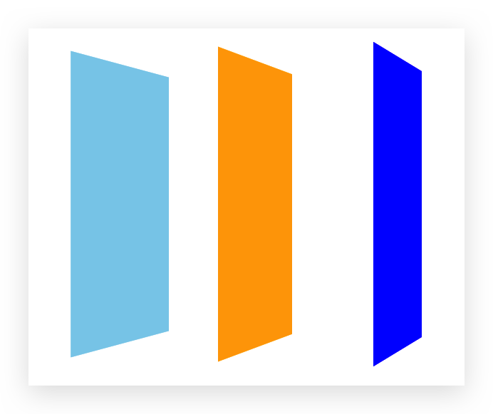

# 动画

并不存在真正意义上的 CSS3，只是对某些 Module Level 3 的统称，某些 Level 3 是否成为标准还需查阅文档

## `transform-origin`原点 🔥

`transform-origin`属性让你更改一个元素变形的原点。

- 一个值

  设置 x 轴的原点

- 两个值

  设置 x 轴和 y 轴的原点

- 值可以是

  - `<length>`：从**左上角开始计算**
  - `<percentage>`：参考**元素本身的大小**
  - `left`, `right`, `center`, `top`, `bottom`关键字中的一个（**常用**）

## `transform` 形变 🔥

**`transform`**属性允许你**平移，旋转，缩放，倾斜**指定元素。这是通过**修改 CSS 视觉格式化模型的坐标空间**来实现的。

可使用多个`function`，空格分割即可

### `translate(tx,ty)`平移

- `translate(tx, ty)`或`translate(tx)`。第二个参数不写默认为 0
- 可以简写为`translateX(tx)`或`translateY(ty)`
- 单位
  - 可以是`px`；
  - `%`（相对于元素自己）

### `translate3D(tx,ty,tz)`3D 平移

- `tz`为 0 时可以认为就是`translate(tx,ty)`

- 可以简写为`translateX(tx)`或`translateY(ty)`或`translateZ(tz)`

### `scale(sx,sy)`缩放

- `scale(sx,sy)`或`scale(sx)`。第二个参数不写**默认为`sx`以保持等比缩放**
- 可以简写为`scaleX(sx)`或`scaleY(sy)`
- 数字
  - 1：保持不变
  - 2：放大一倍
  - 0.5：缩小一半
- **不支持百分比**

### `scale3d(sx,sy,sz)`3D 缩放

- `sz`为 1 时可以认为就是`scale(sx,sy)`

- 可以简写为`scaleX(sx)`或`scaleY(sy)`或`scaleZ(sz)`

### `rotate(deg)`旋转

- 一个值

  表示旋转的角度

- 值类型 deg

  旋转的角度，正数为顺时针，负数为逆时针

  - shan

- 旋转的原点受`transform-origin`影响

### `rotate3d(x,y,z,deg)`3D 旋转

`x`,`y`都是 0 且`z`是 1 时可以认为就是`rotate(deg)`。

### `skew(deg,deg)`倾斜

可能会形变，旋转并不会形变

- 一个值

  表示 x 轴上的倾斜

- 两个值

  表示 x 轴和 y 轴上的倾斜

- 值类型 deg

  倾斜的角度，正数为顺时针，负数为逆时针

- 旋转的原点受`transform-origin`影响

- 可以简写为`skewX(deg)`或`skewY(deg)`

## `transition` 过渡动画 🔥

过渡 transition 是 CSS3 中具有颠覆性的特征之一，我们可以在不使用 Flash 动画或 JavaScript 的情况下，当元素从一种样式变换为另一种样式时为元素添加效果。虽然低版本浏览器不支持（IE9 以下版本）但是不影响页面布局。经常和 `:hover` 搭配使用。**谁做过渡给谁加**，控制多个元素可以在`,`后继续写，但不能写多个`transition`（MDN文档中体现在`#`）。

这个属性是用来进行**过渡动画**，**只能控制首尾**两个值。

```css
transition: 要过渡的属性 持续时间 运动曲线 何时开始, 要过渡的属性 持续时间
    运动曲线 何时开始;
```

- 属性：要变化的 CSS 属性， 宽高、背景颜色、内外边距、形变都可以。如果想要所有的属性都变化过渡， 写 all 即可。

- 持续时间：单位是秒（必须写单位），比如 0.5s

- 运动曲线：默认是 `ease`（可以省略）

  | 值                            | 描述                                                                              |
  | :---------------------------- | :-------------------------------------------------------------------------------- |
  | linear                        | 规定以相同速度开始至结束的过渡效果（等于 cubic-bezier(0,0,1,1)）。                |
  | ease                          | 规定慢速开始，然后变快，然后慢速结束的过渡效果（cubic-bezier(0.25,0.1,0.25,1)）。 |
  | ease-in                       | 规定以慢速开始的过渡效果（等于 cubic-bezier(0.42,0,1,1)）。                       |
  | ease-out                      | 规定以慢速结束的过渡效果（等于 cubic-bezier(0,0,0.58,1)）。                       |
  | ease-in-out                   | 规定以慢速开始和结束的过渡效果（等于 cubic-bezier(0.42,0,0.58,1)）。              |
  | cubic-bezier(_n_,_n_,_n_,_n_) | 在 cubic-bezier 函数中定义自己的值。可能的值是 0 至 1 之间的数值。                |

- 何时开始：单位是秒（必须写单位），可以设置**延迟触发时间**，默认是 0s（可以省略）


## `@keyframes` & `animation` 动画 🔥

使用`transition`只能进行**过渡动画**，但是过度动画只能控制首尾两个值。

*   从关键帧动画的角度相当于**只是定义了两帧的状态**：第一帧和最后一帧
*   如果希望可以有**更多状态的变化**，可以直接使用关键帧动画

关键帧动画使用`@keyframes` 来**定义多个变化状态**，并且使用`animation-name`来**声明匹配**

1.  使用`@keyframes`创建一个规则，`@keyframes`中使用百分比定义各个阶段的样式。

    可以用`from`和`to`指定0%和100%

2.  通过`animation`将动画添加到属性上，具体取值如下：

    ```css
    animation: name duration timing-function delay iteration-count direction fill-mode;
    ```

*   `name`：要使用的`@keyframes`的 identifier。**必填**

*   `duration`：动画持续的时间，默认值为`0s`。**必填**

*   `timing-function`：指定动画的变化曲线，默认值为`ease`

*   `delay`：延迟执行时间，默认值为`0s`

*   `iteration-count`：指定动画的执行次数，默认值为1。值为`infinite`表示无限执行

*   `direction`：指定方向，默认值为`normal`。常用`normal`和`reverse`
*   `fill-mode`：执行动画最后保留哪一个值
    *   `none`：默认值，回到没有执行动画的位置，
    *   `forwards`：动画最后一帧的位置
    *   `backwards`：动画第一帧的位置
*   `play-state`：**用在 JS 中，指定动画的运行或暂停！**
    *   `running`：默认值，当前动画正在运行
    *   `paused`：当前动画以被停止

```html
<style>
  @keyframes box-frame-1 {
    from {
      transform: translate3d(0, 0, 0);
    }
    25% {
      transform: translate3d(200px, 0, 0);
    }
    50% {
      transform: translate3d(200px, 100px, 0);
    }
    75% {
      transform: translate3d(0, 100px, 0);
    }
    to {
      transform: translate3d(0, 0, 0);
    }
  }

  .box {
    width: 100px;
    height: 100px;
    background-color: skyblue;
  }

  .box:hover {
    animation: box-frame-1 4s;
  }
</style>
<div class="box"></div>
```


## `perspective` & `preserve-3d` 动画 🔥

前端东西很多对 IE 有兼容性问题，自己查文档，懒得逼逼

*   CSS 3D 动画：

    *   `perspective`：视距！一般给父元素设置即可继承
    *   `transform-style: preserve-3d`：若使用`transform`时体现 3D 效果，则需要此属性

    ```html
    <style>
      body {
        /* 视距，指元素距离屏幕的距离 */
        perspective: 1000px;
      }
      .container {
        position: relative;
        width: 200px;
        height: 200px;
        margin: 100px auto;
      }
      .container .box {
        position: absolute;
        width: 200px;
        height: 200px;
        /* 意思为保持 3D 效果 */
        transform-style: preserve-3d;
      }
      .container .box1 {
        background-color: skyblue;
        transform: rotate3d(0, 1, 0, 75deg) translate3d(0, 0, -100px);
      }
      .container .box2 {
        background-color: orange;
        transform: rotate3d(0, 1, 0, 75deg) translate3d(0, 0, 0);
      }
      .container .box3 {
        background-color: blue;
        transform: rotate3d(0, 1, 0, 75deg) translate3d(0, 0, 100px);
      }
    </style>
    <div class="container">
      <div class="box box1"></div>
      <div class="box box2"></div>
      <div class="box box3"></div>
    </div>
    ```

    

*   JS 3D 动画库（兼容性好）：

    *   [three.js](https://threejs.org/)


## `filter` 滤镜 🔥

`filter`属性将**模糊**或**颜色偏移**等图形效果应用于元素。

```css
filter: 函数();
```

- `blur` 模糊处理，数值越大越模糊，如`blur(5px)`
