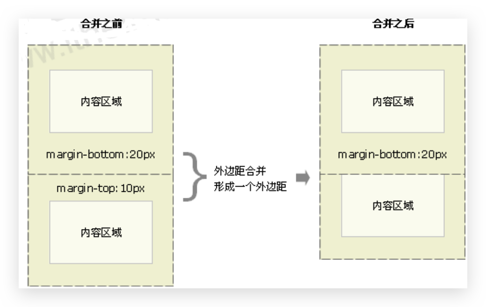

# Box Model 盒子模型

盒子模型：**所有 HTML 元素可以看作盒子**，盒子模型用来设计和布局时使用。CSS 盒模型本质上是一个盒子，封装周围的 HTML 元素，它包括：**margin，border，padding 和 content**。盒模型允许我们在**其它元素和周围元素 border 之间的空间放置元**素。


## `box-sizing` 盒子标准 🔥

CSS3 中可以通过 `box-sizing` 来指定盒模型，这样我们计算盒子大小的方式就发生了改变。有 2 个值：

- `content-box`：即设置`width`和`height`仅针对`content`，最终盒子大小为 content + padding + border

    若盒子模型改为`content-box`且没有指定 width 或 height（即使子节点和父节点一样宽，也不要指定宽度，100%也不行），则给定 padding 不会改变盒子大小及 width 或 height（对应，没 width 则不改变 width，没 height 则不改变 height）

    但是 `padding`可以撑开盒子，我们可以做非常巧妙的运用。因为每个导航栏里面的**字数不一样多**，我们可以**不用给每个盒子宽度了**，直接给 **padding** 最合适，且 a 标签为行内元素，需转为行内块元素才能修改宽高

- `border-box`：CSS3，即设置`width`和`height`针对 content + padding + border

    若盒子模型改为 `border-box` ， 那 padding 和 border 就不会撑大盒子了，前提 padding 和 border 不会超过 width 宽度

    


## Visual formatting model 细节🔥

### 布局和包含块🔥

::: tip

参考[W3 文档](https://www.w3.org/TR/CSS2/visudet.html)， [MDN 文档](https://developer.mozilla.org/zh-CN/docs/Web/CSS/All_About_The_Containing_Block)。

:::

一个元素大小的和位置经常受其**包含块**的影响。大多数情况下，包含块就是这个元素最近的祖先[块元素](https://developer.mozilla.org/zh-CN/docs/Web/HTML/Block-level_elements)的[内容区](https://developer.mozilla.org/zh-CN/docs/Web/CSS/CSS_Box_Model/Introduction_to_the_CSS_box_model#content-area)，但也不是总是这样。确定一个元素的包含块的过程完全依赖于这个元素的 [`position`](https://developer.mozilla.org/zh-CN/docs/Web/CSS/position) 属性：

1.  如果 position 属性为 `static` 或 `relative` ，包含块就是由它的最近的祖先**块元素**（比如说inline-block, block 或 list-item元素）或格式化上下文(比如说 a table container, flex container, grid container, or the block container itself)的**内容区的边缘**组成的。
2.  如果 position 属性为 `absolute` ，包含块就是由它的最近的 position 的值不是 `static` （也就是值为`fixed`, `absolute`, `relative` 或 `sticky`）的祖先元素的**内边距区的边缘**组成。
3.  如果 position 属性是 `fixed`，在连续媒体的情况下(continuous media)包含块是 [viewport](https://developer.mozilla.org/en-US/docs/Glossary/viewport) ,在分页媒体(paged media)下的情况下包含块是分页区域(page area)。
4.  如果 position 属性是 `absolute` 或 `fixed`，包含块也可能是由满足以下条件的最近父级元素的内边距区的边缘组成的：
    1.  A [`transform`](https://developer.mozilla.org/zh-CN/docs/Web/CSS/transform) or [`perspective`](https://developer.mozilla.org/zh-CN/docs/Web/CSS/perspective) value other than `none`
    2.  A [`will-change`](https://developer.mozilla.org/zh-CN/docs/Web/CSS/will-change) value of `transform` or `perspective`
    3.  A [`filter`](https://developer.mozilla.org/zh-CN/docs/Web/CSS/filter) value other than `none` or a `will-change` value of `filter`(only works on Firefox).
    4.  A [`contain`](https://developer.mozilla.org/zh-CN/docs/Web/CSS/contain) value of `paint` (例如: `contain: paint;`)

::: warning 注意

根元素(`<html>`)所在的包含块是一个被称为**初始包含块**的矩形。

:::

### Horizontal Formatting🔥

标准流水平布局中的七个属性中必须包含以下约束（绝对/固定定位的公式需要添加 left 和 right，其余规则类似）：

```
margin-left + border-left-width + padding-left + width + padding-right + border-right-width + margin-right 
= 
width of containing block
```

*   🔥上述值中只有 'width'， 'margin-left' 和 'margin-right' 可以设置为 'auto'，且 'width' 默认就是 'auto'（只可设置为非负值）。其余几个属性必须设置为特定的值或默认值为 0。且只有 'margin' 可以为负值。

*   🔥如果恰好有一个值指定为“ auto”，其余俩值有特定值，则 'auto' 值根据等式计算得出。

    ```css
    div {
      width: 500px;
    }
    p {
      margin-left: auto;
      margin-right: 100px;
      width: 100px;
    } /* 'auto' left margin evaluates to 300px */
    ```

    ```css
    p {
      margin-left: 100px;
      margin-right: 100px;
      /* 省略了也是默认值 auto */
      /* width: auto; */
    }
    ```

*   🔥如果 'width' 被设置为 'auto'，那么任何其他 'auto' 的值都将变成 '0'，并且 'width 的值由等式推出（即计算包含块）。

    ```css
    div {
      width: 500px;
    }
    p {
      margin-left: auto;
      margin-right: 100px;
      width: auto;
    } /* left margin evaluates to 0; width becomes 400px */
    ```

    ```css
    div {
      width: 500px;
    }
    p {
      margin-left: auto;
      margin-right: auto;
      width: auto;
    } /* left and right margin evaluates to 0; width becomes 500px */
    ```

*   🔥若 'width' 有除 “auto” 以外的计算值，且 'margin-left' 和 'margin-right' 均为 'auto'，则它们的使用**值相等**（当然也可以手动设置相同值，不过没必要）。**这使元素相对于包含块的边缘水平居中**。

    ```css
    div {
      width: 500px;
    }
    p {
      width: 300px;
      margin-left: auto;
      margin-right: auto;
    }
    /* each margin is 100 pixels wide, because (500-300)/2 = 100 */
    ```

*   🔥如果以上所有内容**均具有**除 “auto” 以外的计算值，则这些值被称为“**过度约束**”，并且必定造成其中一个的值与其计算值不同。 如果包含块的 'direction' 属性的值为 'ltr'，则将忽略指定的 'margin-right' 值（即设置为 'auto'），并计算该值以使等式成立。 如果 'direction'的值为 'rtl'，则恰好是 'margin-left'（即设置为 'auto'）。设置为 'auto' 后会根据等式计算得出值。

    ```css
    div {
      width: 500px;
    }
    p {
      margin-left: 100px;
      margin-right: 100px;
      width: 100px;
    } /* right margin forced to be 300px */
    ```

*   🔥当 'width of containing block' 一定，若 'margin-right' 为负值且其他值不变，则 'widht' 变大；'margin-left' 为负值，左移。

    当添加 padding 或 border 后，width 会变小。

    ```css
    div {
      width: 500px;
      border: 3px solid black;
    }
    p.wide {
      margin-left: 10px;
      width: auto;
      margin-right: -50px;
    }
    ```

*   如果 'width' 不是 'auto' 并且 'border-left-width' + 'padding-left' + 'width' + 'padding-right' + 'border-right-width'（加上任何**值不是** 'auto' 的 'margin-left' 或 'margin-right' ）**大于包含块的宽度**，那么对于任何 'auto' 的 'margin-left' 或 'margin-right'，将应用如下规则：**'auto' 值都将被视为 0**。**没懂！不知道场景！**


## `width` 宽度

*   `width` 设置盒子的宽度，**默认值为 'auto'**

*   `min-width` 代表最小宽度，最终值大于等于`min-width`，**多用于 PC 网站，固定最小宽度**
*   `max-width` 代表最大宽度，最终值小于等于`max-width`，用于`inline-block`的元素内容，超过即换行


## `height` 高度

*   `height` 设置盒子的高度

*   `min-height` 代表最小高度，最终值大于等于`min-height`，**多用于 PC 网站，固定最小高度**
*   `max-height` 代表最大高度，最终值小于等于`max-width`，用于固定最大高度，超过可通过`overflow`隐藏


## `padding` 内边距

padding 属性用于设置内边距，即 border 与 content 之间的距离。也可以分开指定上下左右。

| 值的个数                     | 含义                       |
| ---------------------------- | -------------------------- |
| padding: 5px;                | 1 个值，代表上下左右       |
| padding: 5px 10px;           | 2 个值，代表上下、左右     |
| padding: 5px 10px 20px;      | 3 个值，代表上、左右、下   |
| padding: 5px 10px 20px 30px; | 4 个值，代表上、右、下、左 |

*   在`box-sizing`为`content-box`时，padding **影响了盒子实际大小**。 也就是说，如果盒子已经有了宽度和高度，此时再指定内边框，会撑大盒子；如果盒子没有了宽度或高度，则不影响

*   **背景颜色会延伸到内边距上**


## `border` 边框 

### `border` 缩写🔥

简写

```css
border : border-width || border-style || border-color;
```

分开写

```css
border-top: border-width || border-style || border-color;
border-bottom: border-width || border-style || border-color;
border-left: border-width || border-style || border-color;
border-right: border-width || border-style || border-color;
```

注意边框的层叠性


### `border-width` 宽度

* 同其他


### `border-style` 样式

- none：没有边框即忽略所有边框的宽度，默认
- solid：单实线，**常用**
- double：双实线
- dashed：块虚线
- dotted：点虚线
- ...


### `border-color` 颜色

* 同其他
* `transparent`透明


### 利用`border`作图 🔥

如下代码：

```html
<style>
  div {
    display: inline-block;
  }
  .border-shape-1 {
    width: 100px;
    height: 100px;
    border-top: 50px solid red;
    border-right: 50px solid blue;
    border-bottom: 50px solid green;
    border-left: 50px solid skyblue;
  }

  .border-shape-2 {
    /* 宽度必须给0，否则独占一行，默认为父容器宽度。高度可以不给，通过内容撑起来 */
    width: 0;
    border-top: 100px solid red;
    border-right: 100px solid blue;
    border-bottom: 100px solid green;
    border-left: 100px solid skyblue;
  }
  
  .border-shape-3 {
    /* 宽度必须给0，否则独占一行，默认为父容器宽度。高度可以不给，通过内容撑起来 */
    width: 0;
    border-top: 200px solid red;
    border-left: 200px solid skyblue;
    /* 上左，上右改变分割线方向 */
    /* border-right: 200px solid blue; */
  }

  /* 也可以配合3种示例，结合旋转实现 */
  .border-shape-4 {
    /* 宽度必须给0，否则独占一行，默认为父容器宽度。高度可以不给，通过内容撑起来 */
    width: 0;
    border: 100px solid transparent;
    border-left: 100px solid skyblue;
  }

  .border-shape-5 {
    /* 宽度必须给0，否则独占一行，默认为父容器宽度。高度可以不给，通过内容撑起来 */
    width: 0;
    border-top: 200px solid red;
    border-right: 100px solid blue;
    border-left: 100px solid skyblue;
  }
</style>
<div class="border-shape-1"></div>
<div class="border-shape-2"></div>
<div class="border-shape-3"></div>
<div class="border-shape-4"></div>
<div class="border-shape-5"></div>
```

显示效果如下：


### `border-collapse` 表格边框🔥

border-collapse 属性控制浏览器绘制表格边框的方式。它控制相邻单元格的边框。

```css
border-collapse: collapse || separate; 
```

* collapse：**合并**，表示相邻边框合并在一起，**常用**
* separate：分开


### `border-radius`圆角边框🔥

> radius：半径

可以**分别给四个角**都设置角度

* 左上、 右上、 右下、 左下
* 左上和右下、 右上和左下
* 甚至还能直接指定top、bottom、left、right，**必须前两个在前面**
* 可以对每个角的x, y设置不同的角度
* 若单位为%，则参考的是**当前盒子的宽度**

案例

* 如何让一个盒子变**圆形**：给`border-radius`为正方盒子 width 和 height（相等） 的一半，如50%

    ```css
    div{
      border-radius: 50%
    }
    ```

* 如何让一个盒子变**圆角矩形**：给`border-radius `为盒子 height 的一半，如50%


## `outline`轮廓线

不属于盒子模型。同 `border` 相比，`outline`不会增加盒子的大小，默认显示在`border`外面，**取值同** `border`。

可用于分析网站布局；也可用于去掉`input`或`a`（tab选中）或`textraea`的 focus 轮廓蓝线。

* `none`：取消，写`0`也可


## `margin` 外边距

### `margin` 缩写 🔥

margin 清除周围的（外边框）元素区域。margin 没有背景颜色，是完全透明的。也可以分开指定上下左右。**默认值为 0**

| 值的个数                    | 含义                       |
| --------------------------- | -------------------------- |
| margin: 5px;                | 1 个值，代表上下左右       |
| margin: 5px 10px;           | 2 个值，代表上下、左右     |
| margin: 5px 10px 20px;      | 3 个值，代表上、左右、下   |
| margin: 5px 10px 20px 30px; | 4 个值，代表上、右、下、左 |


### `margin` 负值 🔥

#### 问题1

**有间隙的格子布局**时一行中最后一个元素的`margin-right`总会多余

解决：

*   选择一行最后一个元素，添加`class`，去除`margin-right`

*   使用伪类选择器（IE8不支持）

*   **增大包含块的宽度**。

    `.container`固定宽度> `.wrap`>很多`item`。`.wrap`一般是`ul`
    
    给`.wrap`+负`margin`即可增大`.wrap`宽度；或直接给`.wrap`宽度增大


#### 问题2

**无间隙的格子布局**，需要对变粗的边界进行合并，可以使用负`margin`


### 块级盒子水平居中 🔥

**margin 典型应用**——让**块级盒子水平居中**，但需满足两个条件

- 子盒子必须指定了 width

- 子盒子的左右 margin 都设置为 auto

  ```css
  div {
    width: 100px;
    margin: 0 auto;
  }
  ```

若是**行内元素**或**行内块元素**的**内容**需要**水平居中**，可以给其父元素添加`text-align: center`即可

::: tip margin 水平居中原理

原理参考 Visual formatting model 章节

对**块元素所属行的剩余空间的分配**问题。`auto`则表示剩余空间都给这侧。据此可以实现左对齐，右对齐。

垂直居中需要使用**定位和移动**，**移动父元素高度的一半并减去子元素盒子高度的一半**。

:::


### 边界折叠问题 🔥

两个**块元素**（block）的相邻垂直`margin`同时都有设定时只会只会**保留最大边距**，这种行为称为边界折叠（margin collapsing），有时也翻译为外边距重叠。**只有垂直外边距会发生该问题**。

有三种情况会形成外边距重叠：


#### 兄弟元素

相邻的两个兄弟元素之间的外边距重叠，除非后一个元素加上[clear-fix清除浮动](https://developer.mozilla.org/zh-CN/docs/Web/CSS/clear)。

*   两者都是**正值**，兄弟元素间的相邻垂直外边距会取两者之间的**较大值**
*   如果相邻的外边距**一正一负**，则取两者的**和**
*   如果相邻的外边距都是**负值**，则取两者中**绝对值较大的**

**兄弟元素之间的外边距的重叠，对于开发是有利的，所以我们不需要进行处理**

如下图，上面的元素有下外边距 margin-bottom，下面的元素有上外边距 margin-top ，则他们之间的垂直间距是**取最大值**。对于段落`p`元素正好可以使用该副作用。



```html
<style>   
  p:nth-child(1) {
    width: 100px;
    height: 100px;
    background-color: skyblue;
    margin-bottom: 50px;
  }
  p:nth-child(2) {
    width: 100px;
    height: 100px;
    background-color: skyblue;
    margin-top: 50px;
  }
</style>

<div>
  <p>下边界范围会...</p>
  <p>...会跟这个元素的上边界范围重叠。</p>
</div>
```

解决方案（一般无需解决）：

*   尽量只给一个盒子添加 margin 值


#### 父子元素

如果没有 border，padding，content，也没有创建块级格式上下文或清除浮动来分开一个块级元素的上边界margin-top 与其内一个或多个后代块级元素的上边界margin-top；

或没有边框，内边距，行内内容，高度height，最小高度min-height或 最大高度max-height 来分开一个块级元素的下边界margin-bottom与其内的一个或多个后代后代块元素的下边界margin-bottom

则就会出现父块元素和其内后代块元素外边界重叠，**重叠部分最终会溢出到父级块元素外面**。即**子元素的会传递给父元素（上外边距）**

父子外边距的折叠会**影响到页面的布局**，**必须要进行处理**

如下图，对于两个嵌套关系（父子关系）的块元素，父元素有上外边距同时（其实父元素可以没有外边距）子元素也有上外边距，此时父元素会**塌陷**较大的外边距值。即**子元素想距离父元素上边距失效（即父子元素上边框还是重合的）**。注意**以内容区域为视角**看问题。下外边距同理（但是必须父元素的高度是`auto`）

  

```html
<style type="text/css">
  section {
    width: 400px;
    height: auto;
    background-color: skyblue;
    margin-top: 50px;
    margin-bottom: 100px;
  }

  header {
    width: 100px;
    height: 100px;
    background-color: orange;
    margin-top: 100px;
  }

  footer {
    width: 100px;
    height: 100px;
    background-color: greenyellow;
    margin-bottom: 50px;
  }
</style>

<hr />
<section>
  <header>上边界重叠 </header>
  <main></main>
  <footer>下边界重叠</footer>
</section>
<hr />
```

解决方案：

- 可以为父元素定义`border-top/bottom`

- 可以为父元素定义`padding-top/bottom`

- **触发BFC**（查看 float 章节）

    **推荐使用伪元素添加一个`display:table`匿名表格单元格元素**（推荐，查看 float 章节）

    


#### 空的块级元素

当一个块元素上边界margin-top 直接贴到元素下边界margin-bottom时也会发生边界折叠。这种情况会发生在一个块元素完全没有设定边框border、内边距paddng、高度height、最小高度min-height 、最大高度max-height 、内容设定为inline或是加上clear-fix的时候。

```html
<style>
  p {
    margin: 0;  
  }
  div {
    margin-top: 13px;
    margin-bottom: 87px;
  }
</style>

<p>上边界范围是 87 ...</p>
<div></div>
<p>... 上边界范围是 87</p>
```

-   上述情况的组合会产生更复杂的外边距折叠。
-   即使某一外边距为0，这些规则仍然适用。因此就算父元素的外边距是0，第一个或最后一个子元素的外边距仍然会“溢出”到父元素的外面。
-   如果参与折叠的外边距中包含负值，折叠后的外边距的值为最大的正边距与最小的负边距（即绝对值最大的负边距）的和,；也就是说如果有-13px 8px 100px叠在一起，边界范围的技术就是 100px -13px的87px。
-   如果所有参与折叠的外边距都为负，折叠后的外边距的值为最小的负边距的值。这一规则适用于相邻元素和嵌套元素。


## `box-shadow` 盒子阴影 🔥

同类型的还有`text-shadow`，用得少，见属性笔记

```css
box-shadow: h-shadow v-shadow blur spread color inset;/* 与顺序无关 */
```

| 值         | 描述                                                         |
| :--------- | :----------------------------------------------------------- |
| _h-shadow_ | **必需**。水平阴影的位置。正值向右移动，负值向左移动         |
| _v-shadow_ | **必需**。垂直阴影的位置。正值向下移动，负值向上移动         |
| _blur_     | 可选。**模糊半径**，阴影的**发散程度**                       |
| _spread_   | 可选。阴影的尺寸，就是**阴影向四周延伸的大小**               |
| _color_    | 可选。阴影的颜色。请参阅 CSS 颜色值。                        |
| inset      | 可选。将外部阴影 (outset) 改为内部阴影。不能写 outset 否则失效 |

可以通过`,`设置多个值

```css
div {
  box-shadow: 5px 5px 10px, -5px -5px 10px;/* 对应x y blur, y x blur. 但是明显对角线割裂了，不推荐 */
}
```

::: tip 注意

**影子不占用空间**，不影响其他盒子排列

:::


