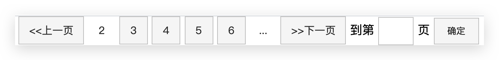

# 传统布局

页面布局要学习三大核心：**盒子模型、浮动、定位**

网页布局过程：

1. 先准备好相关的网页元素，网页元素基本都是盒子 Box
2. 利用 CSS 设置好盒子样式，然后摆放到相应位置
3. 往盒子里面装内容

 网页布局的核心本质：就是利用 CSS 摆盒子。


## 传统布局总结及案例🔥

### 总结

一个完整的网页，是标准流、浮动、定位一起完成布局的，每个都有自己的专门用法。

* 标准流：可以让盒子上下排列或者左右排列，垂直的块级盒子显示就用标准流布局。
* 浮动：可以让多个块级元素一行显示或者左右对齐盒子，多个块级盒子水平显示就用浮动布局。
* 定位：定位最大的特点是有层叠的概念，就是可以让多个盒子前后叠压来显示。如果元素自由在某个盒子内移动就 用定位布局。

即

* **多个块级元素纵向排列找标准流，多个块级元素横向排列找浮动（利用标准流约束浮动元素位置）**

* **先设置盒子的大小，之后设置盒子的位置**

* 一个元素浮动了，理论上其余的兄弟元素也要浮动，以防止引起问题

  **浮动的盒子只会影响浮动盒子后面的标准流，不会影响前面的标准流（前面的标准流占一行，无论在浮动盒子的上面还是下面）**

* 遇到header和footer需要和显示器等宽的，不需要设置width，自动就是等宽的


### 1 CSS初始化

不同浏览器对有些标签的默认值是不同的，为了消除不同浏览器对HTML文本呈现的差异，照顾浏览器的兼 容，我们需要对CSS 初始化，重设浏览器的样式，也称为CSS reset。以京东CSS初始化代码为例：

```css
/* 把我们所有标签的内外边距清零 */
* {
  margin: 0;
  padding: 0
}
/* em 和 i 斜体的文字不倾斜 */
em,
i {
  font-style: normal
}
/* 去掉li 的小圆点 */
li {
  list-style: none
}

img {
  /* border 0 照顾低版本浏览器 如果 图片外面包含了链接会有边框的问题 */
  border: 0;
  /* 取消图片底侧有空白缝隙的问题 */
  vertical-align: middle
}

button {
  /* 当我们鼠标经过button 按钮的时候，鼠标变成小手 */
  cursor: pointer
}

a {
  color: #666;
  text-decoration: none
}

a:hover {
  color: #c81623
}

button,
input {
  /* "\5B8B\4F53" 就是宋体的意思 这样浏览器兼容性比较好 */
  font-family: Microsoft YaHei, Heiti SC, tahoma, arial, Hiragino Sans GB, "\5B8B\4F53", sans-serif
}

body {
  /* CSS3 抗锯齿形 让文字显示的更加清晰 */
  -webkit-font-smoothing: antialiased;
  background-color: #fff;
  font: 12px/1.5 Microsoft YaHei, Heiti SC, tahoma, arial, Hiragino Sans GB, "\5B8B\4F53", sans-serif;
  color: #666
}

.hide,
.none {
  display: none
}
/* 清除浮动 */
.clearfix:after {
  visibility: hidden;
  clear: both;
  display: block;
  content: ".";
  height: 0
}

.clearfix {
  *zoom: 1
}
```


### 2 CSS 属性书写顺序

* 布局定位属性:display / position / float / clear / visibility / overflow(建议 display 第一个写，关系到模式)
* 自身属性:width / height / margin / padding / border / background
* 文本属性:color / font / text-decoration / text-align / vertical-align / white- space / word-break
* 其他属性(CSS3):content / cursor / border-radius / box-shadow / text-shadow / background:linear-gradient ...


### 3 页面整体布局思路

为了提高网页制作的效率，布局时通常有以下的布局流程:

1. 必须确定页面的**版心**(可视区)，基本上**宽度**都和它一致。测量可得知。
2. 分析页面中的**行模块**，以及每个**行模块中的列模块**。其实页面布局，就是一行行罗列而成的。
3. 制作 HTML 结构。我们还是遵循，先有结构，后有样式的原则。**结构永远最重要**。
4. 开始运用盒子模型的原理，通过 DIV+CSS 布局来控制网页的各个模块。


### 4 确定版心

这个页面的版心 width 是 1200 像素，每个版心都要**水平居中对齐**，可以定义版心为公共类:

```css
.w {
  width: 1200px;
  margin: auto;
}
```


### 5 头部盒子

* 1 号是版心盒子 header 1200 * 42 的盒子水平居中对齐，上下给一个 margin 值就可以
* 版心盒子里面包含 2 号盒子 logo。**div布局好后放入img即可**
* 版心盒子里面包含 3 号盒子 nav 导航栏，实际开发中，**nav一般采用li + a 的做法**。语义更清楚，且若直接使用a来堆砌，搜索引擎容易辨别为有堆砌关键字嫌疑，有降权风险
  * 给li浮动，li是块级元素，a是内联元素
  * 导航栏可以不给宽度，将来可继续添加文字；因为文字不一样多，给**a左右padding来撑开盒子即可**
* 版心盒子里面包含 4 号盒子 search 搜索框。一个大div套input和button


### 6 banner


### 7 footer


### 8 hot

利用 position


### 9 轮播图

利用position

父盒子相对定位，子模块绝对定位


## 常见布局技巧

### margin负值的运用 

盒子细线边框加粗问题

* 让每个盒子margin 往**左侧移动 -1px 正好压住相邻盒子边框**（浏览器渲染时是分别渲染的，所以可以实现）

hover 时右侧边框被右边盒子覆盖掉问题

* 鼠标经过某个盒子的时候，**提高当前盒子的层级即可**。

  如果父盒子**没有有定位**，则加相对定位（保留位置）；**如果父盒子有定位**，则加`z-index`


### 文字围绕浮动元素 

父盒子中有**左侧图片和右侧文字**，此时可以**利用float的文字环绕来解决**，不用再定义2个盒子


### 行内块的巧妙运用 

利用行内块元素中间有缝隙，且可以使用`text-align`来居中，可以指定width、height

```html
<!DOCTYPE html>
<html lang="en">
  <head>
    <meta charset="UTF-8">
    <meta name="viewport" content="width=device-width, initial-scale=1.0">
    <meta http-equiv="X-UA-Compatible" content="ie=edge">
    <title>行内块的巧妙运用</title>
    <style>
      * {
        margin: 0;
        padding: 0;
      }
      .box {
        text-align: center;
      }
      .box a {
        display: inline-block;
        width: 36px;
        height: 36px;
        background-color: #f7f7f7;
        border: 1px solid #ccc;
        text-align: center;
        line-height: 36px;
        text-decoration: none;
        color: #333;
        font-size: 14px;
      }
      .box .prev,
      .box .next {
        width: 85px;
      }
      .box .current,
      .box .elp {
        background-color: #fff;
        border: none;
      }
      .box input {
        height: 36px;
        width: 45px;
        border: 1px solid #ccc;
        outline: none;
      }
      .box button {
        width: 60px;
        height: 36px;
        background-color: #f7f7f7;
        border: 1px solid #ccc;

      }
    </style>
  </head>
  <body>
    <div class="box">
      <a href="#" class="prev">&lt;&lt;上一页</a>
      <a href="#" class="current">2</a>
      <a href="#">3</a>
      <a href="#">4</a>
      <a href="#">5</a>
      <a href="#">6</a>
      <a href="#" class="elp">...</a>
      <a href="#" class="next">&gt;&gt;下一页</a>
      到第 
      <input type="text">
      页
      <button>确定</button>
    </div>
  </body>
</html>
```

效果如下：




## bootstrap

> 详细内容访问[Bootstrap中文网](http://www.bootcss.com/)

- **引入依赖**

  - css：`bootstrap.css`
  - js：`jquery.js`、`popper.js`(用于弹窗、提示、下拉菜单。版本3没有这个)、`bootstrap.js`

- **响应式布局**：一个网站可以兼容多个终端

  ```html
  <meta charset="UTF-8">
  <!--响应式 meta 标签;viewport宽度；初始缩放值；最小/最大缩放值；是否允许用户缩放-->
  <!--还有minimum-scale；maximum-scale；user-scalable=true/false-->
  <meta name="viewport" content="width=device-width, initial-scale=1.0">
  <!--文档兼容模式-->
  <meta http-equiv="X-UA-Compatible" content="ie=edge">
  ```

  - viewport
    - 移动设备上的就是**设备的屏幕上能用来显示我们的网页的那一块区域**
  - px
    - css中1px并不等于设备的1px

- 步骤

  1. 定义布局容器：`container`、`.container-fluid`
  2. 定义行：`row`
  3. 定义列：`col-xs-*`、`col-sm-*`、`col-md-*`、`col-lg-*`、`hidden-**`（可以让元素在某个屏幕大小设备**不显示**）

#### 1.1 布局容器

- Bootstrap 需要为页面内容和栅格系统包裹一个容器
  - `.container` **类**用于固定宽度（根据不同设备左右有固定留白，但xs没有留白）并支持响应式布局的容器
  - `.container-fluid` **类**用于 100% 宽度，占据全部视口（viewport）的容器

#### 1.2 栅格系统

Bootstrap提供了一套响应式、移动设备优先的流式栅格系统，随着屏幕或视口(viewport)尺寸的增加，系统会自动分为最多**12列**

- 栅格系统用于通过一系列的行（row）与列（column）的组合来创建页面布局，你的内容就可以放入这些创建好的布局中。工作**原理**如下：
  - “行（row）”必须包含在 `.container` （固定宽度）或 `.container-fluid` （100% 宽度）中，以便为其赋予合适的排列（**aligment**）和内补（**padding**）。
  - 通过“行（row）”在水平方向创建一组“列（column）”。
  - 你的内容应当放置于“列（column）”内，并且，只有“列（column）”可以作为“行（row）”的直接子元素。
  - 类似 `.row` 和 `.col-xs-4` 这种预定义的类，可以用来快速创建栅格布局。Bootstrap 源码中定义的 mixin 也可以用来创建语义化的布局。
  - 通过为“**列（column）”设置 `padding` 属性**，从而创建列与列之间的间隔（gutter）。通过**为 `.row` 元素设置负值 `margin`** 从而抵消掉为 `.container` 元素设置的 `padding`，也就间接为“行（row）”所包含的“列（column）”抵消掉了`padding`。==多列嵌套时，可以通过==`padding:0`==来取消内边距，使得元素占满viewport==
  - 负值的`margin`就是下面的示例为什么是向外突出的原因。在栅格列中的内容排成一行。
  - 栅格系统中的列是通过指定1到12的值来表示其**跨越的范围**。例如，三个等宽的列可以使用三个 `.col-xs-4` 来创建。
  - 如果一“行（row）”中包含了的“列（column）”大于 12，多余的“列（column）”所在的元素将被作为一个整体**另起一行排列**。
  - **向上兼容且不向下兼容**：**栅格类适用于与屏幕宽度大于或等于分界点大小的设备** ， 并且**针对小屏幕设备覆盖栅格类（可能每个列占一行）**。 因此，在元素上应用任何 `.col-md-*`栅格类适用于与屏幕宽度大于或等于分界点大小的设备 ， 并且针对小屏幕设备覆盖栅格类。 因此，在元素上应用任何 `.col-lg-*`不存在， 也影响大屏幕设备。

#### 1.3 全局CSS样式、组件、插件

**全局CSS样式**

- 按钮： `<button>` (建议使用)、`<a>`、 `<input>` 。`class="btn btn-default"`
- 图片：`img-responsive"`、`img-rounded`(方)、`img-circle`(圆)、`img-thumbnail`(相框)
- 表格：`table`、`table-bordered`、`table-hover`
- 表单：

**组件**

- 导航条
- 分页：！！！

**插件**

- 轮播图

#### 1.4 其他详细的看文档去吧！
