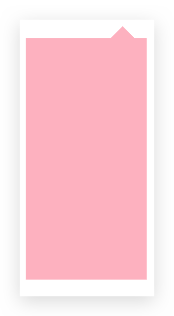

# 高级技巧


## CSS 三角

### 使用1

看如下代码：

```html
<!DOCTYPE html>
<html lang="en">
  <head>
    <meta charset="UTF-8">
    <meta name="viewport" content="width=device-width, initial-scale=1.0">
    <meta http-equiv="X-UA-Compatible" content="ie=edge">
    <title>CSS三角</title>
    <style>
      .test {
        width: 0;
        height: 0;
        border-top: 100px solid red;
        border-right: 100px solid green;
        border-bottom: 100px solid blue;
        border-left: 100px solid pink;
      }
    </style>
  </head>
  <body>
    <div class="test"></div>
  </body>
</html>
```

其结果如下图：


由此可画出三角形，如向右的三角，具体代码如下：

```css
.test2 {
  width: 0;
  height: 0;
  border: 100px solid transparent;/* transparent 的使用*/
  border-left: 100px solid red;
  /* 照顾兼容性问题 */
  line-height: 0;
  font-size: 0;
}
```

### 使用2

```html
<!DOCTYPE html>
<html lang="en">

  <head>
    <meta charset="UTF-8">
    <meta name="viewport" content="width=device-width, initial-scale=1.0">
    <meta http-equiv="X-UA-Compatible" content="ie=edge">
    <title>CSS三角</title>
    <style>
      .test {
        width: 0;
        height: 0;
        border-top: 100px solid red;
        border-left: 50px solid green;
        border-right: 50px solid blue;
      }
    </style>
  </head>

  <body>
    <div class="test"></div>
  </body>

</html>
```

效果如下：


### 京东三角案例1

使用 position 和 CSS 三角完成，如下：

```html
<!DOCTYPE html>
<html lang="en">

  <head>
    <meta charset="UTF-8">
    <meta name="viewport" content="width=device-width, initial-scale=1.0">
    <meta http-equiv="X-UA-Compatible" content="ie=edge">
    <title>CSS三角</title>
    <style>
      .jd {
        position: relative;
        width: 100px;
        height: 200px;
        background-color: pink;
        margin: 100px auto;
      }

      .jd span {
        position: absolute;
        left: 70px;
        top: -20px;
        width: 0;
        height: 0;
        border: 10px solid transparent;
        border-bottom: 10px solid pink;
      }
    </style>
  </head>

  <body>
    <div class="jd">
      <span></span>
    </div>
  </body>

</html>
```

具体效果如下：



### 京东三角案例2

```html
<!DOCTYPE html>
<html lang="en">

  <head>
    <meta charset="UTF-8">
    <meta name="viewport" content="width=device-width, initial-scale=1.0">
    <meta http-equiv="X-UA-Compatible" content="ie=edge">
    <title>CSS三角强化的巧妙运用</title>
    <style>
      .price {
        width: 160px;
        height: 24px;
        line-height: 24px;
        border: 1px solid red;
        margin: 0 auto;
      }

      .miaosha {
        position: relative;
        float: left;
        width: 90px;
        height: 100%;
        background-color: red;
        text-align: center;
        color: #fff;
        font-weight: 700;
        margin-right: 8px;

      }

      .miaosha i {
        position: absolute;
        right: 0;
        top: 0;
        width: 0;
        height: 0;
        border-color: transparent #fff transparent transparent;
        border-style: solid;
        border-width: 24px 10px 0 0;
      }

      .origin {
        font-size: 12px;
        color: gray;
        text-decoration: line-through;
      }
    </style>
  </head>

  <body>
    <div class="price">
      <span class="miaosha">
        ¥1650
        <i></i>
      </span>
      <span class="origin">¥5650</span>
    </div>
  </body>

</html>
```

效果如下：

