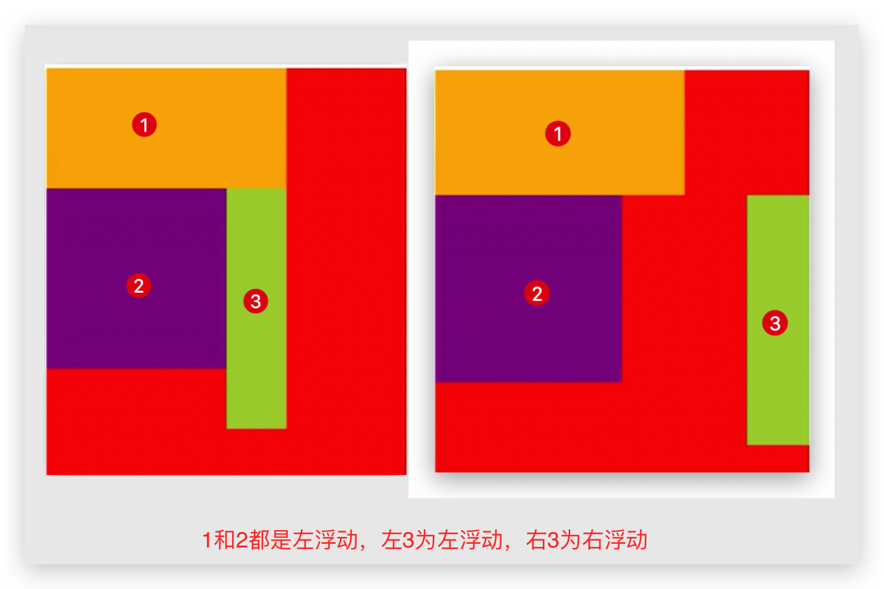

# Float 浮动

## 浮动规则

```css
选择器 { 
  float: 属性值; 
}
```

| 值      | 描述                                                 |
| :------ | :--------------------------------------------------- |
| left    | 元素向左浮动。                                       |
| right   | 元素向右浮动。                                       |
| none    | 默认值。元素不浮动，并会显示在其在文本中出现的位置。 |
| inherit | 规定应该从父元素继承 float 属性的值。                |

*   **脱标**。查看脱离标准流元素特点总结元素类型

*   浮动用于**创建浮动框**，将元素**横向移到一边**，直到左边缘或右边缘触及 **包含块（容器或父元素）** 或 **另一个浮动框** 的边缘。

*   浮动的元素允许**文本和行内元素（inline 或 inline-block 等）环绕**它

*   **行内元素（inline 或 inline-block 等）浮动后**，其**顶部将与所在行的顶部对齐，不会朝上浮**

    

*   **定位元素（非static）会层叠在浮动元素上**（按标准流——浮动——定位的顺序）。**浮动元素间不能层叠（不多解释）**。

*   浮动元素的**顶端不能超过包含块的顶端**，也**不能超过之前所有浮动元素的的顶端（以最低的为界限）**

    

*   如果包含框太窄，无法容纳水平排列的三个浮动元素，那么其它**浮动块向下移动**，直到有足够的空间；如果浮动元素的高度不同，那么当它们向下移动时可能被其它浮动元素“**卡住**”

    


## 现象

```html
<div class="box">
  <div class="inner1">
    
  </div>
  <div class="inner2">
    我是inner2的文本
  </div>
</div>
```

*   当inner1进行左浮动/右浮动时，只会在当前自己行中浮动
*   当inner1进行左浮动时，inner2在没有浮动时，inner1和2会如何排布
*   当inner1进行左浮动时，inner2在没有浮动时，但是inner2中有文字，文字会如何排布（假设inner2面积大于inner1）
*   当inner1进行左浮动时，inner2也进行左浮动，那么inner1和inner2依次在地一行排布
*   当inner1进行左浮动时，inner2也进行左浮动，但是父元素没有设置高度，此时父元素的高度会消失（**高度的坍塌**）


## 脱离标准流元素特点—重复 🔥

-   可以设置`width`、`height`
-   默认`width`、`height`由内容决定
-   不再给父元素汇报`width`、`height`数据，即父元素也不知道该元素了
-   类似`inline-block`，但是不是！是`block`！

::: tip 注意

display、position、float 都都影响盒子的生成和布局：

-   当 display 为 none 时，就不会生成盒子，对 position 和 float 无影响
-   当 postion 为 absolute 或 fixed时，或 float 为 left 或 right 时，元素基本都变为block类型（除了布局类型）详细参考文档

:::


## 浮动的应用

*   解决**行内元素**（包括`inline-block`）的**水平间隙**问题
*   **布局**


## 清除浮动🔥

### 原因

由于**父级盒子很多情况下，不方便给高度**，但是子盒子**浮动又不占有位置**，所以由于**父级盒子高度为 0**，就影响了下面的标准流盒子。

清除浮动的本质是清除浮动元素造成的影响。**如果父盒子本身有高度，则不需要清除浮动**

**清除浮动之后，父级就会根据浮动的子盒子自动检测高度。父级有了高度，就不会影响下面的标准流了**

```css
选择器{
  clear: 属性值;
}
```

| 值       | 描述                                                         |
| :------- | :----------------------------------------------------------- |
| left     | 在左侧不允许浮动元素。要求元素（新）的顶部低于之前生成的所有左浮动元素的底部。其他同理 |
| right    | 在右侧不允许浮动元素。                                       |
| **both** | 在左右两侧均不允许浮动元素。                                 |
| none     | 默认值。允许浮动元素出现在两侧。                             |
| inherit  | 规定应该从父元素继承 clear 属性的值。                        |

> 我们实际工作中， **几乎只用 both**

清除浮动的策略是：**闭合浮动**，将浮动元素只限制到父元素中


### 父元素增加height—不推荐

略


### 额外块级元素法—隔墙法

**额外标签法也称为隔墙法**，是 W3C 推荐的做法。但是**不常用**。额外标签法会在浮动元素末尾添加一个**空的块级元素**。例如

```html
<div style="clear:both"></div>
```

或者`br`标签（没见过这种写法）

```html
<br clear="all"/>
```

* 优点: 通俗易懂，书写方便

* 缺点: **添加许多无意义的标签，且样式与结构耦合**。


### 父级添加`::after`伪元素 🔥

**父级添加`::after`伪元素**，是额外标签法的升级版。**给父元素添加。强烈推荐**！🔥

```css
/* 为了兼容IE8可以写单冒号 */
.clearfix::after { 
  /* content是使用伪元素必须出现的 */
  content: ""; 
  /* 伪元素默认为行内元素，需改为块级元素 */
  display: block;
  clear: both; 
  
  /* 为了兼容旧浏览器，需写下面2行代码，代表不看到该元素 */
  height: 0;
  visibility: hidden;
}
.clearfix { 
  /* 兼容 IE6、7，禁止缩放 */
  *zoom: 1; 
}
```

* 优点：没有增加标签，结构更简单

* 缺点：照顾低版本浏览器

    代表网站：百度、淘宝网、网易


### 父级添加双伪元素

**父级添加双伪元素**，可以看作上述升级版。**给父元素添加。强烈推荐**！🔥

```css
/* 为了兼容IE8可以写单冒号 */
.clearfix::before,
.clearfix::after { 
  content:"";
  /* 直接使用block，则before和after会在两行显示，不适用 */
  display:table;
}
.clearfix:after {
  clear:both; 
}
.clearfix { 
  /* IE6、7 专有 */
  *zoom:1;
}
```

* 优点：代码更简洁

* 缺点：照顾低版本浏览器

    代表网站：小米、腾讯等


### 父级添加 overflow 属性

**父级添加 overflow 属性**。可以给父级添加 `overflow` 属性，将其属性值设置为 **hidden**（常用）、 auto 或 scroll。子不教，父之过，注意是给父元素添加代码

* 优点：代码简洁
* 缺点：无法显示溢出的部分，会截掉


