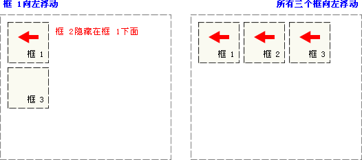

# float 浮动

## 为什么需要浮动

* 如何让多个块级盒子(div)水平排列成一行？比较难，虽然转换为行内块元素可以实现一行显示，但是他们之间会有大的**空白缝隙**

* 如何实现两个盒子的左右对齐？

总结：有很多的布局效果，标准流没有办法完成，此时就可以利用浮动完成布局。 因为**浮动可以改变元素标签默认的排列方式**，浮动最典型的应用就是**让多个块级元素一行内排列显示**


## 什么是浮动

float 属性用于**创建浮动框**，**将其移动到一边**，**直到左边缘或右边缘触及 包含块 或 另一个浮动框 的边缘**。

```css
选择器 { 
  float: 属性值; 
}
```

| 值      | 描述                                                 |
| :------ | :--------------------------------------------------- |
| left    | 元素向左浮动。                                       |
| right   | 元素向右浮动。                                       |
| none    | 默认值。元素不浮动，并会显示在其在文本中出现的位置。 |
| inherit | 规定应该从父元素继承 float 属性的值。                |

图例

- 当框 1 向左浮动时，它脱离文档流并且向左移动，直到它的左边缘碰到包含框的左边缘，覆盖框2

- 如果把三个框都向左浮动，那框1向左浮动直到碰到包含框，另外两个框向左浮动直到碰到前一个浮动框

    

- 如果包含框太窄，无法容纳水平排列的三个浮动元素，那么其它浮动块向下移动，直到有足够的空间；如果浮动元素的高度不同，那么当它们向下移动时可能被其它浮动元素“卡住”

    


## 浮动特性🔥

加了浮动之后的元素，会具有很多特性，需要我们掌握的：

* 脱离标准普通流的控制（浮）移动到指定位置（动），俗称**脱标**。浮动的盒子**不再保留原先的位置**，可能与标准流盒子重叠

* 如果**多个盒子都设置了浮动**，则它们会按照属性值**一行内显示（无空隙）并且顶端对齐排列**

* 任何元素都可以浮动。**不管原先是什么模式的元素**，添加浮动之后**具有行内块元素相似的特性**

    * 如果块级盒子没有设置宽度，**默认宽度和父级一样宽**，但是添加浮动后，它的**宽度根据内容来决定**🔥
    * 浮动的盒子中间是没有缝隙的，是**紧挨**着一起的
    * 行内元素可以不用转换为块级或行内块元素，直接设置宽高

* 浮动元素只会压住它下面标准流的盒子，但是**不会压住下面标准流盒子里面的文字（图片）**

    浮动之所以不会压住文字，因为浮动产生的目的**最初是为了做文字环绕效果**的。 文字会围绕浮动元素


## 清除浮动🔥

### 原因

由于**父级盒子很多情况下，不方便给高度**，但是子盒子**浮动又不占有位置**，所以由于**父级盒子高度为 0**，就影响了下面的标准流盒子。

清除浮动的本质是清除浮动元素造成的影响。如果父盒子本身有高度，则不需要清除浮动

**清除浮动之后，父级就会根据浮动的子盒子自动检测高度。父级有了高度，就不会影响下面的标准流了**

```css
选择器{
  clear: 属性值;
}
```

| 值       | 描述                                  |
| :------- | :------------------------------------ |
| left     | 在左侧不允许浮动元素。                |
| right    | 在右侧不允许浮动元素。                |
| **both** | 在左右两侧均不允许浮动元素。          |
| none     | 默认值。允许浮动元素出现在两侧。      |
| inherit  | 规定应该从父元素继承 clear 属性的值。 |

> 我们实际工作中， **几乎只用 both**

### 方法

清除浮动的策略是：**闭合浮动**，将浮动元素只限制到父元素中

清除浮动方法：

* **额外标签法也称为隔墙法**，是 W3C 推荐的做法。但是**不常用**。额外标签法会在浮动元素末尾添加一个空的标签。例如 `<div style="clear:both"></div>`，或者其他标签，如`<br style="clear:both"/>`等

    * 优点: 通俗易懂，书写方便

    * 缺点: 添加许多无意义的标签，结构化较差 

        注意: 要求这个新的空标签**必须是块级元素**。

* **父级添加:after伪元素**，是额外标签法的升级版。**给父元素添加。强烈推荐**！🔥

    ```css
    /* 写单冒号是为了兼容IE8 */
    .clearfix::after { 
      /* content是使用伪元素必须出现的 */
      content: ""; 
      /* 使用伪元素的标签必须是块级盒子 */
      display: block;
      /* 下面2行代表不看到该元素 */
      height: 0;
      visibility: hidden;
      clear: both; 
    }
    .clearfix { 
      /* IE6、7 专有 */
      *zoom: 1; 
    }
    ```

    * 优点：没有增加标签，结构更简单

    * 缺点：照顾低版本浏览器

        代表网站：百度、淘宝网、网易

* **父级添加双伪元素**，可以看作上述升级版。**给父元素添加。强烈推荐**！🔥

    ```css
    .clearfix:before,
    .clearfix:after { 
      content:"";
      /* 直接使用block，则before和after会在两行显示，不适用 */
      display:table;
    }
    .clearfix:after {
      clear:both; 
    }
    .clearfix { 
      /* IE6、7 专有 */
      *zoom:1;
    }
    ```

    * 优点：代码更简洁

    * 缺点：照顾低版本浏览器

        代表网站：小米、腾讯等

* **父级添加 overflow 属性**。可以给父级添加 `overflow` 属性，将其属性值设置为 **hidden**（常用）、 auto 或 scroll。子不教，父之过，注意是给父元素添加代码

    * 优点：代码简洁
    * 缺点：无法显示溢出的部分，会截掉


