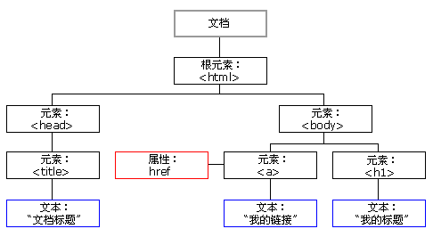

# 基础语法

## 简介

JavaScript 是一种**轻量级的脚本语言**。脚本语言指的是它不具备开发操作系统的能力，而是只用来编写控制其他大型应用程序（比如浏览器）的“脚本”。

JavaScript 也是一种**嵌入式（embedded）语言**。它提供的核心语法不算很多，只能用来做一些数学和逻辑运算。JavaScript 本身不提供任何与 I/O（输入/输出）相关的 API，都要靠宿主环境（host）提供，所以它只合适嵌入更大型的应用程序环境，去调用宿主环境提供的底层 API。目前，已经嵌入 JavaScript 的宿主环境有：**浏览器**，**Node 服务器环境**。

从语法角度看，JavaScript 语言是一种“**对象模型**”语言，还支持**函数式编程**。

JavaScript 的**核心语法**部分相当精简，只包括两个部分：

*   基本的语法构造（比如操作符、控制结构、语句）
*   标准库（就是一系列具有各种功能的对象比如`Array`、`Date`、`Math`等）

各种宿主环境提供额外的 API（即只能在该环境使用的接口），以便 JavaScript 调用。

**浏览器提供的额外 API** 可以分成三大类：

*   浏览器控制类：操作浏览器
*   DOM 类：操作网页的各种元素
*   Web 类：实现互联网的各种功能

**Node 环境**会提供操作系统的 API，比如文件操作 API、网络通信 API等等

**组成**：**ECMAScript** + **BOM** + **DOM**


## 与 HTML 组合

- **内部引入**

    ```html
    <script>  
    js代码; 
    </script>
    ```

    在HTML标签中写入``

- **外部引入**

    ```html
    <script src="js/a.js"></script>    <!--  type="text/javascript"可省略  -->
    <script src="js/b.js"></script>
    ```


::: tip

head 中定义的 JavaScript 将会在页面加载前执行，会阻塞页面加载，除非该JS需在网页全部加载完成前就可以调用，否则推荐定义在 `</body>` **闭合标签之前**

Chrome进入 Console 途径：

*   Mac：`Command + option + j`；Win：`Ctrl + Shift + j`
*   Mac：`Command + option + i`；Win：`Ctrl + Shift + i`再选择 Console 面板

:::


## 数据类型

### 定义

- `undefined`(未定义)：若变量未初始化则默认值为`undefined`或直接赋值`undefined`

- `number`(数值)：不区分整数和小数、`NaN`（not a number）。

    所有数字都是以**64位浮点数**形式储存；**位运算**只有整数才能完成，此时 JavaScript 会**自动转成32位整数**，然后运算

- `string`(字符串)：单引和双引都可以

- `boolean`(布尔)：true和false

- `null`(空)：即此处的值为空。一个对象为空的占位符或直接赋值`null`

    `typeof null`返回`Object`，JS最初的错误被ECMAScript沿用。现在 null 被认为是对象的占位符，从而解释了该矛盾

- `object`(对象)：各种值组成的集合，可以分成三个子类型

    - `object`(狭义的对象)
    - `array`(数组)
    - `function`(函数)

::: tip

ES5 只有 6 种，ES6 即 ECMAScript 2015 添加了一种`Symbol`

通常`number`、`string`、`boolean`这三种类型，合称为**原始类型（primitive type）的值**，即它们是最基本的数据类型，不能再细分了。对象则称为**合成类型（complex type）的值**，因为一个对象往往是多个原始类型的值的合成，可以看作是一个存放各种值的容器。

:::

::: danger 注意小数的计算精度

```js
console.log(0.1 + 0.2 === 0.3); // false
console.log(0.3 / 0.1); // 2.9999999999999996
console.log(0.3 - 0.2 === 0.2 - 0.1); // false
```

:::


### 判断值的类型

JavaScript 有三种方法，可以确定一个值到底是什么类型。

-   `typeof`运算符

    ```js
    console.log(typeof undefiend); // undefiend，用来检查一个没有声明的变量，而不报错。
    console.log(typeof 123); // number
    console.log(typeof "123"); // string
    console.log(typeof false); // boolean
    console.log(typeof null); // object
    console.log(typeof {}); // object
    console.log(typeof [1]); // object
    console.log(typeof function name(params) {}); // function
    ```

-   `instanceof`运算符，面向对象使用

-   `Object.prototype.toString`方法


## 变量

弱类型，**区分大小写**，但是变量一般都用小写字母开头的驼峰表示法表示

**全局变量**：在**script标签里面**定义一个变量，这个变量在页面中js部分都可以使用

1. 在任何**方法之外**放置的var语句；`var foo = value;`
2. 给**全局对象**添加一个**属性**：`windows.foo = value;`
3. 直接**使用未经声明**的变量(隐式全局变量)：`foo = value;`，不建议使用

**局部变量**：ES6之前在**函数内部**定义一个变量，只能在方法内部使用：`var foo = value;`，其他查看作用域和闭包章节。

**声明的提升**：详细查看“作用域和闭包中声明的提升章节”，

```javascript
//原本语句如下：
console.log(a); //不会报错，会输出undefined
var a = 1;

//真正运行的代码如下：
var a;
console.log(a); //会输出undefined，表示a已经声明，但为赋值
a = 1;
```


## 常量

ES6添加。使用`const`定义，采取**全大写并用下划线分割**。**值不可改**变！


## 运算符

### 赋值运算符

`=`、`+=`、`-=`


### 一元运算符

`++`(自增)、`--`(自减)、`+`(正号，二元运算时可做拼接字符串)、`-`(负号)

注意：在JS中，一元运算符如果**运算数不是运算符所要求的类型**，那么js引擎会**自动的将运算数进行类型转换**。

*   `string`转`number`：**按照字面值转换**。如果字面值不是数字，则转为**NaN**（不是数字的数字）
*   `boolean`转`number`：`true`转为**1**，`false`转为**0**


### 三元运算符

`表达式? 值1:值2;`


### 算术运算符

`+`、`-`、`*`、`/`、`%`（取余，余数趋于0）、`**`（指数操作，如2^2=4）


### 比较运算符

`>`、`<`、`>=`、`<=`、`==`、`===`(**全等于**)，比较方式如下：

- **类型相同**：**直接比较**
    - 字符串：按照**字典顺序**(ASCII)比较。按位逐一比较，直到得出大小为止。
- **类型不同**：先进行**类型转换**，再比较
    - `==`：比较的只是值（会执行类型转换）
    - `===`：**全等于**。在比较之前，**先判断类型**，如果类型**不一样**，则直接**返回false**

```js
console.log(undefined == null); // true
console.log(undefined === null); // false
```


### 逻辑运算符

`&&`、`||`、`!`

JS 中代表 `false`的值有（对应数据类型即可记忆）：`undefined`, `NaN`,  `0`, `""`, `false`, `null`

其他类型转`boolean`

- `number`：`0`或`NaN`为假，其他为真
- `string`：除了空字符串(`""`)，其他都是`true`。注意空格占位的不是空字符串
- `null`&`undefined`：都是`false`
- 对象：所有对象都为`true`。判断空指针异常（若是字符串都不用判断长度）时直接写`if(obj)`

```js
console.log(true && "hello");// hello
console.log(false || "default"); // default，可用于默认值
console.log(1 + 2 || "default"); // 3
console.log(!4); // false
console.log(!!4); // true
```


### 位运算符

`&`、`|`、`~`、`^`，转为32位二进制补码进行计算

```js
console.log(5 & 3); //1
console.log(5 | 3); //7
console.log(~5); // -6
console.log(5 ^ 3); //6
```


### 位移运算符

**位移运算符**：**不改变原变量数值**。输入输出都是对**整数类型的二进制补码**进行的运算！如下解释以及画图时也应用补码来解释！

-   `<<`左移，被移除的高位丢弃，低位空缺位补0。当顶替掉符号位时数值正负改变。
-   `>>`右移，被移位的二进制最高位是0，右移后所有空缺位补0；最高位是1，所有空缺位补1。
-   `>>>`无符号右移，使用“零扩展”（zero extension），即被移位二进制最高位无论是0或者是1，空缺位都用0补。C/C++ 没有


## 流程控制

- if...else...(同Java)
- while...、do...while...(同Java)
- **switch case default**
    - Java中`switch`可以接收的数据类型：`byte`、`short`、`char`、`int`、`Enum`(1.5) 、`String`(1.7)
    - JavaScript中`switch`可以接收**任意**的**原始数据类型**
    - 都有 break 关键字
- **for**：var定义的变量不是局部变量，无论布尔表达式是否满足，**步进表达式都会执行**。所以可以用let来来限制作用范围。
    - `for...in`：遍历**数组**或者**对象**的**属性**：`for (变量 in 对象)`
    - `for...of`：遍历`iterable`类型，如`Array`、`Map`和`Set`的**值**，`for (变量 of 对象)`
- 跳出循环：（`break`、`continue`只针对最内层循环）
    - `break`语句用于跳出代码块或循环
    - `continue`语句用于立即终止本轮循环，返回循环结构的头部，开始下一轮循环
    - `label`标签通常与`break`语句和`continue`语句配合使用，跳出特定的循环
    - `return`虽然也可以跳出，但是通常用来返回方法


## 111


### 3.2.5 基本类型的包装对象

- String

    - 创建对象`var str = "abc";`
    - 属性：`length`，字符串长度
    - **方法：**

    1. **与html相关的方法**
        - `bold()`：加粗
        - `fontcolor()`: 设置字符串的颜色
        - `fontsize()`: 设置字体的大小
        - `link()`: 将字符串显示成超链接 `str4.link("hello.html")`
        - `sub()` `sup()`: 下标和上标
    2. **与Java相似的方法**
        - `concat()`: 连接字符串
        - `charAt()`:返回指定指定位置的字符串，若字符位置不存在，返回空字符串
        - `indexOf()`：返回字符串位置
        - `split()`：切分字符串，成数组
        - `replace()`：替换字符串，传递两个参数：原始字符、要替换成的字符
        - `substr()`：从第几位开始，向后截取几位
        - `substring()`：**[**从第几位开始，到第几位结束**)**

- Boolean：`var flag = new Boolean(true);`，不传值时默认为`false`


### 3.2.7 Global

- 特点：**全局对象**，这个Global中封装的方法不需要对象就可以`方法名();`**直接调用**。  

- 方法：

    - `encodeURI()`：对字符进行url编码，返回另一个字符。不编码字符有82个

    - `decodeURI()`：对字符进行url解码，返回另一个字符

    - `encodeURIComponent()`：对字符进行url编码，编码的字符更多。不编码字符有71个

    - `decodeURIComponent()`：对字符进行url解码

    - `parseInt()`：将字符串转为数字；进制转换
        ​    * 逐一判断每一个字符是否是数字，直到不是数字为止，**将前边数字部分**转为number，第一个也不是数字则为NaN
        ​    * `parseInt('11',2)`，返回3

        - `isNaN()`：判断一个值是否是NaN
            - NaN六亲不认，连自己都不认。NaN参与的`==`比较全部返回`false`

    - `eval()`：==将JavaScript字符串，作为脚本代码来执行==，若字符串不是脚本代码则不执行

        ```javascript
        var str = "alert('1234');";
        alert(str);    //alert('1234');
        eval(str);    //1234
        ```

### Base64

使用场景

*   **文本**里面包含一些**不可打印的符号**，比如 ASCII 码0到31的符号，可以使用 Base64 编码转成可以打印的字符。
*   需要**以文本格式传递二进制数据**，那么也可以使用 Base64 编码。

所谓 Base64 就是一种编码方法，可以将任意值转成 0～9、A～Z、a-z、`+`和`/`这64个字符组成的可打印字符。使用它的主要目的，不是为了加密，而是为了不出现特殊字符，简化程序的处理。JS提供了如下全局函数

-   `btoa()`：任意值转为 Base64 编码
-   `atob()`：Base64 编码转为原来的值

```js
var str = "hello world";
console.log(btoa(str)); // aGVsbG8gd29ybGQ
console.log(atob("aGVsbG8gd29ybGQ")); // hello world
```

注意，这两个方法**不适合非 ASCII 码的字符**，如中文字符，会报错。要将非 ASCII 码字符转为 Base64 编码，必须中间插入一个**URL转码**环节，JS提供如下全局函数，再使用这两个方法

```js
function b64Encode(str) {
  return btoa(encodeURIComponent(str));
}

function b64Decode(str) {
  return decodeURIComponent(atob(str));
}

console.log(b64Encode("你好")); // "JUU0JUJEJUEwJUU1JUE1JUJE"
console.log(b64Decode("JUU0JUJEJUEwJUU1JUE1JUJE")); // "你好"
```


- 
- URL编码
- 传智播客 =  %E4%BC%A0%E6%99%BA%E6%92%AD%E5%AE%A2


## 3.3 BOM

> BOM(browser object model)：浏览器对象模型。对象(首字母大写)的引用有如下：

- ==**window**==

    - **全局对象**（直接使用属性、方法）

    - **属性：**

        - ==**可以获取其他BOM对象**==：navigator、location、history、screen等
        - ==**可以获取DOM对象**==
        - **`opener`：返回对创建此窗口的窗口的引用** 

    - **方法：**(可以不带window)

        - `alert()`：显示带有一段**消息**和一个**确认按钮**的警告框。一般调试还是用**`console.log()`**

        - **`confirm()`**：带有一段**消息**以及**确认、取消按钮**的对话框。返回`boolean`：`window.confirm("确认删除？"); `

        - `prompt()`：显示可**提示用户输入**的对话框：`prompt("输入您的年龄",0); `

        - **`open()`**：打开一个新的窗口，并**返回此对象**：`window.open(URL,name,features,replace)`，都是可选参数

        - **`close()`**：关闭窗口

- ==**location**==：当前URL信息
- 属性
        - **`href`**：设置或返回完整的 URL：`location.href="https://www.baidu.com"`
        - `search`：设置或返回从？开始的URL（即查询部分）
    - 方法
        - **`reload()`**：**重新加载**当前文档
- ==**history**==：包含用户（在**浏览器窗口中**）访问过的 URL，不是历史记录

    - 属性：
        - `length`：返回当前窗口历史列表中的 **URL 数量**
    - 方法
        - `back()`：加载 history 列表中的**前一个** URL
        - `forward()`：加载 history 列表中的**下一个** URL
        - `go(number | URL)`：加载 history 列表中的某个**具体**页面。`go(-1);`、`go(1);`等同于上述方法，可以传其他值
- navigator： 浏览器的信息`document.write(navigator.appName);//浏览器名称`
- screen：客户端显示屏幕的信息   `document.write(screen.width+"*"+screen.height);`


## 3.4 DOM

> DOM(document object model)：将标记语言**文档**的各个组成部分，封装为**对象**。可以使用这些对象，对标记语言文档进行CRUD的动态操作

- W3C DOM 标准被分为 3 个不同的部分：

    - **核心 DOM** - 针对任何结构化文档的标准模型
        - **Node**：原生节点对象，以下节点对象都继承于此
        - **Document**：文档对象，整个文档树的顶层节点
        - DocumentType：`doctype`标签（比如`<!DOCTYPE html>`
        - **Element**：元素对象，网页的各种HTML标签（比如`<body>`、`<a>`等）
        - **Attribute**：属性对象，网页元素的属性（比如`class="right"`）
        - **Text**：文本对象，标签之间或标签包含的文本
        - Comment：注释对象
        - DocumentFragment：文档的片段
    - XML DOM - 针对 XML 文档的标准模型
    - **HTML DOM** - 针对 HTML 文档的标准模型

- 解析过程：根据html的层级结构，在内存中分配一个树形结构，需要把html中的每部分封装成对象

    

### 3.4.1 Node

> 节点对象，其他对象的父对象。所有dom对象都可以被认为是一个节点

- 属性：

    - `nodeType`：一个整数值表示==**节点的类型**==。如Element为1、Attribute为2、Text为3、Document为9
    - `nodeName`：**节点的名称**。如Element为大写标签名、Attribute为属性名、Text为`#text`、Document为`#document`
    - `nodeValue`：一个字符串，表示**当前节点**本身的**文本值**。只有Attribute、Text、Comment有值，其余返回`null`
    - `textContent `：**当前**节点和它的**所有后代**节点的==**所有文本内容**==，自动**忽略**当前节点内部的 **HTML 标签**
    - `baseURI`：一个字符串，表示当前网页的绝对路径
    - `ownerDocument`：当前节点所在的顶层文档对象，document本身的这个属性为`null`。与`getRootNode()`一样作用
    - `previousSiblin `：当前节点==**前**==面的、距离最近的一个**同级节点**，没有同级节点则返回`null`
    - `nextSibling`：紧跟在当前节点==**后**==面的第一个**同级节点**，没有同级节点则返回`null`
    - **`parentNode`**：==当前节点的**父节点**==，可能有三种类型，如Document、Element、DocumentFragment
    - `parentElement`：当前节点的**父元素节点**，排除了上述类型中首尾两个

- 方法(CRUD DOM树)：

    - **`appendChild(newNode)`**：==将其作为**最后一个子节点**，**插入**当前节点==。若`newNode`为DOM中已存在的，相当于**剪贴**
    - `insertBefore(newNode,oldNode)`：节点之前插入一个新的节点，没有insertAfter()方法可以结合`nextSibling`实现
    - `removeChild(Node)`：通过父节点删除指定子节点，并返回被删除的节点。不存在DOM中，但在内存中仍可使用
    - `replaceChild(newNode,oldNode)`：通过父节点用新节点替换一个子节点
    - **`cloneNode(boolean b)`**：**复制节点返回新节点**，boolean表示**是否复制子节点**，会丧失该节点上的事件回调函数

- > `childNodes `：当前节点的所有子节点的`NodeList`集合，但是包括Text、Commnet！空格之类的都包括！别用！
    >
    > `hasChildNodes()`：当前节点是否有子节点，也是包括所有类型节点！空格也算！别用！

#### 1 NodeList 接口（了解）

- `NodeList`实例是一个类似数组不是数组的对象，它的成员是节点对象。通过以下方法可以得到`NodeList`实例
    - `Node.childNodes`：说了别用！省的没注意空格！
    - `document.querySelectorAll()`等节点搜索方法
- 属性：
    - `length`，NodeList 实例包含的节点数量
- 方法：
    - `forEach`，也可以使用for循环。没pop、pust等方法哦！
    - `item(index)`：接受一个整数值作为参数，表示成员的位置，返回该位置上的成员。
- 。。。懒得看了

#### 2 HTMLCollection 接口（了解）

- `HTMLCollection`是一个节点对象的集合，只能包含元素节点（element），不能包含其他类型的节点。它的返回值是一个类似数组的对象，但是与`NodeList`接口不同，`HTMLCollection`没有`forEach`方法，只能使用`for`循环遍历
- 返回`HTMLCollection`实例的，主要是一些`Document`对象的集合属性，比如`document.links`、`docuement.forms`、`document.images`、`document.styleSheets`、`document.scripts`等
- `HTMLCollection`实例都是动态集合，节点的变化会实时反映在集合中
- 属性
    - `length`：返回`HTMLCollection`实例包含的成员数量
- 方法
    - `item()`：接受一个整数值作为参数，表示成员的位置，返回该位置上的成员
    - `namedItem()`：参数是一个字符串，表示`id`属性或`name`属性的值，返回对应的元素节点。如果没有则返回`null`

#### 3 ParentNode 接口

- 只有元素节点（element）、文档节点（document）和文档片段节点（documentFragment）拥有子节点，因此只有这三类节点会继承`ParentNode`接口
- 属性
    - `children`：返回一个`HTMLCollection`实例，成员是当前节点的所有**元素子节点**。该属性只读。
    - `firstElementChild`：当前节点的第一个元素子节点。如果没有任何元素子节点，则返回`null`
    - `lastElementChild`：当前节点的最后一个元素子节点，如果不存在任何元素子节点，则返回`null`
    - `childElementCount`：返回一个整数表示当前节点的所有元素子节点的数目。如果不包含任何元素子节点则返回`0`
- ==方法（如下方法都没有返回值）==
    - **`append()`**：为当前节点的最后一个元素子节点后追加**一个或多个子节点**。可以添加元素子节点、文本子节点
    - **`prepend()`**：为当前节点的的第一个元素子节点前追加**一个或多个子节点**。同append()方法
        - 若是若`newNode`为DOM中已存在的，相当于**剪贴**

#### 4 ChildNode 接口

- 如果一个节点有父节点，那么该节点就继承了`ChildNode`接口
- ==方法（都是本节点调用方法）==
    - `remove()`：==用于从父节点**移除当前节点**，**自己调用删除自己**！因为已知本节点有父节点==
    - `before()`：当前节点的**前**面，插入**一个或多个**同级节点，两者拥有相同的父节点。可以插入元素节点、文本节点
    - `after()`：在当前节点的**后**面，插入**一个或多个**同级节点，两者拥有相同的父节点。同before()方法
    - `replaceWith()`：使用参数节点，**替换**当前节点。参数可以是元素节点，也可以是文本节点

### 3.4.2 Document

- 获取：在html dom模型中可以使用`window`对象来获取，也可以省略。**继承了Node、ParentNode等接口**

- **方法：**

    - **write**()：向页面输出变量（值）、html代码
    - 获取Element对象（**除了`~ById()`，以下方法还可以用在`Element`对象上**）
        - **`querySelector()`**：CSS选择器为参数，如果有多个节点满足匹配条件，则返回**第一个匹配的节点**，没有返回null
        - **`querySelectorAll()`**：返回一个`NodeList`对象，包含**所有匹配给定选择器的节点**。用法同上
            - 【注意】不支持CSS伪元素选择器和伪类选择器
        - **`getElementById("id")`**：id属性获取一个**元素对象**，效率比querySelector()根据ID获取对象高
        - **`getElementsByClassName("className")`**：标签的class的属性值得到元素集合（**`HTMLCollection`实例**）
        - **`getElementsByTagName("tagName")`**：标签名称得到元素集合（**`HTMLCollection`实例**）
        - **``getElementsByName("name")``**：标签的name属性值得到元素集合（**`NodeList`实例**），radio、checkBox等
            - 只有一个标签时通过`document.getElementsBy(Tag/Class)Name("input")[0]`获取元素对象
    - 创建其他DOM对象
        - **`createElement("元素名称")`**：创建**元素节点**，参数为tagName属性，对HTML不区分大小写，但不能加尖括号
        - **`createTextNode("文本内容")`**：创建**文本节点**，可以在内容中添加标签。不能对属性赋值，不会转义单双引
        - `createAttribute(name)`：创建拥有指定名称的属性节点，并返回新的 Attr 对象。通过Node来设置属性
        - `createComment()`：创建注释节点

    【注意】由于我们现在访问的是本地文件，js安全性，谷歌浏览器安全级别很高，不允许访问本地文件。在实际开发中，没有这样的问题，实际中不可能访问本地的文件。

### 3.4.3 Element

- 获取：通过`document`来获取和创建
- 属性
    - **`innerHTML`**：返回一个字符串，等同于**该元素包含的所有 HTML 代码**，该属性**可读写**。用来设置某个节点的内容
    - `innerText`：同上，但是只显示文本代码，不带标签的！！，设置内容也不会解析为HTML
    - `textContent`：显示文本或插入的是文本时使用来替代上面方法。原样显示，不像上面方法会转为`&**;`来显示
    - `value`：代表的是元素的value属性，一般用于**`input`标签值的获取**，**`select`**标签值也可以使用
    - `style`：用来读写该元素的行内样式信息，配合CSS。如display可取值none、block、inner
        - 也可以**提前定义好**类选择器的样式，通过元素的`className`属性来设置其`class`属性值。
- **方法：**
    - **`getAttribute("name")`**：获取属性里面的值
    - **`setAttribute("name","value")`**：设置属性的值
    - **`removeAttribute("name")`**：删除属性，**不能删除value属性**
- **获取标签下面的子标签**的唯一有效办法，使用父节点**`getElementsByTagName()`**方法，不使用childNodes属性


### 3.4.5 Event

Event Handlers：

- **点击事件**

    - **`onclick`**：点击事件(按钮) 
    - **`ondblclick`**：双击事件

- **焦点事件**(表单校验)

    - **`onfocus`**：组件获得焦点事件(输入框/单选/多选/下拉) ，光标闪动
    - **`onblur`**：组件失去焦点事件(输入框/单选/多选/下拉) 

- **改变事件**

    - **`onchange`：域的内容改变**/选择的值发生变化事件(输入框/下拉) 
    - **`onselect`**：文本被选中

- **表单事件**

    - **`onsubmit`**：表单提交按钮按下时触发的事件(**表单校验**)**在form后注册函数，有返回值true/false**，控制提交与否

        必须写`return 函数名`否则不能获取到返回的boolean值

    - **`onreset`**：重置按钮按下时

- **加载事件**

    - **`onload`**：文档被浏览器**加载**时触发，**只能写一次**；一般在body标签中注册函数；或用window来调用。此时**可以操作DOM元素**。

        ```javascript
        window.onload = function () {
            document.getElementById("btn").onclick = function () {
                alert("haha");
            }
        }
        ```

- **鼠标事件**

    - **`onmouseover()`**：鼠标移动到组件上时触发
    - **`onmouseout`**：鼠标移出组件时触发
    - **`onmousemove`**：鼠标移动就触发
    - **`onmousedown`**：鼠标按键按下时触发
        - 定义方法时，定义一个形参来接收`event`对象，它的`button`属性可以获取鼠标哪个按钮被点击(0，1，2)
    - **`onmouseup`**：鼠标按键松开时触发

- 键盘事件

    - `onkeydown`：某个键盘按键被按下
    - `onkeyup`：某个键盘按键被松开
    - `onkeypress`：某个键盘按键被按下并松开

其他的查看W3C中Event对象吧


## 3.5 案例

### 3.6.1 动态显示时间

```javascript
let ele = document.getElementById("h1");
function setTime() {
    let s = new Date().toLocaleString();
    ele.innerText = s;
}
setInterval(setTime,1000);
```

### 3.6.2 轮播图(正常不这么做)

```javascript
var i = 1;
function changeImg () {
    i++;
    if ( i > 3 )
        i = 1;
    document.getElementById("img1").src = "img/" + i + ".jpg";
}
setInterval(changeImg, 5000);
```

### 3.6.3 定时弹出广告(style.display)

```javascript
showTime = setTimeout(showAd, 3000);//定义为全局变量

function showAd() {
    document.getElementById("adImg").style.display = "block";
    clearTimeout(showTime);
    hiddenTime = setTimeout(hiddenAd, 3000);
}

function hiddenAd() {
    document.getElementById("adImg").style.display = "none";
    clearTimeout(hiddenTime);
}
```

### 3.6.4 动态增删表格

```javascript
document.getElementById("btn").onclick = function () {
    let id = document.getElementById("id").value;
    let name = document.getElementById("name").value;
    let sex = document.getElementById("sex").value;
    //thead
    let tbd = document.getElementsByTagName("thead")[0];

    document.getElementById("btn").onclick = function () {
        let id = document.getElementById("id").value;
        let name = document.getElementById("name").value;
        let sex = document.getElementById("sex").value;
        
        let thd = document.getElementsByTagName("thead")[0];

        thd.innerHTML += "<tr>\n" +
            "        <td>" + id + "</td>\n" +
            "        <td>" + name + "</td>\n" +
            "        <td>" + sex + "</td>\n" +
            "        <td><a href=\"javascript:void(0);\" onclick=\"delTr(this);\" >删除</a></td>\n" +
            "    </tr>";
        //使用方法一个个添加也行，但是麻烦

    }
    function delTr(obj) {
        var parentNode = obj.parentNode.parentNode.parentNode;
        var deleteNode = obj.parentNode.parentNode;
        parentNode.removeChild(deleteNode);
    }
}
```

### 3.6.5 全选/全不选/反选/高亮

```javascript
let inputs = document.getElementsByClassName("check-box");
//全选
document.getElementById("selectAll").onclick = function () {
    for (let i in inputs) {
        inputs[i].checked = true;
    }
}
//全不选
document.getElementById("notSelect").onclick = function () {
    for (let i in inputs) {
        inputs[i].checked = false;
    }
}
//反选
document.getElementById("reverseSelect").onclick = function () {
    for (let i in inputs) {
        inputs[i].checked = !inputs[i].checked;
    }
}
//左上角选择
document.getElementById("ck1").onclick = function () {
    for (let i in inputs){
        inputs[i].checked = this.checked;
    }
}
//表格行高亮
let trs = document.getElementsByTagName("tr");
for (let t in trs){
    trs[t].onmouseover = function () {
        this.style.backgroundColor = "gray";
    }
    trs[t].onmouseout = function () {
        this.style.backgroundColor = "white";
    }
}
```

### 3.6.6 表单校验

```javascript
window.onload = function () {
    //表单校验
    document.getElementById("form").onsubmit = function () {
        return checkUsername();//可添加密码校验
    }
    document.getElementById("username").onblur = checkUsername;//可添加密码校验
   
}
//用户名校验
function checkUsername() {
    var username = document.getElementById("username").value;
    var reg = /^\w{6,12}$/;
    let flag = reg.test(username);
    if (flag) {
        document.getElementById("usernameSpan").innerHTML = "✔";
    } else {
        document.getElementById("usernameSpan").innerHTML = "用户名格式有误";
    }
    return flag;
}
//可添加密码校验等等
。。。。。
```

### 3.6.7 左右列表

- select、option、multiple、selected=true/false、appendChild()剪贴的length变化

```javascript
var left = document.getElementById("left");
var leftlist = left.getElementsByTagName("option");
var right = document.getElementById("right");
var rightlist = right.getElementsByTagName("option");

var toRight = function () {
    for (let i = 0; i < leftlist.length; i++) {
        if (leftlist[i].selected) {
            right.appendChild(leftlist[i]);
            i--;
        }
    }
}
var allToRight = function () {
	for (let i = 0; i < leftlist.length; i++) {
		right.appendChild(leftlist[i]);
		i--;
	}
}
```

### 3.6.8 表格隔行换色(tBodies、rows)

```javascript
//这样也可以获得行数
//var tbody = document.getElementsByTagName("tbody")[0];
//var rows = tbody.getElementsByTagName("tr").length;

var tb = document.getElementById("table1");
var rows = tb.tBodies[0].rows.length;
for (let i = 0; i < rows; i++) {
    if (i % 2 === 0) {
        tb.tBodies[0].rows[i].style.backgroundColor = "gray";
    } else {
        tb.tBodies[0].rows[i].style.backgroundColor = "yellow";
    }
}
```

### 3.6.9 省市联动(this.value)

```javascript
let arr = [['陕西', '西安', '商洛', '延安', '安康'],
           ['河北', '石家庄', '廊坊', '秦皇岛', '雄安'],
           ['广东', '深圳', '珠海', '广州', '不知道']];

document.getElementById("sheng").onchange = function () {
    let option = document.getElementById("shi");//不能直接使用innerHTML来赋值
    option.innerHTML = "";//每次改变时要清空
    for (let i in arr) {
        if (arr[i][0] === this.value) {
            for (let j = 1; j < arr[i].length; j++) {
                option.innerHTML += "<option>" + arr[i][j] + "</option>";
            }
        }
    }
}
```


