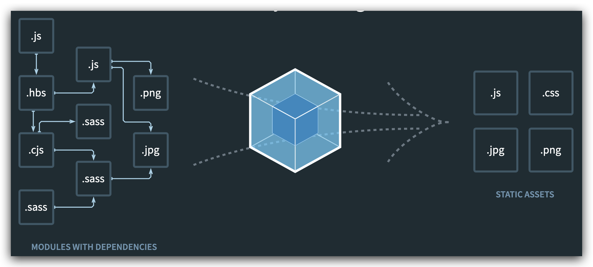
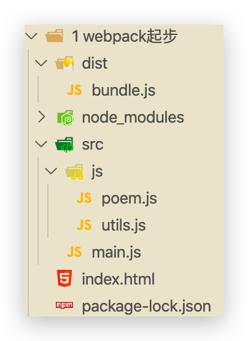
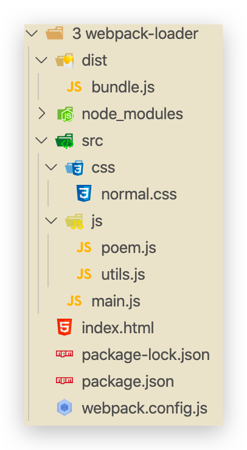

# 入门

配套的代码在 Github 中。

可查看[中文文档](https://www.webpackjs.com/)，[官方文档](https://webpack.js.org/)。注意两者区别。

## 概念

### 简介

本质上，**webpack** 是一个用于现代 JavaScript 应用程序的**静态模块打包工具**。当 webpack 处理应用程序时，它会在内部构建一个 [依赖图(dependency graph)](https://webpack.docschina.org/concepts/dependency-graph/)，此依赖图对应映射到项目所需的每个模块，并生成一个或多个 **bundle**。



**静态模块 + 打包**

*   在 ES6 之前，进行模块化开发时必须借助其他工具，如 CommonJS。通过模块化开发完项目后，还需处理模块间的依赖
*   将各模块进行打包整合，处理为大部分浏览器能识别的代码、资源


### 优缺点

#### 优点

- **模块化开发**

    程序员在开发时可以分模块创建不同的js、 css等小文件方便开发，最后使用webpack将这些小文件打包成一个文件，**减少了http的请求次数**。webpack可以实现按需打包，为了避免出现打包文件过大可以打包成多个文件。

- **编译typescript、ES6等高级js语法**

- **CSS预编译**

    webpack允许在开发中使用Sass 和 Less等原生CSS的扩展技术，通过sass-loader、less-loader将Sass 和 Less的语法编译成浏览器可识别的CSS语法。


#### 缺点

*   配置有些繁琐，文档不丰富


### 和 grunt / gulp 对比

*   grunt / gulp 核心为 Task，主要用于简单的合并、压缩。更强调前端流程的自动化、模块化不是它的核心
*   Webpack 更加强调模块化开发管理，文件合并、压缩、预处理是附带功能


## 安装

Webpack 依赖 Node，Node 会自动安装 npm。一般推荐先对项目进行`npn init`或`npm install`

### 局部安装

在 package.json 中定义 scripts 中的 webpack 命令，首先查找使用的是局部安装的 webpack，在node_modules/bin中。命令行中也是先查找项目中的 webpack。类比 DNS

```bash
cd 目录
# --save-dev 是开发时依赖，项目打包后不需要继续使用
npm install --save-dev webpack
# 或指定版本
npm install --save-dev webpack@<version>

# 安装后查看版本号，需要找到安装的目录，如 node_modules/webpack/bin，进入后
./webpack.js -v
```

```bash
npm install --save-dev webpack@3.7.0 #本地安装 Webpack 3.6.0，因为 vue cli2 依赖该版本。此处改为3.7.0是为了区分
```


### 全局安装

一般不推荐，但是在使用命令学习时每个文件夹都要局部安装的话太麻烦了

全局安装之后在终端执行 webpack 命令，就使用的是全局安装的 webpack 。注意：4.0以后的版本需要安装 webpack-cl。

本地安装只需去掉`-g`，即可在当前目录安装

```bash
npm install webpack -g
# 4.0后的版本需要安装 webpack-cl
npm install webpack-cli -g 
# 可以指定版本
npm install webpack@<version> -g #全局安装 Webpack 3.6.0，因为 vue cli2 依赖该版本。


# 安装后查看版本号
webpack -v
```

```bash
npm install webpack@3.6.0 -g #全局安装 Webpack 3.6.0，因为 vue cli2 依赖该版本。
```


## 基本使用—打包 JS

目前的项目文件结构



```html
<!DOCTYPE html>
<html lang="en">
  <head>
    <meta charset="UTF-8" />
    <meta name="viewport" content="width=device-width, initial-scale=1.0" />
    <title>Document</title>
  </head>
  <body>
    <!-- 引用的是打包后的文件。无需写type -->
    <script src="./dist/bundle.js"></script>
  </body>
</html>
```

```js
// main.js

// CommonJS
var { formatDate } = require("./js/utils.js");

console.log(formatDate(new Date()));

// ES6
import * as poem from "./js/poem.js";
console.log(poem.SPRING);
```

```js
// ./js/utils.js

function formatDate(date) {
  return `${date.getFullYear()}-${
    date.getMonth() + 1 < 10 ? "0" + (date.getMonth() + 1) : date.getMonth() + 1
  }-${date.getDate() < 10 ? "0" + date.getDate() : date.getDate()} ${
    date.getHours() < 10 ? "0" + date.getHours() : date.getHours()
  }:${date.getMinutes() < 10 ? "0" + date.getMinutes() : date.getMinutes()}:${
    date.getSeconds() < 10 ? "0" + date.getSeconds() : date.getSeconds()
  }`;
}

// CommonJS
// 可以省略掉 module
module.exports = {
  formatDate,
};
```

```js
// ./js/poem.js

const SPRING =
  "天街小雨润如酥，草色遥看近却无。最是一年春好处，绝胜烟柳满皇都。";
const SUMMER =
  "毕竟西湖六月中，风光不与四时同。接天莲叶无穷碧，映日荷花别样红。";
const AUTUMN =
  "银烛秋光冷画屏，轻罗小扇扑流萤。天阶夜色凉如水，坐看牵牛织女星。";
const WINTER = "日暮苍山远，天寒白屋贫。柴门闻犬吠，风雪夜归人。";

// ES6
export { SPRING, SUMMER, AUTUMN, WINTER };
```

执行打包命令

```bash
cd study-webpack/1 webpack起步
# 使用全局 webpack 打包
webpack ./src/main.js ./dist/bundle.js

##########
Hash: f664968929cb925ac098
Version: webpack 3.6.0
Time: 35ms
    Asset     Size  Chunks             Chunk Names
bundle.js  4.16 kB       0  [emitted]  main
   [0] /Users/conanan/Documents/VSCode/study-webpack/1 webpack起步/src/main.js 144 bytes {0} [built]
   [1] /Users/conanan/Documents/VSCode/study-webpack/1 webpack起步/src/utils.js 504 bytes {0} [built]
   [2] /Users/conanan/Documents/VSCode/study-webpack/1 webpack起步/src/poem.js 486 bytes {0} [built]
```

```bash
cd study-webpack/1 webpack起步
#使用本地 webpack 打包
./node_modules/.bin/webpack ./src/main.js ./dist/bundle.js 

##########
Hash: bf83695e4e6f3e90f28b
Version: webpack 3.7.0
Time: 35ms
    Asset    Size  Chunks             Chunk Names
bundle.js  4.2 kB       0  [emitted]  main
   [0] ./src/main.js 163 bytes {0} [built]
   [1] ./src/utils.js 516 bytes {0} [built]
   [2] ./src/poem.js 493 bytes {0} [built]
```

虽然仅仅打包了 main.js，但是 webpack 会将 main.js 所依赖的所有 js 文件都打包，且无论是 ES6 的模块化还是 CommonJS 的模块化都可以正确打包


## 配置—webpack.config.js

做到的结果是仅需执行`webpack`命令或`npm run build`命令即可做出上述复杂命令的操作

首先生成`package.json`，在执行`npm init`时指定name（最好全英文）、入口文件`main.js`（不指定也没有报错？）

在 src 和 dist 同级目录下创建`webpack.config.js`

```js
// 这个会从 node 中查找，需要 npm init 来生成 package.json。这里好像不能使用 ES6 的模块化语法
const path = require("path");

module.exports = {
  entry: "./src/main.js",
  output: {
    // path 需要写绝对路径，但又不能直接指定，可以动态获取（采用 node 语法）
    path: path.resolve(__dirname, "dist"),
    filename: "bundle.js",
  },
};
```

执行命令

```bash
cd study-webpack/2 webpack配置
# 默认先查找局部安装的 webpack
webpack

##########
Hash: bf83695e4e6f3e90f28b
Version: webpack 3.7.0
Time: 37ms
    Asset    Size  Chunks             Chunk Names
bundle.js  4.2 kB       0  [emitted]  main
   [0] ./src/main.js 163 bytes {0} [built]
   [1] ./src/utils.js 516 bytes {0} [built]
   [2] ./src/poem.js 493 bytes {0} [built]
```

如何配置执行`npm run build`即可完成上述操作呢？需要修改`package.json`

```json
{
  "name": "meetwebpack",
  "version": "1.0.0",
  "description": "",
  "main": "main.js",
  "scripts": {
    "test": "echo \"Error: no test specified\" && exit 1",
    "build": "webpack"
  },
  "author": "",
  "license": "ISC"
}
```

执行命令

```bash
cd study-webpack/2 webpack配置
npm run build

##########
> meetwebpack@1.0.0 build /Users/conanan/Documents/VSCode/study-webpack/2 webpack配置
> webpack

Hash: bf83695e4e6f3e90f28b
Version: webpack 3.7.0
Time: 35ms
    Asset    Size  Chunks             Chunk Names
bundle.js  4.2 kB       0  [emitted]  main
   [0] ./src/main.js 163 bytes {0} [built]
   [1] ./src/utils.js 516 bytes {0} [built]
   [2] ./src/poem.js 493 bytes {0} [built]
```


## loader

webpack 只能理解 JavaScript 和 JSON 文件，这是 webpack 开箱可用的自带能力。**loader** 让 webpack 能够去处理其他类型的文件，并将它们转换为有效 [模块](https://webpack.docschina.org/concepts/modules)，以供应用程序使用，以及被添加到依赖图中。

Loader 可以理解为是模块和资源的转换器，它本身是一个函数，接受源文件作为参数，返回转换的结果。这样，我们就可以通过 require 来加载任何类型的模块或文件，比如 CoffeeScript、 JSX、 LESS 或图片。首先我们需要安装相关Loader插件，**具体操作文档中写得非常详细**。

### 打包 CSS

css-loader 是将 css 装载到 javascript；style-loader 是让 javascript 认识css。

目前的项目文件结构




1.  安装 css-loader 和 style-loader

    ```bash
    npm install --save-dev css-loader style-loader
    ```

2.  修改webpack.config.js，添加 module 模块

    ```js
    // 这个会从 node 中查找，需要 npm init 来生成 package.json
    const path = require("path");
    
    module.exports = {
      entry: "./src/main.js",
      output: {
        // path 需要写绝对路径，但又不能直接指定，可以动态获取（采用 node 语法）
        path: path.resolve(__dirname, "dist"),
        filename: "bundle.js",
      },
      module: {
        rules: [
          {
            test: /\.css$/i,
            // css-loader解析css文件后，使用import加载，并返回css代码
            // style-loader 将模块导出作为style添加到DOM中
            // 使用多个loader时，从右到左加载。顺序不能乱！
            use: ["style-loader", "css-loader"],
          },
        ],
      },
    };
    ```

3.  创建 css 文件

    ```css
    /* css/normal.css */
    
    body {
      background-color: skyblue;
    }
    
    ```

4.  修改入口 main.js ，引入上面的 css 文件（若没有 loader，直接引入打包则报错）

    ```js
    // CommonJS
    var { formatDate } = require("./js/utils.js");
    
    console.log(formatDate(new Date()));
    
    // ES6
    import * as poem from "./js/poem.js";
    console.log(poem.SPRING);
    
    // CommonJS 语法，不能使用 ES6，那是针对 JS 的
    require("./css/normal.css");
    ```

5.  重新打包`webpack`或`npn run build`

6.  访问 index.html 看看背景


### 打包 less、scss、stylus

这里以 less 为例，创建文件并放入 css 目录中，引入等操作和 css 文件一样

1.  安装 less-loader（由于 webpack 的版本较低，是3.6.0或3.7.0，目前已经出了5.0了，这里less-loader版本也需要降低）

    ```bash
    npm install --save-dev less-loader less
    ```

    卸载高版本 less-loader，重新安装指定版本的（我也是服了，没找到哪写了版本高）

    ```bash
    npm uninstall less-loader 
    npm install less-loader@4.1.0 --save-dev         
    ```

2.  修改webpack.config.js，添加 module 模块

    ```js
    // 这个会从 node 中查找，需要 npm init 来生成 package.json
    const path = require("path");
    
    module.exports = {
      entry: "./src/main.js",
      output: {
        // path 需要写绝对路径，但又不能直接指定，可以动态获取（采用 node 语法）
        path: path.resolve(__dirname, "dist"),
        filename: "bundle.js",
      },
      module: {
        rules: [
          {
            // 匹配.css文件
            test: /\.css$/i,
    
            // style-loader 将模块导出作为style添加到DOM中
            // css-loader解析css文件后，使用import加载，并返回css代码
            // 使用多个loader时，从右到左加载。顺序不能乱！
            use: ["style-loader", "css-loader"],
          },
          {
            test: /\.less$/,
            use: [
              {
                loader: "style-loader", // creates style nodes from JS strings
              },
              {
                loader: "css-loader", // translates CSS into CommonJS
              },
              {
                loader: "less-loader", // compiles Less to CSS
              },
            ],
          },
        ],
      },
    };
    ```

3.  创建 less 文件，并在入口文件 main.js 中引入

    ```less
    // css/special.less
    
    @fontSize: 50px;
    @fontColor: orange;
    
    body {
      font-size: @fontSize;
      color: @fontColor;
    }
    ```

    ```js
    // main.js
    
    // CommonJS
    var { formatDate } = require("./js/utils.js");
    
    console.log(formatDate(new Date()));
    
    // ES6
    import * as poem from "./js/poem.js";
    console.log(poem.SPRING);
    
    // CommonJS 语法，不能使用 ES6，那是针对 JS 的
    require("./css/normal.css");
    require("./css/special.less");
    document.writeln("World");
    ```

4.  HTML文件

    ```html
    <!DOCTYPE html>
    <html lang="en">
      <head>
        <meta charset="UTF-8" />
        <meta name="viewport" content="width=device-width, initial-scale=1.0" />
        <title>Document</title>
      </head>
      <body>
        <p>Hello</p>
        <!-- 引用的是打包后的文件。无需写type -->
        <script src="./dist/bundle.js"></script>
      </body>
    </html>
    ```

5.  重新打包`webpack`或`npn run build`

6.  访问 index.html 看看字体及颜色


### 打包图片

1.  安装 url-loader，file-loader（当图片大小大于limit时使用）

    ```bash
    npm install --save-dev url-loader
    npm install --save-dev file-loader
    ```

2.  修改webpack.config.js，添加 module 模块

    ```js
    // 这个会从 node 中查找，需要 npm init 来生成 package.json
    const path = require("path");
    
    module.exports = {
      entry: "./src/main.js",
      output: {
        // path 需要写绝对路径，但又不能直接指定，可以动态获取（采用 node 语法）
        path: path.resolve(__dirname, "dist"),
        filename: "bundle.js",
        // 输出涉及url时，会自动在前面添加该字符串。实际中，会把所有文件都打包到 dist 中，此时应该删掉publicPath配置
        publicPath: "dist/",
      },
      module: {
        rules: [
          {
            // 匹配.css文件
            test: /\.css$/i,
    
            // style-loader 将模块导出作为style添加到DOM中
            // css-loader解析css文件后，使用import加载，并返回css代码
            // 使用多个loader时，从右到左加载。顺序不能乱！
            use: ["style-loader", "css-loader"],
          },
          {
            test: /\.less$/,
            use: [
              {
                loader: "style-loader", // creates style nodes from JS strings
              },
              {
                loader: "css-loader", // translates CSS into CommonJS
              },
              {
                loader: "less-loader", // compiles Less to CSS
              },
            ],
          },
          {
            test: /\.(png|jpg|gif|jpeg)$/,
            use: [
              {
                loader: "url-loader",
                options: {
                  // 当图片大小小于 limit 时，会被编译为base64字符串
                  // 当大于 limit 时，会使用 file-loader 进行加载，仅需要安装！
                  limit: 10000,
                  // img/目录下，[name]为原名，[hash:8]为8位哈希值，.[ext]为后缀
                  name: "img/[name][hash:8].[ext]",
                },
              },
            ],
          },
        ],
      },
    };
    ```

3.  修改 css 中背景

    ```css
    body {
      /* background-color: skyblue; */
      background-image: url("../img/conan.jpeg");
    }
    ```

4.  重新打包`webpack`或`npn run build`

5.  访问 index.html 看看背景图片

    当图片大小小于 limit 时，会被编译为base64字符串，可以直接显示出来

    当大于 limit 时，会使用 file-loader 进行加载，且**重命名（32位哈希值）并打包到 dist 目录中**，由于**路径不对无法显示**（显示的是以 index.html 的目录为目录的路径，需要改为以dist/ 为目录的路径）。

    实际中，这种32位哈希值的文件名并不方便，且没有放入统一的目录中。实际可能会将其放入`img/[name][hash:8].[ext]`，在 loader 中配置即可

    但是**实际中，会把所有文件都打包到 dist 中，此时应该删掉publicPath配置**！

    

    

### babel

webpack 打包的 JS 文件，没有将 ES6 转为 ES5，有部分浏览器不支持，所以此时可以使用 babel

1.  安装 babel-loader 和 babel（注意此处还是根据 webpack 3.6.* 选择的版本）

    ```bash
    npm install babel-loader@7 babel-core babel-preset-es2015 --save-dev
    ```

    我就服了，文档里的配置还让安装 webpack？还失败了，还有些看不懂的配置。算了😄

2.  修改webpack.config.js，添加 module 模块

    ```js
    // 这个会从 node 中查找，需要 npm init 来生成 package.json
    const path = require("path");
    
    module.exports = {
      entry: "./src/main.js",
      output: {
        // path 需要写绝对路径，但又不能直接指定，可以动态获取（采用 node 语法）
        path: path.resolve(__dirname, "dist"),
        filename: "bundle.js",
        // 输出涉及url时，会自动在前面添加该字符串。实际中，会把所有文件都打包到 dist 中，此时应该删掉publicPath配置
        publicPath: "dist/",
      },
      module: {
        rules: [
          {
            // 匹配.css文件
            test: /\.css$/i,
    
            // style-loader 将模块导出作为style添加到DOM中
            // css-loader解析css文件后，使用import加载，并返回css代码
            // 使用多个loader时，从右到左加载。顺序不能乱！
            use: ["style-loader", "css-loader"],
          },
          {
            test: /\.less$/,
            use: [
              {
                loader: "style-loader", // creates style nodes from JS strings
              },
              {
                loader: "css-loader", // translates CSS into CommonJS
              },
              {
                loader: "less-loader", // compiles Less to CSS
              },
            ],
          },
          {
            test: /\.(png|jpg|gif|jpeg)$/,
            use: [
              {
                loader: "url-loader",
                options: {
                  // 当图片大小小于 limit 时，会被编译为base64字符串
                  // 当大于 limit 时，会使用 file-loader 进行加载，仅需要安装！
                  limit: 10000,
                  // img/目录下，[name]为原名，[hash:8]为8位哈希值，.[ext]为后缀
                  name: "img/[name][hash:8].[ext]",
                },
              },
            ],
          },
          {
            test: /\.js$/,
            // 排除
            exclude: /(node_modules|bower_components)/,
            use: {
              loader: "babel-loader",
              options: {
                presets: ["es2015"],
              },
            },
          },
        ],
      },
    };
    ```

3.  重新打包`webpack`或`npn run build`。查看 buldle.js 文件


## Vue

### 配置

1.  npm 安装 vue

    ```bash
    npm install vue --save     
    ```

    `--save`可以简写为`-S`，vue 是要在发布时也使用的，所以无需添加`-dev`

2.  使用 vue 开发，在 main.js 中

    ```js
    // CommonJS
    var { formatDate } = require("./js/utils.js");
    
    console.log(formatDate(new Date()));
    
    // ES6
    import * as poem from "./js/poem.js";
    console.log(poem.SPRING);
    
    // CommonJS 语法，不能使用 ES6，那是针对 JS 的
    require("./css/normal.css");
    require("./css/special.less");
    document.writeln("World");
    
    import Vue from "vue";
    
    const vm = new Vue({
      el: "#app",
      data: {
        message: "Hello",
      },
    });
    ```

    修改 index.html

    ```html
    <!DOCTYPE html>
    <html lang="en">
      <head>
        <meta charset="UTF-8" />
        <meta name="viewport" content="width=device-width, initial-scale=1.0" />
        <title>Document</title>
      </head>
      <body>
        <div id="app">
          {{message}}
        </div>
        <!-- 引用的是打包后的文件。无需写type -->
        <script src="./dist/bundle.js"></script>
      </body>
    </html>
    ```

3.  重新打包`webpack`或`npn run build`。访问后发现报错

    ```
    bundle.js:1344 [Vue warn]: You are using the runtime-only build of Vue where the template compiler is not available. Either pre-compile the templates into render functions, or use the compiler-included build.
    ```

    这是由于 vue 在构建时有两个版本

    *   runtime-only：代码中，不可以有任何 template，如 id="app" 那个 div
    *   runtime-compiler：代码中，可以有 template，compiler 会对其进行编译

    官网文档[解释](https://cn.vuejs.org/v2/guide/installation.html#%E5%AF%B9%E4%B8%8D%E5%90%8C%E6%9E%84%E5%BB%BA%E7%89%88%E6%9C%AC%E7%9A%84%E8%A7%A3%E9%87%8A)，修改webpack.config.js

    ```js
    // 这个会从 node 中查找，需要 npm init 来生成 package.json
    const path = require("path");
    
    module.exports = {
      entry: "./src/main.js",
      output: {
        // path 需要写绝对路径，但又不能直接指定，可以动态获取（采用 node 语法）
        path: path.resolve(__dirname, "dist"),
        filename: "bundle.js",
        // 输出涉及url时，会自动在前面添加该字符串。实际中，会把所有文件都打包到 dist 中，此时应该删掉publicPath配置
        publicPath: "dist/",
      },
      module: {
        rules: [
          {
            // 匹配.css文件
            test: /\.css$/i,
    
            // style-loader 将模块导出作为style添加到DOM中
            // css-loader解析css文件后，使用import加载，并返回css代码
            // 使用多个loader时，从右到左加载。顺序不能乱！
            use: ["style-loader", "css-loader"],
          },
          {
            test: /\.less$/,
            use: [
              {
                loader: "style-loader", // creates style nodes from JS strings
              },
              {
                loader: "css-loader", // translates CSS into CommonJS
              },
              {
                loader: "less-loader", // compiles Less to CSS
              },
            ],
          },
          {
            test: /\.(png|jpg|gif|jpeg)$/,
            use: [
              {
                loader: "url-loader",
                options: {
                  // 当图片大小小于 limit 时，会被编译为base64字符串
                  // 当大于 limit 时，会使用 file-loader 进行加载，仅需要安装！
                  limit: 10000,
                  // img/目录下，[name]为原名，[hash:8]为8位哈希值，.[ext]为后缀
                  name: "img/[name][hash:8].[ext]",
                },
              },
            ],
          },
          {
            test: /\.js$/,
            // 排除
            exclude: /(node_modules|bower_components)/,
            use: {
              loader: "babel-loader",
              options: {
                presets: ["es2015"],
              },
            },
          },
        ],
      },
      resolve: {
        alias: {
          // 指定发布的版本
          vue$: "vue/dist/vue.esm.js", // 用 webpack 1 时需用 'vue/dist/vue.common.js'
        },
      },
    };
    ```

4.  重新打包`webpack`或`npn run build`。访问


### el 和 template 区别

实际使用时，不会修改 index.html 的代码，仅仅留个 id="app" 的 div，只需要在使用 vue 时指定 template 即可，vue 内部会自动将 template 中的代码替换 id="app" 的 div（该div将不见）

```html
<!DOCTYPE html>
<html lang="en">
  <head>
    <meta charset="UTF-8" />
    <meta name="viewport" content="width=device-width, initial-scale=1.0" />
    <title>Document</title>
  </head>
  <body>
    <div id="app"></div>
    <!-- 引用的是打包后的文件。无需写type -->
    <script src="./dist/bundle.js"></script>
  </body>
</html>
```

```js
// main.js

// CommonJS
var { formatDate } = require("./js/utils.js");

console.log(formatDate(new Date()));

// ES6
import * as poem from "./js/poem.js";
console.log(poem.SPRING);

// CommonJS 语法，不能使用 ES6，那是针对 JS 的
require("./css/normal.css");
require("./css/special.less");
document.writeln("World");

import Vue from "vue";

const vm = new Vue({
  el: "#app",
  template: `
    <div>
        <h2>{{message}}</h2>
        <button @click="btnClick">按钮</button>
    </div>
    `,
  data: {
    message: "Hello",
  },
  methods: {
    btnClick() {
      alert(1);
    },
  },
});
```


### 终极使用

这个[视频](https://www.bilibili.com/video/BV15741177Eh?p=84)讲解的非常详细，一步一步

```html
<!DOCTYPE html>
<html lang="en">
  <head>
    <meta charset="UTF-8" />
    <meta name="viewport" content="width=device-width, initial-scale=1.0" />
    <title>Document</title>
  </head>
  <body>
    <div id="app"></div>
    <!-- 引用的是打包后的文件。无需写type -->
    <script src="./dist/bundle.js"></script>
  </body>
</html>
```

```js
// CommonJS
var { formatDate } = require("./js/utils.js");

console.log(formatDate(new Date()));

// ES6
import * as poem from "./js/poem.js";
console.log(poem.SPRING);

// CommonJS 语法，不能使用 ES6，那是针对 JS 的
require("./css/normal.css");
require("./css/special.less");
// document.writeln("World");

import Vue from "vue";
// 导入组件 js 文件，可省略后缀
// import App from "./vue/app";
// 导入组件 vue 文件，不可省略后缀。在 vue 文件中可以省略（但需webpack配置）
import App from "./vue/App.vue";

const vm = new Vue({
  el: "#app",
  template: "<App/>",
  components: {
    App,
  },
});
```

```vue
<!-- vue/App.vue-->
<template>
  <div>
    <h2>{{ message }}</h2>
    <button @click="btnClick">按钮</button>
    <cpn />
  </div>
</template>

<script>
// 可省略后缀（需在 webpakc 中配置）
import Cpn from "./Cpn";

export default {
  name: "App",
  components: {
    Cpn,
  },
  data() {
    return { message: "Hello" };
  },
  methods: {
    btnClick() {
      alert(1);
    },
  },
};
</script>

<style></style>
```

```vue
<!-- vue/Cpn.vue-->
<template>
  <div>
    <h2>{{ message }}</h2>
  </div>
</template>

<script>
export default {
  name: "Cpn",
  data() {
    return {
      message: "Cpn 组件！！！！！",
    };
  },
};
</script>

<style></style>
```

若修改后重新打包失败，可以安装 [Vue Loader](https://vue-loader.vuejs.org/zh/guide/#vue-cli)

```bash
npm install -D vue-loader vue-template-compiler
```

webpack.config.js

```js
// 这个会从 node 中查找，需要 npm init 来生成 package.json
const path = require("path");
const VueLoaderPlugin = require("vue-loader/lib/plugin");

module.exports = {
  entry: "./src/main.js",
  output: {
    // path 需要写绝对路径，但又不能直接指定，可以动态获取（采用 node 语法）
    path: path.resolve(__dirname, "dist"),
    filename: "bundle.js",
    // 输出涉及url时，会自动在前面添加该字符串。实际中，会把所有文件都打包到 dist 中，此时应该删掉publicPath配置
    publicPath: "dist/",
  },
  module: {
    rules: [
      {
        // 匹配.css文件
        test: /\.css$/i,

        // style-loader 将模块导出作为style添加到DOM中
        // css-loader解析css文件后，使用import加载，并返回css代码
        // 使用多个loader时，从右到左加载。顺序不能乱！
        use: ["style-loader", "css-loader"],
      },
      {
        test: /\.less$/,
        use: [
          {
            loader: "style-loader", // creates style nodes from JS strings
          },
          {
            loader: "css-loader", // translates CSS into CommonJS
          },
          {
            loader: "less-loader", // compiles Less to CSS
          },
        ],
      },
      {
        test: /\.(png|jpg|gif|jpeg)$/,
        use: [
          {
            loader: "url-loader",
            options: {
              // 当图片大小小于 limit 时，会被编译为base64字符串
              // 当大于 limit 时，会使用 file-loader 进行加载，仅需要安装！
              limit: 10000,
              // img/目录下，[name]为原名，[hash:8]为8位哈希值，.[ext]为后缀
              name: "img/[name][hash:8].[ext]",
            },
          },
        ],
      },
      {
        test: /\.js$/,
        // 排除
        exclude: /(node_modules|bower_components)/,
        use: {
          loader: "babel-loader",
          options: {
            presets: ["es2015"],
          },
        },
      },
      {
        test: /\.vue$/,
        loader: "vue-loader",
      },
    ],
  },
  resolve: {
    // 在 .vue 文件中导入如下文件时可以省略后缀
    extensions: [".js", ".vue", ".css"],
    alias: {
      // 指定发布的版本
      vue$: "vue/dist/vue.esm.js", // 用 webpack 1 时需用 'vue/dist/vue.common.js'
    },
  },
  plugins: [
    // 请确保引入这个插件！
    new VueLoaderPlugin(),
  ],
};
```

重新打包`webpack`或`npn run build`。访问


## plugin


## 快速入门


### 结合Vue打包

1. 定义`module01.js`，此文件就是一个模块，定义了一些方法

    ```js
    //定义add函数
    function add(x, y) {
        return x + y;
    }
    
    //定义add2函数
    function add2(x, y) {
        return x + y + 2;
    }
    
    //定义add3函数
    exports.add3 = function (x, y) {
        return x + y + 2;
    }
    
    //要导出的方法
    // module.exports.add = add;
    // module.exports.add2 = add2;
    module.exports = {add,add2};//多个方法这样导出更方便！或每次定义方法时导出，如add3
    ```

2. 定义`main.js`，是本程序的js主文件，名称任意取。包括如下内容：

    1. 引用`module01.js`模块
    2. 引用`vue.min.js`模块（它也一个模块）
    3. 将html页面中构建vue实例的代码放在`main.js`中（总之html中不再有js代码）

    ```js
    //如下都是ES5的导入方法！
    var {add} = require('./module01.js');//可以省略.js，但是必须带上./前缀表示当前目录！
    var module01 = require('./module01.js');//也可以全部导入
    var Vue = require('./vue.min.js');
    
    var VM = new Vue({
        el: "#app",//表示当前vue对象接管app的div区域
        data: {
            name: '黑马程序员',// 相当于是MVVM中的Model这个角色
            num1: 0,
            num2: 0,
            result: 0,
        },
        methods: {
            change: function () {
                //这里使用了导入的model01.js文件中的add方法
                this.result = module01.add2(Number.parseInt(this.num1), Number.parseInt(this.num2));
            }
        }
    });
    ```

3. 打包测试

    1. 进入程序即js文件所在目录，执行`webpack main.js build.js`，将`main.js`打包输出为`build.js`文件。也可以定义webpack.config.js配置打包方式
    2. 在HTML中引用`<script src="build.js"></script>`


### webpack-dev-server

webpack-dev-server开发服务器，它的功能可以实现热加载并且自动刷新浏览器。

1. 创建一个新的程序目录，这里我们创建`webpacktest`目录，将webpack入门程序的代码拷贝进来，并在目录下创建`src`目录、`dist`目录。将`main.js`，`module01.js`和`vue.min.js`拷贝到src目录。html文件拷贝到当前目录下。

2. 使用 webpack-dev-server需要**安装webpack**、 **webpack-dev-server**和 **html-webpack-plugin**三个包在当前程序目录

    `cnpm install webpack@3.6.0 webpack-dev-server@2.9.1 html-webpack-plugin@2.30.1 --save-dev`

    安装完成后程序目录出现**`package.json`文件**，此文件中记录了程序的**依赖信息**（上面三个）

    还有**`node_modules`文件夹**，有993个文件或文件夹！！！存放本程序所**依赖的包**！

3. **配置webpack-dev-server**，在`package.json`中配置script（运行命令），最终内容如下

    ```json
    {
      "scripts": {
        "dev": "webpack-dev-server --inline --hot --open --port 5008"
      },
      "devDependencies": {
        "html-webpack-plugin": "^2.30.1",
        "webpack": "^3.6.0",
        "webpack-dev-server": "^2.9.1"
      }
    }
    ```

    `scripts`：可执行的命令

    `--inline`：自动刷新；`--hot`：热加载；`--open`：自动在默认浏览器打开；`--port`：指定端口；

    `--host`：可以指定服务器的 ip，不指定则为127.0.0.1，如果对外发布则填写公网ip地址

    `devDependencies`：开发人员在开发过程中所需要的依赖

4. **配置`webpack.config.js`**，是webpack的配置文件，在此文件中可以配置应用的入口文件、输出配置、插件等，其中要实现热加载自动刷新功能需要配置html-webpack-plugin插件。html-webpack-plugin的作用是根据html模板在内存生成html文件，它的工作原理是**根据模板文件在内存中生成一个index.html文件**。

    1. 配置**模板文件**。将原来的`vue.html`作为模板文件，为了和内存中的`index.html`文件名区别，注意将`vue.html`中的所有`script`标签去掉

    2. 在`webpack.config.js`（与`package.json`同目录）中配置`html-webpack-plugin`插件

        ```js
        //引用html-webpack-plugin插件，作用是根据html模板在内存生成html文件，它的工作原理是根据模板文件在内存中生成一个index.html文件。
        var htmlwp = require('html-webpack-plugin');
        module.exports = {
            entry: './src/main.js',  //指定打包的入口文件
            output: {
                path: __dirname + '/dist',  // 注意：__dirname表示webpack.config.js所在目录的绝对路径
                filename: 'build.js'		   //输出文件
            },
            devtool: 'eval-source-map',//Debug调试
            plugins: [
                new htmlwp({
                    title: '首页',  //生成的页面标题<head><title>首页</title></head>
                    filename: 'index.html', //webpack-dev-server在内存中生成的文件名称，自动将build注入到这个页面底部，才能实现自动刷新功能
                    template: 'vue.html' //根据vue.html这个模板来生成(这个文件请程序员自己生成)
                })
            ]
        };
        ```

5. 运行

    - 在`webpacktest`目录，执行**`npm run dev`**。

    - 或使用webstorm，右键`package.json`文件，选择`“Show npm Scripts”`，双击dev即可

        【注意】dev就是在`package.json`中配置的`webpack-dev-server......`命令。

        启动成功自动打开浏览器。修改src中的任意文件内容，自动加载并刷新浏览器。

6. Debug调试

    使用了webpack之后就不能采用传统js的调试方法在chrome中打断点（因为打包了！内容发生变化）

    webpack提供devtool进行调试，它是基于sourcemap的方式，在调试时会生成一个map文件，其内容记录生成文件和源文件的内容映射，即生成文件中的哪个位置对应源文件中的哪个位置，有了sourcemap就可以在调试时看到源代码。

    - 在webpack.config.js中配置：`devtool: 'eval‐source‐map',`具体查看上面的代码
    - 在js中跟踪代码的位置上添加**debugger**，开启浏览器开发者工具……


