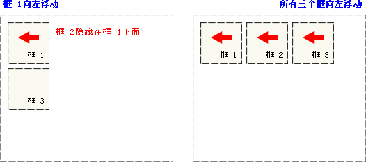

# CSS

* CSS（cascading style sheets，**层叠样式表**）：多个样式可以作用在同一个html元素上，同时生效。

* 将网页**内容和样式进行分离**

## 引入方式

### 内联样式（不推荐）

也称做行内样式、行间样式。在**每个html标签**上面都有一个 **style属性**，把css和html结合在一起，不推荐

```html
<标签名 style="属性1:属性值1; 属性2:属性值2; 属性3:属性值3;"> 内容 </标签名>
```


### 内嵌样式

将CSS代码集中写在HTML文档的 **`<head>` 头部标签中**，并且用 **`<style>` 标签定义**

* style标签一般位于head标签中，当然理论上他可以放在HTML文档的任何地方
* type="text/css"  在html5中可以省略。
* 只能控制当前的页面，没有彻底分离

```html
<head>
  <style>
    选择器（选择的标签） { 
      属性1: 属性值1;
      属性2: 属性值2; 
      属性3: 属性值3;
    }
  </style>
</head>
```


### 外链样式

将所有的样式放在一个或多个以**`.css`**为扩展名的外部样式表文件中，通过**`<link>`标签**将外部样式表文件链接到HTML文档中

* link 是个单标签
* link 标签需要放在head头部标签中，并且指定link标签的三个属性
* 可以样式共享

```html
<head>
  <link rel="stylesheet" href="css文件路径">
</head>
```

| 属性 | 作用                                                         |
| ---- | :----------------------------------------------------------- |
| rel  | 定义当前文档与被链接文档之间的关系，在这里需要指定为“stylesheet”，表示被链接的文档是一个样式表文件。 |
| href | 定义所链接外部样式表文件的URL，可以是相对路径，也可以是绝对路径。 |
| type | 定义所链接文档的类型，在这里需要指定为“text/css”，表示链接的外部文件为CSS样式表。我们都可以**省略** |

> style标签中也可以引入外部css文件，`@import "css/a.css";`或`@import url(css/a.css);`，中间有空格，不常用


### 总结

**优先级**：**相同的设置**，由上到下，由外到内，优先级由低到高。 **后加载的优先级高，**就近原则或叠加

| 样式表   | 优点                     | 缺点                     | 使用情况       | 控制范围           |
| -------- | ------------------------ | ------------------------ | -------------- | ------------------ |
| 内联样式 | 书写方便，权重高         | 没有实现样式和结构相分离 | 较少           | 控制一个标签（少） |
| 内嵌样式 | 部分结构和样式相分离     | 没有彻底分离             | 较多           | 控制一个页面（中） |
| 外链样式 | 完全实现结构和样式相分离 | 需要引入                 | 最多，强烈推荐 | 控制整个站点（多） |


## 选择器

### id 选择器

```css
#idName {属性1:属性值1; 属性2:属性值2; 属性3:属性值3; }
```


### class 选择器

```css
.className  {   
    属性1:属性值1; 
    属性2:属性值2; 
    属性3:属性值3;     
}
```


### 标签选择器

```css
标签名{属性1:属性值1; 属性2:属性值2; 属性3:属性值3; } 
```


### 通配符选择器

匹配所有元素，降低页面响应速度，不建议随便使用

```css
* { 属性1:属性值1; 属性2:属性值2; 属性3:属性值3; }
```


### 组合选择器

可以为任何选择器组合

| 组合  | 选择                                                         |
| ----- | ------------------------------------------------------------ |
| A, B🔥 | **并集选择器**（选择**所有A元素和B元素**）                   |
| A B🔥  | **后代选择器**（选择A元素里面的所有**B元素**），可能多个     |
| A > B | **儿子选择器**（选择A元素里面的所有**直接B元素**，不能为孙节点），可能多个 |
| A ~ B | **一般兄弟选择器**（AB有相同的父节点，**B**是A**之后**的**所有兄弟节点**），可能多个 |
| A + B | **相邻兄弟选择器**（AB有相同的父结点，**B**是A的**紧跟着的兄弟节点**），只能一个 |


### 属性选择器

使用场景：input标签等。值要加引号

| 属性                    | 选择                                                         |
| ----------------------- | ------------------------------------------------------------ |
| **[attr]**              | 带有以 attr 命名的属性的元素                                 |
| **[attr=value]**        | 带有以 attr 命名的，且值为"value"的属性的元素                |
| [attr~=value]           | 带有以 attr 命名的属性的元素，并且该属性是一个**以空格作为分隔的值列表**，其中至少一个值为"value" |
| [attr\|=value]          | 带有以 attr 命名的属性的元素，**属性值为“value”或是以“value-”为前缀**（"-"为连字符，Unicode编码为U+002D）开头。用来匹配语言简写代码（如zh-CN，zh-TW可以用zh作为value） |
| [attr^=value]           | 表示带有以 attr 命名的，且值是以"value"**开头**的属性的元素  |
| [attr$=value]           | 表示带有以 attr 命名的，且值是以"value"**结尾**的属性的元素  |
| [attr*=value]           | 表示带有以 attr 命名的，且值**包含**有"value"的属性的元素    |
| [attr operator value i] | 在带有属性值的属性选型选择器表达式的右括号（]括号）前添加**用空格间隔开**的字母i（或I）可以忽略属性值的大小写（ASCII字符范围内的字母） |


### 伪类选择器 `:`

添加到选择器的关键字，**指定要选择的元素的特殊状态**。`td:first-child{}`：first-child**相对的是td的父元素**

#### 链接伪类选择器🔥

* `a:link` 未被访问
* `a:visited` 已被访问
* `a:hover ` 鼠标悬浮，**常用**
* `a:active` 鼠标点击不放（按下未弹起）

注意 ⚠️

* 为了确保生效，请**按照LVHA顺序声明**（上面的顺序）

* 因为 a 标签在浏览器中有默认样式，所以必须**单独给 a 标签设置样式才能生效**
* 实际开发中就给 `a` 标签一个样式，再给 `a:hover ` 一个样式即可足够


#### 表单中伪类选择器

> 不仅仅是input标签，select之类也可以

* `input:focus` 获得焦点
* `input:checked ` 被选中


### 伪元素选择器 `::`

- 匹配处于相关的确定位置的一个或多个元素，例如每个段落的**第一个字**，或者某个元素之前生成的内容 
  - 块元素中第一行`::first-line`、块元素中第一行第一个字`::first-letter`
  - 具体查看文档


**优先级**   **style > id选择器 > class选择器 > 标签选择器**

- 有一个特别的语法可以让一条规则**总是**优先于其他规则：`border: none !important;`


## 元素显示模式


## 属性

### `font` 字体

#### `font` 组合写法🔥

```css
选择器 { 
  font: font-style  font-weight  font-size/line-height  font-family;
}
```

- 使用font属性时，必须按上面语法格式中的顺序书写，不能更换顺序，各个属性以**空格**隔开。
- 其中不需要设置的属性可以省略（取默认值），但**必须保留font-size和font-family属性**，否则font属性将不起作用。


#### `font-style`  倾斜

* `normal`正常，默认值

* `italic`斜体，推荐

* `oblique`倾斜

* `inherit`


#### `font-weight` 粗细

* `normal`400，默认值

* `bold`700

* 指定`100~900`，平时更喜欢用数字来表示加粗和不加粗


#### `font-size` 字号

可以使用相对长度单位，也可以使用绝对长度单位。

- `[length]`：设置为一个**固定的值**，单位**`px`**
- `xx-small`、`x-small`、`small`、**`medium`**(默认)、`large`、`x-large`、`xx-large` 
- `%`：设置为基于父元素的一个百分比值
- `inherit`：规定应该从父元素继承字体尺寸

| 长度单位名称 | 说明                                         |
| ------------ | -------------------------------------------- |
| px           | 相对长度单位，像素，推荐使用                 |
| em           | 相对长度单位，相对于当前对象内文本的字体尺寸 |
| in           | 绝对长度单位，英寸                           |
| cm           | 绝对长度单位，厘米                           |
| mm           | 绝对长度单位，毫米                           |
| pt           | 绝对长度单位，点                             |

> 谷歌浏览器默认的普通文字（如段落）大小为**16px**，但是不同浏览器可能默认显示的字号大小不一致，**一般给body指定整个页面文字的大小**


#### `font-family` 字体

* 可以同时指定多个字体，中间以逗号隔开，表示如果浏览器不支持第一个字体，则会尝试下一个，直到找到合适的字体， 如果都没有，则以我们电脑默认的字体为准。

* 各种字体之间必须使用英文状态下的逗号隔开
* 中文字体需要加英文状态下的引号，英文字体一般不需要加引号。当需要设置英文字体时，英文字体名必须位于中文字体名之前。
* 如果字体名中包含空格、#、$等符号，则该字体必须加英文状态下的单引号或双引号，例如font-family: "Times New Roman";。

> 在 CSS 中设置字体名称，直接写中文是可以的。但是在文件编码（GB2312、UTF-8 等）不匹配时会产生乱码的错误。xp 系统不支持 类似微软雅黑的中文。解决如下：
>
> * 使用英文来替代。 比如` font-family:"Microsoft Yahei"`。
> * 在 CSS 直接使用 Unicode 编码来写字体名称可以避免这些错误。使用 Unicode 写中文字体名称，浏览器是可以正确的解析的。
>
> | 字体名称    | 英文名称        | Unicode 编码         |
> | ----------- | --------------- | -------------------- |
> | 宋体        | SimSun          | \5B8B\4F53           |
> | 新宋体      | NSimSun         | \65B0\5B8B\4F53      |
> | 黑体        | SimHei          | \9ED1\4F53           |
> | 微软雅黑    | Microsoft YaHei | \5FAE\8F6F\96C5\9ED1 |
> | 楷体_GB2312 | KaiTi_GB2312    | \6977\4F53_GB2312    |
> | 隶书        | LiSu            | \96B6\4E66           |
> | 幼园        | YouYuan         | \5E7C\5706           |
> | 华文细黑    | STXihei         | \534E\6587\7EC6\9ED1 |
> | 细明体      | MingLiU         | \7EC6\660E\4F53      |
> | 新细明体    | PMingLiU        | \65B0\7EC6\660E\4F53 |


### text 文本

#### `color` 颜色🔥

* 直接写名称
* `#值1值2值3`00~FF，红绿蓝占比；两两相同可合并
* `rgb( , , )` 红绿蓝占比；
* `rgba(,,,)` 红绿蓝透明占比；


#### `text-align` 文本对齐🔥

让盒子里的内容对齐，不是盒子本身对齐

* `left` 
* `right`
* `center` 
* `justify`，两端对齐
* `inherit`
* ...


#### `vertical-align` 垂直对齐

* `top` 
* `bottom` 
* 相对父元素`text-top` 、`text-bottom` 、`middle` 
* ...


#### `line-height` 行间距🔥

- `normal`(默认)
- ` px`
- `em`
- `%`
- `inherit`
- ...


#### `text-indent ` 缩进🔥

* `px`
* `em`，**推荐使用**，1em为1个字符的宽度，若是汉字则为1个汉字的宽度
* `%`
* `inherit`
* ...


#### `text-decoration` 修饰🔥

* `none` **默认值**，常用
* `underline` **下划线**，常用
* `overline` 上划线
* `line-through` 贯穿线，删除线
* `blink` 闪烁
* `inherit`


#### 其他未整理

- **`text-transform`**(大小写)：`capitalize`(每个单词大写开头) 、`uppercase` 、`lowercase`、`inherit`
- `word-spacing`(字间距)：`normal`(默认)、*`[length]`*、`inherit`
- `letter-spacing`(字符间距)：`normal`(默认)、*`[length]`*、`inherit`

### 尺寸属性

- **`width`(宽度)**：`auto`(默认，浏览器计算)、*`[length]`*、*`%`*、`inherit`
- **`height`(高度)**：`auto`(默认，浏览器计算)、*`[length]`*、*`%`*、`inherit`
- 

### 背景属性

- **`background`(背景)**：下列color、image、repeat、position等都可以，复合属性。注意**内部、外部CSS的路径问题**

- **`background-color`(背景颜色)**：<a href="#color">同文本中`color`</a>
- **`background-image`(背景图片)**：`background-image: url(test.gif)`
- **`background-repeat`**(**背景重复**)：`repeat-x`(水平方向上重复 )、`repeat-y`、`no-repeat` 
- **`background-position`**(**背景定位**)：
  - 关键字：`center` 、`top` 、`bottom` 、`left` 、`right` （可两两组合）
  - 百分数值：`background-position:0% 0%;或50% 50%;或66% 33%;或100% 100%;`
  - 长度值(元素内边距区左上角的偏移。偏移点是图像的左上角 )：`50px 100px;`
- **`background-attachment`**(背景附属)：scroll(默认滚动) 、fixed(固定)

### 边框属性

- **`border`(宽度、样式、颜色)**：`2px,solid,blue;`，复合属性
- `border-radius`(**圆角边框**)：*`[length]`*、`%`
- **`border-style`**(样式)：`none`(默认)、`solid`(实线)、`dashed`(虚线)、`double`(双线)、`dotted`(点状边框)...
  - 按照上右下左、上(右左)下、(上下)(右左)、全部
- **`border-width`**：2px、0.1em、（或thin 、medium(默认) 、thick ）
  - 按照上右下左、上(右左)下、(上下)(右左)、全部
- **`border-color`**： `blue`、`rgb()`、`#000000`、transparent(透明)
  - 按照上右下左、上(右左)下、(上下)(右左)、全部

### 表格属性

- **`border-collapse`**(表格的边框合并)：`separate`(默认分开)、`collapse` (合并为单一边框)

### 列表属性

- list-style-type：circle(空圆) 、disc(实圆) 、square(实方块) 、decimal (数字) 等等
- list-style-position：outside (默认列表标记放置文本以外)、inside
- list-style-image：`url("test.gif");`
- **list-style**：`square inside url('/i/eg_arrow.gif'`

### 光标属性(cursor)

- auto(默认) ：浏览器设置的光标
- default：默认为箭头
- pointer：指示链接的手型
- text：文本
- wait：沙漏、转圈、表
- help：箭头带问号
- move：四方箭头
- crosshair：十字架
- url：自定义光标的url

### 其他

- text-decoration(a标签的)：none即为无下划线
- **CSS的display属性：规定元素应该生成的框的类型**
  - **none**：此元素**不会被显示**
  - **block**：此元素将**显示为块级元素**，此元素前后会带有换行符
  - **inline**：默认。此元素会被显示为**内联元素**，元素前后没有换行符


## 布局

### 盒子模型(控制布局)

- 在进行布局前需要把数据封装到一块一块的区域内（div）
  1. ==外边距（**margin**:20px | auto）==：第二个参数auto和居中类似。
  2. ==边框（**border:**2px solid blue;）==
     - 统一设置
     - 单独设置（border-top、border-bottom、border-left、border-right）
  3. ==内边距（**padding**: 20px | auto;）==：第二个参数auto和居中类似。
     - 统一设置
     - 单独设置（padding-top、padding-bottom、padding-left、padding-right）
     - ==默认情况**内边距改变**会**改变盒子大小**==，解决这个问题可以添加以下属性
       - `box-sizing:border-box`：指定宽度和高度（最小/最大属性）确定最终元素边框box大小

### 定位属性

#### 1、float

- ==当一个元素浮动之后，它会被**移出正常的文档流**，然后向左或者向右**平移**，一直平移直到碰到了所处的**容器的边框**，或者碰到**另外一个浮动的元素**。==

  - 当框 1 向左浮动时，它脱离文档流并且向左移动，直到它的左边缘碰到包含框的左边缘，覆盖框2

  - 如果把三个框都向左浮动，那框1向左浮动直到碰到包含框，另外两个框向左浮动直到碰到前一个浮动框

    

  - 如果包含框太窄，无法容纳水平排列的三个浮动元素，那么其它浮动块向下移动，直到有足够的空间；如果浮动元素的高度不同，那么当它们向下移动时可能被其它浮动元素“卡住”

    

- `float: none | left | right;` ：对象向左边|右边浮动

  - `clear: none | left | right | both;`：规定元素的哪一侧不允许其他浮动元素

#### 2、position

- **position**的属性值：
  - **absolute** ：生成**绝对定位的元素**，相对于 static 定位以外的第一个**父元素**进行定位。 
    - 可以使用top、bottom等属性进行定位
  - **relative** ：生成**相对定位**的元素，相对于**其正常位置**进行定位 
    - 可以使用top、bottom等属性进行定位


## 框架

### 1 bootstrap

> 详细内容访问[Bootstrap中文网](http://www.bootcss.com/)

- **引入依赖**

  - css：`bootstrap.css`
  - js：`jquery.js`、`popper.js`(用于弹窗、提示、下拉菜单。版本3没有这个)、`bootstrap.js`

- **响应式布局**：一个网站可以兼容多个终端

  ```html
  <meta charset="UTF-8">
  <!--响应式 meta 标签;viewport宽度；初始缩放值；最小/最大缩放值；是否允许用户缩放-->
  <!--还有minimum-scale；maximum-scale；user-scalable=true/false-->
  <meta name="viewport" content="width=device-width, initial-scale=1.0">
  <!--文档兼容模式-->
  <meta http-equiv="X-UA-Compatible" content="ie=edge">
  ```

  - viewport
    - 移动设备上的就是**设备的屏幕上能用来显示我们的网页的那一块区域**
  - px
    - css中1px并不等于设备的1px

- 步骤

  1. 定义布局容器：`container`、`.container-fluid`
  2. 定义行：`row`
  3. 定义列：`col-xs-*`、`col-sm-*`、`col-md-*`、`col-lg-*`、`hidden-**`（可以让元素在某个屏幕大小设备**不显示**）

#### 1.1 布局容器

- Bootstrap 需要为页面内容和栅格系统包裹一个容器
  - `.container` **类**用于固定宽度（根据不同设备左右有固定留白，但xs没有留白）并支持响应式布局的容器
  - `.container-fluid` **类**用于 100% 宽度，占据全部视口（viewport）的容器

#### 1.2 栅格系统

Bootstrap提供了一套响应式、移动设备优先的流式栅格系统，随着屏幕或视口(viewport)尺寸的增加，系统会自动分为最多**12列**

- 栅格系统用于通过一系列的行（row）与列（column）的组合来创建页面布局，你的内容就可以放入这些创建好的布局中。工作**原理**如下：
  - “行（row）”必须包含在 `.container` （固定宽度）或 `.container-fluid` （100% 宽度）中，以便为其赋予合适的排列（**aligment**）和内补（**padding**）。
  - 通过“行（row）”在水平方向创建一组“列（column）”。
  - 你的内容应当放置于“列（column）”内，并且，只有“列（column）”可以作为“行（row）”的直接子元素。
  - 类似 `.row` 和 `.col-xs-4` 这种预定义的类，可以用来快速创建栅格布局。Bootstrap 源码中定义的 mixin 也可以用来创建语义化的布局。
  - 通过为“**列（column）”设置 `padding` 属性**，从而创建列与列之间的间隔（gutter）。通过**为 `.row` 元素设置负值 `margin`** 从而抵消掉为 `.container` 元素设置的 `padding`，也就间接为“行（row）”所包含的“列（column）”抵消掉了`padding`。==多列嵌套时，可以通过==`padding:0`==来取消内边距，使得元素占满viewport==
  - 负值的`margin`就是下面的示例为什么是向外突出的原因。在栅格列中的内容排成一行。
  - 栅格系统中的列是通过指定1到12的值来表示其**跨越的范围**。例如，三个等宽的列可以使用三个 `.col-xs-4` 来创建。
  - 如果一“行（row）”中包含了的“列（column）”大于 12，多余的“列（column）”所在的元素将被作为一个整体**另起一行排列**。
  - **向上兼容且不向下兼容**：**栅格类适用于与屏幕宽度大于或等于分界点大小的设备** ， 并且**针对小屏幕设备覆盖栅格类（可能每个列占一行）**。 因此，在元素上应用任何 `.col-md-*`栅格类适用于与屏幕宽度大于或等于分界点大小的设备 ， 并且针对小屏幕设备覆盖栅格类。 因此，在元素上应用任何 `.col-lg-*`不存在， 也影响大屏幕设备。

#### 1.3 全局CSS样式、组件、插件

**全局CSS样式**

- 按钮： `<button>` (建议使用)、`<a>`、 `<input>` 。`class="btn btn-default"`
- 图片：`img-responsive"`、`img-rounded`(方)、`img-circle`(圆)、`img-thumbnail`(相框)
- 表格：`table`、`table-bordered`、`table-hover`
- 表单：

**组件**

- 导航条
- 分页：！！！

**插件**

- 轮播图

#### 1.4 其他详细的看文档去吧！


### 2 AdminLTE

- AdminLTE简介

  AdminLTE是一款建立在bootstrap和jquery之上的开源的模板主题工具，它提供了一系列响应的、 可重复使用的组件，并内置了多个模板页面；同时自适应多种屏幕分辨率，兼容PC和移动端。通 过AdminLTE，我们可以快速的创建一个响应式的Html5网站。AdminLTE框架在网页架构与设计 上，有很大的辅助作用，尤其是前端架构设计师，用好AdminLTE 不但美观，而且可以免去写很大 CSS与JS的工作量。从GitHub获取[AdminLTE源码](https://github.com/almasaeed2010/AdminLTE)

  AdminLTE依赖于两个框架Bootstrap3与JQuery1.11+

- AdminLTE结构介绍

  ```
  AdminLTE/ 
  ├── dist/ 
  │   ├── CSS/ 
  │   ├── JS 
  │   ├── img 
  ├── build/ 
  │   ├── less/ 
  │   │   ├── AdminLTE's Less files 
  │   └── Bootstrap-less/ (Only for reference. No modifications have been made) 
  │       ├── mixins/
  │       ├── variables.less 
  │       ├── mixins.less 
  └── plugins/    
      ├── All the customized plugins CSS and JS files
  ```

- AdminLTE布局与皮肤

  - 布局

    `.wrapper`包住了body下的所有代码

    `.main-header`里是网站的logo和导航栏的代码

    `.main-sidebar`里是用户面板和侧边栏菜单的代码

    `.content-wrapper`里是页面的页面和内容区域的代码 

    `.main-footer`里是页脚的代码

    `.control-sidebar`里是页面右侧侧边栏区域的代码

  - 布局选项

    `fixed`：固定

    `layout-boxed`：盒子布局

    `layout-top-nav`：顶部隐藏

    `sidebar-collapse`：侧边栏隐藏

    `sidebar-mini`：侧边栏隐藏时有小图标

  - 皮肤

    `skin-blue`：蓝色

    `skin-black`：黑色

    `skin-purple`：紫色

    `skin-yellow`：黄色 

    `skin-red`：红色

    `skin-green`：绿色


- **AdminLTE2-IT黑马-定制版**

  传智播客研究院针对英文版本AdminLTE进行了汉化，并优化与定制了部分页面，方便我们的学习 与使用。后续SSM综合练习课程中使用的界面就是基于AdminLTE2-IT黑马-定制版。从GitHub[获取源码](https://github.com/itheima2017/adminlte2-itheima)，也可以[在线进行浏览](http://research.itcast.cn/adminlte2-itcast/release/dist/pages/all-admin-index.html)。

  minLTE2-IT黑马-定制版是基于FIS3进行开发，在目录结构中assets、modules、pages、 plugins都是前端开发时所使用到的，最终发布的就是release。所以对于我们使用AdminLTE2-IT黑 马-定制版来说，我们只需要**关注release目录**下的结构就可以。

  在release目录下有**css、img、pages、plugins**目录。前两者就不在解决pages是产生的一些定制的页面，而plugins中是相关的插件，例如jquery、bootstrap等相关的css与js文件。


