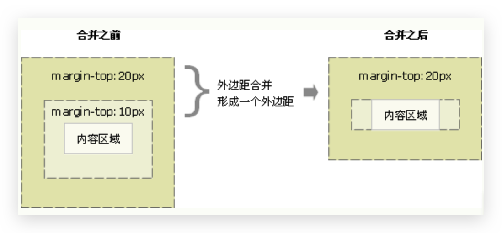
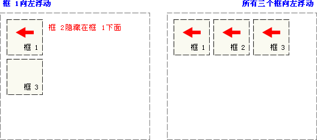
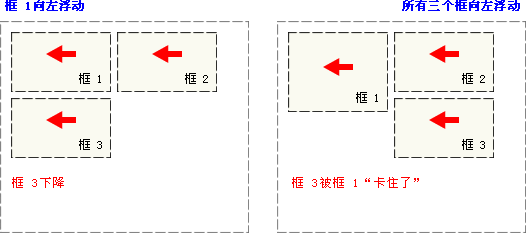
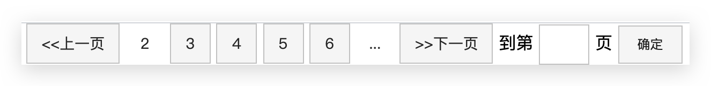

# 传统布局

页面布局要学习三大核心：**盒子模型、浮动、定位**

网页布局过程：

1. 先准备好相关的网页元素，网页元素基本都是盒子 Box
2. 利用 CSS 设置好盒子样式，然后摆放到相应位置
3. 往盒子里面装内容

 网页布局的核心本质：就是利用 CSS 摆盒子。

## Box Model 盒子模型

盒子模型：所有HTML元素可以看作盒子，在CSS中，"box model"这一术语是用来设计和布局时使用。CSS盒模型本质上是一个盒子，封装周围的HTML元素，它包括：**外边距，边框，内边距 和 实际内容**。盒模型允许我们在其它元素和周围元素边框之间的空间放置元素。


### 边框 border🔥

#### `border` 组合🔥

简写

```css
border : border-width || border-style || border-color;
```

分开写

```css
border-top: border-width || border-style || border-color;
border-bottom: border-width || border-style || border-color;
border-left: border-width || border-style || border-color;
border-right: border-width || border-style || border-color;
```

> 注意边框的层叠性


#### `border-width` 宽度

* 同其他

#### `border-style` 样式

- none：没有边框即忽略所有边框的宽度，默认
- solid：边框为单实线，**常用**
- dashed：边框为虚线
- dotted：边框为点线
- double：双线
- ...

#### `border-color` 颜色

* 同其他
* `transparent`透明


#### `border-collapse` 表格细线边框🔥

border-collapse 属性控制浏览器绘制表格边框的方式。它控制相邻单元格的边框。

```css
border-collapse: collapse || separate; 
```

* collapse：**合并**，表示相邻边框合并在一起，**常用**
* separate：分开


#### `border-radius`圆角边框🔥

> radius：半径

* length
  * px
  * %
* 可以**分别给四个角**都设置角度
  * 左上、 右上、 右下、 左下
  * 左上和右下、 右上和左下
  * ...
* 甚至还能直接指定top、bottom、left、right，**必须前两个在前面**


案例（**常用**）

* 如何让一个盒子变**圆形**：给`border-radius`为正方盒子 width 和 height（相等） 的一半，如50%

  ```css
  div{
    border-radius: 50%
  }
  ```

* 如何让一个盒子变**圆角矩形**：给`border-radius `为盒子 height 的一半，如50%


### 内边距 `padding`🔥

padding 属性用于设置内边距，即边框与内容之间的距离。

| 值的个数                     | 含义                      |
| ---------------------------- | ------------------------- |
| padding: 5px;                | 1个值，代表上下左右       |
| padding: 5px 10px;           | 2个值，代表上下、左右     |
| padding: 5px 10px 20px;      | 3个值，代表上、左右、下   |
| padding: 5px 10px 20px 30px; | 4个值，代表上、右、下、左 |

> 也可以分开指定上下左右，如 border 中写法

当我们给盒子指定 padding 值之后，发生了 2 件事情:

* 内容和边框有了距离，添加了内边距。

* padding**影响了盒子实际大小**。 也就是说，如果盒子已经有了宽度和高度，此时再指定内边框，会撑大盒子。


### 外边距 `margin`🔥

#### 使用

margin 清除周围的（外边框）元素区域。margin 没有背景颜色，是完全透明的。

| 值的个数                    | 含义                      |
| --------------------------- | ------------------------- |
| margin: 5px;                | 1个值，代表上下左右       |
| margin: 5px 10px;           | 2个值，代表上下、左右     |
| margin: 5px 10px 20px;      | 3个值，代表上、左右、下   |
| margin: 5px 10px 20px 30px; | 4个值，代表上、右、下、左 |

> 也可以分开指定上下左右，如 border 中写法

| 值       | 说明                                        |
| :------- | :------------------------------------------ |
| auto     | 设置浏览器边距。 这样做的结果会依赖于浏览器 |
| *length* | 定义一个固定的margin（使用像素，pt，em等）  |
| *%*      | 定义一个使用百分比的边距                    |

> Margin可以使用负值，重叠的内容。


#### 应用—块级盒子水平居中

**margin 典型应用**——让**块级盒子水平居中**，但需满足两个条件

* 盒子必须指定了width

* 盒子的左右margin都设置为auto

  ```css
  div {
    margin: 0 auto
  }
  ```

  **若是行内块元素或行内元素需要水平居中**，可以给其父元素添加`text-align: center`即可


#### 外边距合并问题

使用 margin 定义块元素的**垂直外边距**时，可能会出现外边距的合并，**合并后的外边距的高度等于两个发生合并的外边距的高度中的较大者**。主要有两种情况

* **相邻块元素垂直外边距的合并（上下边框）**

  当上下相邻的两个块元素(兄弟关系)相遇时，如果上面的元素有下外边距 margin-bottom，下面的元素有上外边距 margin-top ，则他们之间的垂直间距不是 margin-bottom 与 margin-top 之**和**。**取两个值中的较大者这种现象被称为相邻块元素垂直外边距的合并**。

  解决方案：

  * **尽量只给一个盒子添加 margin 值**

  

* **嵌套块元素垂直外边距的塌陷（上下边框）**

  对于两个嵌套关系(父子关系)的块元素，父元素有上外边距同时（其实父元素可以没有外边距）子元素也有上外边距，此时父元素会**塌陷**较大的外边距值。即子元素想距离父元素上边距失效。注意**以内容区域为视角**看问题。

  

  解决方案：

  * 可以为父元素定义上边框。
  * 可以为父元素定义上内边距。
  * 可以为父元素添加 overflow:hidden。**推荐**
  * 还有其他方法，比如**浮动、固定，绝对定位的盒子不会有塌陷问题**，后面咱们再总结。


### 影响盒子实际大小🔥

#### 解决

* **border 和 padding** 会额外增加盒子的实际大小（不是width和height）。因此我们有两种方案解决：
  * 若测量时**包含了border和padding**，则需要设置 width/height 时**减去border和padding**，可能要减2次
  * **测量盒子大小的时候，不量边框。**（只针对只有border没有padding的情况）

* **但是若没有指定width或height，则给定padding不会改变盒子大小width或height（相对应）**

  没width则不改变width，没height则不改变width

  即使子节点和父节点一样宽，也不要指定宽度，100%也不行，否则使用padding也会改变盒子大小


#### padding影响盒子好处

* 新浪导航案例

  padding内边距可以撑开盒子，我们可以做非常巧妙的运用。因为每个导航栏里面的**字数不一样多**，我们可以**不用给每个盒子宽度了**，直接给 **padding** 最合适，且 a 标签为行内元素，需转为行内块元素才能修改宽高


### 盒子阴影 `box-shadow`🔥

```css
box-shadow: h-shadow v-shadow blur spread color inset;
```

| 值         | 描述                                                         |
| :--------- | :----------------------------------------------------------- |
| *h-shadow* | **必需**。水平阴影的位置。允许负值。                         |
| *v-shadow* | **必需**。垂直阴影的位置。允许负值。                         |
| *blur*     | 可选。模糊距离，阴影的发散程度                               |
| *spread*   | 可选。阴影的尺寸，就是大小                                   |
| *color*    | 可选。阴影的颜色。请参阅 CSS 颜色值。                        |
| inset      | 可选。将外部阴影 (outset) 改为内部阴影。不能写outset这个值否则失效 |

> ⚠️ **影子不占用空间**，不影响其他盒子排列


### CSS3 盒子模型

CSS3 中可以通过 `box-sizing` 来指定盒模型，这样我们计算盒子大小的方式就发生了改变。有2个值

* `content-box` 盒子大小为 width + padding + border（以前默认的）
* `border-box` 盒子大小为 width

如果盒子模型我们改为了 `box-sizing: border-box ， 那padding和border就不会撑大盒子了，前提 padding 和border 不会超过 width 宽度。

所以之前写的全局定义可以改为

```css
* {
  padding: 0;
  margin: 0;
  box-sizing: border-box;        
}
```


## 标准流/普通流/文档流

> CSS 提供了三种传统布局方式：文档流、浮动、定位。移动端或现代布局会有新的方式

标签按照规定好默认方式排列

* 块级元素会独占一行，从上向下顺序排列

  常用元素:div、hr、p、h1~h6、ul、ol、dl、form、table

* 行内元素会按照顺序，从左到右顺序排列，碰到父元素边缘则自动换行

  常用元素:span、a、i、em 等

以上都是标准流布局，我们前面学习的就是标准流，标准流是最基本的布局方式。


## float 浮动

### 为什么需要浮动

* 如何让多个块级盒子(div)水平排列成一行？比较难，虽然转换为行内块元素可以实现一行显示，但是他们之间会有大的**空白缝隙**

* 如何实现两个盒子的左右对齐？

总结：有很多的布局效果，标准流没有办法完成，此时就可以利用浮动完成布局。 因为**浮动可以改变元素标签默认的排列方式**，浮动最典型的应用就是**让多个块级元素一行内排列显示**


### 什么是浮动

float 属性用于**创建浮动框**，**将其移动到一边**，**直到左边缘或右边缘触及 包含块 或 另一个浮动框 的边缘**。

```css
选择器 { 
  float: 属性值; 
}
```

| 值      | 描述                                                 |
| :------ | :--------------------------------------------------- |
| left    | 元素向左浮动。                                       |
| right   | 元素向右浮动。                                       |
| none    | 默认值。元素不浮动，并会显示在其在文本中出现的位置。 |
| inherit | 规定应该从父元素继承 float 属性的值。                |

图例

- 当框 1 向左浮动时，它脱离文档流并且向左移动，直到它的左边缘碰到包含框的左边缘，覆盖框2

- 如果把三个框都向左浮动，那框1向左浮动直到碰到包含框，另外两个框向左浮动直到碰到前一个浮动框

  

- 如果包含框太窄，无法容纳水平排列的三个浮动元素，那么其它浮动块向下移动，直到有足够的空间；如果浮动元素的高度不同，那么当它们向下移动时可能被其它浮动元素“卡住”

  


### 浮动特性🔥

加了浮动之后的元素，会具有很多特性，需要我们掌握的：

* 脱离标准普通流的控制（浮）移动到指定位置（动），俗称**脱标**。浮动的盒子**不再保留原先的位置**，可能与标准流盒子重叠

* 如果**多个盒子都设置了浮动**，则它们会按照属性值**一行内显示（无空隙）并且顶端对齐排列**

* 任何元素都可以浮动。**不管原先是什么模式的元素**，添加浮动之后**具有行内块元素相似的特性**
  * 如果块级盒子没有设置宽度，**默认宽度和父级一样宽**，但是添加浮动后，它的**宽度根据内容来决定**🔥
  * 浮动的盒子中间是没有缝隙的，是**紧挨**着一起的
  * 行内元素可以不用转换为块级或行内块元素，直接设置宽高
  
* 浮动元素只会压住它下面标准流的盒子，但是**不会压住下面标准流盒子里面的文字（图片）**

  浮动之所以不会压住文字，因为浮动产生的目的**最初是为了做文字环绕效果**的。 文字会围绕浮动元素


### 清除浮动🔥

#### 原因

由于**父级盒子很多情况下，不方便给高度**，但是子盒子**浮动又不占有位置**，所以由于**父级盒子高度为 0**，就影响了下面的标准流盒子。

清除浮动的本质是清除浮动元素造成的影响。如果父盒子本身有高度，则不需要清除浮动

**清除浮动之后，父级就会根据浮动的子盒子自动检测高度。父级有了高度，就不会影响下面的标准流了**

```css
选择器{
  clear: 属性值;
}
```

| 值       | 描述                                  |
| :------- | :------------------------------------ |
| left     | 在左侧不允许浮动元素。                |
| right    | 在右侧不允许浮动元素。                |
| **both** | 在左右两侧均不允许浮动元素。          |
| none     | 默认值。允许浮动元素出现在两侧。      |
| inherit  | 规定应该从父元素继承 clear 属性的值。 |

> 我们实际工作中， **几乎只用 both**

#### 方法

清除浮动的策略是：**闭合浮动**，将浮动元素只限制到父元素中

清除浮动方法：

* **额外标签法也称为隔墙法**，是 W3C 推荐的做法。但是**不常用**。额外标签法会在浮动元素末尾添加一个空的标签。例如 `<div style="clear:both"></div>`，或者其他标签，如`<br style="clear:both"/>`等

  * 优点: 通俗易懂，书写方便

  * 缺点: 添加许多无意义的标签，结构化较差 

    注意: 要求这个新的空标签**必须是块级元素**。

* **父级添加:after伪元素**，是额外标签法的升级版。**给父元素添加。强烈推荐**！🔥

  ```css
  /* 写单冒号是为了兼容IE8 */
  .clearfix::after { 
    /* content是使用伪元素必须出现的 */
    content: ""; 
    /* 使用伪元素的标签必须是块级盒子 */
    display: block;
    /* 下面2行代表不看到该元素 */
    height: 0;
    visibility: hidden;
    clear: both; 
  }
  .clearfix { 
    /* IE6、7 专有 */
    *zoom: 1; 
  }
  ```

  * 优点：没有增加标签，结构更简单

  * 缺点：照顾低版本浏览器

    代表网站：百度、淘宝网、网易

* **父级添加双伪元素**，可以看作上述升级版。**给父元素添加。强烈推荐**！🔥

  ```css
  .clearfix:before,
  .clearfix:after { 
    content:"";
    /* 直接使用block，则before和after会在两行显示，不适用 */
    display:table;
  }
  .clearfix:after {
    clear:both; 
  }
  .clearfix { 
    /* IE6、7 专有 */
    *zoom:1;
  }
  ```

  * 优点：代码更简洁

  * 缺点：照顾低版本浏览器

    代表网站：小米、腾讯等

* **父级添加 overflow 属性**。可以给父级添加 `overflow` 属性，将其属性值设置为 **hidden**（常用）、 auto 或 scroll。子不教，父之过，注意是给父元素添加代码

  * 优点：代码简洁
  * 缺点：无法显示溢出的部分，会截掉


## position 定位

### 为什么需要定位

以下情况使用标准流或者浮动能实现吗？

* 某个元素可以**自由的在一个盒子内移动位置**，并且压住其他盒子
* 当我们滚动窗口的时候，盒子是**固定屏幕某个位置**的。

以上效果，标准流或浮动都无法快速实现，此时需要定位来实现。

* 浮动可以让多个块级盒子一行没有缝隙排列显示， 经常用于横向排列盒子。
* 定位则是可以让盒子自由的在**某个盒子内移动**位置或者**固定屏幕中某个位置**，并且可以压住其他盒子。
* 且**内联inline元素不能使用定位，需转换为block元素**🔥


### 定位组成

#### 组成

* 定位：将盒子定在某一个位置，所以定位也是在摆放盒子，按照定位的方式移动盒子。
* **定位 = 定位模式 + 边偏移**

#### 定位模式

**定位模式**决定元素的**定位方式** ，它通过 CSS 的 position 属性来设置

* `static`

  默认值。没有定位，元素出现在标准流中（忽略 top, bottom, left, right 或者 z-index 声明，即没有边偏移），很少用到。

* `relative`🔥

  生成相对定位的元素，**相对于其自己正常位置进行定位（自恋型）**。

  **原来在标准流的位置继续占有**，后面的盒子仍然**以标准流的方式对待它，不能使用该位置**。如："left:20" 会向元素的 LEFT 位置**添加** 20 像素。

  > 因此，相对定位并没有脱标。它最典型的应用是**给绝对定位当爹的（限制绝对定位）**

* `absolute`🔥

  生成绝对定位（**拼爹型**）的元素，相对于 static 定位以外的第一个父元素进行定位。**如果没有祖先元素或者祖先元素没有定位，则以浏览器为准定位（Document 文档）**；**如果祖先元素有定位（相对、绝对、固定定位）**，则**以最近一级**的有定位祖先元素为参考点移动位置

  绝对定位**不再占有原先的位置**（脱标，脱离标准流），其他盒子可以使用原先位置

* `fixed`🔥

  生成绝对定位的元素，**相对于浏览器窗口可视区进行定位**，跟父元素没有任何关系。

  不随滚动条滚动，可以在浏览器页面滚动时**元素的位置不会改变**

  固定定位**不再占有原先的位置**，脱标

  > 固定定位也是脱标的，其实固定定位也可以看做是一种特殊的绝对定位。

* `sticky`🔥

  **粘性定位**可以被认为是**相对定位relative**和**固定定位fixed**的混合

  以浏览器的**可视窗口为参照点**移动元素（固定定位特点）

  粘性定位**占有原先的位置**（相对定位特点）

  **必须添加** top 、left、right、bottom 其中一个才有效

  > **跟页面滚动搭配使用**。 兼容性较差，IE 不支持，目前大部分使用 js 实现

* `inherit`

  规定应该从父元素继承 position 属性的值。

|     定位模式      | 是否脱标          | 移动位置           | 是否常用   |
| :---------------: | ----------------- | ------------------ | ---------- |
|  static 静态定位  | 否                | 不能使用边偏移     | 很少       |
| relative 相对定位 | 否 (占有原来位置) | 相对于自身位置移动 | 常用       |
| absolute绝对定位  | 是                | 带有定位的父级     | 常用       |
|  fixed 固定定位   | 是                | 浏览器可视区       | 常用       |
|  sticky 粘性定位  | 否 (占有原来位置) | 浏览器可视区       | 当前阶段少 |


#### 边偏移

**边偏移**就是定位的盒子移动到**最终位置**

| 属性           | 描述                                                         |
| :------------- | :----------------------------------------------------------- |
| **top**        | 定义了一个定位元素的上外边距边界与其包含块上边界之间的偏移。 |
| **right**      | 定义了定位元素右外边距边界与其包含块右边界之间的偏移。       |
| **bottom**     | 定义了定位元素下外边距边界与其包含块下边界之间的偏移。       |
| **left**       | 定义了定位元素左外边距边界与其包含块左边界之间的偏移。       |
| overflow       | 设置当元素的内容溢出其区域时发生的事情。                     |
| clip           | 设置元素的形状。元素被剪入这个形状之中，然后显示出来。       |
| vertical-align | 设置元素的垂直对齐方式。                                     |
| **z-index**    | 设置元素的堆叠顺序，z轴距离，可负数，数字后面**不能加单位**。**定位盒子才有该属性**，如果属性值相同，则按照书写顺序，后来居上。 |

> 若一个盒子既有left也有right，则left优先级高；同理top比bottom优先级高
>


### 子绝父相的由来🔥

绝对定位和相对定位到底有什么使用场景呢？

为什么说相对定位给绝对定位当爹的呢？

弄清楚这个口诀，就明白了绝对定位和相对定位的使用场景。**子级是绝对定位的话，父级要用相对定位**。

* **子级绝对定位，不会占有位置**，可以放到父盒子里面的任何一个地方，不会影响其他的兄弟盒子。
* **父盒子需要加定位限制子盒子在父盒子内显示**。
* **父盒子布局时，需要占有位置**，因此父亲只能是相对定位（其他float等也不行）。

因为父级需要占有位置，因此是相对定位， 子盒子不需要占有位置，则是绝对定位。当然，子绝父相**不是永远不变的**，如果父元素不需要占有位置，子绝父绝也会遇到。


### 定位特性

* 绝对定位和固定定位也和浮动类似

  * 行内元素添加绝对或者固定定位，可以**直接设置高度和宽度**。
  * 块级元素添加绝对或者固定定位，如果不给宽度或者高度，**默认大小是内容的大小**。

* **绝对定位（固定定位）会压住下面标准流所有的内容**

  浮动元素不同，只会压住它下面标准流的盒子，但是**不会压住下面标准流盒子里面的文字（图片）**

  浮动之所以不会压住文字，因为浮动产生的目的最初是为了做文字环绕效果的。 文字会围绕浮动元素


### 案例

#### 固定在版心右侧位置

固定在版心右侧位置，而不是跟随浏览器可视窗口位置

1. 让固定定位的盒子 `left: 50%`. 走到浏览器可视区(也可以看做版心) 的一半位置。
2. 让固定定位的盒子 `margin-left: 版心宽度的一半距离`。 多走**版心宽度的一半**位置


#### 绝对定位的盒子居中

加了绝对定位的盒子不能通过 `margin:0 auto` 水平居中，但是可以通过以下计算方法实现水平和垂直居中。

* `left: 50%;` 让盒子的左侧移动到父级元素的水平中心位置。
* `margin-left: -100px;` 让盒子向左移动**自身宽度的一半**。可以百分号
* 高度同理


## 传统布局总结及案例🔥

### 总结

一个完整的网页，是标准流、浮动、定位一起完成布局的，每个都有自己的专门用法。

* 标准流：可以让盒子上下排列或者左右排列，垂直的块级盒子显示就用标准流布局。
* 浮动：可以让多个块级元素一行显示或者左右对齐盒子，多个块级盒子水平显示就用浮动布局。
* 定位：定位最大的特点是有层叠的概念，就是可以让多个盒子前后叠压来显示。如果元素自由在某个盒子内移动就 用定位布局。

即

* **多个块级元素纵向排列找标准流，多个块级元素横向排列找浮动（利用标准流约束浮动元素位置）**

* **先设置盒子的大小，之后设置盒子的位置**

* 一个元素浮动了，理论上其余的兄弟元素也要浮动，以防止引起问题

  **浮动的盒子只会影响浮动盒子后面的标准流，不会影响前面的标准流（前面的标准流占一行，无论在浮动盒子的上面还是下面）**

* 遇到header和footer需要和显示器等宽的，不需要设置width，自动就是等宽的


### 学成在线首页

<a href="./example/1 学成在线首页/index.html">学成在线首页</a>


### 轮播图

<a href="./example/2 淘宝轮播图/index.html">淘宝轮播图</a>


### 1 CSS初始化

不同浏览器对有些标签的默认值是不同的，为了消除不同浏览器对HTML文本呈现的差异，照顾浏览器的兼 容，我们需要对CSS 初始化，重设浏览器的样式，也称为CSS reset。以京东CSS初始化代码为例：

```css
/* 把我们所有标签的内外边距清零 */
* {
  margin: 0;
  padding: 0
}
/* em 和 i 斜体的文字不倾斜 */
em,
i {
  font-style: normal
}
/* 去掉li 的小圆点 */
li {
  list-style: none
}

img {
  /* border 0 照顾低版本浏览器 如果 图片外面包含了链接会有边框的问题 */
  border: 0;
  /* 取消图片底侧有空白缝隙的问题 */
  vertical-align: middle
}

button {
  /* 当我们鼠标经过button 按钮的时候，鼠标变成小手 */
  cursor: pointer
}

a {
  color: #666;
  text-decoration: none
}

a:hover {
  color: #c81623
}

button,
input {
  /* "\5B8B\4F53" 就是宋体的意思 这样浏览器兼容性比较好 */
  font-family: Microsoft YaHei, Heiti SC, tahoma, arial, Hiragino Sans GB, "\5B8B\4F53", sans-serif
}

body {
  /* CSS3 抗锯齿形 让文字显示的更加清晰 */
  -webkit-font-smoothing: antialiased;
  background-color: #fff;
  font: 12px/1.5 Microsoft YaHei, Heiti SC, tahoma, arial, Hiragino Sans GB, "\5B8B\4F53", sans-serif;
  color: #666
}

.hide,
.none {
  display: none
}
/* 清除浮动 */
.clearfix:after {
  visibility: hidden;
  clear: both;
  display: block;
  content: ".";
  height: 0
}

.clearfix {
  *zoom: 1
}
```


### 2 CSS 属性书写顺序

* 布局定位属性:display / position / float / clear / visibility / overflow(建议 display 第一个写，关系到模式)
* 自身属性:width / height / margin / padding / border / background
* 文本属性:color / font / text-decoration / text-align / vertical-align / white- space / break-word
* 其他属性(CSS3):content / cursor / border-radius / box-shadow / text-shadow / background:linear-gradient ...


### 3 页面整体布局思路

为了提高网页制作的效率，布局时通常有以下的布局流程:

1. 必须确定页面的**版心**(可视区)，基本上**宽度**都和它一致。测量可得知。
2. 分析页面中的**行模块**，以及每个**行模块中的列模块**。其实页面布局，就是一行行罗列而成的。
3. 制作 HTML 结构。我们还是遵循，先有结构，后有样式的原则。**结构永远最重要**。
4. 开始运用盒子模型的原理，通过 DIV+CSS 布局来控制网页的各个模块。


### 4 确定版心

这个页面的版心 width 是 1200 像素，每个版心都要**水平居中对齐**，可以定义版心为公共类:

```css
.w {
  width: 1200px;
  margin: auto;
}
```


### 5 头部盒子

* 1 号是版心盒子 header 1200 * 42 的盒子水平居中对齐，上下给一个 margin 值就可以
* 版心盒子里面包含 2 号盒子 logo。**div布局好后放入img即可**
* 版心盒子里面包含 3 号盒子 nav 导航栏，实际开发中，**nav一般采用li + a 的做法**。语义更清楚，且若直接使用a来堆砌，搜索引擎容易辨别为有堆砌关键字嫌疑，有降权风险
  * 给li浮动，li是块级元素，a是内联元素
  * 导航栏可以不给宽度，将来可继续添加文字；因为文字不一样多，给**a左右padding来撑开盒子即可**
* 版心盒子里面包含 4 号盒子 search 搜索框。一个大div套input和button


### 6 banner


### 7 footer


### 8 hot

利用 position


### 9 轮播图

利用position

父盒子相对定位，子模块绝对定位


## 常见布局技巧

### margin负值的运用 

盒子细线边框加粗问题

* 让每个盒子margin 往**左侧移动 -1px 正好压住相邻盒子边框**（浏览器渲染时是分别渲染的，所以可以实现）

hover 时右侧边框被右边盒子覆盖掉问题

* 鼠标经过某个盒子的时候，**提高当前盒子的层级即可**。

  如果父盒子**没有有定位**，则加相对定位（保留位置）；**如果父盒子有定位**，则加`z-index`


### 文字围绕浮动元素 

父盒子中有**左侧图片和右侧文字**，此时可以**利用float的文字环绕来解决**，不用再定义2个盒子


### 行内块的巧妙运用 

利用行内块元素中间有缝隙，且可以使用`text-align`来居中，可以指定width、height

```html
<!DOCTYPE html>
<html lang="en">
  <head>
    <meta charset="UTF-8">
    <meta name="viewport" content="width=device-width, initial-scale=1.0">
    <meta http-equiv="X-UA-Compatible" content="ie=edge">
    <title>行内块的巧妙运用</title>
    <style>
      * {
        margin: 0;
        padding: 0;
      }
      .box {
        text-align: center;
      }
      .box a {
        display: inline-block;
        width: 36px;
        height: 36px;
        background-color: #f7f7f7;
        border: 1px solid #ccc;
        text-align: center;
        line-height: 36px;
        text-decoration: none;
        color: #333;
        font-size: 14px;
      }
      .box .prev,
      .box .next {
        width: 85px;
      }
      .box .current,
      .box .elp {
        background-color: #fff;
        border: none;
      }
      .box input {
        height: 36px;
        width: 45px;
        border: 1px solid #ccc;
        outline: none;
      }
      .box button {
        width: 60px;
        height: 36px;
        background-color: #f7f7f7;
        border: 1px solid #ccc;

      }
    </style>
  </head>
  <body>
    <div class="box">
      <a href="#" class="prev">&lt;&lt;上一页</a>
      <a href="#" class="current">2</a>
      <a href="#">3</a>
      <a href="#">4</a>
      <a href="#">5</a>
      <a href="#">6</a>
      <a href="#" class="elp">...</a>
      <a href="#" class="next">&gt;&gt;下一页</a>
      到第 
      <input type="text">
      页
      <button>确定</button>
    </div>
  </body>
</html>
```

效果如下：




## 元素的显示与隐藏

### `display`🔥

* `none` 隐藏对象，**隐藏元素后，不再占有原来的位置，但是元素还存在DOM中**。应用**极其广泛**，搭配 JS 做网页特效。
* `block` 除了转换为块级元素之外，同时还有显示元素的意思


### `visibility`

visibility 属性用于指定一个元素应可见还是隐藏

* `visible`  元素可视
* `hidden`  元素隐藏，**隐藏元素后，继续占有原来的位**置


### `overflow`🔥

overflow 属性指定了**内容溢出**一个元素的框（超过其指定高度及宽度）时，会发生什么。

| 值      | 描述                                                         |
| :------ | :----------------------------------------------------------- |
| visible | 默认值。内容不会被修剪，**会呈现在元素框之外**。             |
| hidden🔥 | 内容会被修剪，并且其余内容是不可见的。                       |
| scroll🔥 | 内容会被修剪，但是浏览器**总是会显示滚动条**以便查看其余的内容。 |
| auto🔥   | **自动**。如果内容被修剪，则浏览器会显示滚动条以便查看其余的内容。 |
| inherit | 规定应该从父元素继承 overflow 属性的值。                     |

一般情况下，我们都不想让溢出的内容显示出来，因为溢出的部分会影响布局。

但是**如果有定位的盒子**，请**慎用**`overflow:hidden`，因为它会隐藏多余的部分。


### 遮罩案例

核心原理：原先半透明的黑色遮罩看不见，鼠标经过大盒子，就显示出来。 遮罩的盒子不占有位置，就需要用**绝对定位 和 display 配合**。详细查看学成在线代码

```css
/* mask遮罩 */
.box .box-body .mask {
    /* 隐藏遮罩 */
    display: none;
    position: absolute;
    width: 228px;
    height: 270px;
    background: rgba(0, 0, 0, .4) url(./images/arr.png) no-repeat 100px 60px;
}

/* 鼠标经过li盒子时（不能是经过mask），才让mask显示，和以往不同的写法，注意 */
.box .box-body ul li:hover .mask {
    display: block;
}
```

学习了伪元素选择器后，改写为

```css
/* mask遮罩 */
.box .box-body ul li::before {
    /* 必须加content */
    content: "";
    /* 隐藏遮罩 */
    display: none;
    position: absolute;
    width: 228px;
    height: 270px;
    background: rgba(0, 0, 0, .4) url(./images/arr.png) no-repeat 100px 60px;
}

/* 鼠标经过li盒子时（不能是经过mask），才让mask显示，和以往不同的写法，注意 */
.box .box-body ul li:hover::before {
    display: block;
}
```


## bootstrap

> 详细内容访问[Bootstrap中文网](http://www.bootcss.com/)

- **引入依赖**

  - css：`bootstrap.css`
  - js：`jquery.js`、`popper.js`(用于弹窗、提示、下拉菜单。版本3没有这个)、`bootstrap.js`

- **响应式布局**：一个网站可以兼容多个终端

  ```html
  <meta charset="UTF-8">
  <!--响应式 meta 标签;viewport宽度；初始缩放值；最小/最大缩放值；是否允许用户缩放-->
  <!--还有minimum-scale；maximum-scale；user-scalable=true/false-->
  <meta name="viewport" content="width=device-width, initial-scale=1.0">
  <!--文档兼容模式-->
  <meta http-equiv="X-UA-Compatible" content="ie=edge">
  ```

  - viewport
    - 移动设备上的就是**设备的屏幕上能用来显示我们的网页的那一块区域**
  - px
    - css中1px并不等于设备的1px

- 步骤

  1. 定义布局容器：`container`、`.container-fluid`
  2. 定义行：`row`
  3. 定义列：`col-xs-*`、`col-sm-*`、`col-md-*`、`col-lg-*`、`hidden-**`（可以让元素在某个屏幕大小设备**不显示**）

#### 1.1 布局容器

- Bootstrap 需要为页面内容和栅格系统包裹一个容器
  - `.container` **类**用于固定宽度（根据不同设备左右有固定留白，但xs没有留白）并支持响应式布局的容器
  - `.container-fluid` **类**用于 100% 宽度，占据全部视口（viewport）的容器

#### 1.2 栅格系统

Bootstrap提供了一套响应式、移动设备优先的流式栅格系统，随着屏幕或视口(viewport)尺寸的增加，系统会自动分为最多**12列**

- 栅格系统用于通过一系列的行（row）与列（column）的组合来创建页面布局，你的内容就可以放入这些创建好的布局中。工作**原理**如下：
  - “行（row）”必须包含在 `.container` （固定宽度）或 `.container-fluid` （100% 宽度）中，以便为其赋予合适的排列（**aligment**）和内补（**padding**）。
  - 通过“行（row）”在水平方向创建一组“列（column）”。
  - 你的内容应当放置于“列（column）”内，并且，只有“列（column）”可以作为“行（row）”的直接子元素。
  - 类似 `.row` 和 `.col-xs-4` 这种预定义的类，可以用来快速创建栅格布局。Bootstrap 源码中定义的 mixin 也可以用来创建语义化的布局。
  - 通过为“**列（column）”设置 `padding` 属性**，从而创建列与列之间的间隔（gutter）。通过**为 `.row` 元素设置负值 `margin`** 从而抵消掉为 `.container` 元素设置的 `padding`，也就间接为“行（row）”所包含的“列（column）”抵消掉了`padding`。==多列嵌套时，可以通过==`padding:0`==来取消内边距，使得元素占满viewport==
  - 负值的`margin`就是下面的示例为什么是向外突出的原因。在栅格列中的内容排成一行。
  - 栅格系统中的列是通过指定1到12的值来表示其**跨越的范围**。例如，三个等宽的列可以使用三个 `.col-xs-4` 来创建。
  - 如果一“行（row）”中包含了的“列（column）”大于 12，多余的“列（column）”所在的元素将被作为一个整体**另起一行排列**。
  - **向上兼容且不向下兼容**：**栅格类适用于与屏幕宽度大于或等于分界点大小的设备** ， 并且**针对小屏幕设备覆盖栅格类（可能每个列占一行）**。 因此，在元素上应用任何 `.col-md-*`栅格类适用于与屏幕宽度大于或等于分界点大小的设备 ， 并且针对小屏幕设备覆盖栅格类。 因此，在元素上应用任何 `.col-lg-*`不存在， 也影响大屏幕设备。

#### 1.3 全局CSS样式、组件、插件

**全局CSS样式**

- 按钮： `<button>` (建议使用)、`<a>`、 `<input>` 。`class="btn btn-default"`
- 图片：`img-responsive"`、`img-rounded`(方)、`img-circle`(圆)、`img-thumbnail`(相框)
- 表格：`table`、`table-bordered`、`table-hover`
- 表单：

**组件**

- 导航条
- 分页：！！！

**插件**

- 轮播图

#### 1.4 其他详细的看文档去吧！
