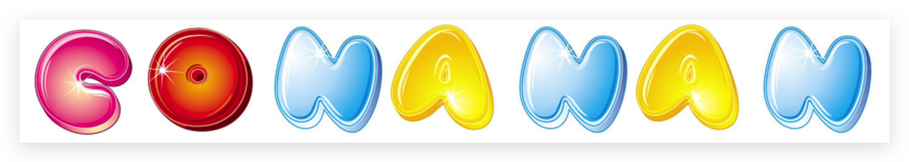
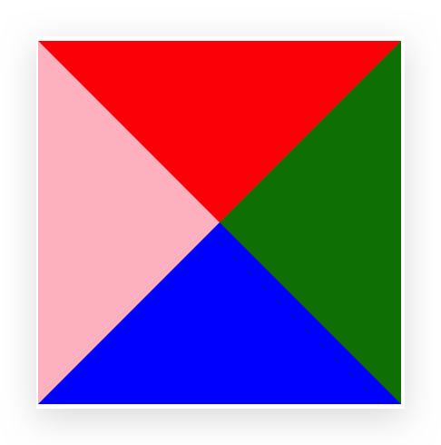
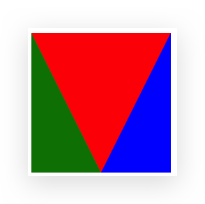
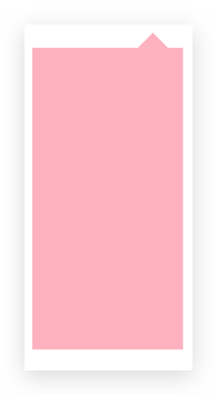
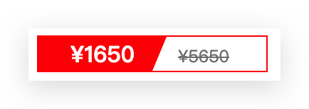

# 高级技巧

## 精灵图

### 为什么需要精灵图

一个网页中往往会应用很多小的背景图像作为修饰，当网页中的图像过多时，服务器就会频繁地接收和发送请求图片，造成服务器请求压力过大，这将大大降低页面的加载速度。因此，为了有效地减少服务器接收和发送请求的次数，提高页面的加载速度，出现了 **CSS 精灵技术**（也称 **CSS Sprites**、**CSS 雪碧**）。

核心原理：**将网页中的一些小背景图像整合到一张大图中** ，这样服务器只需要一次请求就可以了。

在王者荣耀官网和淘宝官网中可看到应用。


### 精灵图 sprites 的使用

使用精灵图核心:

* 精灵图主要针对于**小的背景图片使用**。
* 移动背景图片位置， 此时可以使用 `background-position` 。
* 一般情况下精灵图都是**负值（距离父盒子距离）**。千万注意网页中的坐标：x轴右边走是正值，左边走是负值， y轴同理。

```html
<!DOCTYPE html>
<html lang="en">

<head>
    <meta charset="UTF-8">
    <meta name="viewport" content="width=device-width, initial-scale=1.0">
    <meta http-equiv="X-UA-Compatible" content="ie=edge">
    <title>精灵图</title>
    <style>
        .sprites {
            width: 1200px;
            height: 100px;
            margin: 100px auto;
        }

        .sprites .c {
            display: inline-block;
            width: 120px;
            height: 120px;
            background: url(./images/abcd.jpg) -230px 0;
        }

        .sprites .o {
            display: inline-block;
            width: 120px;
            height: 120px;
            background: url(./images/abcd.jpg) -370px -270px;
        }

        .sprites .n {
            display: inline-block;
            width: 120px;
            height: 120px;
            background: url(./images/abcd.jpg) -250px -270px;
        }

        .sprites .a {
            display: inline-block;
            width: 120px;
            height: 120px;
            background: url(./images/abcd.jpg) 0 -5px;
        }
    </style>
</head>

<body>
    <div class="sprites">
        <span class="c"></span>
        <span class="o"></span>
        <span class="n"></span>
        <span class="a"></span>
        <span class="n"></span>
        <span class="a"></span>
        <span class="n"></span>
    </div>

</body>

</html>
```




## 字体图标

### 发展

字体图标使用场景：主要用于显示网页中通用、常用的一些小图标。

精灵图是有诸多优点的，但是缺点很明显。 

* 图片文件还是比较大的。
* 图片本身放大和缩小会失真。
* 一旦图片制作完毕想要更换非常复杂。

此时，有一种技术的出现很好的解决了以上问题，就是字体图标 iconfont。字体图标可以为前端工程师提供一种方便高效的图标使用方式，展示的是图标，本质属于字体。


### 优点

* 轻量级：一个图标字体要比一系列的图像要小。一旦字体加载了，图标就会马上渲染出来，减少了服务器请求 
* 灵活性：本质其实是文字，可以很随意的改变颜色、产生阴影、透明效果、旋转等
* 兼容性：几乎支持所有的浏览器，请放心使用

注意：**字体图标不能替代精灵技术**，只是对工作中图标部分技术的提升和优化。

* 如果遇到一些结构和样式比较简单的小图标，就用字体图标。
* 如果遇到一些结构和样式复杂一点的小图片，就用精灵图。


### 使用

字体图标是一些网页常见的小图标，我们直接网上下载即可。 因此使用可以分为: 

1. 字体图标的下载，把下载包里面的 fonts 文件夹放入**页面根目录**下

   不同浏览器所支持的字体格式是不一样的，字体图标之所以兼容就是因为包含了主流浏览器支持的字体文件。

   * TureType(.ttf)格式.ttf字体是Windows和Mac的最常见的字体，支持这种字体的浏览器有IE9+、Firefox3.5+、 Chrome4+、Safari3+、Opera10+、iOS Mobile、Safari4.2+;
   * Web Open Font Format(.woff)格式woff字体，支持这种字体的浏览器有IE9+、Firefox3.5+、Chrome6+、 Safari3.6+、Opera11.1+;
   * Embedded Open Type(.eot)格式.eot字体是IE专用字体，支持这种字体的浏览器有IE4+;
   * SVG(.svg)格式.svg字体是基于SVG字体渲染的一种格式，支持这种字体的浏览器有Chrome4+、Safari3.1+、 Opera10.0+、iOS Mobile Safari3.2+;

2. 字体图标的引入 (引入到我们html页面中)

   一般下载的demo会有介绍

3. 字体图标的追加 (以后添加新的小图标)

推荐下载网站：

* [icomoon](http://icomoon.io) 字库  推荐指数 ★★★★★

  IcoMoon 成立于 2011 年，推出了第一个自定义图标字体生成器，它允许用户选择所需要的图标，使它们成

  一字型。该字库内容种类繁多，非常全面，唯一的遗憾是国外服务器，打开网速较慢。

* 阿里 [iconfont](http://www.iconfont.cn/) 字库 推荐指数 ★★★★★

  这个是阿里妈妈 M2UX 的一个 iconfont 字体图标字库，包含了淘宝图标库和阿里妈妈图标库。可以使用 AI 制作图标上传生成。 重点是，免费!


## CSS 三角

### 使用1

看如下代码：

```html
<!DOCTYPE html>
<html lang="en">
  <head>
    <meta charset="UTF-8">
    <meta name="viewport" content="width=device-width, initial-scale=1.0">
    <meta http-equiv="X-UA-Compatible" content="ie=edge">
    <title>CSS三角</title>
    <style>
      .test {
        width: 0;
        height: 0;
        border-top: 100px solid red;
        border-right: 100px solid green;
        border-bottom: 100px solid blue;
        border-left: 100px solid pink;
      }
    </style>
  </head>
  <body>
    <div class="test"></div>
  </body>
</html>
```

其结果如下图：



由此可画出三角形，如向右的三角，具体代码如下：

```css
.test2 {
  width: 0;
  height: 0;
  border: 100px solid transparent;/* transparent 的使用*/
  border-left: 100px solid red;
  /* 照顾兼容性问题 */
  line-height: 0;
  font-size: 0;
}
```

### 使用2

```html
<!DOCTYPE html>
<html lang="en">

  <head>
    <meta charset="UTF-8">
    <meta name="viewport" content="width=device-width, initial-scale=1.0">
    <meta http-equiv="X-UA-Compatible" content="ie=edge">
    <title>CSS三角</title>
    <style>
      .test {
        width: 0;
        height: 0;
        border-top: 100px solid red;
        border-left: 50px solid green;
        border-right: 50px solid blue;
      }
    </style>
  </head>

  <body>
    <div class="test"></div>
  </body>

</html>
```

效果如下：



### 京东三角案例1

使用 position 和 CSS 三角完成，如下：

```html
<!DOCTYPE html>
<html lang="en">

  <head>
    <meta charset="UTF-8">
    <meta name="viewport" content="width=device-width, initial-scale=1.0">
    <meta http-equiv="X-UA-Compatible" content="ie=edge">
    <title>CSS三角</title>
    <style>
      .jd {
        position: relative;
        width: 100px;
        height: 200px;
        background-color: pink;
        margin: 100px auto;
      }

      .jd span {
        position: absolute;
        left: 70px;
        top: -20px;
        width: 0;
        height: 0;
        border: 10px solid transparent;
        border-bottom: 10px solid pink;
      }
    </style>
  </head>

  <body>
    <div class="jd">
      <span></span>
    </div>
  </body>

</html>
```

具体效果如下：



### 京东三角案例2

```html
<!DOCTYPE html>
<html lang="en">

  <head>
    <meta charset="UTF-8">
    <meta name="viewport" content="width=device-width, initial-scale=1.0">
    <meta http-equiv="X-UA-Compatible" content="ie=edge">
    <title>CSS三角强化的巧妙运用</title>
    <style>
      .price {
        width: 160px;
        height: 24px;
        line-height: 24px;
        border: 1px solid red;
        margin: 0 auto;
      }

      .miaosha {
        position: relative;
        float: left;
        width: 90px;
        height: 100%;
        background-color: red;
        text-align: center;
        color: #fff;
        font-weight: 700;
        margin-right: 8px;

      }

      .miaosha i {
        position: absolute;
        right: 0;
        top: 0;
        width: 0;
        height: 0;
        border-color: transparent #fff transparent transparent;
        border-style: solid;
        border-width: 24px 10px 0 0;
      }

      .origin {
        font-size: 12px;
        color: gray;
        text-decoration: line-through;
      }
    </style>
  </head>

  <body>
    <div class="price">
      <span class="miaosha">
        ¥1650
        <i></i>
      </span>
      <span class="origin">¥5650</span>
    </div>
  </body>

</html>
```

效果如下：

