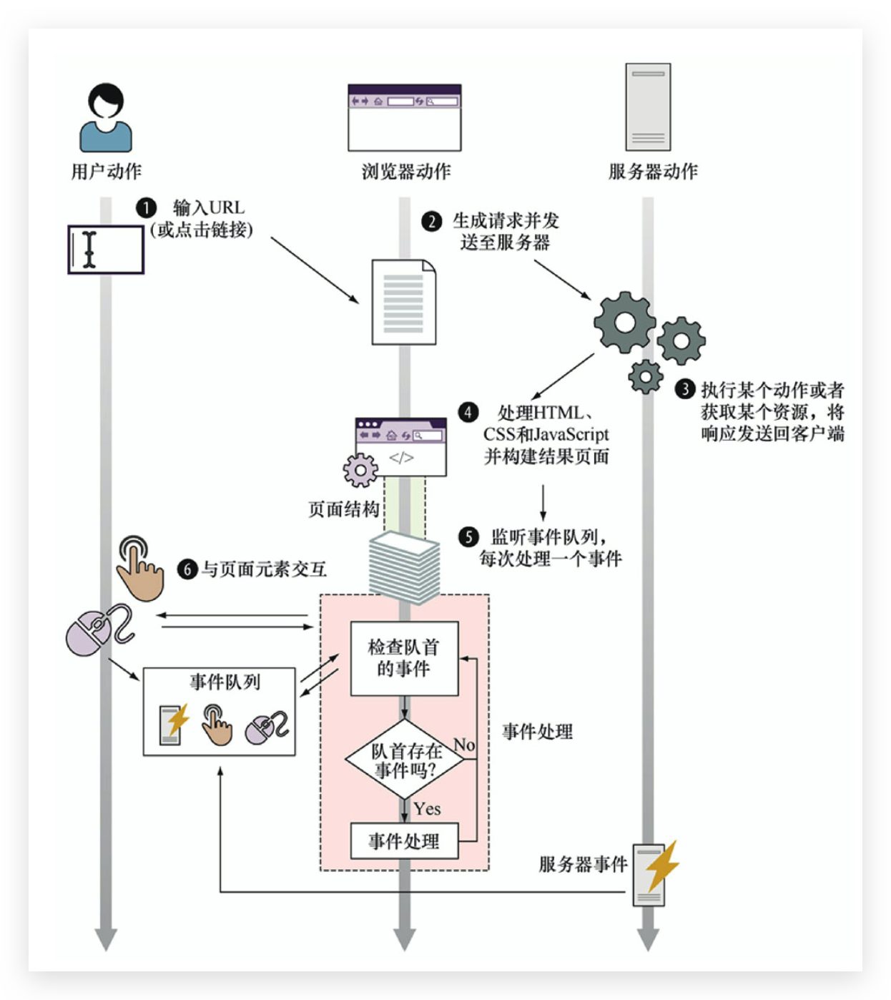

# JS 与 Java、C# 区别

**对象、原型、函数和闭包的紧密结合组成了JavaScript**

*   **基于原型的面向对象**——不同于其他主流的面向对象语言（例如C#、Java、Ruby）使用**基于类的面向对象**，JavaScript使用基于原型的面向对象。

*   **函数是一等公民（一级对象）**。在JavaScript中，函数与其他对象共存，并且能够像任何其他对象一样地使用。

    *   函数可以通过**字面量创建**

    *   可以**赋值给变量**
    *   可以作为函数参数进行**传递**
    *   甚至可以作为返回值从函数中**返回**

*   **函数闭包**。当函数主动维护了在函数内使用的外部的变量，则该函数为一个闭包

*   **作用域**。**依赖函数级别**的变量和**全局变量**（ES6前）


# Web 应用的生命周期 🔥

## 页面构建阶段

*   **解析 HTML，构建 DOM**

    按顺序解析，即使是 script 标签（只不过会**阻塞执行**）。遇到标签放置错误，浏览器会修复并放入该放的位置

*   **执行 JavaScript（可能会注册事件监听器）**

**全局window对象会存在于整个页面的生存期之间**，在它上面**存储着所有的JavaScript变量**。只要还有没处理完的HTML元素和没执行完的JavaScript代码，上面两个步骤都会一直交替执行。

当浏览器处理完所有HTML元素后，页面构建阶段就结束了。


## 事件处理阶段—事件队列

### 事件处理器概览

在页面构建阶段执行的JavaScript代码，除了会**影响全局应用状态和修改DOM**外，还会**注册事件监听器**（或处理器）。这类监听器会在事件发生时，由**浏览器调用执行**。

浏览器执行环境的核心思想基于：**同一时刻只能执行一个代码片段，即所谓的单线程执行模型**。事件处理流程如下：

*   浏览器**检查事件队列头**；
*   如果浏览器没有在队列中检测到事件，则继续检查；
*   如果浏览器在队列头中检测到了事件，则**取出该事件并执行相应的事件处理器**（如果存在）。

在这个过程中，**余下的事件在事件队列中耐心等待**，直到轮到它们被处理。



重点注意浏览器在这个过程中的机制，**其放置事件的队列是在页面构建阶段和事件处理阶段以外**的。这个过程对于决定事件何时发生并将其推入事件队列很重要，**这个过程不会参与事件处理线程**。


#### 异步事件

事件可能会以难以预计的时间和顺序发生（强制用户以某个顺序按键或单击是非常奇怪的）。我们对事件的处理，以及处理函数的调用是异步的。如下类型的事件会在其他类型事件中发生。

*   浏览器事件，例如当页面加载完成后或无法加载时；
*   网络事件，例如来自服务器的响应（Ajax事件和服务器端事件）；
*   用户事件，例如鼠标单击、鼠标移动和键盘事件；
*   计时器事件，当timeout时间到期或又触发了一次时间间隔。

Web应用的JavaScript代码中，大部分内容都是对上述事件的处理！

**除了全局代码，页面中的大部分代码都将作为某个事件的结果执行**。


### 注册事件处理器

事件处理器是**当某个特定事件发生后我们希望执行的函数**。**告知浏览器要处理哪个事件的过程叫做注册事件处理器**。

*   通过把函数赋给某个特殊属性。**不推荐**，因为**对于某个事件只能注册一个事件处理器**，可能会覆盖掉上一个事件处理器

    ```js
    window.onload = function(){}
    // 当DOM已经就绪并全部构建完成，就会触发这个事件
    ```

    ```js
    document.body.onclick = function(){}
    // 为在文档中body元素的单击事件注册处理器
    ```

*   通过使用内置addEventListener方法。**推荐**，可以**注册多个事件处理器**。


### 处理事件

事件处理背后的的主要思想是：当事件发生时，**浏览器调用相应的事件处理器**。由于**单线程执行模型**，所以**同一时刻只能处理一个事件**。任何后面的事件都只能在当前事件处理器完全结束执行后才能被处理！


# 函数的定义与参数 🔥

先讲函数是为了明确编写 JS 时需要有一颗函数式编程的心，而不是对象。当然也有缺点。

JavaScript中最关键的概念是：函数是**第一类对象**（first-class objects），或者说它们被称作**一等公民**（first-class citizens）。函数与对象共存，函数也可以被视为其他任意类型的JavaScript对象。

*   能以字面量形式**声明**
*   能被**变量引用**
*   甚至能被作为函数**参数**进行传递


## 对象的功能—引入

*   对象可通过字面量来创建{}

*   对象可以赋值给变量、数组项，或其他对象的属性

    ```js
    // 为变量赋值一个新对象
    var ninja = {};
    // 向数组增加一个新对象
    ninjaArray.push({});
    // 给某个对象的属性赋值一个新对象
    ninja.data = {};
    ```

*   对象可以作为参数传递给函数

    ```js
    function hide(ninja){
        ninja.visibility = false;
    }
    hide({});
    ```

*   对象可以作为函数的返回值

    ```js
    function returnNewNinja(){
        return {};
    }
    ```

*   对象能够具有**动态创建和分配的属性**

    ```js
    var ninja = {};
    ninja.name = "conanan";
    ```

**在JavaScript中，我们几乎能够用函数来实现同样的事**


## 函数是第一类对象 🔥

JavaScript中函数拥有对象的所有能力，也因此函数可被作为任意其他类型对象来对待。当我们说函数是第一类对象的时候，就是说函数也能够实现以下功能。

*   通过字面量创建

    ```js
    function ninjaFunction(){}
    ```

*   赋值给变量，数组项或其他对象的属性

    ```js
    // 为变量赋值一个新函数
    var ninja = function(){};
    // 向数组增加一个新函数
    ninjaArray.push(function(){});
    // 给某个对象的属性赋值一个新函数
    ninja.data = function(){};
    ```

*   作为函数的参数来传递

    ```js
    function call(ninjaFunction){
        ninjaFunction();
    }
    call(function(){});
    ```

*   作为函数的返回值

    ```js
    function returnNewNinjaFunction(){
        return function(){};
    }
    ```

*   具有动态创建和分配的属性。这简直令人惊讶！！！🔥

    ```js
    var ninjaFunction = function(){};
    ninjaFunction.ninja = 'conanan';
    // 上面两个的确实可以打印出正确的结果（注意不要使用name属性，它是函数的名称）
    
    function useless(ninjaCallback){
        return ninjaCallback();
    }
    ```

**对象能做的任何一件事，函数也都能做**。函数也是对象，唯一的特殊之处在于它是**可调用**的（invokable），即函数会被调用以便执行某项动作。


## 回调函数 🔥

函数是第一类对象，它可以作为函数的参数来传递，这也表明**传入函数会在应用程序执行的未来某个时间点才执行**，**即回调函数**

在执行过程中，我们建立的函数会被其他函数（无论是在事件处理阶段通过**浏览器（事件）**还是通过**自己写的其他代码**）在稍后的某个合适时间点“再回来调用”。实际中使用的地方很多，如：单击一次按钮、从服务端接收数据，还是UI动画的一部分，都是回调函数！

还**可以在表达式出现的任意位置创建函数**，除此之外这种方式能使代码**更紧凑和易于理解**（把函数定义放在函数使用处附近）。当一个函数不会在代码的多处位置被调用时，该特性可以避免用非必须的名字污染全局命名空间。


## 函数动态创建和分配属性的应用 🔥

**函数具有动态创建和分配的属性**，利用此可以解决很多问题

### 存储函数

在集合中存储函数使我们轻易管理相关联的函数。例如，某些特定情况下必须调用的回调函数。不能重复！

```js
const store = {
    nextId: 1,
    cache: {},
    add: function(fn){
        if(!fn.id){
            // 动态分配函数属性
            fn.id = this.nextId++
            this.cache[fn.id] = fn
            return true
        }
    }
}

function ninja(){}
assert(store.add(ninja), 'Function was safely added.')
assert(!store.add(ninja), 'But it was only added once.')
```

这个方法也不是特别好，后续可以使用 ES6 的 Set 来改进


### 自记忆函数

记忆让函数能记住上次计算得到的值，从而提高后续调用的性能。对于动画中的计算、搜索不经常变化的数据或任何耗时的数学计算来说，记忆化这种方式是十分有用的。如下面的素数：

```js
function isPrimer(value){
    if(!isPrimer.answers){
        // 构建一个结果缓存，它会保存函数每次计算得到的结果
        isPrimer.answers = {}
    }
    
    // 检查缓存的值
    if(isPrimer.answers[value] !== undefined){
        return isPrimer.answers[value]
    }
    
    // 计算素数
    let prime = value !== 0 && value !== 1 // 0 和 1 都不是素数
    for(let i = 2; i < value; i++){
        if(value % i === 0){
            prime = false
            break
        }
    }
    
    // 记录结果缓存，并返回 prime 的值，只是在这之前多个赋值操作
    return isPrimer.answers[value] = prime
}
```

优点：

*   由于函数调用时会寻找之前调用所得到的值，所以会有性能收益
*   它几乎是无缝地发生在后台，最终用户和页面作者都不需要执行任何特殊请求，也不需要做任何额外初始化

缺点：

*   任何类型的**缓存**都必然会为性能**牺牲内存**
*   **缓存逻辑不应该和业务逻辑混合**，函数或方法只需要把一件事做好。后续改进
*   对于这类问题很难做负载测试或估计算法复杂度，因为结果依赖于函数之前的输入


## 函数定义

### 函数声明 & 函数表达式 🔥

**函数定义/声明**（function declarations）和**函数表达式**（function expressions）最常用，在定义函数上却有微妙不同的的两种方式

**对于函数声明来说，函数名是强制性的，而对于函数表达式来说，函数名则完全是可选的**

```js
function myFun(){
    return 1
}

const myFun = function(){
    return 1
}
```

**函数声明**是独立的，是**独立的JavaScript代码块**（**它可以被包含在其他函数中**）

让函数包含在另一个函数中可能会因为忽略作用域的标识符解析而引发一些有趣的问题

```js
function ninja(){
    function hiddenNinja(){
        return 'ninja here'
    }
    
    return hiddenNinja()
}
```

**函数表达式** 🔥

JavaScript函数通常由函数**字面量**（function literal）来创建函数值，就像数字字面量创建一个数字值一样，`function(){}`就是字面量。**它通常作为其他语句的一部分**

```js
const a = 3
myFunc(3)

const a = function(){}
myFunc(function(){})
```


#### 立即调用函数表达式 IIFE 🔥

也称为立即函数。这一特性能够**模拟JavaScript中的模块化**，故可以说它是JavaScript开发中的重要理念

```js
(function(num){ 
    console.log(num)
})(10)
```

::: tip 为什么**函数表达式**被包裹在一对括号内

其原因是纯语法层面的。JavaScript解析器必须能够轻易区分函数声明和函数表达式之间的区别。如果去掉包裹函数表达式的括号，把立即调用作为一个独立语句`function() {}(3)`, JavaScript开始解析时便会结束，因为这个独立语句以function开头，那么解析器就会认为它在处理一个函数声明。每个函数声明必须有一个名字（然而这里并没有指定名字），所以程序执行到这里会报错。为了避免错误，函数表达式要放在括号内，为JavaScript解析器指明它正在处理一个函数表达式而不是语句。

还有一种相对简单的替代方案`(function(){}(3))`也能达到相同目标（然而这种方案有些奇怪，故不常使用）。把立即函数的定义和调用都放在括号内，同样可以为JavaScript解析器指明它正在处理函数表达式。

:::

立即调用函数表达式主题的4个不同版本

```js
+function(){}()
-function(){}()
!function(){}()
~function(){}()
```

这种做法也是用于向JavaScript引擎指明它处理的是表达式，而不是语句。从计算机的角度来讲，注意应用一元操作符得到的结果没有存储到任何地方并不重要，只有调用IIFE才重要


### 箭头函数 🔥

**箭头函数**（通常被叫做lambda函数），ES6 新增。由于JavaScript中会使用大量函数，增加简化创建函数方式的语法十分有意义

```js
let arr = [3,1,5,2,9,6]
arr.sort((value1, value2) => value1 - value2)
```

*   箭头函数的定义以一串可选参数名列表开头，**参数名以逗号分隔**

    对于**0个或1个以上的参数，括号为必选项**；否则括号不是必须的

*   必选的`=>`

*   如果箭头函数的函数体是一个表达式，则该箭头函数的返回值就是表达式的值

*   如果箭头函数的函数体是一个代码块，则该箭头函数的返回值与普通函数一样（没有 return 语句则是 undefined）

**它能帮助我们规避一些在很多标准函数中可能遇到的难以捉摸的缺陷**


### 函数构造函数（略过）

**与构造函数不同**！！！

一种不常使用的函数定义方式，能让我们以字符串形式动态构造一个函数，这样得到的函数是动态生成的

```js
new Function('a', 'b', 'return a + b')
```


### 生成器函数

ES6新增功能，能让我们创建**不同于普通函数的函数**，在应用程序执行过程中，这种函数能够退出再重新进入，在这些再进入之间保留函数内变量的值。我们可以定义生成器版本的函数声明、函数表达式、函数构造函数。

```js
function* myGen(){
    yield 1
}
```

**函数创建的方式很大程度地影响了函数可被调用的时间、函数的行为以及函数可以在哪个对象上被调用**


## 函数的参数

### 函数的形参和实参

*   形参是我们**定义函数时所列举的变量**。所有类型的函数都能有形参（函数声明、函数表达式、箭头函数）
*   实参是我们**调用函数时所传递给函数的值**

::: tip 注意

*   **实参的数量大于形参时不会报错**，额外的实参不会赋值给任何形参。尽管有些实参没有被分配给某个形参名，但**依然有一种获取它们的方式**（后续补充）
*   如果形参的数量大于实参，那么那些没有对应实参的形参则会被设为 undefined

:::


### 剩余参数—ES6

类似 Java 可变参数。**剩余参数是真正的Array实例**，arguments不是！

```js
function multiMax(first, ...remainingNumbers){
    const sortedArr = remainingNumbers.sort((value1, value2) => value2 - value1)
    return first * sortedArr[0]
}

multiMax(10,2,6,3,8,3)// 80
```

只有函数的最后一个参数才能是剩余参数。否则报错 SyntaxError: parameter after rest parameter


### 默认参数—ES6

许多网页的UI组件（尤其是jQuery插件）都能被配置。例如，如果正在开发一个轮播组件，我们可能会给用户提供一个选项，用于指定某个项目多久会被另一个项目替代，以及一段在变化发生时间段内的动画。与此同时，可能某些用户并不关心这些问题，而且无论我们提供什么选项他们都乐于使用。对于这类场景，默认参数是完美选择。

一个简单的例子：大部分“忍者”常常是偷偷摸摸地潜行(skulking)，但Yagyu只喜欢简简单单地潜行(sneaking)

```js
function performAction(ninja, action){
    return ninja + " " + action
}

performAction('conan','skulking')
performAction('conanan','skulking')
performAction('zhangsan','sneaking')
```

每次重复相同的参数skulking是不是看起来相当无聊。在其他编程语言中，这个问题最常用的解决方式是**函数重载**（再定义一个名字相同但参数不同的函数）。但是 JavaScript不支持函数重载，所以当在过去面临这个问题的时候，开发者通常采用如下方法：

```js
function performAction(ninja, action){
    action = typeof action === 'undefined' ? 'skulking' : 'sneaking'
    return ninja + " " + action
}

performAction('conan')
performAction('conanan')
performAction('zhangsan','sneaking')
```

**ES6 的默认参数解决：**

```js
function performAction(ninja, action = 'skulking'){
    return ninja + " " + action
}

performAction('conan')
performAction('conanan')
performAction('zhangsan','sneaking')
```

**可以为默认参数赋任何值**，它既可以是数字或者字符串这样的原始类型，也可以是对象、数组，甚至函数这样的复杂类型。每次函数调用时都会从左到右求得参数的值，并且当对后面的默认参数赋值时可以引用前面的默认参数

```js
// 甚至可以引用前面的参数，不推荐这样写
function performAction(ninja, action = 'skulking', message = ninja + " " + action){
    return message
}
```


## 练习

### 1

```js
var samurai = (()=> 'tomoe')()
console.log(samurai)// tomoe

var samurai2 = (()=> {'tomoe'})()
console.log(samurai2)// undefined
```


# 理解函数调用 🔥

## 隐式函数参数

除了在函数定义中显式声明的参数之外，函数调用时还会传递两个隐式的参数：arguments和this，并且可以在函数内正常访问。

## arguments参数

arguments参数是**传递给函数的所有参数集合**。无论是否有明确定义对应的形参，通过它我们都可以访问到函数的所有参数。借此可以实现原生JavaScript并不支持的**函数重载**特性，而且可以实现**接收参数数量可变的可变函数**。其实，借助剩余参数（restparameter），对arguments参数的需求已经大大减少了。

arguments对象有一个名为**length**的属性，表示实参的确切个数。通过数组索引的方式可以获取单个参数的值。但是**arguments对象仅是一个类数组的结构**，**避免把它参数当作数组使用**，尝试使用数组的方法时会报错！**剩余参数是真正的Array实例**

实现一个求和函数，来计算任意数量参数的和：

```js
function sum(){
    let sum = 0
    for(let i = 0; i < arguments.length; i++){
        sum += arguments[i]
    }
    return sum
}

sum(1,2,3)
sum(2,3,4,5)
```


::: tip **arguments对象可以与剩余参数、默认参数和解构赋值参数结合使用注意**

在**严格模式**下，剩余参数、默认参数和解构赋值参数的存在不会改变 arguments对象的行为，但是在非严格模式下就有所不同了

当**非严格模式**中的函数没有包含剩余参数、默认参数和解构赋值，那么arguments对象中的值会跟踪参数的值（反之亦然）

```js
function func(a) { 
  arguments[0] = 99;   // 更新了arguments[0] 同样更新了a
  console.log(a);
}
func(10); // 99
```

```js
function func(a) { 
  a = 99;              // 更新了a 同样更新了arguments[0] 
  console.log(arguments[0]);
}
func(10); // 99
```

当**非严格模式**中的函数有**包含剩余参数、默认参数和解构赋值**，那么arguments对象中的值不会跟踪参数的值（反之亦然）。相反, arguments反映了调用时提供的参数：

```js
function func(a = 55) { 
  arguments[0] = 99; // updating arguments[0] does not also update a
  console.log(a);
}
func(10); // 10
```

```js
function func(a = 55) { 
  a = 99; // updating a does not also update arguments[0]
  console.log(arguments[0]);
}
func(10); // 10
```

```js
function func(a = 55) { 
  console.log(arguments[0]);
}
func(); // undefined
```

:::


## this—函数上下文

**函数的调用方式**对函数内代码的执行有很大的影响，主要体现在this参数以及函数上下文是如何建立的。


# this—函数上下文 🔥

**函数的调用方式**对函数内代码的执行有很大的影响，主要体现在this参数以及函数上下文是如何建立的。


## 调用位置 🔥

理解 this 的绑定过程之前，首先要理解**调用位置**，它就是**函数在代码中被调用的位置**(而**不是声明的位置**)

分析**调用栈**(就是为了到达当前执行位置所调用的所有函数)。我们关心的**调用位置就在当前正在执行的函数的前一个调用中**

不同类型函数调用之间的主要区别在于：最终作为函数上下文（可以通过this参数隐式引用到）传递给执行函数的对象不同。

*   对于顶级函数而言是window或者undefined（取决于是否处于严格模式下）；
*   对于方法而言，即为方法所在的对象；
*   对于构造函数而言是一个新创建的对象实例。


## 绑定规则 🔥

### 默认绑定—独立函数调用

**该函数是独立函数**，即**不是作为一个对象的属性存在时**，就属于这种调用类型

当以这种方式调用时，函数上下文（this关键字的值）有两种可能性：

*   在非严格模式下，**调用位置为全局上下文（window对象）**，即 this

    ```js
    function whatsMyContext() {
      console.log(this);// Window...
    }
    whatsMyContext()
    
    (function () {
      console.log(this);// Window...
    })()
    ```

*   而在严格模式下，它将是**undefined**

    ```js
    // 'use strict'
    
    function whatsMyContext() {
      'use strict'
      console.log(this);// undefined
    }
    skulk("conanan");
    
    (function () {
      'use strict'
      console.log(this);// undefined
    })()
    ```


### 隐式绑定—作为对象的方法被调用

考虑**调用位置是否有上下文对象**，或者说**是否被某个对象拥有或者包含（严格说并不属于，可以称为地址引用），该对象将会成为函数的上下文**。

注意该函数是如何被当作引用属性添加到上下文对象，虽然**无论是直接在上下文对象中定义**还是**先定义再添加为引用属性**，这个函数严格来说都**不属于**上下文对象对象。然而，调用位置会使用该上下文对象来引用函数。

这是**JavaScript实现面向对象编程的主要方式之一，构造函数**是另外一种方式

```js
// 函数直接调用
function whatsMyContext() {
    return this
}
console.log(whatsMyContext() === window);// true


// 这里主要指对象字面量
const ninja1 = {
    getMyThis: whatsMyContext,
    getMyThis2: function () {
        return this
    },
    getMyThis3: () => {
        return this
    }

}
console.log(ninja1.getMyThis() === ninja1);// true
console.log(ninja1.getMyThis2() === ninja1);// true
// 对象字面量 & 箭头函数副作用
console.log(ninja1.getMyThis3() === ninja1);// false，这里是window

// 这里属于new的对象
// function Ninja() {
//   this.getMyThis = whatsMyContext
// }
class Ninja {
    constructor() {
        this.getMyThis = whatsMyContext
    }
}
const ninja2 = new Ninja()
console.log(ninja2.getMyThis() === ninja2);// true
```

对象属性**引用链**中只有**最后一层会影响调用位置**

```js
function foo() {
    console.log(this.a);
}
var obj2 = {
    a: 42,
    foo: foo
};
var obj1 = {
    a: 2,
    obj2: obj2
};
obj1.obj2.foo(); // 42
```


#### 隐式丢失—函数引用

一个最常见的 this 绑定问题就是被隐式绑定的函数会丢失绑定对象，也就是说它会应用默认绑定，从而把 this 绑定到全局对象或者 undefined 上，取决于是否是严格模式。

```js
function foo() {
    console.log(this.a);
}
var obj = {
    a: 2,
    foo: foo
};
var bar = obj.foo; // 函数别名!
var a = "oops, global"; // a 是全局对象的属性 
obj.foo();// 2
// 不同于使用 obj.foo()
bar(); // "oops, global"
```

虽然 bar 是 obj.foo 的一个引用，但是**实际上，它引用的是 foo 函数本身（印证了不属于的说法，其实是地址引用）**，因此此时的 bar() 其实是一个不带任何修饰的函数调用，因此应用了默认绑定。

**使用 bind 硬绑定解决如下**：

```js
function foo() {
    console.log(this.a);
}
var obj = {
    a: 2
};

var bar = foo.bind(obj)
bar(); // 2
setTimeout(bar, 100); // 2
// 硬绑定的 bar 不可能再修改它的 this 
bar.call(window); // 2
```


#### 隐式丢失—回调函数

一种更微妙、更常见并且更出乎意料的情况发生在传入回调函数时（**无论是直接定义还是定义后再引用**）

```js
function foo() {
    console.log(this.a);
}
function doFoo(fn) {
    // fn 其实引用的是 foo 
    fn(); // <-- 调用位置!
}
var obj = {
    a: 2,
    foo: foo
};
var a = "oops, global"; // a 是全局对象的属性 
obj.foo();// 2

// 相当于传递 foo 的引用
doFoo(obj.foo); // "oops, global"

const tmp = obj.foo
tmp();// "oops, global"
doFoo(tmp);// "oops, global"
```

**参数传递其实就是一种隐式赋值，因此我们传入函数时也会被隐式赋值**，所以结果和上面的一样

函数传入 JS 内置的回调，结果也是一样的

```js
function foo() {
    console.log(this.a);
}
var obj = {
    a: 2,
    foo: foo
};
var a = "oops, global"; // a 是全局对象的属性 
setTimeout(obj.foo, 100); // "oops, global"
```

**使用 bind 硬绑定解决如下**：

```js
function foo() {
    console.log(this.a);
}
function doFoo(fn) {
    // fn 其实引用的是 foo 
    fn(); // <-- 调用位置!
}
var obj = {
    a: 2
}

var bar = foo.bind(obj)

var a = "oops, global"; // a 是全局对象的属性 

doFoo(bar); // 2
bar();// 2
```


#### 隐式丢失（修改）—事件回调

在一些流行的 JavaScript 库中事件处理器常会把回调函数的 this 强制绑定到触发事件的 DOM 元素上

```html
<body>
    <button id="btn">点这里</button>

    <script>

        function Button() {
            this.clicked = false;
            this.click = function () {
                this.clicked = true;
                // this 指向 button 元素！非对象
                console.log(this === button); // false
                console.log(this);
            }
        }

        const button = new Button()
        const $btn = document.getElementById('btn')
        // 这里会发生隐式丢失
        $btn.addEventListener('click', button.click)
    </script>
</body>
```

这里我们发现 this 和 button 竟然是不同的！本来按照构造函数，this 应该指向 new 出来的对象 button，但是这里由于**浏览器的事件（回调函数）**系统把调用的上下文定义为**事件触发的目标元素**，因此上下文将是`<button>`**元素**，而非button对象

推荐使用箭头函数解决，一定要**注意箭头函数&对象字面量时的副作用**：暂时不表！

```html
<body>
  <button id="btn">点这里</button>

  <script>
    class Button {
      constructor() {
        this.clicked = false;
        this.click = () => {
          this.clicked = true;
          // this 指向 button 对象
          console.log(this === button); // true
          console.log(this);

        };
      }
    }

    const button = new Button()
    const $btn = document.getElementById('btn')
    $btn.addEventListener('click', button.click)
  </script>
</body>
```

也可以 bind 硬绑定实现（当然 apply、call 也可以）


### 显示绑定

#### apply & call

使用 call、apply 显式地**指定任何对象**作为函数的上下文，第一个参数是一个对象，它们会把这个对象绑定到 this，接着在调用函数时指定这个 this。

如果你传入了一个**原始值**（字符串类型、布尔类型或者数字类型）来当作 this 的绑定对象，这个**原始值会被自动「装箱」转换成它的对象形式**（也就是`new String(..)`、`new Boolean(..)`或者 `new Number(..)`）

```js
function sum() {
    let sum = 0
    for (let i = 0; i < arguments.length; i++) {
        sum += arguments[i]
    }
    // 最终和存储在该函数上下文对象中
    this.result = sum
}

const ninja1 = {}
const ninja2 = {}
const ninja3 = {}

sum.call(ninja1, 1, 2, 3, 4, 5)
sum.apply(ninja2, [6, 7, 8, 9, 10])
// 所有函数均可访问bind方法，可以创建并返回一个新函数，并绑定在传入的对象上，直接调用。也可以使用函数表达式指定名称后调用
sum.bind(ninja3, 2, 4, 6, 8, 10)()
console.log(ninja1.result);// 15
console.log(ninja2.result);// 40
console.log(ninja3.result);// 30
```


#### 硬绑定 bind —包裹函数

**底层是 apply、call，省去写包裹函数，返回值为函数**！类似代理模式

显式绑定仍然无法解决我们之前提出的丢失绑定问题，但是显式绑定的一个变种可以解决这个问题。

```js
function foo() {
    console.log(this.a);
}
var obj = {
    a: 2
};

// 包装模式，包裹函数
var bar = function () {
    foo.call(obj);
};
bar(); // 2
setTimeout(bar, 100); // 2
// 硬绑定的 bar 不可能再修改它的 this 
bar.call(window); // 2
```

创建了函数 bar，并在它的内部手动调用 了 `foo.call(obj)`，因此强制把 foo 的 this 绑定到了 obj。无论之后如何调用函数 bar，它总会手动在 obj 上调用 foo。**这种绑定是一种显式的强制绑定，因此我们称之为硬绑定**

硬绑定的典型应用场景就是**创建一个包裹函数，传入所有的参数并返回接收到的所有值**

```js
function foo(something) {
    console.log(this.a, something);
    return this.a + something;
}
var obj = {
    a: 2
};
// 这里函数不写参数，通过 arguments 接收并返回！！！
var bar = function () {
    return foo.apply(obj, arguments);
};
var b = bar(3); // 2 3 
console.log(b); // 5
```

可能要**经常使用**，所以**创建一个可以重复使用的辅助函数**

```js
function foo(something) {
    console.log(this.a, something);
    return this.a + something;
}
// 简单的辅助绑定函数 
function bind(fn, obj) {
    return function () {
        return fn.apply(obj, arguments)
    };
}

var obj = {
    a: 2
}

var bar = bind(foo, obj);
var b = bar(3); // 2 3 
console.log(b); // 5
```

由于硬绑定是一种非常常用的模式，所以在 ES5 中提供了内置的方法 Function.prototype.bind

```js
function foo(something) {
    console.log(this.a, something);
    return this.a + something;
}

var obj = {
    a: 2
};

var bar = foo.bind(obj);
var b = bar(3); // 2 3 
console.log(b); // 5
```


#### forEach 函数的显示绑定

暂时不讨论箭头函数的this词法作用域

```js
const arr = [1, 3, 2, 6, 4]
arr.forEach(function (value, index) {
    console.log(value);
    console.log(this === window);// true
})
arr.forEach(function (value, index) {
    console.log(value);
    console.log(this === arr);// true
}, arr)
```

可以通过第二个参数来指定 this 的指向。其底层也是通过 apply & call 来实现的


#### 手动实现简易版 forEach

第一版

```js
function forEach(array, callback = function (item, index) { }) {
  for (let index = 0; index < array.length; index++) {
    const element = array[index]
    callback(element, index)
  }
}

const arr = [
  { type: 'dog' },
  { type: 'cat' },
  { type: 'bird' }
]

forEach(arr, function (item, index) {
  console.log(index + '===' + item.type);
  // 此时的 this 为直接函数调用的全局 window
  console.log(this === arr[index]);

})

forEach(arr, item => {
  console.log(item.type);
})
```

第二版

```js
function forEach(array, callback = function (item, index) { }) {
  for (let index = 0; index < array.length; index++) {
    const element = array[index]
    // 这里注意第一个参数为指定的函数上下文，后俩才是callback参数
    callback.call(element, element, index)
  }
}

const arr = [
  { type: 'dog' },
  { type: 'cat' },
  { type: 'bird' }
]

forEach(arr, function (item, index) {
  console.log(index + '===' + item.type);
  // 此时的 this 为 call 显示指定的当前遍历的元素
  console.log(this === arr[index]);

})

forEach(arr, item => {
  console.log(item.type);
})
```

在生产环境实现这类函数还需要做一些处理。例如，若传入的第一个参数不是数组该如何处理？若第二个参数不是函数该如何处理？如何允许调用者随时中断循环？作为练习，可以增加函数来处理这些情况。另一个练习任务是，允许调用者向回调函数传入除索引外的任意数量的参数。

apply与call的功能类似，但问题是在二者中如何选择？答案与许多其他问题的答案是相似的：选择任意可以精简代码的方法。更实际的答案是选择与现有参数相匹配的方法。如果有一组无关的值，则直接使用call方法。若已有参数是数组类型，apply方法是更佳选择。


### new 绑定—函数的构造调用

在 JavaScript 中，构造函数只是一些 使用 new 操作符时被调用的函数。它们并不会属于某个类，也不会实例化一个类。实际上， 它们甚至都不能说是一种特殊的函数类型，它们只是被 new 操作符调用的普通函数而已。**构造函数的声明和其他函数类似**，通过使用**函数声明**和**函数表达式**很容易地构造新的对象，**唯一的例外是箭头函数**，后续介绍。若要通过构造函数的方式调用，需要在函数调用之前使用关键字new

结论：**当通过new关键字调用时会创建一个空的对象实例，并将其作为函数上下文（this参数）传递给函数**

```js
// function 方式
/*
function Ninja() {
  this.skulk = function () {
    return this
  }
}
*/

// ES6 Class 方式
class Ninja {
  constructor() {
    this.skulk = function () {
      return this
    }
  }
}

const ninja1 = new Ninja()
const ninja2 = new Ninja()

console.log(ninja1.skulk() === ninja1)// true
console.log(ninja2.skulk() === ninja2)// true
```


#### 构造函数的返回值

构造函数的目的是初始化新创建的对象，并且新构造的对象会作为构造函数的调用结果（通过new运算符）返回。但当构造函数自身有返回值时会是什么结果？

```js
// function 方式
function Ninja() {
  this.skulk = function () {
    return this
  }
  return 1
}

// ES6 Class 方式略

const ninja1 = Ninja()
const ninja2 = new Ninja()


console.log(ninja1);// 1，正如预期

// 测试后发现，返回值1被忽略了，一个新的被初始化的对象通过 new 关键字返回
console.log(typeof ninja2 === 'object');// true
console.log(typeof ninja2.skulk === 'function');// true
```

如果尝试做一些改变，一个构造函数返回另一个对象

```js
const puppet = {
  rules: false
}

// function 方式
/*
function Emperor() {
  this.rules = true
  return puppet
}
*/

// ES6 Class 方式略
class Emperor {
  constructor() {
    this.rules = true
    return puppet
  }
}

const emperor = new Emperor()

console.log(emperor === puppet);// true
console.log(emperor.rules === false);// true
```

总结：

*   **如果构造函数返回一个对象**，则**该对象将作为整个表达式的值返回**，而**传入构造函数的this将被丢弃**。
*   但是，如果构造函数返回的是**非对象类型**，则忽略返回值，**返回新创建的对象**


#### 编写构造函数的注意事项

构造函数的**目的是根据初始条件对函数调用创建的新对象进行初始化**。虽然这些函数也可以被“正常”调用，或者被赋值为对象属性从而作为方法调用，但这样并没有太大的意义。例如：

```js
// function 方式
/*
function Ninja() {
  this.skulk = function () {
    return this
  }
}
*/

// ES6 Class 方式
class Ninja {
  constructor() {
    this.skulk = function () {
      return this
    }
  }
}

const ninja = new Ninja()
```

**如果在非严格模式下调用的话，skulk属性将创建在window对象上**——这将引起全局污染。**严格模式下情况会更糟，因为在严格模式下this为undefined，因此JavaScript应用将会崩溃**。推荐使用严格模式。

命名：

*   函数和方法的命名通常以描述其行为的**动词开头，且第一个字母小写**
*   构造函数则通常以描述所构造对象的**名词命名，并以大写字母开头**


## 绑定优先级

1.  函数是否在new中调用(new绑定)?如果是的话this绑定的是新创建的对象。

    ```js
    var bar = new foo()
    ```

2.  函数是否通过call、apply(显式绑定)或者bind硬绑定调用?如果是的话，this绑定的是 指定的对象。

    ```js
    var bar = foo.call(obj2)
    ```

3.  函数是否在某个上下文对象中调用(隐式绑定)?如果是的话，this 绑定的是那个上 下文对象。

    ```js
    var bar = obj1.foo()
    ```

4.  如果都不是的话，使用默认绑定。如果在严格模式下，就绑定到undefined，否则绑定到 全局对象。

    ```js
    var bar = foo()
    ```


## 绑定例外

### 被忽略的this

如果你把 null 或者 undefined 作为 this 的绑定对象传入 call、apply 或者 bind，这些值在调用时会被忽略，实际应用的是默认绑定规则

```js
function foo() { 
    console.log( this.a );
}
var a = 2;
foo.call( null ); // 2
```


## this 词法


### 箭头函数

箭头函数没有单独的this值（不会隐式传入this参数），**this在箭头函数创建时（就是`=>`出现的地方）确定**

如下代码仅仅改了普通函数为箭头函数

```js
<body>
  <button id="btn">点这里</button>

  <script>
    class Button {
      constructor() {
        this.clicked = false;
        this.click = () => {
          this.clicked = true;
          // this 指向 button 对象
          console.log(this === button); // true
          console.log(this);

        };
      }
    }

    const button = new Button()
    const $btn = document.getElementById('btn')
    $btn.addEventListener('click', button.click)
  </script>
</body>
```


#### 引用函数

```js
const whatsMyContext = () => {
    return this
}
// 函数直接调用
console.log(whatsMyContext() === window);// true


// 对象字面量的方法
const ninja1 = {
    getMyThis: whatsMyContext
}
console.log(ninja1.getMyThis() === window);// true


// 构造函数
// function Ninja() {
//   this.getMyThis = whatsMyContext
// }
class Ninja {
    constructor() {
        this.getMyThis = whatsMyContext
    }
}
const ninja2 = new Ninja()
console.log(ninja2.getMyThis() === window);// true
```

可以看出 this 都是在函数创建时已经确定了


#### 对象字面量 & 箭头函数副作用 🔥

由于this值是在箭头函数创建时确定的，所以会导致一些看似奇怪的行为。回到按钮单击示例中，因为只有一个按钮，因此可以假设不需要构造函数。直接使用对象字面量

```js
<body>
  <button id="btn">点这里</button>

  <script>
    var button = {
      clicked: false,
      click: () => {
        this.clicked = true;
        // this 指向 window
        console.log(this === button); // false
        console.log(this);

      }
    }

    const $btn = document.getElementById('btn')
    $btn.addEventListener('click', button.click)
  </script>
</body>
```

```js
// 对象字面量的方法
const ninja3 = {
    getMyThis: () => {
        return this
    }
}
console.log(ninja3.getMyThis() === window);// true
```


#### 构造函数

```js
// 构造函数
// function Ninja2() {
//   this.getMyThis = () => {
//     return this
//   }
// }
class Ninja2 {
    constructor() {
        this.getMyThis = () => {
            return this
        }
    }
}
const ninja4 = new Ninja2()
console.log(ninja4.getMyThis() === ninja4);// true
```

