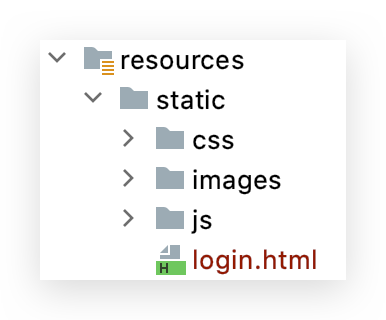
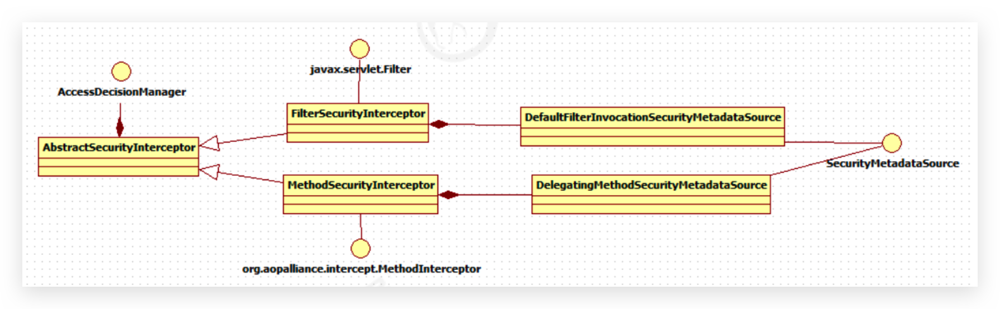

# Spring Boot Security

## 起步

### Maven 依赖

勾选 Web 和 Security

```xml
<dependency>
    <groupId>org.springframework.boot</groupId>
    <artifactId>spring-boot-starter-security</artifactId>
</dependency>
```

security starter 其实是包含了 security 的 config 和 web。其他依赖见代码。


### 测试 Controller

```java
package top.conanan.security.controller;

import org.springframework.web.bind.annotation.GetMapping;
import org.springframework.web.bind.annotation.RequestMapping;
import org.springframework.web.bind.annotation.RestController;

@RestController
@RequestMapping("/test")
public class TestController {

    @GetMapping("/hello")
    public String hello(){
        return "hello spring security";
    }
}
```

其他什么都不需要，此时启动，会发现控制台打印了一段话：

```
Using generated security password: c4386a00-8fe2-43ff-8933-bd124cfe3acc
```

此时访问`/`或其他任意存在不存在的**路径都会**被 Security 拦截并**302 重定向**到`/login`页面，该页面是使用 CDN、Bootstrap 等搭建的登录页面：


其实上述控制台输出即是 Spring Security 自动生成的 user 的 UUID 密码，使用账号 user 登录即可。登录完毕后即可访问 URL

在 Spring Security 中，默认的登录页面和登录接口，都是 `/login` ，只不过一个是 GET 请求（登录页面），另一个是 POST 请求（登录接口）。


这个是自动配置包中 org.springframework.boot.autoconfigure.security.servlet.UserDetailsServiceAutoConfiguration 类配置好的

```java
private String getOrDeducePassword(User user, PasswordEncoder encoder) {
    String password = user.getPassword();
    if (user.isPasswordGenerated()) {
        logger.info(String.format("%n%nUsing generated security password: %s%n", user.getPassword()));
    }

    return encoder == null && !PASSWORD_ALGORITHM_PATTERN.matcher(password).matches() ? "{noop}" + password : password;
}
```

通过`user.getPassword()`进去发现是`SecurityProperties`配置类

```java
@ConfigurationProperties(
    prefix = "spring.security"
)
public class SecurityProperties {
    // ...
}
```

其维护了一个内部类

```java
public static class User {
    private String name = "user";
    private String password = UUID.randomUUID().toString();
    private List<String> roles = new ArrayList();
    private boolean passwordGenerated = true;
    // ...
}
```

由此可以得这个密码是 UUID。


### 配置用户名密码

有上面配置了 @ConfigurationProperties 的 SecurityProperties 类可得，用户名和密码可以配置在配置文件中，防止每次重启后改变。修改 application.yml：

```yml
# spring security
spring:
  security:
    user:
      name: conanan
      password: w111111
```

并且这里的 @ConfigurationProperties 配置类不仅仅是只注入配置文件中的值，它还是**使用 set 方式注入**的（覆盖了显示初始化），且带有逻辑。之后的配置中也可以使用这种方式！

```java
public void setPassword(String password) {
    if (StringUtils.hasLength(password)) {
        // 置为 false 后控制台不会再打印了
        this.passwordGenerated = false;
        this.password = password;
    }
}
```

此后就可以使用用户名 conanan，密码 w111111 来登录了


## 自定义登录页

### 登录页面

自带的太慢且不能方便控制，在项目的如下目录放入写好的登录页面



Login.html 页面的 action 一定要是 `login.html`，且为`POST`**表单请求**（可别改为 Ajax），截取片段如下：

```html
<form class="form" id="form" action="/login.html" method="post">
    <h2>登录</h2>
    <div class="form-control">
        <label for="username">用户名</label>
        <input type="text" id="username" name="username" placeholder="请输入用户名" />
        <small>错误提示</small>
    </div>
    <div class="form-control">
        <label for="password">密码</label>
        <input type="password" id="password" name="password" placeholder="请输入密码" />
        <small>错误提示</small>
    </div>
    <button>提交</button>
</form>
```

此时任意访问`/`或其他路径，由于除了登录页面都被 Spring Security 拦截了，所以当发现未认证时直接重定向到`login.html`。只需输入用户名和密码即可登录成功，且会重定向到之前被拦截的页面。

在 Spring Security 中，如果我们不做任何配置，默认的登录页面和登录接口的地址都是 `/login`，也就是说，默认会存在如下两个请求：

-   GET http://localhost:8080/login
-   POST http://localhost:8080/login

当我们配置了 loginPage 为 `/login.html` 之后，这个配置从字面上理解，就是设置登录页面的地址为 `/login.html`。实际上它还有一个隐藏的操作，就是登录接口地址也设置成 `/login.html` 了。换句话说，新的登录页面和登录接口地址都是 `/login.html`，现在存在如下两个请求：

-   GET http://localhost:8080/login.html
-   POST http://localhost:8080/login.html

前面的 GET 请求用来获取登录页面，后面的 POST 请求用来提交登录数据。

若是需要自定义登录接口，则可以指定`loginProcessingUrl`配置即可

```java
.formLogin()
.loginPage("/login.html")
.loginProcessingUrl("/login")
.permitAll()
```

此时将`login.html`中 action 也修改为`/login`即可

formLogin 的配置都在 FormLoginConfigurer 类中，它继承了 AbstractAuthenticationFilterConfigurer 抽象类，该抽象类的构造方法：

```java
protected AbstractAuthenticationFilterConfigurer() {
    setLoginPage("/login");
}
```

当 FormLoginConfigurer 初始化时，该抽象类也会初始化，所以默认情况下 loginPage 为`login`。

FormLoginConfigurer 的 init 方法中也调用了父类的 init 方法

```java
@Override
public void init(H http) throws Exception {
   super.init(http);
   initDefaultLoginFilter(http);
}
```

父类的 init 中又调用了 updateAuthenticationDefaults 方法：

```java
protected final void updateAuthenticationDefaults() {
    if (loginProcessingUrl == null) {
        loginProcessingUrl(loginPage);
    }
    if (failureHandler == null) {
        failureUrl(loginPage + "?error");
    }

    final LogoutConfigurer<B> logoutConfigurer = getBuilder().getConfigurer(
        LogoutConfigurer.class);
    if (logoutConfigurer != null && !logoutConfigurer.isCustomLogoutSuccess()) {
        logoutConfigurer.logoutSuccessUrl(loginPage + "?logout");
    }
}
```

即没有配置 loginProcessingUrl 时会将其设置为 loginPage，failureHandler 也是类似


### 登录参数

上述登录表单中的参数是 username 和 password，也不用写 JS，也不用写 Java 即可完成登录及参数封装。那这是为什么呢？

查看 FormLoginConfigurer 类中的构造：

```java
public FormLoginConfigurer() {
    super(new UsernamePasswordAuthenticationFilter(), null);
    usernameParameter("username");
    passwordParameter("password");
}
```


## 配置类（内存）

### 安全配置类

```java
@EnableWebSecurity
public class SecurityConfig extends WebSecurityConfigurerAdapter {

    /**
     * 拦截及配置
     */
    @Override
    protected void configure(HttpSecurity http) throws Exception {
        http.authorizeRequests() // 配置需要授权的请求
            .antMatchers("/r/r1").hasAuthority("p1")
            .antMatchers("/r/r2").hasAuthority("p2")
            .anyRequest().authenticated() // 所有请求都需要认证（静态资源需手动释放），或改为指定的url需要认证（就无需释放静态资源）
            // .antMatchers("/r/**").authenticated()// url匹配/r/**的资源，经过认证后才能访问
            .and()
            .formLogin()
            .loginPage("/login.html") // 自定义表单登录页面
            .loginProcessingUrl("/login") // 自定义表单登录接口
            .permitAll() // and 上面这些无需认证
            .and()
            .csrf().disable() // 先把 csrf 关闭（后续讲解后再开启）
            ;
    }


    /**
     * 释放静态资源
     */
    @Override
    public void configure(WebSecurity web) throws Exception {
        web.ignoring().antMatchers("/js/**", "/css/**","/images/**");
    }


    /**
     * 配置用户信息服务（这里就是查询的用户信息，可自定义其他非内存方法）
     * Spring Security 会使用它来获取用户信息。暂时使用InMemoryUserDetailsManager实现类，并在其中分别创建了zhangsan、lisi两个用户，并设置密码和权限。
     */
    @Bean
    public UserDetailsService userDetailsService() {
        // 这里的用户名密码可以理解为数据库或其他地方存储的
        InMemoryUserDetailsManager manager = new InMemoryUserDetailsManager();
        manager.createUser(User.withUsername("conanan").password("w111111").authorities("p1", "p2").build());
        manager.createUser(User.withUsername("zhangsan").password("123").authorities("p1").build());
        manager.createUser(User.withUsername("lisi").password("456").authorities("p2").build());
        return manager;
    }

    // 也可以这样配置，如果需要配置多个用户用 and 相连。相当于就是 XML 标签的结束符
    // 但还是使用官方文档写的上述方式
    /*@Override
    protected void configure(AuthenticationManagerBuilder auth) throws Exception {
        auth.inMemoryAuthentication()
                .withUser("conanan")
                .password("w111111")
                .roles("r1")
                .authorities("p1","p2");
    }*/


    /**
     * 密码加密方式（此处使用不加密的）,Spring Security 会根据此配置来决定密码是否编码
     */
    @Bean
    public PasswordEncoder passwordEncoder() {
        return NoOpPasswordEncoder.getInstance();
    }

}
```


### 配置（无需）

只是用于`/`映射到`/login`，但是此处的`/login`是 Spring Security 提供的，所以必须使用 redirect 重定向到。当然也可以在 Controller 中直接指定，无需在此配置类中声明。其实定义了所有都要认证后，这里可以不配置了

```java
/**
 * 相当于 SpringMVC 的配置
 * <p>
 * 我们有多种方法来配置DispatcherServlet，与之类似，启用Spring MVC组件的方法也不只一种。
 * 从前，Spring是使用XML进行配置的，可以使用<mvc:annotation-driven>启用注解驱动的Spring MVC。
 */
@Configuration
public class WebConfig implements WebMvcConfigurer {

    /* 视图解析器不需要了，直接在 application 配置文件中配置即可 */

    /**
     * 配置视图控制器
     *
     * @param registry
     */
    @Override
    public void addViewControllers(ViewControllerRegistry registry) {
        // /login 是跳转到 spring security 提供的登录页面，而不是自己的（若不写成 redirect 则无法访问到，虽然其他的请求都可以拦截到登录页面，但是这个不行！必须写 redirect）
        registry.addViewController("/").setViewName("redirect:/login");
    }

}
```


### 测试资源

```java
@RestController
@RequestMapping
public class LoginController {


    /**
     * 登录成功后重定向的url
     *
     * @return
     */
    @PostMapping(value = "/login-success", produces = {"text/plain;charset=utf-8"})
    public String loginSuccess() {
        return "登录成功 login-success";
    }


    /**
     * 访问资源r1
     *
     * @param session
     * @return
     */
    @GetMapping(value = "/r/r1", produces = "text/plain;charset=utf-8")
    public String accessR1(HttpSession session) {
        return "访问资源r1";
    }

    /**
     * 访问资源r2
     *
     * @param session
     * @return
     */
    @GetMapping(value = "/r/r2", produces = "text/plain;charset=utf-8")
    public String accessR2(HttpSession session) {
        return "访问资源r2";
    }
}
```

若是没有权限的用户访问，则返回 403（无权限，拒绝访问）


### 认证、授权、会话

此时即可基本测试认证、授权、会话也自动实现了，无需拦截器获取 session 了。下面介绍如何连接数据库来实现。


## ===配置类+ 数据库=== 🔥

## 配置类

接下来使用数据库的方式来完成示例，添加 JPA 及 MySQL 依赖

### 安全配置类

```java
@EnableWebSecurity
public class WebSecurityConfig extends WebSecurityConfigurerAdapter {


    /**
     * 拦截及配置
     *
     * @param http
     * @throws Exception
     */
    @Override
    protected void configure(HttpSecurity http) throws Exception {
        http.authorizeRequests() // 配置需要授权的请求
            .antMatchers("/r/r1").hasAuthority("p1")
            .antMatchers("/r/r2").hasAuthority("p2")
            .anyRequest().authenticated() // 所有请求都需要认证（静态资源需手动释放），或改为指定的url需要认证（就无需释放静态资源）
            // .antMatchers("/r/**").authenticated()// url匹配/r/**的资源，经过认证后才能访问
            .and()
            .formLogin()
            .loginPage("/login.html") // 自定义表单登录页面
            .loginProcessingUrl("/login") // 自定义表单登录接口
            .permitAll() // and 上面这些无需认证
            .and()
            .csrf().disable() // 先把 csrf 关闭（后续讲解后再开启）
            ;
    }


    /**
     * 释放静态资源
     *
     * @param web
     * @throws Exception
     */
    @Override
    public void configure(WebSecurity web) throws Exception {
        web.ignoring().antMatchers("/js/**", "/css/**", "/images/**");
    }


    /**
     * 密码加密方式，Spring Security 会根据此配置来决定密码是否编码
     *
     * @return
     */
    @Bean
    public PasswordEncoder passwordEncoder() {
        return new BCryptPasswordEncoder();
    }
}
```

### BCrypt 加密

这里采用 BCryptPasswordEncoder 加密，测试类如下：

```java
@SpringBootTest
class SecurityApplicationTests {

    @Test
    void testBcrypt() {

        // 对密码加密
        String hashpw1 = BCrypt.hashpw("123", BCrypt.gensalt());
        String hashpw2 = BCrypt.hashpw("123", BCrypt.gensalt());

        System.out.println(hashpw1);// $2a$10$VD2tV49..qSgU6g3UA4rIeqVsXdEQuTigZ5aA2GH9ldkYj6kAL6Au
        System.out.println(hashpw2);// $2a$10$cxbggOZmwj66AQGN9pYXN.SYKpUeX4RMl4BY3Nm6Yn07sg7/8F.ge
        // 结果是两次都不一样（可能是每次获取的 salt 不一样），但是这样在校验时能一致吗？

        // 校验密码
        boolean checkpw1 = BCrypt.checkpw("123", hashpw1);
        boolean checkpw2 = BCrypt.checkpw("123", hashpw2);
        System.out.println(checkpw1 + "," + checkpw2);// true,true

    }


    @Test
    void bcrypt() {
        String hashpw1 = BCrypt.hashpw("w111111", BCrypt.gensalt());
        System.out.println(hashpw1);// $2a$10$mBsCTCQ3jJZa.nEEJSZaku9juKpmYGl8jiRZMND4RMC.Qlh2DtFnS
    }
}
```


## 认证

### 创建数据库

创建 user_db 数据库：

```sql
CREATE DATABASE `user_db` CHARACTER SET 'utf8' COLLATE 'utf8_general_ci';
```

创建 sys_user 表：

```sql
/*
 Navicat Premium Data Transfer

 Source Server         : docker_mysql
 Source Server Type    : MySQL
 Source Server Version : 80021
 Source Host           : localhost:3306
 Source Schema         : user_db

 Target Server Type    : MySQL
 Target Server Version : 80021
 File Encoding         : 65001

 Date: 22/09/2020 00:00:32
*/

SET NAMES utf8mb4;
SET FOREIGN_KEY_CHECKS = 0;

-- ----------------------------
-- Table structure for sys_user
-- ----------------------------
DROP TABLE IF EXISTS `sys_user`;
CREATE TABLE `sys_user` (
  `id` bigint NOT NULL COMMENT '用户id',
  `username` varchar(64) NOT NULL,
  `password` varchar(64) NOT NULL,
  `name` varchar(255) NOT NULL COMMENT '用户姓名',
  `mobile` varchar(11) DEFAULT NULL COMMENT '手机号',
  PRIMARY KEY (`id`) USING BTREE,
  UNIQUE KEY `username_unique` (`username`)
) ENGINE=InnoDB DEFAULT CHARSET=utf8 ROW_FORMAT=DYNAMIC COMMENT='User';

-- ----------------------------
-- Records of sys_user
-- ----------------------------
BEGIN;
INSERT INTO `sys_user` VALUES (1, 'conanan', '$2a$10$mBsCTCQ3jJZa.nEEJSZaku9juKpmYGl8jiRZMND4RMC.Qlh2DtFnS', '本大帅哥', '88888888');
INSERT INTO `sys_user` VALUES (2, 'zhangsan', '$2a$10$VD2tV49..qSgU6g3UA4rIeqVsXdEQuTigZ5aA2GH9ldkYj6kAL6Au', '张三', '8008208820');
COMMIT;

SET FOREIGN_KEY_CHECKS = 1;
```


### UserDetailsService

```java
@Service
public class SpringDataUserDetailsService implements UserDetailsService {

    @Autowired
    private SysUserRepository sysUserRepository;

    @Override
    public UserDetails loadUserByUsername(String username) throws UsernameNotFoundException {
        // 连接数据库，根据 username 查询用户
        SysUser sysUser = sysUserRepository.findUserByUsername(username);
        if (sysUser == null){
            // 查询不到用户，则返回 null，由 AuthenticationManager 接口来抛异常
            return null;
        }

        return User.withUsername(sysUser.getUsername()).password(sysUser.getPassword()).authorities("p1").build();

    }
}
```

这里只实现认证，其余无关


## 会话

用户认证通过后，为了避免用户的每次操作都进行认证可将用户的信息保存在会话中。Spring Security 提供会话管理，认证通过后将身份信息放入 **SecurityContextHolder** 上下文，且与**当前线程进行绑定（ThreadLocal）**，方便获取用户身份。 

### 获取用户身份

```java
private String getUsername() {
    String username;

    // 得到当前认证的用户信息
    Authentication authentication = SecurityContextHolder.getContext().getAuthentication();
    // 得到用户主体
    Object principal = authentication.getPrincipal();

    if (principal == null){
        username = "匿名";
    } else if (principal instanceof UserDetails){
        UserDetails userDetails = (UserDetails) principal;
        username = userDetails.getUsername();
    } else {
        username = principal.toString();
    }

    return username;
}
```


### 会话控制

我们可以通过以下选项准确控制会话何时创建以及Spring Security如何与之交互:

*   ALWAYS：如果没有 session 存在就创建一个
*   NEVER：SpringSecurity 将不会创建Session，但是如果应用中其他地方创建了Session，那么Spring Security将会使用它。
*   **IF_REQUIRED**：如果需要就创建一个Session（默认）登录时
*   **STATELESS（无状态）**：SpringSecurity将绝对不会创建Session，也不使用 Session 

默认情况下，Spring Security 会为每个登录成功的用户会新建一个 Session，就是ifRequired 。 

若选用never，则指示Spring Security对登录成功的用户不创建Session了，但若你的应用程序在某地方新建了 session，那么Spring Security会用它的。 

若使用stateless，则说明Spring Security对登录成功的用户不会创建Session了，你的应用程序也不会允许新建 session。并且它会暗示不使用cookie，所以每个请求都需要重新进行身份验证。这种无状态架构适用于REST API 及其无状态认证机制。

通过以下配置方式对该选项进行配置：

```java
@Override
    protected void configure(HttpSecurity http) throws Exception {
        http.authorizeRequests() // 配置需要授权的请求
                .antMatchers("/r/r1").hasAuthority("p1")
                .antMatchers("/r/r2").hasAuthority("p2")
                .anyRequest().authenticated() // 所有请求都需要认证（静态资源需手动释放），或改为指定的url需要认证（就无需释放静态资源）
                // .antMatchers("/r/**").authenticated()// url匹配/r/**的资源，经过认证后才能访问
                .and()
                .formLogin()
                .loginPage("/login.html") // 自定义表单登录页面
                .loginProcessingUrl("/login") // 自定义表单登录接口
                .permitAll() // and 上面这些无需认证
                .and()
                .csrf().disable() // 先把 csrf 关闭（后续讲解后再开启）
        ;

        // 这里
        http.sessionManagement().sessionCreationPolicy(SessionCreationPolicy.IF_REQUIRED);
    }
```


### 会话超时

可以再sevlet容器中设置Session的超时时间，如下设置Session有效期为3600s； 

spring boot 配置文件： 

```yaml
server:
  servlet:
    session:
      timeout: 3600
```

session超时之后，可以通过Spring Security 设置跳转的路径。 

```java
http.sessionManagement()
                .expiredUrl("/login‐view?error=EXPIRED_SESSION")
                .invalidSessionUrl("/login‐view?error=INVALID_SESSION");
```

expired指session过期（当前版本没有该api了），invalidSession指传入的sessionid无效。 

这里的 URL 都是需要 POST 访问的


### **安全会话**cookie

我们可以使用httpOnly和secure标签来保护我们的会话cookie： 

*   **httpOnly**：如果为true，那么浏览器脚本将无法访问 cookie 

*   **secure**：如果为true，则cookie将仅通过HTTPS连接发送 

Spring Boot 配置如下：

```yaml
server:
  servlet:
    session:
      cookie:
        http-only: true
        secure: true
```


## 退出

### 自定义退出功能

```java
.and()
    .logout()// 1
    .logoutUrl("/logout")
    .logoutSuccessUrl("/login?logout")
    .addLogoutHandler(logoutHandler) // 需自定义
    .logoutSuccessHandler(logoutSuccessHandler) // 需自定义
    .invalidateHttpSession(true)// 默认就是 true
```

1.  提供系统退出支持，使用 WebSecurityConfigurerAdapter 会自动被应用 
2.  设置触发退出操作的URL (默认是 /logout ). 
3.  退出之后跳转的URL。默认是 /login?logout 。 
4.  添加一个 LogoutHandler ，用于实现用户退出时的清理工作，默认 SecurityContextLogoutHandler 会被添加为最后一个 LogoutHandler
5.  定制的 LogoutSuccessHandler ，用于实现用户退出成功时的处理。如果指定了这个选项那么 logoutSuccessUrl() 的设置会被忽略。 
6.  指定是否在退出时让 HttpSession 无效。 默认设置为 **true**。 

注意：如果让 logout 在GET请求下生效，必须关闭防止 CSRF 攻击 `csrf().disable()`。如果开启了CSRF，必须使用 post方式请求/logout


### logoutHandler

一般来说， LogoutHandler 的实现类被用来执行必要的清理，因而他们不应该抛出异常。 

下面是Spring Security提供的一些实现： 

*   PersistentTokenBasedRememberMeServices 基于持久化token的RememberMe功能的相关清理 
*   TokenBasedRememberMeService 基于token的RememberMe功能的相关清理 
*   CookieClearingLogoutHandler 退出时Cookie的相关清理 
*   CsrfLogoutHandler 负责在退出时移除csrfToken 
*   SecurityContextLogoutHandler 退出时SecurityContext的相关清理 

链式API提供了调用相应的 LogoutHandler 实现的快捷方式，比如deleteCookies()。


## 授权

授权的方式包括 Web 授权和方法授权：

*   Web 授权是通过 url 拦截进行授权
*   方法授权是通过方法拦截进行授权

他们都会调用 accessDecisionManager 进行授权决策，若为 Web 授权则拦截器为 **FilterSecurityInterceptor**；若为方法授权则拦截器为 **MethodSecurityInterceptor**。如果同时通过 Web 授权和方法授权则**先执行 Web 授权，再执行方法授权**，最后决策通过，则允许访问资源，否则将禁止访问。



### 创建数据库

在 user_db 数据库创建如下表

角色表

```sql
CREATE TABLE `sys_role` (
	`id` VARCHAR ( 32 ) NOT NULL,
	`role_name` VARCHAR ( 255 ) DEFAULT NULL,
	`description` VARCHAR ( 255 ) DEFAULT NULL,
	`create_time` datetime DEFAULT NULL,
	`update_time` datetime DEFAULT NULL,
	`status` CHAR ( 1 ) NOT NULL,
	PRIMARY KEY ( `id` ),
	UNIQUE KEY `unique_role_name` ( `role_name` ) 
) ENGINE = INNODB DEFAULT CHARSET = utf8;

INSERT INTO `sys_role` ( `id`, `role_name`, `description`, `create_time`, `update_time`, `status` )
VALUES
	( '1', '管理员', NULL, NULL, NULL, '' );
```

用户角色关系表

```sql
CREATE TABLE `sys_user_role_mapping` (
	`user_id` VARCHAR ( 32 ) NOT NULL,
	`role_id` VARCHAR ( 32 ) NOT NULL,
	`create_time` datetime DEFAULT NULL,
	`creator` VARCHAR ( 255 ) DEFAULT NULL,
	PRIMARY KEY ( `user_id`, `role_id` ) 
) ENGINE = INNODB DEFAULT CHARSET = utf8;

INSERT INTO `sys_user_role_mapping` ( `user_id`, `role_id`, `create_time`, `creator` )
VALUES
	( '1', '1', NULL, NULL );
```

权限表

```sql
CREATE TABLE `sys_permission` (
	`id` VARCHAR ( 32 ) NOT NULL,
	`code` VARCHAR ( 32 ) NOT NULL COMMENT '权限标识符',
	`description` VARCHAR ( 64 ) DEFAULT NULL COMMENT '描述',
	`url` VARCHAR ( 128 ) DEFAULT NULL COMMENT '请求地址',
	PRIMARY KEY ( `id` ) 
) ENGINE = INNODB DEFAULT CHARSET = utf8;

INSERT INTO `sys_permission` ( `id`, `code`, `description`, `url` )
VALUES
	( '1', 'p1', '测试资源 1', '/r/r1' ),
	( '2', 'p3', '测试资源2', '/r/r2' );
```

角色权限关系表

```sql
CREATE TABLE `sys_role_permission_mapping`
(
    `role_id`       varchar(32) NOT NULL,
    `permission_id` varchar(32) NOT NULL,
    PRIMARY KEY (`role_id`, `permission_id`)
) ENGINE = InnoDB
  DEFAULT CHARSET = utf8;

insert into `sys_role_permission_mapping`(`role_id`, `permission_id`)
values ('1', '1'),
       ('1', '2');
```


### UserDetailsService

```java

```


