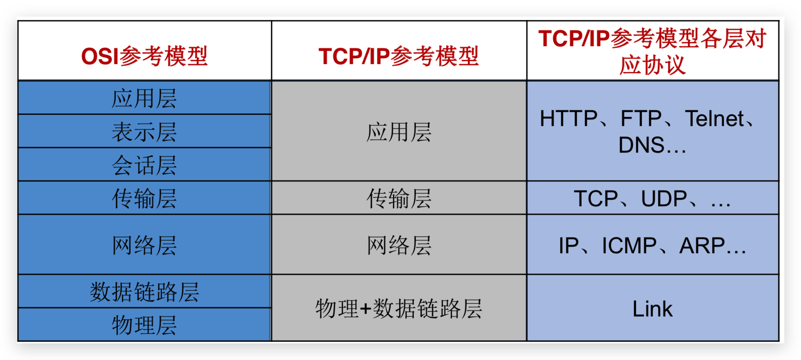
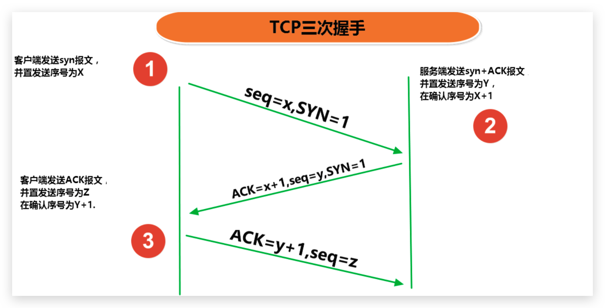
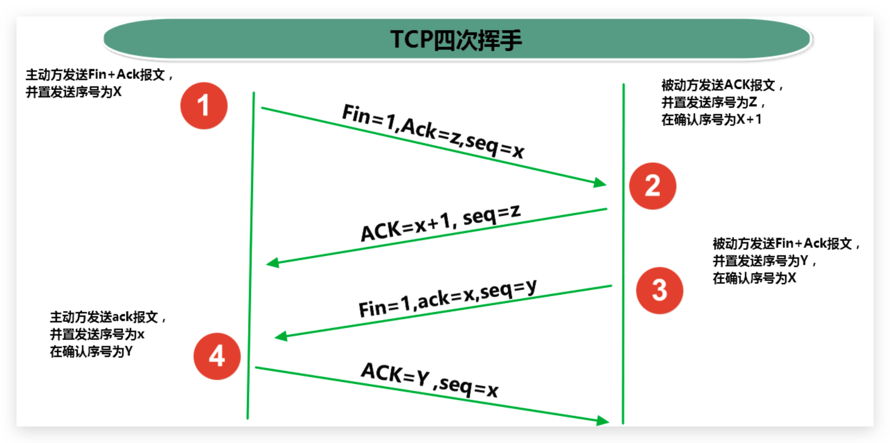

# 11 Network

*   Java是 Internet 上的语言，它从语言级上提供了对网络应用程序的支持，程序员能够很容易开发常见的网络应用程序。Java提供的网络类库，可以实现无痛的网络连接，联网的底层细节被隐藏在 Java 的本机安装系统里，由 JVM 进行控制。并且 Java 实现了一个跨平台的网络库，程序员面对的是一个**统一的网络编程环境**。

*   **软件结构**
    * **C/S结构** ：全称为Client/Server结构，是指客户端和服务器结构。常见程序有ＱＱ、迅雷等软件。
    * **B/S结构** ：全称为Browser/Server结构，是指浏览器和服务器结构。常见浏览器有谷歌、火狐等。

## 11.1 网络编程概述

- **计算机网络**

    是指将分布在不同地理区域的计算机与专门的外部设备通过通信线路互连成一个规模大、功能强的网络系统，从而使众多的计算机可以方便地互相传递信息、共享硬件、软件、数据信息等资源。

- **网络编程**

    直接或间接地通过网络协议与其它计算机实现数据交换，进行通讯。那么牵扯到的问题有：

    *   如何准确地定位网络上一台或多台主机，如何定位主机上的特定的应用
    *   找到主机后如何可靠高效地进行数据传输

- **网络模型**

    - OSI（Open System Interconnection开放系统互连）参考模型
    - TCP/IP参考模型

        

    - 链路层：链路层是用于定义物理传输通道，通常是对某些**网络连接设备的驱动协议**，例如针对光纤、网线提供的驱动。
    - 网络层（互联网层）：网络层是整个TCP/IP协议的**核心**，它主要用于将传输的**数据进行分组**，将分组数据**发送到目标**计算机或者网络。
    - 传输层：主要使网络程序进行通信，在进行**网络通信**时，可以采用**TCP**协议，也可以采用**UDP**协议。
    - 应用层：主要负责**应用程序的协议**，例如HTTP协议、FTP协议等。

## 11.2 网络编程三要素

### 传输协议（通信的规则）

*   **数据报**（Datagram）：网络传输的基本单位 

- **UDP**：**用户数据报协议**(User Datagram Protocol)。UDP是**无连接通信协议**，即在数据传输时，数据的发送端和接收端不建立逻辑连接。由于使用UDP协议**消耗资源小，通信效率高**，所以通常都会用于音频、视频和普通数据的传输。但在使用UDP协议传送数据时，由于UDP的**面向无连接性，不能保证数据的完整性，不可靠**，因此在传输重要数据时不建议使用UDP协议。特点:**数据打包被限制在64kb以内**，超出这个范围就不能发送了。

    使用场景：聊天留言，在线视频（丢帧），视频会议（丢帧），发短信，邮局包裹

- **TCP**：**传输控制协议** (Transmission Control Protocol)。TCP协议是**面向连接的通信协议**，即传输数据之前，在发送端和接收端建立逻辑连接，然后再传输数据，它提供了两台计算机之间**可靠无差错**的数据传输。

    使用场景：下载，浏览网页。打电话，QQ聊天（你在线吗，在线，就回应下，就开始聊天了）

- 在TCP连接中必须要明确客户端与服务器端，由客户端向服务端发出连接请求，在发送数据的准备阶段，客户端与服务器之间的三次交互，以保证连接的可靠，也称为“**三次握手**”。

    

    


### IP地址（InetAddress）

- 指**互联网协议地址**（Internet Protocol Address）：网络中**计算机唯一标识**（通信实体）

- 分类

    - IPv4：是一个**32位**的二进制数，通常被分为4个字节，表示成`a.b.c.d` 的形式，例如`192.168.65.100` 。其中a、b、c、d都是0~255之间的十进制整数，那么最多可以表示42亿个。点分十进制。

    - IPv6：由于互联网的蓬勃发展，IP地址的需求量愈来愈大，但是网络地址资源有限，使得IP的分配越发紧张。为了扩大地址空间，拟通过IPv6重新定义地址空间，采用**128位**地址长度，**每16个字节一组，分成8组十六进制数**，表示成`ABCD:EF01:2345:6789:ABCD:EF01:2345:6789`，号称可以为全世界的每一粒沙子编上一个网址，这样就解决了网络地址资源数量不够的问题。

    - **组成：网络号段 + 主机号段**

        A类：第一号段为网络号段+后三段的主机号段
        	一个网络号：256 * 256 * 256 = 16777216台主机
        B类：前二号段为网络号段+后二段的主机号段
        	一个网络号：256 * 256 = 65536台主机
        C类：前三号段为网络号段+后一段的主机号段
        	一个网络号：256台主机

    - **分类：**

        A类	`1.0.0.1---127.255.255.254`(1)10.X.X.X是私有地址(在互联网上不使用，在局域网络中的地址)

           		  					   								 (2)127.X.X.X是保留地址，用做循环测试用的。

        B类	`128.0.0.1---191.255.255.254`  172.16.0.0-172.31.255.255私有地址。169.254.X.X保留地址。
        C类	`192.0.0.1---223.255.255.254`	192.168.X.X是私有地址
        D类	`224.0.0.1---239.255.255.254`
        E类	`240.0.0.1---247.255.255.254`

    - **两个DOS命令：**
        `ipconfig` 查看本机IP地址等信息
        `ping` 后面跟IP地址。测试本机与指定的IP地址间的通信是否有问题

    - **特殊的IP地址：**
        `127.0.0.1`、`localhost` 回环地址(表示本机)
        `x.x.x.255` 广播地址
        `x.x.x.0` 网络地址

    *   **域名解析**：域名容易记忆，当在连接网络时输入一个主机的域名后，域名服务器（DNS）负责将域名转化成IP地址，这样才能和主机建立连接。

    - `InetAddress类`**的概述和使用**（方便对IP地址的获取和操作）

        - **如果一个类没有构造方法：**

            A:成员全部是静态的(Math,Arrays,Collections)

            B:单例设计模式(Runtime)

            C:类中有静态方法返回该类的对象(InetAddress)

    - 常用方法

        *   `static InetAddress getByName(String host)`:根据**主机名**或**IP地址**字符串得到IP地址**对象**

        *   `String getHostName()`：返回主机名

        *   `String getHostAddress()`：返回IP地址字符串
    
            ```java
            InetAddress inetAddress = InetAddress.getByName("183.192.170.170");// /183.192.170.170
            InetAddress qq = InetAddress.getByName("www.qq.com");// www.qq.com/183.192.170.170
            InetAddress localHost = InetAddress.getLocalHost();// ConanandeMacBook-Pro.local/192.168.1.5 
            
            System.out.println(qq.getHostName());// www.qq.com
            System.out.println(qq.getHostAddress());// 183.192.170.170
            System.out.println(qq.getAddress());// 183.192.170.170
            System.out.println(qq.getCanonicalHostName());// [B@6d6f6e28
            ```
    
    

### 端口号（逻辑端口）

>   **物理端口**：网卡口

* 端口：**正在运行的程序的标识**

- **端口**
    1. 每个网络程序都会至少有一个逻辑端口
    2. 用于标识进程的逻辑地址，不同进程的标识
    3. 有效端口：0~ 65535，其中0~ 1024系统使用或保留端口。

* 常用端口号：
    * HTTP协议端口号：`80`
    * FTP：`21`
    * Telnet：`23`
    * 数据库：MySQL`3306`、Oracle`1521`
    * Tomcat：`8080`


## 11.3 Socket 编程

* 网络上具有唯一标识的**IP地址**和**端口号**组合在一起才能构成唯一能识别的标识符**套接字**

- **Socket原理机制**
    - 通信的两端都有Socket
    - 网络通信其实就是Socket间的通信
    - 数据在两个Socket间通过IO传输
    
- 构造方法

    - `public Socket(InetAddress address,int port) `

        创建一个流套接字并将其连接到指定 IP 地址的指定端口号 

    - `public Socket(String host,int port) `

        创建一个流套接字并将其连接到指定主机上的指定端口号

- 常用方法

    - `InputStream getInputStream()`

        返回此套接字的输入流。可以用于接收网络消息

    - `OutputStream getOutputStream()`

        返回此套接字的输出流。可以用于发送网络消息

    - `InetAddress getInetAddress()`

        返回此套接字连接到的远程 IP 地址；如果套接字是未连接的，则返回 null

    - `netAddress getLocalAddress()`

        获取套接字绑定的本地地址，即本端的IP地址

    - `int getPort()`

        此套接字连接到的远程端口号；如果尚未连接套接字，则返回 0

    - `int getLocalPort()`

        返回此套接字绑定到的本地端口。 如果尚未绑定套接字，则返回 -1

    - `void close()`

        关闭此套接字。套接字被关闭后，便不可在以后的网络连接中使用(即无法重新连接或重新绑定)。需要创建新的套接字对象。 关闭此套接字也将会关闭该套接字的 InputStream 和 OutputStream。

    - `void shutdownInput()`

        如果在套接字上调用 `shutdownInput()` 后从套接字输入流读取内容，则流将返回 `EOF`(**文件结束符**)。 即不能在从此套接字的输入流中接收任何数据。

    - `void shutdownOutput()`

        如果在套接字上调用 `shutdownOutput()` 后从套接字输入流读取内容，则流将返回 `EOF`(**文件结束符**)。 即不能在从此套接字的输入流中接收任何数据。对于 TCP 套接字，任何以前写入的数据都将被发送，并且后跟 TCP 的正常连接终止序列。 如果在套接字上调用 `shutdownOutput()` 后写入套接字输出流， 则该流将抛出 IOException，即不能通过此套接字的输出流发送任何数据

### TCP（ServerSocket、Socket）

* `java.net.ServerSocket`：这个类**实现了服务器套接字**，该对象等待通过网络的请求。

    * `ServerSocket(int port)` 使用该构造方法在**创建ServerSocket对象**时，就可以将其绑定到一个指定的端口号上，参数`port`就是端口号。
    * `Socket accept()` ：**侦听并接受连接**，返回一个新的Socket对象，用于和客户端实现通信。**该方法会一直阻塞直到建立连接**。 
    * `void close()` ：**关闭此套接字**。详细介绍如Socket中`close`方法

* `java.net.Socket`：该类**实现客户端套接字**，套接字指的是两台设备之间通讯的端点。

    - `Socket(InetAddress inet/String host, int port)`

        - **创建套接字对象**并将其连接到**指定主机**上的**指定端口号**，**创建的同时会自动向服务器方发起连接**。

    - `InputStream getInputStream()` 

        - 返回此**套接字的输入流**。
        - 如果此Scoket具有相关联的通道，则生成的InputStream 的所有操作也关联该通道。
        - 关闭生成的InputStream也将关闭相关的Socket。

    - `OutputStream getOutputStream()` 

        - 返回此**套接字的输出流**。
        - 同上两条

    - `void close()` 

        - **关闭此套接字**。
        - 一旦一个socket被关闭，它不可再使用。
        - 关闭此socket也将关闭相关的InputStream和OutputStream 。 

    - `void shutdownOutput()` 

        - **禁用此套接字的输出流**。   
        - **任何先前写出的数据将被发送**，并且后跟 TCP 的正常连接**终止序列**。 

        > **服务器使用客户端的流和客户端交互**
        >
        > IO流中各**read**方法在**没有输入可用时将阻塞**，并且**在通道中输入流是读不到结束标记**的，所以需要**shutdownOutput**方法来发送数据并**带上终止序列**。


* **服务器端接收数据（ServerSocket）**

    ```java
    // 1.创建TCP服务器端的Socket对象
    ServerSocket ss = new ServerSocket(60001);
    
    // 2.监听客户端连接
    Socket s = ss.accept();
    
    // 3.获取套接字的输入流，读取数据
    InputStream is = s.getInputStream();
    
    // 此处使用 ByteArrayOutputStream 替代 StringBuilder
    ByteArrayOutputStream baos = new ByteArrayOutputStream();
    byte[] buffer = new byte[1024];
    int len;
    while((len = is.read(buffer)) != -1){
      baos.write(buffer,0,len);
    }
    System.out.println("收到了来自于：" + socket.getInetAddress().getHostAddress() + "的数据："+ baos.toString());
    
    // 如下写法可能产生乱码
    /*byte[] bys = new byte[1024];
    int len = is.read(bys);
    System.out.println(new String(bys,0,len));*/
    
    // 4.释放资源
    baos.close();
    s.close();// 服务端一般不关闭
    ```

* **客户端发送数据（Socket）**

    ```java
    // 1.创建TCP客户端的Socket对象
    Socket s = new Socket("192.168.81.1", 60001);
    		
    // 2.获取套接字的输出流，写数据
    OutputStream os = s.getOutputStream();
    os.write("hello java world".getBytes());
    	
    // 3.释放资源
    s.close();
    ```


####  上传文件

* **文件名称写死的问题**：建议使用系统时间优化，保证文件名称唯一

    ```java
    FileOutputStream fis = new FileOutputStream(System.currentTimeMillis()+".jpg")
    ```

* **循环接收的问题**：服务端不应保存一个文件就关闭，需要不断的接收不同用户的文件，使用**循环**改进

    ```java
    // 让服务器一致处于监听状态。每次接收新的连接,创建一个Socket
    while（true）{
      Socket accept = serverSocket.accept();
      // ......
    }
    ```

* **效率问题**：服务端，在接收大文件时耗费时间长，此时不能接收其他用户上传，使用**多线程**技术优化

    ```java
    while（true）{
      Socket accept = serverSocket.accept();
      // accept 交给子线程处理.
      new Thread(() -> {
        // ......
        InputStream bis = accept.getInputStream();
        // ......
      }).start();
    }
    //并且由于接口中没有抛异常，所以实现类中也不能抛异常，只能try...catch
    ```

#### 上传文件带反馈（多线程）

*   Server

    ```java
    public class Server {
    
      public static void main(String[] args) throws IOException {
        ServerSocket serverSocket = null;
        try {
          serverSocket = new ServerSocket(8888);
        } catch (IOException e) {
          e.printStackTrace();
        }
    
        // 服务端循环接收不同客户端请求
        while (true) {
          // 监听到客户端请求并建立连接
          Socket socket = serverSocket.accept();
          // 利用lambda实现多线程，让每个用户的线程不受其他线程影响（ServerSocket属于服务端，不能在多线程里）。并由于接口没有抛异常，所以以下用try捕获
          new Thread(() -> {
            BufferedInputStream bis = null;
            BufferedOutputStream bos = null;
            BufferedWriter bw = null;
            try {
              // 检查上传文件的目录是否存在文件
              File path = new File("./upload/");
              if (!path.exists()) {
                path.mkdirs();
              }
              File uploadFile = new File(path, System.currentTimeMillis() + ".jpg");
    
              // 将从网络通道中的文件读取并写入磁盘
              bis = new BufferedInputStream(socket.getInputStream());
              bos = new BufferedOutputStream(new FileOutputStream(uploadFile));
              byte[] buffer = new byte[1024];
              int len;
              // 只有接收到 Client  Outputd 的结束序列，如下读取操作才会结束，否则一直阻塞
              while ((len = bis.read(buffer)) != -1) {
                bos.write(buffer, 0, len);
              }
    
              // 回应客户端上传完毕
              bw = new BufferedWriter(new OutputStreamWriter(socket.getOutputStream(), StandardCharsets.UTF_8));
              bw.write("上传完毕");
              bw.newLine();
              bw.flush();// 这个不能丢！
    
            } catch (IOException e) {
              e.printStackTrace();
            } finally {
              try {
                // 这里的关闭资源应该分别 try-catch
                if (bw != null) {
                  bw.close();
                }
                if (bos != null) {
                  bos.close();
                }
                if (socket != null) {
                  socket.close();// close本身也抛异常。由于是多线程，每个线程使用的不同socket，所以socket可以关闭
                }
              } catch (IOException e) {
                e.printStackTrace();
              }
            }
          }).start();
        }
      }
    }
    ```

*   Client

    ```java
    public class Client {
    
      public static void main(String[] args) {
    
        Socket socket = null;
        BufferedInputStream bis = null;
        BufferedOutputStream bos = null;
        ByteArrayOutputStream baos = null;
        try {
          socket = new Socket("127.0.0.1", 8888);
          bis = new BufferedInputStream(new FileInputStream("1.jpg"));
          bos = new BufferedOutputStream(socket.getOutputStream());
          // 关闭 Socket 会自动关闭。手动关闭会导致 Broken pipe 或 因为调用 write 方法 flush 而抛异常
    
          //将本地磁盘文件读取并写入网络通道中
          byte[] bytes = new byte[1024];
          int len;
          while ((len = bis.read(bytes)) != -1) {
            bos.write(bytes, 0, len);
          }
          //发送数据并带上终止序列，以便服务器读取时可以读到终止序列
          socket.shutdownOutput();
    
          //读取网络通道中服务器回应的数据并打印
          //br = new BufferedReader(new InputStreamReader(socket.getInputStream(), StandardCharsets.UTF_8));
          InputStream is = socket.getInputStream();
          baos = new ByteArrayOutputStream();
          byte[] buffer = new byte[1024];
          int len1;
          while ((len1 = is.read(buffer)) != -1) {
            baos.write(buffer, 0, len1);
          }
          System.out.println(baos);
    
        } catch (IOException e) {
          e.printStackTrace();
        } finally {
          try {
            if (baos!=null){
              baos.close();
            }
            if (bis != null) {
              bis.close();
            }
            if (socket != null) {
              socket.close();
            }
          } catch (IOException e) {
        e.printStackTrace();
          }
        }
      }
    }
    ```
    
    


### UDP（DatagramSocket、Datagrampacket）

*   DatagramSocket构造方法

    *   `DatagramSocket(int port)`

        创建数据报套接字并将其绑定到本地主机上的指定端口。套接字将被绑定到通配符地址，IP 地址由内核来选择

    *   `DatagramSocket(int port,InetAddress laddr)`

        创建数据报套接字，将其绑定到指定的本地地址。 本地端口必须在 0 到 65535 之间(包括两者)。如果 IP 地址为 0.0.0.0，套接字将被绑定到通配符地址，IP 地址由内核选择。

*   DatagramSocket常用方法

    *   `void send(DatagramPacket p)`

        从此套接字发送数据报包。DatagramPacket 包含的信息指示：将要发送的数据、其长度、远程主机的 IP 地址和远程主机的端口号

    *   `void receive(DatagramPacket p)`

        从此套接字接收数据报包。当此方法返回时，DatagramPacket的缓冲区填充了接收的数据。数据报包也包含发送方的 IP 地址和发送方机器上的端口号。 此方法在接收到数据报前一直**阻塞**。数据报包对象的 length 字段包含所接收信息的长度。如果信息比包的长度长，该信息将被截短。

    *   `InetAddress getLocalAddress()`

        获取套接字绑定的本地地址

    *   `int getLocalPort()`

        返回此套接字绑定的本地主机上的端口号

    *   `InetAddress getInetAddress()`

        返回此套接字连接的地址。如果套接字未连接，则返回 null

    *   `int getPort()`

        返回此套接字的端口。如果套接字未连接，则返回 -1 

    *   `void close()`

        关闭此数据报套接字 

*   DatagramPacket构造方法

    *   `DatagramPacket(byte[] buf,int length)`

        构造 DatagramPacket，用来接收长度为 length 的数据包。 length 参数必须小于等于 buf.length

    *   `DatagramPacket(byte[] buf,int length,InetAddress address,int port)`

        构造数据报包，用来将长度为 length 的包发送到指定主机上的指定端口号。length 参数必须小于等于 buf.length

*   DatagramPacket常用方法

    *   `InetAddress getAddress()`

        返回某台机器的 IP 地址，此数据报将要发往该机器或者是从该机器接收到的

    *   `int getPort()`

        返回某台远程主机的端口号，此数据报将要发往该主机或者是从该主机接收到的

    *   `byte[] getData()`

        返回数据缓冲区。接收到的或将要发送的数据从缓冲区中的偏移量 offset 处开始，持续 length 长度

    *   `int getLength()`

        返回将要发送或接收到的数据的长度

*   **UDP协议接收数据**

* ```java
    // 创建接收端DatagramSocket对象，指定 PORT
    DatagramSocket   = new DatagramSocket(10086);
    
    // 创建一个数据包(接收容器)，调用DatagramSocket对象的接收方法接收数据
    byte[] bys = new byte[1024];
    DatagramPacket dp = new DatagramPacket(bys, bys.length);// 简写，实际应该循环接收
    ds.receive(dp);
    
    // 解析数据包，并显示在控制台
    String ip = dp.getAddress().getHostAddress();
    String msg = new String(dp.getData(), 0, dp.getLength());
    System.out.println(ip+":"+msg);
    
    //ds.close();//接收端应该一直开着
    ```

* **UDP协议发送数据**

    ```java
    // 创建发送端DatagramSocket对象
    DatagramSocket ds = new DatagramSocket();
    
    ```

// 创建数据，并把数据打包DatagramPacket，指定发送的 IP 和 PORT
    byte[] bys = "helloworld".getBytes();
    InetAddress address = InetAddress.getByName("Conanan");
    int port = 10086;
    DatagramPacket dp = new DatagramPacket(bys, bys.length, address, port);
    
    // 调用DatagramSocket对象的发送方法发送数据包
    ds.send(dp);
    // 释放资源
    ds.close();
    ```


#### 多线程实现聊天室

```java
//主线程
public class MainDemo {
	public static void main(String[] args) throws IOException {
		DatagramSocket receiveSocket = new DatagramSocket(10086);
		DatagramSocket sendSocket = new DatagramSocket(10000);

		ReceiveThread rt = new ReceiveThread(receiveSocket);
		SendThread st = new SendThread(sendSocket);
		Thread t1 = new Thread(rt);
		Thread t2 = new Thread(st);
		t1.start();
		t2.start();
		......
}
//接收端
public class ReceiveThread implements Runnable {
	private DatagramSocket ds;
	public ReceiveThread(DatagramSocket ds) {
		this.ds = ds;
	}
	@Override
	public void run() {
		while (true) {
			byte[] bys = new byte[1024];
			DatagramPacket dp = new DatagramPacket(bys, bys.length);
			try {
				ds.receive(dp);
			} catch (IOException e) {
				e.printStackTrace();
			}
			String msg = new String(dp.getData(), 0, dp.getLength());
			System.out.println("ip:"+dp.getAddress()+",port:"+dp.getPort()+",msg:"+msg);

//发送端
public class SendThread implements Runnable {
	private DatagramSocket ds;
	public SendThread(DatagramSocket ds) {
		this.ds = ds;
	}
	@Override
	public void run() {
		Scanner sc = new Scanner(System.in);
		String str = sc.nextLine();
		while (!str.equals(null)) {
			if (str.equals("886")) {
				ds.close();
				break;
			} else {
				byte[] bys = str.getBytes();
				InetAddress address = null;
				try {
					address = InetAddress.getByName("Conanan");
					DatagramPacket dp=new DatagramPacket(bys, bys.length, address, 10086);
					ds.send(dp);
					str = sc.nextLine();
				} catch (IOException e) {
					e.printStackTrace();

```


## 11.4 URL 编程

*   URL(Uniform Resource Locator)：统一资源定位符，它表示 Internet 上某一资源的地址，它是一种具体的URI，即URL可以用来标识一个资源，而且还指明了如何 locate 这个资源。通过 URL 我们可以访问 Internet 上的各种网络资源，比如最常见的 www，ftp 站点。浏览器通过解析给定的 URL 可以在网络上查找相应的文件或其他资源

*   URL的基本结构由5部分组成

    `<传输协议>://<主机名>:<端口号>/<文件名>#片段名?参数列表 `

    *   http://conanan.top:8080/helloworld/index.jsp#a?username=shkstart&password=123

    *   **#片段名**：即锚点，例如看小说，直接定位到章节
    *   **参数列表格式**：`参数名=参数值&参数名=参数值....`

### URL类

*   构造方法`java.net.URL`

    *   `URL (String spec)`

        通过一个表示URL地址的字符串可以构造一个URL对象。如`new URL ("http://www.qq.com/");`

    *   `URL(URL context, String spec)`

        通过基 URL 和相对 URL 构造一个 URL 对象。如`new URL(url, “download.html");`

    *   `URL(String protocol, String host[, int port], String file)`

        如`new URL("http","www.atguigu.com", “download.html");`

        如`new URL("http", "www.atguigu.com", 80, “download.html");`

    URL类的构造器都声明抛出非运行时异常，必须要对这一异常进行处理，通 常是用 try-catch 语句进行捕获。

*   常用方法

    *   `String getProtocol()` 协议名，如：`http `
    *   `String getHost()` 主机名，如：`www.qq.com`
    *   `String getPort()` 端口号，如：`80`
    *   `String getPath()` 文件路径，如：`/examples/beauty.jpg`
    *   `String getFile()` 文件名，如：`/examples/beauty.jpg?username=Tom`
    *   `String getQuery()` 查询名，如：`username=Tom`


### 针对HTTP协议的URLConnection类

*   URL的方法 `openStream()`：能从网络上读取数据

*   若希望输出数据，例如向服务器端的 CGI (公共网关接口-Common Gateway Interface-的简称，是用户浏览器和服务器端的应用程序进行连接的接口)程序发送一 些数据，则必须先与URL建立连接，然后才能对其进行读写，此时需要使用 URLConnection 。

*   URLConnection：表示到URL所引用的远程对象的**连接**。当与一个URL建立连接时， 首先要在一个 URL 对象上通过方法 `openConnection()` 生成对应的 URLConnection 对象。如果连接过程失败，将产生IOException.

    ```java
    URL url = new URL ("http://www.atguigu.com/index.shtml");
    URLConnectonn u = url.openConnection( );
    ```

*   通过URLConnection对象获取的输入流和输出流，即可以与现有的CGI 程序进行交互

    *   `public Object getContent() throws IOException `
    *   `public int getContentLength()`
    *   `public String getContentType()`
    *   `public long getDate() `
    *   `public long getLastModified()`
    *   `public InputStream getInputStream() throws IOException`
    *   `public OutputSteram getOutputStream() throws IOException `


### URI、URL和URN的区别

*   URI，是uniform resource identifier，统一资源标识符，用来唯一的标识一个资源。
*   URL是uniform resource locator，统一资源定位符，它是一种具体 的URI，即URL可以用来标识一个资源，而且还指明了如何locate这个资源
*   URN，uniform resource name，统一资源命名，是通过名字来标识资源， 比如mailto:java-net@java.sun.com

也就是说，URI是以一种抽象的，高层 次概念定义统一资源标识，而URL和URN则是具体的资源标识的方式。URL 和 URN都是一种URI。

在Java的URI中，一个URI实例可以代表绝对的，也可以是相对的，只要它符 合URI的语法规则。而URL类则 不仅符合语义，还包含了定位该资源的信息，因此它不能是相对的。


