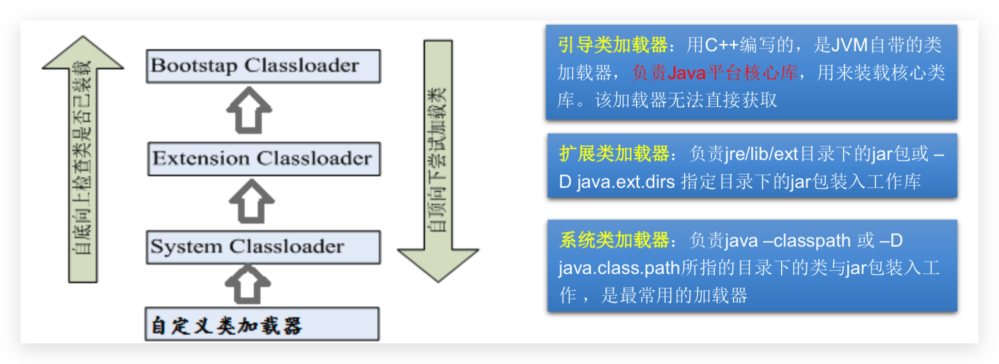
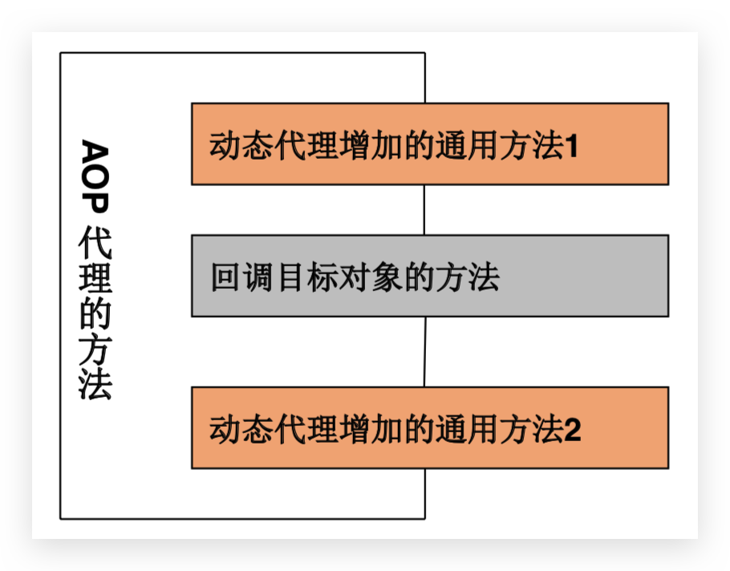

# 12 Reflect—java.lang.reflect

[[toc]]

## 12.1 反射简介

*   Reflection(反射)是被视为动态语言的关键，反射机制允许程序在**执行期**借助于Reflection API取得任何类的内部信息，并能直接操作任意对象的内部属性及方法。

>   动态语言：是一类在运行时可以改变其结构的语言。例如新的函数、对象、甚至代码可以被引进，已有的函数可以被删除或是其他结构上的变化。通俗点说就是在运行时代码可以根据某些条件改变自身结构。 主要动态语言有Object-C、C#、JavaScript、PHP、Python、Erlang
>
>   静态语言：与动态语言相对应的，运行时结构不可变的语言就是静态语言。如Java、C、 C++。 
>
>   Java不是动态语言，但Java可以称之为“准动态语言”。即Java有一定的动 态性，我们可以利用反射机制、字节码操作获得类似动态语言的特性。 Java的动态性让编程的时候更加灵活!


> 反射是框架设计的灵魂。框架：半成品软件。可以在框架的基础上进行软件开发，简化编码
>
> 通过直接new的方式或反射的方式都可以调用公共的结构，开发中到底用那个？
>
> *   推荐 new，除非编译期不确定 new 的对象，如 SpringMVC 中 URL 映射

* Java 反射机制是在**运行状态中**，对于任意一个**类**，都能够**获得**这个类的**所有属性和方法**；对于任意一个**对象**，都能够**调用**它的任意一个**属性和方法**；**能够分析类能力的程序称为反射**。

    加载完类之后，在堆内存的方法区中就产生了一个Class类型的对象(一个类只有一个Class对象)，这个对象就包含了完整的类的结构信息。我们可以通过这个对象看到类的结构。这个对象就像一面镜子，透过这个镜子看到类的结构，所以，我们形象的称之为反射。

* **原理：**

    2. **`javac`命令编译`.java`文件，生成一个或多个`.class`文件**
    3. **JVM通过类加载器将`.class`文件加载到内存中，用`Class`类表示（Java中万事万物皆对象），可通过 `java` 命令解释运行**
    4. **得到了这个`Class`类之后，就可以得到`.class`文件里面的所有内容**
    
* 好处

    * 可以在**程序运行过程中，操作这些对象**。如IDE中代码提 示
    * 可以**解耦，提高程序的可扩展性**

* 反射相关的主要API

    * `java.lang.Class`:代表一个类
    * `java.lang.reflect.Field`:代表类的成员变量
    * `java.lang.reflect.Constructor`:代表类的构造器 
    * `java.lang.reflect.Method`:代表类的方法


## 12.2 类的加载及ClassLoader

* 当程序要使用某个类时，如果该类还未被加载到内存中，则系统会通过加载，连接，初始化三步来实现对这个类进行初始化 

    **加载** 

    - 将`.class`文件字节码内容加载到内存中，并将这些静态数据转换成**方法区**的运行时数据结构，然后生成一个代表这个类的`java.lang.Class`对象，作为方法区中类数据的访问入口（即引用地址）。所有需要访问和使用类数据只能通过这个`Class`对象。这个加载的过程需要类加载器参与。
    - 类缓存：标准的JavaSE类加载器可以按要求查找类，但一旦某个类被加载到类加载器中，它将维持加载(缓存)一段时间。不过JVM垃圾回收机制可以回收这些Class对象。

    **连接**：将Java类的二进制代码合并到JVM的运行状态之中的过程 

    - 验证：确保加载的类信息符合JVM规范，例如以cafe开头，没有安全方面的问题 
    - 准备：正式为类变量(static)分配内存并设置**类变量默认初始值**的阶段，这些内存 都将在方法区中进行分配。 
    - 解析：虚拟机常量池内的符号引用(常量名)替换为直接引用(地址)的过程 

    **初始化**

    - 执行**类构造器**`<clinit>()`方法的过程。**类构造器`<clinit>()`方法是由编译期自动收集类中所有类变量的赋值动作和静态代码块中的语句合并产生的**。(类构造器是构造类信息的，不是构造该类对象的构造器)。
    - 当初始化一个类的时候，如果发现其父类还没有进行初始化，则需要先触发其父类的初始化。
    - 虚拟机会保证一个类的`<clinit>()`方法在多线程环境中被正确加锁和同步。

* **类初始化时机**

    * 类的主动引用（一定会发生类的初始化）
        * 直接使用java.exe命令来运行某个主类，当虚拟机启动，先初始化`main`方法所在的类
        * new一个类的对象（创建类的实例）
        * 调用类的静态成员（除了final常量），或者为静态变量赋值
        * 调用类的静态方法
        * 使用`java.lang.reflect`包的方法来强制创建某个类或接口对应的`java.lang.Class`对象
        * 当初始化一个类，如果其父类没有被初始化，则先会初始化它的父类
    * 类的被动引用（不会发生类的初始化）
        * 当访问一个静态域时，**只有真正声明这个域的类才会被初始化**
            当通过子类引用父类的静态变量，不会导致子类初始化
        * 通过数组定义类引用，不会触发此类的初始化
        * 引用常量不会触发此类的初始化（常量在链接阶段就存入调用类的常量池中了）


* **类加载器**（负责将**`.class`文件加载**到内存中，并为之**生成**对应的**`Class`对象**）

    * Bootstrap ClassLoader：**引导类加载器**

        负责JDK中`jre/lib`目录下`rt.jar`文件中**Java核心类的加载**，比如System、String等

    * Extension ClassLoader：**扩展类加载器** 

        负责JDK中`jre/lib/ext`目录下或`-D java.ext.dirs`指定目录下**jar包**的加载

    * System(Application) ClassLoader：**系统类加载器**

         JVM 启动时，负责`java -classpath`或`-D java.class.path`所指目录下的类与 jar 包的加载

        

* **类加载器的方法**

    * `clazz.getClassLoader()`

        **获得类加载器**

    * `classLoader.getParent()`

        获取类加载器的类加载器

        ```java
        // 如下在 OpenJDK11 测试
        ClassLoader classLoader1 = ReflectTest.class.getClassLoader();
        System.out.println(classLoader1);// jdk.internal.loader.ClassLoaders$AppClassLoader@2c13da15
        
        ClassLoader classLoader2 = classLoader1.getParent();
        System.out.println(classLoader2);// jdk.internal.loader.ClassLoaders$PlatformClassLoader@2d209079
        
        ClassLoader classLoader3 = classLoader2.getParent();
        System.out.println(classLoader3);// null，Bootstrap ClassLoader 无法获取到
        
        // 在 OpenJDK8 中测试如下
        // sun.misc.Launcher$AppClassLoader@18b4aac2
        // sun.misc.Launcher$ExtClassLoader@6d6f6e28
        // null
        ```

    * `classLoader.getResource(name)`

        **获取相对classes（out或src）下 的任何URL资源**，name是资源路径，不能以`/`开头

        ```java
        URL url = clazz.getResource("test.txt")；
        String path = url.getPath();
        ```

    * `InputStream classLoader.getResourceAsStream`就是上面的进行了封装简化后的版本

>   读取配置文件方式：
>
>   *   IDEA 中**@Test 相对于 Module **，若是 **main 方法则相对于 Project**
>   *   ClassLoader 的 getResource 或 getResourceAsStream 方法获取相对classes（out或src）下的任何URL资源

## 12.2 Class

### Class 简介

* **获取**字节码文件`Class`类型对象 

    *   `Calss<Student> c = Student.class`通过**类名**得到。多用于参数传递
    *   `Class<Student> c = stu.getClass()`通过**对象**得到，Object类中的方法。多用于对象获取字节码
    *   `Class<Student> c = Class.forName(String name)`：包括包名的全类名。多用于配置文件
        *   `String getName();`获取全类名
        *   `String getPackageName();`获取包名
    *   `Class<Student> c = clazz.getClassLoader().loadClass(String name)` 类加载器

    **同一个字节码文件`*.class`在一次程序运行过程中只会被加载一次，以上方式获取的`Class`对象都是同一个。**

* 哪些类型可以有 `Class` 对象

    * class：外部类，成员（成员内部类，静态内部类），局部内部类，匿名内部类，如`Object.class`

    * interface：接口，如`Comparable.class`

    * Array：数组，如`int[][].class`

    * Enum：枚举，如`ElementType.class`

    * Annotation：注解@interface，如`Override.class`

    * primitive type：基本数据类型，如`int.class`

    * void：如`void.class`

    * Class：如`Class.class`本身

        那么问题来了，看下面

        ```java
        int[] a = new int[10];
        int[] b = new int[100];
        Class c10 = a.getClass();
        Class c100 = b.getClass();
        System.out.println(c10 = c100);// true
        ```

        结论：只要数组的**元素类型**和**纬度**一样，就是同一个 Class

* **通过反射分析类的能力**：**域(成员变量)**、**构造器**、**方法**

    * **不带Declare**返回类提供的**public**域、方法和构造器的**数组**，包括**超类的公有成员**

    * **带Declare**返回类提供的**全部**域、方法和构造器，**包括私有和保护成员**，但不包括超类的成员

        操作私有成员时**`setAccessible(flag)`**中flag设置为true

    ```java
//若类中没有域(成员变量)或者Class对象描述的是基本类型或数组类型，则返回一个长度为0的数组
    Field get(Declare)Field(String name)
    Field[] get(Declare)Fields()
    
    Method get(Declare)Method(String name, Class<?>... parameterTypes)
    Method[] get(Declare)Methods()
    
    //使用Class对象的newInstance()来创建！但该类必须提供空参构造器，且权限必须够，通常为 public。Java9 及之后过时
    Person o = clazz.getInstance();
    //可以通过Constructor对象的newInstance(可传递参数列表)来创建对象；
    Constructor<T> get(Declare)Construcotr(Class<?>... parameterTypes)//返回一个构造器
    Constructor[] get(Declare)Construcotrs()
    //以上其底层都是调用构造器来创建对象
    
    setAccessible(boolean b)//为以上三种反射对象设置可访问标志，true为屏蔽java语言访问检查
    ```
    
    ```java
    // 单个构造,无参构造可不带.class;传递参数类型
    Constructor<Person> con = clazz.getConstructor(String.class, int.class, String.class);
Person obj = con.newInstance("zhangsan", 33, "beijing");
    //Object o = c.newInstance();//若调用空参构造可以直接使用Class类的newInstance()方法。在Java9开始弃用
    String name = con.getName();//获取构造方法名称
     
    // 单个域、属性
    Field field = clazz.getDeclaredField("name");
    field.setAccessible(true);
    field.set(obj, "lisi");//set
    Object objField = field.get(obj);//get
    String name = field.getName();//获取域名即成员变量名
    System.out.println(objField);
    
    // 单个方法,不带参可不写.class;传递参数类型
    Method method = clazz.getDeclaredMethod("add", int.class, int.class);
    Object objMethod = method.invoke(obj, 10, 20);
    //操作静态方法时，第一个参数为null，不需要实例
    Object objMethod = method.invoke(null, 10, 20);
    //获取方法名
    String name = method.getName();
    System.out.println(objMethod);
    ```


### 获取运行时类的完整结构 

*   实现的全部接口

    *   `public Class<?>[] getInterfaces() `

        确定此对象所表示的类或接口实现的接口。 

*   所继承的父类

    *   `public Class<? Super T> getSuperclass()`

        返回表示此 Class 所表示的实体(类、接口、基本类型)的父类的 Class。 

*   全部的构造器

    *   `public Constructor<T>[] getConstructors()`

        返回此 Class 对象所表示的类的所有public构造方法。 

    *   `public Constructor<T>[] getDeclaredConstructors() `

        返回此 Class 对象表示的类声明的所有构造方法。

    *   Constructor类中：

        *   取得修饰符：`public int getModifiers()`
        *   取得方法名称：`public String getName()`
        *   取得参数的类型：`public Class<?>[] getParameterTypes()`

*   全部的方法

    *   `public Method[] getMethods() `

        返回此Class对象所表示的类或接口的public的方法

    *   `public Method[] getDeclaredMethods() `

        返回此Class对象所表示的类或接口的全部方法

    *   Method类中：

        *   `public Class<?> getReturnType()`取得全部的返回值
        *   `public Class<?>[] getParameterTypes()`取得全部的参数 
        *   `public int getModifiers()`取得修饰符
        *   `public Class<?>[] getExceptionTypes()`取得异常信息 

*   全部的Field

    *   `public Field[] getFields() `

        返回此Class对象所表示的类或接口的public的Field。 

    *   `public Field[] getDeclaredFields() `

        返回此Class对象所表示的类或接口的全部Field。 

    *   Field方法中：

        *   `public int getModifiers()` 以整数形式返回此Field的修饰符 
        *   `public Class<?> getType()` 得到Field的属性类型 
        *   `public StringgetName()` 返回Field的名称。 

*   Annotation相关

    *   `get Annotation(Class<T> annotationClass) `
    *   `getDeclaredAnnotations()`

*   Generic

    *   获取父类泛型类型：`Type getGenericSuperclass() `
    *   泛型类型：`ParameterizedType `
    *   获取实际的泛型类型参数数组：`getActualTypeArguments() `

*   类所在的包

    *   `Package getPackage()`

```java
public class Creature<T> implements Serializable {
  private char gender;
  public double weight;

  private void breath(){
    System.out.println("生物呼吸");
  }

  public void eat(){
    System.out.println("生物吃东西");
  }
}
//--------------------------
public interface MyInterface {
    void info();
}
//--------------------------
@Target({TYPE, FIELD, METHOD, PARAMETER, CONSTRUCTOR, LOCAL_VARIABLE})
@Retention(RetentionPolicy.RUNTIME)
public @interface MyAnnotation {
    String value() default "hello";

}
//--------------------------
@MyAnnotation(value="hi")
public class Person extends Creature<String> implements Comparable<String>,MyInterface{

  private String name;
  int age;
  public int id;

  public Person(){}

  @MyAnnotation(value="abc")
  private Person(String name){
    this.name = name;
  }

  Person(String name,int age){
    this.name = name;
    this.age = age;
  }
  @MyAnnotation
  private String show(String nation){
    System.out.println("我的国籍是：" + nation);
    return nation;
  }

  public String display(String interests,int age) throws NullPointerException,ClassCastException{
    return interests + age;
  }

  @Override
  public void info() {
    System.out.println("我是一个人");
  }

  @Override
  public int compareTo(String o) {
    return 0;
  }

  private static void showDesc(){
    System.out.println("我是一个可爱的人");
  }

  @Override
  public String toString() {
    return "Person{" +
      "name='" + name + '\'' +
      ", age=" + age +
      ", id=" + id +
      '}';
  }
}
```

#### Field

```java
public class FieldTest {

  @Test
  public void test1(){

    Class clazz = Person.class;

    //获取属性结构
    //getFields():获取当前运行时类及其父类中声明为public访问权限的属性
    Field[] fields = clazz.getFields();
    for(Field f : fields){
      System.out.println(f);
    }
    System.out.println();

    //getDeclaredFields():获取当前运行时类中声明的所有属性。（不包含父类中声明的属性）
    Field[] declaredFields = clazz.getDeclaredFields();
    for(Field f : declaredFields){
      System.out.println(f);
    }
  }

  //权限修饰符  数据类型 变量名
  @Test
  public void test2(){
    Class clazz = Person.class;
    Field[] declaredFields = clazz.getDeclaredFields();
    for(Field f : declaredFields){
      //1.权限修饰符
      int modifier = f.getModifiers();// 可在 Modifier 类中找到 int 对应的权限修饰符
      System.out.print(Modifier.toString(modifier) + "\t");// 这样也可以获取权限修饰符名称

      //2.数据类型
      Class type = f.getType();
      System.out.print(type.getName() + "\t");

      //3.变量名
      String fName = f.getName();
      System.out.print(fName);
      System.out.println();
    }
  }
}
```

#### Method

```java
public class MethodTest {

  @Test
  public void test1(){

    Class clazz = Person.class;

    //getMethods():获取当前运行时类及其所有父类中声明为public权限的方法
    Method[] methods = clazz.getMethods();
    for(Method m : methods){
      System.out.println(m);
    }
    System.out.println();
    //getDeclaredMethods():获取当前运行时类中声明的所有方法。（不包含父类中声明的方法）
    Method[] declaredMethods = clazz.getDeclaredMethods();
    for(Method m : declaredMethods){
      System.out.println(m);
    }
  }

  /*
    @Xxxx
    权限修饰符  返回值类型  方法名(参数类型1 形参名1,...) throws XxxException{}
     */
  @Test
  public void test2(){
    Class clazz = Person.class;
    Method[] declaredMethods = clazz.getDeclaredMethods();
    for(Method m : declaredMethods){
      //1.获取方法声明的注解
      Annotation[] annos = m.getAnnotations();
      for(Annotation a : annos){
        System.out.println(a);
      }

      //2.权限修饰符
      System.out.print(Modifier.toString(m.getModifiers()) + "\t");

      //3.返回值类型
      System.out.print(m.getReturnType().getName() + "\t");

      //4.方法名
      System.out.print(m.getName());
      System.out.print("(");
      //5.形参列表
      Class[] parameterTypes = m.getParameterTypes();
      if(!(parameterTypes == null && parameterTypes.length == 0)){
        for(int i = 0;i < parameterTypes.length;i++){

          if(i == parameterTypes.length - 1){
            System.out.print(parameterTypes[i].getName() + " args_" + i);
            break;
          }

          System.out.print(parameterTypes[i].getName() + " args_" + i + ",");
        }
      }
      System.out.print(")");

      //6.抛出的异常
      Class[] exceptionTypes = m.getExceptionTypes();
      if(exceptionTypes.length > 0){
        System.out.print("throws ");
        for(int i = 0;i < exceptionTypes.length;i++){
          if(i == exceptionTypes.length - 1){
            System.out.print(exceptionTypes[i].getName());
            break;
          }
          System.out.print(exceptionTypes[i].getName() + ",");
        }
      }
      System.out.println();
    }
  }
}
```

#### Other

```java
public class OtherTest {

  /*
    获取构造器结构
     */
  @Test
  public void test1(){

    Class clazz = Person.class;
    //getConstructors():获取当前运行时类中声明为public的构造器
    Constructor[] constructors = clazz.getConstructors();
    for(Constructor c : constructors){
      System.out.println(c);
    }

    System.out.println();
    //getDeclaredConstructors():获取当前运行时类中声明的所有的构造器
    Constructor[] declaredConstructors = clazz.getDeclaredConstructors();
    for(Constructor c : declaredConstructors){
      System.out.println(c);
    }

  }

  /*
    获取运行时类的父类
     */
  @Test
  public void test2(){
    Class clazz = Person.class;

    Class superclass = clazz.getSuperclass();
    System.out.println(superclass);
  }

  /*
    获取运行时类的带泛型的父类
     */
  @Test
  public void test3(){
    Class clazz = Person.class;

    Type genericSuperclass = clazz.getGenericSuperclass();
    System.out.println(genericSuperclass);
  }

  /*
    获取运行时类的带泛型的父类的泛型
    代码：逻辑性代码  vs 功能性代码
     */
  @Test
  public void test4(){
    Class clazz = Person.class;

    Type genericSuperclass = clazz.getGenericSuperclass();
    ParameterizedType paramType = (ParameterizedType) genericSuperclass;
    //获取泛型类型
    Type[] actualTypeArguments = paramType.getActualTypeArguments();
    //System.out.println(actualTypeArguments[0].getTypeName());
    System.out.println(((Class)actualTypeArguments[0]).getName());
  }

  /*
    获取运行时类实现的接口
     */
  @Test
  public void test5(){
    Class clazz = Person.class;

    Class[] interfaces = clazz.getInterfaces();
    for(Class c : interfaces){
      System.out.println(c);
    }
    System.out.println();
    
    //获取运行时类的父类实现的接口
    Class[] interfaces1 = clazz.getSuperclass().getInterfaces();
    for(Class c : interfaces1){
      System.out.println(c);
    }

  }
  /*
   获取运行时类所在的包
    */
  @Test
  public void test6(){
    Class clazz = Person.class;

    Package pack = clazz.getPackage();
    System.out.println(pack);
  }

  /*
    获取运行时类声明的注解
   */
  @Test
  public void test7(){
    Class clazz = Person.class;

    Annotation[] annotations = clazz.getAnnotations();
    for(Annotation annos : annotations){
      System.out.println(annos);
    }
  }

}
```


### * 获取运行时类的指定结构

#### 调用指定方法

通过反射，调用类中的方法，通过Method类完成。步骤: 

1.  通过`Class`类的`getMethod(String name,Class...parameterTypes)`方法取得 一个`Method`对象，并设置此方法操作时所需要的参数类型。 
2.  之后使用`Object invoke(Object obj, Object[] args)`进行调用，并向方法中传递要设置的obj对象的参数信息。 

`Object invoke(Object obj, Object ... args)`

*   `Object` 对应原方法的返回值，若原方法无返回值，此时返回`null`
*   若原方法若为静态方法，此时形参`Object obj`可为`null `，即不需要实例对象
*   若原方法形参列表为空，则`Object[] args`为`null `
*   若原方法声明为`private`，则需要在调用此`invoke()`方法前，显式调用方法对象的`setAccessible(true)`方法，将可访问`private`的方法。 


#### 调用指定属性

在反射机制中，可以直接通过Field类操作类中的属性，通过Field类提供的set()和 get()方法就可以完成设置和取得属性内容的操作。 

*   `public Field getField(String name)`

    返回此`Class`对象表示的类或接口的指定的`public`的`Field`。 

*   `public Field getDeclaredField(String name)`

    返回此`Class`对象表示的类或接口的指定的`Field`。 

*   在Field中：

    *   `public Object get(Object obj)` 取得指定对象`obj`上此`Field`的属性内容 
    *   `public void set(Object obj,Object value)` 设置指定对象`obj`上此`Field`的属性内容 


#### 关于setAccessible方法的使用

*   `Method`和`Field`、`Constructor`对象都有`setAccessible()`方法。
*   `setAccessible`启动和禁用访问安全检查的开关。
*   参数值为`true`则指示反射的对象在使用时应该取消Java语言访问检查。 
    *   提高反射的效率。如果代码中必须用反射，而该句代码需要频繁的被调用，那么请设置为true。 
    *   使得原本无法访问的私有成员也可以访问
*   参数值为`false`则指示反射的对象应该实施Java语言访问检查。 


### 习题

#### 通过配置文件运行类中方法

```java
public class Demo{
	//main
	public static void main(String[] args) throws Exception{
    	//之前的方法调用谁的方法创建谁的对象，属于硬编码
    	//通过Properties集合来加载class.txt配置文件
   	 	Properties properties = new Properties();
        ClassLoader classLoader = UserTest.class.getClassLoader();
        InputStream is = classLoader.getResourceAsStream("prop.properties");
        properties.load(is);

    	//获取键值对数据
        String className = properties.getProperty("className");
        String methodName = properties.getProperty("methodName");

        Class c = Class.forName(className);
        Constructor con = c.getConstructor();
        Object o = con.newInstance();
        Method show = c.getMethod(methodName, String.class);
        show.invoke(o,"牛逼");
	}
}
```

#### 通过反射越过泛型检查

* ArrayList`<Integer>`对象，添加一个字符串数据 
* **泛型机制是给编译器看的，运行时没有**。通过看add底层代码发现传入的是`<E>`是Object型

```java
ArrayList<Integer> arrayList = new ArrayList<>();
arrayList.add(10);
		
Class c = arrayList.getClass();//获取对象所属类的字节码文件对象
Method method = c.getMethod("add", Object.class);
method.invoke(arrayList, "hello");
```

#### 通过反射给任意的一个对象的任意的属性赋值为指定的值

```java
public void setProperty(Object obj, String propertyName, Object value) throws Exception{
	Class c= obj.getClass();
	Field field = c.getDeclaredField(propertyName);
	field.setAccessible(true);
	field.set(obj, value);
}

public static void main(String[] args) throws Exception {
	Tool t = new Tool();
	Student s = new Student();
	t.setProperty(s, "name", "张三");
	t.setProperty(s, "age", 10);
	s.show();
}
```


## 12.4 代理模式

* **代理**：使用一个代理将对象包装起来，然后用该代理对象取代原始对象。任何对原始对象的调用都要通过代理，代理对象决定是否以及何时将方法调用转到原始对象上。
* 静态代理和动态代理两者区别在于代理对象的生成模式

### 静态代理

代理类和目标对象的类（字节码文件）都是在**编译期间**确定下来，不利于程序的扩展。同时每一个代理类只能为一个接口服务，这样一来程序开发中必然产生过多的代理。最好可以通过一个代理类完成全部的代理功能。 **装饰者模式**就是静态代理的一种体现。 

```java
interface ClothFactory{
  void produceCloth();
}

//代理类
class ProxyClothFactory implements ClothFactory{

  private ClothFactory factory;//用被代理类对象进行实例化

  public ProxyClothFactory(ClothFactory factory){
    this.factory = factory;
  }

  @Override
  public void produceCloth() {
    System.out.println("代理工厂做一些准备工作");

    factory.produceCloth();

    System.out.println("代理工厂做一些后续的收尾工作");
  }
}

//被代理类
class NikeClothFactory implements ClothFactory{

  @Override
  public void produceCloth() {
    System.out.println("Nike工厂生产一批运动服");
  }
}

public class StaticProxyTest {
  public static void main(String[] args) {
    //创建被代理类的对象
    ClothFactory nike = new NikeClothFactory();
    //创建代理类的对象
    ClothFactory proxyClothFactory = new ProxyClothFactory(nike);

    proxyClothFactory.produceCloth();
  }
}
```


### 动态代理

**程序运行过程**，在**内存中**动态的为目标对象**创建**一个虚拟的代理对象。字节码随用随创建，随用随加载。 

使用场景：

*   调试
*   远程方法调用

相比静态代理的优点：抽象角色中(接口)声明的所有方法都被转移到调用处理器一个集中的方法中处理，这样，我们可以更加灵活和统一的处理众多的方法。

### JDK中动态代理

`java.lang.reflect`包下提供了一个`Proxy`类和一个`InvocationHandler`接口，通过使用这个类和接口就可以生成动态代理对象。JDK提供的代理要求**被代理类最少实现一个接口**。 

- 实现步骤：

    1. 代理对象和真实对象实现相同接口
    2. `代理对象 = Proxy.newProxyInstance();`
    3. 使用代理对象调用方法
    4. 增强方法

- **创建指定接口的代理类对象实例**（类加载器，Class对象数组，调用处理器）

    ```java
    static Object newProxyInstance(ClassLoader loader,Class<?>[] interfaces,InvocationHander hander)
    //其中loader是与目标对象相同的类加载器
    //interfaces是接口的字节码对象数组 new Class<?>[]{interface.class}
    ```

    其中第三个参数为**调用处理器**，是实现了`InvocationHandler`接口的类对象，重写`invoke`方法

    ```java
    public static void main(String[] args) {
    
      // 被代理对象
      /*final*/ Target target = new Target();// Java 8中，只要局部变量事实不变，那么final关键字可以省略
    
      // 动态创建代理对象
      TargetInterface proxy = (TargetInterface) Proxy.newProxyInstance(
        target.getClass().getClassLoader(), 
        target.getClass().getInterfaces(), 
        new InvocationHandler() {
          /**
                 * 被执行几次？---看代理对象调用方法几次;代理对象调用接口相应方法，都是调用该invoke方法
                 * proxy：是代理对象，一般不用
                 * method：代理对象调用的方法被封装为Method对象
                 * args：代理对象调用方法时传递的实际参数，封装为数组，即参数列表
                 */
          @Override
          public Object invoke(Object proxy, Method method, Object[] args) throws Throwable {
            // 反射知识点。使用目标对象调用目标方法并传递参数，返回目标方法的返回值。
            Object value = method.invoke(target, args);
            // retrun返回的值给代理对象
            return value;
          }
    
        });
      //调用代理对象
      int add = proxy.add(1, 2);
    }
    ```

    ```java
    public interface TargetInterface {
        int add(int a, int b); 
    }
    ```

    ```java
    public class Target implements TargetInterface {
        @Override
        public int add(int a, int b) { return a + b; }
    }
    ```

    

- 增强方式：（invoke方法中）

    1. 增强**返回值**：通过**对`return`返回值的修改**
    2. 增强**参数列**表：通过**`method.getName()`判断要增强的方法**，并对**参数`args[]`数组进行修改**
    3. 增强**方法体**执行逻辑：**反射方法`invoke()`执行前后修改**

*   示例

    ```java
    interface Human{
      String getBelief();
      void eat(String food);
    }
    
    //被代理类
    class SuperMan implements Human{
    
      @Override
      public String getBelief() {
        return "I believe I can fly!";
      }
    
      @Override
      public void eat(String food) {
        System.out.println("我喜欢吃" + food);
      }
    }
    
    /*
    要想实现动态代理，需要解决的问题？
    问题一：如何根据加载到内存中的被代理类，动态的创建一个代理类及其对象。
    问题二：当通过代理类的对象调用方法a时，如何动态的去调用被代理类中的同名方法a。
     */
    
    class ProxyFactory{
      //调用此方法，返回一个代理类的对象。解决问题一
      public static Object getProxyInstance(Object obj){//obj:被代理类的对象
        MyInvocationHandler handler = new MyInvocationHandler();
        handler.bind(obj);
        return Proxy.newProxyInstance(obj.getClass().getClassLoader(),obj.getClass().getInterfaces(),handler);
      }
    }
    
    class MyInvocationHandler implements InvocationHandler{
    
      private Object obj;//需要使用被代理类的对象进行赋值
    
      public void bind(Object obj){
        this.obj = obj;
      }
    
      //当我们通过代理类的对象，调用方法a时，就会自动的调用如下的方法：invoke()
      //将被代理类要执行的方法a的功能就声明在invoke()中
      @Override
      public Object invoke(Object proxy, Method method, Object[] args) throws Throwable {
    
        //method:即为代理类对象调用的方法，此方法也就作为了被代理类对象要调用的方法
        //obj:被代理类的对象
        Object returnValue = method.invoke(obj,args);
    
        util.method2();
    
        //上述方法的返回值就作为当前类中的invoke()的返回值。
        return returnValue;
      }
    }
    
    
    public class ProxyTest {
    
      public static void main(String[] args) {
        SuperMan superMan = new SuperMan();
        //proxyInstance:代理类的对象
        Human proxyInstance = (Human) ProxyFactory.getProxyInstance(superMan);
        //当通过代理类对象调用方法时，会自动的调用被代理类中同名的方法
        String belief = proxyInstance.getBelief();
        System.out.println(belief);
        proxyInstance.eat("四川麻辣烫");
    
        System.out.println("*****************************");
    
        NikeClothFactory nikeClothFactory = new NikeClothFactory();
        ClothFactory proxyClothFactory = (ClothFactory) ProxyFactory.getProxyInstance(nikeClothFactory);
        proxyClothFactory.produceCloth();
      }
    }
    ```

    


### 基于子类的动态代理cglib

* 提供者：第三方的 CGLib，如果报 asmxxxx 异常，需要导入 `asm.jar`或`org.springframework.cglib.proxy`

* 要求：被代理类不能用 final 修饰的类（最终类）。 

    ```java
    public static void  main(String[] args) {
        final Actor actor = new Actor();      
        Actor cglibActor = (Actor) Enhancer.create(actor.getClass(), new MethodInterceptor() {
            /** 
    		 * 执行被代理对象的任何方法，都会经过该方法。在此方法内部就可以对被代理对象的任何 方法进行增强。     
    		 * 参数：     
    		   *  前三个和基于接口的动态代理是一样的。     
    		   *  MethodProxy：当前执行方法的代理对象。     
    		   *  返回值：当前执行方法的返回值     
    		 */    
            @Override    
            public Object intercept(Object proxy, 
                                    Method method, 
                                    Object[] args, 
                                    MethodProxy methodProxy) throws Throwable {
                String name = method.getName();
                Float money = (Float) args[0];
                Object rtValue = null;     
                if("basicAct".equals(name)){ 
                    //基本演出      
                    if(money > 2000){       
                        rtValue = method.invoke(actor, money/2); 
                    }     
                } 
                if("dangerAct".equals(name)){ 
                    //危险演出      
                    if(money > 5000){ 
                        rtValue = method.invoke(actor, money/2);      
                    } 
                }     
                return rtValue;    
            } 
        });     
        cglibActor.basicAct(10000); 
        cglibActor.dangerAct(100000); 
    }
    ```


### AOP—Aspect Orient Programming

前面介绍的Proxy和InvocationHandler，很难看出这种动态代理的优势，下面介绍一种更实用的动态代理机制。

*   使用Proxy生成一个动态代理时，往往并不会凭空产生一个动态代理，这样没有太大的意义。通常都是为指定的目标对象生成动态代理

*   这种动态代理在AOP中被称为AOP代理，AOP代理可代替目标对象，AOP代理包含了目标对象的全部方法。但AOP代理中的方法与目标对象的方法存在差异 : AOP代理里的方法可以在执行目标方法之前、之后插入一些通用处理

    

```java
interface Human{
  String getBelief();
  void eat(String food);
}

//被代理类
class SuperMan implements Human{

  @Override
  public String getBelief() {
    return "I believe I can fly!";
  }

  @Override
  public void eat(String food) {
    System.out.println("我喜欢吃" + food);
  }
}

class HumanUtil{

  public void method1(){
    System.out.println("====================通用方法一====================");
  }
  public void method2(){
    System.out.println("====================通用方法二====================");
  }
}

/*
要想实现动态代理，需要解决的问题？
问题一：如何根据加载到内存中的被代理类，动态的创建一个代理类及其对象。
问题二：当通过代理类的对象调用方法a时，如何动态的去调用被代理类中的同名方法a。
 */

class ProxyFactory{
  //调用此方法，返回一个代理类的对象。解决问题一
  public static Object getProxyInstance(Object obj){//obj:被代理类的对象
    MyInvocationHandler handler = new MyInvocationHandler();
    handler.bind(obj);
    return Proxy.newProxyInstance(obj.getClass().getClassLoader(),obj.getClass().getInterfaces(),handler);
  }
}

class MyInvocationHandler implements InvocationHandler{

  private Object obj;//需要使用被代理类的对象进行赋值

  public void bind(Object obj){
    this.obj = obj;
  }

  //当我们通过代理类的对象，调用方法a时，就会自动的调用如下的方法：invoke()
  //将被代理类要执行的方法a的功能就声明在invoke()中
  @Override
  public Object invoke(Object proxy, Method method, Object[] args) throws Throwable {

    HumanUtil util = new HumanUtil();
    util.method1();

    //method:即为代理类对象调用的方法，此方法也就作为了被代理类对象要调用的方法
    //obj:被代理类的对象
    Object returnValue = method.invoke(obj,args);

    util.method2();

    //上述方法的返回值就作为当前类中的invoke()的返回值。
    return returnValue;
  }
}


public class ProxyTest {

  public static void main(String[] args) {
    SuperMan superMan = new SuperMan();
    //proxyInstance:代理类的对象
    Human proxyInstance = (Human) ProxyFactory.getProxyInstance(superMan);
    //当通过代理类对象调用方法时，会自动的调用被代理类中同名的方法
    String belief = proxyInstance.getBelief();
    System.out.println(belief);
    proxyInstance.eat("四川麻辣烫");

    System.out.println("*****************************");

    NikeClothFactory nikeClothFactory = new NikeClothFactory();
    ClothFactory proxyClothFactory = (ClothFactory) ProxyFactory.getProxyInstance(nikeClothFactory);
    proxyClothFactory.produceCloth();
  }
}
```

