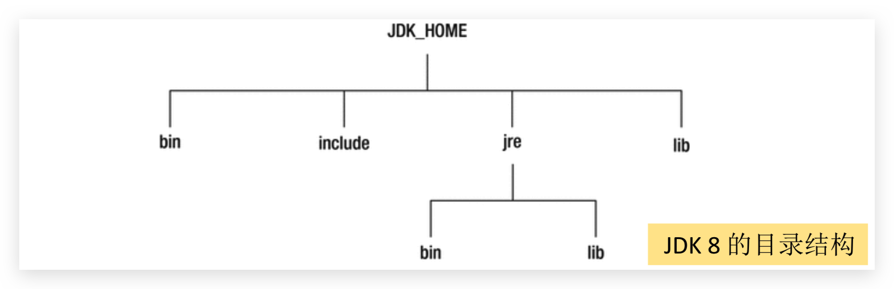
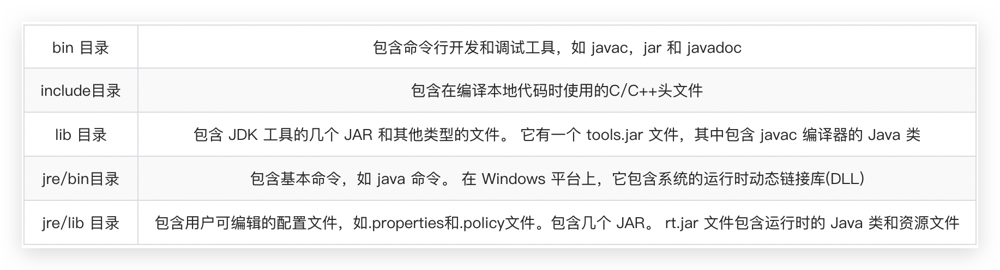
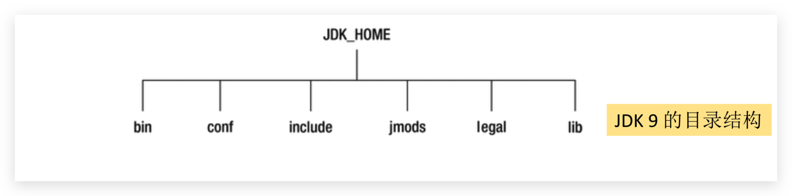

# 16 9,10,11 新特性

[[toc]]

从Java 9 这个版本开始，Java 的计划发布周期是 6 个月，下一个 Java 的主版本将于 2018 年 3 月发布，命名为 Java 18.3，紧接着再过六个月将发布 Java18.9。这意味着Java的更新从传统的以特性驱动的发布周期，转变为以时间驱动的(6 个月为周期)发布模式，并逐步的将 Oracle JDK 原商业特性进行开源。针对企业客户的需求，Oracle 将以三年为周期发布长期支持版本(long term
support)。

## Java 9 新特性

Java 9 提供了超过150项新功能特性，包括备受期待的模块化系统、可交互的 REPL 工具jshell，JDK 编译工具，Java 公共 API 和私有代码，以及安全增强、扩展提升、性能管理改善等。可以说Java 9是一个庞大的系统工程， 完全做了一个整体改变。

*   系统方面
    *   模块化系统 
    *   jShell命令 
*   语法方面
    *   接口的私有方法
    *   钻石操作符的使用升级
    *   语法改进：try 语句
*   API方面
    *   String 存储结构变更
    *   便利的集合特性：`of()`
    *   增强的 Stream API
    *   全新的 HTTP 客户端 API
    *   Deprecated 相关 API
*   多版本兼容jar包 
*   Javadoc 的 HTML5支持
*   Javascript 引擎升级：Nashorn
*   Java 的动态编译器

官方提供的[新特性列表](https://docs.oracle.com/javase/9/whatsnew/toc.htm#JSNEW-GUID-C23AFD78-C777-460B-8ACE-58BE5EA681F6)，或参考 [Open JDK](http://openjdk.java.net/projects/jdk9/)


### JDK 和 JRE 目录结构变化









### 模块化系统：Jigsaw—>Modularity

谈到 Java 9 大家往往第一个想到的就是 Jigsaw 项目。众所周知，Java 已经 发展超过 20 年(95 年最初发布)，Java 和相关生态在不断丰富的同时也越 来越暴露出一些问题：

*   Java 运行环境的膨胀和臃肿。每次JVM启动的时候，至少会有30~60MB的内存 加载，主要原因是JVM需要加载`rt.jar`，不管其中的类是否被classloader加载，第一步整个jar都会被JVM加载到内存当中去(而模块化可以根据模块的需要加载程序运行需要的class) 
*   当代码库越来越大，创建复杂，盘根错节的“意大利面条式代码”的几率呈指数级的 增长。不同版本的类库交叉依赖导致让人头疼的问题，这些都阻碍了 Java 开发和 运行效率的提升。 
*   很难真正地对代码进行封装, 而系统并没有对不同部分(也就是 JAR 文件)之间 的依赖关系有个明确的概念。每一个公共类都可以被类路径之下任何其它的公共 类所访问到，这样就会导致无意中使用了并不想被公开访问的 API。 

本质上讲也就是说，用**模块来管理各个package**，通过声明某个package暴露，，模块(module)的概念，其实就是package外再裹一层，**不声明默认就是隐藏**。因此，模块化使得代码组织上更安全，因为它可以指定哪些部分可以暴露，哪些部分隐藏。 

实现目标：

-   模块化的主要目的在于减少内存的开销 
-   只须必要模块，而非全部jdk模块，可简化各种类库和大型应用的开发和维护 
-   改进 Java SE 平台，使其可以适应不同大小的计算设备 
-   改进其安全性，可维护性，提高性能 

模块将由通常的类和新的模块声明文件(`module-info.java`，在 src 目录下)组成。该文件是位于java代码结构的顶层，该模块描述符明确地定义了我们的模块需要什么依赖关系， 以及哪些模块被外部使用。在`exports`子句中未提及的所有包默认情况下将封装在模块中，不能在外部使用。`requires`指明对其它模块的依赖。和 ES6一样。


### Java 的 REPL工具：jShell 命令

产生背景：像Python 和 Scala 之类的语言早就有交互式编程环境 REPL (read - evaluate - print - loop)了，以交互式的方式对语句和表达式进行求值。开发者只需要输入一些代码， 就可以在编译前获得对程序的反馈。而之前的Java版本要想执行代码，必须创建文件、声明类、提供测试方法方可实现。 

设计理念：即写即得、快速运行

实现目标：

-   Java 9 中终于拥有了 REPL工具:jShell。让Java可以像脚本语言一样运行，从控制台启动jShell，利用jShell在没有创建类的情况下直接声明变量，计算表达式， 执行语句。即开发时可以在命令行里直接运行Java的代码，而无需创建Java文 件，无需跟人解释”public static void main(String[] args)”这句废话。 
-   jShell也可以从文件中加载语句或者将语句保存到文件中。 
-   jShell也可以是tab键进行自动补全和自动添加分号。 

调出jShell

```bash
jshell
```

 获取帮助

```bash
/help intro
```

.....


### 接口的私有方法

Java 8中规定接口中的方法除了抽象方法之外，还可以定义静态方法 和默认的方法。一定程度上，扩展了接口的功能，此时的接口更像是一个抽象类。 在Java 9中，接口更加的灵活和强大，连方法的访问权限修饰符都可 以声明为private的了，此时方法将不会成为你对外暴露的API的一部分。

详细查看前面部分笔记


### 钻石操作符使用升级

我们将能够与匿名实现类共同使用钻石操作符 (diamond operator) 在Java 8中如下的操作是会报错的：

```java
Comparator<Object> com = new Comparator<>(){
  @Override
  public int compare(Object o1, Object o2) { 
    return 0;
  } 
};
```

编译报错信息：`Cannot use “<>” with anonymous inner classes.`

Java 9中可以正常执行通过 


### try语句

Java 8 中，可以实现资源的自动关闭（实现了 Closeable），但是要求执行后必须关闭的所有资源必须在try子句中初始化，否则编译不通过。如下：

```java
try(InputStreamReader reader = new InputStreamReader(System.in)){ 
  //读取数据细节省略
}catch (IOException e){ 
  e.printStackTrace();
}
```

Java 9 中，用资源语句编写try将更容易，我们可以在try子句中使用已经初始 化过的资源，此时的资源是final的：

```java
InputStreamReader reader = new InputStreamReader(System.in); 
OutputStreamWriter writer = new OutputStreamWriter(System.out); 
try (reader; writer) {
  //reader是final的，不可再被赋值 
  //reader = null; 
  //具体读写操作省略
} catch (IOException e) { 
  e.printStackTrace();
}
```


### String 存储结构变更

Motivation 

The current implementation of the String class stores characters in a char array, using two bytes (sixteen bits) for each character. Data gathered from many different applications indicates that strings are a major component of heap usage and, moreover, that most String objects contain only Latin-1 characters. Such characters require only one byte of storage, hence half of the space in the internal char arrays of such String objects is going unused. 

Description 

We propose to change the internal representation of the String class from a UTF-16 char array to a byte array plus an encoding-flag field. The new String class will store characters encoded either as ISO-8859-1/Latin-1 (one byte per character), or as UTF-16 (two bytes per character), based upon the contents of the string. The encoding flag will indicate which encoding is used. 

String 再也不用 `char[]`来存储，改成了 `byte[]` 加上编码标记，节约了一些空间。 

```java
public final class String implements java.io.Serializable, Comparable<String>, CharSequence { 
  @Stable
	private final byte[] value;
}
```

那 StringBuffer 和 StringBuilder 是否仍无动于衷呢?都变了！

String-related classes such as AbstractStringBuilder, StringBuilder, and StringBuffer will be updated to use the same representation, as will the HotSpot VM‘s intrinsic(固有的、内置的) string operations.


### 集合工厂方法：快速创建只读集合

要创建一个只读、不可改变的集合，必须构造和分配它，然后添加元素，最后 包装成一个不可修改的集合。

```java
List<String> namesList = new ArrayList <>(); 
namesList.add("Joe"); 
namesList.add("Bob"); 
namesList.add("Bill");

namesList = Collections.unmodifiableList(namesList); 
System.out.println(namesList);

List<String> list = Collections.unmodifiableList(Arrays.asList("a", "b", "c")); 
Set<String> set = Collections.unmodifiableSet(new HashSet<>(Arrays.asList("a", "b", "c")));
```

缺点：我们一下写了五行。即它不能表达为单个表达式。Java 9因此引入了方便的方法，这使得类似的事情更容易表达。

```java
List<String> list = List.of("a", "b", "c");
Set<String> set = Set.of("a", "b", "c");
Map<String, Integer> map1 = Map.of("Tom", 12, "Jerry", 21, "Lilei", 33, "HanMeimei", 18);
Map<String, Integer> map2 = Map.ofEntries(Map.entry("Tom", 89), Map.entry("Jim", 78), Map.entry("Tim", 98));
```

调用集合中静态方法`of()`，可以将不同数量的参数传输到此工厂方法中。此功能 可用于Set和List，也可用于Map的类似形式。此时得到的集合，是不可变的:在 创建后，继续添加元素到这些集合会导致 “UnsupportedOperationException” 。 由于Java 8中接口方法的实现，可以直接在List，Set和Map的接口内定义这些方法， 便于调用。


### InputStream 加强

InputStream 终于有了一个非常有用的方法`transferTo`，可以用来将数据直接传输到 OutputStream，这是在处理原始数据流时非常常见的一种用法，如下 示例。 

```java
ClassLoader cl = this.getClass().getClassLoader();
try (InputStream is = cl.getResourceAsStream("hello.txt");
     OutputStream os = new FileOutputStream("src\\hello1.txt")) { 
  is.transferTo(os); // 把输入流中的所有数据直接自动地复制到输出流中
} catch (IOException e) { 
  e.printStackTrace();
}
```

