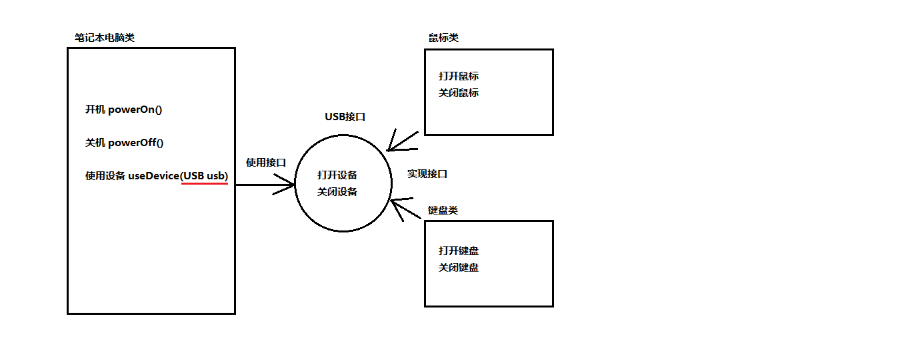

# 抽象类 & 接口

## abstract

### 简介

继承是用来表示类之间的 `is-a` 或`is-like-a`关系。随着继承层次中一个个新子类的定义，类变得越来越具体，而父类则更一般，更通用。**类的设计应该保证父类和子类能够共享特征**。有时将一个父类设计得非常抽象，以至于它没有具体的实例，这样的类叫做抽象类。

- **抽象方法**：**没有方法主体**（没有大括号）的方法，用`abstract`修饰，`;`结束
- **抽象类**：**包含抽象方法的类必须声明为抽象类**，用`abstract`修饰，但**抽象类可以不包含任何抽象方法**
    - **抽象类不能被实例化**（可能包含抽象方法，但没有方法体无法调用）
    - 可以**创建子类继承`(extends)`**并**重写父类所有抽象方法**，否则该子类须声明为抽象类（最终必有实现类否则无意义）


### 抽象类成员特点

可以有类的一切属性

*   成员变量：有变量，有常量
*   成员方法：有抽象，有非抽象
*   **构造方法**：有，用于**子类创建对象时初始化父类成员**（因为子类构造中，有默认的`super()`）
*   静态代码块：可以有


### 注意事项

abstract 使用时**注意**：

- abstract 不能修饰**属性、构造器**等结构；
- abstract 不能修饰**私有方法**（private，私有方法属于类不能被重写）、**静态方法**（static，静态方法属于类不能被重写）、**final方法**、**final类**；

* 匿名子类对象/匿名子类的匿名对象（new的并不是抽象类！）

    ```java
    // 1 创建了一匿名子类的对象：p，其中Person为抽象类
    Person p = new Person(){
    
        @Override
        public void eat() {
            System.out.println("吃东西");
        }
    
        @Override
        public void breath() {
            System.out.println("好好呼吸");
        }
    
    };
    method1(p);
    ```

    ```java
    // 2 创建匿名子类的匿名对象
    method1(new Person(){
        @Override
        public void eat() {
            System.out.println("吃好吃东西");
        }
    
        @Override
        public void breath() {
            System.out.println("好好呼吸新鲜空气");
        }
    });
    ```

    


## interface

### 简介

继承是用来表示类之间的 `is-a` 或`is-like-a`关系

而接口实现则是 "**能不能**"的关系，接口的本质是标准，协议（protocol），规范。

Java中接口是多个**类的公共规范标准**，是方法的集合。是**引用数据类型**，用`interface`修饰，也会被编译成`.class`文件。接口中**没有构造器**。即不可以被实例化，需要定义一个类**implements接口中所有方法**，如果这个类是**抽象类，实现部分**即可。**接口的具体使用，也体现多态性**


### Java 7 接口

- 接口中成员变量必须是**全局常量（赋值且静态）**的，默认修饰符`public static final`（大写、下划线），可省略。Java 5 以后使用枚举类替代了。
- 接口中成员方法必须是**抽象方法**，默认修饰符`public abstract`，可省略


### Java 8 接口

- **默认方法**（**default**，之前只用于 **switch** 语句和注解中）

    供**实现类直接调用**或者**重写**。可以解决接口升级问题、拼接函数模型。**Stream 中常使用**

    ```java
    /*public*/ default 返回值类型 method(/*参数列表*/) { //default不可省略，public可省略
        //方法体     
    }
    ```

- **静态方法**（**static**）

    **只能接口直接调用**，不能用接口实现类对象来调用（因为可能实现多接口）。用于**通用的工具**
    
    ```java
    /*public*/ static 返回值类型 method(/*参数列表*/) { //static不可省略，public可省略
        //方法体         
    }
    ```


::: tip 默认方法和多继承

在 Java 8 之前，接口没有包袱——它只是方法的描述。**Java 8 通过默认方法具有了某种多继承的特性**。结合带有默认方法的接口意味着结合了多个基类中的行为。因为接口中仍然不允许存在属性（只有静态属性，不适用），所以属性仍然只会来自单个基类或抽象类，也就是说，不会存在状态的多继承。正如下面这样：

```java
interface One {
    default void first() {
        System.out.println("first");
    }
}

interface Two {
    default void second() {
        System.out.println("second");
    }
}

interface Three {
    default void third() {
        System.out.println("third");
    }
}

class MI implements One, Two, Three {}

public class MultipleInheritance {
    public static void main(String[] args) {
        MI mi = new MI();
        mi.first();// first
        mi.second();// second
        mi.third();// third
    }
}
```

现在我们做些在 Java 8 之前不可能完成的事：结合多个源的实现。只要基类方法中的**方法名或参数列表不同**，就能工作得很好，否则会得到编译器错误：

```java
interface Bob1 {
    default void bob() {
        System.out.println("Bob1::bob");
    }
}

interface Bob2 {
    default void bob() {
        System.out.println("Bob2::bob");
    }
}

// class Bob implements Bob1, Bob2 {}
/* Produces:
error: class Bob inherits unrelated defaults
for bob() from types Bob1 and Bob2
class Bob implements Bob1, Bob2 {}
^
1 error
*/

interface Sam1 {
    default void sam() {
        System.out.println("Sam1::sam");
    }
}

interface Sam2 {
    default void sam(int i) {
        System.out.println(i * 2);
    }
}

// This works because the argument lists are distinct:
class Sam implements Sam1, Sam2 {}

interface Max1 {
    default void max() {
        System.out.println("Max1::max");
    }
}

interface Max2 {
    default int max() {
        return 47;
    }
}

// class Max implements Max1, Max2 {}
/* Produces:
error: types Max2 and Max1 are imcompatible;
both define max(), but with unrelated return types
class Max implements Max1, Max2 {}
^
1 error
*/
```

**Sam** 类中的两个 `sam()` 方法有相同的方法名但是**签名不同**——方法签名包括方法名和参数类型，编译器也是用它来区分方法。但是从 **Max** 类可看出，返回类型不是方法签名的一部分，因此不能用来区分方法。为了解决这个问题，需要**覆写冲突的默认方法**：

```java
interface Jim1 {
    default void jim() {
        System.out.println("Jim1::jim");
    }
}

interface Jim2 {
    default void jim() {
        System.out.println("Jim2::jim");
    }
}

public class Jim implements Jim1, Jim2 {
    @Override
    public void jim() {
        Jim2.super.jim();
    }

    public static void main(String[] args) {
        new Jim().jim();// Jim2::jim
    }
}
```

当然，你可以重定义 `jim()` 方法，但是也能像上例中那样使用 **super** 关键字选择基类实现中的一种。语法为`InterfaceA.super.method()`

:::

### Java 9 接口

- **私有方法**（**private**）：向上抽取重复代码，只能供**接口自己**中的**默认方法**或者**静态方法调用**

    ```java
    private 返回值类型 method(/*参数列表*/) { 
        //方法体     
    }
    ```

    ```java
    private static 返回值类型 method(/*参数列表*/) {
        //方法体         
    }
    ```


### 笔记本USB接口案例



### 注意

- 接口**没有静态代码块**和**构造方法**（其实现类继承`Object`，提供无参构造）
- 一个类的直接父类是唯一的，但一个**类可以实现多个接口**（用`,`隔开）
- 实现类的**直接父类中的方法**和**接口中默认方法产生冲突**，在子类没有重写情况下优先**使用父类**中的方法。**类优先原则**
- 实现类实现的多个接口中，存在**重复的抽象方法（方法签名相同）**，那么**只需重写一次**即可
- Java8 接口中定义的**静态方法，只能通过接口来调用**，因为可能实现多接口
- 通过**实现类的对象，可以调用接口中的默认方法**。如果实现类重写了接口中的默认方法，调用时调用的是重写以后的方法
- 实现类实现的多个接口中，存在**重复的默认方法（方法签名相同）**，存在**接口冲突**
    - **选择其中一个冲突方法**，重写时调用它即可，语法为`InterfaceA.super.method()`
    - **必须重写**冲突的默认方法
- 接口的权限修饰同普通类


### 类与接口关系总结

* 类与类：继承关系，只能单继承，可以多层继承

* 类与接口：实现关系，可以单实现，也可以多实现，可以在继承一个类时实现多个接口

* 接口与接口：继承关系，可以单继承，也可以多继承。可不用全部实现抽象方法

    多继承中，如果父接口中的默认方法（抽象方法）有重名的，那么子接口须重写一次。

* 同抽象类一样，接口也可以创建：非匿名实现类的非匿名对象、非匿名实现类的匿名对象、匿名实现类的非匿名对象、匿名实现类的匿名对象

    ​    


## 抽象类和接口

尤其是在 Java 8 引入 **default** 方法之后，选择用抽象类还是用接口变得更加令人困惑。下表做了明确的区分：

| 特性                 | 接口                                                       | 抽象类                                   |
| -------------------- | ---------------------------------------------------------- | ---------------------------------------- |
| 组合                 | 新类可以组合多个接口                                       | 只能继承单一抽象类                       |
| 状态                 | 不能包含属性（除了静态属性，不支持对象状态）               | 可以包含属性，非抽象方法可能引用这些属性 |
| 默认方法 和 抽象方法 | 不需要在子类中实现默认方法。默认方法可以引用其他接口的方法 | 必须在子类中实现抽象方法                 |
| 构造器               | 没有构造器                                                 | 可以有构造器                             |
| 可见性               | 隐式 **public**                                            | 可以是 **protected** 或友元              |

抽象类仍然是一个类，在创建新类时只能继承它一个。而创建类的过程中可以实现多个接口。

有一条实际经验：尽可能地抽象。因此，更倾向使用接口而不是抽象类。只有当必要时才使用抽象类。除非必须使用，否则不要用接口和抽象类。大多数时候，普通类已经做得很好，如果不行的话，再移动到接口或抽象类中。