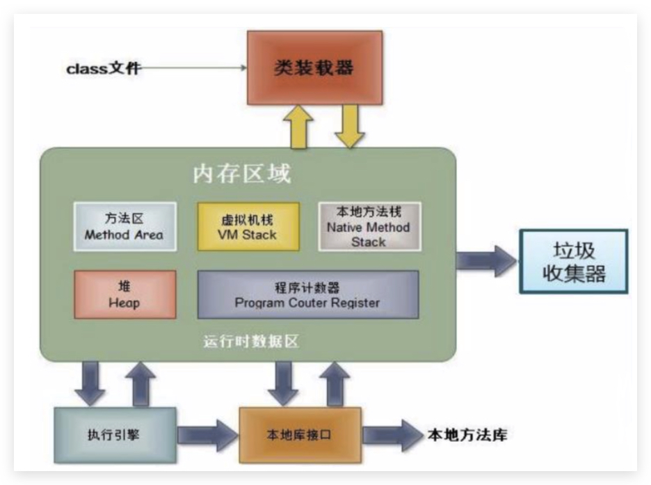

# 2 Object Orientation

[[toc]]

* 面向过程编程(POP) 与 面向对象编程(OOP)：

    * 面向过程，强调的是功能行为，以函数为最小单位，考虑怎么做。
    * 面向对象（相对于面向过程而言）将功能封装进对象，强调具备了功能的对象，以类/对象为最小单位，考虑谁来做。

    面向对象程序设计的重点是类的设计，类的设计其实就是类的成员的设计


## 2.1 Java 内存解析

 

- 堆（Heap），此内存区域的唯一目的就是存放**对象实例**，几乎所有的对象 实例都在这里分配内存。这一点在Java虚拟机规范中的描述是：所有的**对象实例以及数组都要在堆上分配**。

- 方法区（Method Area），用于存储已被虚拟机加载的类信息、常量、静态变量、即时编译器编译后的代码等数据。

    

- 栈（Stack），是指虚拟机栈。虚拟机栈用于存储**局部变量**等。 局部变量表存放了编译期可知长度的各种基本数据类型(boolean、byte、char 、 short 、 int 、 float 、 long 、double)、对象引用(reference类型， 它不等同于对象本身，是对象在堆内 存的首地址)。 **方法执行完，自动释放**。

- 本地方法栈（Native Method Stack）：这部分主要与虚拟机用到的 Native 方法相关

- PC寄存器（Program Counter Register）：也叫程序计数器。JVM支持多个线程同时运行，每个线程都有自己的程序计数器。


## 2.2 类及其成员

类及其成员包括：成员变量、成员方法、构造器、代码块、内部类

* 面向对象的两个要素：

    * 类：是对**一类事物的描述，是抽象的、概念上**的定义。是一组相关**属性**和**行为**的集合。
        * **属性 = 成员变量 = Field（域/字段）**：就是该事物的**状态信息**
        * **行为 = 成员方法 = 函数 = Method**：就是该事物**能够做什么**
    * 对象：是**实际存在的该类事物的每个个体**，因而也称为实例(instance)。

* **类的定义格式**

    ```java
    public class ClassName {
        //成员变量，对应事物的属性，描述事物的状态信息
        //构造方法：创建事物对象
        //成员方法，对应事物的行为，描述事物能做什么
        //......
    }
    ```

* **对象的使用**

    - 类的实例化、创建对象：`类名 对象名 = new 类名();`
    - 使用对象访问类中的成员：`对象名.成员变量；` ` 对象名.成员方法()`

* 匿名对象：不定义对象的句柄，而直接调用这个对象的方法

    创建匿名对象直接调用方法，没有变量名；匿名对象可以作为方法的参数和返回值。只能调用一次。

* **两个对象使用同一方法**的内存图

    对象调用方法时，根据对象中方法标记（地址值），去类中寻找方法信息。这样哪怕是多个对象，方法信息 只保存一份，节约内存空间。 

    

* **两个引用指向同一对象**的内存图

    

* **引用类型作为参数传递到方法中，传递的是地址值**

    

* **使用引用类型作为方法的返回值，返回值就是对象的地址值**

    


### Field（成员变量）

* 语法格式：`修饰符 数据类型 属性名 = 初始化值 ;`
    修饰符：private、缺省、protected、public；static、final

* **成员变量的默认值**：

    - 整型—`0`；浮点—`0.0`；布尔—`false`；引用类型—`null`；

        char—`‘\u0000’`（或`0`），是一个不可打印字符，非`'0'`；

* **成员变量与局部变量区别**：

    |              | 成员变量                                           | 局部变量                                           |
    | ------------ | -------------------------------------------------- | -------------------------------------------------- |
    | 声明的位置   | 直接声明在类中                                     | 方法或构造器的形参、方法内部、代码块内、构造器内等 |
    | 修饰符       | private、默认、protected、public、static、final等  | 不能用权限修饰符修饰，可以用final修饰              |
    | 初始化值     | 有默认初始化值                                     | 没有默认初始化值，必须显式赋值，方可使用           |
    | 内存加载位置 | 堆空间 或 方法区的静态域内                         | 栈空间                                             |
    | 生命周期     | **随着对象**的创建而存在，随着对象被垃圾回收而消失 | **随着方法**的调用而存在，随着方法的调用完毕而消失 |


### Method（方法）

- **方法定义格式** 

    ```java
    修饰符 返回值类型 方法名 （参数列表）｛
    	方法体;
    	return 返回值;//停止方法，将返回值返回给调用处
    }
    ```

- 方法调用

    ```java
    method();
    ```

- 方法定义**注意事项**： 

    - 方法必须定义在一个**类中** 
    - 方法不能定义在另一个方法的里面，**不能嵌套**
    - 一个方法可以有多个return语句，但必须保证**同时只有一个return会被执行到**，return后不能有语句

- 方法可用的修饰符：staitc、final、abstract、native

- **方法重载（overload）**：**同一类**中**方法名相同**，**参数列表不同**（类型 或 个数 或 多类型顺序 不同）

    与访问修饰符、返回值类型（可能只调用，不需要返回值）、参数名无关！

- **方法重写（override）**：**父子类**中，**方法名**、**参数列表必须相同**（不同则是特有方法）。满足以下条件为重写：

    - **访问权限**必须大于等于父类权限
    - **返回值类型**，对象类型必须小于等于父类（如Object、String）；基本类型必须一致！若为void，则都必须为void；
    - **抛出的异常类型**小于等于父类方法的异常类型

    ```java
class Father {
    
        int show(int a, int b) throws IOException { //重写中，子类方法抛出异常类型必须小于等于父类方法
            return 0;
        }
    }
    //下面哪些方法可以出现在Father的子类中？
    public/private/... short show(int a, long b){return 0;}//参数列表都不同了，是子类特有方法
    public int show(int a,int b){return 0;}//可以，方法重写
    private int show(int a,int b){return 0;}//不可以，权限小
    public short show(int a, int b){return 0;}//不可以，返回类型为基本类型必须一致！
    static int show(int a, int b){return 0;}//不可以，条件都满足，但是静态方法只能覆盖静态方法！！！
    ```
    
    若父类中有**私有方法、静态方法**，因为和**类相关**，子类也可以存在完全一样的方法，**不是重写**！

    > 从编译和运行的角度看：
>
    > * 重载，是指允许存在多个同名方法，而这些方法的参数不同。编译器根据方法不 同的参数表，对同名方法的名称做修饰。对于编译器而言，这些同名方法就成了 不同的方法。它们的调用地址在编译期就绑定了。Java的重载是可以包括父类 和子类的，即子类可以重载父类的同名不同参数的方法。所以:对于重载而言，在方法调用之前，编译器就已经确定了所要调用的方法， 这称为“早绑定”或“静态绑定”;
    > * 而对于多态（重写），只有等到方法调用的那一刻，解释运行器才会确定所要调用的具体方法，这称为“晚绑定”或“动态绑定”。
    >
    > 即方法重载（@overload）实现编译时多态性；方法重写（@override）实现运行时多态性。
    
- **可变参数**：JavaSE 5.0 中提供了Varargs(variable number of arguments)机制，允许直接定 义能和多个实参相匹配的形参。从而，可以用一种更简单的方式，来传递个数可变的实参。（同js中arguments类似）

    * 可变个数形参的方法与同名的方法之间，彼此构成重载
    * 可变参数方法（**底层为数组**）的使用与方法参数部分使用数组是一致的，所以不能与之重载
    * 方法的参数部分有可变形参，需要放在形参声明的最后
    * 在一个方法的形参位置，最多只能声明一个可变个数形参

    ```java
    public static void sum(int ... arr) {
    	int sum = 0;
    	for(int a:arr) {
    		sum+=a;
    	}
    	System.out.println(sum);
    }
    ```

- **方法参数的值传递机制**

    Java里方法的参数传递方式只有一种：**值传递**；画内存图即可明显看出。

    * 形参是基本数据类型：将实参基本数据类型变量的“数据值”传递给形参
    * 形参是引用数据类型：将实参引用数据类型变量的“地址值”传递给形参

- **递归（recursion）**方法：一个方法体内调用它自身

    **注意：**

    1. 要**有出口**可以停止，否则就是死递归
    2. **次数不能过多**，否则内存溢出StackOverFlowError
    3. **构造方法不能**递归使用

    

### constructor（构造器）

* 构造器的特征

    * 与类相同的名称
    * 不声明返回值类型（与声明为void不同）
    * 不能被static、final、synchronized、abstract、native修饰，不能有return语句返回值

* 构造器的**作用：创建对象;给对象进行初始化**

* 语法格式

    ```java
    修饰符 类名 (参数列表) {
      初始化语句;
    }
    ```

* 注意

    * Java语言中，每个类都**至少有一个构造器**；默认构造器的修饰符与所属类的修饰符一致
    * 一旦显式**定义了构造器，则系统不再提供默认构造器**
    * 一个类可以创建多个**重载**的构造器
    * 父类的构造器**不可被子类继承**
    * 子类的构造器中首行默认为`super()`，且默认省略


* JavaBean是一种Java语言写成的可重用组件，符合如下标准的Java类：

    * 类是公共的
    * 有一个无参的公共的构造器
    * 有属性，且有对应的get、set方法

* UML类图

    


### 代码块

* 作用：用来**初始化类、对象**
* 代码块如果有修饰的话，**只能使用static**。因此可以分为如下：
    * 静态代码块
        * 内部可以有输出语句
        * **随着类的加载而执行，而且只执行一次**
        * 作用：**初始化类的信息**
        * 如果一个类中定义了多个静态代码块，则按照声明的先后顺序执行
        * 静态代码块的执行要优先于非静态代码块的执行
        * 静态代码块内只能调用静态的属性、静态的方法，不能调用非静态的结构
    * 非静态代码块
        * 内部可以有输出语句
        * **随着对象的创建而执行**。每创建一个对象，就执行一次非静态代码块
        * 作用：**可以在创建对象时，对对象的属性等进行初始化**
        * 如果一个类中定义了多个非静态代码块，则按照声明的先后顺序执行
        * 非静态代码块内可以调用静态的属性、静态的方法，或非静态的属性、非静态的方法


### 内部类

当一个事物的内部，还有一个部分**需要一个完整的结构进行描述**，而这个内部的完整的结构**又只为外部事物提供服务**，那么整个内部的完整结构最好使用内部类。

* 在Java中，允许**一个类的定义位于另一个类的内部**，前者称为**内部类**，后者称为**外部类**。

    Inner class一般用在定义它的类或语句块之内，在外部引用它时必须给出完整的名称。不能与外部类名相同。

    内部类仍然是一个独立的类，在编译之后会内部类会被编译成独立的.class文件，但是前面冠以外部类的类名 和\$符号 。比如，`Person$Heart.class`。分类如下：

* **成员内部类**（**static**成员内部类和**非static**成员内部类）

    * 作为外部类的成员
        * 与外部类不同，Inner class还可以声明为private或protected（总共**4种权限修饰符**）
        * 可以被abstract修饰，因此可以被其它的内部类继承
        * 可以**被static修饰**，但此时就不能再使用外层类的非static的成员变量。非static的成员内部类中的成员不能声明为static的，只有在外部类或static的成员内部类中才可声明static成员。
        * 可以**调用外部类的结构**
    * 作为一个类
        * 类内可以**定义属性、方法、构造器等**
        * 可以**被abstract修饰**，因此可以被其它的内部类继承
        * 可以**被final修饰**，表示此类不能被继承。言外之意，不使用final，就可以被继承
        * **编译以后生成OuterClass$InnerClass.class字节码文件**(也适用于局部内部类)

* **局部内部类**（不谈修饰符，一般在**代码块中、构造器中、方法中**）、**匿名内部类**


* 特点：（铁扇公主肚子里的孙猴子）

    * **内部类可以直接访问外部类的成员**，**包括私有成员**。 
    * **外部类要访问**内部类的成员，必须要**建立内部类的对象**。

* 需要关注如下问题：

    * **如何实例化成员内部类的对象**

        * **非静态成员内部类**

            `Outer.Inner in = new Outer().new Inner();`**直接访问外部类中内部类成员**

            如果出现了**重名**现象，**访问外部类成员变量**格式是：**`外部类名称.this.外部类成员变量名`**

            【面试】

            ```java
            class Outer {
                public int num = 10;
            
                class Inner {
                    public int num = 20;
            
                    public viod show() {
                        int num  = 30;
            
                        System.out.println(num);//30
                        System.out.println(this.num);//20
                        System.out.println(Outer.this.num);//10
                    }
                }
            }
            ```

        * **静态成员内部类**

            `Outer.Inner in = new Outer.Inner();`)**不用创建外部类对象**，相当于外部类

            静态内部类只能访问外部类中的静态成员

            静态内部类中可以定义静态成员，**非静态内部类中不允许定义静态成员**

            【面试】

            ```java
            public class Test {
                public void func() {
                    //位置1
                }
            
                class Inner {
                }
            
                public static void main(String[] args) {
                    Test test = new Test();
                    //位置2
                }
                //在位置1写 new Inner()  可以，外部类访问内部类要创建内部类对象
                //在位置2写 new Inner()  不可以，main方法时静态的，不能调用非静态内部类
                //在位置2写 new test.Inner()  不可以，不是静态内部类，可以test.new Inner()
                //在位置2写 new Test.Inner()  不可以，类名调用只能调用静态成员，除非内部类为静态
            }
            ```

        * **局部内部类**（包含**匿名内部类**）：定义在**方法内部**的类，只有**当前所属方法才能使用它**

            - 局部内部类，如果**访问所在方法的局部变量**，那么这个局部变量必须是【有效**final**的】

                备注：从Java 8+开始，只要局部变量事实不变，那么final关键字可以省略。

                > new出来的对象在堆内存当中。
                >
                > 局部变量是跟着方法走的，在栈内存当中。
                >
                > 方法运行结束之后，立刻出栈，局部变量就会立刻消失。
                >
                > 但是new出来的对象会在堆当中持续存在，直到垃圾回收消失。

        * **匿名内部类**：是局部内部类的简化写法。它的本质是一个**带具体实现的父类或者父接口的匿名的子类对象**

            - **前提**：匿名内部类必须**继承一个父类**或者**实现一个父接口**。 

                ```java
                接口名称 对象名 = new 接口名称() { //new代表创建对象的动作；接口名称就是匿名内部类需要实现哪个接口
                    // 覆盖重写所有抽象方法
                }; //{...}这才是匿名内部类的内容
                ```

            - **使用场景：**方法的参数是接口或抽象类，并且其中的方法不超过三个，嫌麻烦为了不写实现类或子类

            - 注意几点问题：

                - **匿名内部类**，在【**创建对象**】的时候，**只能使用唯一一次**。如果希望多次创建对象，而且类的内容一样的话，那么就需要使用单独定义的实现类了。
                - **匿名对象**，在【**调用方法**】的时候，**只能调用唯一一次**。如果希望同一个对象，调用多次方法，那么必须**给对象起个名字**。
                - 匿名内部类是省略了【实现类/子类名称】，但是匿名对象是省略了【对象名称】

* 定义一个类的时候，权限修饰符规则：

    -   外部类：public / (default)

    -   成员内部类：public / protected / (default) / private

    -   **局部内部类**：什么都不能写

        ```java
        public class Demo {
            public static void main(String[] args) {
                new Demo(){ //匿名对象，匿名内部类
                    void show(){
                        System.out.println("hello");
                    }
                }.show();//hello
                //若是给对象起名，并用该名调用show方法，则编译不通过，因为父类中没有此方法，当前所属方法才能使用它
            }
        }
        ```


* 开发中局部内部类的使用  见《InnerClassTest1.java》


```java
class Animal{

    String name = "小明";
    int age;

    public void eat(){
        System.out.println("动物：吃饭");
    }


    //静态成员内部类
    static class Dog{
        String name;
        int age;

        public void show(){
            System.out.println("卡拉是条狗");
            //eat(); //静态不能调用非静态
        }
    }
    //非静态成员内部类
    class Bird{
        String name = "杜鹃";

        public Bird(){
        }

        public void sing(){
            System.out.println("我是一只小小鸟");
            Animal.this.eat();//调用外部类的非静态属性
            eat();
            System.out.println(age);
        }

        public void display(String name){
            System.out.println(name);//方法的形参
            System.out.println(this.name);//内部类的属性
            System.out.println(Animal.this.name);//外部类的属性
        }
    }

    public void method(){
        //局部内部类
        class AA{
        }
    }

    {
        //局部内部类
        class BB{
        }
    }

    public Animal(){
        //局部内部类
        class CC{
        }
    }
}
```


## 2.3 面向对象的三大特征

### 封装

使用者对类内部定义的属性(对象的成员变量)的直接操作会导致数据的错误、混乱或安全性问题。

Java中通过**将数据声明为私有的(private)**，再**提供公共的(public) 方法：getXxx()和setXxx()实现对该属性的操作**，实现下述目的：

* **隐藏**一个类中不需要对外提供的**实现细节**
* 使用者只能通过事先定制好的方法来访问数据，可以方便地**加入控制逻辑，限制对属性的不合理操作**
* **便于修改，增强代码的可维护性**


封装性的体现：

* 如上
* 不对外暴露的私有方法
* 单例模式
* ……

在设计程序时，追求“高内聚、低耦合”


### 继承 / extends

* 多个类中存在相同属性和行为时，将这些内容抽取到单独一个类中， 其他类无需再定义这些属性和行为，只要继承那个类即可。此处的其他类称为**子类（派生类或subclass）**，单独的这个类称为**父类（基类 或超类 或superclass）**。继承主要**解决**的问题是：**共性抽取**。可以理解为：“子类 is a 父类”

* **好处、作用：**

    * 继承的出现减少了代码冗余，提高了代码的复用性。

    * 继承的出现，更有利于功能的扩展。

    * 继承的出现让类与类之间产生了关系，提供了多态的前提。

        但是不要仅为了获取其他类中某个功能而去继承

* 注意继承的**规则**：

    * **子类继承父类，就获取了父类（间接父类）所有的属性和方法**。但是子类不能直接访问父类中私有的（private）的成员变量和方法。
    * Java只支持**单继承和多层继承**，**不允许多继承**
    * 所有的java类（除java.lang.Object类之外）都直接或间接的继承于java.lang.Object类

    


### 多态

* 多态：可以理解为一个事物的多种形态。体现为**对象的多态性**，是指**父类的引用指向子类的对象**

* Java引用变量有两个类型：编译时类型和运行时类型

    * 编译时类型由声明该变量时使用的类型决定

    * 运行时类型由实际赋给该变量的对象决定

        **编译时，看左边；运行时，看右边**

* 若编译时类型和运行时类型不一致，就出现了对象的多态性(Polymorphism)，多态情况下，

    * “看左边”：看的是父类的引用(父类中不具备子类特有的方法)
    * “看右边”：看的是子类的对象(实际运行的是子类重写父类的方法)

* **前提（重点）**

    - **继承**或者**实现**【二选一】 
    - **方法的重写**【意义体现。若不重写，则无意义】 
    - **父类引用指向子类对象**【格式体现】 

* **多态的使用：虚拟方法调用**

    在编译期，只能调用父类中声明的方法，但在运行期，我们实际执行的是子类重写父类的方法。

    虚拟方法调用(Virtual Method Invocation)，多态情况下：

    * 子类中定义了与父类同名同参数的方法，在多态情况下，将此时**父类的方法称为虚拟方法**，父类根据赋给它的不同子类对象，动态调用属于子类的该方法。即**参数的值传递机制体现对象多态性**。这样的方法调用在编译期是无法确定的。

* **多态中成员访问特点（继承中也一致）总结为：对象的多态性，只适用于成员方法**

    - 成员变量：编译看左边，运行看左边。没有则向上找。
    - 静态方法或变量：编译看左边，运行看左边（与类相关）。没有则向上找。
    - **成员方法**：编译看**左**边，运行看**右**边（**依赖对象，因为有方法重写**）
    - 构造方法：创建子类对象时访问父类构造方法对父类成员进行初始化

    >   -   继承后**成员变量**：若重名则**就近**使用，使用super区分父类变量。**编译看左边，运行看左边**
    >       -   子父类中出现了**同名**的**成员变量**，则创建子类对象时，访问有两种方式：
    >           -   **直接通过子类对象访问**成员变量：**=左边对象是谁**，就优先用谁，没有则向**上**找
    >           -   **间接通过成员方法访问**成员变量：该**方法属于谁**，就优先用谁，没有则向**上**找
    >   -   继承后**构造方法**：无影响，但是子类构造方法默认调用父类构造方法
    >       -   **子类构造必须先调用父类构造方法进行初始化**，不写则默认**赠送super()**，写则用写的**指定super**调用
    >       -   构造方法的名字是与类名一致的。所以子类是**无法继承**父类**构造方法**的
    >   -   继承后**成员方法**：重名，子类重写父类方法。**编译看左边，运行看右边**
    >       -   在父子类的继承关系中，创建子类对象，访问成员方法的规则：
    >           -   **创建的对象(new)是谁，就优先用谁**，没有则向**上**找

* **方法重载（@overload）实现编译时多态（有时不考虑这个）；方法重写（@override）实现运行时多态。**

* **对象类型转换**

    * 基本数据类型的Casting
        * 自动类型转换：小的数据类型可以自动转换成大的数据类型。略
        * 强制类型转换：可以把大的数据类型强制转换(casting)成小的数据类型。略
    * 对**Java对象的强制类型转换**称为**造型**
        * 从子类到父类的类型转换可以自动进行（多态）
        * 从父类到子类的类型转换必须通过造型(强制类型转换)实现。可能出现ClassCastException，需先instanceof判断
        * 无继承关系的引用类型间的转换是非法的
        * 在造型前可以使用instanceof操作符测试一个对象的类型

* **instanceof** `x instanceof A`：检验x是否为类A的对象，返回值为boolean型

    - 要求x所属的类与类A必须是子类和父类的关系，否则编译错误。
    - 如果x属于类A的子类B，x instanceof A值也为true。

    


### 抽象性（可选）


## 2.4 其他关键字

### this

* 理解this关键字

    * 它在方法内部使用，即这个方法**所属对象的引用**

    * 它在构造器内部使用，表示该构造器**正在初始化的对象**

        记住 ：方法**被哪个对象调用**，方法中的this**就代表那个对象**。即谁在调用，this就代表谁。

* **this 可以调用类的属性、方法、另一个重载构造器（最多只能有一个this，且在第一句）**

* 注意：

    * 使用this访问属性和方法时， 如果**在本类中未找到，会从父 类中查找**
    * this可以作为一个类中**构造器相互调用**的特殊格式，但不能调用自身构造器。如果一个类中声明了n个构造器，则最多有 n - 1个构造器中使用了"this(形参列表)"

* 什么时候使用this关键字呢？当在方法内需要用到调用该方法的对象时，就用this。如可以用this来区分属性和局部变量


### super

* 在Java类中使用super来调用父类中的指定操作。访问父类中定义的属性、成员方法、构造器
* 注意：
    * super的追溯不仅限于直接父类
    * super和this的用法相像，this代表本类对象的引用，super代表父类的内存空间的标识

* 在子父类中
    * 子类中所有的构造器**默认都会访问父类中空参数的构造器**
    * 当父类中没有空参数的构造器时，子类的构造器必须通过**this(参 数列表)**或者**super(参数列表)**语句指定**调用本类或者父类中相应的构造器**。同时，**只能”二选一”，且必须放在构造器的首行**
    * 如果子类构造器中既未显式调用父类或本类的构造器，且父类中又没有无参的构造器，则编译出错


| 区别点     | this                                                   | super                                    |
| ---------- | ------------------------------------------------------ | ---------------------------------------- |
| 访问属性   | 访问本类中的属性，如果本类没有此属性则从父类中继续查找 | 直接访问父类中的属性                     |
| 调用方法   | 访问本类中的方法，如果本类没有此方法则从父类中继续查找 | 直接访问父类中的方法                     |
| 调用构造器 | 调用本类构造器，必须放在构造器的首行                   | 调用父类构造器，必须放在子类构造器的首行 |

**super、this内存图**

父类空间优先于子类对象产生。在每次创建子类对象时，先初始化父类空间，再创建其子类对象本身。目的在于子类对象中包含了其对应的父类空 间，便可以包含其父类的成员，如果父类成员非private修饰，则子类可以随意使用父类成员。代码体现在子类的构 造方法调用时，一定先调用父类的构造方法。


### static

某些特定的数据在内存空间里只有一份，如果一个成员使用了static关键字（静态的），那么这个成员不再属于自己，而是**属于所在类**，**由多个对象共享这个成员**。可用于修饰**成员变量、方法、代码块、内部类**。

* 修饰**属性/成员变量**：**静态成员变量（或类变量）**

    * 属性按照是否使用static修饰，又分为：静态成员变量（或类变量）和 非静态变量（实例变量）
        * 静态变量：多个对象共享同一个静态变量。
        * 实例变量：每个对象都独立的拥有一套类中的非静态变量。

    * static修饰属性的其他说明：
        * 静态变量**随着类的加载而加载**。可以通过"类.静态变量"的方式进行调用
        * 静态变量的**加载要早于对象的创建**。
        * 由于类只会加载一次，则静态变量在内存中也只会存在一份：存在**方法区的静态域中**。

* 修饰方法：**静态方法**

    * **随着类的加载而加载**，可以通过"类.静态方法"的方式进行调用
    * 注意（由于生命周期）：
        * 静态方法中，只能调用静态的方法或属性
        * 非静态方法中，既可以调用非静态的方法或属性，也可以调用静态的方法或属性
    * static注意点：
        *    在静态的方法内，**不能使用this关键字、super关键字**
        *    关于静态变量和静态方法的使用，大家都从生命周期的角度去理解。

    > 开发中，如何确定一个属性是否要声明为static的？
    >
    > - 属性是可以被多个对象所共享的，不会随着对象的不同而不同的。
    > - 类中的常量也常常声明为static
    >
    > 开发中，如何确定一个方法是否要声明为static的？
    >
    > * 操作静态属性的方法，通常设置为static的
    > * 工具类中的方法，习惯上声明为static的。 比如：Math、Arrays、Collections

* 修饰代码块

* 修饰内部类

* 用处举例：

    * Arrays、Math、Collections 工具类
    * 单例设计模式有用到

    

-   静态内存图

    


### final

final，最终的。可以用来修饰的结构：类、方法、变量：

* **类**：**此类不能被其他类所继承**。比如：String类、System类、StringBuffer类
* **方法**：表明**此方法不可以被重写**。比如：Object类中getClass()，是native方法
* **变量（成员变量、局部变量）**：**此时的"变量"就称为是一个常量，名称大写，且只能被赋值一次。**。
    * final修饰**属性（成员变量）**：由于成员变量有默认值，用final修饰后**必须手动赋值**！否则编译失败！可以考虑赋值的位置有：显式初始化、代码块初始化、构造器初始化（所有构造器都需赋值）
    * final修饰**局部变量**：尤其是使用final修饰形参时，表明此形参是一个常量。当我们调用此方法时，给常量形参赋一个实参。一旦赋值以后，就只能在方法体内使用此形参，但不能进行重新赋值。
        * 基本类型：只能**赋值一次**，**不能再更改**。
        * 引用类型：只能指向一个对象，**地址不能再更改**。不影响内部成员变量的修改

**static final 用来修饰属性：全局常量**

-   **abstract和final不能同时使用**。abstract修饰类、方法是需要被实现、重写的，与final矛盾
-   **abstract和static不能同时使用**。abstract修饰的方法没有方法体，static修饰的方法可以类名调用，编译失败


习题1：

```java
public class Something {
    public int addOne(final int x) {
    	return ++x; // 编译报错
        // return x + 1; // OK
    } 
}
```

习题2：

```java
public class Something {
    public static void main(String[] args) {
        Other o = new Other();
        new Something().addOne(o); 
    }
    public void addOne(final Other o) { 
        // o = new Other(); // 编译报错
        o.i++; // OK
    } 
}

class Other { 
    public int i;
{
```


### abstract抽象

随着继承层次中一个个新子类的定义，类变得越来越具体，而父类则更一 般，更通用。类的设计应该保证父类和子类能够共享特征。有时将一个父类设计得非常抽象，以至于它没有具体的实例，这样的类叫做抽象类。

- **抽象方法**：**没有方法主体**（没有大括号）的方法，用`abstract`修饰，`;`结束
- **抽象类**：**包含抽象方法的类必须声明为抽象类**，但**抽象类可以不包含任何抽象方法**
    - **抽象类不能被实例化**（可能包含抽象方法，但没有方法体无法调用）
    - 可以**创建子类继承`(extends)`**并**重写父类所有抽象方法**，否则该子类须声明为抽象类（最终必有实现类否则无意义）
- **抽象类成员特点：**
    1. 成员变量：有变量，有常量
    2. 成员方法：有抽象，有非抽象
    3. **构造方法**：有，用于**子类创建对象时初始化父类成员**（因为子类构造中，有默认的`super()`.）
    4. 静态代码块：可以有
- abstract使用时**注意**：
    - abstract不能修饰**属性、构造器**等结构；
    - abstract不能修饰**私有方法**（private，私有方法属于类不能被重写）、**静态方法**（static，静态方法属于类不能被重写）、**final方法**、**final类**；

* 匿名子类对象/匿名子类的匿名对象（new的并不是抽象类！）

    ```JAVA
    //创建了一匿名子类的对象：p，其中Person为抽象类
    Person p = new Person(){
    
        @Override
        public void eat() {
            System.out.println("吃东西");
        }
    
        @Override
        public void breath() {
            System.out.println("好好呼吸");
        }
    
    };
    method1(p);
    // 
    //创建匿名子类的匿名对象
    method1(new Person(){
        @Override
        public void eat() {
            System.out.println("吃好吃东西");
        }
    
        @Override
        public void breath() {
            System.out.println("好好呼吸新鲜空气");
        }
    });
    ```

    

### interface接口

#### 理解

继承是一个"**是不是**"的关系，而接口实现则是 "**能不能**"的关系。接口的本质是契约，标准，规范。

Java中接口是多个**类的公共规范标准**，是方法的集合。是**引用数据类型**，用`interface`修饰，也会被编译成`.class`文件

#### 接口中包含的内容

- JDK7：**全局常量（静态）**、**抽象方法**

    - 接口中成员变量必须是**赋值的常量**且**静态**的，默认修饰符`public static final`（大写、下划线），可省略
    - 接口中成员方法必须是**抽象方法**，默认修饰符`public abstract`，可省略

- JDK8：**默认方法（default ）**、**静态方法（static）**

    - 默认方法：供**实现类直接调用**或者**重写**。可以解决接口升级问题、拼接函数模型

        ```java
        /*public*/ default 返回值类型 method(/*参数列表*/) { //default不可省略，public可省略
            //方法体     
        }
        ```

    - 静态方法：**只能接口直接调用**，不能用接口实现类对象来调用（因为可能实现多接口）

        ```java
        /*public*/ static 返回值类型 method(/*参数列表*/) { //static不可省略，public可省略
            //方法体         
        }
        ```

- JDK9：**私有方法**

    - 私有方法：向上抽取重复代码，只能供**接口自己**中的**默认方法**或者**静态方法调用**

        ```java
        private 返回值类型 method(/*参数列表*/) { 
            //方法体     
        }
        ```

        ```java
        private static 返回值类型 method(/*参数列表*/) {
            //方法体         
        }
        ```

* 接口中**没有构造器**。即不可以被实例化，需要定义一个类**实现`(implements)`接口中所有方法**，如果这个类是**抽象类，实现部分**即可。**接口的具体使用，也体现多态性**

* 笔记本USB接口案例

    

#### 注意事项

- 接口**没有静态代码块**和**构造方法**（其实现类继承`Object`，提供无参构造）
- 一个类的直接父类是唯一的，但一个**类可以实现多个接口**（用“,”隔开）
- 接口中定义的**静态方法，只能通过接口来调用**。
- 通过**实现类的对象，可以调用接口中的默认方法**。如果实现类重写了接口中的默认方法，调用时，仍然调用的是重写以后的方法
- 实现类实现的多个接口中，存在**重复的抽象方法**，那么**只需重写一次**即可
- 实现类实现的多个接口中，存在**重复的默认方法**，那么**必须重写**冲突的默认方法，否则**接口冲突。**
- 实现类的**直接父类中的方法**和**接口中默认方法产生冲突**，在子类没有重写情况下优先**使用父类**中的方法。**类优先原则**
- **实现类中调用接口中的默认方法**，`InterfaceA.super.method()`

#### 类与接口关系总结

* 类与类：继承关系，只能单继承，可以多层继承

* 类与接口：实现关系，可以单实现，也可以多实现，可以在继承一个类时实现多个接口

* 接口与接口：继承关系，可以单继承，也可以多继承

    多继承中，如果父接口中的默认方法（抽象方法）有重名的，那么子接口须重写一次。

* 同抽象类，接口也可以创建：非匿名实现类的非匿名对象、非匿名实现类的匿名对象、匿名实现类的非匿名对象、匿名实现类的匿名对象

    ​    


### Enum枚举

>   类的对象只有有限个，确定的。举例如下：
>
>   *   星期：Monday(星期一)、......、Sunday(星期天)
>   *   性别：Man(男)、Woman(女)
>   *   季节：Spring(春节)......Winter(冬天)
>   *   支付方式：Cash(现金)、WeChatPay(微信)、Alipay(支付宝)、BankCard(银行卡)、CreditCard(信用卡)
>   *   就职状态：Busy、Free、Vocation、Dimission
>   *   订单状态：Nonpayment(未付款)、Paid(已付款)、Delivered(已发货)、Return(退货)、Checked(已确认)、Fulfilled(已配货)
>   *   线程状态：Thread中 State 内部枚举类

**当需要定义一组常量时，强烈建议使用枚举类**

#### 枚举类的实现

*   JDK1.5之前需要自定义枚举类

    ```java
    //自定义枚举类
    public class Season{
        //1.声明Season对象的属性:private final修饰，final 可不加，但加上后在生成 set 方法时会编译报错，以示提醒
        private final String seasonName;
        private final String seasonDesc;
    
        //2.私有化类的构造器，保证不能在类的外部创建其对象，并给对象属性赋值
        private Season(String seasonName,String seasonDesc){
            this.seasonName = seasonName;
            this.seasonDesc = seasonDesc;
        }
    
        //3.提供当前枚举类的多个对象：public static final修饰
        public static final Season SPRING = new Season("春天","春暖花开");
        public static final Season SUMMER = new Season("夏天","夏日炎炎");
        public static final Season AUTUMN = new Season("秋天","秋高气爽");
        public static final Season WINTER = new Season("冬天","冰天雪地");
    
        //4.其他诉求1：获取枚举类对象的属性
        public String getSeasonName() {
            return seasonName;
        }
    
        public String getSeasonDesc() {
            return seasonDesc;
        }
        //4.其他诉求2：提供toString()
        @Override
        public String toString() {
            return "Season{" +
                "seasonName='" + seasonName + '\'' +
                ", seasonDesc='" + seasonDesc + '\'' +
                '}';
        }
    }
    ```

*   JDK 1.5 新增的 `enum` 关键字用于定义枚举类

    *   使用 enum 定义的枚举类**默认继承**了 `java.lang.Enum`类，因此不能再继承其他类

    *   必须在**枚举类的第一行声明枚举类对象**，以`,`分隔`;` 结尾。列出的实例对象系统会**自动添加**`public static final`修饰

    *   枚举类的**属性建议使用**`private final`修饰，加上`final`后在生成`set`方法时会编译报错，以示提醒

    *   枚举类的**构造器默认使用** `private` 权限修饰符

        >   JDK 1.5 中可以在 switch 表达式中使用Enum定义的枚举类的对象作为表达式, case 子句可以直接使用枚举值的名字，无需添加枚举类作为限定

    ```java
    public enum Season {
        SPRING("春天","春风又绿江南岸"),
        SUMMER("夏天","映日荷花别样红"),
        AUTUMN("秋天","秋水共长天一色"),
        WINNER("冬天","窗含西岭千秋雪");
    
    
        // 若没有属性，可以不定义它和构造器
        private final String name;
    
        private final String des;
    
        Season(String name, String des) {
            this.name = name;
            this.des = des;
        }
        
        // 可添加 get 方法、重写 Enum 类的toString()
        public String getName() {
            return name;
        }
    
        public String getDes() {
            return des;
        }
        
        @Override
        public String toString() {
            return "Season{" +
                    "name='" + name + '\'' +
                    ", des='" + des + '\'' +
                    '}';
        }
    }
    ```

*   **若枚举只有一个对象，则可以作为一种单例模式的实现方式，查看单例模式中例子**

#### `java.lang.Enum`常用方法

*   `values()`：返回**枚举类型的对象数组**，该方法可以很方便地遍历所有的枚举值

*   `valueOf(String str)`：可以把一个字符串转为对应的枚举类对象。要求字符串必须是枚举类对象的“名字”。如不是，会有运行时异常:`IllegalArgumentException`

*   `toString()`：不重写则返回当前枚举类对象常量的名称

    ```java
    // 以下代码演示不重写toString()方法
    Season[] values = Season.values();
    System.out.println(Arrays.toString(values));// [SPRING, SUMMER, AUTUMN, WINNER]
    
    Season summer = Season.valueOf("SUMMER");
    System.out.println(summer);// SUMMER
    
    System.out.println(Season.SUMMER);// SUMMER，默认调用 toString()
    ```

#### 实现接口的`Enum`枚举类

*   和**普通 Java 类一样**，枚举类可以**实现一个或多个接口**

*   若每个枚举值在调用实现的接口方法呈现相同的行为方式，则只要统一实现该方法即可

    若需要每个枚举值在调用实现的接口方法呈现出不同的行为方式，则可以让**每个枚举值分别来实现该方法**

    ```java
    // 简单示例如下
    SPRING("春天","春风又绿江南岸"){
        @Override
        public String show() {
            // TODO
        }
    }
    ```

    


### Annotation注解

#### 注解和注释区别

*   **注释**：在阅读程序时更清楚，给**程序员看的**

*   **注解**：给jvm看的，**给机器看的**

#### 注解的理解

*   从 JDK 5.0 开始，Java 增加了对**元数据（MetaData）**的支持, 也就是Annotation。Annotation 其实就是代码里的**特殊标记**, 这些标记可以在**编译、类加载、运行时**被读取, 并执行相应的处理。通过使用 Annotation, 程序员可以在不改变原有逻辑的情况下, 在源文件中嵌入一些补充信息。代码分析工具、开发工具和部署工具可以通过这些补充信息进行验证或者进行部署。
*   Annotation 可以像修饰符一样被使用，可用于修饰**包、类、构造器、方法、成员变量、参数、局部变量的声明**，这些信息被保存在 Annotation 的 key,value 对中。
*   在JavaSE中，注解的使用目的比较简单，例如标记过时的功能， 忽略警告等。在JavaEE/Android中注解占据了更重要的角色，例如用来配置应用程序的任何切面，代替JavaEE旧版中所遗留的繁冗代码和XML配置等。未来的开发模式都是基于注解的，JPA是基于注解的，Spring2.5以上都是基于注解的，Hibernate3.x以后也是基于注解的，现在的Struts2有一部分也是基于注解的了，注解是一种趋势，一定程度上可以说：`框架 = 注解 + 反射 + 设计模式`。


#### 注解的作用

-   **编译检查**：通过代码里标识的注解让编译器能够实现基本的编译检查

    -   `@Override`：检测被该注解标注的方法是否是继承自父类(接口)的
    -   `@Deprecated`：该注解标注的内容，表示已过时，通常是因为 所修饰的结构危险或存在更好的选择
    -   `@SuppressWarnings({数组})`：压制警告。不让显示黄线或灰色，变量、方法、类上都可以使用
        *   一般传递参数all  `@SuppressWarnings("all")`

-   **代码分析**：通过代码里标识的注解对代码进行分析（替代配置文件，如 Servlet3.0和 Spring 中注解）

-   **编写文档**：通过代码里标识的注解生成doc文档

    -   @author 标明开发该类模块的作者，多个作者之间使用,分割
    -   @version 标明该类模块的版本
    -   @see 参考转向，也就是相关主题
    -   @since 从哪个版本开始增加的
    -   @param 对方法中某参数的说明，如果没有参数就不能写
    -   @return 对方法返回值的说明，如果方法的返回值类型是void就不能写
    -   @exception 对方法可能抛出的异常进行说明 ，如果方法没有用throws显式抛出的异常就不能写

    其中

    -   @param @return 和 @exception 这三个标记都是只用于方法的
    -   @param的格式要求:@param 形参名 形参类型 形参说明
    -   @return 的格式要求:@return 返回值类型 返回值说明
    -   @exception的格式要求:@exception 异常类型 异常说明
    -   @param和@exception可以并列多个


#### 自定义注解

*   本质：注解本质上就是一个**接口**，该接口**默认继承`java.lang.annotation.Annotation`接口**

*   格式，可参照`@SuppressWarnings`

    ```java
    @元注解
    public @interface 注解名称{
    	属性列表;
    }
    ```

*   **成员变量**：以**无参数方法的形式**来声明，其方法名和返回值定义了该成员的名字和类型，称为配置参数

    -   **返回值类型**的取值：`八种基本数据类型`、`String`、`Class`、`Enum`、`Annotation`、`以上类型的数组`

    -   定义了属性，在**使用时**需要给属性**赋值**

        *   如果定义属性时使用**`default`**关键字给属性默认初始化值，则使用注解时，可不进行属性的赋值。

        *   如果**只有一个属性需要赋值**，并且属性的名称是**`value`**，则`value`可以省略，直接定义值即可。

        *   **数组**赋值时，值使用**`{}`**包裹。如果数组中只有一个值，则`{}`可以省略

    -   没有成员定义的 Annotation 称为**标记**，如`@Override`；包含成员变量的 Annotation 称为**元数据 Annotation**

*   **元注解**：用于**描述注解的注解**，即修饰其他 Annotation的Annotation

    -   **`@Target`**：描述注解能够**作用的位置**，**属性`ElementType`枚举类**。不指定则都可以使用

        -   `TYPE`：可以作用于类上。Class, interface (including annotation type), or enum declaration

        -   `FIELD`：可以作用于域（成员变量）上。Field declaration (includes enum constants)

        -   `CONSTRUCTOR`：可以作用于构造器上。Constructor declaration

        -   `METHOD`：可以作用于方法上。Method declaration

        -   `PARAMETER`：Formal parameter declaration

        -   `LOCAL_VARIABLE`：Local variable declaration

        -   `ANNOTATION_TYPE`：Annotation type declaration

        -   `PACKAGE`：Package declaration

        -   `TYPE_PARAMETER`：since 1.8，Type parameter declaration，能写在类型变量的声明语句中(如:泛型声明)

            ```java
            public class TestTypeDefine<@TypeDefine() U> {}
            ```

        -   `TYPE_USE`：since 1.8，Use of a type，能写在使用类型的任何语句中

            ```java
            AnnotationTest<@MyAnnotation String> t = null;
            int a = (@MyAnnotation int) 2L;
            public static void test(@MyAnnotation String arg) throws @MyAnnotation Exception {}
            // ...
            ```

    -   **`@Retention`**：只能用于修饰一个 `Annotation` 定义，用于指定该 `Annotation` 被**保留**到的阶段，`@Rentention` 包含一个 `RetentionPolicy`**枚举类型**的成员变量：

        -   `SOURCE`：注解只在`.java`源文件级别有效。编译器直接丢弃这种策略的注释
        -   `CLASS`：默认值，注解在`.java`源文件级别和`.class`字节码文件级别都有效。运行Java 程序时，JVM 丢弃
        -   `RUNTIME`：在运行时有效，会保留到`.class`字节码文件中，并被JVM读取到，可**通过反射获取该注释**

    -   **`@Repeatable`**：since 1.8，**可重复注解**。`Target` 和 `Retenton` 等元注解需相同，否则编译或运行报错

        -   1.8之前

            ```java
            @Target({ElementType.TYPE,ElementType.FIELD})
            @Retention(RetentionPolicy.RUNTIME)
            public @interface MyAnnotations {
            
                MyAnnotation[] value();
            }
            ```

            ```java
            @Target({ElementType.TYPE,ElementType.FIELD})
            @Retention(RetentionPolicy.RUNTIME)
            public @interface MyAnnotation {
            
                String value() default "hello annotation";
            }
            ```

            ```java
            @MyAnnotations({@MyAnnotation, @MyAnnotation})
            public class AnnotationTest{ }
            ```

        -   1.8及之后

            ```java
            @Target({ElementType.TYPE,ElementType.FIELD})
            @Retention(RetentionPolicy.RUNTIME)
            public @interface MyAnnotations {
            
                MyAnnotation[] value();
            }
            ```

            ```java
            @Repeatable(MyAnnotations.class)
            @Target({ElementType.TYPE,ElementType.FIELD})
            @Retention(RetentionPolicy.RUNTIME)
            public @interface MyAnnotation {
            
                String value() default "hello annotation";
            }
            ```

            ```java
            @MyAnnotation
            @MyAnnotation
            public class AnnotationTest { } 
            ```

    -   `@Documented`：描述注解是否被javadoc抽取到api文档中，如`Date`类中有些`@Deprecated`方法 

    -   `@Inherited`：描述注解是否被子类继承

*   自定义注解必须配上注解的信息处理流程（使用反射）才有意义

    ```java
    @Target({ElementType.METHOD,ElementType.TYPE})
    @Retention(RetentionPolicy.RUNTIME)
    public @interface MyAnno {
    	//注解的属性
    	String name();
    	int age() default 28;	
    }
    ```


#### 注解的应用

-   目前而言最主流的应用：**代替配置文件**，例如改写反射中加载配置文件的例子

    -   配置文件与注解开发的优缺点：
        -   注解优点：**开发效率高、成本低**
        -   注解缺点：**耦合性大**、并且**不利于后期维护**，但是过虑了！

    ```java
    @Target({ElementType.TYPE,ElementType.METHOD})
    @Retention(RetentionPolicy.RUNTIME)
    public @interface Prop {
        String className();
        String methodName();
    }
    ```

    ```java
    @Prop(className = "test.Person",methodName = "show")
    public class UserTest1 {
    
        @Prop(className = "test.Person",methodName = "show")
        public static void main(String[] args) throws NoSuchMethodException, ClassNotFoundException, IllegalAccessException, InvocationTargetException, InstantiationException {
            //获取类上注解对象，并调用方法获取值
            Class c = UserTest1.class;
            //Prop prop = (Prop) c.getAnnotation(Prop.class);
            //String className = prop.className();
            //String methodName = prop.methodName();
            
            //获取方法上注解对象，并调用方法获取值
            Method main = c.getMethod("main", String[].class);
            Prop prop = main.getAnnotation(Prop.class);
            String className = prop.className();
            String methodName = prop.methodName();
    	    
            //同反射一致
            Class clazz = Class.forName(className);
            Constructor con = clazz.getConstructor();
            Object o = con.newInstance();
            Method show = clazz.getMethod(methodName, String.class);
            show.invoke(o,"牛逼");
        }
    }
    ```

-   案例：简单的测试框架

    -   通过反射获取加了注解要被测试类的方法，`method.isAnnotationPresent(Prop.class)`
    -   通过返回值是否来执行该方法，若抛异常则通过IO流记录在文件中

-   小结：

    1.  以后大多数时候，我们会使用注解，而不是自定义注解
    2.  注解给谁用？
    3.  编译器
    4.  给解析程序用，如上面的测试框架程序
    5.  注解不是程序的一部分，可以理解为注解就是一个标签


### package / import / jar

* package语句作为Java源文件的**第一条语句**，指明该文件中定义的类所在的包（若缺省该语句，则指定为无名包）

* 用处：

    * 包帮助管理大型软件系统:将功能相近的类划分到同一个包中。比如：MVC的设计模式
    * 包可以包含类和子包，划分项目层次，便于管理
    * 解决类命名冲突的问题
    * 控制访问权限

* JDK中主要的包：

    * `java.lang`----包含一些Java语言的核心类，如String、Math、Integer、 System和Thread，提供常用功能
    * `java.util`----包含一些实用工具类，如定义系统特性、接口的集合框架类、使用与日期日历相关的函数。
    * `java.io` ----包含能提供多种输入/输出功能的类。
    * `java.net`----包含执行与网络相关的操作的类和接口。
    * `java.text`----包含了一些java格式化相关的类
    * `java.sql`----包含了java进行JDBC数据库编程的相关类/接口

* 生成与包名对应目录(目录中可以是绝对地址、相对地址、“.”可以表示当前目录)，运行时要加上包名

    ```java
    javac -d [目录] Hello.java
    cd 目录
    java cn.itcast.chapter01.Hello
    ```

------

* 为使用定义在不同包中的Java类，需用import语句来引入指定包层次下所需要的类或全部类(.*)。import语句告诉编译器到哪里去寻找类。import一般出现在package后，类定义之前
* 注意：
    * 在源文件中使用import显式的导入指定包下的类或接口
    * 声明在包的声明和类的声明之间。
    * 如果需要导入多个类或接口，那么就并列显式多个import语句即可
    * 如果在代码中使用不同包下的同名的类。那么就需要使用类的全类名的方式指明调用的是哪个类。
    * **已经导入java.lang包下的类。那么如果需要使用其子包下的类的话，仍然需要导入**
    * **import static组合**的使用：调用指定类或接口下的静态的**属性或方法**

------

- Java Archive File，Java档案文件，是一种压缩文件，独立于任何操作系统。操作步骤如下：

    1. **编译生成**与包名对应目录的**class文件**

        ```
        java -d . Hello.java
        ```

    2. 利用**jar命令**将cn及其目录下的文件都**压缩成jar包**

        ```
        jar -cvf Hello.jar cn
        ```

    3. 由于目前jar包中没有**主清单属性**，修改jar包`META-INF`中`MANIFEST.MF`文件，**指定main方法所在类**

        ```
        Main-Class: cn.itcast.chapter01.Hello	//注意“:”后有空格
        ```

    4. **运行jar包**

        ```
        java -jar Hello.jar
        ```

    5. **解压jar包**

        ```
        jar -xvf Hello.jar
        ```


### 权限修饰符

**权限修饰符（访问控制）**

- **private（类访问级别）**：被修饰的类成员只能被**该类其他成员**访问

- **default（包访问级别）**：**类或类成员**没有修饰符为默认访问级别，只能被**本包中其他类**访问

- **protected（子类访问级别）**：被修饰的类成员能被**本包中其他类**、**不同包中该类子类**访问

- **public（公共访问级别）**：**类或类成员**能被所有都能访问

    **外部类即class的修饰符只能是 public 或默认**；

    **类的成员（属性、方法、构造器、内部类）的权限修饰符可以是以上四种**

    一个Java文件中可以有多个类，但是public修饰的只能有一个，且类名和文件名一致！

**访问控制级别**

|   访问范围   | private | default | protected | public |
| :----------: | :-----: | :-----: | :-------: | :----: |
|    同一类    |    √    |    √    |     √     |   √    |
|    同一包    |         |    √    |     √     |   √    |
| 不同包的子类 |         |         |     √     |   √    |
|   同一工程   |         |         |           |   √    |


## 对象实例化过程&属性赋值顺序

1. JVM加载`main()`所属的类的`.class`文件，**若有基类则先加载基类**（总是在使用时加载其`.class`文件）

    执行**根基类**对应`.class`中**static默认初始化**（<u>静态成员变量显示初始化和静态代码块初始化，按其定义顺序执行</u>)，然后是下一个派生类的static初始化，以此类推。（类**第一次**被加载或创建对象或访问静态数据成员时）注：虽然加载了父类，但是并没创建对象！

2. 在用构造器**创建对象**时，在**堆中为对象分配空间**，执行构造器初始化

    1. 先根据隐藏的第一行**`super()`**来到**根基类**的无参构造器
    2. 执行根基类的**非静态成员变量的默认初始化，显式初始化**和**构造代码块的初始化**（<u>后俩按其定义顺序执行</u>）
    3. 然后执行根基类**构造器定义的初始化**
    4. 然后执行下一个派生类的`super()`后的以上操作

3. 初始化完毕后，将地址**赋值**给引用变量。

【注意】方法重写


对属性可以赋值的位置：

- ①默认初始化

- ②显式初始化/⑤在代码块中赋值

- ③构造器中初始化

- ④有了对象以后，可以通过"对象.属性"或"对象.方法"的方式，进行赋值

    执行的先后顺序：① - ② / ⑤ - ③ - ④

```java
public class OrderTest {
    public static void main(String[] args) {
        Order order = new Order();
        System.out.println(order.orderId);
    }
}

class Order{
    {
        orderId = 4;
    }
    int orderId = 3;
}
```

------

习题1：

```java
public class Father{
    private int i = test();
    private static int j = method();

    static{
        System.out.print("1 ");
    }
    public Father(){
        System.out.print("2 ");
    }
    {
        System.out.print("3 ");
    }
    public int test() {
        System.out.print("4 ");
        return 1;
    }
    public static int method() {
        System.out.print("5 ");
        return 1;
    }
}

public class Son extends Father{
    private int i = test();
    private static int j = method();

    static{
        System.out.print("6 ");
    }
    public Son(){
        System.out.print("7 ");
    }
    {
        System.out.print("8 ");
    }
    public int test(){
        System.out.print("9 ");
        return 1;
    }
    public static int method(){
        System.out.print("10 ");
        return 1;
    }

    public static void main(String[] args) { //也可以放在其他类中
        Son son1 = new Son();//5 1 10 6 9 3 2 9 8 7 
        System.out.println();
        Son son2 = new Son();//9 3 2 9 8 7 
    }
}
```


习题2：

```java
//总结：由父及子，静态先行
class Root{
    static{
        System.out.println("Root的静态初始化块");
    }
    {
        System.out.println("Root的普通初始化块");
    }
    public Root(){
        super();
        System.out.println("Root的无参数的构造器");
    }
}
class Mid extends Root{
    static{
        System.out.println("Mid的静态初始化块");
    }
    {
        System.out.println("Mid的普通初始化块");
    }
    public Mid(){
        super();
        System.out.println("Mid的无参数的构造器");
    }
    public Mid(String msg){
        //通过this调用同一类中重载的构造器
        this();
        System.out.println("Mid的带参数构造器，其参数值："
                           + msg);
    }
}
class Leaf extends Mid{
    static{
        System.out.println("Leaf的静态初始化块");
    }
    {
        System.out.println("Leaf的普通初始化块");
    }	
    public Leaf(){
        //通过super调用父类中有一个字符串参数的构造器
        super("尚硅谷");
        System.out.println("Leaf的构造器");
    }
}
public class LeafTest{
    public static void main(String[] args){
        new Leaf(); 
        System.out.println();
        new Leaf();
    }
    /*
    Root的静态初始化块
    Mid的静态初始化块
    Leaf的静态初始化块
    Root的普通初始化块
    Root的无参数的构造器
    Mid的普通初始化块
    Mid的无参数的构造器
    Mid的带参数构造器，其参数值：尚硅谷
    Leaf的普通初始化块
    Leaf的构造器

    Root的普通初始化块
    Root的无参数的构造器
    Mid的普通初始化块
    Mid的无参数的构造器
    Mid的带参数构造器，其参数值：尚硅谷
    Leaf的普通初始
    */
}
```


习题3：

```java
class Father {
    static {
        System.out.println("11111111111");
    }
    {
        System.out.println("22222222222");
    }

    public Father() {
        System.out.println("33333333333");

    }
}

public class Son extends Father {
    static {
        System.out.println("44444444444");
    }
    {
        System.out.println("55555555555");
    }
    public Son() {
        System.out.println("66666666666");
    }


    public static void main(String[] args) { // 由父及子 静态先行
        System.out.println("77777777777");
        System.out.println("************************");
        new Son();
        System.out.println("************************");
        new Son();
        System.out.println("************************");
        new Father();
    }
}
/*
11111111111
44444444444
77777777777
************************
22222222222
33333333333
55555555555
66666666666
************************
22222222222
33333333333
55555555555
66666666666
************************
22222222222
33333333333
*/
```


 

* 为什么super(...)和this(...)调用语句不能同时在一个构造器中出现？

    因为两个都要出现在首行！所以只能存在一个

* 为什么super(...)或this(...)调用语句只能作为构造器中的第一句出现？

    无论通过哪个构造器创建子类对象，需要保证先初始化父类。目的在于当子类继承父类后，会继承父类中所有属性和方法，因此子类有必要知道父类如何为对象初始化！

## 习题

### 值传递习题1

```java
public class TransferTest {
  public static void main(String args[]) {
    TransferTest test = new TransferTest();
    test.first();
  }
  public void first() { 
    int i = 5;
    Value v = new Value(); 
    v.i = 25;
    second(v, i); 
    System.out.println(v.i);// 20
  }
  public void second(Value v, int i) { 
    i = 0;
    v.i = 20;
    Value val = new Value();
    v = val;
    System.out.println(v.i + " " + i);// 15,0
  } 
}

class Value {
  int i = 15;
}
```

### 非值传递习题

```java
public class Test {
  public static void main(String[] args){
    int a = 10;
    int b = 10;
    method(a,b);// 需要在method方法被调用后，仅打印出a=100，b=200，完成method的编码
    System.out.println("a=" + a);
    System.out.println("b=" + b);
  }

  // 方法编写处
  // 方法1。直接输出并exit
  public static void method(int a,int b){
    System.out.println("a=" + a*10);
    System.out.println("b=" + b*20);
    System.exit(0);
  }

  // 方法2，重写打印流
  private static void method(int a, int b) {
    PrintStream printStream = new PrintStream(System.out){
      @Override
      public void println(String s) {
        if ("a=10".equals(s)){
          s = "a=100";
        } else if ("b=10".equals(s)){
          s = "b=200";
        }
        super.println(s);
      }
    };
    System.setOut(printStream);
  }
}
```


### 递归简单练习

```java
public int sum(int num){
  if(num == 1){ 
    return 1;
  }
  else{
    return num + sum(num - 1);
  } 
}

// 计算1-n之间所有自然数的乘积:n!
public int getSum1(int n) {

		if (n == 1) {
			return 1;
		} else {
			return n * getSum1(n - 1);
		}

	}
```

```java
// 已知有一个数列:f(0) = 1,f(1) = 4, f(n+2)=2*f(n+1) + f(n),其中n是大于0的整数，求f(10)的值。
public int f(int n){
  if(n == 0){
    return 1;
  }else if(n == 1){
    return 4;
  }else{
    return 2*f(n - 1) + f(n - 2);
  }
}
```

```java
// 已知一个数列:f(20) = 1,f(21) = 4,f(n+2) = 2*f(n+1)+f(n),其中n是大于0的整数，求f(10)的值。
public static int m1(int num){
  if (num==21){
    return 4;
  } else if (num == 20){
    return 1;
  } else {
    return m1(num+2)-2*m1(num+1);
  }
}
```


### 递归练习

```java
// 递归调用的次数？若k为10，则？
private static int count = 0;

public static int recursion(int k) {
  count++;
  System.out.println("count:"+count+" k:"+k);
  if (k<=0){
    return 0;
  }
  return recursion(k-1) + recursion(k-2);
}
```


### 斐波那契数列

```java
// 输入一个数据n，计算斐波那契数列(Fibonacci)的第n个值 1 1 2 3 5 8 13 21 34 55

```

### 汉诺塔

递归

### 快排

递归


### 多态练习1

```java
public class FieldMethodTest {
  public static void main(String[] args) {
    Sub s = new Sub();
    System.out.println(s.count);//20
    s.display();//20

    Base b = s;//多态性
    System.out.println(b == s);//true
    System.out.println(b.count);//10
    b.display();//20
  }
}

class Base {
  int count = 10;

  public void display() {
    System.out.println(this.count);
  }
}

class Sub extends Base {
  int count = 20;

  public void display() {
    System.out.println(this.count);
  }
}
```

### 多态练习—可变参数重写

```java
public class InterviewTest1 {

  public static void main(String[] args) {
    Base1 base = new Sub1();
    base.add(1, 2, 3);// 此处父类引用调用方法，此方法被重写了，所以结果为sub_1

    Sub1 s = (Sub1) base;
    s.add(1, 2, 3);// 此处子类引用调用方法，直接调用确定的方法，所以结果为sub_2
  }
}

class Base1 {
  public void add(int a, int... arr) {
    System.out.println("base1");
  }
}

class Sub1 extends Base1 {

  // @Override //就是重写了
  public void add(int a, int[] arr) {
    System.out.println("sub_1");
  }

  // 不是这个方法重写父类！！！
  public void add(int a, int b, int c) {
    System.out.println("sub_2");
  }

}
```


### 如何证明多态是运行时绑定的？

```java
class Animal  {
  protected void eat() {
    System.out.println("animal eat food");
  }
}

class Cat  extends Animal  {
  protected void eat() {
    System.out.println("cat eat fish");
  }
}

class Dog  extends Animal  {
  public void eat() {
    System.out.println("Dog eat bone");
  }
}

class Sheep  extends Animal  {
  public void eat() {
    System.out.println("Sheep eat grass");
  }
}

public class InterviewTest {

  public static Animal  getInstance(int key) {
    switch (key) {
      case 0:
        return new Cat ();
      case 1:
        return new Dog ();
      default:
        return new Sheep ();
    }
  }

  public static void main(String[] args) {
    int key = new Random().nextInt(3);
    System.out.println(key);
    Animal  animal = getInstance(key);
    animal.eat();
  }
}
```


### 接口、抽象类问题1

```java
interface A { 
    int x = 0;
}
class B {
    int x = 1;
}
class C extends B implements A {
    public void pX() {
        // 编译不通过，因为x不明确。可以写super.x 和 A.x来调用类中和接口中的x
        System.out.println(x); 
        // 
    }
    public static void main(String[] args) {
        new C().pX();
    } 
}
```


### 接口、抽象类问题2

```java
interface Playable {
    void play();
}
interface Bounceable {
    void play();
}
interface Rollable extends Playable,Bounceable {
    Ball ball = new Ball("PingPang");
}

class Ball implements Rollable {
    private String name;
    public String getName() {
        return name;
    }
    public Ball(String name) {
        this.name = name;
    }
    public void play() {
        // 接口中已定义了该常量，且默认为public static final，此处重新赋值则编译报错
        ball = new Ball("Football"); 
        System.out.println(ball.getName());
    } 
}
```


### 接口和抽象类的对比

| No.  | 区别点       | 抽象类                                                       | 接口                                        |
| ---- | ------------ | ------------------------------------------------------------ | ------------------------------------------- |
| 1    | 定义         | 包含抽象方法的类                                             | 主要是抽象方法和全局常量的集合 `            |
| 2    | 组成         | 构造方法、抽象方法、普通方法、 常量、变量                    | 常量、抽象方法、(jdk8.0:默认方法、静态方法) |
| 3    | 使用         | 子类继承抽象类(extends)                                      | 子类实现接口(implements)                    |
| 4    | 关系         | 抽象类可以实现多个接口                                       | 接口不能继承抽象类，但允许继承多个接口      |
| 5    | 常见设计模式 | 模板方法                                                     | 简单工厂、工厂方法、代理模式                |
| 6    | 对象         | 都通过对象的多态性产生实例化对象                             |                                             |
| 7    | 局限         | 抽象类有单继承的局限                                         | 接口没有此局限                              |
| 8    | 实际         | 作为一个模板                                                 | 是作为一个标准或是表示一种能力              |
| 9    | 选择         | 如果抽象类和接口都可以使用的话，优先使用接口，因为避免单继承的局限 |                                             |


### 定义一个类的时候，权限修饰符规则

- 外部类：public / (default)

- 成员内部类：public / protected / (default) / private

- **局部内部类**：什么都不能写

    ```java
    public class Demo {
        public static void main(String[] args) {
            new Demo(){ //匿名对象，匿名内部类
                void show(){
                    System.out.println("hello");
                }
            }.show();//hello
            //若是给对象起名，并用该名调用show方法，则编译不通过，因为父类中没有此方法，当前所属方法才能使用它
        }
    }
    ```

