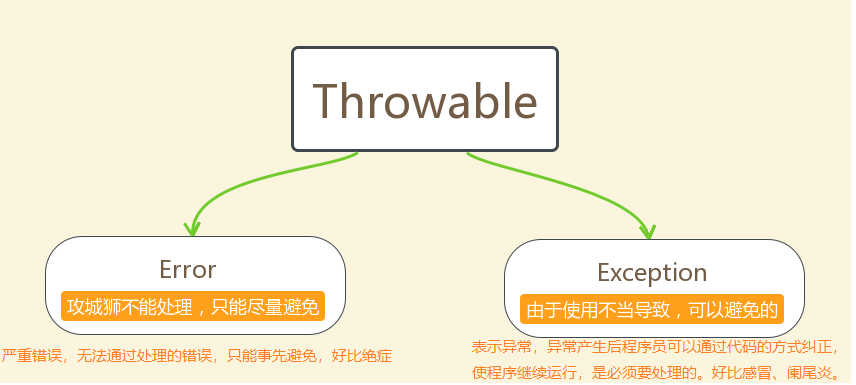
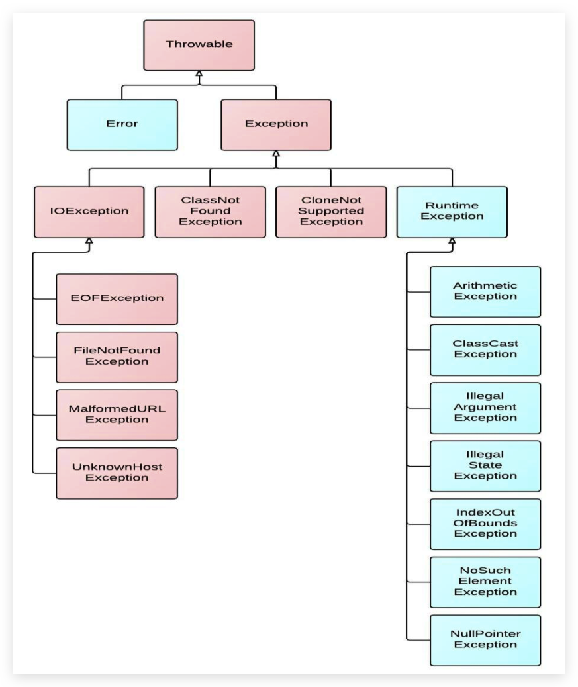

# 3 Error & Exception

-   程序执行中发生的不正常情况称为异常。

## 3.1 异常的体系

-   异常的根类是`java.lang.Throwable`，其下有两个子类：

    -   `java.lang.Error`

        **JVM无法解决的严重问题**。如:JVM系统内部错误、资源耗尽等严重情况。如栈stack、堆heap内存耗尽**StackOverflowError（可能在递归时发生）**和**OutOfMemoryError（new了非常多对象）**。一般不编写针对性的代码进行处理。

    -   `java.lang.Exception`

        其它因编程错误或偶然的外在因素导致的一般性问题，可以使用针对性的代码进行处理。

    

-   **Throwable中的常用方法：**

    -   `public void printStackTrace()`打印异常的**详细信息**。

        包含了异常的类型，异常的原因 ，还包括异常出现的位置，在开发和调试阶段，都得使用printStackTrace

    -   `public String getMessage()`获取发生异常的**原因**。提示**给用户**的时候,就提示错误原因。

## 3.2 异常的分类

我们平常说的异常就是指Exception，因为这类异常一旦出现，我们就要对代码进行更正，修复程序。对于这些错误，一般有两种解决方法：一是遇到错误就终止程序 的运行。另一种方法是由程序员在编写程序时，就考虑到错误的 检测、错误消息的提示，以及错误的处理。

**捕获错误最理想的是在编译期间**，但**有的错误只有在运行时才会发生**。 比如：除数为0，数组下标越界等。

**异常(Exception)的分类**：根据在编译时期还是运行时期去检查异常。Java语言规范将派生于**Error**类和**RuntimeException**类的所有异常称为**非受查异常（checked异常）**，其他为**受查异常（unchecked异常）**

-   **编译时期异常**：在编译时期就会检查，如果没有处理异常则编译失败。(IO、日期格式化异常)
-   **运行时期异常**：在编译时期运行异常不会被检测(不报错)。在运行时期检查异常。(数学异常)





​	

## 3.3 异常的处理

关于异常对象的产生：

-   系统自动生成的异常对象
-   手动的生成一个异常对象，并抛出（throw）

Java提供的是异常处理的**抓抛模型**。

-   抓：可以理解为异常的处理方式：try-catch-finally  、 throws
-   抛：程序在正常执行的过程中，一旦出现异常，就会在异常代码处生成一个对应异常类的对象。该异常对象将被提交给Java运行时系统，这个过程称为抛出(throw)异常。一旦抛出对象以后，其后的代码就不再执行。


### 3.3.1 抓—捕获异常 try-catch-finally

**捕获异常**：Java中对异常有针对性的语句进行捕获，可以对出现的异常进行指定方式的处理。

```java
try {
    //可能产生异常的代码
} catch (异常类名  变量名) {
    //异常的处理逻辑,异常异常对象之后,怎么处理异常对象
    //记录日志/打印异常信息/继续抛出异常
}
...
catch (异常类名 变量名) {

} finally {
    //一定会执行的代码
}
```

*   使用try将可能出现异常代码包装起来，在执行过程中，一旦出现异常，就会生成一个对应异常类的对象，根据此对象的类型，去catch中进行匹配。一旦try中的异常对象匹配到某一个catch时，就进入catch中进行异常的处理。一旦处理完成，就跳出当前的try-catch结构（只匹配一个。在没有写finally的情况）。继续执行其后的代码。

*   catch中的异常类型如果没有子父类关系，则谁声明在上，谁声明在下无所谓。也可以放入一个catch中。

    catch中的异常类型如果满足子父类关系，则要求子类一定声明在父类的上面。否则，报错。

*   常用的异常对象处理的方式： 

    *   `String  getMessage()` 
    *   `printStackTrace()`

-   在try结构中声明的变量，再出了try结构以后，就不能再被调用
-   try-catch-finally结构**可以嵌套**
-   多个异常使用捕获该如何处理
    -   多个异常分别处理
    -   多个异常**一次捕获，多次处理**（若捕获的异常**有子父类关系**，**父类放下面**；**没有**可以放在**一个catch中**）
    -   多个异常一次捕获一次处理
-   **运行时异常**被抛出**可以不处理**。即不捕获也不声明抛出。


#### finally 代码块

**finally**：`try`中异常语句后的代码不被执行，**必须要执行的**可以放在`finally`中，如**释放系统资源**。但是当在`try...catch...`中**执行`System.exit(0)`**(表示**退出当前Java虚拟机**)，**`finally`才不会执行**

语法：`try...catch....finally`，不能单独使用

-   如果**finally有return语句**，将**覆盖**原始的返回值，永远返回finally中的值。一般应避免该情况

    ```java
    public static int fin() {
        int a = 10;
        try {
            return a;
        } catch (Exception e) {
            System.out.println(e.getMessage());
        } finally {
            a = 40;
            return a; //最终返回40。这里若修改为return 4，最终就返回4
            // 若没有return a; 这行代码，则无论a怎么变化，还是会返回10；
        }
    }
    ```


### 3.3.2 抓—声明异常 throws

关键字**throws**运用于**方法声明之上**，用于**表示当前方法不处理异常**，而是**提醒**该方法的**调用者来处理异常**。

```java
修饰符 返回值类型 方法名(参数) throws 异常类名1,异常类名2…{   }
```

-   注意：

    -   throws关键字必须写在**方法声明处**，指明此方法执行时，可能会抛出的异常类型。

    -   一旦当方法体执行时，出现异常，仍会在异常代码处生成一个异常类的对象，此对象满足throws后异常

        类型时，就会被抛出。异常代码后续的代码，就不再执行！

    -   throws关键字后边声明的异常必须是**Exception或者是Exception的子类**

    -   方法内部如果**抛出了多个异常对象**，那么throws后边必须也**声明多个异常**

        如果抛出的多个异常对象有**子父类关系**,那么**直接声明父类异常即可**

    -   **调用**了一个声明**抛出异常的方法**,我们就必须的**处理**声明的异常

        -   要么**try-catch**自己处理异常
        -   要么继续使用**throws**声明抛出，交给方法的调用者处理，最终交给JVM


>   开发中如何选择使用try-catch-finally 还是使用throws？
>
>   *   **如果父类中被重写的方法没有throws方式处理异常，则子类重写的方法也不能使用throws**，意味着如果子类重写的方法中有异常，必须**使用try-catch-finally方式处理**。
>    *   **执行的方法a中，先后又调用了另外的几个方法**，这几个方法是**递进关系**执行的。我们建议这几个方法**使用throws**的方式进行处理。而执行的方法a可以考虑使用try-catch-finally方式进行处理。（可能try-catch已经捕获了异常，之后的需要的数据没获取到）


### 3.3.3 抛—抛出异常throw

在编写程序时，我们必须要考虑程序出现问题的情况。比如，在**定义方法**时，方法需要**接受参数**。那么，当调用方法使用接受到的参数时，首先需要**先对参数数据进行合法的判断**，数据若**不合法**，就应该**告诉调用者**，传递合法的数据进来。这时需要使用**抛出异常**的方式来告诉调用者。

-   在java中，提供了一个throw关键字，**throw用在方法内，抛出一个指定的异常对象**

    -   **创建一个异常对象**，封装一些提示信息(信息可以自己编写)。

    -   通过关键字**throw**将这个异常对象告知给调用者，并结束当前方法的执行

        ```java
        throw new 异常类名(参数);
        ```

-   注意：

    -   throw关键字必须写在**方法的内部**
    -   throw关键字后边new的对象必须是**Exception或者Exception的子类对象**
    -   throw关键字抛出指定的异常对象,我们就必须处理这个异常对象
        -   throw关键字后边创建的是**RuntimeException**或是**其子类对象**,**可以不处理**,默认交给JVM处理
        -   throw关键字后边创建的是**编译异常**(写代码的时候报错),我们就**必须处理**,要么throws,要么try...catch


### 3.3.6 子父类异常注意事项

-   父类的方法**抛出或不抛出**异常，子类重写的方法抛出的异常必须**小于等于父类抛出的异常**（多态）

-   父类的方法**抛出**一个或多个**异常**，**子类**重写的方法**抛出的异常**必须**与父类相同**或是**其子类**或**不抛**

-   父类的方法**没有异常抛出**，子类重写的方法**不能有异常抛出**。若**产生异常则只能捕获处理**

    


## 3.4 Objects非空判断

Objects工具类提供的判断对象是否合法`Objects.requireNonNull`，为空则抛异常，否则返回该对象。<a href="#Objects">详见此</a>


## 3.5 自定义异常

-   自定义的异常类**继承`Exception`或`RuntimeException`（尽量继承这个，对代码没有侵入性）**

-   定义**空参构造**方法和**带异常信息的构造**方法

-   提供全局常量：serialVersionUID

    ```java
    public class MyException extends Exception/*RuntimeException*/ {
        static final long serialVersionUID = -7034897190745766939L;
        
        public MyException() {
        }
    
        public MyException(String message) {
            super(message);
        }
    }
    ```


## 习题

*   常见的异常，举例说明

    *   RuntimeException（unchecked）

        *   NullPointerException

        *   ArithmeticException

            ```java
            int a = 10;
            int b = 0;
            System.out.println(a / b);
            ```

        *   ArrayIndexOutOfBoundsException

        *   NumberFormatException

            ```java
            String str = "123";
            str = "abc";
            int num = Integer.parseInt(str);
            ```

        *   InputMismatchException

            ```java
            Scanner scanner = new Scanner(System.in);
            int score = scanner.nextInt();
            System.out.println(score);
            scanner.close();
            ```

        *   ClassCastException

            ```java
            Object obj = new Date();
            String str = (String)obj;
            ```

        *   ……

    *   java.io.IOException

        *   java.io.FileNotFoundException

    *   java.lang.ClassNotFoundException

    *   java.sql.SQLException

    *   java.lang.InterruptedException

*   `throw`和`throws`区别

    *   throw：在方法体中，并且抛出一个异常对象。程序执行到t此时立即停止，它后面的语句都不执行。

        抛出的是**异常对象** ，说明这里**肯定有异常**产生。一般用于自定义异常，体现在选择语句中

    *   throws：在方法声明上，后面跟异常的类名，可以是多个，调用者处理

        **声明方法有异常**，是一种**可能性**，这个异常不一定会产生

*   `final`,`finally`,`finallize`区别

    *   `final`：最终意思，可以修饰类、成员变量、成员方法。<a href="#final">详见此</a>
    *   `finally`：异常处理，用于释放资源，finally中的代码一定会被执行，除非执行之前jvm退出
    *   `finalize`：Object类的一个方法，用于垃圾回收

*   throw语句后不能跟其他代码，否则永远执行不到，编译错误

    ```java
    try {
        throw new Exception();
        System.out.println("怎么也执行不到，编译失败");
    } catch (Exception e) {
        e.printStackTrace();
    }
    ```

*   习题

    ```java
    public class ReturnExceptionDemo {
        static void methodA() {
            try {
                System.out.println("进入方法A");
                throw new RuntimeException("制造异常");
            } finally {
                System.out.println("用A方法的finally");
            }
        }
    
        static void methodB() {
            try {
                System.out.println("进入方法B");
                return;
            } finally {
                System.out.println("调用B方法的finally");
            }
        }
    
        public static void main(String[] args) {
            try {
                methodA();
            } catch (Exception e) {
                System.out.println(e.getMessage());
            }
            methodB();
            
            // 进入方法A
            // 用A方法的finally
            // 制造异常
            // 进入方法B
            // 调用B方法的finally
        }
    }
    ```

    

