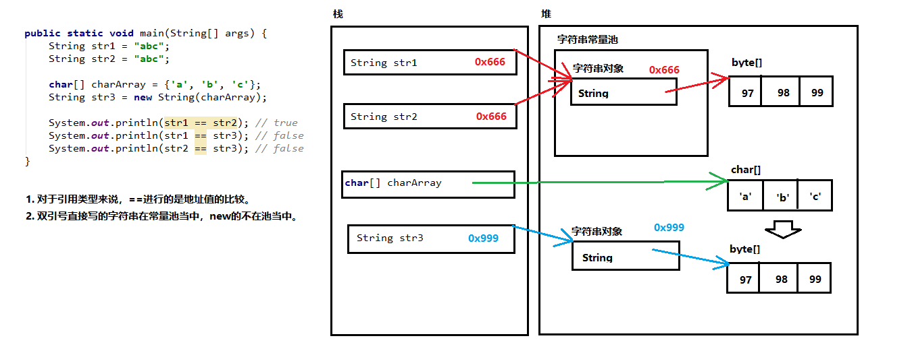
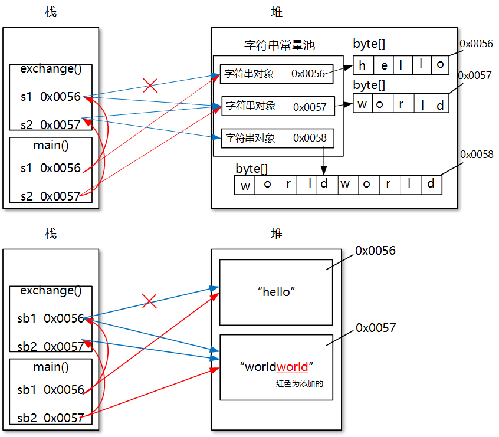

# 4 API

[[toc]]

- API（Application Programming Interface），应用程序编程接口

## 字符串相关类

### String（java.lang）

* `String`效果上相当于`char[]`（Java 8及之前），但**底层是被`final`修饰的`byte[]`**（Java 9及之后）。

    且其实现了`Serializable`，`Comparable`，`CharSequence`接口。`String`**类**及其所有**属性**都被**声明为`final`**，是**常量**，其**值在创建后不能被更改**。

    由于它的底层结构，具有**不可变性**：

    *   当对字符串重新赋值时，需要**重写指定内存区域赋值**，不能使用原有的value进行赋值

    *   当执行`concat`，`substring`，`replace`等操作都**需要重新指定内存区域赋值**（与常量池无关）

    *   字符串的`+`运算，若是**存在变量相加，先开空间再拼接，结果在堆中**；**只有常量则先拼接（类似字面量赋值），然后在常量池中找**，有就返回，没有就创建并放入常量池。如果拼接的结果调用`intern()`方法，**返回值就在常量池中**。字符串常量池中不会存储相同内容的字符串。

    *   加`final`修饰的也是常量！

        ```java
        String str1 = "hello";
        String str2 = "hello";
        char[] charArray = {'h', 'e', 'l', 'l', 'o'};
        String str3 = new String(charArray);
        String str4 = "world";
        String str5 = "helloworld";
        
        System.out.println(str1 == str2);//true
        System.out.println(str1 == str3);//false，同理str2!=str3
        System.out.println(str5 == str1 + str4);//false
        System.out.println(str5 == "hello" + "world");//true
        System.out.println(str5 == str1 + "world");//false
        System.out.println(str5 == (str1 + "world").intern());//true
        System.out.println(str3.equals(str1));//true
        
        // 注意final
        String s1 = "helloworld";
        String s2 = "hello";
        String s3 = s2 + "world";
        System.out.println(s1 == s3);// false
        
        String s11 = "helloworld";
        final String s22 = "hello";
        String s33 = s22 + "world";
        System.out.println(s11== s33);// true
        ```

* 通过**字面量直接赋值**的定义字符串的会**放入（Java8）方法区（具体实现为元空间）的字符串常量池**中；但是**`new String`方式定义的不会放入**。



*   特别的，注意**对象中的String属性**

    ```java
    Person t1 = new Person("tom", 1);
    t1.setName("hh");
    t1.name = "xx";
    Person t2 = new Person("tom", 1);
    t2.setName("hh");
    t2.name = "xx";
    System.out.println(t1.name == t2.name);// true，值在常量池中！
    ```

    


- 构造方法

    - `String()`：初始化一个新创建的 String 对象，使其表示一个空字符序列

    - `String(String original)`：初始化一个新创建的 String 对象

    - `String(char/byte[] value [, int offset ,int count])`：分配一个新的 String，它包含取自字符数组参数全部（或一个子数组）的字符

    - `String(byte[] bytes[, int offset, int length][, String charsetName])`：通过使用指定的**字符集解码**指定的 byte （或子）数组，构造一个新的 String

    - `String s = "hello"`：直接创建新的 String

        **字面值**作为**字符串对象**（新创建的字符串是该参数字符串的副本）和通过**构造方法**创建对象的不同

        `String s = new String("hello")`和`String s = "hello"`前者最多创建两对象，后者最多创建一个对象

    - ……

- String常用方法（**不改变原String值**）

    - **判断功能**

        - `boolean isEmpty()`						          字符串长度是否为0

        - `boolean contains(CharSequence cs)`                       字符串中是否包含指定字符序列

        - `boolean equals(Object anObject)`          字符串与指定字符串是否相等(**内容**)，推荐**常量放前面**

            `boolean equalsIgnoreCase(String str)`                 字符串与指定字符串是否相等，忽略大小写

        - `boolean startsWith(String prefix[,int toffset])` 从指定索引开始的子串是否以prefix开始

            `boolean endsWith(String suffix)`                             字符串是否以suffix后缀结尾

        - `boolean matches(String regex)`       判断此字符串是否匹配给定的正则表达式

    - **获取功能**

        - `int length()`：返回字符串长度

        - `String concat(String str)`                                        将字符串**拼接，本字符串不变**，常用`+`

        - `char charAt(int index)`                                              返回指定索引的字符

        - `int indexOf/lastIndexOf(int ch/String str)`   获取指定字符/字符串第一次/最后一次出现的索引

        - `int indexOf/lastIndexOf(int ch/String str,int fromIndex)`   获取指定~从**[某索引开始**第一次出现的索引/最后一次出现的索引（从指定的索引开始**反向搜索**，但返回值还是正向数数）

            `ch`是`int`类型原因：`'a'`和`97`都能代表`'a'`

            ```JAVA
            String s = "qqqqqaq";
            int a = s.lastIndexOf("a",5);//大于等于5都能搜到，值为5；小于则返回值为-1
            ```

        - `String substring(int startIndex[,int endIndex])` 获取`[start,end)`子串，没end到结尾

    - **替换**

        - `String replace(CharSequence/char target, CharSequence/char replacement)`将**所有**target 字符或字符串替换为新的 replacement 字符串。CharSequence是接口，String实现了它。用于敏感词汇过滤
        - `String replaceAll(String regex, String replacement) `使用给定的 replacement 替换此字符串所有**匹配给定的正则表达式的子字符串**

        - `String replaceFirst(String regex, String replacement)`使用给定的 replacement 替换此字符串**匹配给定的正则表达式的第一个子字符串**

- **转换功能**

    - `String static valueOf(int i/char[] chs)`       **静态方法**将int型和**字符数组型**数据转为字符串
    - `String toLowerCase() /toUpperCase()`                     将所有字符都转换为小写/大写，本身不变

    - `byte[] getBytes([Charset c/String c])`  将字符串**转换为字节数组**；相反则直接构造器传入
    - `char[] toCharArray()`                                  将字符串**转换为字符数组**；相反则直接构造器传入

- **其他功能**

    - **去空格**（去掉字符串**首尾**空格）

        `String trim()`

    - **按字典比较**（按字典顺序比较，在str前返回负数，在str后返回正数，相等则返回0）

        `int compareTo(String str)/compareIgnoreCase(String str)`

    - **切片**：根据给定**正则表达式regex**的匹配切片，返回字符串数组，**不包括regex字符串**。**最多不超过limit个**，如果超过了，剩下的全部都放到最后一个元素中。若要用英文句点`.`切分，必须写`\\.`。

        `String[] split(String regex [,int limit])`

        ```java
    String fbIds = "4542,4540,";
        String[] split = fbIds.split(",");
    System.out.println(split.length);// 2
        ```
    
    - 若常量池中包括了一个等于此String对象的字符串（由equals确定），则返回池中字符串；否则将此字符串添加到池中，并返回其引用
    
        `inter()`
    
    - **String 与 基本类型或包装类型之间转换**（见<a href="#baozhuanglei">基本语法中包装类</a>）

* 练习题

    * 字符串遍历 `char charAt(int index)`或`char[] toCharArray()`

    * 统计大串中小串出现的次数 `int indexOf(String str,int fromIndex) `或`substring`

    * 把字符串的首字母转成大写，其他小写 `String substring(int start,int end)`

    * 把一个小数转换为保留两位小数的字符串，不考虑四舍五入：加空串转为字符串，再用split即可

        * 若考虑四舍五入，则可以将保留的数转为整数，再根据后一位值对整数进行加1与否

    * 字符串必须只有字母和数字，如下是不是这种情况的：

        `(ch<='0'||ch>='9') && (ch<='A'||ch>='Z') && (ch<='a'||ch>='z') `


### StringBuilder（java.lang）

>   StringBuffer比StringBuilder每个方法都多synchronized

- `StringBuilder`(字符串缓冲区)，又称为**可变字符序列**，表示**字符容器**，其**内容和长度可变**，不同步，线程不安全。没有`override`Object类的`equals()`方法，不能像String类对象可以用操作符+进行连接。

- **底层分析**：

    - 它的**底层**是一个**`char[]`**（**Java 9后为`byte[]`**），用来存放字符串内容

    - 调用构造方法（默认长度为`s.length()+16`）或添加字符串时都会调用`append()`，并更新`count`即StringBuilder的长度，可通过`length()`获取

        它还有个属性`capacity`代表StringBuilder的容量，即底层数组的`length`，可通过`capacity()`获取

    - 若添加的数据导致底层数据存不下了（大于），需扩容底层数组：

        - 先通过`count+s.length()`减去底层数组的`length`即StringBuilder的`capacity()` ，若大于0则扩容

        - 调用`Arrays.copyOf(char[] original,int newLength)`将原数组拷贝到新数组，底层为`System.arraycopy`，其中`newLength`为底层数组原有`capacity`**左移一位（即乘2）并加2**

            若左移一次后还不够，则直接用`count+s.length()`；甚至左移后超出范围变负值（之后再总结）

- 构造方法：

    - `StringBuilder();`构造一个空的StringBuilder容器。
    - `StringBuilder(String str)`：构造一个StringBuilder容器，并将字符串添加进去。
    - `StringBuilder(int capacity)`：构造一个StringBuilder容器，并设置初始`capacity`。**推荐**使用。

- StringBuilder常用方法（**在原StringBuilder对象中改变并返回本身**，原对象也改变）

    - **增**
        - `StringBuilder append(Object o)`   添加**任意类型数据**的**字符串形式**到末尾，并**返回当前对象**自身
        - `StringBuilder append(CharSequence c,int start,int end)`：插入其中[start,end)部分
        - `StringBuilder insert(int offset,Object o)`  在字符串的**offset位置**插入**任意对象**，其余后移
    - **删**
        - `StringBuilder delete(int start,int end)`                       删除从**[start到end)**的字符串
        - `StringBuilder deleteCharAt(int index)`                           删除指定位置字符
    - **改**
        - `StringBuilder replace(int start,int end,String s)` 从**[start到end)**的对象替换为指定字符串
        - `void setCharAt(int index,char ch)`                                  **替换指定位置的字符**
    - **查**
        - `char charAt(int n)`				 	                          返回指定索引处的字符
        - `int indexOf(String str)`  				 	                 返回指定字符串所在索引
    - **反转**
        - `StringBuilder reverse()`                                                       反转
    - **截取（返回值类型不再是StringBuilder本身，原有对象不改变）**
        - `String substring(int start,int end)`                             截取子串，没有end参数时截取到尾部
    - **其他**
        - `int length()`                                                        返回StringBuilder的长度（不是capacity）
        - `void setLength(int newLength)`                                          设置StringBuilder长度
        - `int capacity()`                                                      返回StringBuilder的容量
        - `public String toString()`                          将当前StringBuilder对象**转换为String对象**

- **String和StringBuilder转换**

    1. **String ---> StringBuilder**			通过构造函数传入或构造好之后append()

    2. **StringBuilder ---> String**                     调用`toString()`或String类的`valueOf()`静态方法

        ```java
        String str1 = sb.toString();
        String str2 = String.valueOf(sb);
        ```

- **【面试】**

    *   **String、StringBuffer、StringBuilder区别**

        *   **String内容、长度不可变，后两个可变**。String拼接时，总是会在内存中创建一个新对象，影响性能
        *   **StringBuffer是同步的，数据安全，效率低；StringBuilder（5.0新增）是不同步的，数据不安全，效率高**
        *   底层都是`char[]`（java8中）；后两个初始创建**长度为`s.length()+16`的数组**，

    *   **StringBuilder和数组的区别**

        二者都可以看做装其他数据的容器，但是StringBuilder的数据最终是一个字符串数据，而数组可以存放多种类型的数据，但必须是同一种数据类型的

    *   **参数传递问题**

        * 注意：（以下画图即可理解，如下图）

            **包装类、String作为引用数据类型，是常量，具有不可变性。**

            **StringBuffer、StringBuilder在赋值时不改变内容，调用方法时改变**

            **【重点】在于String内容不可变并且变量相加需要开空间再拼接，StringBuilder等内容可以变**

    ```java
      String s1 = "hello";
      String s2 = "world";
      System.out.println(s1+"---"+s2);//hello---world
      change(s1,s2);
      System.out.println(s1+"---"+s2);//hello---world
      
      StringBuffer sb1 = new StringBuffer("hello");
      StringBuffer sb2 = new StringBuffer("world");
      System.out.println(sb1+"---"+sb2);//hello---world
      change(sb1,sb2);
      System.out.println(sb1+"---"+sb2);//hello---worldworld
      
      public static void change(String s1, String s2) {
      	s1 = s2;
      	s2 = s1+s2;
      }
      public static void change(StringBuffer sb1, StringBuffer sb2) {
      	sb1 = sb2;
      	sb2 = sb1.append(sb2);
      }
    ```

    


## 日期时间类（Java8）

计算世界时间的主要标准有：

*   UTC(Coordinated Universal Time)
*   GMT(Greenwich Mean Time)
*   CST(Central Standard Time)

时间戳：是指格林威治时间1970年01月01日00时00分00秒(北京时间1970年01月01日08时00分00秒)起至现在的总秒数。


>   JDK 1.0中包含了 一个java.util.Date类，但是它的大多数方法已经在JDK 1.1引入Calendar类之后被弃用 了。而Calendar并不比Date好多少。它们面临的问题是:
>
>   *   可变性：像日期和时间这样的类应该是不可变的。 
>
>   *   偏移性：Date中的年份是从1900开始的，而月份都从0开始。 （`new Date(...)`时体现，已被Deprecated）
>
>   *   格式化：格式化只对Date有用，Calendar则不行。 
>
>   *   线程不安全：不是线程安全的；不能处理闰秒等。
>
>       闰秒，是指为保持协调世界时接近于世界时时刻，由国际计量局统一规定在年底或年中（也可能在季末）对协调世界时增加或减少1秒的调整。由于地球自转的不均匀性和长期变慢性（主要由潮汐摩擦引起的），会使世界时（民用时）和原子时之间相差超过到±0.9秒时，就把协调世界时向前拨1秒（负闰秒，最后一分钟为59秒）或向后拨1秒（正闰秒，最后一分钟为61秒）； 闰秒一般加在公历年末或公历六月末。目前，全球已经进行了27次闰秒，均为正闰秒。最近一次闰秒在北京时间2017年1月1日7时59分59秒（时钟显示07:59:60）出现。这也是本世纪的第五次闰秒。

第三次在Java 8中引入的 java.time API 是成功的，并且纠正了过去的缺陷，将来很长一段时间内它都会为我们服务。

Java 8 吸收了 Joda-Time 的精华，以一个新的开始为 Java 创建优秀的 API。 新的 java.time 中包含了所有关于本地日期(LocalDate)、本地时间 (LocalTime)、本地日期时间(LocalDateTime)、时区(ZonedDateTime) 和持续时间(Duration)的类。历史悠久的 Date 类新增了 toInstant() 方法， 用于把 Date 转换成新的表示形式。这些新增的本地化时间日期 API 大大简 化了日期时间和本地化的管理。

时间API有如下（大多数开发者只会用到基础包和format包，也可能会用到temporal包。因此，尽管有68个新的公开类型，大多数开发者，大概将只会用到其中的三分之一）：

*   `java.time` – 包含值对象的**基础包** 
*   `java.time.chrono` – 提供对不同的日历系统的访问 
*   `java.time.format` – **格式化和解析时间和日期**
*   `java.time.temporal` – **包括底层框架和扩展特性** 
*   `java.time.zone` – 包含时区支持的类


### Instant

`java.time.Instant`：时间线上的一个**瞬时点**。 这可能被用来记录应用程序中的事件**时间戳的毫秒值**。类似Date。

在处理时间和日期的时候，我们通常会想到年,月,日,时,分,秒。然而，这只是时间的一个模型，是面向人类的。第二种通用模型是面向机器的，或者说是连续的。在此模型中，时间线中的一个点表示为一个很大的数，这有利于计算机处理。在UNIX中，这个数从1970年开始，以秒为的单位；同样在Java中，也是从1970年开始，但以毫秒为单位。

`java.time`包通过值类型`Instant`提供机器视图，不提供处理人类意义上的时间单位。`Instant`表示时间线上的一点，而不需要任何上下文信息，例如，时区。 概念上讲，它只是简单的表示自1970年1月1日0时0分0秒(UTC)开始的秒数。因为`java.time`包是基于纳秒计算的，所以`Instant`的精度可以达到**纳秒**级。`1s = 10^3ms = 10^6us = 10^9ns`

常用方法：

-   `now()` ：静态方法，返回默认**UTC**时区（本初子午线时区）的`Instant`类的对象
-   `ofEpochMilli(long epochMilli)`：静态方法，返回在1970-01-01 00:00:00基础上加上指定毫秒数之后的`Instant`类的对象


-   `toEpochMilli()`：返回1970-01-01 00:00:00（UTC）到当前时间的毫秒数，即为时间戳的毫秒值
-   `atOffset(ZoneOffset offset)`：`Instant`对象调用，结合即时的偏移来创建一个 `OffsetDateTime`

```java
Instant instant = Instant.now();
System.out.println(instant);// 2019-10-05T10:28:53.822283Z，是本初子午线时区时间

Instant instant1 = Instant.ofEpochMilli(1570271687516L);
System.out.println(instant1);// 2019-10-05T10:34:47.516Z

long l = instant.toEpochMilli();
System.out.println(l);// 1570271540852

OffsetDateTime offsetDateTime = instant.atOffset(ZoneOffset.ofHours(8));
System.out.println(offsetDateTime);// 2019-10-05T18:35:07.753807+08:00
```


### LocalDate、LocalTime、LocalDateTime

`java.time`包下的`LocalDate`、`LocalTime`、`LocalDateTime` 类是其中较重要的几个类，它们的实例是**不可变的对象**，分别表示使用 ISO-8601日历系统的日期、时间、日期和时间。 它们提供了简单的本地日期或时间，并不包含当前的时间信息，也不包含与时区相关的信息。（ISO-8601日历系统是国际标准化组织制定的现代公民的日期和时间的表示法，也就是公历）类似Calendar。

`LocalDate`：代表IOS格式(yyyy-MM-dd)的日期，可以存储 生日、纪念日等日期。 

`LocalTime`：表示一个时间，而不是日期。 

`LocalDateTime`：用来表示日期和时间的，这是一个最常用的类之一。

构造方法：

*   `now([ZoneId zone])`：静态方法，根据**当前时间**创建对象/指定时区的对象
*   `of(...)`：静态方法，根据**指定**日期/时间创建对象，没有偏移量

获取方法：

*   `getYear()`：获得年份
*   `getMonth()`：获得月份, 返回一个 `Month` 枚举值，可通过`getValue()`获取其值（1-12）
*   `getMonthValue()`：获得月份（1-12） 
*   `getDayOfMonth()/getDayOfYear()`：获得月份天数(1-31) /获得年份天数(1-366)
*   `getDayOfWeek()`：获得星期几，返回一个 `DayOfWeek` 枚举值，可通过`getValue()`获取其值（1-7）
*   `getHour()/getMinute()/getSecond()/getNano()`：获得当前对象对应的小时、分钟、秒、纳秒

设置方法（**返回新的对象**）：

*   `withYear() / withMonth() / withDayOfMonth() / withDayOfYear() / withHour() / withMinute() / withSecond() / withNano()`：将 年份 / 月份 / 月份天数 / 年份天数 / 时 / 分 / 秒 修改为指定的值并**返回新的对象**

计算方法（**返回新的对象**）：

*   `plusYears() / plusMonths() / plusDays() / plusWeeks() / plusHours() / plusMinutes() / plusSeconds() / plusNanos() `：向当前对象添加 几年 / 几月 / 几天 / 几周 / 几小时 / 几分 / 几秒 / 几纳秒，并**返回新的对象**
*   `minusYears() / minusMonths() / minusDays() / minusWeeks() / minusHours() / minusMinutes() / minusSeconds() / minusNanos() `：向当前对象减去 几年 / 几月 / 几天 / 几周 / 几小时 / 几分 / 几秒 / 几纳秒，并**返回新的对象**

```java
// 当前时区年月日时分秒纳秒
LocalDateTime now = LocalDateTime.now();
System.out.println(now);// 2019-10-05T15:34:50.420465
LocalDate localDate = LocalDate.now();
System.out.println(localDate);// 2019-10-05
LocalTime localTime = LocalTime.now();
System.out.println(localTime);// 16:01:27.076062

// 指定年月日时分秒纳秒
LocalDateTime of = LocalDateTime.of(2019, 10, 5, 14, 11, 11, 111111111);
System.out.println(of);// 2019-10-05T11:11:11.111111111

// 获取API
System.out.println(now.getYear());// 2019
System.out.println(now.getMonth());// OCTOBER
System.out.println(now.getMonthValue());// 10
System.out.println(now.getDayOfMonth());// 5
System.out.println(now.getDayOfYear());// 278
System.out.println(now.getDayOfWeek());// SATURDAY
System.out.println(now.getHour());// 15
System.out.println(now.getMinute());// 45
System.out.println(now.getSecond());// 28
System.out.println(now.getNano());// 576880000
System.out.println(now.getChronology());// ISO

// 设置API，会返回新的对象！
System.out.println(now.withYear(2222));// 2222-10-05T15:56:28.583009
System.out.println(now.withMonth(11));// 2019-11-05T15:56:28.583009
System.out.println(now.withDayOfMonth(11));// 2019-10-11T15:56:28.583009
System.out.println(now.withDayOfYear(222));// 2019-08-10T15:56:28.583009
System.out.println(now.withHour(11));// 2019-10-05T11:56:28.583009
System.out.println(now.withMinute(11));// 2019-10-05T15:11:28.583009
System.out.println(now.withSecond(11));// 2019-10-05T15:56:11.583009
System.out.println(now.withNano(111111111));// 2019-10-05T15:56:28.111111111

// 计算API，会返回新的对象！minus就不演示了
System.out.println(now.plusYears(1));// 2020-10-05T16:07:11.942319
System.out.println(now.plusMonths(1));// 2019-11-05T16:07:11.942319
System.out.println(now.plusDays(1));// 2019-10-06T16:07:11.942319
System.out.println(now.plusWeeks(1));// 2019-10-12T16:07:11.942319
System.out.println(now.plusHours(1));// 2019-10-05T17:07:11.942319
System.out.println(now.plusMinutes(1));// 2019-10-05T16:08:11.942319
System.out.println(now.plusSeconds(1));// 2019-10-05T16:07:12.942319
System.out.println(now.plusNanos(1));// 2019-10-05T16:07:11.942319001
```


### DateTimeFormatter

`java.time.format.DateTimeFormatter`类，类似`DateFormat`，提供格式化和解析方法：

构造方法：

*   `ISO_LOCAL_DATE_TIME`;`ISO_LOCAL_DATE`;`ISO_LOCAL_TIME`等：静态方法，预定义的标准格式

*   `ofLocalizedDateTime/Date/Time(FormatStyle style)`：静态方法，本地化相关的格式

    *   `FormatStyle.FULL`

        *   Java8：`2019年10月5日 星期六 下午07时32分13秒 +08:00`
        *   Java11：`2019年10月5日星期六 +08:00 下午7:32:13`

    *   `FormatStyle.LONG`：`2019年10月5日 +08:00 下午7:30:58`

        *   Java8：`2019年10月5日 下午07时33分32秒`
        *   Java11：`2019年10月5日 +08:00 下午7:33:58`

    *   `FormatStyle.MEDIUM`：`2019年10月5日 下午7:31:31`

        *   Java8：`2019-10-5 19:34:52`
        *   Java11：`2019年10月5日 下午7:34:26`

    *   `FormatStyle.SHORT`：`2019/10/5 下午7:31`

        *   Java8：`19-10-5 下午7:36`
        *   Java11：`2019/10/5 下午7:36`

        >    ⚠️注意
        >
        >   使用`FULL`和`LONG`参数时，在`format()`一个`LocalDateTime`，Java8中OK，Java11中报错，提示`Unable to extract ZoneId from temporal`。可以给LocalDateTime设置时区即可解决：`localDateTime.atZone(ZoneId.of("Asia/Shanghai"))`

*   `ofPattern(String pattern)`：静态方法，**指定字符串格式**。常用，如`yyyy-MM-dd HH:mm:ss`

常用方法：

* `format(TemporalAccessor t)`：格式化一个日期、时间、日期时间（`Local***`），返回字符串
* `parse(CharSequence text)`：将指定格式的字符序列解析为一个日期、时间、日期时间（`Local***`）

```java
LocalDateTime localDateTime = LocalDateTime.now();
System.out.println(localDateTime);// 2019-10-05T18:56:54.511646

// 1 预定义的标准格式
DateTimeFormatter formatter1 = DateTimeFormatter.ISO_LOCAL_DATE_TIME;
// format
String format1 = formatter1.format(localDateTime);
System.out.println(format1);// 2019-10-05T18:56:54.511646，此时使用默认的，若是ISO_LOCAL_DATE则只有年月日，其他同理
// parse
TemporalAccessor parse1 = formatter1.parse("2019-10-05T18:55:25.737715");
System.out.println(parse1);// {},ISO resolved to 2019-10-05T18:55:25.737715，接口中内容多，可以指定Field


// 2 预定义的标准格式
DateTimeFormatter formatter2 = DateTimeFormatter.ofLocalizedDateTime(FormatStyle.MEDIUM);// 只列举一个
// format
String format2 = formatter2.format(localDateTime.atZone(ZoneId.of("+8")));
System.out.println(format2);// 2019-10-5 19:38:48
//parse
TemporalAccessor parse2 = formatter2.parse("2019-10-5 19:38:48");
System.out.println(parse2);// {},ISO resolved to 2019-10-05T19:38:48


// 3 指定字符串格式，常用
DateTimeFormatter formatter3 = DateTimeFormatter.ofPattern("yyyy-MM-dd HH:mm:ss");
// format
String format3 = formatter3.format(localDateTime.atZone(ZoneId.of("+8")));
System.out.println(format3);// 2019-10-05 19:43:34
//parse
TemporalAccessor parse3 = formatter3.parse("2019-10-05 19:43:04");
System.out.println(parse3);// {},ISO resolved to 2019-10-05T19:43:04
```


### 其它API

*   `ZoneId`：该类中包含了所有的时区信息，一个时区的ID，可以用三种格式定义：

    *   在区域偏移中，可以是“Z”，“+ hh:mm:ss”或“-hh:mm:ss”，例如“+01:00”。
    *   前缀为“UTC”，“GMT”或“UT”，后跟区域偏移量，例如“UTC + 01:00”。
    *   在区域名称中，例如，“Europe/Paris”。

*   `ZonedDateTime`：一个在ISO-8601日历系统时区的日期时间

    如`2019-10-05T22:29:08.174+08:00[Asia/Shanghai]`，其中每个时区都对应着ID，地区ID都为`{区域}/{城市}`的格式，例如：`Asia/Shanghai`等

    ```java
    // ZoneId的getAvailableZoneIds():获取所有可用的ZoneId
    Set<String> zoneIds = ZoneId.getAvailableZoneIds();
    for (String s : zoneIds) {
        System.out.println(s);
    }
    System.out.println(zoneIds.size());// 600
    
    // ZoneId的of():获取指定时区的时间
    LocalDateTime localDateTime = LocalDateTime.now(ZoneId.of("Asia/Shanghai"));
    System.out.println(localDateTime);// 2019-10-05T22:29:08.169
    
    
    // ZonedDateTime:带时区的日期时间
    // ZonedDateTime的now():获取本时区的ZonedDateTime对象
    ZonedDateTime zonedDateTime = ZonedDateTime.now();
    System.out.println(zonedDateTime);// 2019-10-05T22:29:08.174+08:00[Asia/Shanghai]
    
    // ZonedDateTime的now(ZoneId id):获取指定时区的ZonedDateTime对象
    ZonedDateTime zonedDateTime1 = ZonedDateTime.now(ZoneId.of("Asia/Shanghai"));
    System.out.println(zonedDateTime1);// 2019-10-05T22:29:08.174+08:00[Asia/Shanghai]
    ```

*   `Clock`：使用时区提供对当前即时、日期和时间的访问的时钟。

*   `Duration`：持续时间，用于计算两个“时间”间隔

    ```java
    //Duration:用于计算两个“时间”间隔，以秒和纳秒为基准
    LocalTime localTime = LocalTime.now();
    LocalTime localTime1 = LocalTime.of(15, 23, 32);
    
    //between():静态方法，返回Duration对象，表示两个时间的间隔
    Duration duration = Duration.between(localTime1, localTime);
    System.out.println(duration);// PT7H16M18.397S
    System.out.println(duration.getSeconds());// 26178
    System.out.println(duration.getNano());// 397000000
    
    LocalDateTime localDateTime = LocalDateTime.of(2016, 6, 12, 15, 23, 32);
    LocalDateTime localDateTime1 = LocalDateTime.of(2017, 6, 12, 15, 23, 32);
    Duration duration1 = Duration.between(localDateTime, localDateTime1);
    System.out.println(duration1.toDays());// 365
    System.out.println(duration1.toHours());// 8760
    System.out.println(duration1.toMinutes());// 525600
    System.out.println(duration1.toMillis());// 31536000000毫秒
    System.out.println(duration1.toNanos());// 31536000000000000
    ```

*   `Period`：日期间隔，用于计算两个“日期”间隔

    ```java
    //Period:用于计算两个“日期”间隔，以年、月、日衡量
    LocalDate localDate = LocalDate.now();
    LocalDate localDate1 = LocalDate.of(2028, 3, 18);
    Period period = Period.between(localDate, localDate1);
    
    System.out.println(period);// P8Y5M13D
    System.out.println(period.getYears());// 8
    System.out.println(period.getMonths());// 5
    System.out.println(period.getDays());// 13
    System.out.println(period.getChronology());// ISO
    
    Period period1 = period.withYears(2);// 类似于set
    System.out.println(period1);// P2Y5M13D
    ```

*   `TemporalAdjuster`：时间校正器。有时我们可能需要获取例如，将日期调整到“下一个工作日”等操作。

*   `TemporalAdjusters`：该类通过静态方法`firstDayOfXxx()/lastDayOfXxx()/nextXxx()`提供了大量的常用`TemporalAdjuster`的实现

    ```java
    // TemporalAdjuster:时间校正器
    // 获取当前日期的下一个周日是哪天?
    TemporalAdjuster temporalAdjuster = TemporalAdjusters.next(DayOfWeek.SUNDAY);
    LocalDateTime localDateTime = LocalDateTime.now().with(temporalAdjuster);
    System.out.println(localDateTime);// 2019-10-06T22:47:44.501
    
    // 获取下一个工作日是哪天? @FunctionalInterface->TemporalAdjuster::adjustInto()
    LocalDate localDate = LocalDate.now().with(temporal -> {
        LocalDate date = (LocalDate) temporal;
        if (date.getDayOfWeek().equals(DayOfWeek.FRIDAY)) {
            return date.plusDays(3);
        } else if (date.getDayOfWeek().equals(DayOfWeek.SATURDAY)) {
            return date.plusDays(2);
        } else {
            return date.plusDays(1);
        }
    });
    System.out.println("下一个工作日是:" + localDate);
    ```

    


### 新旧API转换

| 类                                                       | To 遗留类                             | From 遗留类                 |
| -------------------------------------------------------- | ------------------------------------- | --------------------------- |
| java.time.Instant与java.util.Date                        | Date.from(instant)                    | date.toInstant()            |
| java.time.Instant与java.sql.Timestamp                    | Timestamp.from(instant)               | timestamp.toInstant()       |
| java.time.ZonedDateTime与java.util.GregorianCalendar     | GregorianCalendar.from(zonedDateTime) | cal.toZonedDateTime()       |
| java.time.LocalDate与java.sql.Time                       | Date.valueOf(localDate)               | date.toLocalDate()          |
| java.time.LocalTime与java.sql.Time                       | Date.valueOf(localDate)               | date.toLocalTime()          |
| java.time.LocalDateTime与java.sql.Timestamp              | Timestamp.valueOf(localDateTime)      | timestamp.toLocalDateTime() |
| java.time.ZoneId与java.util.TimeZone                     | Timezone.getTimeZone(id)              | timeZone.toZoneId()         |
| java.time.format.DateTimeFormatter与java.text.DateFormat | formatter.toFormat()                  | 无                          |


## 日期时间类（旧）


### System（java.lang）

*   `long currentTimeMillis()`                **获取当前时间戳的毫秒值**，东八区应加8个小时。测试程序效率

### Date（java.util）

- **Date**用于表示日期和时间，可以精确到**毫秒**

- **时间戳**是指格林威治时间1970年01月01日00时00分00秒起至现在的总**秒**数

- **构造方法**（只有两个没过时）

    - `Date()`                   用于创建**当前**日期时间的Date对象
    - `Date(long date)` 用于创建**指定时间戳毫秒值**的Date对象，也可用时间戳/1000

- **成员方法**

    - `getTime()`          返回此对象的**时间戳的毫秒值**
    - `setTime()`          设置此对象的**时间戳的毫秒值**
    - `toString()`         把此 Date 对象转换为以下形式的 String：`dow mon dd hh:mm:ss zzz yyyy`，dow 是一周中的某一天 (Sun, Mon, Tue, Wed, Thu, Fri, Sat)，zzz是时间标准

    ```java
    Date date = new Date();
    System.out.println(date); //Sun Oct 28 15:49:55 CST 2018，就是本地时间，这个CST是什么意思？
    		
    long date = System.currentTimeMillis();//当前时间戳的毫秒值
    Date dd = new Date(date);
    System.out.println(dd); //Sun Oct 28 15:49:55 CST 2018
    ```

    


### Date（java.sql）

*   对应数据库中date类型，是`util.Date`的**子类**

*   **构造方法**（只有一个没过时）

*   `Date(long date)` 用于创建**指定时间戳毫秒值**的Date对象，也可用时间戳/1000

*   **成员方法**

    -   `getTime()`          返回此对象的**时间戳的毫秒值**
    -   `setTime()`          设置此对象的**时间戳的毫秒值**
    -   `toString()`         把此 Date 对象转换为以下形式的 String：`yyyy-MM-dd`

    ```java
    java.sql.Date date1 = new java.sql.Date(timeMillis);
    System.out.println(date1);//2019-10-04
    //其他方法同java.util.Date类似
    ```

*   `sql.Date` —> `util.Date`

    ```java
    // 多态，直接赋值
    java.util.Date d = new java.sql.Date(timeMillis);
    ```

*   `util.Date` —> `sql.Date`

    ```java
    // 通过时间戳的毫秒值间接转换
    java.sql.Date date = new java.sql.Date(new java.util.Date().getTime());
    ```

    

### DateFormat（java.text）

- Date类的API不易于国际化，大部分被废弃了，`java.text.DateFormat`抽象类是一个不与语言环境有关的方式来格式化和解析日期的类。使用其实现类**`SimpleDateFormat` **

- 构造方法（无参构造为默认格式）

    - **指定格式构造**：`SimpleDateFormat sdf = new SimpleDateFormat(String pattern)`

    - **pattern**：指定格式，一般为 `yyyy-MM-dd HH:mm:ss`二十四小时制，详细的查看API

        

- **格式化**`String format(Date d)`：Date--->String     

    ```java
    Date date = new Date(); //Sun Oct 28 16:46:42 CST 2018
    SimpleDateFormat format = new SimpleDateFormat("yyyy年MM月dd日 HH：mm：ss");
    String s = format.format(date);
    System.out.println(s); //2018年10月28日 16：45：43
    ```

- **解析**`Date parse(String str)`：String--->Date    

    该方法声明了一个异常，如果字符串和构造方法中格式不一致，程序会抛出`ParseException`

    ```java
    String s = "2018年10月28日 16：45：43";
    SimpleDateFormat format = new SimpleDateFormat("yyyy年MM月dd日 HH：mm：ss");
    Date parse = format.parse(s); //try...catch处理或throws处理
    System.out.println(parse); //Sun Oct 28 16:46:42 CST 2018
    ```

- 出生多少天

    ```java
    Scanner sc = new Scanner(System.in);
    //System.out.println("出生天数计算（不足一天按一天算）");
    //System.out.println("输入您的出生年月日（例，2000年01月01日）：");
    String birth = sc.next();
    SimpleDateFormat format = new SimpleDateFormat("yyyy年MM月dd日");
    Date date = format.parse(birth);
    long birthTime = date.getTime();
    int day = (int) Math.ceil((System.currentTimeMillis()-birthTime)/(24*60*60*1000*1.0));// 注意不足一天按一天算
    System.out.println("您出生"+day+"天了。");
    ```


### Calendar（java.util）

* 日历类，是**抽象类**。在Date后出现（JDK1.1），替换掉了许多Date的方法。该类将所有可能用到的时间信息封装为**静态成员变量**，方便获取。日历类就是方便获取各个时间属性的。

- **调用静态方法获取一个Calendar对象，就是GregorianCalendar对象**

    ```java
    Calendar calendar = Calendar.gerInstance();
    ```

- 调用它的子类`GregorianCalendar`的构造器

- 提供了如下字段等：

    - `YEAR`、`MONTH`、`DAY_OF_MONTH（DATE）`、`DAY_OF_WEEK`（周日为1,1~7）
    - `HOUR`、`HOUR_OF_DAY`、`MINUTE`、`SECOND`

- **常用方法**(注意，**MONTH从0开始**)

    - **获取指定日历字段**的**值**

        `int get(int field)`

    - 设置**指定日历字段**的**值**

        `void set(int field,int value)`

    - 设置**日历字段的值**(年月日时分秒等)

        `void set(int year,int month,int date,int hourofday,int minute,int second)`

    - 根据日历规则，为指定日历字段**加上**或**减去指定时间量**

        `void add(int field,int amount)`

    - **得到**对应的**Date对象**

        `Date getTime()`

    - 使用给定的 `Date` 设置此 Calendar 的时间

        `void setTime(Date date)`

- 计算任意二月有多少天

    ```java
    public static int getNumOfDay(int year) {
        Calendar c = Calendar.getInstance();
        c.set(year,2,1);
        c.add(Calendar.DATE,-1);
        return c.get(Calendar.DAY_OF_MONTH);
    }
    ```

- **【面试】**

    - Date类用来表示某个特定的瞬间，能够精确到毫秒。而在实际应用中，往往需要把一个日期中的年、月、日等信息单独返回进行显示或处理，这个类中的大部分方法都已被标记过时。Calendar类基本取代了Date类，该类中定义了一系列用于完成日期和时间字段操作的方法。 
        Calendar的`getTime()`方法)返回一个表示Calendar时间值的Date对象，同时Calendar有一个`setTime(Date date)`方法接收一个Date对象，将Date对象表示的时间值设置给Calendar对象，通过这两个方法就可以完成Date和Calendar对象之间的转换。


## 比较器类

在Java中经常会涉及到对象数组的排序问题，那么就涉及到**对象之间的比较**问题，Java实现对象排序的方式有两种：

*   自然排序：`java.lang.Comparable`
*   比较器排序：`java.util.Comparator`


### Comparable—compareTo

*   `Comparable`接口**强行对实现它的每个类的对象进行整体排序**。这种排序被称为类的**自然排序**。
*   实现`Comparable` 的类必须重写` compareTo(Object obj)` 方法，两个对象通过该方法的返回值来比较大小。
    *   如果当前对象this大于形参对象obj，则返回正整数
    *   如果当前对象this小于形参对象obj，则返回负整数
    *   如果当前对象this等于形参对象obj，则返回零。
*   实现`Comparable`接口的对象列表(和数组)可以通过 `Collections.sort` 或 `Arrays.sort`进行自动排序。实现此接口的对象可以用作有序映射中的键或有序集合中的元素，无需指定比较器。
*   对于类 C 的每一个 e1 和 e2 来说，当且仅当 `e1.compareTo(e2) == 0` 与 `e1.equals(e2)` 具有相同的 boolean 值时，类 C 的自然排序才叫做与 equals 一致。建议（虽然不是必需的）**最好使自然排序与 equals 一致**。

*   `Comparable` 的典型实现（**默认都是从小到大排列**的）：
    *   `8种包装类`：按照对应的数值大小进行比较。都实现了`compareTo()`（底层调用后者），提供了`compare()`。其中：
        *   `Character`按照字符的`Unicode`值来进行比较。
        *   `Boolean`中`true`对应的包装类实例大于`false`对应的包装类实例。
    *   `String`：按照字符串中字符的Unicode值进行比较。实现了`compareTo()`
    *   `Date`、`*Date/Time`等：后面的日期时间比前面的日期时间大。实现了`compareTo()`
    *   `BigInteger`、`BigDecimal`，实现了`compareTo()`


### Comparator—compare

*   当元素的类型没有实现`java.lang.Comparable`接口而又**不方便修改代码**， 或者实现了`java.lang.Comparable`接口的**排序规则不适合当前的操作**，那 么可以使用 `Comparator` 的对象来排序，强行对多个对象进行整体排序的比较。

*   重写`compare(Object o1,Object o2)`方法，比较o1和o2的大小

    *   如果方法返回正整数，则表示o1大于o2
    *   如果返回0，表示相等
    *   返回负整数，表示 o1小于o2。

*   可以将 `Comparator` **传递给 `sort` 方法**（如`Collections.sort` 或 `Arrays.sort`）， 实现精确控制排序。

*   还可以使用 `Comparator` 来控制某些数据结构（如有序set或有序map）的顺序，或者为那些没有自然顺序的对象 `container` 提供排序。

*   **方法（结合 Lambda 使用）**

    ```java
    TreeSet<Person> people = new TreeSet(
        Comparator.comparingInt(Person::getAge).thenComparing(Person::getName).reversed()
    );
    ```

    


## 精确数据类型

### BigInteger

- `Integer`类作为int的包装类，能存储的最大整型值为`2^31-1`，`Long`类也是有限的， 最大为`2^63-1`。如果要表示再大的整数，不管是基本数据类型还是他们的包装类都无能为力，更不用说进行运算了。
- `java.math`包的`BigInteger`可以表示不可变的**任意精度**的整数。`BigInteger` 提供所有 Java 的基本整数操作符的对应物，并提供 `java.lang.Math` 的所有相关方法。 另外，`BigInteger` 还提供以下运算：模算术、GCD 计算、质数测试、素数生成、位操作以及一些其他操作。
- 静态常量
    - `BigInteger ZERO` The BigInteger constant zero.
    - `BigInteger ONE` The BigInteger constant one.
    - `	BigInteger TWO`  `SINCE 9`,The BigInteger constant two.
    - `BigInteger TEN` The BigInteger constant ten.
- 构造方法
    - `BigInteger(String val)`：根据字符串构建BigInteger对象
- 常用方法
    - `public BigInteger abs()` 返回此 BigInteger 的绝对值的 BigInteger
    - `BigInteger add(BigInteger val)` 返回其值为 (this + val) 的 BigInteger
    - `BigInteger subtract(BigInteger val)` 返回其值为 (this - val) 的 BigInteger
    - `BigInteger multiply(BigInteger val)` 返回其值为 (this * val) 的 BigInteger
    - `BigInteger divide(BigInteger val)` 返回其值为 (this / val) 的 BigInteger。整数相除只保留整数部分。
    - `BigInteger remainder(BigInteger val)` 返回其值为 (this % val) 的 BigInteger
    - `BigInteger[] divideAndRemainder(BigInteger val)`返回包含 (this / val) 后跟(this % val) 的两个 BigInteger 的数组
    - `BigInteger pow(int exponent)` :返回其值为 `this^exponent` 的 BigInteger。
    - `int compareTo(BigInteger val)` **Compares** this BigInteger with the specified BigInteger.


### BigDecimal

一般的Float类和Double类可以用来做科学计算或工程计算，但在商业计算中，要求数字精度比较高，故用到`java.math.BigDecimal`类。浮点数据做运算，会丢失精度。所以，针对浮点数据的操作建议采用`BigDecimal`

- 静态常量

    - `BigDecimal ONE` The value 1, with a scale of 0.
    - `BigDecimal TEN` The value 10, with a scale of 0.
    - `BigDecimal ZERO` The value 0, with a scale of 0.
    - `Enum RoundingMode`**有需要舍入的方法时，采用该枚举类**，替换之前的BigDecimal下的静态常量

- 构造方法（尽量使用参数类型为**String**的构造方法）

    - `BigDecimal(double val)`
    - `BigDecimal(String val)`

- 常用方法

    - `BigDecimal add(BigDecimal augend)`

    - `BigDecimal subtract(BigDecimal subtrahend)`

    - `BigDecimal multiply(BigDecimal multiplicand)`

    - `BigDecimal divide(BigDecimal divisor, int scale, int roundingMode)`

    - `int compareTo(BigDecimal val)` Compares this `BigDecimal` with the specified `BigDecimal`.

        

- BigDecimal都是不可变的（immutable）的，在进行每一步运算时，都会产生一个新的对象，所以在做加减乘除运算时千万要**保存操作后的值**。

    ```java
    BigInteger bi = new BigInteger("12433241123");
    BigDecimal bd = new BigDecimal("12435.351");
    BigDecimal bd2 = new BigDecimal("11");
    System.out.println(bi);
    // java.lang.ArithmeticException: Non-terminating decimal expansion; no exact representable decimal result.
    // System.out.println(bd.divide(bd2)); // 不能除尽，需指定精度
    System.out.println(bd.divide(bd2, BigDecimal.ROUND_HALF_UP));
    // 除数;精度;四舍五入
    System.out.println(bd.divide(bd2, 15, BigDecimal.ROUND_HALF_UP));
    ```

    


## Object（java.lang）

-   Object是Java语言中的根类，所有类的父类（直接或间接继承），所有对象（包括数组）都实现这个类的方法。有且只有一个无参构造方法，在对象实例化的时候，最终找的父类就是Object。

-   **方法：**

    -   **`toString()`**其返回值是String类型，返回类名和它的引用地址。直接输出一个对象引用时，默认调用该方法

        **默认打印的值**是由类的全名+'@'+哈希值的十六进制表示`getClass().getName() + "@" + Integer.toHexString(hashCode());`，没意义所以一般由**子类重写**。String、Date、File、包装类等都重写了该方法

    -   **`equals()`**比较两个对象是否相同，底层用的是**`==`**。`String`重写了该方法
        **默认**情况下**比较的是对象地址值**是否相同，没意义所以一般由**子类重写**，注意多态向下转型问题。重写原则如下：

        -   对称性:如果x.equals(y)返回是“true”，那么y.equals(x)也应该返回是 “true”

        -   自反性:x.equals(x)必须返回是“true”

        -   传递性:如果x.equals(y)返回是“true”，而且y.equals(z)返回是“true”，那么z.equals(x)也应该返回是“true”

        -   一致性:如果x.equals(y)返回是“true”，只要x和y内容一直不变，不管你重复x.equals(y)多少次，返回都是“true”

            任何情况下，x.equals(null)，永远返回是“false”；x.equals(和x不同类型的对象)永远返回是“false”

    -   **`hashCode()`**返回**对象的哈希值**，十进制整数，不是实际地址值，是**逻辑地址值**
        使用带Hash的	**Set、Map中键**时需要**给添加的自定义类重写**`hashCode()`和`equals()`

    -   `getClass()`返回对象的字节码文件对象，反射中讲解

    -   `finalize()`未被引用的对象（为null）将被垃圾回收。也可以调用`System.gc()`或`Runtime.getRuntime().gc()`来通知系统进行垃圾回收，但是系统是否进行垃圾回收依然不确定。在垃圾回收机制回收任何对象之前，总会调用该对象的`finalize()`方法。但若重写该方法，则又激活该对象（明白？）。总之不要主动调用该方法，应该交给垃圾回收机制来调用。

    -   `clone()`实现对象**克隆**，包括成员变量的数据复制，但是它和两个引用指向同一个对象是有区别的 

    -   wait / notify / notifyAll

-   只声明了一个空参构造器

-   **【面试】**==和equals()区别：

    1.  `==`：**基本类型**：比较值是否相等；**引用类型**：比较地址值是否相等；左右两边类型必须一致！
    2.  `equals()`：只能比较**引用类型**，比较地址值是否相等，底层是`==`，可以根据需要重写。String、Date、File、包装类等都重写了该方法，比较两对象的“内容”是否相同。


String重写equals()方法

```java
// JDK8
public boolean equals(Object anObject) {
  if (this == anObject) {
    return true;
  }
  if (anObject instanceof String) {
    String anotherString = (String)anObject;
    int n = value.length;
    if (n == anotherString.value.length) {
      char v1[] = value;
      char v2[] = anotherString.value;
      int i = 0;
      while (n-- != 0) {
        if (v1[i] != v2[i])
          return false;
        i++;
      }
      return true;
    }
  }
  return false;
}

// JDK11
public boolean equals(Object anObject) {
  if (this == anObject) {
    return true;
  }
  if (anObject instanceof String) {
    String aString = (String)anObject;
    if (coder() == aString.coder()) {
      return isLatin1() ? StringLatin1.equals(value, aString.value)
        								: StringUTF16.equals(value, aString.value);
    }
  }
  return false;
}
```


### Objects

在**JDK7**添加的，它提供了一些静态方法来**操作对象**，这些方法是null-save（空指针安全的）或null-tolerant（容忍空指针的），计算对象的`toString`、`hashCode`、`equals`、`requireNonNull`等等。

```java
public static String toString(Object o) {  //Objects.toString()源码
    return String.valueOf(o);
}
public static int hashCode(Object o) {    //Objects.hashCode()源码
    return o != null ? o.hashCode() : 0;
}
public static boolean equals(Object a, Object b) {  //Objects.equals()源码
    return (a == b) || (a != null && a.equals(b));  
}
public static <T> T requireNonNull(T obj[, String message]) {   //Objects.requireNonNull()源码
    if (obj == null)
        throw new NullPointerException([message]);
    return obj;
}
```


## System（java.lang）

-   System类代表系统，系统级的很多**属性**和控制**方法**都放置在该类的内部，并且都是**静态**的，且该类的构造器是private的

-   成员变量

    -   `in`：标准输入流（键盘输入）
    -   `out`：标准输出流（显示器）
    -   `err`：标准错误输出流（显示器）

-   成员方法

    -   `long currentTimeMillis()`：返回当前计算机时间和GMT时间(格林威治时间)1970年1月1号0时0分0秒所差的毫秒数，即**获取当前时间戳的毫秒值**。测试程序效率

    -   `void exit(int status)`：退出当前运行的JVM，status表示状态码，0表示正常退出，非0表示异常终止。使用该方法可以在图形界面编程中实现程序的退出功能等

    -   `void gc()`：请求系统进行垃圾回收，至于系统是否立刻回收，则 取决于系统中垃圾回收算法的实现以及系统执行时的情况

        -   **垃圾回收**（当一个对象在内存中被释放时，它的**`finalize()`方法**会被自动调用）

    -   `void arraycopy(Object src,int srcPos,Object dest,int destPos,int length)`：**数组拷贝**

        `arraycopy(arr1, 1, arr2, 3, 2)`：从arr1的1开始长度为2的数据复制到arr2从3开始的地方

    -   `String getProperty(String key)`：获得系统中属性名为key的属性对应的值

        |    属性名    |      属性说明       |
        | :----------: | :-----------------: |
        | java.version | Java 运行时环境版本 |
        |  java.home   |    Java 安装目录    |
        |   os.name    |    操作系统名称     |
        |  os.version  |    操作系统版本     |
        |  user.name   |   用户的账户名称    |
        |  user.home   |    用户的主目录     |
        |   user.dir   | 用户的当前工作目录  |

        ```java
        java的version:1.8.0_222
        java的home:/Library/Java/JavaVirtualMachines/zulu-8.jdk/Contents/Home/jre
        os的name:Mac OS X
        os的version:10.14.6
        user的name:conanan
        user的home:/Users/conanan
        user的dir:/Users/conanan/IdeaProjects/JavaDemo
        ```

        


## Math（java.lang）

-   Math工具类是针对数学运算进行操作的类，提供了大量**静态方法**完成数学相关操作，其方法的参数和返回值类型一般为`double`型

-   成员变量

    -   `Math.PI`：近似圆周率

-   成员方法

    -   绝对值**abs**：`int abs(int/long/float/double a)`
    -   向上取整，**取大的ceil**：`double ceil(double a)` ，-2.4变为-2.0
    -   向下取整，**取小的floor**：`double floor(double a)`，-2.4变为-3.0
    -   四舍五入**round**：`long/int round(double a/float a)`-4.9四舍五入后为-5。算法`Math.floor(x+0.5)`
    -   a的b次幂**pow**：`double pow(double a,double b)`
    -   随机数`[0.0,1.0)`**random**：`double random()`
    -   平方根**sqrt**：`double sqrt(double a)`
    -   三角函数：`asin/acos/atan/sin/cos/tan`
    -   自然对数：`log`
    -   e为底指数：`exp`
    -   弧度转角度：`toDegrees(double angrad)`
    -   角度转弧度：`toRadians(double angdeg)`
    -   两数据中大者：`max(int/long/float/double a,int/long/float/double b)`
    -   两数据中小者：`min(int/long/float/double a,int/long/float/double b)`

-   任意**整数**范围的随机数 

    ```java
    (int)(Math.random()*(end-start+1))+start; //+1是为了包括右极限
    ```


## Random（java.util）

-   生成随机数的两个构造方法

    -   `Random()`                          创建一个伪随机数生成器，因为种子随机所以每个对象产生**随机数不同**
    -   `Random(long seed)`         创建一个伪随机数生成器，因为种子一定，每个对象产生**随机数序列相同**

-   Random类的方法

    -   `int nextInt()/nextLong()/nextFloat()/nextDouble()/nextBoolean()`  随机生成~类型所有范围内的随机数
    -   `int nextInt(int n)`   **随机生成[0,n)之间的随机数**

-   生成**任意范围内的随机数**[]

    ```java
    Random r = new Random();
    r.nextInt(end-start+1)+start;//+1是为了保留右极限
    ```

-   每次生成10组6位随机验证码

    ```java
    char[] chs = {'0', '1', '2', '3', '4', '5', '6', '7', '8', '9', 'a', 'b', 'c', 'd', 'e', 'A', 'B', 'C', 'D' };
    int len = chs.length;
    Random r = new Random();
    for (int i = 0; i < 10; i++) { //10组
        System.out.print("随机验证码：");
        for (int j = 0; j < 6; j++) { //6位
            int index = r.nextInt(len);
            System.out.print(chs[index]);
        }
        System.out.println();
    }
    ```


## 习题

### 包装类型转换

```java
Object o1 = true ? new Integer(1) : new Double(2.0);
System.out.println(o1);// 1.0
// 编译时类型提升为Double，所以是1.0

Object o2; 
if (true)
  o2 = new Integer(1); 
else
  o2 = new Double(2.0); 
System.out.println(o2);// 1

public void method1() {
  Integer i = new Integer(1); 
  Integer j = new Integer(1); 
  System.out.println(i == j);// false
  Integer m = 1;
  Integer n = 1; 
  System.out.println(m == n);// true
  Integer x = 128;
  Integer y = 128; 
  System.out.println(x == y);// false
}
```

### String 练习1—值传递

```java
String str = new String("good");
char[] ch = {'t', 'e', 's', 't'};

public void change(String str, char ch[]) {
    str = "test ok";
    ch[0] = 'b';
}

public static void main(String[] args) {
    StringTest ex = new StringTest();
    ex.change(ex.str, ex.ch);
    
    System.out.print(ex.str);//good
    System.out.println(ex.ch);//best
}
```


### String 练习2

`String s = new String("hello")`和`String s = "hello"`前者最多创建两对象，后者最多创建一个对象


### String 练习3

-   当对字符串重新赋值时，需要**重写指定内存区域赋值**，不能使用原有的value进行赋值

-   当执行`concat`，`substring`，`replace`等操作都**需要重新指定内存区域赋值**（与常量池无关）

-   字符串的`+`运算，若是**存在变量相加，先开空间再拼接，结果在堆中**；**只有常量则先拼接（类似字面量赋值），然后在常量池中找**，有就返回，没有就创建并放入常量池。如果拼接的结果调用`intern()`方法，**返回值就在常量池中**。字符串常量池中不会存储相同内容的字符串。

    ```java
    String str1 = "hello";
    String str2 = "hello";
    char[] charArray = {'h', 'e', 'l', 'l', 'o'};
    String str3 = new String(charArray);
    String str4 = "world";
    String str5 = "helloworld";
    
    System.out.println(str1 == str2);//true
    System.out.println(str1 == str3);//false，同理str2!=str3
    System.out.println(str5 == str1 + str4);//false
    System.out.println(str5 == "hello" + "world");//true
    System.out.println(str5 == str1 + "world");//false
    System.out.println(str5 == (str1 + "world").intern());//true
    System.out.println(str3.equals(str1));//true
    ```

-   通过**字面量直接赋值**的定义字符串的会**放入堆内存的字符串常量池**中；但是**`new String`方式定义的不会放入**。

-   特别的，注意**对象中的属性**

    ```java
    Person t1 = new Person("tom", 1);
    t1.setName("hh");
    t1.name = "xx";
    Person t2 = new Person("tom", 1);
    t2.setName("hh");
    t2.name = "xx";
    System.out.println(t1.name == t2.name);// true，值在常量池中！
    ```


### String 常见算法题

答案见doc

#### 模拟一个trim方法，去除字符串两端的空格

```java
public String myTrim(String str) {
    if (str != null) {
        int start = 0;// 用于记录从前往后首次索引位置不是空格的位置的索引
        int end = str.length() - 1;// 用于记录从后往前首次索引位置不是空格的位置的索引

        while (start < end && str.charAt(start) == ' ') {
            start++;
        }

        while (start < end && str.charAt(end) == ' ') {
            end--;
        }
        if (str.charAt(start) == ' ') {
            return "";
        }

        return str.substring(start, end + 1);
    }
    return null;
}
```


#### 将一个字符串进行反转，将字符串中指定部分进行反转

比如“abcdefg”反转为”abfedcg”

```java
// 方式一：
public String reverse1(String str, int start, int end) {// start:2,end:5
    if (str != null) {
        // 1.
        char[] charArray = str.toCharArray();
        // 2.
        for (int i = start, j = end; i < j; i++, j--) {
            char temp = charArray[i];
            charArray[i] = charArray[j];
            charArray[j] = temp;
        }
        // 3.
        return new String(charArray);

    }
    return null;

}


//方式二：使用String的拼接
public String reverse1(String str,int startIndex,int endIndex){
    if(str != null){
        //第1部分
        String reverseStr = str.substring(0,startIndex);
        //第2部分
        for(int i = endIndex;i >= startIndex;i--){
            reverseStr += str.charAt(i);
        }
        //第3部分
        reverseStr += str.substring(endIndex + 1);

        return reverseStr;

    }
    return null;
}

//方式三：使用StringBuffer/StringBuilder替换String
public static String reverse2(String str, int startIndex, int endIndex) {
    if (str != null) {
        StringBuilder builder = new StringBuilder(str.length());

        //第1部分
        builder.append(str.substring(0, startIndex));
        //第2部分
        //builder.append(new StringBuilder(str.substring(startIndex, endIndex + 1)).reverse());
        for (int i = endIndex; i >= startIndex; i--) {

            builder.append(str.charAt(i));
        }
        //第3部分
        builder.append(str.substring(endIndex + 1));

        return builder.toString();
    }
    return null;

}
```


#### 获取一个字符串在另一个字符串中出现的次数

比如:获取“ ab”在 “abkkcadkabkebfkabkskab” 中出现的次数

```java
public int getCount(String mainStr, String subStr) {
    if (mainStr.length() >= subStr.length()) {
        int count = 0;
        int index = 0;
        // while((index = mainStr.indexOf(subStr)) != -1){
        // count++;
        // mainStr = mainStr.substring(index + subStr.length());
        // }
        // 改进：
        while ((index = mainStr.indexOf(subStr, index)) != -1) {
            index += subStr.length();
            count++;
        }

        return count;
    } else {
        return 0;
    }
}
```


#### 获取两个字符串中最大相同子串

比如：str1 = "abcwerthelloyuiodef“;str2 = "cvhellobnm"。

提示：将短的那个串进行长度依次递减的子串与较长的串比较。

```java
// 如果只存在一个最大长度的相同子串
public String getMaxSameSubString(String str1, String str2) {
    if (str1 != null && str2 != null) {
        String maxStr = (str1.length() > str2.length()) ? str1 : str2;
        String minStr = (str1.length() > str2.length()) ? str2 : str1;

        int len = minStr.length();

        for (int i = 0; i < len; i++) {// 0 1 2 3 4 此层循环决定要去几个字符

            for (int x = 0, y = len - i; y <= len; x++, y++) {

                if (maxStr.contains(minStr.substring(x, y))) {

                    return minStr.substring(x, y);
                }
            }
        }
    }
    return null;
}

// 如果存在多个长度相同的最大相同子串
// 此时先返回String[]，后面可以用集合中的ArrayList替换，较方便
public String[] getMaxSameSubString1(String str1, String str2) {
    if (str1 != null && str2 != null) {
        StringBuffer sBuffer = new StringBuffer();
        String maxString = (str1.length() > str2.length()) ? str1 : str2;
        String minString = (str1.length() > str2.length()) ? str2 : str1;

        int len = minString.length();
        for (int i = 0; i < len; i++) {
            for (int x = 0, y = len - i; y <= len; x++, y++) {
                String subString = minString.substring(x, y);
                if (maxString.contains(subString)) {
                    sBuffer.append(subString + ",");
                }
            }
            System.out.println(sBuffer);
            if (sBuffer.length() != 0) {
                break;
            }
        }
        String[] split = sBuffer.toString().replaceAll(",$", "").split("\\,");
        return split;
    }
    return null;
}

// 如果存在多个长度相同的最大相同子串：使用ArrayList
public List<String> getMaxSameSubString1(String str1, String str2) {
    if (str1 != null && str2 != null) {
        List<String> list = new ArrayList<String>();
        String maxString = (str1.length() > str2.length()) ? str1 : str2;
        String minString = (str1.length() > str2.length()) ? str2 : str1;

        int len = minString.length();
        for (int i = 0; i < len; i++) {
            for (int x = 0, y = len - i; y <= len; x++, y++) {
                String subString = minString.substring(x, y);
                if (maxString.contains(subString)) {
                    list.add(subString);
                }
            }
            if (list.size() != 0) {
                break;
            }
        }
        return list;
    }

    return null;
}
```


#### 对字符串中字符进行自然顺序排序

提示:

*   字符串变成字符数组。 
*   对数组排序，选择，冒泡，Arrays.sort(); 
*   将排序后的数组变成字符串。

```java
public void testSort() {
    String str = "abcwerthelloyuiodef";
    char[] arr = str.toCharArray();
    Arrays.sort(arr);

    String newStr = new String(arr);
    System.out.println(newStr);
}
```


### String、StringBuffer、StringBuilder区别及底层

见笔记

### StringBuilder常见面试题

#### 程序输出1

```java
String str = null;
StringBuffer sb = new StringBuffer();
sb.append(str);// 若String为null，则append后当做字符串"null"添加了
System.out.println(sb.length());// 4，因为把null当字符串添加了
System.out.println(sb);//null
StringBuffer sb1 = new StringBuffer(str);//NullPointerException，底层会获取str的长度进行容量初始化
System.out.println(sb1);
```

#### 程序输出2

```java
String a = "123";
String b = "123";
String c = new String("123");
String d = new String("123");

System.out.println(a.equals(b));// true
System.out.println(a == b);// true
System.out.println(c.equals(d));//true
System.out.println(c == d);//false
System.out.println(a.equals(c));//true
System.out.println(a == c);//false
```

