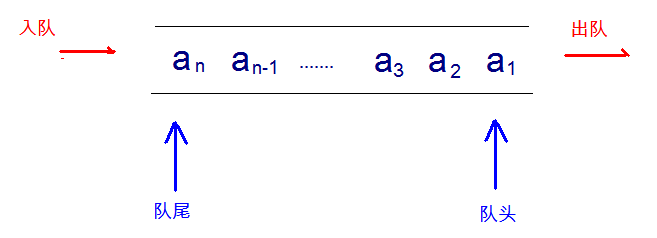

# 数据结构

## 栈

* **栈（stack）**：又称堆栈，它是**运算受限的线性表**，其限制是仅允许在栈的一端进行插入和删除操作，不允许在其他任何位置进行添加、查找、删除等操作。

    * **后进先出（LIFO）**。例如，弹夹，浏览器回退

    * **栈的入口、出口的都是栈的顶端位置**。

        

* **压栈**：就是**存**元素。

* **弹栈**：就是**取**元素。

## 队列

- **队列（queue）**：简称队，它同堆栈一样，也是一种**运算受限的线性表**，其限制是仅允许在表的一端进行插入，而在表的另一端进行删除。
    - **先进先出**。例如，小火车过山洞，车头先进去，车尾后进去；车头先出来，车尾后出来。
    - **队列的入口、出口各占一侧**。例如，下图中的左侧为入口，右侧为出口。

## 数组

- **数组（Array）**：是有序的元素序列，数组是在内存中开辟一段连续的空间，并在此空间存放元素。
    - **查询快**：**通过索引**，可以快速访问指定位置的元素。
    - **增删慢**：需要把增删元素后面的元素**移位**。Java中利用的是`System.copyArray(...)`

## 链表

* **链表（linked list）**：由一系列**结点（node）**组成，包括：存储数据元素的**数据域（date）**，存储**后继结点地址（next）**的指针域。Java中所有链表都是双向链表，即每个结点还存放着**前驱结点的地址（previous）**。
    * **查找慢**：想查找某个元素，需要通过连接的节点，依次向后查找指定元素。
    * **增删快**：只需要修改连接下个元素和连接上个元素的地址即可。

## 散列集

## 红黑树

* **二叉树（binary tree）**：是每个结点不超过2个分支且每个结点只能有一个父节点的**有序树** 。
* **二叉排序树**或者是一棵空树，或者是具有下列性质的二叉树：
    * 若左子树不空，则左子树上所有结点的值均小于它的根结点的值；
    * 若右子树不空，则右子树上所有结点的值均大于它的根结点的值；
    * 左、右子树也分别为二叉排序树；
    * 没有键值相等的节点。
* **红黑树**：是一种**自平衡二叉查找树**。红黑树是每个节点都带有颜色属性的二叉查找树，颜色或红色或黑色
    * 约束如下：
        * 根节点是黑色。
        * 节点是红色或黑色。
        * 每个叶节点（NIL节点，空节点）是黑色的。
        * 每个红色节点的两个子节点都是黑色。(从每个叶子到根的所有路径上不能有两个连续的红色节点)
        * 从任一节点到其每个叶子的所有路径都包含相同数目的黑色节点。
    * 特点：**查询速度特别快**，趋近平衡树，查找叶子元素最少和最多次数不多于二倍

## 