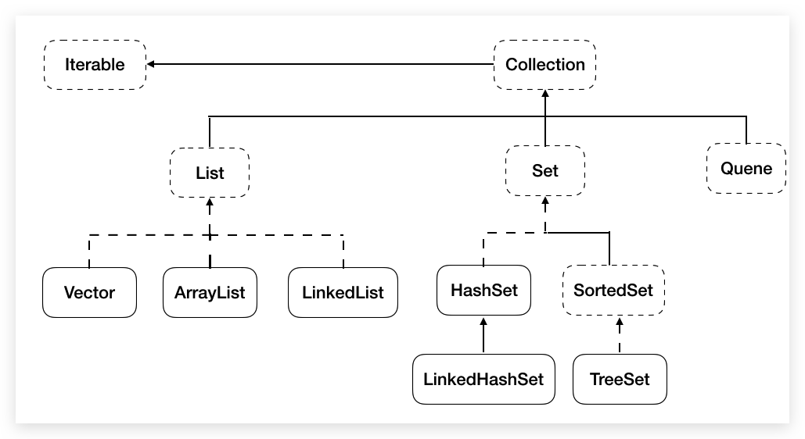

# 6 Container

[[toc]]

>   课件中还有深入分析，推荐！（集合与数组这两章节）

- **对象数组：**数组可以存储基本数据类型和引用类型，存储引用类型的数组就叫**对象数组**

- **容器（container）**
- **由来**  Java-->面向对象-->操作很多对象-->存储-->容器
    - **容器与数组的区别**
        1. **长度**     数组固定，容器（集合）可变
        2. **存储类型**     数组可以是基本类型和引用类型，容器（集合）只能是引用类型
        3. **元素类型**     数组只能存储同一类型，容器（集合）可以存储不同类型（一般也存储同一种类型）
        4. 方法		     数组方法有限，增删改非常不便，效率也不高；集合就不同了，可选择性多
        5. 数据结构      数组元素有序可重复；集合可选择多


## 6.1 数据结构

### 6.1.1 栈

* **栈（stack）**：又称堆栈，它是**运算受限的线性表**，其限制是仅允许在栈的一端进行插入和删除操作，不允许在其他任何位置进行添加、查找、删除等操作。

    * **后进先出（LIFO）**。例如，弹夹，浏览器回退

    * **栈的入口、出口的都是栈的顶端位置**。

        

* **压栈**：就是**存**元素。

* **弹栈**：就是**取**元素。

### 6.1.2 队列

- **队列（queue）**：简称队，它同堆栈一样，也是一种**运算受限的线性表**，其限制是仅允许在表的一端进行插入，而在表的另一端进行删除。
    - **先进先出**。例如，小火车过山洞，车头先进去，车尾后进去；车头先出来，车尾后出来。
    - **队列的入口、出口各占一侧**。例如，下图中的左侧为入口，右侧为出口。


### 6.1.3 数组

- **数组（Array）**：是有序的元素序列，数组是在内存中开辟一段连续的空间，并在此空间存放元素。
    - ==**查询快**==：**通过索引**，可以快速访问指定位置的元素。
    - ==**增删慢**：需要把增删元素后面的元素**移位**。**Java中利用的是**==**`System.copyArray(...)`**

### 6.1.4 链表

* **链表（linked list）**：由一系列**结点（node）**组成，包括：存储数据元素的**数据域（date）**，存储**后继结点地址（next）**的指针域。Java中所有链表都是双向链表，即每个结点还存放着**前驱结点的地址（previous）**。
    * ==**查找慢**==：想查找某个元素，需要通过连接的节点，依次向后查找指定元素。
    * ==**增删快**==：只需要修改连接下个元素和连接上个元素的地址即可。

### 6.1.5 散列集

### 6.1.6 红黑树

* **二叉树（binary tree）**：是每个结点不超过2个分支且每个结点只能有一个父节点的**有序树** 。
* **二叉排序树**或者是一棵空树，或者是具有下列性质的二叉树：
    * 若左子树不空，则左子树上所有结点的值均小于它的根结点的值；
    * 若右子树不空，则右子树上所有结点的值均大于它的根结点的值；
    * 左、右子树也分别为二叉排序树；
    * 没有键值相等的节点。
* **红黑树**：是一种**自平衡二叉查找树**。红黑树是每个节点都带有颜色属性的二叉查找树，颜色或红色或黑色
    * 约束如下：
        * 根节点是黑色。
        * 节点是红色或黑色。
        * 每个叶节点（NIL节点，空节点）是黑色的。
        * 每个红色节点的两个子节点都是黑色。(从每个叶子到根的所有路径上不能有两个连续的红色节点)
        * 从任一节点到其每个叶子的所有路径都包含相同数目的黑色节点。
    * 特点：**查询速度特别快**，趋近平衡树，查找叶子元素最少和最多次数不多于二倍


## 6.2 Collection（java.util）



- `Collection`是所有**单列集合**的**父接口**，因此在Collection中定义了单列集合(List和Set)通用的一些方法，这些方法可用于操作所有的单列集合。由于**其`Override`了`toString()`方法**，所以可以直接打印其内容。
- 注意：添加**自定义元素**到`Collection`集合中时，需要**重写**该元素所属类的`equals()`
- **常用方法（底层会调用`equals`方法，建议重写）**
    - **添加**
        - `boolean add(E e)`：添加该对象到下一个索引，当成一个元素
        - `boolean addAll(Collection c)`：复制容器中其每一个元素
    - **删除**
        - `void clear()`：删除集合中所有元素，但集合还存在
        - `boolean remove(Object o)`：区别 List 中的
        - `boolean removeAll(Collection c)`：差集关系
        - `default boolean removeIf(Predicate<? super E> filter)`：根据条件删除
    - **判断**
        - `boolean isEmpty()`
        - `boolean contains(Object o)` ：
        - `boolean containsAll(Collection<?> c)`  ：子集关系
        - `boolean equals(Object o)`：（根据实际对象可能根据元素顺序依次）对比每个元素
        - `int hashCode()`
    - **交集**
        - `boolean retainAll(Collection<?> c)`：交集
    - **获取容量**
        - `int size()`
    - **返回迭代器，`Collection`特有**
        - `Iterator iterator()`
    - **集合**转**数组**
        - `Object[] toArray()`
    - **Stream 流**

## 6.3 Iterator（java.util）

### 6.3.1 Iterator

* `Iterator`对象称为迭代器（设计模式的一种），主要用于遍历 `Collection` 集合中的元素。
* GOF给迭代器模式的定义为：提供一种方法访问一个容器（container）对象中各个元素，而又不需暴露该对象的内部细节。迭代器模式，就是为容器而生。类似于“公交车上的售票员”、“火车上的乘务员”、“空姐”。——检票
* `Collection`接口继承了`java.lang.Iterable`接口，该接口有一个`iterator()`方法，那么所有实现了`Collection`接口的集合类都有一个`iterator()`方法，用以返回一个实现了`Iterator`接口的对象。`Iterator` **仅用于遍历集合**，`Iterator` 本身并不提供承装对象的能力。如果需要创建`Iterator` 对象，则必须有一个被迭代的集合。集合对象**每次**调用`iterator()`方法都得到一个**全新的迭代器对象**，**默认游标都在集合的第一个元素之前**。


常用方法：

* `Iterator<E> iterator()`: **获取`Collection`对应的迭代器**，用来遍历集合中的元素的。这个接口的泛型跟着所属集合走，集合是什么泛型，迭代器就是什么泛型。**每次调用都会得到一个全新的迭代器对象**。

* `boolean hasNext()`：如果**容器中还有元素可以迭代**，则**返回 true**。

* `E next()`：指针下移，并返回迭代的**元素**。

* `default void remove()`：删除集合的元素。但是是遍历过程中通过迭代器对象的`remove`方法，**不是集合对象的`remove`方法**。如果还未调用`next()`或在上一次调用 `next()` 方法之后已经调用了 `remove` 方法，再调用`remove`都会报`IllegalStateException`。

* ```java
    Iterator<String> iterator = c.iterator();
    while (iterator.hasNext()) {
        // iterator.remove();// 错误
        String next = iterator.next();
        if ("123".equals(next)) {
            iterator.remove();
        }
        // iterator.remove();// 错误
    }
    ```

- 迭代器执行原理如下：

     

    在调用`it.next()`方法之前必须要调用`it.hasNext()`进行检测。若不调用，且下一条记录无效，会抛出`NoSuchElementException`异常。

    `Iterator`迭代器对象在遍历集合时，内部采用指针的方式来跟踪集合中的元素。在调用`Iterator`的`next()`方法之前，迭代器的索引位于**第一个元素之前**，不指向任何元素，当第一次调用迭代器的`next()`方法后，迭代器的**索引会向后移动一位，指向第一个元素并将该元素返回**，当再次~。依此类推，直到`hasNext()`方法返回false，表示到达了集合的末尾，终止对元素的遍历。


### 6.3.2 foreach循环

* 增强for循环（也称foreach循环）是**JDK1.5**以后出来的一个高级for循环，专门用来**遍历`Array`和`Collection`**。它的内部**原理其实是个`Iterator`迭代器**，所以在遍历的过程中，**尽量不要对`Collection`中的元素进行增删操作**。

* `Collection<E> extends Iterable<E>`，（**所有Collection**）实现此接口允许对象成为“**foreach**”语句目标。

    ```java
    ArrayList<String> arraylist = new ArrayList<>();
    for(String s:arraylist){
        System.out.println(s);
    }
    ```


### 6.3.3 并发修改异常

- `ConcurrentModificationException`现象：**迭代器遍历集合，集合修改集合元素**

- 原因：迭代器依赖于集合，而集合的改变导致迭代器预期的迭代次数发生改变

- 解决：

    - **迭代器遍历，并利用`Iterator`的`remove`方法**
    - **集合遍历，集合修改**（利用`get()`和`size()`），增加元素在集合末尾

    - 删除元素时并跟上break语句


## 6.4 List

* 元素**有序**（存储时按照底层数组索引添加，读取时和存储顺序一致）、**可重复**、稳定（相对 hash 重排）。可通过**索引**来访问指定元素。其实现类都重写了`toString()`方法。存储自定义对象时，需**重写**其`equals()`

- **特有方法**
    - **添加**
        - `void add([int index,]E e)`：当成单独元素
        - `void addAll([int index,] Collection c)`：当成整体，每个都是独立的
    - **删除**
        - `Object remove(int index)`：返回被删除元素
        - `boolean remove(Object o)`：删除对象
    - **修改替换**
        -   `Object set(int index,E e)`：返回被替换掉的元素
    - **获取**
        - `Object get(index)`
        - `int indexOf(Object o)`
        - `int lastIndexOf(Object o)`
        - `List subList(int fromIndex,int toIndex)`：返回新的 List，旧 List 不改变
    - 长度：同 Collection
        - `int size()`
    - 遍历：由于有索引，所以**List集合特有遍历功能**`get()`和`size()`结合的**普通for循环**。还有**迭代器**、**foreach**。


### 6.4.1 ArrayList

- **底层是数组，查询快，增删慢**。**不同步，线程不安全，效率高**

- 常用方法：没有特殊方法

- 源码分析（JDK7）

    - `ArrayList list = new ArrayList()`，底层创建了长度是**10**的`Object[]`数组`elementData`

    - `list.add(123)` 即`elementData[0] = new Integer(123)`

    - `list.add(11)`，如果此次的添加导致底层`elementData`数组容量不够，则扩容。

    - 默认情况下扩容为**原来的容量的1.5倍**（原有容量+容量右移一位），同时需要将原有数组中的数据**复制到新数组**中。

        若扩容一次后还不够，则使用传入的容量（后续总结）

- 源码分析（JDK8）

    - `ArrayList list = new ArrayList()`，底层`Object[] elementData`初始化为`{}`，并没有创建长度为10的数组
    - `list.add(123)`，第一次调用`add()`时，底层才创建了长度10的数组，并将数据123添加到`elementData[0]`
    - 后续的添加和扩容操作与jdk 7 无异（但是注释没改！）

- 小结：jdk7中的`ArrayList`的对象的创建类似于**单例的饿汉式**，而jdk8中的`ArrayList`的对象的创建类似于**单例的懒汉式**，**延迟了数组的创建，节省内存**。

- **建议开发中使用带参的构造器**：`ArrayList list = new ArrayList(int capacity)`


### 6.4.2 LinkedList

- **底层是双向链表，查询慢，增删快**。**线程不安全，效率高**。重写了`toString()`方法
- **特有方法（操作首尾元素）**
    - **添加**
        - `void addFirst(E e)`==`void linkFirst(E e)`==`void push(E e)`（底层 `addFirst(E e)`）
        - `void addLast(E e)`==`void linkLast(E e)`
        - `boolean offer(E e)`：Adds the specified element as the tail (last element) of this list.底层`add(E e)`
            - `boolean offerFirst(E e)`：Inserts the specified element at the front of this list.
            - `boolean offerLast(E e)`：Inserts the specified element at the end of this list.
    - **删除**
        - `Object removeFirst()`==`pop(E e)`（底层`removeFirst()`）：NoSuchElementException if this list is empty
        - `Object removeLast()`
    - **获取**
        - `E element()`：Retrieves, but does not remove, the head (first element) of this list.NoSuchElementException if this list is empty。底层`getFirst()`
        - `E peek()`：Retrieves, but does not remove, the head (first element) of this list.retrun null if this list is empty
            - `E peekFirst()`：etrieves, but does not remove, the first element of this list,or returns null if this list is empty.
            - `E peekLast()`：Retrieves, but does not remove, the last element of this list,or returns null if this list is empty.
        - `E poll()`：Retrieves and removes the head (first element) of this list.retrun null if this list is empty
            - `E pollFirst()`：Retrieves and removes the first element of this list, or returns null if this list is empty.
            - `E pollLast()`：Retrieves and removes the last element of this list, or returns null if this list is empty.
        - `E getFirst()`：NoSuchElementException if this list is empty
        - `E getLast()`

*   源码分析（JDK8，与7没区别）

    *   `LinkedList list = new LinkedList()`，内部声明了`Node`内部类的`first`和`last`属性，默认值为`null`

    *   `list.add(123)`，将123封装到Node中，创建了Node对象。

    *   其中，`Node`定义为：体现了`LinkedList`的双向链表的说法

        ```java
        private static class Node<E> {
            E item;
            Node<E> next;
            Node<E> prev;
        
            Node(Node<E> prev, E element, Node<E> next) {
                this.item = element;
                this.next = next;
                this.prev = prev;
            }
        }
        ```


### 6.4.3 Vector

*   源码分析：
    *   jdk7和jdk8中通过Vector()构造器创建对象时，底层直接创建了长度为10的数组。
    *   扩容时与 ArrayLIst 相比，默认变为原来的2


## 6.5 Set

* 元素**无序**（存储时不是按照类似数组索引顺序添加）、**唯一**。底层都是对应的`*Map`。由于没有索引，只可以通过`Iterator`或`foreach`。与`Collection`接口的方法一致，`Set` 的实现类都重写了`toString()`方法。

* 使用Set集合保存**自定义对象（可为 null）**。带有`Hash*`的**必须重写**`hashCode()`和`equal()`方法，且重写的俩方法尽可能保持**一致性**（即相等的对象必须有相同的 hashCode ，不相等亦如此）

  ​    

### 6.5.1 HashSet

- 底层数据结构是**哈希表（元素为链表或红黑树的数组）**，实际上是一个`HashMap`实例（value 存储静态的 Object），查询快。**根据`hashCode`决定元素的存放位置**，但**迭代出的元素顺序和存入顺序不一定一致**，即**不稳定**（hash重排）。

- 初始容量为16，当如果使用率超过0.75，(16*0.75=12) 就会扩大容量为原来的2倍（16扩容为32，依次为64,128....等）

- **添加元素过程**（以 HashSet 为例）

    * 向`HashSet`中添加元素`a`，首先调用元素`a`所在类的`hashCode()`方法，计算元素`a`的`hashCode`。

    * 此`hashCode`值接着通过某种散列函数（如：取模。这个散列函数会与底层数组的长度相计算得到在数组中的下标，并且这种散列函数计算还尽可能保证能均匀存储元素，越是散列分布， 该散列函数设计的越好 ）计算出在`HashSet`底层数组中的存放位置（即为：索引位置），判断数组此位置上是否已经有元素：

        * 如果此位置上没有其他元素，则元素`a`添加成功。 ——>情况1
        * 如果此位置上有其他元素`b`（或以链表或红黑树形式存在的多个元素），则比较元素`a`与元素`b`的`hashCode`值：
            * 如果`hashCode`值不相同，则元素`a`添加成功。——>情况2
            * 如果`hashCode`值相同，进而需要调用元素`a`所在类的`equals()`方法：
                * `equals()`返回`true`,元素`a`添加失败
                * `equals()`返回`false`,则元素`a`添加成功。——>情况3

    * 对于添加成功的情况2和情况3而言：元素`a`与已经存在指定索引位置上数据以**链表或红黑树**的方式存储。

        * JDK7：元素`a`放到数组中，指向原来的元素。

        * JDK8：原来的元素在数组中，指向元素`a`

            总结：七上八下

### 6.5.2 LinkedHashSet

- 继承`HashSet`，底层数据结构是**双向链表和哈希表（元素为链表或红黑树的数组），元素迭代顺序和存入顺序一致**
- `LinkedHashSet`**插入性能略低**于 `HashSet`，但在**迭代访问** `Set` 里的**全部元素**时**有很好的性能**。

### 6.5.3 TreeSet

- 底层数据结构是**红黑树（自平衡二叉树），有序，查询速度比`List`快 **，实际上是一个 `TreeMap`实例。使用`TreeSet`保存自定义元素，这个元素**必须实现`Comparable`接口**或构造时**必须提供`Comparator`实现类**

    - 元素唯一性通过红黑树存储时确定，相同元素丢弃， **根据`compareTo`返回值是否是0来决定**
    - 元素的顺序通过红黑树存储，并通过**中（根）序遍历展示**

- 新增的方法如下：

    - `Comparator comparator()`
    - `Object first()`
    - `Object last()`
    - `Object lower(Object e)`
    - `Object higher(Object e)`
    - `SortedSet subSet(fromElement, toElement)`
    - `SortedSet headSet(toElement)`
    - `SortedSet tailSet(fromElement)`

- **保证元素的排列方式：**

    1. **自然排序（元素具备比较性）**：让元素所属的类实现`Comparable`接口，重写`compareTo`

        向 TreeSet 中添加元素时，只有第一个元素无须比较`compareTo()`方法，后面添加的所有元素都会调用`compareTo()`方法进行比较。且重写该对象对应的 `equals()` 方法时，应保证该方法与 `compareTo(Object obj)` 方法有一致的结果

    2. **比较器排序（集合具备比较性）**：让集合构造方法接收`Comparator`接口的实现类对象，重写`compare`

        向 TreeSet 中添加元素时，只有第一个元素无须比较`compare()`方法，后面添加的所有元素都会调用`compare()`方法进行比较。且重写该对象对应的 `equals()` 方法时，应保证该方法与 `compare()` 方法有一致的结果

        **s1-s2升序，s2-s1降序**

        ```java
        // Lambda
        TreeSet<Person> people = new TreeSet(
            Comparator.comparingInt(Person::getAge).thenComparing(Person::getName).reversed()
        ); 
        ```


## 6.6 Map


- **键值对**。类似函数：一个映射不能包含重复的键，每个键最多只能映射到一个值（**键唯一，值可重复**），其实现类都重写了`toString()`方法

- Map中的**结构**：

    - key：无序、不可重复，使用 Set 存储。需重写 `equals()` 、`HahsCode()`（根据是否是 Hash 存储）
    - value：无序、可重复，使用 Collection 存储。需重写 `equals()` 
    - Entry：一个 key-value 对构成了一个 Entry 对象，使用 Set 存储

- 带有`Hash*`存储自定义的对象时**必须重写**`hashCode()`和`equal()`方法，且重写的俩方法尽可能保持**一致性**（即相等的对象必须有相同的 hashCode ，不相等亦如此）

- **常用方法**

    - **添加、修改**

        - `V put(K key,V value)` 

            如果键是第一次存储，就直接存储元素，**返回以前的值**null

            如果键不是第一次存储，就替换掉以前的值，并**返回以前的值**

        - `void putAll(Map<? extends K, ? extends V> m)`：每个元素单独 put

    - **删除**

        - `void clear()`                    删除所有映射关系
        - `V remove(Object key`)     根据键删除键值对元素，key为空返回null，否则返回值

    - **获取**

        - `V get(Object key)`              根据键获取值
        - `Set<K> keySet()`                 返回所有键的集合
        - `Collection<V> values()`     返回所有值的集合
        - `Set<Map.Entry<K,V>> entrySet()`    返回映射关系的Set集合

    - **判断**

        - `boolean isEmpty()`            是否为空
        - `boolean containsKey(Object key)`   是否包**含指定键值**
        - `boolean containsValue(Object value)`  是否**包含指定值**

    - **容量**

        - `int size()`      返回映射中键值对的对数

- **遍历方法**

    - **JDK1.8及以后推荐使用`Stream`的`foreach()`方法，lambda表达式**

    - **键值对（`entrySet()`/`getKey()`/`getValue()`）**，获取存储键值对对象的Set结合。推荐此方法。

        Map集合一创建，就会在Map集合中创建一个Entry对象，用来记录键值对对象（`Map.Entry<K,V>`)

        ```java
        Set<Map.Entry<String, String>> set = hm.entrySet();
        for(Map.Entry<String, String> entry:set) {
        	System.out.println(entry);//1=hello
        	System.out.println(entry.getKey()+"---"+entry.getValue());//1---hello
        }
        ```

        - **键找值（`keySet()`/`get()`）**

            ```java
            Set<String> set = hm.keySet();
            for(String key:set) {
            	System.out.println(key+"---"+hm.get(key));
            }
            //或
            Iterator<String> it = set.iterator();
            while(it.hasNext()) {
            	String key  = it.next();
            	String value = hm.get(key);
            	System.out.println(key+"---"+value);
            }
            ```

        - **`values()`方法，存储Map中值的Collection集合**

            ```java
            Collection<String> values = hm.values();
            for(String value:values){
                System.out.println(value);
            }
            ```

            


### 6.6.1 HashMap

- 底层数据结构是**哈希表（元素为链表或红黑树的数组）**，查询快。**根据`hashCode`决定元素的存放位置**，但**迭代出的元素顺序和存入顺序不一定一致**，底层存储**不稳定**（hash重排）。

- HashMap源码中的重要常量

    - `DEFAULT_INITIAL_CAPACITY` : HashMap的默认容量，16
    - `MAXIMUM_CAPACITY` : HashMap的最大支持容量，2^30 
    - `DEFAULT_LOAD_FACTOR`:HashMap的默认加载因子，0.75
    - `TREEIFY_THRESHOLD`:Bucket中链表长度大于该默认值，转化为红黑树 
    - `UNTREEIFY_THRESHOLD`:Bucket中红黑树存储的Node小于该默认值，转化为链表 
    - `MIN_TREEIFY_CAPACITY`:桶中的Node被树化时最小的hash表容量，64。（当桶中Node的数量大到需要变红黑树时，若hash表容量小于`MIN_TREEIFY_CAPACITY`时，此时应执行 resize扩容操作这个`MIN_TREEIFY_CAPACITY`的值至少是`TREEIFY_THRESHOLD`的4倍） 
    - `table`:存储元素的数组，总是2的n次幂 
    - `entrySet`:存储具体元素的集 
    - `size`:HashMap中存储的键值对的数量 
    - `modCount`:HashMap扩容和结构改变的次数。 
    - `threshold`:扩容的临界值，容量*填充因子 
    - `loadFactor`:填充因子 

- **底层实现原理**（JDK7）：

    - `HashMap`的内部存储结构其实是**数组和链表**的结合。当实例化一个`HashMap`时， 系统会创建一个长度为`Capacity`的`Entry`数组，这个长度在哈希表中被称为容量 (Capacity)，在这个数组中可以存放元素的位置我们称之为“**桶**”（`bucket`），每个`bucket`都有自己的索引，系统可以根据索引快速的查找`bucket`中的元素。

        每个`bucket`中存储一个元素，即一个`Entry`对象，但每一个`Entry`对象可以带一个引用变量，用于指向下一个元素，因此，在一个桶中，就有可能生成一个`Entry`链。 而且新添加的元素作为链表的`head`。

        `HashMap map = new HashMap([int initialCapacity])`在实例化以后，底层创建了**长度是`initialCapacity`（默认16）**的一维数组`Entry[] table`

    - 可能已经执行过多次`put(.)`，`map.put(key1,value1)`。首先，调用`key1`所在类的`hashCode()`和其他算法计算其 `hash`，此`hash`经过某种算法计算以后（位运算方式取模），得到在`Entry[]`中的存放位置。

        - 如果此位置上的数据为空，此时的 key1-value1 即 Entry添加成功。 ——情况1
        - 如果此位置上的数据不为空（意味着此位置上存在一个或多个数据（以链表形式存在）），比较key1和已经存在的一个或多个数据的`hash`：
            - 如果key1的`hash`与已经存在的数据的`hash`都不相同，此时key1-value1添加成功。——情况2
            - 如果key1的`hash`和已经存在的某一个数据(key2-value2)的``hash``相同，继续比较：调用key1所在类的`equals(key2)`方法，比较：
                - 如果`equals()`返回`false`：此时key1-value1添加成功。——情况3
                - 如果`equals()`返回`true`：使用**value1替换value2**。

    - 关于情况2和情况3：此时key1-value1和原来的数据以链表的方式存储。

    - 当`HashMap`中的元素越来越多的时候，`hash`冲突的几率也就越来越高，因为数组的长度是固定的。所以为了提高查询的效率，就要对`HashMap`的数组进行扩容，而在`HashMap`数组扩容之后，最消耗性能的点就出现了：**原数组中的数据必须重新计算其在新数组中的位置**，并放进去，这就是`resize`。在超出临界值（**使用率大于等于0.75，且要存放的位置非空**）时进行扩容。默认的扩容方式：扩容为原来容量的**2倍**，并将原有的数据复制过来。所以如果我们已经预知`HashMap`中元素的个数， 那么预设元素的个数能够有效的提高`HashMap`的性能。

- JDK8 相较于 JDK7 在底层实现方面的不同：

    - `new HashMap([int initialCapacity])`底层没有创建一个长度为`initialCapacity`的数组（默认16），首次调用`put()`方法时，底层创建长度为`initialCapacity`的数组

    - JDK8 底层的数组是：`Node[]`，而非`Entry[]`

        每个`bucket`中存储一个元素，即一个`Node`对象，但每一个`Node`对象可以带 一个引用变量`next`，用于指向下一个元素，因此，在一个桶中，就有可能 生成一个`Node`链。也可能是一个一个`TreeNode`对象，每一个`TreeNode`对象可以有两个叶子结点`left`和`right`，因此，在一个桶中，就有可能生成一个`TreeNode`树。而新添加的元素作为链表的`last`，或树的叶子结点。

    - JDK7 底层结构只有：数组+链表。JDK8 中底层结构：数组+链表/红黑树。

        - 形成链表时，七上八下（JDK7：新的元素指向旧的元素。JDK8：旧的元素指向新的元素，新元素在链表尾部）
        - 当数组的某一个索引位置上（桶）的元素以链表形式存在的数据个数 >= 8 且当前数组的长度 >= 64时，此时此索引位置上的所数据改为使用红黑树存储；否则扩容，不进行转树操作。如果当映射关系被移除后， 下次`resize`方法时判断树的结点个数低于6个，也会把树再转为链表。

- `HashMap`中的内部类`Node`

    ```java
    static class Node<K,V> implements Map.Entry<K,V> { 
      final int hash;
      final K key;
      V value; 
      Node<K,V> next;
    }
    ```

    "重地"和""通话""元素不同，但哈希值相同，**哈希冲突**

    

- **哈希表元素唯一性**底层依赖两个方法：**`hashCode()`和`equals()`**，必须重写

    

### 6.6.2 LinkedHashMap

- 继承`HashMap`，底层是**双向链表和哈希表**，迭代出的元素顺序和存入顺序**一致**

    在添加元素时重写了方法，`LinkedHashMap`中的内部类`Entry`

    ```java
    static class Entry<K,V> extends HashMap.Node<K,V> { 
      Entry<K,V> before, after;
      Entry(int hash, K key, V value, Node<K,V> next) {
        super(hash, key, value, next); }
    }
    ```

- `LinkedHashMap`**插入性能略低**于 `HashMap`，但在**迭代访问** `Map` 里的**全部元素**时**有很好的性能**。

  ​    

  ​    

### 6.6.3 TreeMap

- 底层数据结构是**红黑树（自平衡二叉树），有序**。使用`TreeMap`保存自定义元素，这个元素的**key必须实现`Comparable`接口**或构造时**必须提供`Comparator`实现类**

    - 元素唯一性通过红黑树存储时确定，相同元素丢弃， **根据`compareTo`返回值是否是0来决定**
    - 元素的顺序通过红黑树存储，并通过**中（根）序遍历展示**

- **保证元素的排列方式（按照key排序）：**

    1. **自然排序（元素具备比较性）**：`Map` 中的 `key` 实现`Comparable`接口，重写`compareTo`。

        向 `TreeMap` 中添加元素时，只有第一个元素无须比较`compareTo()`方法，后面添加的所有元素都会调用`compareTo()`方法进行比较。且重写该对象对应的 `equals()` 方法时，应保证该方法与 `compareTo(Object obj)` 方法有一致的结果

    2. **比较器排序（集合具备比较性）**：集合构造方法接收`key`实现`Comparator`接口的对象，重写`compare`。

        向 `TreeMap` 中添加元素时，只有第一个元素无须比较`compare()`方法，后面添加的所有元素都会调用`compare()`方法进行比较。且重写该对象对应的 `equals()` 方法时，应保证该方法与 `compare()` 方法有一致的结果

    3. ```java
        TreeMap<Person,String> map = new TreeMap<>(
            Comparator.comparingInt(Person::getAge).thenComparing(Person::getName)
        );
        ```

        

### 6.6.4 Hashtable

*   线程安全，效率低，相比 HashMap 来说**不能存储 null 的 key 或 value**


### 6.6.5 Properties

- `java.util.Properties ` 继承自` Hashtable` ，来表示一个持久的**属性集**。每个键及其对应值都是**`String`**。可以**保存在流中或从流中加载**，常用于处理配置文件。

- **特有功能**

    - `Object setProperty(String key,String value)`   添加元素，调用的父类的put方法
    - `String getProperty(String key)`   获取元素
    - `Set<String> stringPropertyNames()`   获取所有键的集合

- **和IO流结合的方法**

    - 把**键值对形式的文本**文件内容**加载**到集合中

        - `void load(InputStream inStream)`：不能读取含有中文的键值对
        - `void load(Reader reader)`：能读取含有中文的键值对，**所以一般用字符流**

    - 把集合中的数据**存储**到文本文件中

        - `void store(OutputStream out,String comments)`：不能写中文

        - `void store(Writer writer,String comments)`：**可以写中文**

            comments说明保存文字的用途，不能使用中文会乱码，默认是Unicode编码。一般空串`""`

> 文本中的数据，必须是键值对形式，默认就是字符串，不用加双引。可使用=、空格等分隔。#为注释。

```java
public static void myLoad() throws IOException {
	BufferedInputStream bis = new BufferedInputStream(new FileInputStream("prop.txt"));
	Properties prop = new Properties();
	prop.load(bis);
	Set<String> set = prop.stringPropertyNames();
	for (String key : set) {
		if (key.equals("lisi")) {
			prop.setProperty(key, "100");//还需要保存到指定文件，略。方法同下方myStore()。
			break;
		}
	}
	bis.close();
}

public static void myStore() throws IOException {
	Properties prop = new Properties();
	prop.setProperty("zhangsan", "3");
	prop.setProperty("lisi", "4");
	prop.setProperty("wangwu", "5");
	BufferedOutputStream bos = new BufferedOutputStream(new FileOutputStream("prop.txt"));
	prop.store(bos, "mystore");
	bos.close();
}
```


## Container 之间转换

### List 与 Set 之间转换

*   都可以在构造时传递对方
*   都继承了 Collection 的 addAll（以整体添加，但每个都是独立的）、add（当成单独元素）

## Collections（java.util）

-   针对**Collection/Map**进行操作的**工具类**

-   **常见静态方法**

    -   `static <T> boolean addAll(Collection<T> c, T... elements)  `**添加一些元素**

    -   `static void reverse(List<?> list)` ：**反转**

    -   `static void swap(List，int， int) `：将指定 list 集合中的 i 处元素和 j 处元素进行**交换**

    -   `static void shuffle(List<?> list)`  **打乱集合顺序，洗牌**

    -   `static <T> void sort(List<T> list)` **元素默认自然排序**，T 需实现 Comparable 接口

    -   `static <T> void sort(List<T> list，Comparator<? super T>)`**元素按照指定规则排序**

        ```java
        //可以根据多条规则排序
        public int compare(Student o1, Student o2) {
        int result = o1.getAge() - o2.getAge();
            result = result == 0 ? o1.getName().charAt(0) - o2.getName().charAt(0) : result;
            return result;
        }
        ```

        ```java
        //lambda改写
        Collections.sort(list, (o1, o2) -> {
        int result = o1.getAge() - o2.getAge();
            result = result == 0 ? o1.getName().compareTo(o2.getName()) : result;
            return result;
        });
        ```

    -   `static <T> int binarySearch(List<?> list,T key)` 

    -   `static <T> T max/min (Collection<?> coll [,Comparator c])` 

    -   `static int frequency(Collection<?> c, Object o)`：返回指定集合中指定元素的出现次数

    -   `static <T> boolean replaceAll(List<T> list, T oldVal, T newVal)`

    -   `static <T> void copy(List<? super T> dest, List<? extends T> src)`

        ```java
        ArrayList<Integer> list = new ArrayList<>();
        list.add(111);
        list.add(333);
        list.add(444);
        
        ArrayList<Integer> dest = new ArrayList<>(list.size());
        Collections.copy(dest,list);// IndexOutOfBoundsException: Source does not fit in dest
        
        // 改如下
        List<Object> dest = Arrays.asList(new Object[list.size()]);
        Collections.copy(dest,list);
        ```

    *   `unmodifiableCollection/List/[Navigable]Set/[Navigable]Map/SortedSet/SortedMap` 

        **返回不可修改的 Container 对象**，若修改则抛`UnsupportedOperationException`

-   同步控制方法，将指定集 合包装成线程同步的集合，从而可以解决多线程并发访问集合时的线程安全问题

    `Collection.synchronizedCollection/List/Set/Map/SortedSet/SortedMap`

    ```java
    List<String> list = Collections.synchronizedList(new ArrayList<>());
    ```


## JDK9对集合添加的优化

* Java 9，添加了几种集合工厂方法，更方便创建少量元素的Collection、Map实例。新的**List**、**Set**、**Map**的静态工厂方法可以更方便地创建集合的**不可变实例（存储个数确定时使用）**。

    ```java
    Set<String> str1=Set.of("a","b","c");  
    //str1.add("c");  这里编译的时候不会错，但是执行的时候会报错，因为是不可变的集合  
    System.out.println(str1);  
    Map<String,Integer> str2=Map.of("a",1,"b",2);  
    System.out.println(str2);  
    List<String> str3=List.of("a","b");  
    System.out.println(str3);  
    ```

    > 注意：
    >
    > 1、of()方法只是Map，List，Set这三个接口的静态方法，其父类接口和子类实现并没有这类方法，比如    HashSet，ArrayList等等；
    >
    > 2、返回的集合是不可变的；List不能使用Collections遍历
    >
    > 3、Set和Map接口在调用of方法时，不能有重复的元素，否则会抛出异常


## 习题

### 统计字符串中字符个数

```java
private static void getStringNum(String s) {
    TreeMap<Character, Integer> map = new TreeMap<>();
    char[] chars = s.toCharArray();
    for (char c : chars) {
        if (!map.containsKey(c)) {
            map.put(c, 1);
        } else {
            Integer integer = map.get(c);
            map.put(c, ++integer);
        }
    }
    System.out.println(map);
}
```


### 斗地主洗牌发牌看牌

* HashMap按牌从大到小存储索引和牌面，并将索引存储到ArrayList中
* 洗牌洗的是ArrayList。发牌时将ArrayList的索引发给TreeSet，以便排序
* 遍历TreeSet并在HashMap中取牌

```java
public static void getPuke() {
    Map<Integer, String> map = new HashMap<>();
    List<Integer> list = new ArrayList<>();
    map.put(0, "大王");
    map.put(1, "小王");
    list.add(0);
    list.add(1);
    List<String> shuZi = List.of("2", "A", "K", "Q", "J", "10", "9", "8", "7", "6", "5", "4", "3");
    List<String> huaSe = List.of("♠", "♥", "♣", "♦");
    int index = 2;
    for (String s : shuZi) {
        for (String h : huaSe) {
            map.put(index, h + s);
            list.add(index);
            index++;
        }
    }
    Collections.shuffle(list);

    TreeSet<Integer> player1 = new TreeSet<>();
    TreeSet<Integer> player2 = new TreeSet<>();
    TreeSet<Integer> player3 = new TreeSet<>();
    TreeSet<Integer> diPai = new TreeSet<>();

    for (int i = 0; i < list.size(); i++) {
        if (i >= 51) {
            diPai.add(list.get(i));
        } else if (i % 3 == 0) {
            player1.add(list.get(i));
        } else if (i % 3 == 1) {
            player2.add(list.get(i));
        } else if (i % 3 == 2) {
            player3.add(list.get(i));
        }
    }

    lookPuke("player1", player1, map);
    lookPuke("player2", player2, map);
    lookPuke("player3", player3, map);
    lookPuke("dipai", diPai, map);
}

private static void lookPuke(String name, TreeSet<Integer> player, Map<Integer, String> map) {
    System.out.print(name + "的牌：");
    //遍历TreeSet的Lambda表达式
    player.forEach(i -> {
        System.out.print(map.get(i) + " ");
    });
    System.out.println();
}
```


### Foreach问题

```java
String[] arr = new String[] { "MM", "MM", "MM" };

// 方式一：普通for赋值
//for (int i = 0; i < arr.length; i++) {
//    arr[i] = "GG";
//}

// 方式二：增强for循环
for (String s : arr) {
    s = "GG";
}

for (int i = 0; i < arr.length; i++) {
    System.out.println(arr[i]);// 不变，还是 MM，因为局部变量

```


### List 面试题

```java
@Test
public void testListRemove() {
    List list = new ArrayList();
    list.add(1);
    list.add(2);
    list.add(3);
    updateList(list);
    System.out.println(list);//1，2
}

private static void updateList(List list) {
    list.remove(2);// 到底删除的是元素2还是 index 呢？是index！
    //list.remove(new Integer(2));// 此时就删除对象2
}
```


### 在 List 中去除重复值

使用 Set，略


### ArrayList、LinkedList、Vector 异同

-   相同：都实现了List接口；存储稳定、可重复的数据。
-   不同：
    -   `ArrayList`：底层是`Object[] elementData`，**支持快速随机访问，增删慢**（或涉及元素移动`Arrays.copyOf` `System.arraycopy`），**线程不安全，效率高**
    -   `LinkedList`：底层是**双向链表**，**查找慢，增删快**，**线程不安全**；长度没有限制，占用空间比`ArrayList`大（需要维护指针）
    -   `Vector`：底层是`Object[] elementData`，**线程安全，效率低**，即使为了线程安全也别用它


### 以自定义的Customer类为例，何时需要重写equals()?

*   当一个类有自己特有的“逻辑相等”概念,当改写`equals()`的时候，总是要改写`hashCode()`，根据一个类的`equals`方法(改写后)，两个截然不同的实例有可能在逻辑上是相等的，但是，根据`Object.hashCode()`方法，它们仅仅是两个对象。
*   因此，违反了“相等的对象必须具有相等的散列码”。
*   结论:复写`equals`方法的时候一般都需要同时复写`hashCode`方法。通常参与计算`hashCode`的对象的属性也应该参与到`equals()`中进行计算。


### 为什么用Eclipse/IDEA复写hashCode方法，有31这个数字?

*   选择系数的时候要选择尽量大的系数。因为如果计算出来的hash地址越大，所谓的 “冲突”就越少，查找起来效率也会提高。(减少冲突)
*   并且31只占用5bits,相乘造成数据溢出的概率较小。
*   31可以 由i*31== (i<<5)-1来表示,现在很多虚拟机里面都有做相关优化。(提高算法效率)
*   31是一个素数，素数作用就是如果我用一个数字来乘以这个素数，那么最终出来的结果只能被素数本身和被乘数还有1来整除!(减少冲突)


### Set 重要习题

`Person`已重写 `hashCode()` 和`equals()`。注意每次都先算当前 `hashCode`与`equals()`

```java
HashSet set = new HashSet();
Person p1 = new Person(1001,"AA");
Person p2 = new Person(1002,"BB");

set.add(p1);
set.add(p2);
System.out.println(set);// 2个对象

p1.name = "CC";
set.remove(p1);// 移除时由于p1的 hashCode 是根据 CC 重新计算的，与原先的 AA 的 hashCode 不同，所以删除失败
System.out.println(set);// 2个对象

set.add(new Person(1001,"CC"));// 此时添加的元素的 hashCode 与 AA 改 CC 的并不相同！
System.out.println(set);// 3个对象

set.add(new Person(1001,"AA")); // 当前位置元素为 CC，所以即使 hashCode 相同，equals 不同，可以添加
System.out.println(set);// 4个对象
```


### HashMap和Hashtable区别

- HashMap：线程不安全，效率高，允许null键和null值
- Hashtable：线程安全，效率低，不允许null键和null值


### HashMap 的底层实现原理

谈谈你对HashMap中put/get方法的认识?

谈谈 HashMap的扩容机制?默认大小是多少?

什么是负载因子( 或填充比)?

什么是吞吐临界值(或阈值、threshold)?


### 负载因子值的大小，对HashMap有什么影响 

*   负载因子的大小决定了HashMap的数据密度。
*   负载因子越大密度越大，发生碰撞的几率越高，数组中的链表越容易长，造成查询或插入时的比较次数增多，性能会下降。
*   负载因子越小，就越容易触发扩容，数据密度也越小，意味着发生碰撞的几率越小，数组中的链表也就越短，查询和插入时比较的次数也越小，性 能会更高。但是会浪费一定的内容空间。而且经常扩容也会影响性能，建议初始化预设大一点的空间。
*   按照其他语言的参考及研究经验，会考虑将负载因子设置为0.7~0.75，此 时平均检索长度接近于常数。


### 关于Map的key是否可以修改?

不要修改

 映射关系存储到HashMap中会存储key的hash值，这样就不用在每次查找时重新计算每一个Entry或Node(TreeNode)的hash值了，因此如果已经put到Map中的映射关 系，再修改key的属性，而这个属性又参与hashcode值的计算，那么会导致匹配不上。


### Hashtable 和 ConcurrentHashMap 的异同


### Collection和Collections的区别

-   Collection 是单列集合的顶层接口，有两个子接口List和Set
-   Collections 是针对集合包括Map进行操作的工具类，可以对集合进行排序和查找等


### 姓氏统计

一个文本文件中存储着北京所有高校在校生的姓名，格式如下，每行一个名字，姓与名以空格分隔：

```
张 三
李 四
王 小五
```

现在相统计所有姓氏在文件中出现的次数，如何解决？


### 对一个Java源文件中的关键字进行计数

提示:Java源文件中的每一个单词，需要确定该单词是否是一个关键字。为了高效处理这个问题，将所有的关键字保存在一个HashSet中。用contains() 来测试。

