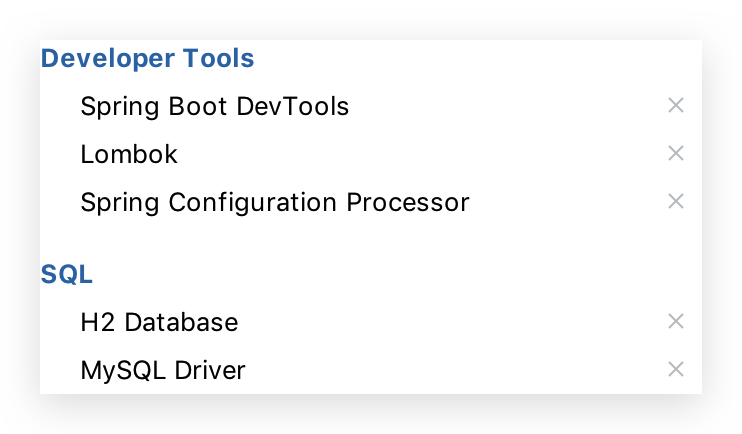

# 0 入门

## 简介

[MyBatis-Plus](https://github.com/baomidou/mybatis-plus)（简称 MP）是一个 [MyBatis](http://www.mybatis.org/mybatis-3/) 的增强工具，在 MyBatis 的基础上只做增强不做改变，为简化开发、提高效率而生。具体查看官网介绍。


## 特性

-   **无侵入**：只做增强不做改变，引入它不会对现有工程产生影响，如丝般顺滑
-   **损耗小**：启动即会自动注入基本 CURD，性能基本无损耗，直接面向对象操作
-   **强大的 CRUD 操作**：内置通用 Mapper、通用 Service，仅仅通过少量配置即可实现单表大部分 CRUD 操作，更有强大的条件构造器，满足各类使用需求
-   **支持 Lambda 形式调用**：通过 Lambda 表达式，方便的编写各类查询条件，无需再担心字段写错
-   **支持主键自动生成**：支持多达 4 种主键策略（内含分布式唯一 ID 生成器 - Sequence），可自由配置，完美解决主键问题
-   **支持 ActiveRecord 模式**：支持 ActiveRecord 形式调用，实体类只需继承 Model 类即可进行强大的 CRUD 操作
-   **支持自定义全局通用操作**：支持全局通用方法注入（ Write once, use anywhere ）
-   **内置代码生成器**：采用代码或者 Maven 插件可快速生成 Mapper 、 Model 、 Service 、 Controller 层代码，支持模板引擎，更有超多自定义配置等您来使用
-   **内置分页插件**：基于 MyBatis 物理分页，开发者无需关心具体操作，配置好插件之后，写分页等同于普通 List 查询
-   **分页插件支持多种数据库**：支持 MySQL、MariaDB、Oracle、DB2、H2、HSQL、SQLite、Postgre、SQLServer 等多种数据库
-   **内置性能分析插件**：可输出 Sql 语句以及其执行时间，建议开发测试时启用该功能，能快速揪出慢查询
-   **内置全局拦截插件**：提供全表 delete 、 update 操作智能分析阻断，也可自定义拦截规则，预防误操作


## 支持数据库

-   mysql 、 mariadb 、 oracle 、 db2 、 h2 、 hsql 、 sqlite 、 postgresql 、 sqlserver
-   达梦数据库 、 虚谷数据库 、 人大金仓数据库


## 框架结构


## Hello World

>   参照[官方文档](https://mybatis.plus/guide/quick-start.html)。

### Spring Initializer

[Spring Initializer](https://start.spring.io/) 选择如下依赖。数据库任选。



添加`mybatis-plus-boot-starter`

```xml
<dependency>
  <groupId>com.baomidou</groupId>
  <artifactId>mybatis-plus-boot-starter</artifactId>
  <version>3.3.0</version>
</dependency>
```


### application.yml

在 `application.yml` 配置文件中添加数据库的相关配置：

```yaml
# DataSource Config
spring:
  datasource:
  	# type: com.zaxxer.hikari.HikariDataSource # 可省略，Spring Boot 会自动检测
    # driver-class-name: com.mysql.cj.jdbc.Driver # 可省略，Spring Boot 会自动检测
  	url: jdbc:mysql://172.16.154.11:3306/test?useUnicode=true&characterEncoding=utf-8&useSSL=false
    username: root
    password: 123456
    hikari:
      # driver-class-name: com.mysql.cj.jdbc.Driver # 可省略，Spring Boot 会自动检测。且上面选项也可以指定。
      # HikariCP 连接池配置
      
  	# H2
    # driver-class-name: org.h2.Driver # 可省略，Spring Boot 会自动检测
    # schema: classpath:db/schema-h2.sql
    # data: classpath:db/data-h2.sql
    # url: jdbc:h2:mem:test
    # username: root
    # password: test
    
# Log Config
logging:
  level:
    top.conanan.studymybatisplus: debug
```


### log

#### MySQL

`log4j.properties`

```properties
#log4j.properties
# Configure logging for testing: optionally with log file
log4j.rootLogger=WARN, stdout
# log4j.rootLogger=WARN, stdout, logfile

log4j.appender.stdout=org.apache.log4j.ConsoleAppender
log4j.appender.stdout.layout=org.apache.log4j.PatternLayout
log4j.appender.stdout.layout.ConversionPattern=%d %p [%c] - %m%n

log4j.appender.logfile=org.apache.log4j.FileAppender
log4j.appender.logfile.File=target/spring.log
log4j.appender.logfile.layout=org.apache.log4j.PatternLayout
log4j.appender.logfile.layout.ConversionPattern=%d %p [%c] - %m%n
```


#### H2

`spy.properties`

```properties
modulelist=com.baomidou.mybatisplus.extension.p6spy.MybatisPlusLogFactory,com.p6spy.engine.outage.P6OutageFactory
# 自定义日志打印
logMessageFormat=com.baomidou.mybatisplus.extension.p6spy.P6SpyLogger
#日志输出到控制台
appender=com.baomidou.mybatisplus.extension.p6spy.StdoutLogger
# 使用日志系统记录 sql
#appender=com.p6spy.engine.spy.appender.Slf4JLogger
# 设置 p6spy driver 代理
deregisterdrivers=true
# 取消JDBC URL前缀
useprefix=true
# 配置记录 Log 例外,可去掉的结果集有error,info,batch,debug,statement,commit,rollback,result,resultset.
excludecategories=info,debug,result,commit,resultset
# 日期格式
dateformat=yyyy-MM-dd HH:mm:ss
# 实际驱动可多个
#driverlist=org.h2.Driver
# 是否开启慢SQL记录
outagedetection=true
# 慢SQL记录标准 2 秒
outagedetectioninterval=2
```


### conf

>   详细配置查看配置章节

#### MapperScan

在 Spring Boot 启动类中添加 `Mybatis` 注解 `@MapperScan` ，扫描 Mapper 文件夹：

```java
@MapperScan("top.conanan.studymybatisplus.mapper")
```

或者在每个 Mapper.java 文件添加 `Mybatis` 注解`@Mapper`

```java
@Mapper
public interface UserMapper extends BaseMapper<User> {
}
```


#### mapper-locations

```yaml
mybatis-plus:
  # 默认扫描 classpath*:/mapper/**/*.mapper
  # mapper-locations:
```


### Schema & Data

```sql
DROP TABLE IF EXISTS user;

CREATE TABLE user
(
	id BIGINT(20) NOT NULL COMMENT '主键ID',
	name VARCHAR(30) NULL DEFAULT NULL COMMENT '姓名',
	age INT(11) NULL DEFAULT NULL COMMENT '年龄',
	email VARCHAR(50) NULL DEFAULT NULL COMMENT '邮箱',
	PRIMARY KEY (id)
);
```

```sql
DELETE FROM user;

INSERT INTO user (id, name, age, email) VALUES
(1, 'Jone', 18, 'test1@baomidou.com'),
(2, 'Jack', 20, 'test2@baomidou.com'),
(3, 'Tom', 28, 'test3@baomidou.com'),
(4, 'Sandy', 21, 'test4@baomidou.com'),
(5, 'Billie', 24, 'test5@baomidou.com');
```

| id   | name   | age  | email              |
| ---- | ------ | ---- | ------------------ |
| 1    | Jone   | 18   | test1@baomidou.com |
| 2    | Jack   | 20   | test2@baomidou.com |
| 3    | Tom    | 28   | test3@baomidou.com |
| 4    | Sandy  | 21   | test4@baomidou.com |
| 5    | Billie | 24   | test5@baomidou.com |


### domain

```java
@Data
public class User {
    private Long id;
    private String name;
    private Integer age;
    private String email;
}
```


### Mapper

```java
// @Mapper // 若每个 Mapper 类添加了 Mapper 注解，则不用配置 MapperScan 注解。二选一
public interface UserMapper extends BaseMapper<User> {
}
```


### Test

```java
@SpringBootTest
class StudyMybatisPlusApplicationTests {

  @Autowired
  private UserMapper userMapper;

	// org.junit.jupiter.api.Test
  @Test
  public void select(){
    List<User> users = userMapper.selectList(null);
    users.forEach(System.out::println);
  }
}
```


## 注解

>   更多详细描述可点击查看源码注释
>
>   **注意**
>
>   *   **类中属性可以比数据库中的字段（或者查寻的）少**，最终结果就是映射不到那个字段
>   *   **类中属性不能比数据库中的字段（或者查寻的）多**，除非使用TableField的 exist=false。若因驼峰转换问题失败，根本原因也是如此

### @TableName

-   描述：表名注解

|       属性       |  类型   | 必须指定 | 默认值 | 描述                                                         |
| :--------------: | :-----: | :------: | :----: | ------------------------------------------------------------ |
|      value       | String  |    否    |   ""   | 表名                                                         |
|      schema      | String  |    否    |   ""   | schema(@since 3.1.1)                                         |
| keepGlobalPrefix | boolean |    否    | false  | 是否保持使用全局的 tablePrefix 的值(如果设置了全局 tablePrefix 且自行设置了 value 的值)(@since 3.1.1) |
|    resultMap     | String  |    否    |   ""   | xml 中 resultMap 的 id                                       |
|  autoResultMap   | boolean |    否    | false  | 是否自动构建 resultMap 并使用(如果设置 resultMap 则不会进行 resultMap 的自动构建并注入)(@since 3.1.2) |

>   关于`autoResultMap`的说明:
>
>   从mp的原理上讲,因为底层是mybatis,所以一些mybatis的常识你要知道,mp只是帮你注入了常用crud 注入之前可以说是动态的(根据你entity的字段以及注解变化而变化),但是注入之后是静态的(等于你写在xml的东西) 而对于直接指定`typeHandler`,mybatis只支持你写在2个地方:
>
>   1.  定义在resultMap里,只作用于select查询的返回结果封装
>   2.  定义在`insert`和`update`sql的`#{property}`里的`property`后面(例:`#{property,typehandler=xxx.xxx.xxx}`),只作用于`设置值` 而除了这两种直接指定`typeHandler`,mybatis有一个全局的扫描你自己的`typeHandler`包的配置,这是根据你的`property`的类型去找`typeHandler`并使用 这个属性的作用就是:如果你的`property`类型... todo


### @TableId

描述：主键注解

| 属性  |  类型  | 必须指定 |   默认值    |    描述    |
| :---: | :----: | :------: | :---------: | :--------: |
| value | String |    否    |     ""      | 主键字段名 |
| type  |  Enum  |    否    | IdType.NONE |  主键类型  |

IdType

|            值            |                             描述                             |
| :----------------------: | :----------------------------------------------------------: |
|           AUTO           |  数据库自增，打印的 SQL 中不会先有 ID 值。其他的会有 ID 值   |
|           NONE           | 该类型为未设置主键类型(注解里等于跟随全局,全局里约等于 INPUT) |
|          INPUT           |    用户输入ID，该类型可以通过自己注册自动填充插件进行填充    |
|  ASSIGN_ID(since 3.3.0)  | 分配ID (主键类型为number或string) 。只有当插入对象ID 为空，才自动填充 |
| ASSIGN_UUID(since 3.3.0) | 分配UUID (主键类型为 string)。只有当插入对象ID 为空，才自动填充 |
|        ID_WORKER         | deprecated 3.3.0 please use ASSIGN_ID。分布式全局唯一ID 长整型类型 |
|      ID_WORKER_STR       | deprecated 3.3.0 please use ASSIGN_ID。分布式全局唯一ID 字符串类型 |
|           UUID           |   deprecated 3.3.0 please use ASSIGN_UUID。32位UUID字符串    |


### @TableField

描述：字段注解(非主键)。解决问题：

*   对象中属性名（非驼峰命名）和数据库中字段**名不一致**：value。不需要配置该值的情况：

    *   当 com.baomidou.mybatisplus.core.MybatisConfiguration.mapUnderscoreToCamelCase 为 true 时, (mp下默认是true,mybatis默认是false), 数据库字段值.replace("_","").toUpperCase() == 实体属性名.toUpperCase()

    *   当 com.baomidou.mybatisplus.core.MybatisConfiguration.mapUnderscoreToCamelCase 为 false 时, 数据库字段值.toUpperCase() == 实体属性名.toUpperCase()

        >   查看配置章节的MybatisConfiguration.mapUnderscoreToCamelCase配置

*   对象中属性名在数据库中**不存在对应的字段**：exist

*   不愿在 select 中查询出字段：select。也可以在 Lambda 中写，不推荐在此处使用，除非该字段比较**隐私需要全局配置**

|       属性       |  类型   | 必须指定 |        默认值         |                             描述                             |
| :--------------: | :-----: | :------: | :-------------------: | :----------------------------------------------------------: |
|      value       | String  |    否    |          ""           |                        数据库字段值。                        |
|        el        | String  |    否    |          ""           |  映射为原生 `#{...}` 逻辑,相当于写在 xml 里的 `#{...}` 部分  |
|      exist       | boolean |    否    |         true          |                      是否为数据库表字段                      |
|    condition     | String  |    否    |          ""           | 字段 `where` 实体查询比较条件,有值设置则按设置的值为准,没有则为默认全局的 `%s=#{%s}`,[参考](https://github.com/baomidou/mybatis-plus/blob/3.0/mybatis-plus-annotation/src/main/java/com/baomidou/mybatisplus/annotation/SqlCondition.java) |
|      update      | String  |    否    |          ""           | 字段 `update set` 部分注入, 例如：update="%s+1"：表示更新时会set version=version+1(该属性优先级高于 `el` 属性) |
|     strategy     |  Enum   |    否    | FieldStrategy.DEFAULT |              字段验证策略 3.1.2+使用下面3个替代              |
|  insertStrategy  |  Enum   |    N     |        DEFAULT        | 举例：NOT_NULL: `insert into table_a(column) values (#{columnProperty})` (since v_3.1.2) |
|  updateStrategy  |  Enum   |    N     |        DEFAULT        | 举例：IGNORED: `update table_a set column=#{columnProperty}` (since v_3.1.2) |
|  whereStrategy   |  Enum   |    N     |        DEFAULT        | 举例：NOT_EMPTY: `where column=#{columnProperty}` (since v_3.1.2) |
|       fill       |  Enum   |    否    |   FieldFill.DEFAULT   |                       字段自动填充策略                       |
|      select      | boolean |    否    |         true          |                     是否进行 select 查询                     |
| keepGlobalFormat | boolean |    否    |         false         |       是否保持使用全局的 format 进行处理(@since 3.1.1)       |

FieldStrategy

|    值     |                           描述                            |
| :-------: | :-------------------------------------------------------: |
|  IGNORED  |                         忽略判断                          |
| NOT_NULL  |                        非NULL判断                         |
| NOT_EMPTY | 非空判断(只对字符串类型字段,其他类型字段依然为非NULL判断) |
|  DEFAULT  |                       追随全局配置                        |

FieldFill

|      值       |         描述         |
| :-----------: | :------------------: |
|    DEFAULT    |      默认不处理      |
|    INSERT     |    插入时填充字段    |
|    UPDATE     |    更新时填充字段    |
| INSERT_UPDATE | 插入和更新时填充字段 |


### @Version

描述：乐观锁注解、标记 `@Verison` 在字段上


### @EnumValue

描述：通枚举类注解(注解在枚举字段上)


### @TableLogic

描述：表字段逻辑处理注解（逻辑删除）

|  属性  |  类型  | 必须指定 | 默认值 |     描述     |
| :----: | :----: | :------: | :----: | :----------: |
| value  | String |    否    |   ""   | 逻辑未删除值 |
| delval | String |    否    |   ""   |  逻辑删除值  |


### @SqlParser

描述：租户注解。目前只支持注解在 mapper 的方法上(3.1.1开始支持注解在mapper上)

|  属性  |  类型   | 必须指定 | 默认值 |                             描述                             |
| :----: | :-----: | :------: | :----: | :----------------------------------------------------------: |
| filter | boolean |    否    | false  | true: 表示过滤SQL解析，即不会进入ISqlParser解析链，否则会进解析链并追加例如tenant_id等条件 |


### @KeySequence

描述：序列主键策略 `oracle`

属性：value、resultMap

| 属性  |  类型  | 必须指定 |   默认值   |                             描述                             |
| :---: | :----: | :------: | :--------: | :----------------------------------------------------------: |
| value | String |    否    |     ""     |                            序列名                            |
| clazz | Class  |    否    | Long.class | id的类型, 可以指定String.class，这样返回的Sequence值是字符串"1" |