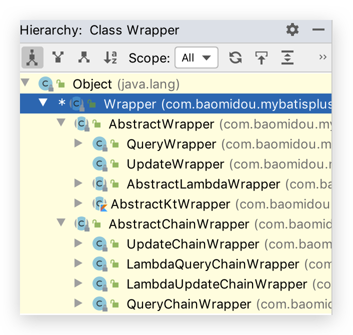

# 3 条件构造器  Wrapper

Wrapper 接口的实现类如下




## AbstractWrapper

>   说明:
>
>   QueryWrapper(LambdaQueryWrapper) 和 UpdateWrapper(LambdaUpdateWrapper) 的父类用于生成 sql 的 where 条件, entity 属性也用于生成 sql 的 where 条件
>
>   注意: entity 生成的 where 条件与 使用各个 api 生成的 where 条件**没有任何关联行为**

### allEq

```java
allEq(Map<R, V> params)
allEq(Map<R, V> params, boolean null2IsNull)
allEq(boolean condition, Map<R, V> params, boolean null2IsNull)
```

-   全部[eq](https://mybatis.plus/guide/wrapper.html#eq)(或个别[isNull](https://mybatis.plus/guide/wrapper.html#isnull))

>   个别参数说明:
>
>   `params` : `key`为数据库字段名,`value`为字段值
>   `null2IsNull` : 为`true`则在`map`的`value`为`null`时调用 [isNull](https://mybatis.plus/guide/wrapper.html#isnull) 方法,为`false`时则忽略`value`为`null`的

-   例1: `allEq({id:1,name:"老王",age:null})`--->`id = 1 and name = '老王' and age is null`
-   例2: `allEq({id:1,name:"老王",age:null}, false)`--->`id = 1 and name = '老王'`

```java
allEq(BiPredicate<R, V> filter, Map<R, V> params)
allEq(BiPredicate<R, V> filter, Map<R, V> params, boolean null2IsNull)
allEq(boolean condition, BiPredicate<R, V> filter, Map<R, V> params, boolean null2IsNull) 
```

>   个别参数说明:
>
>   `filter` : 过滤函数,是否允许字段传入比对条件中
>   `params` 与 `null2IsNull` : 同上

-   例1: `allEq((k,v) -> k.indexOf("a") >= 0, {id:1,name:"老王",age:null})`--->`name = '老王' and age is null`
-   例2: `allEq((k,v) -> k.indexOf("a") >= 0, {id:1,name:"老王",age:null}, false)`--->`name = '老王'`