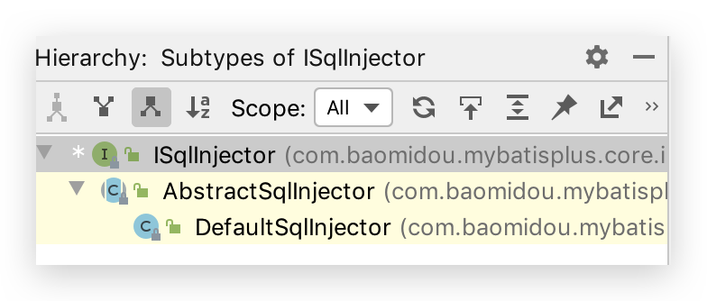
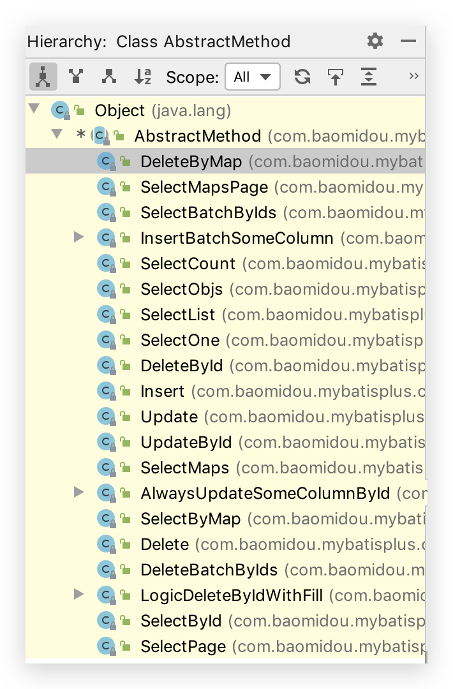

# 4 插件扩展

## SQL 注入器

全局配置 `sqlInjector` 用于注入实现 `ISqlInjector` 接口的子类，实现自定义方法注入。MP 在启动后会将 BaseMapper 中的一系列方法注册到 meppedStatements 中，其实就是通过该注入器来实现的。可以参考默认注入器 [DefaultSqlInjector](https://gitee.com/baomidou/mybatis-plus/blob/3.0/mybatis-plus-core/src/main/java/com/baomidou/mybatisplus/core/injector/DefaultSqlInjector.java)。

 `ISqlInjector `及其实类现如下

```java
public interface ISqlInjector {
    /**
     * 检查SQL是否注入(已经注入过不再注入)
     *
     * @param builderAssistant mapper 信息
     * @param mapperClass      mapper 接口的 class 对象
     */
    void inspectInject(MapperBuilderAssistant builderAssistant, Class<?> mapperClass);
}
```

按下 IDEA 中 Control + H（即 Navigate => Type Hierarchy），查看`ISqlInjector`类的阶层



在`AbstractSqlInjector`中，由`inspectInject()`检查注入方法来注入的：

```java
@Override
public void inspectInject(MapperBuilderAssistant builderAssistant, Class<?> mapperClass) {
  Class<?> modelClass = extractModelClass(mapperClass);
  if (modelClass != null) {
    String className = mapperClass.toString();
    Set<String> mapperRegistryCache = GlobalConfigUtils.getMapperRegistryCache(builderAssistant.getConfiguration());
    if (!mapperRegistryCache.contains(className)) {
      List<AbstractMethod> methodList = this.getMethodList(mapperClass);
      if (CollectionUtils.isNotEmpty(methodList)) {
        TableInfo tableInfo = TableInfoHelper.initTableInfo(builderAssistant, modelClass);
        // 循环注入自定义方法
        methodList.forEach(m -> m.inject(builderAssistant, mapperClass, modelClass, tableInfo));
      } else {
        logger.debug(mapperClass.toString() + ", No effective injection method was found.");
      }
      mapperRegistryCache.add(className);
    }
  }
}
```

其中如下方法进行循环遍历并注入。`methodList`由`getMethodList()`获取到，`AbstractSqlInjector`的一个子类`DefaultSqlInjector`实现了该方法，其是 SQL 默认注入器，负责注入 MP 自带的方法。

```java
// 循环注入自定义方法
methodList.forEach(m -> m.inject(builderAssistant, mapperClass, modelClass, tableInfo));
```

```java
public class DefaultSqlInjector extends AbstractSqlInjector {

  @Override
  public List<AbstractMethod> getMethodList(Class<?> mapperClass) {
    return Stream.of(
      new Insert(),
      new Delete(),
      new DeleteByMap(),
      new DeleteById(),
      new DeleteBatchByIds(),
      new Update(),
      new UpdateById(),
      new SelectById(),
      new SelectBatchByIds(),
      new SelectByMap(),
      new SelectOne(),
      new SelectCount(),
      new SelectMaps(),
      new SelectMapsPage(),
      new SelectObjs(),
      new SelectList(),
      new SelectPage()
    ).collect(toList());
  }
}
```

查看`inject()`方法，其调用了`injectMappedStatement()`抽象方法，那么所有实现了该方法的类都将进行 SQL注入

```java
/**
     * 注入自定义方法
     */
public void inject(MapperBuilderAssistant builderAssistant, Class<?> mapperClass, Class<?> modelClass, TableInfo tableInfo) {
  this.configuration = builderAssistant.getConfiguration();
  this.builderAssistant = builderAssistant;
  this.languageDriver = configuration.getDefaultScriptingLanguageInstance();
  /* 注入自定义方法 */
  injectMappedStatement(mapperClass, modelClass, tableInfo);
}
```

按下 IDEA 中 Control + H（即 Navigate => Type Hierarchy），查看实现了`injectMappedStatement()`的`AbstractMethod`抽象类的类：



挑选一个`SelectById`类来查看

```java
public class SelectById extends AbstractMethod {

  @Override
  public MappedStatement injectMappedStatement(Class<?> mapperClass, Class<?> modelClass, TableInfo tableInfo) {
    SqlMethod sqlMethod = SqlMethod.LOGIC_SELECT_BY_ID;
    SqlSource sqlSource = new RawSqlSource(
      configuration, String.format(sqlMethod.getSql(),
                                   sqlSelectColumns(tableInfo, false),
                                   tableInfo.getTableName(), tableInfo.getKeyColumn(), tableInfo.getKeyProperty(),
                                   tableInfo.getLogicDeleteSql(true, true)), Object.class);
    return this.addSelectMappedStatementForTable(mapperClass, getMethod(sqlMethod), sqlSource, tableInfo);
  }
}
```

生成的`SqlSource`对象中的 sql 属性即生成的 SQL 语句将通过`addSelectMappedStatementForTable()`注入到`MappedStatement`