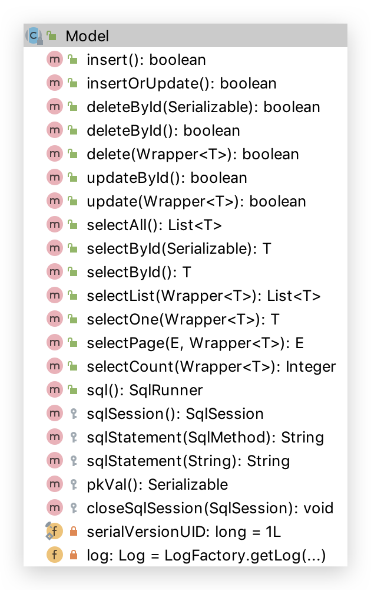

# 5 ActiveRecord

ActiveRecord 一直广受动态语言（ PHP 、 Ruby 等）的喜爱，而 Java 作为准静态语言，对于 ActiveRecord 往往只能感叹其优雅，所以我们也在 AR 道路上进行了一定的探索，喜欢大家能够喜欢，也同时欢迎大家反馈意见与建议。


## 如何配置❓

*   需要继承 Model 类且实现主键指定方法
*   Mapper.java 也必须有

```java
@Data
@Accessors(chain = true)// 如果为true，则设置器将返回此值而不是void。
public class User extends Model<User> {
  private Long id;
  private String name;
  private Integer age;
  private String email;

  @Override
  protected Serializable pkVal() {
    /**
     * AR 模式这个必须有，否则 xxById 的方法都将失效！
     * 另外 UserMapper 也必须 AR 依赖该层注入，有可无 XML
     */
    return id;
  }
}
```

```java
// 这个得有，就算不去用它否则默认不注入
public interface UserMapper extends BaseMapper<User> {

}
```


## CRUD



### insert

```java
/**
 * 插入（字段选择插入）
 */
@Test
public void insert(){
  User user = new User();
  user.setUserName("zhangsan");
  user.setAge(888);
  user.setEmail("888@qq.com");
  boolean b = user.insert();
  
  Long id = user.getId();
}
```


### insertOrUpdate

```java
/**
 * 插入 OR 更新，取决于是否有 ID
 */
@Test
public void insertOrUpdate(){
  User user = new User();
  user.setId(1205798000123752453L);
  user.setUserName("zhangsanfeng");
  user.setAge(88888);
  user.setEmail("88888@qq.com");
  boolean b = user.insertOrUpdate();

  Long id = user.getId();
}
```


### deleteById

```java
/**
 * 根据主键或 ID 删除
 */
@Test
public void deleteById(){
  // 方式1
  // 如下写法需要 @Accessors(chain = true)
  boolean b1 = new User().setId(1205785512854446082L).deleteById();
  
  // 方式2
  // 如下写法需要 @Accessors(chain = true)
  boolean b2 = new User().deleteById(1205798000123752453L);
}
```


### delete

```java
/**
 * 删除记录
 *
 * @param queryWrapper 实体对象封装操作类（可以为 null）
 */
@Test
public void delete(){
  boolean b = new User().delete(new LambdaQueryWrapper<User>()
                                .eq(User::getUserName, "zhangsan"));
}
```


### updateById

```java
/**
 * 更新（字段选择更新）
 */
@Test
public void updateById(){
  // 如下写法需要 @Accessors(chain = true)
  boolean b = new User().setAge(888).setId(4L).updateById();
}
```


### update

```java
/**
 * 执行 SQL 更新
 *
 * @param updateWrapper 实体对象封装操作类（可以为 null,里面的 entity 用于生成 where 语句）
 */
@Test
public void update(){
  boolean b = new User().update(new LambdaUpdateWrapper<User>()
                                .set(User::getAge, 9999)
                                .set(User::getEmail, "9999@qq.com")
                                .ge(User::getId, 3L));
}
```


### selectById

```java
/**
 * 根据 ID 查询
 *
 * @param id 主键ID
 */
@Test
public void selectById() {
  User user1 = new User().setId(4L).selectById();

  User user2 = new User().selectById(4L);
}
```


### selectOne

```java
/**
 * 查询一条记录
 *
 * @param queryWrapper 实体对象封装操作类（可以为 null）
 */
@Test
public void selectOne() {
  User user = new User().selectOne(new LambdaQueryWrapper<User>()
                                   .eq(User::getId, 4L));
}
```


### selectCount

```java
/**
 * 查询总数
 *
 * @param queryWrapper 实体对象封装操作类（可以为 null）
 */
@Test
public void selectCount() {
  Integer count = new User().selectCount(new LambdaQueryWrapper<User>()
                                         .eq(User::getId, 4L));
}
```

### selectList

```java
/**
 * 查询总记录数
 *
 * @param queryWrapper 实体对象封装操作类（可以为 null）
 */
@Test
public void selectList() {
  List<User> list = new User().selectList(new LambdaQueryWrapper<User>()
                                          .ge(User::getAge, 18L));
}
```


### selectAll

```java
/**
 * 查询所有
 */
@Test
public void selectAll(){
  List<User> list = new User().selectAll();
}
```


### selectPage

```java
/**
 * 翻页查询
 *
 * @param page         翻页查询条件
 * @param queryWrapper 实体对象封装操作类（可以为 null）
 */
@Test
public void selectPage() {
  Page<User> userPage = new User().selectPage(new Page<>(1,2), new LambdaQueryWrapper<User>()
                                              .eq(User::getId, 4L));
  System.out.println(userPage);
}
```