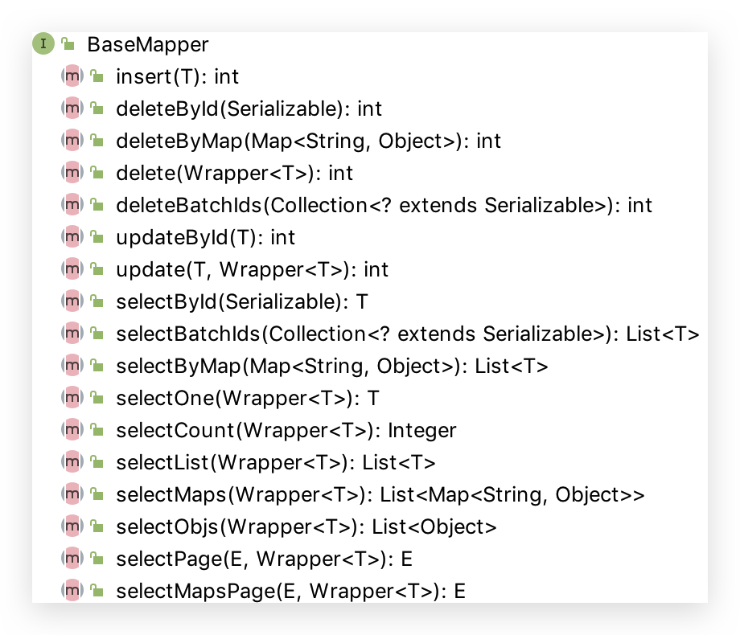

# 2 CRUD 接口

## Service CRUD 接口


## Mapper CRUD 接口



### JUnit 配置

目前 Spring Boot 2.2.0 默认使用 JUnit5：junit.jupiter.*

```java
@SpringBootTest
class StudyMybatisPlusApplicationTests {

  @SuppressWarnings("SpringJavaInjectionPointsAutowiringInspection")
  @Autowired
  private UserMapper userMapper;

  @BeforeEach
  public void select1(){
    System.out.println("----------BeforeEach----------");
    List<User> users = userMapper.selectList(null);
    users.forEach(System.out::println);
  }

  @AfterEach
  public void select2(){
    System.out.println("----------AfterEach----------");
    List<User> users = userMapper.selectList(null);
    users.forEach(System.out::println);
  }
}
```


### insert

```java
/**
 * 插入一条记录
 *
 * @param entity 实体对象
 *
 * int insert(T entity);
 */
@Test
public void insert(){
    User user = new User();
    user.setAge(100);
    user.setName("Conanan");
    user.setEmail("conanan@qq.com");
    // 返回影响数据库的行数
    int i = this.userMapper.insert(user);
    Assertions.assertEquals(1,i);

    // 返回自增列新记录id值
    Long id = user.getId();
}
```


### deleteById

```java
/**
 * 根据 ID 删除
 *
 * @param id 主键ID
 *
 * int deleteById(Serializable id);
 */
@Test
public void deleteById(){
  int i = this.userMapper.deleteById(1205798000123752452L);
}
```


### deleteBatchIds

```java
/**
 * 删除（根据ID 批量删除）
 *
 * @param idList 主键ID列表(不能为 null 以及 empty)
 *
 * int deleteBatchIds(@Param(Constants.COLLECTION) Collection<? extends Serializable> idList);
 */
@Test
public void deleteBatchIds(){
  // DELETE FROM user WHERE id IN ( ? , ? , ? ) 
  // List.of()是 Java9 的语法；可以使用 Java8 中 Arrays.asList()替代
  int i = this.userMapper.deleteBatchIds(List.of(1205786376784613378L, 1205798000123752450L, 1205798000123752451L));
}
```


### delete

```java
/**
 * 根据 entity 条件，删除记录
 *
 * @param wrapper 实体对象封装操作类（可以为 null）
 *
 * int delete(@Param(Constants.WRAPPER) Wrapper<T> wrapper);
 */
@Test
public void delete(){
  // 方式1
  int i = this.userMapper.delete(new LambdaQueryWrapper<User>()
                                 .eq(User::getName,"Billie")
                                 .eq(User::getAge,24));

  // 方式2。也可以在构造 Wrapper 对象时传入具体的对象
  User user = new User();
  user.setName("Conanan");
  user.setAge(111);
  int i2 = this.userMapper.delete(new QueryWrapper<>(user));
}
```


### deleteByMap(不推荐)

```java
/**
 * 根据 columnMap 条件，删除记录。多条件之间是 and 关系。不推荐，并且由于 Map 中写的是数据库字段名称，容易写错。
 *
 * @param columnMap 表字段 map 对象
 *
 * int deleteByMap(@Param(Constants.COLUMN_MAP) Map<String, Object> columnMap);
 */
@Test
public void deleteByMap(){
  Map<String, Object> map = new HashMap<>();
  map.put("name","Jone");
  map.put("age",18);
  int i = this.userMapper.deleteByMap(map);
}
```


### updateById

```java
/**
 * 根据 ID 修改。与 JPA 不同，只更新对象中值存在的值
 *
 * @param entity 实体对象
 *
 * int updateById(@Param(Constants.ENTITY) T entity);
 */
@Test
public void updateById(){
    User user = new User();
    user.setId(3L);
    user.setName("Tom Cat");
    // UPDATE user SET name=? WHERE id=?
    int i = this.userMapper.updateById(user);
}
```

### update

```java
/**
 * 根据 whereEntity 条件，更新记录
 *
 * @param entity        实体对象 (set 条件值,可以为 null)
 * @param updateWrapper 实体对象封装操作类（可以为 null,里面的 entity 用于生成 where 语句）
 *
 * int update(@Param(Constants.ENTITY) T entity, @Param(Constants.WRAPPER) Wrapper<T> updateWrapper);
 */
@Test
public void update(){
    // 方法1（推荐）
    int i1 = this.userMapper.update(null, new LambdaUpdateWrapper<User>()
            .set(User::getAge, 666)
            .set(User::getEmail, "conanan@qq.com")
            .eq(User::getName, "Jack"));

    // 方法2
    User user = new User();
    user.setAge(100);
    user.setEmail("conanan@baomidou.com");
    // LambdaQueryWrapper可以使用 Lambda 表达式，不用写数据库字段名（容易出错）
    int i2 = this.userMapper.update(user,new LambdaQueryWrapper<User>()
            .eq(User::getName, "Jack"));
}
```


### selectById

```java
/**
 * 根据 ID 查询，不存在则返回 null
 *
 * @param id 主键ID
 *
 * T selectById(Serializable id);
 */
@Test
public void selectById(){
    User user = this.userMapper.selectById(4L);
}
```


### selectBatchIds

```java
/**
 * 查询（根据ID 批量查询）
 *
 * @param idList 主键ID列表(不能为 null 以及 empty)
 *
 * List<T> selectBatchIds(@Param(Constants.COLLECTION) Collection<? extends Serializable> idList);
 */
@Test
public void selectBatchIds(){
  // SELECT id,name,age,email FROM user WHERE id IN ( ? , ? , ? , ? )
  // List.of()是 Java9 的语法；可以使用 Java8 中 Arrays.asList()替代
  List<User> list = this.userMapper.selectBatchIds(List.of(2L,3L,4L,5L));
}
```

### selectOne

```java
/**
 * 根据 entity 条件，查询一条记录。若没有符合条件的，则返回 null；若查询结果多于一个则抛异常
 *
 * @param queryWrapper 实体对象封装操作类（可以为 null，则查询全部，容易报错）
 *
 * T selectOne(@Param(Constants.WRAPPER) Wrapper<T> queryWrapper);
 */
@Test
public void selectOne(){
  User sandy = this.userMapper.selectOne(new LambdaQueryWrapper<User>()
                                         .eq(User::getName, "Sandy")
                                         .eq(User::getAge, 21));
}
```


### selectCount

```java
/**
 * 根据 Wrapper 条件，查询总记录数
 *
 * @param queryWrapper 实体对象封装操作类（可以为 null）
 *
 * Integer selectCount(@Param(Constants.WRAPPER) Wrapper<T> queryWrapper);
 */
@Test
public void selectCount(){
  // SELECT COUNT( 1 ) FROM user WHERE (name = ? AND age >= ?)
  Integer count = this.userMapper.selectCount(new LambdaQueryWrapper<User>()
                                              .eq(User::getName, "Conanan")
                                              .ge(User::getAge, 22));
}
```


### selectList

```java
/**
 * 根据 entity 条件，查询全部记录
 * 注意：like 不用%%来修饰，但是即使加上也不会报错（会有%%%%个╮(╯_╰)╭）；likeLeft和like Right 也可以使用
 *
 * @param queryWrapper 实体对象封装操作类（可以为 null）
 *
 * List<T> selectList(@Param(Constants.WRAPPER) Wrapper<T> queryWrapper);
 */
@Test
public void selectList(){
  // SELECT id,name,age,email FROM user WHERE (name LIKE ? AND age >= ?)
  List<User> list = this.userMapper.selectList(new LambdaQueryWrapper<User>()
                                               .like(User::getName, "Conanan")
                                               .ge(User::getAge, 22));
}
```


### selectByMap(不推荐)

```java
/**
 * 查询（根据 columnMap 条件）。多条件之间是 and 关系。不推荐，并且由于 Map 中写的是数据库字段名称，容易写错。
 *
 * @param columnMap 表字段 map 对象
 *
 * List<T> selectByMap(@Param(Constants.COLUMN_MAP) Map<String, Object> columnMap);
 */
@Test
public void selectByMap(){
  Map<String, Object> map = new HashMap<>();
  map.put("name","Sandy");
  map.put("age",21);
  // SELECT id,name,age,email FROM user WHERE name = ? AND age = ?
  List<User> list = this.userMapper.selectByMap(map);
}
```


### selectObjs

```java
/**
 * 根据 Wrapper 条件，查询全部记录
 * <p>注意： 只返回第一个字段的值（若指定 select 则为它）</p>
 *
 * @param queryWrapper 实体对象封装操作类（可以为 null）
 *
 * List<Object> selectObjs(@Param(Constants.WRAPPER) Wrapper<T> queryWrapper);
 */
@Test
public void selectObjs(){
  // SELECT user_name FROM user WHERE (age >= ?)
  List<Object> objects = this.userMapper.selectObjs(new LambdaQueryWrapper<User>()
                                                    .select(User::getUserName)
                                                    .ge(User::getAge, 10));
  System.out.println(objects);
}
```


### selectMaps

```java
/**
 * 根据 Wrapper 条件，查询全部记录。返回数据库中字段和值组成键值对的 List<Map<String,Object>>对象
 *
 * @param queryWrapper 实体对象封装操作类（可以为 null）
 *
 * List<Map<String, Object>> selectMaps(@Param(Constants.WRAPPER) Wrapper<T> queryWrapper);
 */
@Test
public void selectMaps(){
  // SELECT id,user_name,age,email FROM user WHERE (age >= ?)
  List<Map<String, Object>> list = this.userMapper.selectMaps(new LambdaQueryWrapper<User>()
                                                              .ge(User::getAge, 10));
  list.forEach(System.out::println);
}
```


### selectPage

需要先配置分页拦截器

```java
@Configuration
public class MybatisPlusConfig {

    @Bean
    public PaginationInterceptor paginationInterceptor(){
        return new PaginationInterceptor();
    }
}
```

```java
/**
 * 根据 entity 条件，查询全部记录（并翻页）。一般项目中会配置一些 Page
 *
 * @param page         分页查询条件（可以为 RowBounds.DEFAULT）
 * @param queryWrapper 实体对象封装操作类（可以为 null）
 *
 * <E extends IPage<T>> E selectPage(E page, @Param(Constants.WRAPPER) Wrapper<T> queryWrapper);
 */
@Test
public void selectPage(){
  Page<User> page = new Page<>(1,2);
  IPage<User> userPage = this.userMapper.selectPage(page, null);
  System.out.println("当前页："+userPage.getCurrent());
  System.out.println("总页数："+userPage.getPages());
  System.out.println("总记录数："+userPage.getTotal());
  System.out.println("每页显示记录数："+userPage.getSize());
  System.out.println("排序信息，排序的字段和正反序："+userPage.orders());
  userPage.getRecords().forEach(System.out::println);
}
```


### selectMapsPage

没懂🌚

