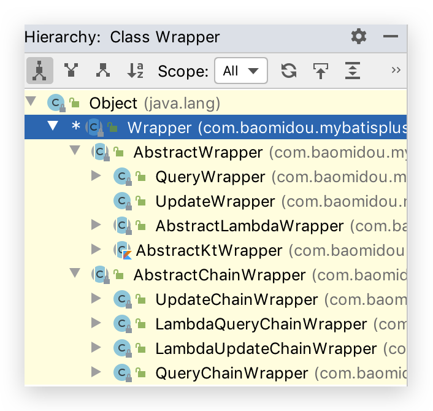

# 3 条件构造器  Wrapper

Wrapper 接口的实现类如下




## AbstractWrapper

>   说明:
>
>   QueryWrapper(LambdaQueryWrapper) 和 UpdateWrapper(LambdaUpdateWrapper) 的父类用于生成 sql 的 where 条件, entity 属性也用于生成 sql 的 where 条件
>
>   注意: entity 生成的 where 条件与 使用各个 api 生成的 where 条件**没有任何关联行为**

### allEq(不推荐)

需要指定数据库字段名称，容易出错

```java
allEq(Map<R, V> params);
allEq(Map<R, V> params, boolean null2IsNull);
allEq(boolean condition, Map<R, V> params, boolean null2IsNull);

allEq(BiPredicate<R, V> filter, Map<R, V> params);
allEq(BiPredicate<R, V> filter, Map<R, V> params, boolean null2IsNull);
allEq(boolean condition, BiPredicate<R, V> filter, Map<R, V> params, boolean null2IsNull);
```

全部[eq](https://mybatis.plus/guide/wrapper.html#eq)(或个别[isNull](https://mybatis.plus/guide/wrapper.html#isnull))

*   `params` : `key`为数据库字段名,`value`为字段值

*   `null2IsNull` : 为`true`则在`map`的`value`为`null`时调用 [isNull](https://mybatis.plus/guide/wrapper.html#isnull) 方法

    为`false`时则忽略`value`为`null`的

*   `filter` : 过滤函数,是否允许字段传入比对条件中

例子（需转换 JSON 格式为 Map）：

```java
// id = 1 and name = '老王' and age is null
allEq({id:1,name:"老王",age:null})
```

```java
// id = 1 and name = '老王'
allEq({id:1,name:"老王",age:null}, false)
```

```java
// name = '老王' and age is null
allEq((k,v) -> k.indexOf("a") >= 0, {id:1,name:"老王",age:null})
```

```java
// `name = '老王'
allEq((k,v) -> k.indexOf("a") >= 0, {id:1,name:"老王",age:null}, false)
```

```java
@Test
public void allEq() {
  HashMap<String, Object> map = new HashMap<>();
  map.put("user_name", "Tom Cat");
  map.put("email", "Tom@qq.com");
  map.put("age", null);
  // SELECT id,user_name,age,email FROM user WHERE (user_name = ? AND age IS NULL)
  List<User> list = this.userMapper.selectList(
    new QueryWrapper<User>()
    .allEq((k, v) -> k.contains("user_name") || k.contains("age"), map, true));
}
```


### eq🔥

```java
eq(R column, Object val)
eq(boolean condition, R column, Object val)
```

-   等于 =
-   例: `eq("name", "老王")`--->`name = '老王'`


### ne🔥

```java
ne(R column, Object val)
ne(boolean condition, R column, Object val)
```

-   不等于 <>
-   例: `ne("name", "老王")`--->`name <> '老王'`


### gt🔥

```java
gt(R column, Object val)
gt(boolean condition, R column, Object val)
```

-   大于 >
-   例: `gt("age", 18)`--->`age > 18`


### ge🔥

```java
ge(R column, Object val)
ge(boolean condition, R column, Object val)
```

-   大于等于 >=
-   例: `ge("age", 18)`--->`age >= 18`


### lt🔥

```java
lt(R column, Object val)
lt(boolean condition, R column, Object val)
```

-   小于 <
-   例: `lt("age", 18)`--->`age < 18`


### le🔥

```java
le(R column, Object val)
le(boolean condition, R column, Object val)
```

-   小于等于 <=
-   例: `le("age", 18)`--->`age <= 18`


### between🔥

```java
between(R column, Object val1, Object val2)
between(boolean condition, R column, Object val1, Object val2)
```

-   BETWEEN 值1 AND 值2
-   例: `between("age", 18, 30)`--->`age between 18 and 30`


### notBetween🔥

```java
notBetween(R column, Object val1, Object val2)
notBetween(boolean condition, R column, Object val1, Object val2)
```

-   NOT BETWEEN 值1 AND 值2
-   例: `notBetween("age", 18, 30)`--->`age not between 18 and 30`


### like🔥

```java
like(R column, Object val)
like(boolean condition, R column, Object val)
```

-   LIKE '%值%'
-   例: `like("name", "王")`--->`name like '%王%'`


### notLike

```java
notLike(R column, Object val)
notLike(boolean condition, R column, Object val)
```

-   NOT LIKE '%值%'
-   例: `notLike("name", "王")`--->`name not like '%王%'`


### likeLeft🔥

```java
likeLeft(R column, Object val)
likeLeft(boolean condition, R column, Object val)
```

-   LIKE '%值'
-   例: `likeLeft("name", "王")`--->`name like '%王'`


### likeRight

```java
likeRight(R column, Object val)
likeRight(boolean condition, R column, Object val)
```

-   LIKE '值%'
-   例: `likeRight("name", "王")`--->`name like '王%'`


### isNull🔥

```java
isNull(R column)
isNull(boolean condition, R column)
```

-   字段 IS NULL
-   例: `isNull("name")`--->`name is null`


### isNotNull🔥

```java
isNotNull(R column)
isNotNull(boolean condition, R column)
```

-   字段 IS NOT NULL
-   例: `isNotNull("name")`--->`name is not null`


### in🔥

```java
in(R column, Collection<?> value)
in(boolean condition, R column, Collection<?> value)
```

-   字段 IN (value.get(0), value.get(1), ...)
-   例: `in("age",{1,2,3})`--->`age in (1,2,3)`

```java
in(R column, Object... values)
in(boolean condition, R column, Object... values)
```

-   字段 IN (v0, v1, ...)
-   例: `in("age", 1, 2, 3)`--->`age in (1,2,3)`


### notIn🔥

```java
notIn(R column, Collection<?> value)
notIn(boolean condition, R column, Collection<?> value)
```

-   字段 IN (value.get(0), value.get(1), ...)
-   例: `notIn("age",{1,2,3})`--->`age not in (1,2,3)

```java
notIn(R column, Object... values)
notIn(boolean condition, R column, Object... values)
```

-   字段 NOT IN (v0, v1, ...)
-   例: `notIn("age", 1, 2, 3)`--->`age not in (1,2,3)`


### inSql🔥

```java
inSql(R column, String inValue)
inSql(boolean condition, R column, String inValue)
```

-   字段 IN ( sql语句 )
-   例: `inSql("age", "1,2,3,4,5,6")`--->`age in (1,2,3,4,5,6)`
-   例: `inSql("id", "select id from table where id < 3")`--->`id in (select id from table where id < 3)`


### notInSql🔥

```java
notInSql(R column, String inValue)
notInSql(boolean condition, R column, String inValue)
```

-   字段 NOT IN ( sql语句 )
-   例: `notInSql("age", "1,2,3,4,5,6")`--->`age not in (1,2,3,4,5,6)`
-   例: `notInSql("id", "select id from table where id < 3")`--->`age not in (select id from table where id < 3)`


### exists🔥

```java
exists(String existsSql)
exists(boolean condition, String existsSql)
```

-   拼接 EXISTS ( sql语句 )
-   例: `exists("select id from table where age = 1")`--->`exists (select id from table where age = 1)`


### notExists🔥

```java
notExists(String notExistsSql)
notExists(boolean condition, String notExistsSql)
```

-   拼接 NOT EXISTS ( sql语句 )
-   例: `notExists("select id from table where age = 1")`--->`not exists (select id from table where age = 1)`


### groupBy🔥

```java
groupBy(R... columns)
groupBy(boolean condition, R... columns)
```

-   分组：GROUP BY 字段, ...
-   例: `groupBy("id", "name")`--->`group by id,name`


### having🔥

```java
having(String sqlHaving, Object... params)
having(boolean condition, String sqlHaving, Object... params)
```

-   HAVING ( sql语句 )
-   例: `having("sum(age) > 10")`--->`having sum(age) > 10`
-   例: `having("sum(age) > {0}", 11)`--->`having sum(age) > 11`


### orderByAsc🔥

```java
orderByAsc(R... columns)
orderByAsc(boolean condition, R... columns)
```

-   排序：ORDER BY 字段, ... ASC
-   例: `orderByAsc("id", "name")`--->`order by id ASC,name ASC`


### orderByDesc🔥

```java
orderByDesc(R... columns)
orderByDesc(boolean condition, R... columns)
```

-   排序：ORDER BY 字段, ... DESC
-   例: `orderByDesc("id", "name")`--->`order by id DESC,name DESC`


### orderBy

```java
orderBy(boolean condition, boolean isAsc, R... columns)
```

-   排序：ORDER BY 字段, ...
-   例: `orderBy(true, true, "id", "name")`--->`order by id ASC,name ASC`


### or🔥

```java
or()
or(boolean condition)
```

-   拼接 OR

>   注意事项: 主动调用`or`表示紧接着下一个**方法**不是用`and`连接!(不调用`or`则默认为使用`and`连接)

-   例: `eq("id",1).or().eq("name","老王")`--->`id = 1 or name = '老王'`

```java
or(Consumer<Param> consumer)
or(boolean condition, Consumer<Param> consumer)
```

-   OR 嵌套
-   例: `or(i -> i.eq("name", "李白").ne("status", "活着"))`--->`or (name = '李白' and status <> '活着')`


### and🔥

```java
and(Consumer<Param> consumer)
and(boolean condition, Consumer<Param> consumer)
```

-   AND 嵌套
-   例: `and(i -> i.eq("name", "李白").ne("status", "活着"))`--->`and (name = '李白' and status <> '活着')`


### nested🔥

```java
nested(Consumer<Param> consumer)
nested(boolean condition, Consumer<Param> consumer)
```

-   正常嵌套 不带 AND 或者 OR
-   例: `nested(i -> i.eq("name", "李白").ne("status", "活着"))`--->`(name = '李白' and status <> '活着')`


### apply

```java
apply(String applySql, Object... params)
apply(boolean condition, String applySql, Object... params)
```

-   拼接 sql

>   注意事项: 该方法可用于数据库**函数** 动态入参的`params`对应前面`applySql`内部的`{index}`部分.这样是不会有sql注入风险的,反之会有!

-   例: `apply("id = 1")`--->`id = 1`
-   例: `apply("date_format(dateColumn,'%Y-%m-%d') = '2008-08-08'")`--->`date_format(dateColumn,'%Y-%m-%d') = '2008-08-08'")`
-   例: `apply("date_format(dateColumn,'%Y-%m-%d') = {0}", "2008-08-08")`--->`date_format(dateColumn,'%Y-%m-%d') = '2008-08-08'")`


### last

```java
last(String lastSql)
last(boolean condition, String lastSql)
```

-   无视优化规则直接拼接到 sql 的最后

>   注意事项: 只能调用一次,多次调用以最后一次为准 有sql注入的风险,请谨慎使用

*   例: `last("limit 1")`


## QueryWrapper

>   说明: 继承自 AbstractWrapper ,自身的内部属性 entity 也用于生成 where 条件及 LambdaQueryWrapper, 可以通过 new QueryWrapper().lambda() 方法获取

### select🔥

```java
select(String... sqlSelect)
select(Predicate<TableFieldInfo> predicate)
select(Class<T> entityClass, Predicate<TableFieldInfo> predicate)
```

-   **设置查询字段**

>   说明: 以上方分法为两类.
>
>   第二类方法为: 过滤查询字段(主键除外),入参不包含 class 的调用前需要`wrapper`内的`entity`属性有值! 这两类方法重复调用以最后一次为准

-   例: `select("id", "name", "age")`
-   例: `select(i -> i.getProperty().startsWith("test"))`


## UpdateWrapper

>   说明: 继承自 `AbstractWrapper` ,自身的内部属性 `entity` 也用于生成 where 条件及 `LambdaUpdateWrapper`, 可以通过 `new UpdateWrapper().lambda()` 方法获取!

### set

```java
set(String column, Object val)
set(boolean condition, String column, Object val)
```

-   SQL SET 字段
-   例: `set("name", "老李头")`
-   例: `set("name", "")`--->数据库字段值变为**空字符串**
-   例: `set("name", null)`--->数据库字段值变为`null`


### setSql

```java
setSql(String sql)
```

-   设置 SET 部分 SQL
-   例: `setSql("name = '老李头'")`


## lambda

-   获取 `LambdaWrapper`
    在`QueryWrapper`中是获取`LambdaQueryWrapper`
    在`UpdateWrapper`中是获取`LambdaUpdateWrapper`


## 使用 Wrapper 自定义SQL

查看[文档](https://mybatis.plus/guide/wrapper.html#%E4%BD%BF%E7%94%A8-wrapper-%E8%87%AA%E5%AE%9A%E4%B9%89sql)