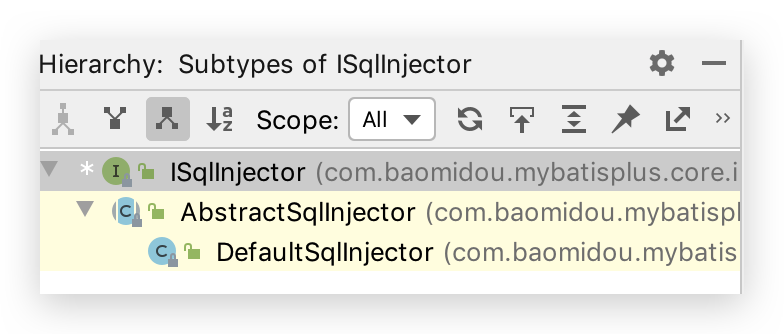
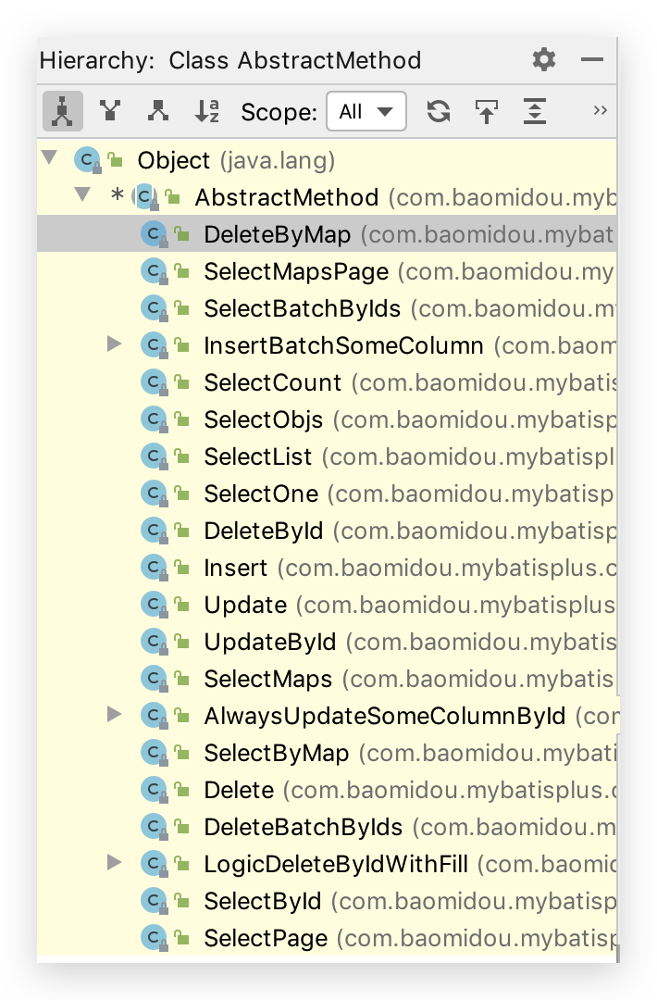
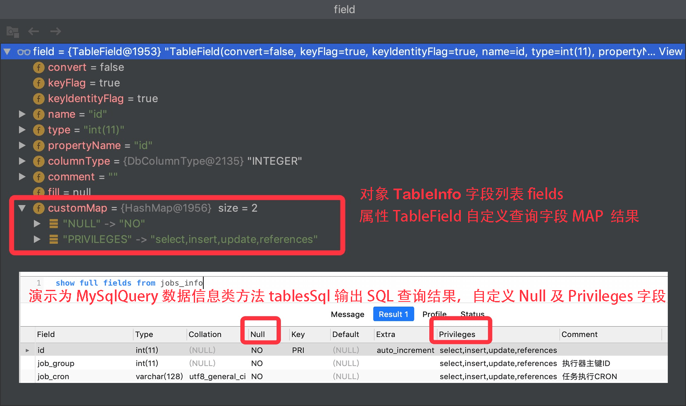

# 4 插件扩展

## Mybatis 插件机制

Mybatis 允许在已映射语句执行过程中的某一点进行拦截调用，Mybatis 允许使用插件来拦截的方法调用包括：

*   `StatementHandler`类的 n 多 4
*   `ParameterHandler`类的`getParameterObject()` `setParameters()` 2
*   `Executor`类的 n 多 1
*   `ResultSetHandler`类的`handleResultSets` `handleCursorResultSets` `handleOutputParameters`

即每个环节都可以拦截。

```java
/**
 * 拦截Executor类的update(MappedStatement ms,Object o)方法
 *
 * @author conanan
 * @create 2019-12-15
 */
@Intercepts({@Signature(type = Executor.class,method = "update",args = {MappedStatement.class,Object.class})})
public class MyInterceptor implements Interceptor {
  @Override
  public Object intercept(Invocation invocation) throws Throwable {
    // 拦截方法，编写具体拦截业务逻辑
    return invocation.proceed();
  }

  @Override
  public Object plugin(Object target) {
    // 此处会执行4次，对上述4个接口的实现类对象都进行包装
    // Executor->(intercept)->ParameterHandler->ResultSetHandler->StatementHandler
    // 创建 target 对象的代理对象，将当前拦截器加入到该对象中
    return Plugin.wrap(target,this);
  }

  @Override
  public void setProperties(Properties properties) {
    // 属性设置
  }
}
```

将上述`MyInterceptor`类注册到IoC容器中


## 自动填充功能🔥

### 实现MetaObjectHandler

实现元对象处理器接口：com.baomidou.mybatisplus.core.handlers.MetaObjectHandler

```java
@Slf4j
@Component// 使用该注解会自动注入IoC容器中，无需配置@Bean
public class MyMetaObjectHandler implements MetaObjectHandler {

  @Override
  public void insertFill(MetaObject metaObject) {
    log.info("start insert fill ....");
    LocalDateTime createTime = (LocalDateTime) this.getFieldValByName("createTime", metaObject);
    LocalDateTime updateTime = (LocalDateTime) this.getFieldValByName("updateTime", metaObject);
    if (createTime == null) {
      createTime = LocalDateTime.now();
      // this.setFieldValByName("createTime", createTime, metaObject);
      // @since 3.3.0
      this.strictInsertFill(metaObject, "createTime", LocalDateTime.class, createTime);
    }
    if (updateTime == null) {
      updateTime = LocalDateTime.now();
      // this.setFieldValByName("updateTime", updateTime, metaObject);
      // @since 3.3.0
      this.strictInsertFill(metaObject, "updateTime", LocalDateTime.class, updateTime);

    }
  }

  @Override
  public void updateFill(MetaObject metaObject) {
    LocalDateTime updateTime = (LocalDateTime) this.getFieldValByName("updateTime", metaObject);
    if (updateTime == null) {
      updateTime = LocalDateTime.now();
      // this.setFieldValByName("updateTime", updateTime, metaObject);
      // @since 3.3.0
      this.strictUpdateFill(metaObject, "updateTime", LocalDateTime.class, updateTime);
    }
  }
}
```

### 注解填充字段

注解填充字段 `@TableField(.. fill = FieldFill.INSERT)` 代码生成器策略部分也可以配置！

```java
@TableField(fill = FieldFill.INSERT)
private LocalDateTime createTime;

@TableField(fill = FieldFill.INSERT_UPDATE)
private LocalDateTime updateTime;
```


## 逻辑删除🔥

application.yml 加入配置(如果你的默认值和mp默认的一样,该配置可无):

```yaml
mybatis-plus:
  global-config:
    db-config:
      logic-delete-field: deleted  #全局逻辑删除字段值 3.3.0开始支持，详情看下面。
      logic-delete-value: 1 # 逻辑已删除值(默认为 1)
      logic-not-delete-value: 0 # 逻辑未删除值(默认为 0)
```

实体类字段上加上`@TableLogic`注解

```java
@TableField(value = "is_deleted")
@TableLogic
private Boolean deleted;
```

效果: 使用mp自带方法删除和查找都会附带逻辑删除功能 (自己写的xml不会)

```sql
删除时 update user set deleted=1 where id =1 and deleted=0
查找时 select * from user where deleted=0
```

>   全局逻辑删除: 3.3.0开始支持
>
>   如果公司代码比较规范，比如统一了全局都是 deleted 为逻辑删除字段。使用此配置则不需要在实体类上添加 @TableLogic。
>
>   但如果实体类上有 @TableLogic 则以实体上的为准，忽略全局。 即先查找注解再查找全局，都没有则此表没有逻辑删除。


## 通用枚举🔥

解决了繁琐的配置，让 mybatis 优雅的使用枚举属性！

>   自`3.1.0`开始,可配置默认枚举处理类来省略扫描通用枚举配置 [默认枚举配置](https://mybatis.plus/config/#defaultEnumTypeHandler)
>
>   -   升级说明:
>
>       `3.1.0` 以下版本改变了原生默认行为,升级时请将默认枚举设置为`EnumOrdinalTypeHandler`
>
>   -   影响用户:
>
>       实体中使用原生枚举
>
>   -   其他说明:
>
>       配置枚举包扫描的时候能提前注册使用注解枚举的缓存
>
>   -   推荐配置:
>
>       -   使用实现 IEnum 接口
>
>           接口
>
>           -   推荐配置`defaultEnumTypeHandler`
>
>       -   使用注解枚举处理
>
>           -   推荐配置`typeEnumsPackage`
>
>       -   注解枚举处理与 IEnum 接口
>
>           IEnum
>
>           接口
>
>           -   推荐配置`typeEnumsPackage`
>
>       -   与原生枚举混用
>
>           -   需配置`defaultEnumTypeHandler`与 `typeEnumsPackage`


### 枚举类

方式一：`@EnumValue`注解，代表数据库中存储的值（推荐）

```java
public enum SexEnum {
  // nan
  MALE(1,"男"),
  // nv
  FEMALE(2,"女");

  @EnumValue
  private final int code;
  private final String value;

  SexEnum(int code, String value) {
    this.code = code;
    this.value = value;
  }
}
```

方式二：实现`IEnum<T>`接口重写`getValue()`

```java
public enum SexEnum implements IEnum<Integer> {
  // nan
  MALE(1,"男"),
  // nv
  FEMALE(2,"女");

  private final int code;
  private final String value;

  SexEnum(int code, String value) {
    this.code = code;
    this.value = value;
  }

  @Override
  public Integer getValue() {
    return this.value;
  }
}
```


### 配置包扫描

application.yaml中配置如下：

```yaml
mybatis-plus:
  type-enums-package: top.conanan.studymybatisplus.domain
```


### 实体类

```java
private SexEnum sex;
```


### Test

```java
// insert 时可以使用
@Test
public void insert() {
  User user = new User();
  user.setUserName("Conanan");
  user.setSex(SexEnum.MALE);
  int i = this.userMapper.insert(user);
}
```

```java
// select 时可用作条件
@Test
public void selectOne() {
  User sandy = this.userMapper.selectOne(new LambdaQueryWrapper<User>()
                                         .eq(User::getSex,SexEnum.FEMALE));

}
```


### JSON序列化处理

*   Jackson：在需要响应描述字段的get方法上添加`@JsonValue`注解即可

    ```java
    @EnumValue
    private final int code;
    @JsonValue
    private final String value;
    ```

*   Fastjson：看文档吧


## 分页插件🔥

### PaginationInterceptor

```java
@EnableTransactionManagement
@Configuration
@MapperScan("com.baomidou.cloud.service.*.mapper*")
public class MybatisPlusConfig {

  @Bean
  public PaginationInterceptor paginationInterceptor() {
    PaginationInterceptor paginationInterceptor = new PaginationInterceptor();
    // 开启 count 的 join 优化,只针对 left join !!!
    paginationInterceptor.setCountSqlParser(new JsqlParserCountOptimize(true));
    
    // 设置请求的页面大于最大页后操作， true调回到首页，false 继续请求  默认false
    // paginationInterceptor.setOverflow(false);
    
    // 设置最大单页限制数量，默认 500 条，-1 不受限制
    // paginationInterceptor.setLimit(500);
    return paginationInterceptor;
  }
}
```

### XML 自定义分页

*   UserMapper.java 方法内容

    ```java
    public interface UserMapper{//可以继承或者不继承BaseMapper
      /**
         * <p>
         * 查询 : 根据state状态查询用户列表，分页显示
         * 注意!!: 如果入参是有多个,需要加注解指定参数名才能在xml中取值
         * </p>
         *
         * @param page 分页对象,xml中可以从里面进行取值,传递参数 Page 即自动分页,必须放在第一位(你可以继承Page实现自己的分页对象)
         * @param state 状态
         * @return 分页对象
         */
      IPage<User> selectPageVo(Page page, @Param("state") Integer state);
    }
    ```

*   UserMapper.xml 等同于编写一个普通 list 查询，mybatis-plus 自动替你分页

    ```xml
    <select id="selectPageVo" resultType="com.baomidou.cloud.entity.UserVo">
        SELECT id,name FROM user WHERE state=#{state}
    </select>
    ```

*   UserServiceImpl.java 调用分页方法

    ```java
    public IPage<User> selectUserPage(Page<User> page, Integer state) {
      // 不进行 count sql 优化，解决 MP 无法自动优化 SQL 问题，这时候你需要自己查询 count 部分
      // page.setOptimizeCountSql(false);
      // 当 total 为小于 0 或者设置 setSearchCount(false) 分页插件不会进行 count 查询
      // 要点!! 分页返回的对象与传入的对象是同一个
      return userMapper.selectPageVo(page, state);
    }
    ```


## Sequence主键🔥

>   在 MySQL 中主键往往是自增长的，使用比较方便，若使用 Oracle 或其他 DB，就需要 Sequence 序列来生成主键

### 配置KeySequence

*   支持父类定义`@KeySequence`子类继承使用。支持主键类型指定(3.3.0开始自动识别主键类型)，内置支持：

    *   DB2KeyGenerator
    *   **H2KeyGenerator**
    *   KingbaseKeyGenerator
    *   **OracleKeyGenerator**
    *   **PostgreKeyGenerator**

    如果内置支持不满足你的需求，可实现IKeyGenerator接口来进行扩展.

*   方式一: 使用配置类

    ```java
    @Bean
    public IKeyGenerator keyGenerator() {
        return new H2KeyGenerator();
    }
    ```

*   方式二: 通过MybatisPlusPropertiesCustomizer自定义

    ```java
    @Bean
    public MybatisPlusPropertiesCustomizer plusPropertiesCustomizer() {
      return plusProperties -> plusProperties.getGlobalConfig().getDbConfig().setKeyGenerator(new H2KeyGenerator());
    }
    ```

    

### 主键生成策略

**主键生成策略必须使用INPUT**

*   方式一：全局配置

    ```yaml
    mybatis-plus:
      global-config:
        db-config:
          id-type: input # 该类型可以通过自己注册自动填充插件进行填充，如配置 KeyGenerator
    ```

*   方式二：实体类中定义并指定使用的 Sequence 名称

    ```java
    // 序列名称，返回序列的类型根据需要选择可为 Long，String
    @KeySequence(value = "SEQ_ORACLE_STRING_KEY", clazz = String.class)
    public class YourEntity {
        
        @TableId(value = "ID_STR", type = IdType.INPUT)
        private String idStr;
    
    }
    ```

    

## 乐观锁插件🔥

### 主要适用场景

当要更新一条记录的时候，希望这条记录没有被别人更新

乐观锁实现方式：

-   取出记录时，获取当前version
-   更新时，带上这个version
-   执行更新时， set version = newVersion where version = oldVersion
-   如果version不对，就更新失败

**乐观锁配置需要2步 记得两步**


### 1 插件配置

```java
@Bean
public OptimisticLockerInterceptor optimisticLockerInterceptor() {
    return new OptimisticLockerInterceptor();
}
```

### 2.注解实体字段 `@Version` 必须要!

数据库中字段也要添加哦

```java
@Version
private Integer version;
```

>   特别说明:
>
>   -   **支持的数据类型只有: int, Integer, long, Long, Date, Timestamp, LocalDateTime**
>   -   整数类型下 `newVersion = oldVersion + 1` ，`newVersion` 会回写到 `entity` 中
>   -   仅支持 `updateById(id)` 与 `update(entity, wrapper)` 方法
>   -   **在 `update(entity, wrapper)` 方法下, `wrapper` 不能复用!!!**


### 示例

实际使用是需先查询，version字段会自动+1

```java
@SpringBootTest
public class OptLockerTest {

  @Autowired
  UserMapper userMapper;

  @Test
  public void testUpdateByIdSucc() {
    User user = new User();
    user.setAge(18);
    user.setEmail("test@baomidou.com");
    user.setName("optlocker");
    user.setVersion(1); 
    userMapper.insert(user);
    Long id = user.getId();

    User userUpdate = new User();
    userUpdate.setId(id);
    userUpdate.setAge(19);
    userUpdate.setVersion(1);// 新的值不用手动写
    Assert.assertEquals("Should update success", 1, userMapper.updateById(userUpdate));
    Assert.assertEquals("Should version = version+1", 2, userUpdate.getVersion().intValue());
  }

  @Test
  public void testUpdateByIdFail() {
    User user = new User();
    user.setAge(18);
    user.setEmail("test@baomidou.com");
    user.setName("optlocker");
    user.setVersion(1);
    userMapper.insert(user);
    Long id = user.getId();

    User userUpdate = new User();
    userUpdate.setId(id);
    userUpdate.setAge(19);
    userUpdate.setVersion(0);
    Assert.assertEquals(
      "Should update failed due to incorrect version(actually 1, but 0 passed in)", 
      0, 
      userMapper.updateById(userUpdate)
    );
  }

  @Test
  public void testUpdateByIdSuccWithNoVersion() {
    User user = new User();
    user.setAge(18);
    user.setEmail("test@baomidou.com");
    user.setName("optlocker");
    user.setVersion(1);
    userMapper.insert(user);
    Long id = user.getId();

    User userUpdate = new User();
    userUpdate.setId(id);
    userUpdate.setAge(19);
    userUpdate.setVersion(null);
    Assert.assertEquals("Should update success as no version passed in", 1, userMapper.updateById(userUpdate));
    User updated = userMapper.selectById(id);
    Assert.assertEquals("Version not changed", 1, updated.getVersion().intValue());
    Assert.assertEquals("Age updated", 19, updated.getAge().intValue());
  }

  /**
   * 批量更新带乐观锁
   * <p>
   * update(et,ew) et:必须带上version的值才会触发乐观锁
   */
  @Test
  public void testUpdateByEntitySucc() {
    QueryWrapper<User> ew = new QueryWrapper<>();
    ew.eq("version", 1);
    int count = userMapper.selectCount(ew);

    User entity = new User();
    entity.setAge(28);
    entity.setVersion(1);

    Assert.assertEquals("updated records should be same", count, userMapper.update(entity, null));
    ew = new QueryWrapper<>();
    ew.eq("version", 1);
    Assert.assertEquals("No records found with version=1", 0, userMapper.selectCount(ew).intValue());
    ew = new QueryWrapper<>();
    ew.eq("version", 2);
    Assert.assertEquals("All records with version=1 should be updated to version=2", 
                        count, 
                        userMapper.selectCount(ew).
                        intValue()
                       );
  }
}
```

```sql
update tbl_user set name = 'update',version = 3 where id = 100 and version = 2
```


## SQL 注入器

### 原理

全局配置 `sqlInjector` 用于注入实现 `ISqlInjector` 接口的子类，实现自定义方法注入。MP 在启动后会将 BaseMapper 中的一系列方法注册到 meppedStatements 中，其实就是通过该注入器来实现的。可以参考默认注入器 [DefaultSqlInjector](https://gitee.com/baomidou/mybatis-plus/blob/3.0/mybatis-plus-core/src/main/java/com/baomidou/mybatisplus/core/injector/DefaultSqlInjector.java)。

 `ISqlInjector `及其实类现如下

```java
public interface ISqlInjector {
    /**
     * 检查SQL是否注入(已经注入过不再注入)
     *
     * @param builderAssistant mapper 信息
     * @param mapperClass      mapper 接口的 class 对象
     */
    void inspectInject(MapperBuilderAssistant builderAssistant, Class<?> mapperClass);
}
```

按下 IDEA 中 Control + H（即 Navigate => Type Hierarchy），查看`ISqlInjector`类的阶层



在`AbstractSqlInjector`中，由`inspectInject()`检查注入方法来注入的：

```java
@Override
public void inspectInject(MapperBuilderAssistant builderAssistant, Class<?> mapperClass) {
  Class<?> modelClass = extractModelClass(mapperClass);
  if (modelClass != null) {
    String className = mapperClass.toString();
    Set<String> mapperRegistryCache = GlobalConfigUtils.getMapperRegistryCache(builderAssistant.getConfiguration());
    if (!mapperRegistryCache.contains(className)) {
      List<AbstractMethod> methodList = this.getMethodList(mapperClass);
      if (CollectionUtils.isNotEmpty(methodList)) {
        TableInfo tableInfo = TableInfoHelper.initTableInfo(builderAssistant, modelClass);
        // 循环注入自定义方法
        methodList.forEach(m -> m.inject(builderAssistant, mapperClass, modelClass, tableInfo));
      } else {
        logger.debug(mapperClass.toString() + ", No effective injection method was found.");
      }
      mapperRegistryCache.add(className);
    }
  }
}
```

其中如下方法进行循环遍历并注入。`methodList`由`getMethodList()`获取到，`AbstractSqlInjector`的一个子类`DefaultSqlInjector`实现了该方法，其是 SQL 默认注入器，负责注入 MP 自带的方法。

```java
// 循环注入自定义方法
methodList.forEach(m -> m.inject(builderAssistant, mapperClass, modelClass, tableInfo));
```

```java
public class DefaultSqlInjector extends AbstractSqlInjector {

  @Override
  public List<AbstractMethod> getMethodList(Class<?> mapperClass) {
    return Stream.of(
      new Insert(),
      new Delete(),
      new DeleteByMap(),
      new DeleteById(),
      new DeleteBatchByIds(),
      new Update(),
      new UpdateById(),
      new SelectById(),
      new SelectBatchByIds(),
      new SelectByMap(),
      new SelectOne(),
      new SelectCount(),
      new SelectMaps(),
      new SelectMapsPage(),
      new SelectObjs(),
      new SelectList(),
      new SelectPage()
    ).collect(toList());
  }
}
```

查看`inject()`方法，其调用了`injectMappedStatement()`抽象方法，那么所有实现了该方法的类都将进行 SQL注入

```java
/**
     * 注入自定义方法
     */
public void inject(MapperBuilderAssistant builderAssistant, Class<?> mapperClass, Class<?> modelClass, TableInfo tableInfo) {
  this.configuration = builderAssistant.getConfiguration();
  this.builderAssistant = builderAssistant;
  this.languageDriver = configuration.getDefaultScriptingLanguageInstance();
  /* 注入自定义方法 */
  injectMappedStatement(mapperClass, modelClass, tableInfo);
}
```

按下 IDEA 中 Control + H（即 Navigate => Type Hierarchy），查看实现了`injectMappedStatement()`的`AbstractMethod`抽象类的类：



挑选一个`SelectById`类来查看

```java
public class SelectById extends AbstractMethod {

  @Override
  public MappedStatement injectMappedStatement(Class<?> mapperClass, Class<?> modelClass, TableInfo tableInfo) {
    SqlMethod sqlMethod = SqlMethod.LOGIC_SELECT_BY_ID;
    SqlSource sqlSource = new RawSqlSource(
      configuration, String.format(sqlMethod.getSql(),
                                   sqlSelectColumns(tableInfo, false),
                                   tableInfo.getTableName(), tableInfo.getKeyColumn(), tableInfo.getKeyProperty(),
                                   tableInfo.getLogicDeleteSql(true, true)), Object.class);
    return this.addSelectMappedStatementForTable(mapperClass, getMethod(sqlMethod), sqlSource, tableInfo);
  }
}
```

生成的`SqlSource`对象中的 sql 属性即生成的 SQL 语句将通过`addSelectMappedStatementForTable()`注入到`MappedStatement`


### 自定义

可继承`DefaultSqlInjector`，其他步骤查看[文档](https://mybatis.plus/guide/sql-injector.html)


## 攻击 SQL 阻断解析器

作用！阻止恶意的全表更新删除

配置Bean，以下方法取其一即可

```java
@Bean
public PaginationInterceptor paginationInterceptor() {
    PaginationInterceptor paginationInterceptor = new PaginationInterceptor();

    //...

    List<ISqlParser> sqlParserList = new ArrayList<>();
    // 攻击 SQL 阻断解析器、加入解析链
    sqlParserList.add(new BlockAttackSqlParser() {
            @Override
            public void processDelete(Delete delete) {
                // 如果你想自定义做点什么，可以重写父类方法像这样子
                if ("user".equals(delete.getTable().getName())) {
                    // 自定义跳过某个表，其他关联表可以调用 delete.getTables() 判断
                    return ;
                }
                super.processDelete(delete);
            }
        });
    paginationInterceptor.setSqlParserList(sqlParserList);

    //...

    return paginationInterceptor;
}

@Bean
public SqlExplainInterceptor sqlExplainInterceptor(){
  SqlExplainInterceptor sqlExplainInterceptor = new SqlExplainInterceptor();
  ArrayList<ISqlParser> list = new ArrayList<>();
  // 可Control + H 查看 ISqlParser 的实现类
  // 攻击 SQL 阻断解析器
  list.add(new BlockAttackSqlParser());
  sqlExplainInterceptor.setSqlParserList(list);
  return sqlExplainInterceptor;
}
```

Test

```java
@Test
public void testUpdateAll(){
  // com.baomidou.mybatisplus.core.exceptions.MybatisPlusException: Prohibition of table update operation
  int hhh = this.userMapper.update(new User().setUserName("hhh"), null);
}
```


## 执行 SQL 分析打印

替代原有 性能分析插件（用于输出每条 SQL 语句及其执行时间，性能分析插件 `3.2.0` 以上版本移除）

查看[文档](https://mybatis.plus/guide/p6spy.html)


## 代码生成器🔥

AutoGenerator 是 MyBatis-Plus 的代码生成器，通过 AutoGenerator 可以快速生成 Entity、Mapper、Mapper XML、Service、Controller 等各个模块的代码，极大的提升了开发效率。

>   自定义模板可用参数？[Github](https://github.com/baomidou/mybatis-plus/blob/3.0/mybatis-plus-generator/src/main/java/com/baomidou/mybatisplus/generator/engine/AbstractTemplateEngine.java) [Gitee](https://gitee.com/baomidou/mybatis-plus/blob/3.0/mybatis-plus-generator/src/main/java/com/baomidou/mybatisplus/generator/engine/AbstractTemplateEngine.java) AbstractTemplateEngine 类中方法 getObjectMap 返回 objectMap 的所有值都可用。

### 添加依赖

MyBatis-Plus 从 `3.0.3` 之后移除了代码生成器与模板引擎的默认依赖，需要手动添加相关依赖

*   添加 代码生成器 依赖

    ```xml
    <dependency>
        <groupId>com.baomidou</groupId>
        <artifactId>mybatis-plus-generator</artifactId>
        <version>3.3.0</version>
    </dependency>
    ```

*   添加 模板引擎 依赖，MyBatis-Plus 支持 Velocity（默认）、Freemarker、Beetl，用户可以选择自己熟悉的模板引擎，如果都不满足您的要求，可以采用自定义模板引擎。

    Velocity（默认）：

    ```xml
    <dependency>
        <groupId>org.apache.velocity</groupId>
        <artifactId>velocity-engine-core</artifactId>
        <version>2.1</version>
    </dependency>
    ```

    Freemarker：

    ```xml
    <dependency>
      <groupId>org.springframework.boot</groupId>
      <artifactId>spring-boot-starter-freemarker</artifactId>
    </dependency>
    ```
    
    Beetl：
    
    ```xml
    <dependency>
        <groupId>com.ibeetl</groupId>
        <artifactId>beetl</artifactId>
        <version>3.0.15.RELEASE</version>
    </dependency>
    ```

    注意！如果您选择了非默认引擎，需要在 AutoGenerator 中 设置模板引擎。
    
    ```java
    AutoGenerator generator = new AutoGenerator();

    // set freemarker engine
    generator.setTemplateEngine(new FreemarkerTemplateEngine());

    // set beetl engine
    generator.setTemplateEngine(new BeetlTemplateEngine());

    // set custom engine (reference class is your custom engine class)
    generator.setTemplateEngine(new CustomTemplateEngine());

    // other config
    ...
    ```

### 编写配置

MyBatis-Plus 的代码生成器提供了大量的自定义参数供用户选择，能够满足绝大部分人的使用需求。

*   配置 GlobalConfig

    ```java
    GlobalConfig globalConfig = new GlobalConfig();
    globalConfig.setOutputDir(System.getProperty("user.dir") + "/src/main/java");
    globalConfig.setAuthor("jobob");
    globalConfig.setOpen(false);
    ```

*   配置 DataSourceConfig

    ```java
    DataSourceConfig dataSourceConfig = new DataSourceConfig();
    dataSourceConfig.setUrl("jdbc:mysql://localhost:3306/ant?useUnicode=true&useSSL=false&characterEncoding=utf8");
    dataSourceConfig.setDriverName("com.mysql.jdbc.Driver");
    dataSourceConfig.setUsername("root");
    dataSourceConfig.setPassword("password");
    ```

### 常用配置🔥

```java
@SpringBootTest
public class CodeGenerator {

  /**
     * 以下注释掉的其值都是该属性的默认值
     */
  @Test
  public void generate(){
    String parentName = "com.tensquare";
    // 模块名称
    String moduleName = "article";
    // 要生成的表
    String[] tableNamesInclude = {
      "tb_article",
      "tb_channel",
      "tb_column"
    };
    String projectPath = System.getProperty("user.dir");// 在 main 中相对于 Project，若在 @Test 中，则相对于 Module。推荐 @Test 中执行


    // 代码生成器
    AutoGenerator mpg = new AutoGenerator();

    // 1 全局策略配置
    GlobalConfig gc = new GlobalConfig();
    gc.setAuthor("conanan")
      // .setIdType(IdType.ASSIGN_ID)// 主键生成方式。此处选择雪花算法ID，可为 String 或 Long。一般跟随全局中配置
      // .setSwagger2(true)// 实体属性 Swagger2 注解
      .setActiveRecord(true)// AR 模式
      .setBaseResultMap(true)// BaseResultMap
      .setBaseColumnList(true)// BaseColumnList
      // .setEnableCache(true)// XML 中开启二级缓存
      .setOutputDir(projectPath + "/src/main/java")// 若是在 main() 中，需要添加 Project 路径
      .setFileOverride(true)// 覆盖文件，一般不覆盖
      .setOpen(false);// 是否打开输出目录
    mpg.setGlobalConfig(gc);


    // 2 包配置
    PackageConfig pc = new PackageConfig();
    pc.setParent(parentName)
      .setModuleName(moduleName)// 模块名，可以放在 parent 中，但不严谨
      .setEntity("domain");// 其他如 mapper 改为 dao，与此类似就不配置了
    mpg.setPackageInfo(pc);


    // 3 数据源配置
    DataSourceConfig dsc = new DataSourceConfig();
    dsc.setUrl("jdbc:mysql://localhost:3306/tensquare_article?useUnicode=true&characterEncoding=utf-8&useSSL=false&serverTimezone=GMT%2B8");
    dsc.setDriverName("com.mysql.cj.jdbc.Driver");
    // dsc.setDbType(DbType.MYSQL);// 数据库类型，不用设置，会根据 DriverName 自动检测
    dsc.setUsername("root");
    dsc.setPassword("123456");
    // dsc.setSchemaName("public");// 数据库 schema name，例如 PostgreSQL 可设置为 public。不懂？
    ITypeConvert myTypeConvert = new MySqlTypeConvert() {
      @Override
      public IColumnType processTypeConvert(GlobalConfig globalConfig, String fieldType) {
        // int 和 bigint 都转为 Long 类型，除了 tinyint(1) 是Boolean
        if (fieldType.toLowerCase().contains("int") && !fieldType.toLowerCase().contains("tinyint(1)")) {
          return DbColumnType.LONG;
        }
        return super.processTypeConvert(globalConfig, fieldType);
      }
    };
    dsc.setTypeConvert(myTypeConvert);// 数据库类型和 Java 类型转换，不同数据库重写不同的类
    mpg.setDataSource(dsc);


    // 4 数据库表、字段配置
    StrategyConfig strategy = new StrategyConfig();
    // strategy.setCapitalMode(false);// 是否大写命名
    // strategy.setSkipView(false);// 是否跳过视图
    strategy.setNaming(NamingStrategy.underline_to_camel)// 数据库表映射到实体的命名策略
      .setColumnNaming(NamingStrategy.underline_to_camel)// 数据库表字段映射到实体的命名策略, 未指定按照 naming 执行
      .setTablePrefix("tb_")// 表前缀。此处表示生成的实体去掉tb_前缀
      // strategy.setFieldPrefix("f_")// 字段前缀
      .setInclude(tableNamesInclude)// 需要包含的表名，允许正则表达式（与exclude二选一配置）
      // .setExclude()// 需要排除的表名，允许正则表达式
      // .setLikeTable()// 自3.3.0起，模糊匹配表名（与notLikeTable二选一配置）
      // .setNotLikeTable()// 自3.3.0起，自3.3.0起，模糊排除表名

      // .setEntityColumnConstant(false)// 实体类是否生成字段常量。生成的常量键值对和字段一样，没啥用？
      // .setEntityBuilderModel(false);// set后返回当前对象，可链式调用。也可使用 Lombok 的 @Accessors(chain = true)
      .setEntityLombokModel(true)// Lombok的@Data，@EqualsAndHashCode(callSuper = false)，@Accessors(chain = true)
      // .setEntityBooleanColumnRemoveIsPrefix(true)// Boolean类型字段是否移除is前缀。虽然阿里推荐移除，但是SpringMVC中已经可以自动映射。
      .setRestControllerStyle(true)// 生成 @RestController 控制器
      .setControllerMappingHyphenStyle(true)// 驼峰转连字符。stackoverflow 和 github 的 RESTApi 采用该脊椎命名法，不是驼峰或蛇形
      // .setEntityTableFieldAnnotationEnable(false)// 是否生成实体时，生成字段注解，即 @TableId("id") 或 @TableField("type")，不推荐，干净整洁最好
      // .setVersionFieldName("version")// 乐观锁属性名称，暂时不用

      .setLogicDeleteFieldName("is_deleted");// 逻辑删除字段

      // .setSuperEntityClass();// 自定义继承的Entity类全称，带包名。你自己的父类实体，没有就不用设置。
      // .setSuperEntityColumns();// 自定义基础的Entity类，公共字段，没有就不用设置。
      // .setSuperMapperClass();// 自定义继承的Mapper类全称，带包名
      // .setSuperServiceClass();// 自定义继承的Service类全称，带包名
      // .setSuperServiceImplClass();// 自定义继承的ServiceImpl类全称，带包名
      // .setSuperControllerClass();// 自定义继承的Controller类全称，带包名
    
      // strategy.setEnableSqlFilter(true);// 启用sql过滤，3.3.1开始，关闭之后likeTable与notLikeTable将失效，include和exclude将使用内存过滤

    // 填充策略
    List<TableFill> tableFillList = new ArrayList<>();
    tableFillList.add(new TableFill("create_time", FieldFill.INSERT));
    tableFillList.add(new TableFill("update_time", FieldFill.INSERT_UPDATE));
    strategy.setTableFillList(tableFillList);

    mpg.setStrategy(strategy);


    // 5 模版配置
    // 如果模板引擎是 freemarker
    String templatePath = "/templates/mapper.xml.ftl";
    // 如果模板引擎是 velocity
    // String templatePath = "/templates/mapper.xml.vm";

    // 自定义输出配置
    List<FileOutConfig> focList = new ArrayList<>();
    // 自定义配置会被优先输出
    focList.add(new FileOutConfig(templatePath) {
      @Override
      public String outputFile(TableInfo tableInfo) {
        // 自定义输出文件名 ， 如果你 Entity 设置了前后缀、此处注意 xml 的名称会跟着发生变化！！
        return projectPath + "/src/main/resources/mapper/" + pc.getModuleName()
          + "/" + tableInfo.getEntityName() + "Mapper" + StringPool.DOT_XML;
      }
    });
    /*
        cfg.setFileCreate(new IFileCreate() {
            @Override
            public boolean isCreate(ConfigBuilder configBuilder, FileType fileType, String filePath) {
                // 判断自定义文件夹是否需要创建
                checkDir("调用默认方法创建的目录");
                return false;
            }
        });
        */

    // 配置模板
    TemplateConfig templateConfig = new TemplateConfig();

    // 配置自定义输出模板
    //指定自定义模板路径，注意不要带上.ftl/.vm, 会根据使用的模板引擎自动识别
    // templateConfig.setEntity("templates/entity2.java");
    // templateConfig.setService();
    // templateConfig.setController();

    templateConfig.setXml(null);// mapper xml 模板
    mpg.setTemplate(templateConfig);
    mpg.setTemplateEngine(new FreemarkerTemplateEngine());


    // 6 注入配置，可注入自定义参数等操作以实现个性化操作
    InjectionConfig cfg = new InjectionConfig() {
      @Override
      public void initMap() {
        // to do nothing
      }
    };

    cfg.setFileOutConfigList(focList);// 自定义输出文件。配置 FileOutConfig 指定模板文件、输出文件达到自定义文件生成目的
    mpg.setCfg(cfg);

    mpg.execute();
  }
}
```


### 自定义模板引擎

请继承类 com.baomidou.mybatisplus.generator.engine.AbstractTemplateEngine

### 自定义代码模板

```java
//指定自定义模板路径, 位置：/resources/templates/entity2.java.ftl(或者是.vm)
//注意不要带上.ftl(或者是.vm), 会根据使用的模板引擎自动识别
TemplateConfig templateConfig = new TemplateConfig()
  .setEntity("templates/entity2.java");

AutoGenerator mpg = new AutoGenerator();
//配置自定义模板
mpg.setTemplate(templateConfig);
```

### 自定义属性注入

```java
InjectionConfig injectionConfig = new InjectionConfig() {
  //自定义属性注入:abc
  //在.ftl(或者是.vm)模板中，通过${cfg.abc}获取属性
  @Override
  public void initMap() {
    Map<String, Object> map = new HashMap<>();
    map.put("abc", this.getConfig().getGlobalConfig().getAuthor() + "-mp");
    this.setMap(map);
  }
};
AutoGenerator mpg = new AutoGenerator();
//配置自定义属性注入
mpg.setCfg(injectionConfig);
```

```xml
entity2.java.ftl
自定义属性注入abc=${cfg.abc}

entity2.java.vm
自定义属性注入abc=$!{cfg.abc}
```

### 字段其他信息查询注入



```java
new DataSourceConfig().setDbQuery(new MySqlQuery() {

  /**
   * 重写父类预留查询自定义字段<br>
   * 这里查询的 SQL 对应父类 tableFieldsSql 的查询字段，默认不能满足你的需求请重写它<br>
   * 模板中调用：  table.fields 获取所有字段信息，
   * 然后循环字段获取 field.customMap 从 MAP 中获取注入字段如下  NULL 或者 PRIVILEGES
   */
  @Override
  public String[] fieldCustom() {
    return new String[]{"NULL", "PRIVILEGES"};
  }
})
```

