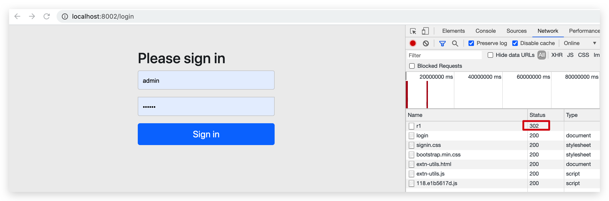
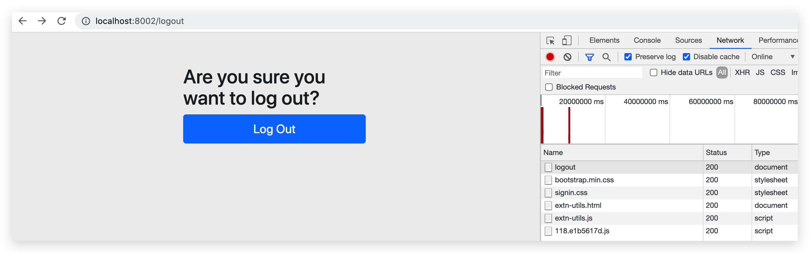

# Session—2 Security

## 简介

Spring Security 是一个能够为基于 Spring 的企业应用系统提供声明式的安全访问控制解决方案的安全框架。由于它是 Spring 生态系统中的一员，因此它伴随着整个 Spring 生态系统不断修正、升级，在 Spring Boot 项目中加入 Spring Security 更是十分简单，使用 Spring Security 减少了为企业系统安全控制编写大量重复代码的工作。 


## 创建工程

将第一章不使用 Spring Security 改为使用 Spring Security

相比未使用 Spring Security 的 Simple 工程中，少了如下方面：

*   拦截器，使用 Spring Security 提供的
*   登录页面，使用 Spring Security 提供的，当然可以自己定制


### Maven 依赖

```xml
<!--spring security依赖-->
<dependency>
    <groupId>org.springframework.security</groupId>
    <artifactId>spring-security-web</artifactId>
    <version>5.3.4.RELEASE</version>
</dependency>
<dependency>
    <groupId>org.springframework.security</groupId>
    <artifactId>spring-security-config</artifactId>
    <version>5.3.4.RELEASE</version>
</dependency>
```

其他以来查看代码


### WebAppInitializer 配置

```java
/**
 * 相当于 /webapp/WEB-INF/web.xml，Spring 容器启动时会加载 WebApplicationInitializer 接口的所有实现类
 * <p>
 * DispatcherServlet是Spring MVC的核心。在这里请求会第一次接触到框架，它主要负责将请求路由到其他的组件之中。
 * 按照传统的方式,像DispatcherServlet这样的Servlet会配置在web.xml文件中，这个文件会放到应用的WAR包里面。当然，这是配置DispatcherServlet的方法之一。
 * 但是，借助于Servlet3规范和Spring3.1的功能增强，这种方式已经不是唯一的方案了，这也不是我们本文所使用的配置方法。
 * 我们会使用java将DispatcherServlet配置在Servlet容器中，而不会再使用web.xml文件。如下程序清单展示了所需的java类。
 * <p>
 * Spring Web应用中通常存在两个应用上下文，一个是DispatcherServlet创建的应用上下文，一个是ContextLoaderListener创建的应用上下文。
 * AbstractAnnotationConfigDispatcherServletInitializer会同时创建DispatcherServlet和ContextLoaderListener（查看源码）
 */
public class WebAppInitializer extends AbstractAnnotationConfigDispatcherServletInitializer {

    /**
     * 返回的带有@Configuration注解的类将会用来配置ContextLoaderListener创建的应用上下文中的bean，
     * 通常是驱动应用后端的中间层和数据库组件。
     */
    @Override
    protected Class<?>[] getRootConfigClasses() {
        return new Class[]{RootConfig.class
            // , WebSecurityConfig.class //测试不添加也可以
            };
    }

    /**
     * 返回的带有@Configuration注解的类会用来定义DispatcherServlet应用上下文中的bean。
     * 包含Web组件的bean，如控制器、试图解析器以及处理器映射器等。
     */
    @Override
    protected Class<?>[] getServletConfigClasses() {
        return new Class[]{WebConfig.class};
    }

    /**
     * 将DispatcherServlet映射到"/"
     */
    @Override
    protected String[] getServletMappings() {
        return new String[]{"/"};
    }


}
```


### RootConfig 配置

```java
/**
 * 相当于 Spring 及其整合的如 Mybatis 等配置
 */
@Configuration
@ComponentScan(
        value = "top.conanan.security",
        excludeFilters = {
            // 需排除 Controller 注解（也会自动包含 RestController）
                @ComponentScan.Filter(type = FilterType.ANNOTATION, value = Controller.class)
        })
public class RootConfig {
}
```


### WebConfig 配置

```java
/**
 * 相当于 SpringMVC 的配置
 * <p>
 * 我们有多种方法来配置DispatcherServlet，与之类似，启用Spring MVC组件的方法也不只一种。
 * 从前，Spring是使用XML进行配置的，可以使用<mvc:annotation-driven>启用注解驱动的Spring MVC。
 */
@Configuration
@EnableWebMvc// 启用 Spring MVC 注解驱动，替代处理器映射器、处理器适配器。
@ComponentScan(
    value = "top.conanan.security.controller",
    includeFilters = @ComponentScan.Filter(type = FilterType.ANNOTATION, value = Controller.class),
    useDefaultFilters = false// 必须有！这里仅仅扫描 Controller
)
// extends WebMvcConfigurerAdapter 在 Spring 5.0 已经 Deprecated
public class WebConfig implements WebMvcConfigurer {


    /**
     * 配置视图解析器
     *
     * @param registry
     */
    @Override
    public void configureViewResolvers(ViewResolverRegistry registry) {
        registry.jsp("/WEB-INF/views/", ".jsp");
    }

    /**
     * 配置视图控制器
     *
     * @param registry
     */
    @Override
    public void addViewControllers(ViewControllerRegistry registry) {
        // /login 是跳转到 spring security 提供的登录页面，而不是自己的
        //（若不写成 redirect 则无法访问到，虽然其他的请求都可以拦截到登录页面，但是这个不行！必须写 redirect）
        registry.addViewController("/").setViewName("redirect:/login");
    }

    // 不用手动配置拦截器，使用 Spring Security 的
}
```


## 安全配置

Spring Security 提供了用户名密码**登录、退出、会话管理**等认证功能，只需要配置即可使用。

### Security 安全配置

```java
@EnableWebSecurity
public class WebSecurityConfig extends WebSecurityConfigurerAdapter {

    /**
     * 配置用户信息服务（这里就是查询的用户信息，可自定义其他非内存方法）
     * Spring Security会使用该 UserDetailsService 来获取用户信息。
     * 暂时使用InMemoryUserDetailsManager实现类，并在其中分别创建了zhangsan、lisi两个用户，并设置密码和权限。
     * 实际中会在数据库中查询
     *
     * @return
     */
    @Bean
    public UserDetailsService userDetailsService() {
        // 这里的用户名密码可以理解为数据库或其他地方存储的
        InMemoryUserDetailsManager manager = new InMemoryUserDetailsManager();
        manager.createUser(User.withUsername("zhangsan").password("123").authorities("p1").build());
        manager.createUser(User.withUsername("lisi").password("456").authorities("p2").build());
        return manager;
    }

    /**
     * 密码加密方式（此处使用不加密的）
     *
     * @return
     */
    @Bean
    public PasswordEncoder passwordEncoder() {
        // Spring Security 会根据此配置来决定密码是否编码
        return NoOpPasswordEncoder.getInstance();
    }


    /**
     * 拦截机制
     * @param http
     * @throws Exception
     */
    @Override
    protected void configure(HttpSecurity http) throws Exception {
        http.authorizeRequests()
            // ant 风格的路径
            .antMatchers("/r/r1").hasAuthority("p1")
            .antMatchers("/r/r2").hasAuthority("p2")
            // url匹配/r/**的资源，经过认证后才能访问
            .antMatchers("/r/**").authenticated()
            // 其他url完全开放
            .anyRequest().permitAll()
            .and()
            // 认证成功后请求 login-success，但是浏览器的 Network 中并没有看到，不清楚为啥
            // 支持form表单认证，认证成功后转向/login-success（此处controller必须使用post请求）
            .formLogin().successForwardUrl("/login-success");
    }
}
```

记得在 WebAppInitializer 中 getRootConfigClasses 添加该配置类！但是我不添加也可以！


### Spring Security 初始化配置

这里有两种情况：

*   若当前环境没有使用 Spring 或 Spring MVC，则需要将 WebSecurityConfifig（上面的 Spring Security 配置类）传入超类，以确保获取配置，并创建 Spring Context。
*   相反，若当前环境已经使用 Spring，我们应该在现有的 Spring Context 中注册 Spring Security（上一步已经通过getRootConfigClasses 将 WebSecurityConfig 加载至 Root Context），此方法可以什么都不做。  

```java
/**
 * 必须有这个类！
 * 继承的那个类实现了 WebApplicationInitializer 接口，和 WebAppInitializer 也是底层实现了该接口
 * Spring 容器启动时会加载 WebApplicationInitializer 接口的所有实现类
 */
public class SpringSecurityApplicationInitializer extends AbstractSecurityWebApplicationInitializer {

    // 可以不写
    public SpringSecurityApplicationInitializer() { 
        //super(WebSecurityConfig.class); 
    }
}
```


## 认证功能

使用 Spring Security 提供的，直接访问`/`或其他被 Security 管理的路径，将被跳转至`/login`，即可看到如下页面：



即可看到访问受保护的资源`/r1`后被拦截，发现未登录，直接重定向到登录页面，这个登录页面查看详细的请求后会发现是通过CDN访问到的（若没有设置代理，可能会加载非常慢）

使用配置好的用户名和密码登录后即可访问受保护的资源

当然此页面可以自定义，暂时不表


直接访问`/logout`即可看到如下页面：



当然此页面可以自定义，暂时不表


## 会话功能

Spring Security 自动实现，默认将登录信息保存到 Session 中，每次请求会在拦截器中认证。

默认 Session 时间为关闭浏览器


## 授权功能

Spring Security 自动实现，每次请求会在拦截器中进行权限校验


## 测试资源

```java
@RestController
@RequestMapping
public class LoginController {


    /**
     * 登录成功后重定向的url
     *
     * @return
     */
    @PostMapping(value = "/login-success", produces = {"text/plain;charset=utf-8"})
    public String loginSuccess() {
        return "登录成功";
    }


    /**
     * 访问资源r1
     *
     * @param session
     * @return
     */
    @GetMapping(value = "/r/r1", produces = "text/plain;charset=utf-8")
    public String accessR1(HttpSession session) {
        return "访问资源r1";
    }

    /**
     * 访问资源r2
     *
     * @param session
     * @return
     */
    @GetMapping(value = "/r/r2", produces = "text/plain;charset=utf-8")
    public String accessR2(HttpSession session) {
        return "访问资源r2";
    }
}
```

若是没有权限的用户访问，则返回 403（无权限，拒绝访问）


## 麻烦

直接使用 Spring Security 还是很麻烦，后续讲解整合 Spring Boot，会非常方便