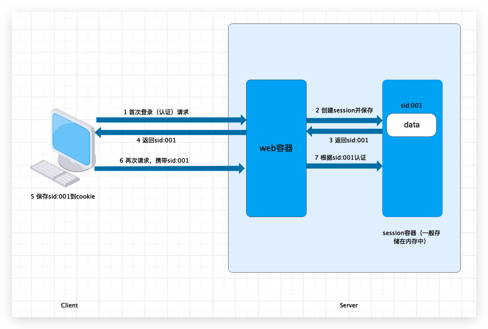

# 基于Session的认证

## 认证流程

用户认证成功后，在服务端生成用户相关的数据保存在 session（当前会话）中，发给客户端的 sesssion_id 存放到 cookie 中，这样用户客户端请求时带上 session_id 就可以验证服务器端是否存在 session 数据，以此完成用户的合法校验，当用户退出系统或 session 过期销毁时，客户端的 session_id 也就无效了。



基于 Session 的认证机制由 Servlet 规范定制，Servlet 容器已实现，用户通过操作 HttpSession 的方法即可实现，如下是HttpSession 相关的操作API。 

```java
HttpSession getSession(Boolean create);// 获取当前HttpSession对象

void setAttribute(String name,Object value);// 向session中存放对象

object getAttribute(String name);// 从session中获取对象

void removeAttribute(String name);// 移除session中对象

void invalidate();// 使HttpSession失效

// ......
```


