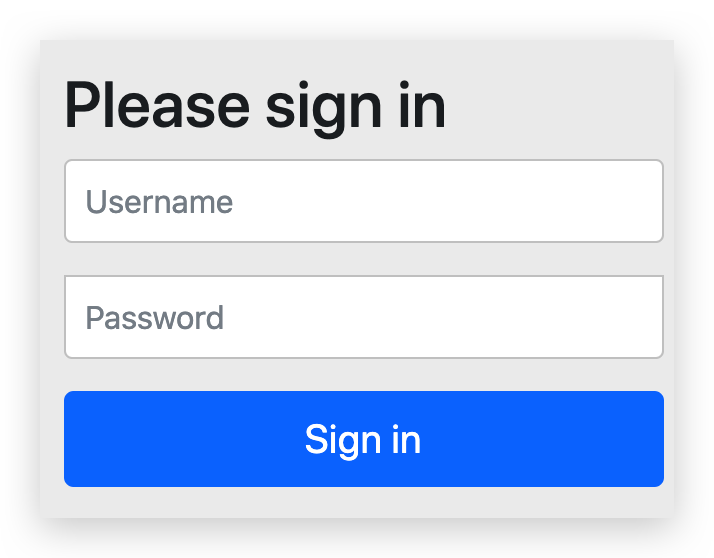

# Spring Boot Security

## 起步—无配置

### Maven 依赖

勾选 Web 和 Security

```xml
<dependency>
    <groupId>org.springframework.boot</groupId>
    <artifactId>spring-boot-starter-security</artifactId>
</dependency>
```

security starter 其实是包含了 security 的 config 和 web。其他依赖见代码。


### 测试 Controller

```java
package top.conanan.security.controller;

import org.springframework.web.bind.annotation.GetMapping;
import org.springframework.web.bind.annotation.RequestMapping;
import org.springframework.web.bind.annotation.RestController;

@RestController
@RequestMapping("/test")
public class TestController {

    @GetMapping("/hello")
    public String hello(){
        return "hello spring security";
    }
}
```


### 启动

其他什么都不需要，此时启动，会发现控制台打印了一段话：

```
Using generated security password: c4386a00-8fe2-43ff-8933-bd124cfe3acc
```

此时访问`/`或其他任意存在不存在的**路径都会**被 Security 拦截并**302 重定向**到`/login`页面，该页面是使用 CDN、Bootstrap 等搭建的登录页面：



其实上述控制台输出即是 Spring Security 自动生成的 user 的 UUID 密码，使用账号 user 登录即可。登录完毕后即可访问 URL

在 Spring Security 中，默认的登录页面和登录接口，都是 `/login` ，只不过一个是 GET 请求（登录页面），另一个是 POST 请求（登录接口）。


这个是自动配置包中 org.springframework.boot.autoconfigure.security.servlet.UserDetailsServiceAutoConfiguration 类配置好的

```java
private String getOrDeducePassword(User user, PasswordEncoder encoder) {
    String password = user.getPassword();
    if (user.isPasswordGenerated()) {
        logger.info(String.format("%n%nUsing generated security password: %s%n", user.getPassword()));
    }

    return encoder == null && !PASSWORD_ALGORITHM_PATTERN.matcher(password).matches() ? "{noop}" + password : password;
}
```

通过`user.getPassword()`进去发现是`SecurityProperties`配置类

```java
@ConfigurationProperties(
    prefix = "spring.security"
)
public class SecurityProperties {
    // ...
}
```

其维护了一个内部类

```java
public static class User {
    private String name = "user";
    private String password = UUID.randomUUID().toString();
    private List<String> roles = new ArrayList();
    private boolean passwordGenerated = true;
    // ...
}
```

由此可以得这个密码是 UUID。


## 起步—配置文件

有上面配置了 @ConfigurationProperties 的 SecurityProperties 类可得，用户名和密码可以配置在配置文件中，防止每次重启后改变。修改 application.yml：

```yml
# spring security
spring:
  security:
    user:
      name: conanan
      password: w111111
```

并且这里的 @ConfigurationProperties 配置类不仅仅是只注入配置文件中的值，它还是**使用 set 方式注入**的（覆盖了显示初始化），且带有逻辑。之后的配置中也可以使用这种方式！

```java
public void setPassword(String password) {
    if (StringUtils.hasLength(password)) {
        // 置为 false 后控制台不会再打印了
        this.passwordGenerated = false;
        this.password = password;
    }
}
```

此后就可以使用用户名 conanan，密码 w111111 来登录了


## 起步—配置类 🔥

### 安全配置类

```java
@EnableWebSecurity
public class SecurityConfig extends WebSecurityConfigurerAdapter {
    
    /**
     * 拦截及配置
     */
    @Override
    protected void configure(HttpSecurity http) throws Exception {
        http.authorizeRequests() // 配置需要授权的请求
                .anyRequest().authenticated() // 所有请求都需要认证（静态资源需手动释放，下面的配置）
                .and()
                .formLogin()
                .loginPage("/login.html") // 自定义表单登录页面
                .permitAll() // and 上面这些无需认证
                .and()
                .csrf().disable() // 先把 csrf 关闭（后续讲解后再开启）
        ;
    }
    
    
    /**
     * 释放静态资源
     */
    @Override
    public void configure(WebSecurity web) throws Exception {
        web.ignoring().antMatchers("/js/**", "/css/**","/images/**");
    }


    /**
     * 配置用户信息服务（这里就是查询的用户信息，可自定义其他非内存方法）
     * Spring Security 会使用它来获取用户信息。暂时使用InMemoryUserDetailsManager实现类，并在其中分别创建了zhangsan、lisi两个用户，并设置密码和权限。
     */
    @Bean
    public UserDetailsService userDetailsService() {
        // 这里的用户名密码可以理解为数据库或其他地方存储的
        InMemoryUserDetailsManager manager = new InMemoryUserDetailsManager();
        manager.createUser(User.withUsername("conanan").password("w111111").authorities("p1", "p2").build());
        manager.createUser(User.withUsername("zhangsan").password("123").authorities("p1").build());
        manager.createUser(User.withUsername("lisi").password("456").authorities("p2").build());
        return manager;
    }
    
    // 也可以这样配置，如果需要配置多个用户用 and 相连。相当于就是 XML 标签的结束符
    // 但还是使用官方文档写的上述方式
    /*@Override
    protected void configure(AuthenticationManagerBuilder auth) throws Exception {
        auth.inMemoryAuthentication()
                .withUser("conanan")
                .password("w111111")
                .roles("r1")
                .authorities("p1","p2");
    }*/

    
    /**
     * 密码加密方式（此处使用不加密的）,Spring Security 会根据此配置来决定密码是否编码
     */
    @Bean
    public PasswordEncoder passwordEncoder() {
        return NoOpPasswordEncoder.getInstance();
    }

}
```


### 自定义登录页

在项目的如下目录放入写好的登录页面


Login.html 页面的 action 一定要是 `login.html`，且为`POST`**表单请求**（可别改为 Ajax），截取片段如下：

```html
<form class="form" id="form" action="/login.html" method="post">
    <h2>登录</h2>
    <div class="form-control">
        <label for="username">用户名</label>
        <input type="text" id="username" name="username" placeholder="请输入用户名" />
        <small>错误提示</small>
    </div>
    <div class="form-control">
        <label for="password">密码</label>
        <input type="password" id="password" name="password" placeholder="请输入密码" />
        <small>错误提示</small>
    </div>
    <button>提交</button>
</form>
```

此时任意访问`/`或其他路径，由于除了登录页面都被 Spring Security 拦截了，所以当发现未认证时直接重定向到`login.html`。只需输入用户名和密码即可登录成功，且会重定向到之前被拦截的页面。

在 Spring Security 中，如果我们不做任何配置，默认的登录页面和登录接口的地址都是 `/login`，也就是说，默认会存在如下两个请求：

-   GET http://localhost:8080/login
-   POST http://localhost:8080/login

当我们配置了 loginPage 为 `/login.html` 之后，这个配置从字面上理解，就是设置登录页面的地址为 `/login.html`。实际上它还有一个隐藏的操作，就是登录接口地址也设置成 `/login.html` 了。换句话说，新的登录页面和登录接口地址都是 `/login.html`，现在存在如下两个请求：

-   GET http://localhost:8080/login.html
-   POST http://localhost:8080/login.html

前面的 GET 请求用来获取登录页面，后面的 POST 请求用来提交登录数据。

若是需要自定义登录接口，则可以指定`loginProcessingUrl`配置即可

```java
.formLogin()
.loginPage("/login.html")
.loginProcessingUrl("/login")
.permitAll()
```

此时将`login.html`中 action 也修改为`/login`即可

formLogin 的配置都在 FormLoginConfigurer 类中，它继承了 AbstractAuthenticationFilterConfigurer 抽象类，该抽象类的构造方法：

```java
protected AbstractAuthenticationFilterConfigurer() {
    setLoginPage("/login");
}
```

当 FormLoginConfigurer 初始化时，该抽象类也会初始化，所以默认情况下 loginPage 为`login`。

FormLoginConfigurer 的 init 方法中也调用了父类的 init 方法

```java
@Override
public void init(H http) throws Exception {
   super.init(http);
   initDefaultLoginFilter(http);
}
```

父类的 init 中又调用了 updateAuthenticationDefaults 方法：

```java
protected final void updateAuthenticationDefaults() {
    if (loginProcessingUrl == null) {
        loginProcessingUrl(loginPage);
    }
    if (failureHandler == null) {
        failureUrl(loginPage + "?error");
    }

    final LogoutConfigurer<B> logoutConfigurer = getBuilder().getConfigurer(
        LogoutConfigurer.class);
    if (logoutConfigurer != null && !logoutConfigurer.isCustomLogoutSuccess()) {
        logoutConfigurer.logoutSuccessUrl(loginPage + "?logout");
    }
}
```

即没有配置 loginProcessingUrl 时会将其设置为 loginPage，failureHandler 也是类似


### 登录参数

上述登录表单中的参数是 username 和 password，也不用写 JS，也不用写 Java 即可完成登录及参数封装。

查看 FormLoginConfigurer 类中的构造：

```java
public FormLoginConfigurer() {
    super(new UsernamePasswordAuthenticationFilter(), null);
    usernameParameter("username");
    passwordParameter("password");
}
```


### 配置

只是用于`/`映射到`/login`，但是此处的`/login`是 Spring Security 提供的，所以必须使用 redirect 重定向到。当然也可以在 Controller 中直接指定，无需在此配置类中声明。

```java
/**
 * 相当于 SpringMVC 的配置
 * <p>
 * 我们有多种方法来配置DispatcherServlet，与之类似，启用Spring MVC组件的方法也不只一种。
 * 从前，Spring是使用XML进行配置的，可以使用<mvc:annotation-driven>启用注解驱动的Spring MVC。
 */
@Configuration
public class WebConfig implements WebMvcConfigurer {

    /* 视图解析器不需要了，直接在 application 配置文件中配置即可 */

    /**
     * 配置视图控制器
     *
     * @param registry
     */
    @Override
    public void addViewControllers(ViewControllerRegistry registry) {
        // /login 是跳转到 spring security 提供的登录页面，而不是自己的（若不写成 redirect 则无法访问到，虽然其他的请求都可以拦截到登录页面，但是这个不行！必须写 redirect）
        registry.addViewController("/").setViewName("redirect:/login");
    }

}
```


## 安全配置 🔥

### WebSecurityConfig

```java
@EnableWebSecurity
public class WebSecurityConfig extends WebSecurityConfigurerAdapter {


    /**
     * 配置用户信息服务（这里就是查询的用户信息，可自定义其他非内存方法）
     * Spring Security会使用它来获取用户信息。暂时使用InMemoryUserDetailsManager实现类，并在其中分别创建了zhangsan、lisi两个用户，并设置密码和权限。
     *
     * @return
     */
    @Bean
    public UserDetailsService userDetailsService() {
        // 这里的用户名密码可以理解为数据库或其他地方存储的
        InMemoryUserDetailsManager manager = new InMemoryUserDetailsManager();
        manager.createUser(User.withUsername("zhangsan").password("123").authorities("p1").build());
        manager.createUser(User.withUsername("lisi").password("456").authorities("p2").build());
        return manager;
    }

    /**
     * 密码加密方式（此处使用不加密的）
     *
     * @return
     */
    @Bean
    public PasswordEncoder passwordEncoder() {
        // Spring Security 会根据此配置来决定密码是否编码
        return NoOpPasswordEncoder.getInstance();
    }


    /**
     * 拦截机制
     * @param http
     * @throws Exception
     */
    @Override
    protected void configure(HttpSecurity http) throws Exception {
        http.authorizeRequests()
            // ant 风格的路径
            .antMatchers("/r/r1").hasAuthority("p1")
            .antMatchers("/r/r2").hasAuthority("p2")
            .antMatchers("/r/**").authenticated()// url匹配/r/**的资源，经过认证后才能访问
            .anyRequest().permitAll()// 其他url完全开放
            .and()
            // 支持form表单认证，认证成功后转向/login-success（此处controller必须使用post请求）
            .formLogin().successForwardUrl("/login-success");
    }

}
```

不再需要 Spring Security 初始化配置，以上配置已经可以使用了


## 认证、会话、授权

同 Spring Security


## 测试资源

```java
@RestController
@RequestMapping
public class LoginController {


    /**
     * 登录成功后重定向的url
     *
     * @return
     */
    @PostMapping(value = "/login-success", produces = {"text/plain;charset=utf-8"})
    public String loginSuccess() {
        return "登录成功 login-success";
    }


    /**
     * 访问资源r1
     *
     * @param session
     * @return
     */
    @GetMapping(value = "/r/r1", produces = "text/plain;charset=utf-8")
    public String accessR1(HttpSession session) {
        return "访问资源r1";
    }

    /**
     * 访问资源r2
     *
     * @param session
     * @return
     */
    @GetMapping(value = "/r/r2", produces = "text/plain;charset=utf-8")
    public String accessR2(HttpSession session) {
        return "访问资源r2";
    }
}
```

若是没有权限的用户访问，则返回 403（无权限，拒绝访问）