# 原理

## 简介

Spring Security 所解决的问题就是**安全访问控制**，而安全访问控制功能其实就是**对所有进入系统的请求进行拦截**，校验每个请求是否能够访问它所期望的资源。根据前边知识的学习，可以通过 Filter 或 Interceptor 或 其他 AOP 技术来实现。

Spring Security 对 Web 资源的保护是靠 **Filter** 实现的，所以从这个 Filter 来入手，逐步深入 Spring Security 原理。 


## 结构总览

Spring Boot 自动配置部分流程：

### springSecurityFilterChain 🔥

启用 Spring Security 的默认配置，该配置将创建一个名为 `springSecurityFilterChain` 的 Servlet Filter bean，类型为 `org.springframework.security.web.FilterChainProxy`，它实现了`javax.servlet.Filter`，因此外部的请求会经过此类。

此 bean 负责应用程序内的所有安全性（验证提交的用户名和密码，重定向到登录表单等，保护应用程序 URL 等）。下图是 Spring Security 过滤器链结构图：

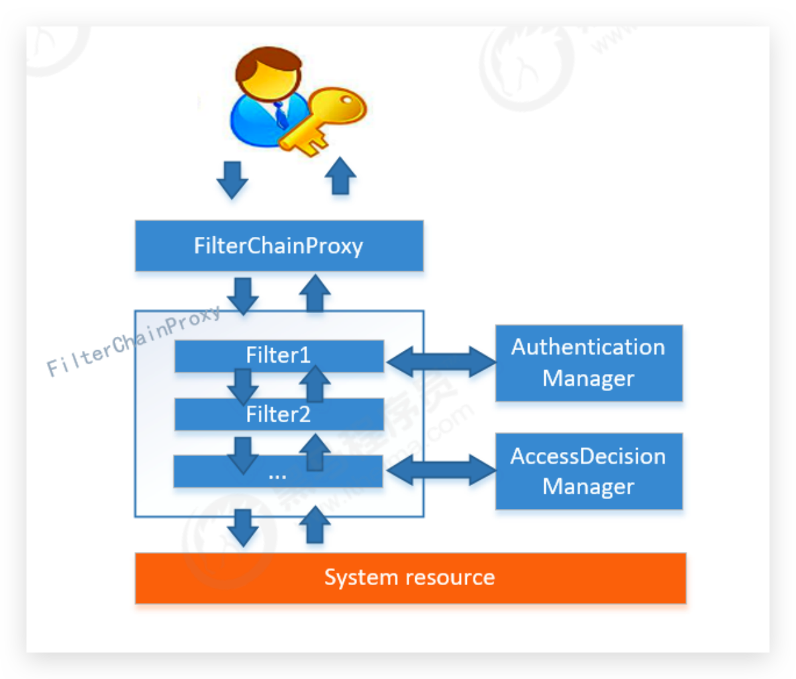

FilterChainProxy 是一个代理，真正起作用的是 FilterChainProxy 中 SecurityFilterChain 所**包含的各个 Filter**，同时这些 Filter 作为 Bean 被 Spring 管理，它们是Spring Security核心，各有各的职责，但他们并**不直接处理**用户的**认证**，也**不直接处理**用户的**授权**，而是把它们交给了认证管理器（**AuthenticationManager**）和决策管理器（**AccessDecisionManager**）进行处理，下图是 FilterChainProxy 相关类的UML图示： 

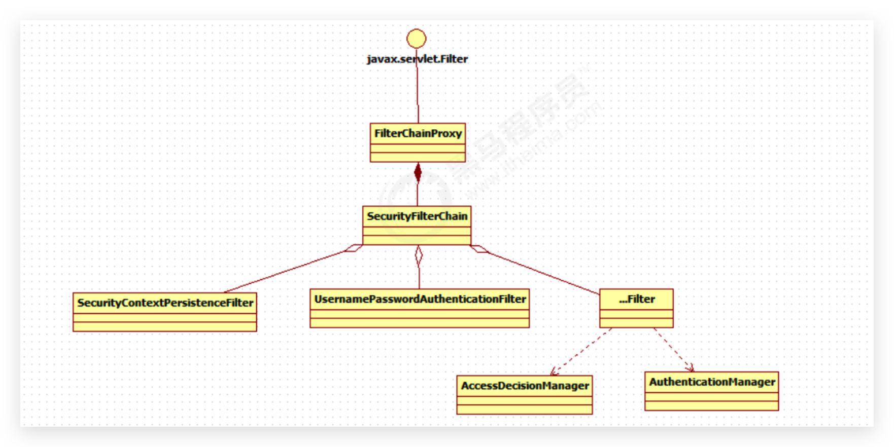

Spring Security 功能的实现主要是由一系列过滤器链相互配合完成。

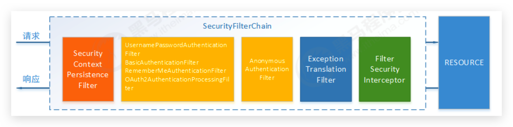

下面介绍过滤器链中主要的几个过滤器及其作用：

 

### SecurityContextPersistenceFilter

这个 Filter 是整个拦截过程的入口和出口（也就是第一个和最后一个拦截器），会在请求开始时从配置好的 SecurityContextRepository 中获取 SecurityContext，然后把它设置给 SecurityContextHolder。在请求完成后将 SecurityContextHolder 持有的 SecurityContext 再保存到配置好的 SecurityContextRepository，同时清除 securityContextHolder 所持有的 SecurityContext； 


### UsernamePasswordAuthenticationFilter 🔥

用于处理来自表单提交的**认证**。该表单必须提供对应的用户名和密码，其内部还有登录成功或失败后进行处理的 **AuthenticationSuccessHandler** 和 **AuthenticationFailureHandler**，这些都可以根据需求做相关改变； 


### FilterSecurityInterceptor

用于保护 Web 资源的，使用 AccessDecisionManager 对**当前用户进行授权访问**，前面已经详细介绍过了； 


### ExceptionTranslationFilter

能够捕获来自 FilterChain 所有的**异常**，并进行处理。但是它只会处理两类异常：**AuthenticationException** 和 **AccessDeniedException**（对应上述两个 Manager），其它的异常它会继续抛出。 


## 认证流程 🔥

### 流程图

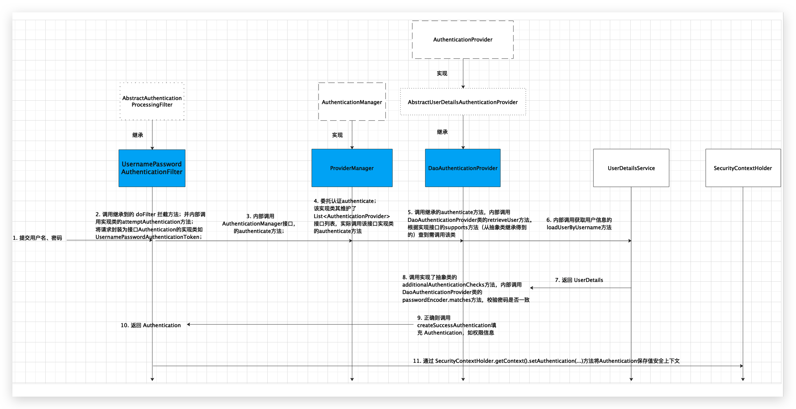

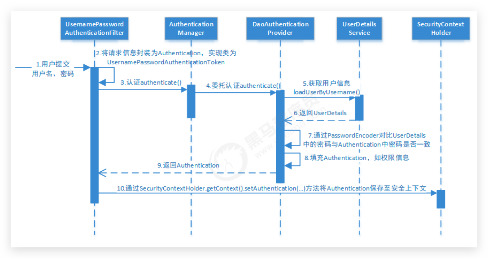

1.  用户提交用户名、密码被 SecurityFilterChain 中的 **UsernamePasswordAuthenticationFilter** 过滤器获取到， 封装为请求Authentication，通常情况下是 UsernamePasswordAuthenticationToken 这个实现类。 
2.  然后过滤器将 Authentication 提交至认证管理器（AuthenticationManager）进行认证 
3.  认证成功后， AuthenticationManager 身份管理器返回一个被填充满了信息的（包括上面提到的权限信息，身份信息，细节信息，但密码通常会被移除。这个一般是查询数据库得出的） Authentication 实例。 
4.  SecurityContextHolder 安全上下文容器将第 3 步填充了信息的 Authentication ，通过 SecurityContextHolder.getContext().setAuthentication(…) 方法，设置到其中。 

可以看出 AuthenticationManager 接口（认证管理器）是认证相关的核心接口，也是发起认证的出发点，它的实现类为 ProviderManager。而 Spring Security 支持多种认证方式，因此 ProviderManager 维护着一个 `List<AuthenticationProvider>` 列表，存放多种认证方式（**这才是最终干活的**），最终实际的认证工作是由 AuthenticationProvider 完成的。咱们知道 Web 表单的对应的 AuthenticationProvider 实现类为 **DaoAuthenticationProvider**，它的内部又维护着一个 **UserDetailsService** 负责 UserDetails 的获取。最终 AuthenticationProvider 将 UserDetails 填充至 Authentication。

认证核心组件的大体关系如下：

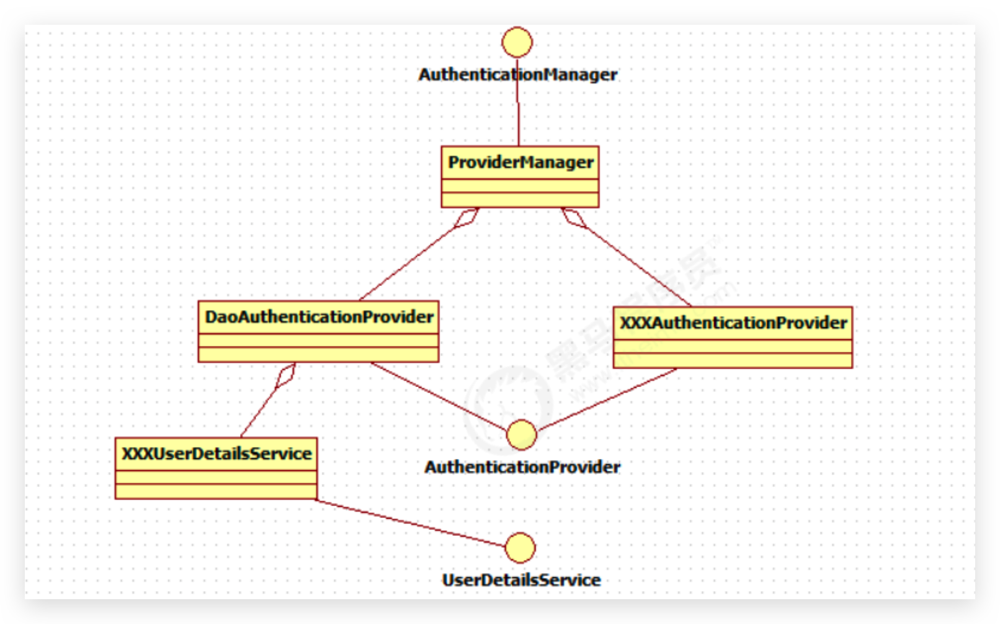


### Debug

1.  用户提交用户名、密码被 SecurityFilterChain 中的 **UsernamePasswordAuthenticationFilter** 过滤器获取到。找到该类，其继承了抽象 Filter 类 AbstractAuthenticationProcessingFilter，在其中的`doFilter`方法中可以看到：

    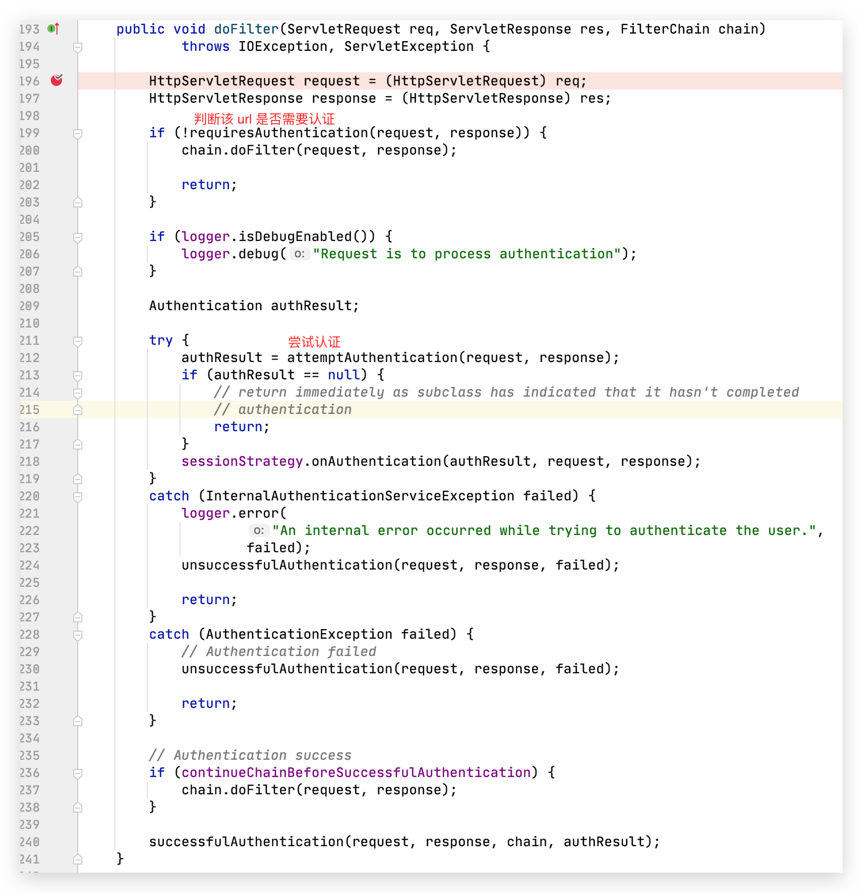

    在尝试认证方法中，其实是调用的`UsernamePasswordAuthenticationFilter`的方法

    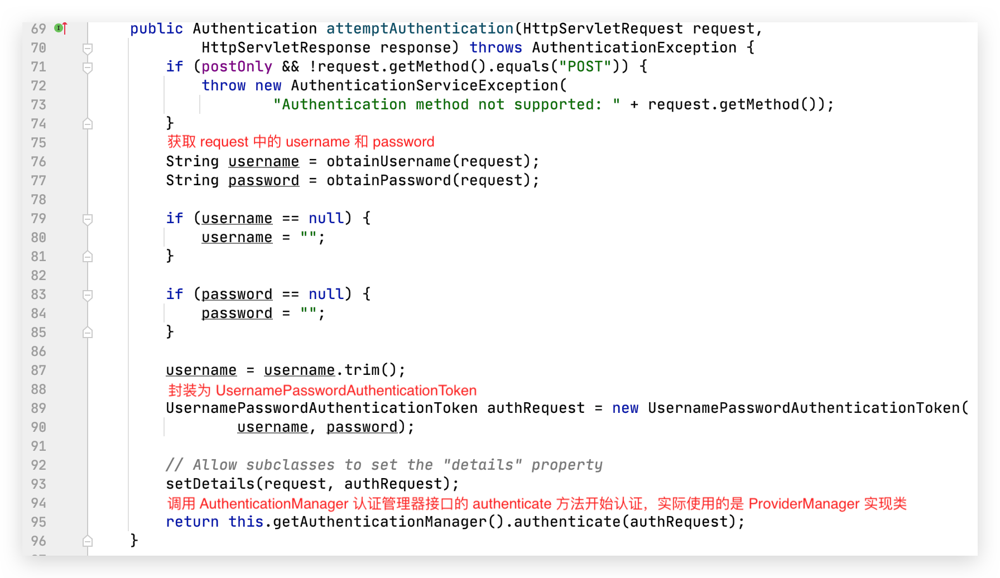认证方法，获取 `AuthenticationManager`，实现类为 `ProviderManager`，ProviderManager 提供了许多 `AuthenticationProvider`：

    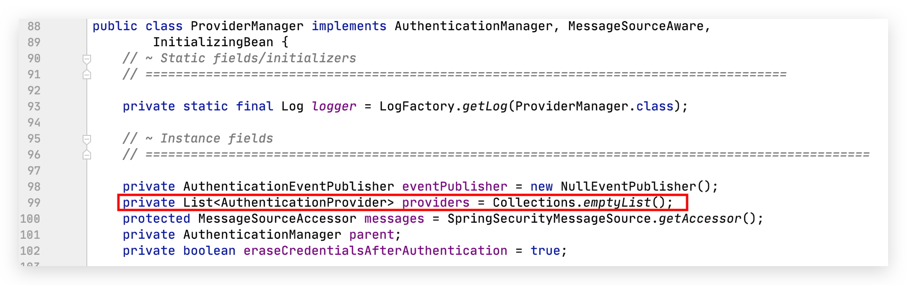

    【重点】抽象类`AbstractUserDetailsAuthenticationProvider`实现了`AuthenticationProvider`， `DaoAuthenticationProvider`又继承了该抽象类，DaoAuthenticationProvider 中又维护了一个 `UserDetailsService`，查询出 username 对应的用户

    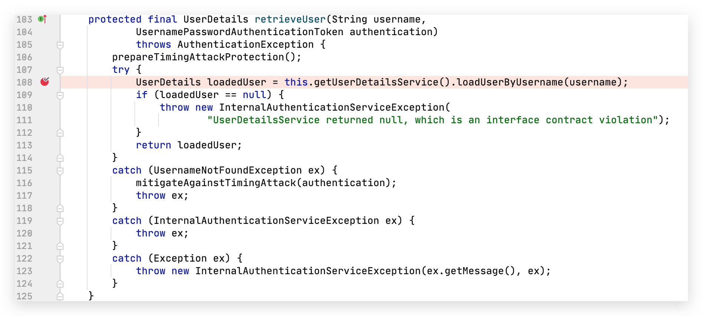

    使用`DaoAuthenticationProvider`的如下方法判断密码正确性

    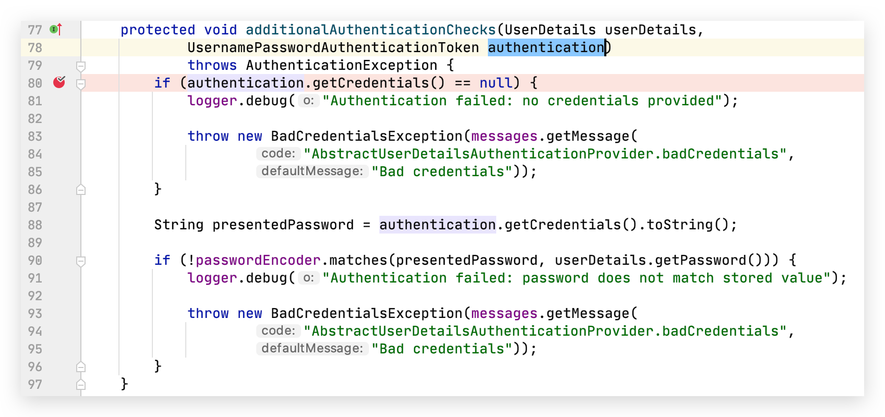


### AuthenticationManager 接口 🔥


### ProviderManager 类 🔥


### AuthenticationProvider 接口🔥

通过前面的 Spring Security 认证流程我们得知，**认证管理器（AuthenticationManager）委托 AuthenticationProvider**（间接通过 ProviderManager） 完成认证工作。AuthenticationProvider 是一个接口，定义如下：

```java
public interface AuthenticationProvider {

    Authentication authenticate(Authentication authentication)
			throws AuthenticationException;
    
    boolean supports(Class<?> authentication);
}
```

`authenticate()`方法定义了**认证的实现过程**，它的参数是一个 Authentication，里面包含了登录用户所提交的用户、密码等。而返回值也是一个 Authentication，这个 Authentication 则是在认证成功后，将用户的权限及其他信息重新组装后生成。

Spring Security 中维护着一个 `List<AuthenticationProvider>` 列表，存放多种认证方式，不同的认证方式使用不同的 AuthenticationProvider。如使用用户名密码登录时，使用 AuthenticationProvider1，短信登录时使用 AuthenticationProvider2 等等这样的例子很多。

每个 AuthenticationProvider 需要实现`supports()`方法来**表明自己支持的认证方式**，如我们使用表单方式认证，在提交请求时 Spring Security 会生成 UsernamePasswordAuthenticationToken，它是一个 Authentication，里面封装着用户提交的用户名、密码信息。而对应的，哪个 AuthenticationProvider 来处理它？ 


### AbstractUserDetailsAuthenticationProvider 抽象类

我们在**DaoAuthenticationProvider**的基类 **AbstractUserDetailsAuthenticationProvider** 发现以下代码： 

```java
public boolean supports(Class<?> authentication) {
    return (UsernamePasswordAuthenticationToken.class
            .isAssignableFrom(authentication));
}
```


### DaoAuthenticationProvider 类 🔥

也就是说当 Web 表单提交用户名密码时，Spring Security 由 **DaoAuthenticationProvider**处理。


### Authentication 接口

认证信息接口，之前提到的 UsernamePasswordAuthenticationToken 就是它的实现之一

```java
public interface Authentication extends Principal, Serializable {

    Collection<? extends GrantedAuthority> getAuthorities();

    Object getCredentials();

    Object getDetails();

    Object getPrincipal();

    boolean isAuthenticated();

    void setAuthenticated(boolean var1) throws IllegalArgumentException;
}
```

*   `Authentication` 是 Spring Security 包中的接口，直接继承自 **Principal**（主要，主体） 类，而 Principal 是位于 java.security 包中的。它是表示着一个抽象主体身份，任何主体都有一个名称，因此包含一个`getName()`方法。 
*   `getAuthorities()`，权限信息列表，默认是 GrantedAuthority 接口的一些实现类，通常是代表权限信息的一系列字符串。 
*   `getCredentials()`，凭证信息，用户输入的密码字符串，在认证过后通常会被移除，用于保障安全。 
*   `getDetails()`，细节信息，Web 应用中的实现接口通常为 WebAuthenticationDetails，它记录了访问者的 IP 地址和SESSIONID 的值。
*   【重要】`getPrincipal()`，身份信息，大部分情况下返回的是 UserDetails 接口的实现类，UserDetails 代表用户的详细信息，那从 Authentication 中取出来的 UserDetails 就是当前登录用户信息，它也是框架中的常用接口之一。 


### UsernamePasswordAuthenticationToken 类

实现了 Authentication 接口


### UserDetailsService 接口（可自定义）🔥

现在咱们现在知道 DaoAuthenticationProvider 处理了 Web 表单的认证逻辑，认证成功后既得到一个 Authentication(UsernamePasswordAuthenticationToken实现 )，里面包含了身份（主体）信息（Principal）。这个身份信息就是一个 Object ，大多数情况下它可以被强转为 UserDetails 对象。 

DaoAuthenticationProvider 中包含了一个 UserDetailsService 实例，它负责根据用户名提取用户信息 UserDetails (包含密码)，而后 DaoAuthenticationProvider 会去对比 UserDetailsService 提取的用户密码与用户提交的密码是否匹配作为认证成功的关键依据，因此可以通过将自定义的 UserDetailsService 公开为 Spring Bean来自定义身份验证。 

```java
package top.conanan.security.service;

import org.springframework.security.core.userdetails.User;
import org.springframework.security.core.userdetails.UserDetails;
import org.springframework.security.core.userdetails.UserDetailsService;
import org.springframework.security.core.userdetails.UsernameNotFoundException;
import org.springframework.stereotype.Service;

/**
 * 自定义 UserDetailsService
 */
@Service
public class SpringDataUserDetailsService implements UserDetailsService {

    @Override
    public UserDetails loadUserByUsername(String username) throws UsernameNotFoundException {
        // 连接数据库，根据 username 查询用户
        System.out.println("username:"+ username);
        return User.withUsername("zhangsan").password("123").authorities("p1").build();
    }
}
```

很多人把 DaoAuthenticationProvider 和 UserDetailsService 的职责搞混淆，**其实 UserDetailsService 只负责从特定的地方（通常是数据库）加载用户信息**，仅此而已。而 DaoAuthenticationProvider 的职责更大，它**完成完整的认证流程**，同时会**把UserDetails 填充至 Authentication**。 


### UserDetails 接口（可自定义）🔥

Spring Security 提供的接口

```java
public interface UserDetails extends Serializable {
    Collection<? extends GrantedAuthority> getAuthorities();

    String getPassword();

    String getUsername();

    boolean isAccountNonExpired();

    boolean isAccountNonLocked();

    boolean isCredentialsNonExpired();

    boolean isEnabled();
}
```

它和 Authentication 接口很类似，比如他们都拥有 username，authorities。Authentication 的 getCredentials() 与 UserDetails 中的 getPassword() 需要被区分对待，前者是用户提交的密码凭证，后者是用户实际存储的密码，认证其实就是对这两者的比对。Authentication 中 的getAuthorities() 实际是由 UserDetails 的 getAuthorities() 传递而形成的。还记得 Authentication接口中的getDetails() 方法吗？其中的 UserDetails 用户详细信息便是经过了 AuthenticationProvider 认证之后被填充的。

通过实现UserDetailsService和UserDetails，我们可以完成对用户信息获取方式以及用户信息字段的扩展。Spring Security 提供的InMemoryUserDetailsManager（内存认证），JdbcUserDetailsManager（JDBC认证）就是 UserDetailsService的实现类，主要区别无非就是从内存还是从数据库加载用户。 


### User 类

实现了 UserDetails 接口


### PasswordEncoder 接口 🔥

DaoAuthenticationProvider 认证处理器通过 UserDetailsService 获取到 UserDetails 后，它是如何与请求 Authentication中的密码做对比呢？ 

在这里 Spring Security 为了适应多种多样的加密类型，又做了抽象，DaoAuthenticationProvider 通过 PasswordEncoder 接口的`matches()` 方法进行密码的对比，而具体的密码对比细节取决于实现：

```java
public interface PasswordEncoder {
    String encode(CharSequence var1);

    boolean matches(CharSequence var1, String var2);

    default boolean upgradeEncoding(String encodedPassword) {
        return false;
    }
}
```

密码比较流程如下： 

1.  用户输入密码（明文），称作 credentials 凭证
2.  DaoAuthenticationProvider 获取 UserDetails（其中存储了用户的正确密码，即 password）
3.  DaoAuthenticationProvider 使用 PasswordEncoder 接口的`matches`方法对输入的密码和正确的密码进行校验，密码一致则校验通过，否则校验失败

Spring Security 提供很多内置的 PasswordEncoder，能够开箱即用，使用某种PasswordEncoder只需要进行如下声明即可：

```java
@Bean
public PasswordEncoder passwordEncoder() {
    // Spring Security 会根据此配置来决定密码是否编码
    return NoOpPasswordEncoder.getInstance();
}
```

NoOpPasswordEncoder采用字符串匹配方法，不对密码进行加密比较处理，直接拿输入的密码和 UserDetails 中的正确密码进行字符串比较，字符串内容一致则校验通过，否则校验失败

实际项目中推荐使用 BCryptPasswordEncoder，Pbkdf2PasswordEncoder，SCryptPasswordEncoder 等。配置BCryptPasswordEncoder 如下：

```java
@Bean
public PasswordEncoder passwordEncoder(){
    return new BCryptPasswordEncoder();
}
```

测试发现认证失败，提示：Encoded password does not look like BCrypt。

测试BCrypt：

```java
@SpringBootTest
class SecurityApplicationTests {

    @Test
    void testBcrypt() {

        // 对密码加密
        String hashpw1 = BCrypt.hashpw("123", BCrypt.gensalt());
        String hashpw2 = BCrypt.hashpw("123", BCrypt.gensalt());

        System.out.println(hashpw1);// $2a$10$VD2tV49..qSgU6g3UA4rIeqVsXdEQuTigZ5aA2GH9ldkYj6kAL6Au
        System.out.println(hashpw2);// $2a$10$cxbggOZmwj66AQGN9pYXN.SYKpUeX4RMl4BY3Nm6Yn07sg7/8F.ge
        // 结果是两次都不一样（可能是每次获取的 salt 不一样），但是这样在校验时能一致吗？

        // 校验密码
        boolean checkpw1 = BCrypt.checkpw("123", hashpw1);
        boolean checkpw2 = BCrypt.checkpw("123", hashpw2);
        System.out.println(checkpw1 + "," + checkpw2);// true,true

    }

}
```

此时可以将自定义的 UserDetailsService 实现类中的密码改为加密后的来测试了，实际中也是在数据库中存储加密后的密码


## 授权流程 🔥

### 流程图

通过之前的 Spring Security 安全配置可以看出，Spring Security 通过`http.authorizeRequests()`对 Web 请求进行授权保护。Spring Security使用标准 Filter 建立了对 Web 请求的拦截，最终实现对资源的授权访问。其授权流程如下：

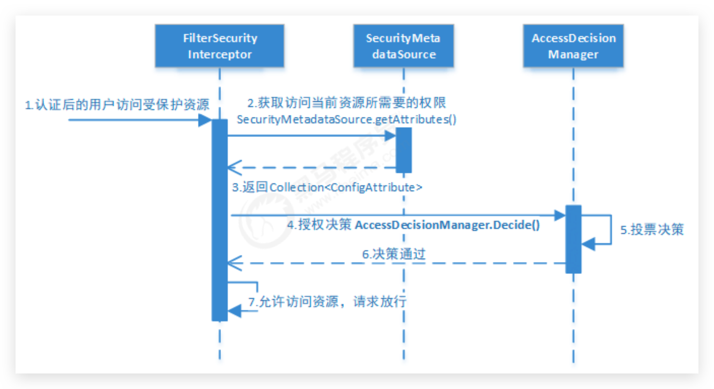

主要分为三步：

1.  **拦截请求**，已认证用户访问受保护的 Web 资源将被 SecurityFilterChain 中的 FilterSecurityInterceptor 的子类拦截。 

2.  **获取资源访问策略**，FilterSecurityInterceptor 会从 SecurityMetadataSource 的子类 DefaultFilterInvocationSecurityMetadataSource 获取要访问当前资源**所要求**的权限 `Collection<ConfigAttribute>` 。 

    SecurityMetadataSource 其实就是读取访问策略的抽象，而读取的内容就是我们配置的访问规则，如：

    ```java
    http.authorizeRequests()
        .antMatchers("/r/r1").hasAuthority("p1")
        .antMatchers("/r/r2").hasAuthority("p2") 
        // ...
    ```

3.  最后，FilterSecurityInterceptor 会调用 **AccessDecisionManager** 进行授权决策，若决策通过，则允许访问资源，否则将禁止访问。 


### AccessDecisionManager 访问决策管理器接口

```java
public interface AccessDecisionManager {
    
    /**
     * 用来鉴定当前用户是否有访问对应受保护资源的权限
     * 
     * authentication：要访问资源的访问者的身份
     * object：要访问的受保护资源，web请求对应FilterInvocation
     * configAttributes：是受保护资源的访问策略，通过SecurityMetadataSource获取
     */
    void decide(Authentication authentication, Object object,
			Collection<ConfigAttribute> configAttributes) throws AccessDeniedException,
			InsufficientAuthenticationException;
    
    boolean supports(ConfigAttribute attribute);
    boolean supports(Class<?> clazz);

}
```

AccessDecisionManager采用**投票**的方式来确定是否能够访问受保护资源。

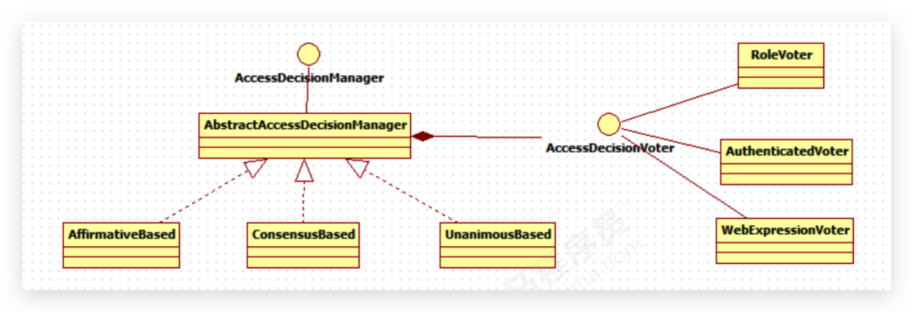

通过上图可以看出，AccessDecisionManager 中包含的一系列 AccessDecisionVoter 将会被用来对 Authentication 是否有权访问受保护对象进行投票，AccessDecisionManager 根据投票结果，做出最终决策。

AccessDecisionVoter是一个接口，其中定义有三个方法，具体结构如下所示。 

```java
public interface AccessDecisionVoter<S> {

	int ACCESS_GRANTED = 1; // 同意
	int ACCESS_ABSTAIN = 0; // 弃权
	int ACCESS_DENIED = -1; // 拒绝
    
    boolean supports(ConfigAttribute var1); 
    
    boolean supports(Class<?> var1); 
    
    int vote(Authentication var1, S var2, Collection<ConfigAttribute> var3);
    
}
```

`vote()`方法的返回结果会是 AccessDecisionVoter 中定义的三个常量之一。如果一个 AccessDecisionVoter 不能判定当前 Authentication 是否拥有访问对应受保护对象的权限，则其`vote()`方法的返回值应当为弃权 ACCESS_ABSTAIN。 

Spring Security内置了三个基于投票的 AccessDecisionManager 实现类如下，它们分别是 **AffirmativeBased**、**ConsensusBased** 和 **UnanimousBased**。

AffirmativeBased（Spring Security 默认使用）的逻辑：

*   只要有 AccessDecisionVoter 的投票为 ACCESS_GRANTED 则同意用户进行访问
*   如果全部弃权也表示通过
*   如果没有一个人投赞成票，但是有人投反对票，则将抛出 AccessDeniedException

ConsensusBased 的逻辑：

*   如果赞成票多于反对票则表示通过
*   反过来，如果反对票多于赞成票则将抛出 AccessDeniedException
*   如果赞成票与反对票相同且不等于0，并且属性 allowIfEqualGrantedDeniedDecisions的值为 true，则表示通过，否则将抛出异常 AccessDeniedException。参数 allowIfEqualGrantedDeniedDecisions 的值默认为 true
*   如果所有的 AccessDecisionVoter 都弃权了，则将视参数 allowIfAllAbstainDecisions 的值而定，如果该值为 true 则表示通过，否则将抛出异常 AccessDeniedException。参数 allowIfAllAbstainDecisions 的值默认为 false

UnanimousBased 的逻辑与另外两种实现有点不一样，另外两种会一次性把受保护对象的配置属性全部传递给AccessDecisionVoter 进行投票，而 UnanimousBased 会一次只传递一个 ConfigAttribute 给 AccessDecisionVoter 进行投票。这也就意味着如果我们的 AccessDecisionVoter 的逻辑是只要传递进来的 ConfigAttribute 中有一个能够匹配则投赞成票，但是放到UnanimousBased 中其投票结果就不一定是赞成了。UnanimousBased 的逻辑具体来说是这样的：

*   如果受保护对象配置的某一个 ConfigAttribute 被任意的 AccessDecisionVoter 反对了，则将抛出 AccessDeniedException
*   如果没有反对票，但是有赞成票，则表示通过
*   如果全部弃权了，则将视参数 allowIfAllAbstainDecisions 的值而定，true 则通过，false 则抛出 AccessDeniedException

Spring Security也内置一些投票者实现类如**RoleVoter**、**AuthenticatedVoter**和**WebExpressionVoter**等，可以自行查阅资料进行学习。

