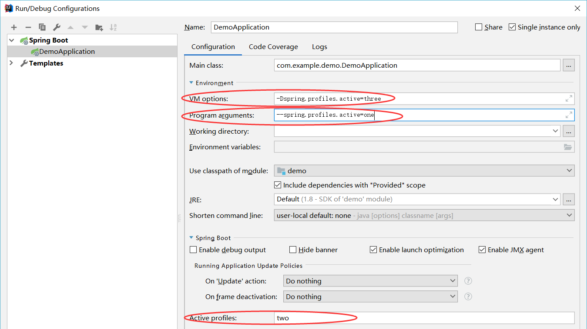

# 1 配置

SpringBoot是基于约定的，所以很多配置都有默认值，但如果想使用自己的配置替换默认配置的话就可以使用配置文件配置，SpringBoot默认会从Resources目录下加载`application*.properties`或`application*.yml`（`application*.yaml`）文件

此处不再介绍properties配置文件（键值对形式），仅介绍yml配置文件

## 1.1 YAML 简介

YML文件格式是YAML (YAML Aint Markup Language)编写的文件格式，YAML是一种直观的能够被电脑识别的的数据数据序列化格式，并且容易被人类阅读，容易和脚本语言交互的，可以被支持YAML库的不同的编程语言程序导入，比如： C/C++, Ruby, Python, Java, Perl, C#, PHP等。YML文件是**以数据为核心**的，比传统的xml方式更加简洁。

YML文件的扩展名可以使用.yml或者.yaml。

## 1.2 YAML 语法

基本语法：

- **`k:(空格)v`**：表示一对键值对（空格必须有）
- 以**空格**的**缩进**来控制层级关系；只要是左对齐（相同空格缩进）的一列数据，都是同一个层级的；属性和值也是**大小写敏感**


### 配置字面量数据

普通的值（**数字，字符串，布尔**）

- `k: v`：字面量**直接来写**；**字符串默认不用加上单引号或者双引号**；
    - `""`：**双引号**；**不会转义**字符串里面的特殊字符；特殊字符会作为本身想表示的意思
        - name: "zhangsan \n lisi"：输出；zhangsan 换行 lisi
    - `''`：**单引号**；**会转义**特殊字符，特殊字符最终只是一个普通的字符串数据
        - name: ‘zhangsan \n lisi’：输出；zhangsan \n lisi

```yml
name: zhangsan
```


### 配置对象、Map数据

```yml
teacher:
  name: zhangsan
  age: 38

student: {name: lisi , age: 18}

```


### 配置数组（List、Set）数据

```yaml
city:
  - beijing
  - shanghai

province: [shangxi,hebei,guangdong]

```

```yaml
#元素是对象形式
dog:
  - name: wangcai
    age: 3
  - name: goudan
    age: 5

cat: [{name: xiaobai,age: 1},{name: xiaolv,age: 2}]

```

【注意】：value与之间的 - 之间存在一个**空格**


## 1.3 配置文件值注入

### @Value

利用在4.2中语法所写的配置

```java
@RestController
public class HelloController {

    @Value("${dog[0].name}")//数组或集合中保存对象
    private String name;

    @RequestMapping("/hello")
    public String hello(){
        return "hello spring boot "+name;
    }
}

```


### @ConfigurationProperties

通过注解`@ConfigurationProperties(prefix="配置文件中的key的前缀")`可以将配置文件中的配置自动与实体进行映射

利用在4.2中语法所写的配置。需要提供setter。但是配置的数组、List、Set不清楚怎么获取

```java
@Component
@RestController
@ConfigurationProperties(prefix = "teacher")
public class HelloController {

    private String name;

    public String getName() {
        return name;
    }

    public void setName(String name) {
        this.name = name;
    }

    @RequestMapping("/hello")
    public String hello(){
        return "hello spring boot "+name;
    }
}

```

`@ConfigurationProperties`报错Not registered via @EnableConfigurationProperties or marked as Spring component，添加了`@Component`注解后解决了

若出现以下提示，需要配置文件执行器，并在类中定义好属性和set方法后，如果在配置文件中编写配置会有提示！


```xml
<!--配置文件执行器配置-->
<dependency>
    <groupId>org.springframework.boot</groupId>
    <artifactId>spring-boot-configuration-processor</artifactId>
    <optional>true</optional>
</dependency>

```


**@Value 和 @ConfigurationProperties比较**

|                      | @ConfigurationProperties | @Value     |
| -------------------- | ------------------------ | ---------- |
| 功能                 | 批量注入配置文件中的属性 | 一个个指定 |
| 松散绑定（松散语法） | 支持                     | 不支持     |
| SpEL                 | 不支持                   | 支持       |
| JSR303数据校验       | 支持                     | 不支持     |
| 复杂类型封装         | 支持                     | 不支持     |

- **松散语法绑定**：last_name = last-name = lastName 他们取的值都是相同的
- 配置文件yml还是properties他们都能获取到值，怎么选择呢？
    - 若我们只是在某个业务逻辑中需要**获取**一下**配置文件**中的**某项值**，使用@Value；
    - 若我们专门编写了一个javaBean来和配置文件**映射**，我们就直接使用@ConfigurationProperties


### @PropertySource

- @**PropertySource**：加载**指定的配置文件**，由于@ConfigurationProperties(prefix = "person")默认从全局配置文件中获取值；

    ```java
    /**
     * 将配置文件中配置的每一个属性的值，映射到这个组件中
     * @ConfigurationProperties：告诉SpringBoot将本类中的所有属性和配置文件中相关的配置进行绑定；
     *      prefix = "person"：配置文件中哪个下面的所有属性进行一一映射
     *
     * 只有这个组件是容器中的组件，才能容器提供的@ConfigurationProperties功能；
     */
    @PropertySource(value = {"classpath:person.properties"})
    @Component
    @ConfigurationProperties(prefix = "person")
    public class Person {
    
        private String lastName;
        private Integer age;
        private Boolean boss;
    
    ```

    

### @Configuration 和 @Bean

- @ImportResource：**导入Spring的配置文件**，如beans.xml，加载bean，让配置文件里面的内容生效

    - Spring Boot里面没有Spring的配置文件，我们自己编写的配置文件，也不能自动识别；

        想让Spring的配置文件生效，加载进来；@ImportResource标注在一个配置类上

    ```xml
    <bean id="helloService" class="com.cuzz.springboot.service.HelloService"></bean>
    
    ```

    ```java
    @ImportResource(locations = {"classpath:beans.xml"})
    @SpringBootApplication
    public class SpringbootApplication {
    
    	public static void main(String[] args) {
    		SpringApplication.run(SpringbootApplication.class, args);
    	}
    }
    
    ```

- 还是**写配置类吧**！利用@Configuration和@Bean

    ```java
    @Configuration
    public class MyAppConfig {
        // 将方法的返回值添加到容器中；容器中这个组件默认的id就是方法名
        @Bean
        public HelloService helloService02(){
            System.out.println("配置类@Bean给容器中添加组件了...");
            return new HelloService();
        }
    }
    
    ```

    

## 1.4 配置文件占位符

- 随机数

    ```yaml
    ${random.value}
    ${random.int}
    ${random.long}
    ${random.int(10)}
    ${random.int[1024,65536]}
    ```

- **占位符获取之前配置的值**，如果没有可以使用**:**指定**默认值**

    ```properties
    person.last-name=张三${random.uuid}
    person.age=${random.int}
    # 没有取到:后面是默认值
    person.dog.name=${person.hello:hello}_dog
    ```


## 1.5 Profile

Profile是Spring对**不同环境（开发、测试、上线等）提供不同配置功能**的支持，可以通过激活、 指定参数等方式快速切换环境

### 多Profile文件

- 我们在主配置文件编写的时候，文件名可以是 application-{profile}.properties/yml，{profile}名任起
    - 默认使用application.properties的配置；

### yml支持多文档块方式

```yaml
server:
  port: 8081
spring:
  profiles:
    active: pro  #指定激活哪个环境，不设置则为这个默认的

---
server:
  port: 8083
spring:
  profiles: dev  #指定属于哪个环境

---

server:
  port: 8084
spring:
  profiles: pro  #指定属于哪个环境

```

- 若文档块都没有指定环境，则**默认使用最后一个**
- 若**某个文档块没有指定环境，则默认使用那个**，**一般第一个不指定环境**

### 激活指定profile

- 在**默认配置文件中指定** spring.profiles.**active**=dev

- **命令行参数**

    ```shell
    java -jar spring-boot-02-config-0.0.1-SNAPSHOT.jar --spring.profiles.active=dev
    ```

- **虚拟机参数**

    ```
    -Dspring.profiles.active=dev
    ```

在IDEA中也可以配置，以下三者任选其一，但权限 Program arguments > Active profiles > VM options




## 1.6 配置文件加载位置及顺序

> 起步依赖里好像不是这样？？？

- Spring Boot启动会扫描以下位置的application.properties/yml文件作为Spring boot的默认配置文件

    - –file:./config/     ——项目目录下的config

    - –file:./                ——项目目录下

    - –classpath:/config/     ——resources目录下的config

    - –classpath:/                ——resources目录下

        **优先级由高到底**，**高**优先级的配置会**覆盖低**优先级的配置；SpringBoot会从这四个位置全部加载主配置文件；**互补配置**；

- 我们还可以通过**spring.config.location**来**改变默认的配置文件位置**

    - 用于运维时，**项目打包好以后，我们可以使用命令行参数的形式，启动项目的时候来指定配置文件的新位置；指定配置文件和默认加载的这些配置文件共同起作用形成互补配置；**

        ```shell
        java -jar spring-boot-02-config-02-0.0.1-SNAPSHOT.jar --spring.config.location=G:/application.properties
        
        ```

------

> 所有支持的配置加载来源[查看这里](https://docs.spring.io/spring-boot/docs/2.0.6.RELEASE/reference/htmlsingle/#boot-features-external-config)第24节 Externalized Configuration

**SpringBoot也可以从以下位置加载配置； 优先级从高到低；高优先级的配置覆盖低优先级的配置，所有的配置会形成互补配置**

1. **命令行参数**：所有的配置都可以在命令行上进行指定。多个配置用空格分开； --配置项=值

    ```shell
    java -jar spring-boot-02-config-02-0.0.1-SNAPSHOT.jar --server.port=8087 --server.context-path=/abc
    ```

2. 来自java:comp/env的JNDI属性

3. Java系统属性（System.getProperties()）

4. 操作系统环境变量

5. RandomValuePropertySource配置的random.*属性值

**由jar包外向jar包内进行寻找**

**优先加载带profile**

1. **jar包外部的application-{profile}.properties或application.yml(带spring.profile)配置文件**
2. **jar包内部的application-{profile}.properties或application.yml(带spring.profile)配置文件**

**再来加载不带profile**

1. **jar包外部的application.properties或application.yml(不带spring.profile)配置文件**
2. **jar包内部的application.properties或application.yml(不带spring.profile)配置文件**
3. @Configuration注解类上的@PropertySource
4. 通过SpringApplication.setDefaultProperties指定的默认属性


## 1.7 常用配置

### IDEA 热部署

热部署失效：原因是因为Intellij IEDA默认情况下不会自动编译，需要对IDEA进行自动编译的设置（Debug模式没此问题）


`Shift + Ctrl + Alt + /` （Mac：`Shift + Command + Alt + /`），选择Registry...


### Banner

在 Spring Boot 启动的时候会有一个默认的启动图案

```
  .   ____          _            __ _ _
 /\\ / ___'_ __ _ _(_)_ __  __ _ \ \ \ \
( ( )\___ | '_ | '_| | '_ \/ _` | \ \ \ \
 \\/  ___)| |_)| | | | | || (_| |  ) ) ) )
  '  |____| .__|_| |_|_| |_\__, | / / / /
 =========|_|==============|___/=/_/_/_/
 :: Spring Boot ::        (v2.2.2.RELEASE)
```

我们在 `src/main/resources` 目录下新建一个 banner.txt，通过[网站](http://patorjk.com/software/taag)生成字符串，将网站生成的字符复制到文件中。甚至可以直接放入图片，名称改为 banner 即可。[banner]有旗帜，横幅、口号的意思。详细查看[官方文档](https://docs.spring.io/spring-boot/docs/2.2.2.RELEASE/reference/htmlsingle/#boot-features-banner)。

常用属性设置：

-   `${AnsiColor.BRIGHT_RED}`：设置控制台中输出内容的颜色
-   `${application.version}`：用来获取 `MANIFEST.MF` 文件中的版本号
-   `${application.formatted-version}`：格式化后的 `${application.version}` 版本信息
-   `${spring-boot.version}`：Spring Boot 的版本号
-   `${spring-boot.formatted-version}`：格式化后的 `${spring-boot.version}` 版本信息
-   ......


### 项目名

```yaml
spring:
  application:
    name: study-spring-boot # 名称，不知道在哪显示
```


### 端口、上下文

```yaml
server:
  port: 80 # 端口
  servlet:
    context-path: /conanan #上下文，之后访问需要带/conanan
```


### 日志

Spring Boot 默认继承 Logback

```yaml
logging:
  file:
    name: ../logs/study-spring-boot.log # 相对项目路径。path属性设置有问题，没用
  level:
    root: warn
    org.springframework.web: debug
    org.hibernate: error
```

| `logging.file.name` | `logging.file.path` | Example    | Description                                                  |
| :------------------ | :------------------ | :--------- | :----------------------------------------------------------- |
| *(none)*            | *(none)*            |            | Console only logging.                                        |
| Specific file       | *(none)*            | `my.log`   | Writes to the specified log file. Names can be an exact location or relative to the current directory. |
| *(none)*            | Specific directory  | `/var/log` | Writes `spring.log` to the specified directory. Names can be an exact location or relative to the current directory. |

Log files rotate(转化) when they reach 10 MB and, as with console output, `ERROR`-level, `WARN`-level, and `INFO`-level messages are logged by default. Size limits can be changed using the `logging.file.max-size` property. Previously rotated files are archived indefinitely unless the `logging.file.max-history` property has been set. The total size of log archives can be capped using `logging.file.total-size-cap`. When the total size of log archives exceeds that threshold, backups will be deleted. To force log archive cleanup on application startup, use the `logging.file.clean-history-on-start` property.


### 关闭特定的自动配置

关闭特定的自动配置使用 `@SpringBootApplication` 注解的 `exclude` 参数即可，这里以关闭数据源的自动配置为例

```java
@SpringBootApplication(exclude = {DataSourceAutoConfiguration.class})
```


### 自定义 Parent

若需要使用自定义的parent，不使用官方提供的，可以按如下配置（仅作为示例）：

```xml
<?xml version="1.0" encoding="UTF-8"?>
<project xmlns="http://maven.apache.org/POM/4.0.0" xmlns:xsi="http://www.w3.org/2001/XMLSchema-instance"
	xsi:schemaLocation="http://maven.apache.org/POM/4.0.0 http://maven.apache.org/xsd/maven-4.0.0.xsd">
	<modelVersion>4.0.0</modelVersion>

	<groupId>geektime.demo</groupId>
	<artifactId>helloworld</artifactId>
	<version>0.0.1-SNAPSHOT</version>
	<name>HelloWorld</name>
	<description>Demo project for Spring Boot</description>

	<properties>
		<java.version>1.8</java.version>
	</properties>

	<dependencyManagement>
		<dependencies>
			<dependency>
				<groupId>org.springframework.boot</groupId>
				<artifactId>spring-boot-dependencies</artifactId>
				<version>2.1.1.RELEASE</version>
				<type>pom</type>
				<scope>import</scope>
			</dependency>
		</dependencies>
	</dependencyManagement>

	<dependencies>
		<dependency>
			<groupId>org.springframework.boot</groupId>
			<artifactId>spring-boot-starter-web</artifactId>
		</dependency>

		<dependency>
			<groupId>org.springframework.boot</groupId>
			<artifactId>spring-boot-starter-test</artifactId>
			<scope>test</scope>
		</dependency>
	</dependencies>

	<build>
		<plugins>
			<plugin>
				<groupId>org.springframework.boot</groupId>
				<artifactId>spring-boot-maven-plugin</artifactId>
				<version>2.1.1.RELEASE</version>
				<executions>
					<execution>
						<goals>
							<goal>repackage</goal>
						</goals>
					</execution>
				</executions>
			</plugin>
		</plugins>
	</build>
</project>
```


