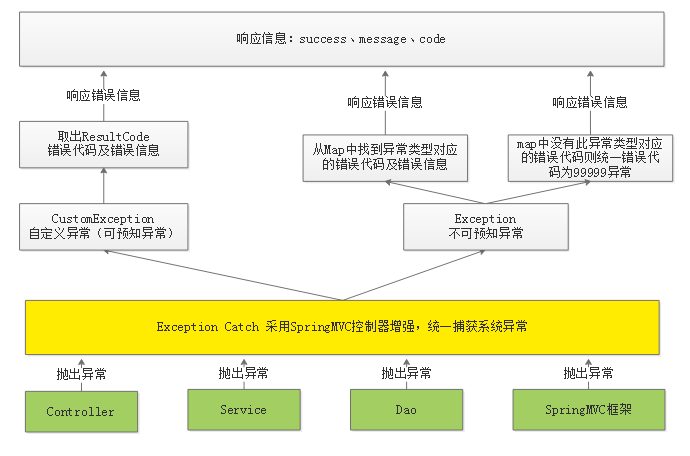

# ExceptionHandler

## 异常处理问题分析

```java
public CmsPageResult add(CmsPage cmsPage){
    //校验页面是否存在，根据页面名称、站点Id、页面webpath查询
    CmsPage page = cmsPageRepository.findBySiteIdAndPageNameAndPageWebPath(cmsPage.getSiteId(), 
                                                                           cmsPage.getPageName(), 
                                                                           cmsPage.getPageWebPath());
    if (page==null){
        cmsPage.setPageId(null);//为了让id自增
        cmsPageRepository.save(cmsPage);
        return new CmsPageResult(CommonCode.SUCCESS,cmsPage);
    } else {
        return new CmsPageResult(CommonCode.FAIL,null);
    }
}
```

问题：

- 只要操作不成功仅向用户返回“错误代码：11111，失败信息：操作失败”，无法区别具体的错误信息。
- service方法在执行过程出现异常在哪捕获？在service中需要都加try/catch，如果在controller也需要添加try/catch，代码冗余严重且不易维护。

解决方案：

* 在Service方法中的编码顺序是**先校验判断**，有问题则抛出具体的异常信息，**最后执行具体的业务操作**，返回成功信息。
* 在**统一异常处理类**中去**捕获**异常，无需Controller捕获异常，**向用户返回统一规范的响应信息**


## 异常抛出及处理流程

系统对异常的处理使用统一的异常处理流程：

* **自定义异常类型**，继承RuntimeException。自定义**错误代码及错误信息**。
* 对于**可预知的异常由程序员在代码中主动抛出**，由SpringMVC统一捕获。
    可预知异常是程序员在代码中手动抛出本系统定义的特定异常类型，由于是程序员抛出的异常，通常异常信息比较
    齐全，程序员在抛出时会指定错误代码及错误信息，获取异常信息也比较方便。
* 对于**不可预知的异常（运行时异常）**由**SpringMVC统一捕获**Exception类型的异常。
    不可预知异常通常是由于系统出现bug、或一些不要抗拒的错误（比如网络中断、服务器宕机等），异常类型为
    RuntimeException类型（运行时异常）。
* 可预知的异常及不可预知的运行时异常**最终会采用统一的信息格式**（错误代码+错误信息）来表示，最终也会随
    请求响应为JSON给客户端。



1. 在**Controller、Service、Dao中程序员抛出自定义异常**；SpringMVC框架抛出框架异常类型
2. 统一由**异常捕获类捕获异常**，并进行处理
3. 捕获到自定义异常则直接取出错误代码及错误信息，响应给用户。
4. 捕获到非自定义异常类型首先从Map中找该异常类型是否对应具体的错误代码，如果有则取出错误代码和错误信息并响应给用户，如果从Map中找不到异常类型所对应的错误代码则统一为99999错误代码并响应给用户。
5. 将错误代码及错误信息**以JSON格式响应给用户**


## 可预知异常处理

### 自定义异常类

```java
@NoArgsConstructor
@AllArgsConstructor// 由构造方法传入
@Getter// 提供get方法获取具体信息
public class CustomException extends RuntimeException {

    private IStatusCode iStatusCode;

}
```


### 异常抛出类

只是封装了`throw new xxx`

```java
public class ExceptionCast {
    
    public static void cast(ResultCode resultCode){
        throw new CustomException(resultCode);
    }
}
```


### 异常捕获类

```java
@ControllerAdvice//控制器增强
public class ExceptionCatch {

    private static final Logger LOGGER = LoggerFactory.getLogger(ExceptionCatch.class);

    //使用EXCEPTIONS存放异常类型和错误代码的映射，ImmutableMap的特点的一旦创建不可改变，并且线程安全
    private static ImmutableMap<Class<? extends Throwable>, ResultCode> EXCEPTIONS;
    //使用builder来构建一个异常类型和错误代码的异常
    protected static ImmutableMap.Builder<Class<? extends Throwable>, ResultCode> builder =
        ImmutableMap.builder();

    //在这里加入一些基础的异常类型判断。这里只添加了一个示例
    static {
        builder.put(HttpMessageNotReadableException.class, CommonCode.INVALID_PARAM);
    }

    @ExceptionHandler(CustomException.class)//捕获 CustomException异常
    @ResponseBody//返回JSON数据
    public ResponseResult customException(CustomException e) {
        LOGGER.error("catch exception:\n" + e.getMessage(), e);//catch到异常记录日志
        return new ResponseResult(e.getResultCode());
    }

    @ExceptionHandler(Exception.class)//捕获 Exception异常
    @ResponseBody//返回JSON数据
    public ResponseResult exception(Exception e) {
        LOGGER.error("catch exception:\n" + e.getMessage(), e);//catch到异常记录日志
        if (EXCEPTIONS == null) {
            EXCEPTIONS = builder.build();
        }
        ResponseResult responseResult;
        ResultCode resultCode = EXCEPTIONS.get(e.getClass());
        if (resultCode != null) {
            responseResult = new ResponseResult(resultCode);
        } else {
            responseResult = new ResponseResult(CommonCode.SERVER_ERROR);//99999异常
        }
        return responseResult;
    }
}
```


还需再启动类上注解要扫描异常类所在包

```java
@ComponentScan("top.conanan.framework")
```

或使用 @Componet 注解注册该Bean


## 不可预知异常处理

### 定义异常捕获方法

使用postman测试后端添加页面方法，不输入cmsPost信息，提交，报错信息如下：`org.springframework.http.converter.HttpMessageNotReadableException`

此异常是springMVC在进行参数转换时报的错误。响应状态码400等信息在客户端是无法解析的

在异常捕获类中添加对Exception类的捕获。代码查看上面的


### 异常捕获方法

针对上边的问题其解决方案是：

1. 我们在map中配置HttpMessageNotReadableException和错误代码。
2. 在异常捕获类中对Exception异常进行捕获，并从map中获取异常类型对应的错误代码，如果存在错误代码则返回此错误，否则统一返回99999错误。

具体的开发实现如下：

1. 在通用错误代码类CommCode中配置非法参数异常。用于添加到map集合中

    ```java
    INVALID_PARAM(false,10003,"非法参数！"),
    ```

2. 在异常捕获类中配置 HttpMessageNotReadableException 为非法参数异常。代码查看上面的5.3.3


## SpringMVC版

- SpringMVC在处理请求过程中出现异常信息交由异常处理器进行处理，自定义异常处理器可以实现一个系统的异常处理逻辑

- 思路：

    - 系统中异常包括两类：**预期异常**和运行时异常**RuntimeException**，前者通过捕获异常从而获取异常信息，后者主要通过规范代码开发、测试通过手段减少运行时异常的发生
    - 系统的dao、service、controller出现都通过throws Exception向上抛出，最后由SpringMVC**前端控制器交由异常处理器**进行异常处理

- **自定义异常类(继承Exception或RuntimeException)**：为了区别不同的异常,通常根据异常类型进行区分

    ```java
    public class MyException{
        public MyException(){};
        public MyException(String msg){
            super(msg);
        };
    }
    ```

- **自定义异常处理器(实现HandlerExceptionResolver)**，并**在`spring-config.xml`中配置或使用`@Component`**

    ```java
    @Component
    public class CustomExceptionResolver implements HandlerExceptionResolver {
       	//handler:异常处理器对象。发生异常的地方，包名+类名+方法名(形参)的字符串，用于日志
        @Override
        public ModelAndView resolveException(HttpServletRequest request, HttpServletResponse response, Object handler,Exception exception) {
            
            ModelAndView modelAndView = new ModelAndView();
            // 定义异常信息
            String msg = "";
    
            // 判断异常类型
            if (exception instanceof MyException) {
                // 如果是自定义异常，读取异常信息
                msg = exception.getMessage();
            } else {
                //简写
                msg = "服务器访问量过大，请您稍后..."
                //或 如果是运行时异常，则取错误堆栈，从堆栈中获取异常信息
                //Writer out = new StringWriter();
                //PrintWriter s = new PrintWriter(out);
                //exception.printStackTrace(s);
                //msg = out.toString();
    
            }
            // 把错误信息发给相关人员,邮件,短信等方式
            // 返回错误页面，给用户友好页面显示错误信息
           
            modelAndView.addObject("msg", msg);
            modelAndView.setViewName("error");
    
            return modelAndView;
        }
    }
    ```


